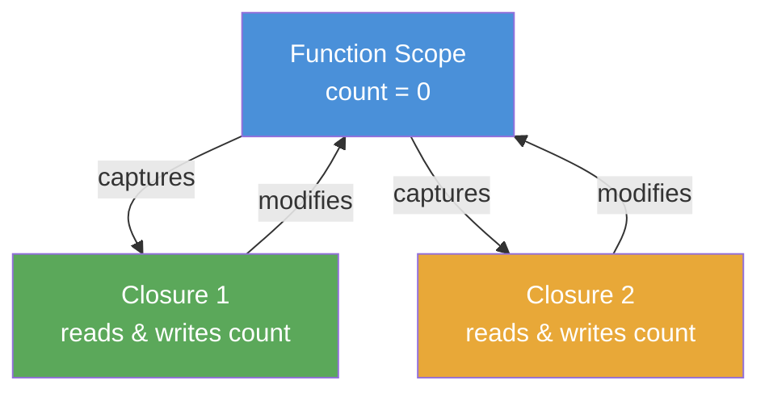
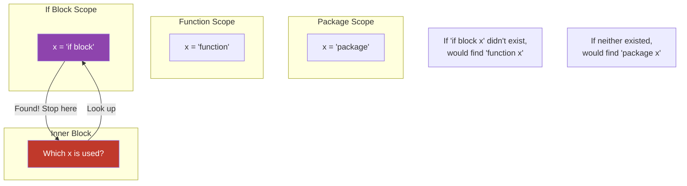

# Scope and Shadowing — Middle Level

## Table of Contents
1. [Introduction](#introduction)
2. [Prerequisites](#prerequisites)
3. [Evolution & Historical Context](#evolution--historical-context)
4. [Core Concepts (Deep Dive)](#core-concepts-deep-dive)
5. [Alternative Approaches](#alternative-approaches)
6. [Anti-Patterns](#anti-patterns)
7. [Debugging Guide](#debugging-guide)
8. [Comparison with Other Languages](#comparison-with-other-languages)
9. [Production Bugs from Shadowing](#production-bugs-from-shadowing)
10. [Linter Configuration](#linter-configuration)
11. [Closures and Scope](#closures-and-scope)
12. [Goroutine Loop Variable Bug](#goroutine-loop-variable-bug)
13. [Advanced Patterns](#advanced-patterns)
14. [Code Review Guide](#code-review-guide)
15. [Testing Scope-Related Bugs](#testing-scope-related-bugs)
16. [Edge Cases](#edge-cases)
17. [Best Practices](#best-practices)
18. [Cheat Sheet](#cheat-sheet)
19. [Self-Assessment Checklist](#self-assessment-checklist)
20. [Summary](#summary)
21. [Diagrams & Visual Aids](#diagrams--visual-aids)

---

## Introduction

> Focus: "Why does it matter in production?" and "How do I configure tools to catch it?"

By now you know what scope and shadowing are. At the middle level, the question is: **how does this cause real production bugs, how do you catch them in CI, and how do you design code to minimize the risk?**

Shadowing bugs are particularly nasty because:
- They **compile without errors**
- They **run without panics**
- They produce **wrong results silently**
- They often pass **unit tests** (because tests may not cover the exact wrong path)

This document covers the subtler aspects of scope: closures capturing variables, goroutines sharing loop variables, and how to configure `go vet` and `golangci-lint` to enforce shadow-free code.

---

## Prerequisites

- Completed junior level scope and shadowing concepts
- Familiarity with closures and goroutines
- Basic knowledge of Go tooling (go build, go test, go vet)
- Experience writing production Go code

---

## Evolution & Historical Context

### Go 1.0–1.21: The Loop Variable Problem
From Go's inception until 1.21, loop variables in `for` statements were shared across all iterations. This was a deliberate design decision for efficiency, but it created one of Go's most infamous gotchas:

```go
// Before Go 1.22: ALL goroutines capture the SAME i variable
funcs := make([]func(), 3)
for i := 0; i < 3; i++ {
    funcs[i] = func() { fmt.Println(i) }
}
for _, f := range funcs {
    f() // prints 3, 3, 3 — NOT 0, 1, 2
}
```

This behavior has caused countless bugs in real production systems for over a decade.

### Go 1.22 (February 2024): The Fix
Go 1.22 changed `for` loop semantics so that each iteration gets its **own copy** of the loop variable:

```go
// Go 1.22+: each iteration has its own i
funcs := make([]func(), 3)
for i := 0; i < 3; i++ {
    funcs[i] = func() { fmt.Println(i) }
}
for _, f := range funcs {
    f() // prints 0, 1, 2 — correct!
}
```

This fix requires `go 1.22` or later in your `go.mod` file.

### The `go vet -shadow` History
The shadow checker was part of `go vet` but was later moved to `golang.org/x/tools/go/analysis/passes/shadow` because it produced many false positives (intentional shadowing like `err` reuse was flagged). Today, it is opt-in via golangci-lint.

---

## Core Concepts (Deep Dive)

### The Multi-Return `:=` Rule (Critical)

One of the most misunderstood rules in Go:

```go
func example() (err error) {
    var x int

    // Case 1: x already exists, err is new → x is reassigned, err is new
    x, err := compute()  // valid: err is new

    // Case 2: both exist in current scope
    // x, err := compute()  // ERROR: no new variables on left side

    // Case 3: y is new, x exists → y is new, x is reassigned
    y, x := compute2()  // valid: y is new
    _ = y
    _ = x
    return
}
```

The critical rule: **at least one variable on the left of `:=` must be new in the current scope**. Existing variables are reassigned (not shadowed).

BUT — this only applies within the **same scope**. In an inner scope, `:=` always creates a new variable:

```go
func tricky() {
    err := errors.New("outer")

    {
        // In this NEW scope, err is not yet declared
        // So := creates a NEW err here
        result, err := compute()  // NEW err — shadows outer err!
        if err != nil {
            fmt.Println(result, err) // uses inner err
        }
    }

    fmt.Println(err) // outer err — "outer"
}
```

### Named Return Values and Shadowing

Named return values create variables in function scope. They can be accidentally shadowed:

```go
// BUG: named return 'result' is shadowed
func compute() (result int, err error) {
    if true {
        result, err := heavyComputation() // NEW result and err!
        _ = result  // shadows named return
        _ = err
    }
    return // returns zero value for result, nil for err
}

// CORRECT: use = not :=
func computeCorrect() (result int, err error) {
    if true {
        result, err = heavyComputation() // assigns to named returns
    }
    return
}
```

### Blank Identifier and Scope

The blank identifier `_` is special — it is never declared and never shadows anything:

```go
// This is fine — _ never creates a variable
x, _ := compute()
y, _ := compute()
_ = x
_ = y
```

---

## Alternative Approaches

### Approach 1: Early Return Pattern (Reduces Nesting)

Instead of deeply nested blocks (which create shadowing opportunities), use early returns:

```go
// Deeply nested — shadow-prone
func processOrder(order Order) error {
    if order.Valid() {
        user, err := getUser(order.UserID)
        if err == nil {
            payment, err := chargeUser(user, order.Amount) // shadows err!
            if err == nil {
                err := sendConfirmation(user, payment) // shadows again!
                if err != nil {
                    return err
                }
            }
        }
        return err
    }
    return ErrInvalidOrder
}

// Early return — flat, no shadowing
func processOrderClean(order Order) error {
    if !order.Valid() {
        return ErrInvalidOrder
    }

    user, err := getUser(order.UserID)
    if err != nil {
        return fmt.Errorf("get user: %w", err)
    }

    payment, err := chargeUser(user, order.Amount) // reuses err
    if err != nil {
        return fmt.Errorf("charge: %w", err)
    }

    if err := sendConfirmation(user, payment); err != nil {
        return fmt.Errorf("confirm: %w", err)
    }

    return nil
}
```

### Approach 2: Scoped if Initializer

Use Go's `if init; condition` to scope a variable tightly:

```go
// Variable lives only inside the if block
if conn, err := net.Dial("tcp", addr); err != nil {
    log.Fatal(err)
} else {
    defer conn.Close()
    doWork(conn)
}
```

### Approach 3: Wrap in Helper Functions

Break out inner blocks into named functions:

```go
// Instead of nested blocks with shadowing risk:
func handleEvent(e Event) {
    if shouldProcess(e) {
        processEvent(e) // inner logic extracted
    }
}

func processEvent(e Event) {
    result, err := transform(e)
    if err != nil {
        log.Printf("transform: %v", err)
        return
    }
    saveResult(result)
}
```

---

## Anti-Patterns

### Anti-Pattern 1: The Shadowed Accumulator

```go
// BUG: total is reset each iteration
func sumSlice(nums []int) int {
    total := 0
    for _, n := range nums {
        total := total + n // := creates new total every iteration!
        _ = total
    }
    return total // always 0
}

// FIX:
func sumSliceFixed(nums []int) int {
    total := 0
    for _, n := range nums {
        total += n // correct
    }
    return total
}
```

### Anti-Pattern 2: Cascading err Shadows

```go
// BUG: each err is a new variable
func multiStep() error {
    err := step1()
    if err != nil {
        err := step2() // shadows!
        if err != nil {
            err := step3() // shadows again!
            return err     // returns step3's error only
        }
    }
    return err // always nil if step1 succeeded
}

// FIX: use err consistently
func multiStepFixed() error {
    if err := step1(); err != nil {
        return fmt.Errorf("step1: %w", err)
    }
    if err := step2(); err != nil {
        return fmt.Errorf("step2: %w", err)
    }
    if err := step3(); err != nil {
        return fmt.Errorf("step3: %w", err)
    }
    return nil
}
```

### Anti-Pattern 3: Context Shadow

```go
// BUG: ctx is shadowed in goroutine
func handler(ctx context.Context) {
    go func() {
        ctx, cancel := context.WithTimeout(ctx, 5*time.Second)
        defer cancel()
        doWork(ctx)
    }()
    // outer ctx is unaffected but now inner goroutine uses a
    // derived context — this may be intentional OR a bug
}

// Explicit naming removes ambiguity:
func handlerClear(ctx context.Context) {
    go func() {
        timeoutCtx, cancel := context.WithTimeout(ctx, 5*time.Second)
        defer cancel()
        doWork(timeoutCtx)
    }()
}
```

### Anti-Pattern 4: Package Name Shadow

```go
import (
    "fmt"
    "os"
)

func badNames() {
    fmt := "some string"   // shadows fmt package
    os := struct{}{}        // shadows os package
    _ = fmt
    _ = os
    // Can no longer use fmt.Println or os.Exit!
}
```

---

## Debugging Guide

### Step 1: Run go vet with shadow

```bash
# Install shadow analyzer
go install golang.org/x/tools/go/analysis/passes/shadow/cmd/shadow@latest

# Run on your package
shadow ./...

# Or via go vet
go vet -vettool=$(which shadow) ./...
```

### Step 2: Use golangci-lint

```yaml
# .golangci.yml
linters:
  enable:
    - govet
    - shadow

linters-settings:
  govet:
    enable:
      - shadow
```

```bash
golangci-lint run ./...
```

### Step 3: Manual Inspection Checklist

When debugging a suspected shadow bug, look for:
1. Functions with deep nesting (3+ levels of `{}`)
2. `err` used in multiple nested if blocks with `:=`
3. Loop bodies that declare variables with the same name as outer variables
4. Goroutine closures that capture loop variables

### Step 4: Add Explicit Tests

```go
func TestNoShadowBug(t *testing.T) {
    // If your function is broken by shadowing,
    // this test will catch it
    result := sumSlice([]int{1, 2, 3, 4, 5})
    if result != 15 {
        t.Errorf("expected 15, got %d", result)
    }
}
```

### Step 5: Use Printf Debugging with Variable Addresses

```go
x := 1
fmt.Printf("outer x addr: %p, value: %d\n", &x, x)
if true {
    x := 2
    fmt.Printf("inner x addr: %p, value: %d\n", &x, x)
    // Different addresses confirm they are different variables!
}
fmt.Printf("outer x after: %p, value: %d\n", &x, x)
```

---

## Comparison with Other Languages

| Language | Scope Type | Shadowing | Loop Variable |
|----------|-----------|-----------|---------------|
| Go | Block scope | Allowed (silent) | Per-iteration since 1.22 |
| Python | Function scope (LEGB) | Allowed | Shared (same as pre-1.22 Go) |
| JavaScript | Block scope (let/const) | Allowed | Each iteration has own copy |
| Java | Block scope | Not allowed (compile error) | Each iteration has own copy |
| Rust | Block scope | Allowed (explicit, idiomatic) | Per-iteration by default |
| C++ | Block scope | Allowed (warning) | Shared (same as pre-1.22 Go) |

### Go vs Python
Python uses LEGB (Local, Enclosing, Global, Built-in) rule — similar to Go but with function-level rather than block-level scoping for local variables. In Python, a bare assignment in an `if` block creates a function-level variable, not a block-level one.

```python
# Python: x is function-scoped even if assigned in an if block
x = 1
if True:
    x = 2  # modifies the SAME x
print(x)  # 2 — different from Go!
```

### Go vs Java
Java does NOT allow shadowing of variables in nested scopes — it is a compile error. This is stricter but eliminates the bug class entirely.

```java
// Java: compile error!
int x = 1;
if (true) {
    int x = 2; // ERROR: variable x is already defined
}
```

### Go vs Rust
Rust explicitly embraces shadowing as a feature — it is idiomatic for narrowing types:

```rust
// Rust: intentional shadowing with type change
let x = 5;
let x = x + 1;  // intentional: redefines x as 6
let x = x.to_string();  // now x is a String
```

---

## Production Bugs from Shadowing

### Real-World Bug 1: Lost Database Transaction

```go
// BUG seen in production — transaction never committed
func transferMoney(from, to int, amount float64) error {
    tx, err := db.Begin()
    if err != nil {
        return err
    }
    defer tx.Rollback()

    if err := debitAccount(tx, from, amount); err != nil {
        return err
    }

    if err := creditAccount(tx, to, amount); err != nil {
        return err
    }

    // BUG: err here is a NEW variable from the if initializer above!
    // The intent was to commit and check for error
    err := tx.Commit() // COMPILE ERROR actually — err already declared
    // If written as: if err := tx.Commit(); err != nil { ... }
    // then the outer err is never updated

    return err // might return nil even if Commit failed
}

// CORRECT:
func transferMoneyFixed(from, to int, amount float64) error {
    tx, err := db.Begin()
    if err != nil {
        return err
    }
    defer tx.Rollback()

    if err = debitAccount(tx, from, amount); err != nil {
        return err
    }

    if err = creditAccount(tx, to, amount); err != nil {
        return err
    }

    err = tx.Commit()
    return err
}
```

### Real-World Bug 2: Security Token Never Validated

```go
// BUG: authorized is shadowed, security check bypassed
func checkAccess(tokenStr string, resource string) bool {
    authorized := false

    if token, err := parseToken(tokenStr); err == nil {
        authorized := hasPermission(token, resource) // shadows outer!
        _ = authorized // inner authorized is unused-ish
    }

    return authorized // always false!
}
```

### Real-World Bug 3: Goroutine Loop Capture

```go
// Classic production bug — all goroutines log the same (final) URL
urls := []string{"a.com", "b.com", "c.com"}
for _, url := range urls {
    go func() {
        fetchAndLog(url) // captures url by reference
    }()
}
// All goroutines see the last value of url
```

---

## Linter Configuration

### golangci-lint (Recommended)

```yaml
# .golangci.yml
run:
  timeout: 5m

linters:
  enable:
    - govet
    - staticcheck
    - gocritic

linters-settings:
  govet:
    enable:
      - shadow
  gocritic:
    enabled-checks:
      - appendAssign
      - sloppyReassign
```

### Running the Shadow Linter

```bash
# Install golangci-lint
brew install golangci-lint  # macOS
# or
go install github.com/golangci/golangci-lint/cmd/golangci-lint@latest

# Run
golangci-lint run --enable-all ./...

# Run only shadow checker
golangci-lint run --disable-all --enable govet ./...
```

### Pre-commit Hook

```bash
#!/bin/sh
# .git/hooks/pre-commit
golangci-lint run ./...
if [ $? -ne 0 ]; then
    echo "Linting failed. Fix issues before committing."
    exit 1
fi
```

### CI/CD Integration (GitHub Actions)

```yaml
# .github/workflows/lint.yml
name: Lint
on: [push, pull_request]

jobs:
  lint:
    runs-on: ubuntu-latest
    steps:
      - uses: actions/checkout@v4
      - uses: actions/setup-go@v5
        with:
          go-version: '1.22'
      - name: golangci-lint
        uses: golangci/golangci-lint-action@v4
        with:
          version: latest
          args: --enable-all
```

---

## Closures and Scope

Closures are functions that **capture variables from their enclosing scope**. This is where scope understanding becomes critical.

### Basic Closure Capture

```go
func makeCounter() func() int {
    count := 0  // captured by the closure
    return func() int {
        count++  // modifies the captured variable
        return count
    }
}

func main() {
    c := makeCounter()
    fmt.Println(c()) // 1
    fmt.Println(c()) // 2
    fmt.Println(c()) // 3
}
```

### Multiple Closures Sharing a Variable

```go
func makeAdder(base int) (add func(int), reset func()) {
    sum := base
    add = func(n int) {
        sum += n  // both closures share the same sum variable
    }
    reset = func() {
        sum = base  // resets to original base
    }
    return
}
```

### The Classic Goroutine Loop Bug

```go
// BUG (before Go 1.22):
for i := 0; i < 3; i++ {
    go func() {
        fmt.Println(i) // captures i by reference
    }()
}
// Output: 3 3 3 (goroutines run after loop ends, i=3)

// FIX 1: pass i as argument
for i := 0; i < 3; i++ {
    go func(n int) {
        fmt.Println(n) // n is a copy
    }(i)
}

// FIX 2: create a new variable each iteration
for i := 0; i < 3; i++ {
    i := i // shadow loop var — creates a new i each iteration
    go func() {
        fmt.Println(i)
    }()
}

// FIX 3 (Go 1.22+): default behavior, no extra code needed
// go.mod: go 1.22
for i := 0; i < 3; i++ {
    go func() {
        fmt.Println(i) // prints 0, 1, 2 correctly
    }()
}
```

### Range Loop Closure Bug

```go
// BUG: all closures capture the same url variable
urls := []string{"http://a.com", "http://b.com"}
var wg sync.WaitGroup
for _, url := range urls {
    wg.Add(1)
    go func() {
        defer wg.Done()
        resp, err := http.Get(url) // captures url by ref!
        if err != nil {
            log.Println(err)
            return
        }
        log.Println(resp.Status)
    }()
}
wg.Wait()

// FIX: pass as argument
for _, url := range urls {
    wg.Add(1)
    go func(u string) {
        defer wg.Done()
        resp, err := http.Get(u)
        if err != nil {
            log.Println(err)
            return
        }
        log.Println(resp.Status)
    }(url)
}
wg.Wait()
```

---

## Advanced Patterns

### Pattern: Using Shadowing Intentionally for Type Assertions

```go
// Intentional shadowing: narrowing interface type
func process(v interface{}) {
    if v, ok := v.(string); ok {
        // v is now string, not interface{}
        fmt.Println("string:", v)
        return
    }
    if v, ok := v.(int); ok {
        // v is now int
        fmt.Println("int:", v)
        return
    }
}
```

### Pattern: Scoped Context with Cancel

```go
func handleRequest(ctx context.Context, req Request) error {
    // Create derived context — use a different name to be explicit
    reqCtx, cancel := context.WithTimeout(ctx, 30*time.Second)
    defer cancel()

    result, err := processWithContext(reqCtx, req)
    if err != nil {
        return err
    }

    return sendResponse(reqCtx, result)
}
```

### Pattern: Shadow for Immutable-ish Variables

```go
// Re-declare as narrower type at each pipeline stage
func pipeline(rawInput []byte) (Output, error) {
    parsed, err := parse(rawInput)
    if err != nil {
        return Output{}, err
    }

    validated, err := validate(parsed)
    if err != nil {
        return Output{}, err
    }

    result, err := transform(validated)
    if err != nil {
        return Output{}, err
    }

    return result, nil
}
```

---

## Code Review Guide

When reviewing Go code for scope/shadowing issues, check:

### Checklist: Shadowing Red Flags

```
[ ] Any function with 4+ levels of nesting
[ ] `err` declared multiple times with := in the same function
[ ] Loop bodies that use := with outer variable names
[ ] Goroutine closures that reference loop variables
[ ] Named return values reassigned with := in inner blocks
[ ] Package names (fmt, os, io, http) used as variable names
[ ] Built-in names (len, cap, make, new) used as variable names
[ ] Variables named 'result', 'data', 'value' in deeply nested code
[ ] Context variables shadowed in goroutines
```

### Review Comment Template

```
This variable `err` is being shadowed. The `:=` on line X creates a new
`err` in the inner scope, so the outer `err` is unchanged.

If you intend to update the outer `err`, use `=` instead of `:=`.
If you intend a new error variable, consider naming it `err2` or
something more descriptive like `validateErr`.
```

---

## Testing Scope-Related Bugs

### Test Strategy for Shadow Bugs

```go
// Test that verifies the function doesn't silently swallow errors
func TestProcessMultiStep_PropagatesAllErrors(t *testing.T) {
    tests := []struct {
        name    string
        step1   error
        step2   error
        wantErr bool
    }{
        {"step1 fails", errors.New("s1"), nil, true},
        {"step2 fails", nil, errors.New("s2"), true},
        {"both pass", nil, nil, false},
        {"both fail", errors.New("s1"), errors.New("s2"), true},
    }

    for _, tt := range tests {
        t.Run(tt.name, func(t *testing.T) {
            // inject errors via mocks
            err := processMultiStep(mockStep1(tt.step1), mockStep2(tt.step2))
            if (err != nil) != tt.wantErr {
                t.Errorf("got err=%v, wantErr=%v", err, tt.wantErr)
            }
        })
    }
}
```

---

## Edge Cases

### Edge Case 1: Blank Identifier Never Shadows

```go
x := 1
_ = x
{
    _ = 2      // _ is not a variable — never shadows
    fmt.Println(x) // still 1
}
```

### Edge Case 2: Constants Cannot Be Shadowed Across Blocks

Actually, constants CAN be shadowed the same way as variables:

```go
const maxRetries = 3

func retry() {
    if testing {
        maxRetries := 1  // shadows the constant!
        _ = maxRetries
    }
}
```

### Edge Case 3: Type Declarations Shadow

```go
type error interface { Error() string } // shadows built-in error!

// Now the built-in error interface is shadowed in this package scope
```

### Edge Case 4: Function Literal in Switch

```go
result := 0
switch v := getValue(); {
case v > 10:
    result := v * 2  // shadows outer result!
    _ = result
case v > 0:
    result = v  // assigns to outer result (= not :=)
}
fmt.Println(result) // only updated if case v > 0
```

---

## Best Practices

### 1. Prefer Linear Code Over Nesting

The deeper the nesting, the more shadow-prone the code. Refactor:

```go
// Before: 3 levels of nesting
func before(a, b, c bool) string {
    if a {
        if b {
            if c {
                return "all true"
            }
        }
    }
    return "not all true"
}

// After: linear
func after(a, b, c bool) string {
    if !a || !b || !c {
        return "not all true"
    }
    return "all true"
}
```

### 2. Avoid Reusing Generic Variable Names

```go
// Risky: 'result' is ambiguous in nested code
result := step1()
if result != nil {
    result := process(result) // shadow!
    _ = result
}

// Better: descriptive names
rawData := step1()
if rawData != nil {
    processedData := process(rawData)
    _ = processedData
}
```

### 3. Always Use `=` for `err` in Sequential Operations

```go
// Good pattern: err is declared once, reused with =
func sequential() error {
    conn, err := openConnection()
    if err != nil {
        return err
    }
    defer conn.Close()

    data, err := conn.Query("SELECT...") // = not :=, reuses err
    if err != nil {
        return err
    }

    _, err = processData(data) // = not :=
    return err
}
```

### 4. Use `go.mod` 1.22 for Loop Safety

```
module myproject

go 1.22
```

With this, you no longer need the `i := i` workaround in loops.

---

## Cheat Sheet

```
SHADOW DETECTION COMMANDS:
  go vet -vettool=$(which shadow) ./...
  golangci-lint run --enable-all ./...
  staticcheck ./...

COMMON SHADOW PATTERNS TO AVOID:
  if err != nil {
      err := handleErr(err)  // BAD: new err
      err = handleErr(err)   // GOOD: reuse err
  }

  for i := 0; i < n; i++ {
      go func() { use(i) }()  // BAD: captures reference (pre-1.22)
      go func(i int) { use(i) }(i)  // GOOD: passes copy
  }

  // Intentional shadow (type narrowing) — document it:
  if v, ok := iface.(string); ok { use(v) }

GO 1.22 LOOP CHANGE:
  Before: loop variable shared across iterations
  After:  each iteration gets its own copy
  Requires: go 1.22 in go.mod
```

---

## Self-Assessment Checklist

- [ ] I can explain the multi-return `:=` reuse rule
- [ ] I know the difference between `=` and `:=` in sequential error handling
- [ ] I understand how closures capture variables by reference
- [ ] I can explain the goroutine loop capture bug and its three fixes
- [ ] I know what changed in Go 1.22 regarding loop variables
- [ ] I can configure golangci-lint to detect shadowing
- [ ] I can write a code review comment explaining a shadow bug
- [ ] I understand why named return values can be accidentally shadowed

---

## Summary

At the middle level, scope and shadowing require attention in three key areas:

1. **Production patterns**: The `err` shadow in sequential operations is the #1 Go production bug from shadowing. Use `=` for sequential error handling.

2. **Goroutine loops**: Before Go 1.22, all goroutines in a loop captured the same loop variable. The fix is to pass the variable as an argument or use Go 1.22+.

3. **Tooling**: Configure `golangci-lint` with shadow detection in CI to catch these issues before they reach production. The shadow linter finds violations automatically.

The golden rule: **if you mean to update a variable, use `=`. If you mean to create a new one, use `:=`. When in doubt, use a different name.**

---

## Diagrams & Visual Aids

### Diagram 1: Closure Variable Capture



### Diagram 2: Goroutine Loop Variable Bug (Pre-1.22)

```mermaid
sequenceDiagram
    participant Loop as For Loop
    participant i as Loop Variable i
    participant G1 as Goroutine 1
    participant G2 as Goroutine 2
    participant G3 as Goroutine 3

    Loop->>i: i = 0
    Loop->>G1: launch (captures ref to i)
    Loop->>i: i = 1
    Loop->>G2: launch (captures ref to i)
    Loop->>i: i = 2
    Loop->>G3: launch (captures ref to i)
    Loop->>i: i = 3 (loop ends)

    Note over G1,G3: Goroutines run now...
    G1->>i: read i → 3
    G2->>i: read i → 3
    G3->>i: read i → 3

    Note over G1,G3: All print 3!
```

### Diagram 3: Shadow Scope Chain Resolution


