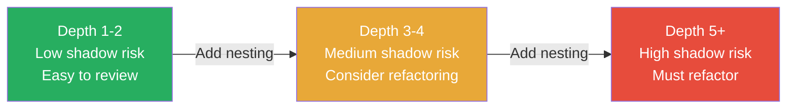
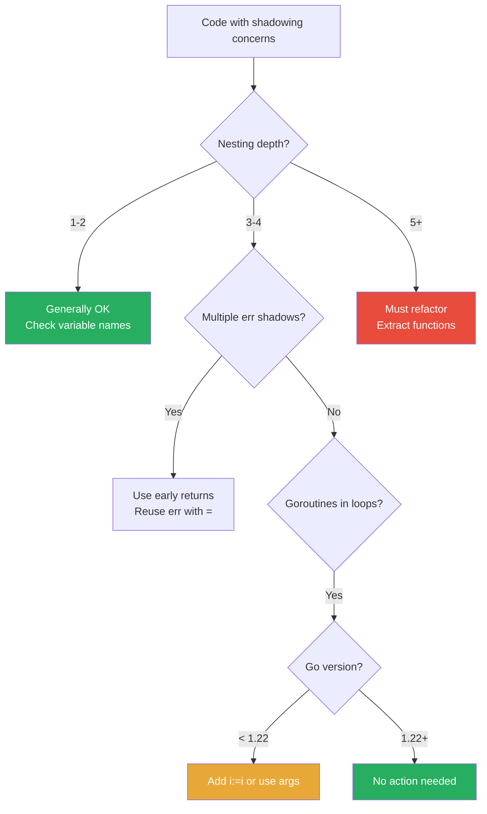

# Scope and Shadowing — Optimization Exercises

## Introduction

These exercises focus on transforming code that is correct but poorly structured — with excessive nesting, shadow-prone patterns, inefficient closure usage, or outdated goroutine patterns — into clean, efficient, and maintainable Go code.

Each exercise has:
- **Problem**: What is wrong with the code (beyond just shadowing)
- **Goal**: What the refactored code should achieve
- **Starter code**: Working but suboptimal code
- **Solution**: Clean refactored version in `<details>` tags

---

## Exercise 1: Flatten Deeply Nested Error Handling

**Problem:** The function has 5 levels of nesting, creating multiple shadow-prone zones and making the logic hard to follow.

**Goal:** Refactor using early returns to achieve a flat, linear structure with no shadowing.

**Starter code:**

```go
package main

import (
    "errors"
    "fmt"
    "strings"
)

type Order struct {
    ID       string
    UserID   string
    Items    []string
    Total    float64
    Coupon   string
}

func validateOrder(o Order) error { return nil }
func getUser(id string) (string, error) { return "Alice", nil }
func applyDiscount(total float64, coupon string) (float64, error) {
    if coupon == "INVALID" {
        return total, errors.New("invalid coupon")
    }
    return total * 0.9, nil
}
func chargeUser(user string, amount float64) error { return nil }
func sendReceipt(user, orderID string, amount float64) error { return nil }

// Original: deeply nested, shadow-prone
func processOrder(order Order) error {
    if err := validateOrder(order); err == nil {
        if user, err := getUser(order.UserID); err == nil {
            finalTotal := order.Total
            if order.Coupon != "" {
                if discounted, err := applyDiscount(order.Total, order.Coupon); err == nil {
                    finalTotal = discounted
                } else {
                    return fmt.Errorf("discount: %w", err)
                }
            }
            if err := chargeUser(user, finalTotal); err == nil {
                if err := sendReceipt(user, order.ID, finalTotal); err == nil {
                    fmt.Printf("order %s processed for %s: $%.2f\n",
                        order.ID, user, finalTotal)
                    return nil
                } else {
                    return fmt.Errorf("receipt: %w", err)
                }
            } else {
                return fmt.Errorf("charge: %w", err)
            }
        } else {
            return fmt.Errorf("get user: %w", err)
        }
    } else {
        return fmt.Errorf("validate: %w", err)
    }
    return nil
}

func main() {
    order := Order{
        ID:     "ORD-001",
        UserID: "USR-42",
        Items:  []string{"book", "pen"},
        Total:  100.0,
        Coupon: "SALE10",
    }
    if err := processOrder(order); err != nil {
        fmt.Println("error:", err)
    }
    _ = strings.ToUpper // suppress import error
}
```

<details>
<summary>Solution — Flat Early Return Pattern</summary>

```go
func processOrder(order Order) error {
    if err := validateOrder(order); err != nil {
        return fmt.Errorf("validate: %w", err)
    }

    user, err := getUser(order.UserID)
    if err != nil {
        return fmt.Errorf("get user: %w", err)
    }

    finalTotal := order.Total
    if order.Coupon != "" {
        finalTotal, err = applyDiscount(order.Total, order.Coupon)
        if err != nil {
            return fmt.Errorf("discount: %w", err)
        }
    }

    if err = chargeUser(user, finalTotal); err != nil {
        return fmt.Errorf("charge: %w", err)
    }

    if err = sendReceipt(user, order.ID, finalTotal); err != nil {
        return fmt.Errorf("receipt: %w", err)
    }

    fmt.Printf("order %s processed for %s: $%.2f\n", order.ID, user, finalTotal)
    return nil
}
```

**Improvements:**
- 5 levels of nesting → 1 level
- 0 shadowed variables
- Error handling reads top-to-bottom
- Each step is clearly visible
- `err` is reused with `=` safely after initial declaration

</details>

---

## Exercise 2: Fix Goroutine Loop Capture for Pre-1.22 and 1.22

**Problem:** A concurrent image processor captures loop variables by reference, producing wrong results. Provide two solutions: one for pre-Go 1.22 and one for Go 1.22.

**Goal:** Each goroutine should process its own image. Demonstrate all modern patterns.

**Starter code:**

```go
package main

import (
    "fmt"
    "sync"
    "time"
)

type Image struct {
    ID       int
    Filename string
    Width    int
    Height   int
}

type ProcessedImage struct {
    OriginalID   int
    ThumbnailURL string
}

func processImage(img Image) ProcessedImage {
    time.Sleep(10 * time.Millisecond) // simulate work
    return ProcessedImage{
        OriginalID:   img.ID,
        ThumbnailURL: fmt.Sprintf("/thumb/%s", img.Filename),
    }
}

// BUGGY: loop variable capture
func processImages(images []Image) []ProcessedImage {
    results := make([]ProcessedImage, len(images))
    var wg sync.WaitGroup
    var mu sync.Mutex

    for i, img := range images {
        wg.Add(1)
        go func() {
            defer wg.Done()
            processed := processImage(img)    // BUG: captures img by ref
            mu.Lock()
            results[i] = processed            // BUG: captures i by ref
            mu.Unlock()
        }()
    }

    wg.Wait()
    return results
}

func main() {
    images := []Image{
        {ID: 1, Filename: "cat.jpg", Width: 1920, Height: 1080},
        {ID: 2, Filename: "dog.jpg", Width: 1280, Height: 720},
        {ID: 3, Filename: "bird.jpg", Width: 800, Height: 600},
    }

    results := processImages(images)
    for _, r := range results {
        fmt.Printf("ID: %d, Thumb: %s\n", r.OriginalID, r.ThumbnailURL)
    }
}
```

<details>
<summary>Solution — Three Versions</summary>

**Version 1: Pre-Go 1.22 — Argument passing**
```go
func processImagesV1(images []Image) []ProcessedImage {
    results := make([]ProcessedImage, len(images))
    var wg sync.WaitGroup

    for i, img := range images {
        wg.Add(1)
        go func(idx int, image Image) {
            defer wg.Done()
            results[idx] = processImage(image)
        }(i, img)
    }

    wg.Wait()
    return results
}
```

**Version 2: Pre-Go 1.22 — Loop variable copy**
```go
func processImagesV2(images []Image) []ProcessedImage {
    results := make([]ProcessedImage, len(images))
    var wg sync.WaitGroup

    for i, img := range images {
        i, img := i, img // per-iteration copies
        wg.Add(1)
        go func() {
            defer wg.Done()
            results[i] = processImage(img)
        }()
    }

    wg.Wait()
    return results
}
```

**Version 3: Go 1.22 — Default behavior, clean code**
```go
// go.mod: go 1.22
func processImagesV3(images []Image) []ProcessedImage {
    results := make([]ProcessedImage, len(images))
    var wg sync.WaitGroup

    for i, img := range images {
        wg.Add(1)
        go func() {
            defer wg.Done()
            results[i] = processImage(img) // safe: per-iteration variables
        }()
    }

    wg.Wait()
    return results
}
```

**Note:** Writing to `results[i]` from different goroutines is safe as long as each goroutine writes to a unique index. The mutex is not needed here since indices don't overlap.

</details>

---

## Exercise 3: Simplify Error Handling to Avoid Shadow Traps

**Problem:** A multi-step file transformation function uses inconsistent error handling that creates shadow opportunities.

**Goal:** Refactor to a consistent pattern where `err` is never shadowed.

**Starter code:**

```go
package main

import (
    "encoding/json"
    "fmt"
    "os"
    "strings"
)

type RawRecord struct {
    ID   int    `json:"id"`
    Name string `json:"name"`
    Age  int    `json:"age"`
}

type CleanRecord struct {
    ID   int
    Name string
    Age  int
}

func transformRecord(r RawRecord) (CleanRecord, error) {
    if r.Age < 0 || r.Age > 150 {
        return CleanRecord{}, fmt.Errorf("invalid age: %d", r.Age)
    }
    return CleanRecord{
        ID:   r.ID,
        Name: strings.TrimSpace(r.Name),
        Age:  r.Age,
    }, nil
}

// PROBLEMATIC: inconsistent err handling
func processDataFile(inputPath, outputPath string) error {
    // Step 1: read
    data, err := os.ReadFile(inputPath)
    if err != nil {
        return fmt.Errorf("read: %w", err)
    }

    // Step 2: parse — uses if-init but then re-declares err
    var records []RawRecord
    if err := json.Unmarshal(data, &records); err != nil { // shadows!
        return fmt.Errorf("parse: %w", err)
    }

    // Step 3: transform
    cleaned := make([]CleanRecord, 0, len(records))
    for _, r := range records {
        if clean, err := transformRecord(r); err != nil { // shadows again!
            return fmt.Errorf("transform record %d: %w", r.ID, err)
        } else {
            cleaned = append(cleaned, clean)
        }
    }

    // Step 4: marshal
    var out []byte
    if out, err = json.Marshal(cleaned); err != nil { // fine — uses outer err
        return fmt.Errorf("marshal: %w", err)
    }

    // Step 5: write
    if err = os.WriteFile(outputPath, out, 0644); err != nil {
        return fmt.Errorf("write: %w", err)
    }

    fmt.Printf("processed %d records from %s to %s\n",
        len(cleaned), inputPath, outputPath)
    return nil
}

func main() {
    input := `[{"id":1,"name":"Alice","age":30},{"id":2,"name":"Bob","age":25}]`
    os.WriteFile("input.json", []byte(input), 0644)
    defer os.Remove("input.json")
    defer os.Remove("output.json")

    if err := processDataFile("input.json", "output.json"); err != nil {
        fmt.Println("error:", err)
    }
}
```

<details>
<summary>Solution — Consistent Error Handling</summary>

```go
func processDataFile(inputPath, outputPath string) error {
    data, err := os.ReadFile(inputPath)
    if err != nil {
        return fmt.Errorf("read: %w", err)
    }

    var records []RawRecord
    if err = json.Unmarshal(data, &records); err != nil {
        return fmt.Errorf("parse: %w", err)
    }

    cleaned, err := transformAllRecords(records)
    if err != nil {
        return err
    }

    out, err := json.Marshal(cleaned)
    if err != nil {
        return fmt.Errorf("marshal: %w", err)
    }

    if err = os.WriteFile(outputPath, out, 0644); err != nil {
        return fmt.Errorf("write: %w", err)
    }

    fmt.Printf("processed %d records from %s to %s\n",
        len(cleaned), inputPath, outputPath)
    return nil
}

// Extracted: loop with error handling in its own function
func transformAllRecords(records []RawRecord) ([]CleanRecord, error) {
    cleaned := make([]CleanRecord, 0, len(records))
    for _, r := range records {
        clean, err := transformRecord(r)
        if err != nil {
            return nil, fmt.Errorf("transform record %d: %w", r.ID, err)
        }
        cleaned = append(cleaned, clean)
    }
    return cleaned, nil
}
```

**Key improvements:**
- `err` declared once with `:=`, reused with `=`
- Loop logic extracted to `transformAllRecords`
- No shadowing anywhere
- Consistent `if err != nil` pattern

</details>

---

## Exercise 4: Refactor Excessive Nesting in HTTP Handler

**Problem:** An HTTP handler has 6 levels of nesting with shadow risks at each level.

**Goal:** Flatten to at most 2 levels using early returns and helper functions.

**Starter code:**

```go
package main

import (
    "encoding/json"
    "errors"
    "fmt"
    "net/http"
)

type CreateProductRequest struct {
    Name     string  `json:"name"`
    Price    float64 `json:"price"`
    Category string  `json:"category"`
    Stock    int     `json:"stock"`
}

type Product struct {
    ID       int
    Name     string
    Price    float64
    Category string
    Stock    int
}

var errInvalidCategory = errors.New("invalid category")

func validCategories() []string {
    return []string{"electronics", "clothing", "food", "books"}
}

func createProduct(req CreateProductRequest) (Product, error) {
    return Product{ID: 1, Name: req.Name, Price: req.Price}, nil
}

// 6 levels deep — needs refactoring
func createProductHandler(w http.ResponseWriter, r *http.Request) {
    if r.Method == http.MethodPost {
        var req CreateProductRequest
        if err := json.NewDecoder(r.Body).Decode(&req); err == nil {
            if req.Name != "" {
                if req.Price > 0 {
                    validCat := false
                    for _, cat := range validCategories() {
                        if cat == req.Category {
                            validCat = true
                            break
                        }
                    }
                    if validCat {
                        if product, err := createProduct(req); err == nil {
                            w.Header().Set("Content-Type", "application/json")
                            w.WriteHeader(http.StatusCreated)
                            json.NewEncoder(w).Encode(product)
                        } else {
                            http.Error(w, err.Error(), http.StatusInternalServerError)
                        }
                    } else {
                        http.Error(w, "invalid category", http.StatusBadRequest)
                    }
                } else {
                    http.Error(w, "price must be positive", http.StatusBadRequest)
                }
            } else {
                http.Error(w, "name is required", http.StatusBadRequest)
            }
        } else {
            http.Error(w, "invalid request body", http.StatusBadRequest)
        }
    } else {
        http.Error(w, "method not allowed", http.StatusMethodNotAllowed)
    }
}

func main() {
    fmt.Println("handler defined successfully")
}
```

<details>
<summary>Solution — Flat Handler with Helpers</summary>

```go
func createProductHandler(w http.ResponseWriter, r *http.Request) {
    if r.Method != http.MethodPost {
        http.Error(w, "method not allowed", http.StatusMethodNotAllowed)
        return
    }

    var req CreateProductRequest
    if err := json.NewDecoder(r.Body).Decode(&req); err != nil {
        http.Error(w, "invalid request body", http.StatusBadRequest)
        return
    }

    if err := validateProductRequest(req); err != nil {
        http.Error(w, err.Error(), http.StatusBadRequest)
        return
    }

    product, err := createProduct(req)
    if err != nil {
        http.Error(w, err.Error(), http.StatusInternalServerError)
        return
    }

    w.Header().Set("Content-Type", "application/json")
    w.WriteHeader(http.StatusCreated)
    json.NewEncoder(w).Encode(product)
}

func validateProductRequest(req CreateProductRequest) error {
    if req.Name == "" {
        return errors.New("name is required")
    }
    if req.Price <= 0 {
        return errors.New("price must be positive")
    }
    if !isValidCategory(req.Category) {
        return errInvalidCategory
    }
    return nil
}

func isValidCategory(cat string) bool {
    for _, valid := range validCategories() {
        if valid == cat {
            return true
        }
    }
    return false
}
```

**Improvements:**
- 6 levels → 1 level
- Validation logic extracted and testable independently
- No shadow opportunities
- Each concern in its own function

</details>

---

## Exercise 5: Convert Shared State to Functional Options

**Problem:** A server builder uses package-level mutable state that creates implicit scope and shared state issues.

**Goal:** Use functional options pattern to eliminate shared mutable state.

**Starter code:**

```go
package main

import (
    "fmt"
    "time"
)

// ANTI-PATTERN: mutable package-level state
var (
    serverHost    = "localhost"
    serverPort    = 8080
    serverTimeout = 30 * time.Second
    serverDebug   = false
    serverWorkers = 4
)

type Server struct {
    host    string
    port    int
    timeout time.Duration
    debug   bool
    workers int
}

func buildServer() *Server {
    return &Server{
        host:    serverHost,
        port:    serverPort,
        timeout: serverTimeout,
        debug:   serverDebug,
        workers: serverWorkers,
    }
}

func configureForProduction() {
    serverHost = "0.0.0.0"
    serverPort = 443
    serverDebug = false
    serverWorkers = 16
}

func configureForDevelopment() {
    serverHost = "localhost"
    serverPort = 8080
    serverDebug = true
    serverWorkers = 2
}

func main() {
    // Problem: shared state — can't build two different servers
    configureForProduction()
    prod := buildServer()

    configureForDevelopment()
    dev := buildServer()

    fmt.Printf("prod: %+v\n", prod) // Wrong! prod was mutated by dev config
    fmt.Printf("dev: %+v\n", dev)
}
```

<details>
<summary>Solution — Functional Options</summary>

```go
package main

import (
    "fmt"
    "time"
)

type ServerConfig struct {
    host    string
    port    int
    timeout time.Duration
    debug   bool
    workers int
}

type ServerOption func(*ServerConfig)

func WithHost(host string) ServerOption {
    return func(cfg *ServerConfig) { cfg.host = host }
}

func WithPort(port int) ServerOption {
    return func(cfg *ServerConfig) { cfg.port = port }
}

func WithTimeout(d time.Duration) ServerOption {
    return func(cfg *ServerConfig) { cfg.timeout = d }
}

func WithDebug(debug bool) ServerOption {
    return func(cfg *ServerConfig) { cfg.debug = debug }
}

func WithWorkers(n int) ServerOption {
    return func(cfg *ServerConfig) { cfg.workers = n }
}

type Server struct {
    cfg ServerConfig
}

func NewServer(opts ...ServerOption) *Server {
    cfg := ServerConfig{
        host:    "localhost",
        port:    8080,
        timeout: 30 * time.Second,
        debug:   false,
        workers: 4,
    }
    for _, opt := range opts {
        opt(&cfg) // no shadow risk — cfg is the loop body's parameter
    }
    return &Server{cfg: cfg}
}

var productionOptions = []ServerOption{
    WithHost("0.0.0.0"),
    WithPort(443),
    WithDebug(false),
    WithWorkers(16),
}

var developmentOptions = []ServerOption{
    WithHost("localhost"),
    WithPort(8080),
    WithDebug(true),
    WithWorkers(2),
}

func main() {
    prod := NewServer(productionOptions...)
    dev := NewServer(developmentOptions...)

    fmt.Printf("prod: %+v\n", prod.cfg)
    fmt.Printf("dev: %+v\n", dev.cfg)
}
```

**Improvements:**
- No package-level mutable state
- Two servers with different configs can coexist
- No shadow risk in the option application loop
- Configurations are composable and reusable

</details>

---

## Exercise 6: Optimize Closure Allocations

**Problem:** A rate limiter creates unnecessary closures and heap allocations. Optimize it.

**Goal:** Reduce heap allocations while keeping the same API.

**Starter code:**

```go
package main

import (
    "fmt"
    "sync"
    "time"
)

// Current: one closure + one heap allocation per route
func makeHandlerWithRateLimit(limit int) func(string) bool {
    mu := sync.Mutex{}
    calls := make(map[string]int)
    lastReset := time.Now()

    return func(clientID string) bool {
        mu.Lock()
        defer mu.Unlock()

        if time.Since(lastReset) > time.Minute {
            calls = make(map[string]int) // new map allocation each reset!
            lastReset = time.Now()
        }

        calls[clientID]++
        return calls[clientID] <= limit
    }
}

func main() {
    limiter := makeHandlerWithRateLimit(5)
    clientID := "user-123"

    for i := 0; i < 7; i++ {
        allowed := limiter(clientID)
        fmt.Printf("call %d: allowed=%v\n", i+1, allowed)
    }
}
```

<details>
<summary>Solution — Struct-based Rate Limiter</summary>

```go
package main

import (
    "fmt"
    "sync"
    "time"
)

// Option 1: Struct-based (cleaner, no closure overhead)
type RateLimiter struct {
    mu        sync.Mutex
    limit     int
    calls     map[string]int
    lastReset time.Time
}

func NewRateLimiter(limit int) *RateLimiter {
    return &RateLimiter{
        limit:     limit,
        calls:     make(map[string]int),
        lastReset: time.Now(),
    }
}

func (rl *RateLimiter) Allow(clientID string) bool {
    rl.mu.Lock()
    defer rl.mu.Unlock()

    if time.Since(rl.lastReset) > time.Minute {
        // Clear the map instead of allocating a new one
        for k := range rl.calls {
            delete(rl.calls, k)
        }
        rl.lastReset = time.Now()
    }

    rl.calls[clientID]++
    return rl.calls[clientID] <= rl.limit
}

// Option 2: Closure-based but with map reuse
func makeHandlerWithRateLimitOptimized(limit int) func(string) bool {
    var mu sync.Mutex
    calls := make(map[string]int)
    lastReset := time.Now()

    return func(clientID string) bool {
        mu.Lock()
        defer mu.Unlock()

        if time.Since(lastReset) > time.Minute {
            // Reuse the same map — clear instead of reallocate
            for k := range calls {
                delete(calls, k)
            }
            lastReset = time.Now()
        }

        calls[clientID]++
        return calls[clientID] <= limit
    }
}

func main() {
    // Struct version
    rl := NewRateLimiter(5)
    clientID := "user-123"

    for i := 0; i < 7; i++ {
        allowed := rl.Allow(clientID)
        fmt.Printf("call %d: allowed=%v\n", i+1, allowed)
    }

    // Closure version (optimized)
    limiter := makeHandlerWithRateLimitOptimized(5)
    for i := 0; i < 7; i++ {
        allowed := limiter(clientID)
        fmt.Printf("closure call %d: allowed=%v\n", i+1, allowed)
    }
}
```

**Key optimization:** Clear the map with `for k := range m { delete(m, k) }` instead of `m = make(map[string]int)`. This reuses the existing map's memory allocation.

</details>

---

## Exercise 7: Fix a Channel-Based Pipeline with Scope Issues

**Problem:** A pipeline processor captures loop variables in goroutines and uses confusing variable names.

**Goal:** Rewrite as a clean, shadow-free concurrent pipeline.

**Starter code:**

```go
package main

import (
    "fmt"
    "strings"
)

func pipeline(data []string) []string {
    results := make([]string, 0, len(data))
    ch := make(chan string, len(data))

    for _, item := range data {
        go func() {
            // BUG 1: captures item by reference
            processed := strings.ToUpper(item)
            // BUG 2: also shadows nothing here, but name is generic
            processed = strings.TrimSpace(processed)
            ch <- processed
        }()
    }

    for range data {
        result := <-ch
        results = append(results, result)
    }

    return results
}

func main() {
    words := []string{"  hello  ", " world ", " go  ", " programming "}
    output := pipeline(words)
    fmt.Println(output)
}
```

<details>
<summary>Solution — Clean Pipeline</summary>

```go
package main

import (
    "fmt"
    "strings"
)

// Clean version with proper Go patterns
func pipeline(data []string) []string {
    ch := make(chan string, len(data))

    for _, item := range data {
        go func(s string) { // pass by value — no capture bug
            ch <- strings.TrimSpace(strings.ToUpper(s))
        }(item)
    }

    results := make([]string, 0, len(data))
    for range data {
        results = append(results, <-ch)
    }

    return results
}

// More idiomatic: generator + transformer + collector
func generate(data []string) <-chan string {
    ch := make(chan string)
    go func() {
        defer close(ch)
        for _, s := range data {
            ch <- s
        }
    }()
    return ch
}

func transform(in <-chan string) <-chan string {
    out := make(chan string)
    go func() {
        defer close(out)
        for s := range in {
            out <- strings.TrimSpace(strings.ToUpper(s))
        }
    }()
    return out
}

func collect(in <-chan string) []string {
    var results []string
    for s := range in {
        results = append(results, s)
    }
    return results
}

func pipelineClean(data []string) []string {
    return collect(transform(generate(data)))
}

func main() {
    words := []string{"  hello  ", " world ", " go  ", " programming "}
    fmt.Println(pipeline(words))
    fmt.Println(pipelineClean(words))
}
```

**Improvements:**
- No goroutine capture bug (argument passing)
- Generator-transformer-collector pattern: each stage has its own scope
- No variable shadowing possible in the idiomatic version

</details>

---

## Exercise 8: Replace Shadow-Based Type Narrowing with Explicit Names

**Problem:** A function uses repeated variable shadowing for type assertions, making the code hard to read in code review.

**Goal:** Make the type assertions explicit and documented.

**Starter code:**

```go
package main

import "fmt"

type Event struct {
    Type    string
    Payload interface{}
}

type UserCreated struct{ Name, Email string }
type OrderPlaced struct{ OrderID string; Amount float64 }
type PaymentFailed struct{ OrderID, Reason string }

func handleEvent(event Event) {
    switch event.Type {
    case "user.created":
        if payload, ok := event.Payload.(UserCreated); ok {
            // payload shadows... nothing here, actually OK
            fmt.Printf("user created: %s (%s)\n", payload.Name, payload.Email)
        }
    case "order.placed":
        if payload, ok := event.Payload.(OrderPlaced); ok {
            // Same 'payload' name used for different type — potential confusion
            fmt.Printf("order placed: %s for $%.2f\n", payload.OrderID, payload.Amount)
        }
    case "payment.failed":
        if payload, ok := event.Payload.(PaymentFailed); ok {
            fmt.Printf("payment failed: order %s, reason: %s\n",
                payload.OrderID, payload.Reason)
        }
    }
}

// MORE PROBLEMATIC VERSION: nested assertions
func processComplexEvent(raw interface{}) {
    if event, ok := raw.(Event); ok {
        if event.Type == "order.placed" {
            if payload, ok := event.Payload.(OrderPlaced); ok {
                // payload here is OrderPlaced — correct
                if payload.Amount > 1000 {
                    if payload, ok := needsReview(payload); ok {
                        // BUG: payload is now a different type!
                        // But same name — very confusing
                        fmt.Println("review required:", payload)
                    }
                }
            }
        }
    }
}

func needsReview(o OrderPlaced) (string, bool) {
    return fmt.Sprintf("order %s ($%.2f)", o.OrderID, o.Amount), true
}

func main() {
    events := []Event{
        {"user.created", UserCreated{"Alice", "alice@example.com"}},
        {"order.placed", OrderPlaced{"ORD-001", 150.0}},
        {"payment.failed", PaymentFailed{"ORD-002", "insufficient funds"}},
    }
    for _, e := range events {
        handleEvent(e)
    }

    processComplexEvent(Event{"order.placed", OrderPlaced{"ORD-003", 1500.0}})
}
```

<details>
<summary>Solution — Explicit, Clear Type Handling</summary>

```go
package main

import "fmt"

// Explicit: use type switch instead of if+type assertion
func handleEvent(event Event) {
    switch payload := event.Payload.(type) {
    case UserCreated:
        handleUserCreated(payload)
    case OrderPlaced:
        handleOrderPlaced(payload)
    case PaymentFailed:
        handlePaymentFailed(payload)
    default:
        fmt.Printf("unhandled event type: %s\n", event.Type)
    }
}

func handleUserCreated(u UserCreated) {
    fmt.Printf("user created: %s (%s)\n", u.Name, u.Email)
}

func handleOrderPlaced(o OrderPlaced) {
    fmt.Printf("order placed: %s for $%.2f\n", o.OrderID, o.Amount)
    if o.Amount > 1000 {
        if reviewNote, needsIt := needsReview(o); needsIt {
            fmt.Println("review required:", reviewNote)
        }
    }
}

func handlePaymentFailed(p PaymentFailed) {
    fmt.Printf("payment failed: order %s, reason: %s\n", p.OrderID, p.Reason)
}

// Cleaner complex event handler
func processComplexEvent(raw interface{}) {
    event, ok := raw.(Event)
    if !ok {
        return
    }

    order, ok := event.Payload.(OrderPlaced)
    if !ok || event.Type != "order.placed" {
        return
    }

    fmt.Printf("processing order: %s ($%.2f)\n", order.OrderID, order.Amount)

    if order.Amount <= 1000 {
        return
    }

    reviewNote, required := needsReview(order)
    if required {
        fmt.Println("review required:", reviewNote) // reviewNote: descriptive name
    }
}

func main() {
    events := []Event{
        {"user.created", UserCreated{"Alice", "alice@example.com"}},
        {"order.placed", OrderPlaced{"ORD-001", 150.0}},
        {"payment.failed", PaymentFailed{"ORD-002", "insufficient funds"}},
    }
    for _, e := range events {
        handleEvent(e)
    }

    processComplexEvent(Event{"order.placed", OrderPlaced{"ORD-003", 1500.0}})
}
```

**Key improvement:** Using `switch payload := event.Payload.(type)` is Go's idiomatic way to handle type assertions — each case gets a typed variable, no shadowing needed.

</details>

---

## Exercise 9: Use Named Return Values Correctly to Avoid Shadow Traps

**Problem:** A database transaction function uses named returns incorrectly, creating shadow risks.

**Goal:** Rewrite to use named returns in a way that enhances clarity and correctness.

**Starter code:**

```go
package main

import (
    "errors"
    "fmt"
)

type TxResult struct {
    RecordsUpdated int
    NewVersion     int
}

// Simulated DB
var dbVersion = 1

func beginTransaction() (int, error)            { return dbVersion, nil }
func updateRecords(txID int) (int, error)        { return 5, nil }
func incrementVersion(txID int) (int, error)     { dbVersion++; return dbVersion, nil }
func commitTransaction(txID int) error           { return nil }
func rollbackTransaction(txID int) error         { return nil }

// PROBLEMATIC: named returns shadowed, defer logic incorrect
func performUpdate() (result TxResult, err error) {
    txID, err := beginTransaction()
    if err != nil {
        return
    }

    defer func() {
        if err != nil {
            rollbackTransaction(txID)
        } else {
            if commitErr := commitTransaction(txID); commitErr != nil {
                err = commitErr   // this correctly modifies named err
                result = TxResult{} // reset result
            }
        }
    }()

    // BUG: creates new 'result' inside if block
    if updated, err := updateRecords(txID); err != nil {
        return TxResult{}, fmt.Errorf("update: %w", err)
    } else {
        result := TxResult{RecordsUpdated: updated}  // shadows named return!
        _ = result
    }

    if newVer, err := incrementVersion(txID); err != nil {
        return TxResult{}, fmt.Errorf("version: %w", err)
    } else {
        result.NewVersion = newVer // BUG: result here is the NAMED return (which was never set properly!)
    }

    return
}

func main() {
    res, err := performUpdate()
    if err != nil {
        fmt.Println("error:", err)
        return
    }
    fmt.Printf("result: %+v\n", res)
}
```

<details>
<summary>Solution — Correct Named Return Usage</summary>

```go
package main

import (
    "fmt"
)

// CORRECT: named returns used properly with defer
func performUpdate() (result TxResult, err error) {
    txID, err := beginTransaction()
    if err != nil {
        err = fmt.Errorf("begin: %w", err)
        return
    }

    // Defer commit/rollback that reads named return err
    defer func() {
        if err != nil {
            rollbackTransaction(txID)
            return
        }
        if commitErr := commitTransaction(txID); commitErr != nil {
            err = fmt.Errorf("commit: %w", commitErr)
            result = TxResult{} // reset on commit failure
        }
    }()

    // Assign to named return directly (no := in nested blocks)
    result.RecordsUpdated, err = updateRecords(txID)
    if err != nil {
        err = fmt.Errorf("update: %w", err)
        return
    }

    result.NewVersion, err = incrementVersion(txID)
    if err != nil {
        err = fmt.Errorf("version: %w", err)
        return
    }

    return // result and err correctly set
}

func main() {
    res, err := performUpdate()
    if err != nil {
        fmt.Println("error:", err)
        return
    }
    fmt.Printf("result: %+v\n", res)
}
```

**Key insight:** With named returns, assign directly: `result.RecordsUpdated, err = ...` (not `:=`). The defer can then correctly see the final values of `result` and `err`.

</details>

---

## Exercise 10: Modernize a Legacy Codebase Loop Pattern

**Problem:** A legacy codebase has many `i := i` and argument-passing patterns that were written for pre-1.22 Go. Modernize these while also addressing naming issues.

**Goal:** Update for Go 1.22 semantics, improve variable naming, and ensure correctness.

**Starter code:**

```go
package main

import (
    "fmt"
    "sync"
)

type Task struct {
    ID      int
    Name    string
    Execute func() (string, error)
}

// Legacy code — written for Go 1.18
func runTasksLegacy(tasks []Task) []string {
    var mu sync.Mutex
    var wg sync.WaitGroup
    results := make([]string, len(tasks))

    for i, task := range tasks {
        i := i       // legacy workaround
        task := task // legacy workaround
        wg.Add(1)
        go func() {
            defer wg.Done()
            output, err := task.Execute()
            mu.Lock()
            if err != nil {
                results[i] = fmt.Sprintf("task %d failed: %v", task.ID, err)
            } else {
                results[i] = fmt.Sprintf("task %d: %s", task.ID, output)
            }
            mu.Unlock()
        }()
    }

    wg.Wait()
    return results
}

// Also legacy: closure-based event handler registry
func buildHandlers(events []string) map[string]func() {
    handlers := make(map[string]func())
    for _, event := range events {
        event := event // legacy workaround
        handlers[event] = func() {
            fmt.Printf("handling: %s\n", event)
        }
    }
    return handlers
}

func main() {
    tasks := []Task{
        {ID: 1, Name: "fetch", Execute: func() (string, error) {
            return "fetched 100 records", nil
        }},
        {ID: 2, Name: "transform", Execute: func() (string, error) {
            return "transformed data", nil
        }},
        {ID: 3, Name: "store", Execute: func() (string, error) {
            return "stored successfully", nil
        }},
    }

    results := runTasksLegacy(tasks)
    for _, r := range results {
        fmt.Println(r)
    }

    events := []string{"click", "hover", "focus"}
    handlers := buildHandlers(events)
    for event, h := range handlers {
        fmt.Printf("calling handler for %s: ", event)
        h()
    }
}
```

<details>
<summary>Solution — Go 1.22 Modern Version</summary>

```go
package main

import (
    "fmt"
    "sync"
)

// go.mod: go 1.22

// Modern version — no i := i or task := task workarounds needed
func runTasks(tasks []Task) []string {
    results := make([]string, len(tasks))
    var wg sync.WaitGroup

    for i, task := range tasks {
        // In Go 1.22, i and task are per-iteration — no workarounds needed
        wg.Add(1)
        go func() {
            defer wg.Done()
            output, err := task.Execute()
            if err != nil {
                results[i] = fmt.Sprintf("task %d failed: %v", task.ID, err)
            } else {
                results[i] = fmt.Sprintf("task %d: %s", task.ID, output)
            }
            // Note: writing to results[i] is safe — each goroutine writes to unique index
        }()
    }

    wg.Wait()
    return results
}

// Modern event handler registry
func buildHandlers(events []string) map[string]func() {
    handlers := make(map[string]func(), len(events))
    for _, event := range events {
        // In Go 1.22, event is per-iteration — no workaround needed
        handlers[event] = func() {
            fmt.Printf("handling: %s\n", event)
        }
    }
    return handlers
}

// If you must support Go < 1.22, use the explicit version:
func buildHandlersCompat(events []string) map[string]func() {
    handlers := make(map[string]func(), len(events))
    for _, event := range events {
        event := event // explicit copy for pre-1.22 compatibility
        handlers[event] = func() {
            fmt.Printf("handling: %s\n", event)
        }
    }
    return handlers
}

func main() {
    tasks := []Task{
        {ID: 1, Name: "fetch", Execute: func() (string, error) {
            return "fetched 100 records", nil
        }},
        {ID: 2, Name: "transform", Execute: func() (string, error) {
            return "transformed data", nil
        }},
        {ID: 3, Name: "store", Execute: func() (string, error) {
            return "stored successfully", nil
        }},
    }

    for _, r := range runTasks(tasks) {
        fmt.Println(r)
    }

    handlers := buildHandlers([]string{"click", "hover", "focus"})
    for event, h := range handlers {
        fmt.Printf("calling handler for %s: ", event)
        h()
    }
}
```

**Migration checklist:**
1. Update `go.mod` to `go 1.22`
2. Search for `i := i`, `v := v`, `x := x` patterns: `grep -rn ":= \w\+" --include="*.go" .`
3. Remove the workarounds (or leave them — they still work, just unnecessary)
4. Run tests to verify behavior
5. Update CI to use Go 1.22

**Performance note:** The Go 1.22 per-iteration semantics add a small overhead only when the variable is captured by a closure. Non-closure loops are unaffected.

</details>

---

## Summary of Exercises

| Exercise | Technique | Scope Improvement |
|----------|-----------|------------------|
| 1 | Early return pattern | 5 levels → 1 level |
| 2 | Goroutine argument passing / Go 1.22 | Eliminates loop capture |
| 3 | Consistent `err` reuse with `=` | No shadowed err |
| 4 | Extract validator + early returns | 6 levels → 2 levels |
| 5 | Functional options pattern | No package-level state |
| 6 | Struct-based vs closure, map reuse | Fewer allocations |
| 7 | Channel pipeline stages | Each stage scoped |
| 8 | Type switch instead of assertions | No type-narrowing shadows |
| 9 | Named returns with direct assignment | No named return shadows |
| 10 | Go 1.22 modernization | Remove legacy workarounds |

## Optimization Metrics

After applying these patterns, measure:

```bash
# Benchmark before and after
go test -bench=. -benchmem ./...

# Check for escapes (fewer is better)
go build -gcflags="-m" ./... 2>&1 | grep "escapes to heap" | wc -l

# Verify no shadows remain
golangci-lint run --enable-all ./...

# Race check
go test -race ./...
```

## Visual: Nesting Depth vs Shadow Risk



## Optimization Decision Tree


