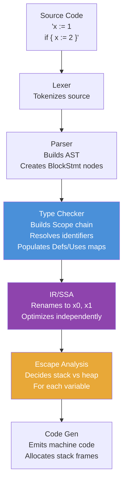
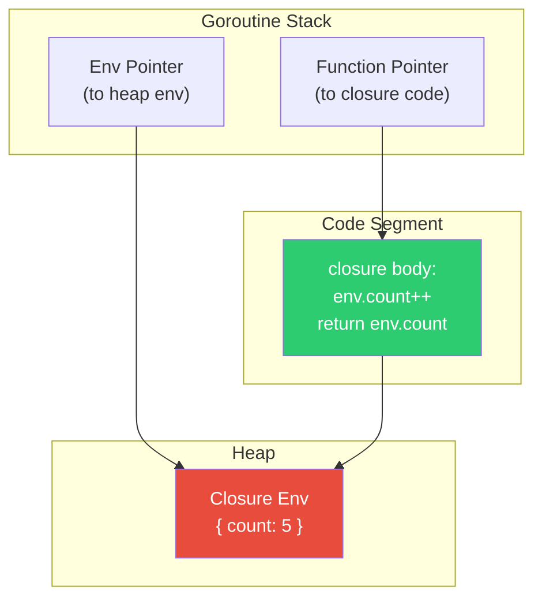
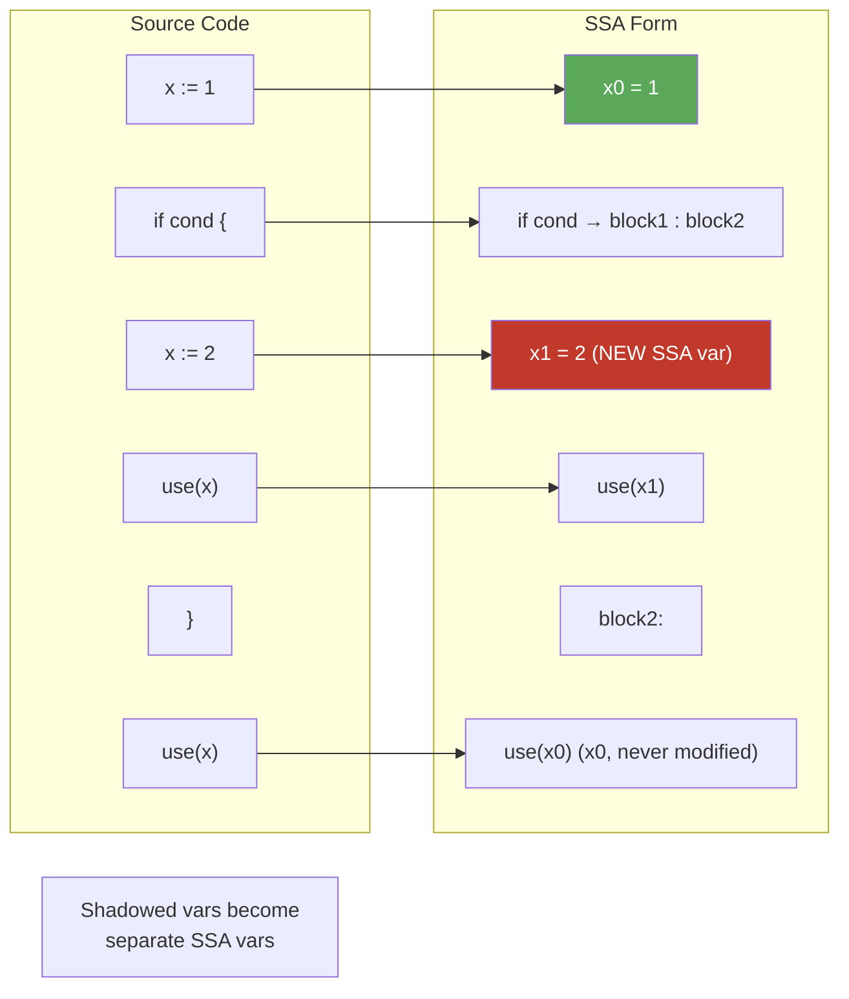

# Scope and Shadowing — Professional Level

## Table of Contents
1. [Introduction](#introduction)
2. [Go Compiler Internals: How Scope Is Resolved](#go-compiler-internals-how-scope-is-resolved)
3. [Symbol Table and Scope Chain](#symbol-table-and-scope-chain)
4. [AST Representation of Scope](#ast-representation-of-scope)
5. [Type Checker and Scope Resolution](#type-checker-and-scope-resolution)
6. [Escape Analysis and Scope](#escape-analysis-and-scope)
7. [Closure Internals](#closure-internals)
8. [Stack Frame and Variable Lifetime](#stack-frame-and-variable-lifetime)
9. [SSA (Static Single Assignment) Form](#ssa-static-single-assignment-form)
10. [Go Runtime: Goroutine Stacks and Variables](#go-runtime-goroutine-stacks-and-variables)
11. [How go vet Shadow Works Internally](#how-go-vet-shadow-works-internally)
12. [The Loop Variable Fix: Compiler Implementation](#the-loop-variable-fix-compiler-implementation)
13. [Memory Model Implications](#memory-model-implications)
14. [Advanced Tooling: Writing Your Own Analyzer](#advanced-tooling-writing-your-own-analyzer)
15. [Benchmarks and Performance](#benchmarks-and-performance)
16. [Diagrams & Visual Aids](#diagrams--visual-aids)
17. [Self-Assessment Checklist](#self-assessment-checklist)
18. [Summary](#summary)

---

## Introduction

> Focus: How Go resolves identifiers internally. Symbol table and scope chain in the compiler. How escape analysis interacts with scope. Closure internals.

At the professional level, scope and shadowing are understood not just as language features, but as **compiler-level mechanisms**. This document explores:

- How the Go compiler implements scope using a symbol table and scope chain
- How the AST represents scope boundaries
- How the type checker resolves identifiers
- How escape analysis determines whether a variable lives on the stack or heap
- How closures are implemented at the machine level
- The internal changes made to implement Go 1.22 loop variable semantics

Understanding these internals makes you a more effective language tools author, performance engineer, and architect of Go runtime systems.

---

## Go Compiler Internals: How Scope Is Resolved

### The Compilation Pipeline

```
Source Code
    ↓
Lexer (scanner)        — tokenizes source
    ↓
Parser                 — builds AST
    ↓
Type Checker (types2)  — resolves identifiers, builds scope chains
    ↓
IR / SSA               — converts to intermediate representation
    ↓
Escape Analysis        — determines stack vs heap allocation
    ↓
Code Generation        — emits machine code or WASM
```

### Phase 1: Parsing — Scope Boundaries Established

The parser creates `ast.BlockStmt` nodes for every `{}` block. These nodes define scope boundaries, but the parser itself does not resolve identifiers — it just builds the tree.

```
Source:
func foo() {
    x := 1
    if true {
        x := 2
        _ = x
    }
}

AST (simplified):
FuncDecl{
  Name: "foo"
  Body: BlockStmt{      ← function scope boundary
    AssignStmt{
      Lhs: Ident{Name: "x"}
      Rhs: BasicLit{Value: "1"}
    }
    IfStmt{
      Body: BlockStmt{  ← if block scope boundary
        AssignStmt{
          Lhs: Ident{Name: "x"}  ← SAME name, DIFFERENT scope
          Rhs: BasicLit{Value: "2"}
        }
      }
    }
  }
}
```

---

## Symbol Table and Scope Chain

### The `go/types` Package Scope Model

The Go type checker (in `go/types`) uses a `Scope` type that forms a linked list (scope chain):

```go
// From go/types package (simplified)
type Scope struct {
    parent   *Scope
    children []*Scope
    elems    map[string]Object  // name → object mapping
    pos      token.Pos          // scope start position
    end      token.Pos          // scope end position
}

// Lookup walks up the scope chain
func (s *Scope) Lookup(name string) Object {
    for ; s != nil; s = s.parent {
        if obj := s.elems[name]; obj != nil {
            return obj
        }
    }
    return nil
}
```

### Scope Chain Structure

```
Universe Scope
  ├── elems: {true, false, nil, int, string, len, cap, make, ...}
  └── parent: nil

Package Scope (main)
  ├── elems: {main (func), globalVar, ...}
  └── parent: → Universe Scope

Function Scope (foo)
  ├── elems: {x (first declaration), ...}
  └── parent: → Package Scope

Block Scope (if body)
  ├── elems: {x (second declaration, shadows!)}
  └── parent: → Function Scope
```

### How Shadowing Appears in the Scope Chain

When the type checker encounters `x := 2` in the if block:

1. It creates a new `Object` (specifically a `*types.Var`) named `x`
2. It inserts this object into the **current block's scope** (`elems["x"] = newVar`)
3. The original `x` in the function scope is **not modified**
4. Any lookup of `x` within the if block finds the if-block's `x` first

```go
// Demonstrating scope chain lookup
import (
    "fmt"
    "go/ast"
    "go/importer"
    "go/parser"
    "go/token"
    "go/types"
)

func inspectScopes(src string) {
    fset := token.NewFileSet()
    f, _ := parser.ParseFile(fset, "src.go", src, 0)

    conf := types.Config{Importer: importer.Default()}
    info := &types.Info{
        Scopes: make(map[ast.Node]*types.Scope),
        Defs:   make(map[*ast.Ident]types.Object),
        Uses:   make(map[*ast.Ident]types.Object),
    }

    pkg, _ := conf.Check("cmd", fset, []*ast.File{f}, info)

    // Print all scopes
    pkg.Scope().WriteTo(os.Stdout, 0, true)

    // Find which object each identifier refers to
    for id, obj := range info.Uses {
        fmt.Printf("identifier %q at %s refers to %s declared at %s\n",
            id.Name,
            fset.Position(id.Pos()),
            obj.Name(),
            fset.Position(obj.Pos()))
    }
}
```

### `types.Info.Defs` vs `types.Info.Uses`

The type checker populates two critical maps:

- **`Defs`**: maps each identifier that **declares** a new object → the object declared
- **`Uses`**: maps each identifier that **uses** an existing object → the object used

This is how shadow detection works:
```go
// For each := declaration, check if an outer scope has the same name
for id, obj := range info.Defs {
    // Walk up scope chain to find outer definition
    scope := obj.Parent().Parent() // parent of declaration scope
    for scope != nil {
        if outer := scope.Lookup(id.Name); outer != nil {
            // id.Name is shadowed!
            fmt.Printf("shadowed: %s at %v shadows %v\n",
                id.Name, fset.Position(id.Pos()), fset.Position(outer.Pos()))
        }
        scope = scope.Parent()
    }
}
```

---

## AST Representation of Scope

### How Block Statements Create Scope Boundaries

In the Go AST, scope boundaries are created by:
- `ast.FuncDecl` / `ast.FuncLit` — function scope
- `ast.BlockStmt` — block scope
- `ast.IfStmt.Init` — scope for the init statement
- `ast.ForStmt` / `ast.RangeStmt` — loop scope
- `ast.SwitchStmt` / `ast.TypeSwitchStmt` / `ast.SelectStmt` — switch scope
- `ast.CaseClause` / `ast.CommClause` — case scope

### Walking the AST for Scope Analysis

```go
// ast.Inspect recursively visits all nodes
ast.Inspect(file, func(n ast.Node) bool {
    switch node := n.(type) {
    case *ast.BlockStmt:
        fmt.Printf("Block scope at line %d\n",
            fset.Position(node.Lbrace).Line)
    case *ast.FuncDecl:
        fmt.Printf("Function %s scope\n", node.Name.Name)
    case *ast.IfStmt:
        if node.Init != nil {
            fmt.Printf("If-init scope at line %d\n",
                fset.Position(node.Init.Pos()).Line)
        }
    }
    return true
})
```

---

## Type Checker and Scope Resolution

### The `types2` Package (New Type Checker)

Go 1.18 introduced `cmd/compile/internal/types2` as a new, more accurate type checker used internally by the compiler (the public `go/types` is the older version, still used for tooling):

```
types2 differences from go/types:
- Uses token.Pos for positions (same as go/types)
- Integrated with the compiler's internal AST (syntax package)
- Supports generics (type parameters)
- Slightly different API but same conceptual model
```

### Identifier Resolution Order

The type checker resolves an identifier `x` as follows:

```
1. Check current block's scope (Scope.Lookup)
2. Walk up to parent scope (Scope.Parent().Lookup)
3. Continue until reaching Universe scope
4. If not found: compile error "undefined: x"
5. If found: bind the Ident node to the Object
```

This is implemented in `go/types/resolver.go`:

```go
// Simplified from go/types/resolver.go
func (check *Checker) rawLookup(scope *Scope, name string) Object {
    for s := scope; s != nil; s = s.parent {
        if obj := s.Lookup(name); obj != nil {
            return obj
        }
    }
    return nil
}
```

### How `:=` Triggers Scope Creation

When the parser sees `x, y := expr`, it creates an `ast.AssignStmt` with `Tok = token.DEFINE`. The type checker processes this by:

1. Evaluating the right-hand side type
2. For each name on the left:
   a. If the name **already exists** in the **current (innermost) scope** → reuse it (assign, not declare)
   b. If the name **does not exist** in the current scope (even if outer scope has it) → declare a new variable

```go
// Simplified from go/types/stmt.go
func (check *Checker) shortVarDecl(pos positioner, lhs, rhs []ast.Expr) {
    newVars := 0
    for i, lhsExpr := range lhs {
        ident := lhsExpr.(*ast.Ident)

        // Check if variable exists in CURRENT scope only
        if obj := check.scope.Lookup(ident.Name); obj != nil {
            // Reuse existing variable (not a new declaration)
            check.recordUse(ident, obj)
        } else {
            // Create new variable in current scope
            newVar := NewVar(ident.Pos(), check.pkg, ident.Name, rhsTypes[i])
            check.scope.Insert(newVar)
            check.recordDef(ident, newVar)
            newVars++
        }
    }
    if newVars == 0 {
        check.errorf(pos, "no new variables on left side of :=")
    }
}
```

---

## Escape Analysis and Scope

### What Is Escape Analysis?

Escape analysis determines whether a variable's lifetime can be bounded to the stack frame (fast allocation/deallocation) or must be heap-allocated (slower, GC-managed).

A variable **escapes** to the heap when:
- It is captured by a closure
- Its address is returned from a function
- It is assigned to an interface
- It is too large for the stack

### Scope and Escape Analysis

Tight scope does NOT automatically mean stack allocation. The compiler performs data flow analysis:

```go
// Case 1: Variable escapes — captured by closure
func escape1() func() int {
    x := 42       // x ESCAPES to heap — returned closure captures it
    return func() int { return x }
}

// Case 2: Variable does NOT escape — short scope, not captured
func noEscape() int {
    x := 42       // x stays on stack
    return x * 2
}

// Case 3: Variable escapes — address returned
func escape2() *int {
    x := 42       // x ESCAPES to heap — address returned
    return &x
}

// Case 4: Variable escapes — stored in interface
func escape3() interface{} {
    x := 42       // x ESCAPES — stored as interface{}
    return x
}
```

### Viewing Escape Analysis Output

```bash
go build -gcflags="-m" ./...

# Output examples:
# ./main.go:5:2: x escapes to heap
# ./main.go:12:2: x does not escape
# ./main.go:18:9: &x escapes to heap

# More verbose:
go build -gcflags="-m -m" ./...
```

### Escape Analysis with Shadowed Variables

```go
// Both x variables may have different escape decisions
func shadowedEscape() func() int {
    x := 1        // outer x: does NOT escape (not captured by closure)
    if true {
        x := 2    // inner x: ESCAPES to heap (captured by closure)
        return func() int { return x }
    }
    return func() int { return x * 0 } // outer x: actually escapes here too
}
```

```bash
# Check with:
go build -gcflags="-m" -o /dev/null .
# ./main.go:4:2: x does not escape  (or: escapes to heap, depending on use)
# ./main.go:6:3: x escapes to heap
```

---

## Closure Internals

### How Closures Are Implemented

A closure in Go is implemented as a **function pointer** paired with a **reference to captured variables**. The captured variables are allocated on the heap (because they must outlive the stack frame that created them).

The compiler generates something like:

```go
// Original:
func makeAdder(base int) func(int) int {
    sum := base
    return func(n int) int {
        sum += n
        return sum
    }
}

// Compiler generates (conceptually):
type closureEnv struct {
    sum int  // captured variable
}

func closureImpl(env *closureEnv, n int) int {
    env.sum += n
    return env.sum
}

func makeAdder(base int) func(int) int {
    env := &closureEnv{sum: base}  // heap allocated!
    return func(n int) int {
        return closureImpl(env, n)
    }
}
```

### Closure Capture: By Reference

When a closure captures a variable, it captures a **pointer to that variable's storage**, not a copy of its value. This is why:

```go
func closureRef() {
    x := 1
    f := func() { fmt.Println(x) } // captures &x
    x = 2
    f() // prints 2, not 1!
}
```

The compiler allocates `x` on the heap (so the closure's reference remains valid after the enclosing function returns):

```
Stack:
  f  → (function pointer, env pointer)

Heap:
  env:
    x → 2    ← f's closure reads this
```

### Multiple Closures Sharing Variables

```go
func sharedCapture() (inc func(), get func() int) {
    // count lives on the heap, shared between both closures
    count := 0

    inc = func() { count++ }
    get = func() int { return count }
    return
}
```

```
Heap:
  closureEnv:
    count → 0

inc → (ptr to incImpl, ptr to closureEnv)
get → (ptr to getImpl, ptr to closureEnv)
     both point to the SAME closureEnv
```

### Viewing Closure Assembly

```bash
go build -gcflags="-S" . 2>&1 | grep -A 20 "makeAdder"

# Look for:
# MOVQ    AX, (SP)      — storing closure env pointer
# LEAQ    closureImpl(SB), CX  — function pointer
```

---

## Stack Frame and Variable Lifetime

### How the Stack Works

Go uses **segmented stacks** (goroutine stacks that grow as needed). Each function call creates a new stack frame. Local variables that do not escape live in that frame:

```
Goroutine Stack:
┌─────────────────────┐  ← top (current frame)
│ func innerFunc      │
│   y = 42            │  ← local variable
│   return address    │
├─────────────────────┤
│ func outerFunc      │
│   x = 10            │  ← local variable
│   call innerFunc    │
└─────────────────────┘  ← bottom
```

When `innerFunc` returns, its frame is popped — `y` is gone. This is why block-scoped variables have automatic lifetime management.

### Variable Lifetime vs Scope

Scope is a **syntactic** concept (source code regions). Lifetime is a **runtime** concept (when memory is live). In Go:

- For stack variables: lifetime matches scope (approximately)
- For heap variables: lifetime is managed by GC, may outlive scope

```go
func lifetimeVsScope() func() int {
    {
        x := 42             // scope ends at }
        return func() int { // but x must live beyond scope → heap!
            return x
        }
    }
}
```

---

## SSA (Static Single Assignment) Form

The Go compiler converts code to SSA form, where each variable is assigned exactly once. This is how it handles shadowing internally:

### Original Code

```go
x := 1
if cond {
    x := 2
    use(x)
}
use(x)
```

### SSA Representation

```
x0 = 1
if cond goto block1 else block2

block1:
  x1 = 2    ← different SSA variable
  use(x1)
  goto block2

block2:
  x_phi = phi(x0, x0)  ← x_phi is always x0 because x1 doesn't flow here
  use(x_phi)
```

In SSA form, shadowed variables get different names (`x0`, `x1`) — the shadow becomes explicit. This is why the compiler can easily tell them apart and optimize independently.

### Viewing SSA Output

```bash
GOSSAFUNC=myFunction go build . && open ssa.html
# Opens a browser showing SSA form with all optimization passes
```

---

## Go Runtime: Goroutine Stacks and Variables

### Goroutine Stack Growth

Go goroutines start with a small stack (typically 2KB or 8KB) that grows dynamically. This growth (stack copying) interacts with variable addresses:

```go
func recursive(depth int) {
    x := depth
    _ = &x  // taking address of x forces it to heap if stack grows
    if depth < 10000 {
        recursive(depth + 1)
    }
}
```

When the stack grows, Go copies all stack frames to a new, larger stack. This means **taking the address of a local variable is safe** in Go — the runtime updates all pointers when copying.

### Goroutines and Closure Scope

When a goroutine captures a variable via closure, that variable is on the heap:

```go
func spawnWorker(job Job) {
    done := make(chan struct{}) // done: heap-allocated (channel)
    go func() {
        process(job) // job: heap-allocated (captured by closure)
        close(done)
    }()
    <-done
}
```

---

## How go vet Shadow Works Internally

The `shadow` analyzer (from `golang.org/x/tools`) works as follows:

### Algorithm

```
1. Parse source file into AST
2. Run type checker to get type.Info (Defs, Uses, Scopes)
3. For each ident in Defs (declarations):
   a. Get the scope where ident is declared: declScope
   b. Walk up the scope chain: parent = declScope.Parent()
   c. For each ancestor scope, call scope.Lookup(ident.Name)
   d. If found: report shadowing

4. Filter false positives:
   - Blank identifier (_) never shadows
   - err variable: only report if in different branch (configurable)
   - Intentional type assertions (configurable)
```

### Source Code of Shadow Analyzer

The key function in `golang.org/x/tools/go/analysis/passes/shadow`:

```go
// Simplified version of the actual shadow checker
func checkShadowing(pass *analysis.Pass) {
    for id, obj := range pass.TypesInfo.Defs {
        if id.Name == "_" {
            continue
        }

        scope := obj.Parent()
        if scope == nil {
            continue
        }

        // Walk up to find shadowed variable
        for outer := scope.Parent(); outer != nil; outer = outer.Parent() {
            outerObj := outer.Lookup(id.Name)
            if outerObj == nil {
                continue
            }

            // Found a shadow!
            pos := pass.Fset.Position(id.Pos())
            outerPos := pass.Fset.Position(outerObj.Pos())

            pass.Reportf(id.Pos(),
                "declaration of %q shadows declaration at %s",
                id.Name, outerPos)

            break // Only report innermost shadow
        }
    }
}
```

---

## The Loop Variable Fix: Compiler Implementation

### What Changed Internally in Go 1.22

Before Go 1.22, the compiler generated:

```go
// Original:
for i := 0; i < n; i++ {
    body(i)
}

// Compiler lowered to:
{
    i := 0          // single variable for entire loop
    for ; i < n; {
        body(i)
        i++
    }
}
```

After Go 1.22, the compiler generates (conceptually):

```go
// For loops where the variable address is taken (closure capture):
{
    i_loop := 0        // loop counter (reused)
    for ; i_loop < n; {
        i := i_loop    // per-iteration copy (new variable each time)
        body(i)        // closure captures per-iteration i
        i_loop++
    }
}
```

The compiler only creates per-iteration copies when it detects that the loop variable's address is taken or it's captured by a closure. This is an optimization — simple loops without closures are not affected.

### The `rangefunc` Experiment (Go 1.22+)

Go 1.22 also introduced experimental support for range over functions (`GOEXPERIMENT=rangefunc`). This further extends per-iteration semantics to user-defined iterators.

### Checking if Your Code Needs the Fix

```bash
# Find potential loop variable capture issues in pre-1.22 code
go vet -vettool=$(which loopclosure) ./...

# The loopclosure analyzer specifically checks for this pattern
```

---

## Memory Model Implications

### The Go Memory Model and Scope

The Go Memory Model (revised in Go 1.19) defines when one goroutine's writes are visible to another. Scope interacts with the memory model through closures:

```go
// Unsynchronized write and read — data race
done := false
go func() {
    done = true  // write in goroutine
}()
for !done {     // read in main goroutine — DATA RACE!
    runtime.Gosched()
}
```

Even though `done` is visible in both goroutines (captured by closure), the memory model requires explicit synchronization:

```go
// Synchronized version
var done int32
go func() {
    atomic.StoreInt32(&done, 1) // atomic write
}()
for atomic.LoadInt32(&done) == 0 { // atomic read
    runtime.Gosched()
}
```

### Happens-Before and Scope

The Go Memory Model defines *happens-before* relationships. Variable writes are only guaranteed visible to other goroutines when there is a happens-before edge (via channels, sync primitives, etc.) — **not** based on scope or variable visibility alone.

---

## Advanced Tooling: Writing Your Own Analyzer

### Full Analyzer Implementation

```go
// package errorshadow — detects shadowed err variables
package errorshadow

import (
    "go/ast"
    "go/token"
    "go/types"

    "golang.org/x/tools/go/analysis"
    "golang.org/x/tools/go/analysis/passes/inspect"
    "golang.org/x/tools/go/ast/inspector"
)

const doc = `errorshadow detects cases where the err variable is shadowed
in nested blocks, which can cause errors to be silently swallowed.`

var Analyzer = &analysis.Analyzer{
    Name:     "errorshadow",
    Doc:      doc,
    Run:      run,
    Requires: []*analysis.Analyzer{inspect.Analyzer},
}

func run(pass *analysis.Pass) (interface{}, error) {
    insp := pass.ResultOf[inspect.Analyzer].(*inspector.Inspector)

    nodeFilter := []ast.Node{
        (*ast.AssignStmt)(nil),
    }

    insp.Preorder(nodeFilter, func(n ast.Node) bool {
        assign, ok := n.(*ast.AssignStmt)
        if !ok || assign.Tok != token.DEFINE {
            return true
        }

        for _, lhsExpr := range assign.Lhs {
            ident, ok := lhsExpr.(*ast.Ident)
            if !ok || ident.Name != "err" {
                continue
            }

            // Get the object defined here
            obj := pass.TypesInfo.Defs[ident]
            if obj == nil {
                continue
            }

            // Is there an outer err?
            outerObj := lookupOuter(obj.Parent(), "err")
            if outerObj == nil {
                continue
            }

            // Are they the same type? (both should be error)
            if !isErrorType(obj.Type()) || !isErrorType(outerObj.Type()) {
                continue
            }

            pass.Reportf(ident.Pos(),
                "err shadows err declared at %s; "+
                    "use '=' to update outer err, or rename this variable",
                pass.Fset.Position(outerObj.Pos()))
        }

        return true
    })

    return nil, nil
}

func lookupOuter(scope *types.Scope, name string) types.Object {
    if scope == nil {
        return nil
    }
    for s := scope.Parent(); s != nil; s = s.Parent() {
        if obj := s.Lookup(name); obj != nil {
            return obj
        }
    }
    return nil
}

func isErrorType(t types.Type) bool {
    named, ok := t.(*types.Named)
    if !ok {
        return false
    }
    return named.Obj().Name() == "error"
}
```

### Testing the Analyzer

```go
// errorshadow_test.go
package errorshadow_test

import (
    "testing"

    "golang.org/x/tools/go/analysis/analysistest"
    "myproject/errorshadow"
)

func TestAnalyzer(t *testing.T) {
    analysistest.Run(t, analysistest.TestData(), errorshadow.Analyzer, "basic")
}

// testdata/src/basic/basic.go:
// package basic
//
// import "errors"
//
// func bad() {
//     err := errors.New("outer")
//     if err != nil {
//         err := errors.New("inner") // want "err shadows err"
//         _ = err
//     }
//     _ = err
// }
```

---

## Benchmarks and Performance

### Benchmark: Stack vs Heap Allocation

```go
package scope_test

import "testing"

// No escape — stays on stack
func stackAlloc() int {
    x := 42
    return x * 2
}

// Escapes — goes to heap (closure capture)
func heapAlloc() func() int {
    x := 42
    return func() int { return x }
}

func BenchmarkStack(b *testing.B) {
    var result int
    for i := 0; i < b.N; i++ {
        result = stackAlloc()
    }
    _ = result
}

func BenchmarkHeap(b *testing.B) {
    var result int
    for i := 0; i < b.N; i++ {
        f := heapAlloc()
        result = f()
    }
    _ = result
}

// Typical results:
// BenchmarkStack-8     1000000000   0.234 ns/op   0 B/op   0 allocs/op
// BenchmarkHeap-8       50000000   32.1  ns/op  48 B/op   1 allocs/op
```

### Benchmark: Loop Variable Overhead (Go 1.22)

```go
// The per-iteration copy in Go 1.22 has near-zero overhead
// when the variable is not captured by a closure

func BenchmarkLoopNoClosure(b *testing.B) {
    sum := 0
    for i := 0; i < b.N; i++ {
        for j := 0; j < 1000; j++ {
            sum += j  // j not captured — no per-iteration copy needed
        }
    }
    _ = sum
}

func BenchmarkLoopWithClosure(b *testing.B) {
    funcs := make([]func() int, 1000)
    for i := 0; i < b.N; i++ {
        for j := 0; j < 1000; j++ {
            j := j  // explicit copy (same as Go 1.22 implicit behavior)
            funcs[j] = func() int { return j }
        }
    }
    _ = funcs
}
```

---

## Diagrams & Visual Aids

### Diagram 1: Compiler Pipeline for Scope Resolution



### Diagram 2: Closure Internal Structure



### Diagram 3: SSA Representation of Shadowed Variables



---

## Self-Assessment Checklist

- [ ] I can explain how the Go type checker uses a scope chain linked list
- [ ] I understand the difference between `Defs` and `Uses` in `types.Info`
- [ ] I can explain why closures cause heap allocation for captured variables
- [ ] I can describe what SSA form does with shadowed variables
- [ ] I can explain the internal change the compiler made for Go 1.22 loop variables
- [ ] I can read and interpret `go build -gcflags="-m"` escape analysis output
- [ ] I can write a basic custom static analysis pass using `golang.org/x/tools/go/analysis`
- [ ] I understand the Go memory model's impact on closure-captured variables
- [ ] I can benchmark stack vs heap variable allocation
- [ ] I know how goroutine stack copying interacts with variable addresses

---

## Summary

At the professional level, scope and shadowing reveal a rich landscape of compiler and runtime mechanisms:

1. **Scope chain**: The type checker implements scope as a linked list of symbol tables. Identifier resolution walks this chain from innermost to outermost scope.

2. **SSA transformation**: Shadowed variables become separate SSA variables (e.g., `x0` and `x1`), allowing the optimizer to treat them independently.

3. **Escape analysis**: Scope is syntactic, but lifetime is runtime. Closures that capture variables force those variables to the heap. Understanding this prevents unnecessary allocations.

4. **Closure internals**: Closures are (function pointer, environment pointer) pairs. Captured variables are heap-allocated structs shared across all closures that capture them.

5. **Go 1.22**: The per-iteration loop variable fix is implemented by inserting an implicit `i_loop := i` at the top of each iteration body when the variable is captured by a closure.

6. **Custom analyzers**: The `golang.org/x/tools/go/analysis` framework lets you build project-specific shadow detectors using the same infrastructure as `go vet`.
