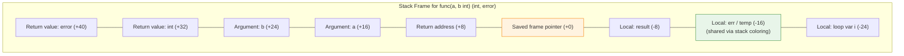
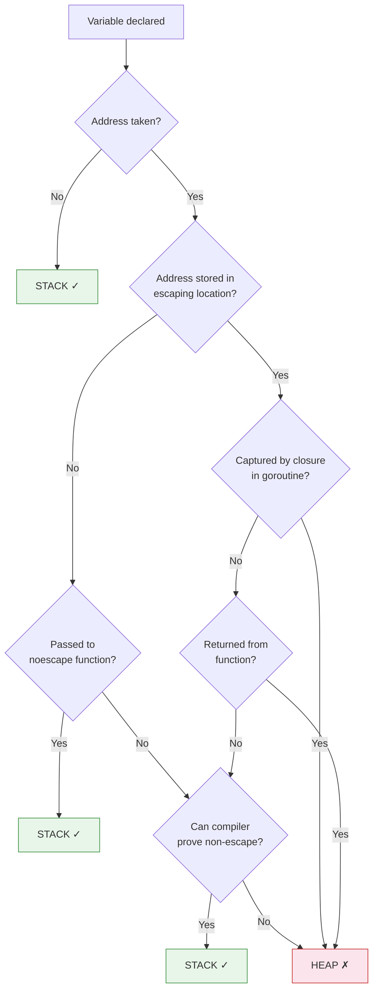
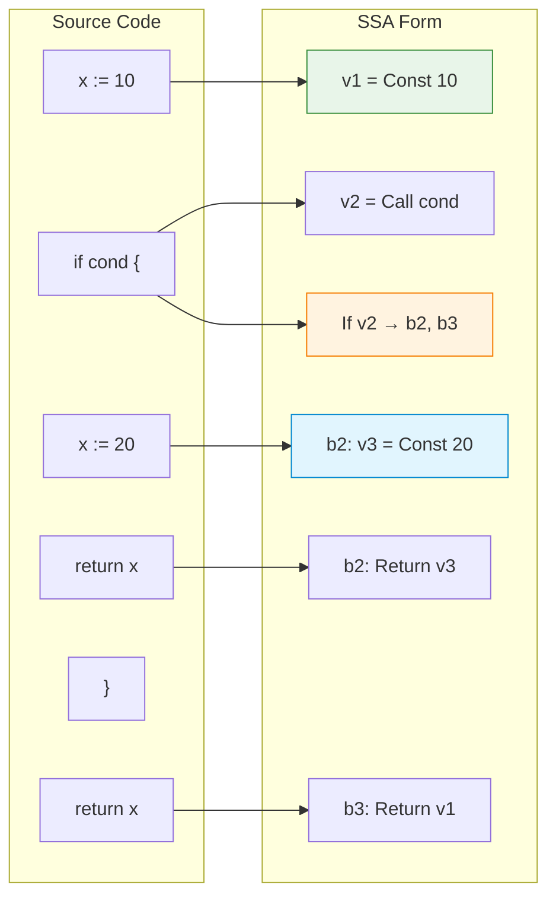

# Scope and Shadowing — Under the Hood

## Table of Contents

1. [Introduction](#introduction)
2. [How It Works Internally](#how-it-works-internally)
3. [Runtime Deep Dive](#runtime-deep-dive)
4. [Compiler Perspective](#compiler-perspective)
5. [Memory Layout](#memory-layout)
6. [OS / Syscall Level](#os--syscall-level)
7. [Source Code Walkthrough](#source-code-walkthrough)
8. [Assembly Output](#assembly-output)
9. [Performance Internals](#performance-internals)
10. [Metrics Runtime](#metrics-runtime)
11. [Edge Cases Lowest Level](#edge-cases-lowest-level)
12. [Test](#test)
13. [Tricky Questions](#tricky-questions)
14. [Self-Assessment](#self-assessment)
15. [Summary](#summary)
16. [Further Reading](#further-reading)
17. [Diagrams & Visual Aids](#diagrams--visual-aids)

---

## Introduction

> Focus: "Under the hood"

Scope and shadowing are entirely compile-time concepts in Go. By the time the binary is produced, there are no "scopes" or "shadows" — there are only memory addresses, registers, and stack frames. Understanding how the Go compiler transforms source-level scope into machine-level memory management is essential for writing truly high-performance Go code.

This section dives into the Go compiler's internal representation (AST, SSA), how scope affects stack frame layout, escape analysis decisions, the relationship between scope and goroutine stacks, and what the actual assembly output looks like for shadowed vs non-shadowed variables.

---

## How It Works Internally

### Compiler Phases and Scope Resolution

The Go compiler (`cmd/compile`) processes scope in several phases:

1. **Parsing** — Source code is parsed into an Abstract Syntax Tree (AST). Each `{}` block creates a new scope node in the AST.

2. **Type Checking** — The type checker (`cmd/compile/internal/types2`) resolves identifiers to their declarations using scope chains. Each scope has a parent pointer.

3. **IR Construction** — The AST is converted to an intermediate representation. Variable declarations become IR nodes with scope information.

4. **SSA Generation** — The IR is converted to Static Single Assignment form. Shadowed variables become distinct SSA values with no relationship to each other.

5. **Optimization** — SSA passes optimize the code. Dead variable elimination can remove unused shadows. Register allocation assigns physical locations.

6. **Code Generation** — SSA values become machine instructions. Scope information is preserved only in DWARF debug data.

```go
// Source code with shadowing
func example() int {
    x := 10        // AST: x_outer, Scope 1
    if true {
        x := 20    // AST: x_inner, Scope 2 (child of Scope 1)
        return x   // Resolves to x_inner
    }
    return x       // Resolves to x_outer
}
```

The compiler's scope chain for this:

```
Scope 0 (universe): true, false, int, string, len, ...
└── Scope 1 (package): example
    └── Scope 2 (function example): x_outer
        └── Scope 3 (if body): x_inner
```

### Scope Object in the Compiler Source

The compiler represents scopes using the `types2.Scope` type:

```go
// From go/types (similar to internal types2)
type Scope struct {
    parent   *Scope
    children []*Scope
    elems    map[string]Object  // name -> declared object
    pos, end token.Pos          // source positions
    comment  string
    isFunc   bool
}
```

When the compiler encounters an identifier, it walks up the scope chain:

```go
// Simplified lookup logic
func (s *Scope) LookupParent(name string) (*Scope, Object) {
    for scope := s; scope != nil; scope = scope.parent {
        if obj := scope.elems[name]; obj != nil {
            return scope, obj
        }
    }
    return nil, nil // not found — compile error
}
```

---

## Runtime Deep Dive

### Stack Frames and Variable Layout

At runtime, scoped variables are simply offsets in the function's stack frame. The compiler allocates stack space for ALL local variables at function entry, regardless of which block they belong to:

```go
func stackDemo() {
    a := 1          // offset -8(SP)
    if true {
        b := 2      // offset -16(SP)
        _ = b
    }
    c := 3          // offset -24(SP)  OR reuses -16(SP) if b is dead
    _ = a
    _ = c
}
```

The stack frame for this function looks like:

```
High address
+------------------+
| return address   |  (caller's PC)
+------------------+
| caller's BP      |  (frame pointer)
+------------------+  <- SP + frame_size
| a (int)          |  offset -8
+------------------+
| b/c (int)        |  offset -16 (compiler may reuse slot)
+------------------+  <- SP
Low address
```

### Goroutine Stack and Scope

Each goroutine starts with a small stack (typically 2KB in Go 1.21+, 8KB default). When a function with many scoped variables needs more space, the runtime grows the stack:

```go
// runtime/stack.go (simplified)
func newstack() {
    // Called when a function's stack frame exceeds the current stack size
    gp := getg()

    // Calculate needed size
    needed := gp.stackguard0 - gp.stack.lo

    // Allocate new, larger stack (typically 2x)
    newsize := gp.stack.hi - gp.stack.lo
    for newsize < needed {
        newsize *= 2
    }

    // Copy old stack to new stack, update all pointers
    copystack(gp, newsize)
}
```

Scope does not directly affect stack growth — the compiler pre-calculates the maximum stack frame size needed for all possible execution paths through the function.

### Variable Reuse Across Scopes

The compiler can reuse stack slots for variables in non-overlapping scopes:

```go
func reuseDemo() {
    // The compiler may assign a and b to the same stack slot
    // because they never coexist
    {
        a := computeA() // slot at offset -8
        process(a)
    }
    // a is dead here

    {
        b := computeB() // can reuse slot at offset -8
        process(b)
    }
}
```

This optimization is called **stack slot reuse** or **stack coloring**, performed during register allocation.

---

## Compiler Perspective

### SSA Transformation of Shadowed Variables

```go
func shadow() int {
    x := 10
    if condition() {
        x := 20
        return x
    }
    return x
}
```

After SSA construction (simplified):

```
b1: (entry)
    v1 = ConstInt 10           // x_outer
    v2 = Call condition
    If v2 -> b2 b3

b2: (if-true)
    v3 = ConstInt 20           // x_inner (completely separate from v1)
    Return v3

b3: (if-false)
    Return v1                  // refers to v1, not v3
```

Notice: `v1` and `v3` are independent SSA values. There is no concept of "shadowing" in SSA — just different values with different names.

### Viewing SSA Output

```bash
# Generate SSA HTML visualization
GOSSAFUNC=shadow go build -o /dev/null main.go
# This creates ssa.html showing all SSA passes

# Example output for each pass:
# start: initial SSA
# opt: after optimizations
# lower: after architecture-specific lowering
# regalloc: after register allocation
# genssa: final machine code
```

### Dead Code Elimination and Scope

If a shadowed variable is never used, the compiler eliminates it:

```go
func deadShadow() int {
    x := expensive()  // computed
    if true {
        x := 42       // this is dead code if not used
        _ = x          // suppresses "unused" error but compiler still eliminates
    }
    return x
}
```

In SSA, the inner `x := 42` becomes a dead store and is eliminated in the `deadcode` pass.

### Escape Analysis Internal Decisions

The escape analysis pass (`cmd/compile/internal/escape`) uses a data flow graph to determine if a variable escapes its scope:

```go
func escapeExample() {
    // Case 1: Does not escape — stays in function scope
    x := 42
    fmt.Println(x) // x is passed by value to Println — does not escape

    // Case 2: Escapes — address leaves function scope
    y := 42
    storeGlobally(&y) // y's address escapes — heap allocated

    // Case 3: Scope matters — narrow scope, but escapes via closure
    if true {
        z := 42
        go func() {
            fmt.Println(z) // z is captured — escapes to heap
        }()
    }
}
```

Escape analysis output with `-gcflags="-m -m"`:

```
./main.go:3:6: x does not escape
./main.go:6:6: moved to heap: y
./main.go:10:6: moved to heap: z
./main.go:11:6: func literal escapes to heap
```

---

## Memory Layout

### Stack Frame Layout for Scoped Variables

```go
func complexScopes(a, b int) (int, error) {
    // Frame layout (approximate, architecture-dependent):
    //
    // +40(SP): return value 2 (error)
    // +32(SP): return value 1 (int)
    // +24(SP): argument b
    // +16(SP): argument a
    // +8(SP):  return address
    // +0(SP):  saved frame pointer
    // -8(SP):  local var: result
    // -16(SP): local var: err (from if block, or reused)
    // -24(SP): local var: temp (from loop body)

    result := a + b

    if result > 100 {
        err := fmt.Errorf("overflow: %d", result)
        return 0, err
    }

    for i := 0; i < result; i++ {
        temp := i * 2  // may reuse err's stack slot
        _ = temp
    }

    return result, nil
}
```

### Heap Allocation for Escaped Variables

When a variable escapes, the compiler generates a `runtime.newobject` call:

```go
func escaped() *int {
    x := 42
    return &x
    // Compiler generates:
    // v1 = runtime.newobject(type.int)
    // *v1 = 42
    // return v1
}
```

The heap object layout:

```
Heap object for escaped int:
+----------+
| 42       |  8 bytes (int64 on 64-bit)
+----------+

Heap object header (managed by runtime.mallocgc):
+------------------+
| span pointer     |  Points to mspan
+------------------+
| mark bits        |  For GC
+------------------+
| size class       |  Allocation size bucket
+------------------+
```

### Closure Memory Layout

When a closure captures variables from an enclosing scope:

```go
func closureLayout() func() int {
    x := 10
    y := 20
    // Both x and y are captured
    return func() int {
        return x + y
    }
}
```

The closure is represented as a struct:

```
Closure struct:
+------------------+
| function pointer |  -> closure body code
+------------------+
| *x (pointer)     |  -> heap-allocated x
+------------------+
| *y (pointer)     |  -> heap-allocated y
+------------------+
```

Because `x` and `y` are captured by the returned closure, they escape to the heap. The closure struct itself also escapes.

---

## OS / Syscall Level

### Stack Memory Pages

Go goroutine stacks are allocated from the heap (not the OS thread stack). The runtime manages stack memory through `mmap` syscalls:

```go
// runtime/sys_linux_amd64.s (simplified)
// Stack memory is obtained via:
// mmap(nil, size, PROT_READ|PROT_WRITE, MAP_ANON|MAP_PRIVATE, -1, 0)
```

The OS sees goroutine stacks as regular heap allocations — it has no awareness of Go's scope system.

### Stack Growth and Scope Impact

```go
// Large stack frame due to many scoped variables
func largeFrame() {
    var buf1 [4096]byte  // 4KB on stack
    _ = buf1

    {
        var buf2 [4096]byte // another 4KB
        _ = buf2
    }

    // Even though buf2 is out of scope, the frame size was
    // calculated at compile time to include space for both.
    // The runtime checks stack size at function entry via
    // the stack check prologue:
    //
    // CMPQ SP, 16(R14)    // R14 = g, offset 16 = stackguard0
    // JLS  morestack       // jump if SP < stackguard0
}
```

---

## Source Code Walkthrough

### Scope Resolution in `go/types`

The standard library `go/types` package mirrors the compiler's scope logic:

```go
package main

import (
    "fmt"
    "go/ast"
    "go/parser"
    "go/token"
    "go/types"
)

func main() {
    src := `
package example

var global = 10

func main() {
    x := 20
    if true {
        x := 30
        _ = x
    }
    _ = x
}
`
    fset := token.NewFileSet()
    f, err := parser.ParseFile(fset, "example.go", src, 0)
    if err != nil {
        panic(err)
    }

    conf := types.Config{}
    info := &types.Info{
        Defs: make(map[*ast.Ident]types.Object),
        Uses: make(map[*ast.Ident]types.Object),
    }

    pkg, err := conf.Check("example", fset, []*ast.File{f}, info)
    if err != nil {
        panic(err)
    }

    // Walk the scope tree
    printScope(pkg.Scope(), 0)
}

func printScope(s *types.Scope, depth int) {
    indent := ""
    for i := 0; i < depth; i++ {
        indent += "  "
    }
    fmt.Printf("%sScope %s {\n", indent, s.String())
    for _, name := range s.Names() {
        obj := s.Lookup(name)
        fmt.Printf("%s  %s: %s\n", indent, name, obj)
    }
    for i := 0; i < s.NumChildren(); i++ {
        printScope(s.Child(i), depth+1)
    }
    fmt.Printf("%s}\n", indent)
}
```

### How the Compiler Builds the Scope Tree

In `cmd/compile/internal/noder`, the compiler's front-end converts parsed AST into the compiler's internal representation:

```go
// Simplified from cmd/compile/internal/types2/resolver.go
func (check *Checker) openScope(node ast.Node, comment string) {
    scope := NewScope(check.scope, node.Pos(), node.End(), comment)
    check.scope = scope
    // Each {} block calls openScope
}

func (check *Checker) closeScope() {
    check.scope = check.scope.Parent()
    // Leaving {} block restores parent scope
}
```

For each block statement (`if`, `for`, `switch`, `{}`), the compiler calls `openScope`/`closeScope`. Variable declarations within a scope are recorded in that scope's element map.

---

## Assembly Output

### Comparing Assembly for Shadowed vs Non-Shadowed

```go
// shadow.go
package main

func withShadow(n int) int {
    x := n + 1
    if n > 10 {
        x := n * 2  // shadow
        return x
    }
    return x
}

func withoutShadow(n int) int {
    x := n + 1
    if n > 10 {
        y := n * 2  // different name
        return y
    }
    return x
}
```

Generate assembly:

```bash
go build -gcflags="-S" shadow.go 2>&1
```

Expected output (amd64, simplified):

```asm
; withShadow
TEXT main.withShadow(SB), NOSPLIT, $0-16
    MOVQ    "".n+8(SP), AX      ; load n
    LEAQ    1(AX), CX            ; x_outer = n + 1
    CMPQ    AX, $10
    JLE     return_outer
    LEAQ    (AX)(AX*1), CX      ; x_inner = n * 2 (reuses CX register)
return_outer:
    MOVQ    CX, "".~r0+16(SP)   ; return value
    RET

; withoutShadow — IDENTICAL assembly
TEXT main.withoutShadow(SB), NOSPLIT, $0-16
    MOVQ    "".n+8(SP), AX
    LEAQ    1(AX), CX            ; x = n + 1
    CMPQ    AX, $10
    JLE     return_x
    LEAQ    (AX)(AX*1), CX      ; y = n * 2 (same register)
return_x:
    MOVQ    CX, "".~r0+16(SP)
    RET
```

**Key insight:** The assembly for shadowed and non-shadowed code is **identical**. The compiler optimizes both to the same register usage. Shadowing has zero runtime cost.

### Assembly for Escaped vs Non-Escaped

```go
func noEscape() int {
    x := 42
    return x
}

func escapes() *int {
    x := 42
    return &x
}
```

Assembly (simplified):

```asm
; noEscape — simple register operation
TEXT main.noEscape(SB), NOSPLIT, $0-8
    MOVQ    $42, "".~r0+8(SP)
    RET

; escapes — requires heap allocation
TEXT main.escapes(SB), $16-8
    LEAQ    type.int(SB), AX
    CALL    runtime.newobject(SB)    ; heap allocation!
    MOVQ    $42, (AX)                ; store 42 in heap object
    MOVQ    AX, "".~r0+24(SP)       ; return pointer
    RET
```

The escaped version has a function call to `runtime.newobject`, which involves the memory allocator — significantly more expensive.

### Assembly for Closure Variable Capture

```go
func captureDemo() func() int {
    x := 10
    return func() int {
        x++
        return x
    }
}
```

Assembly for the closure (simplified):

```asm
; closure body
TEXT main.captureDemo.func1(SB), $0-8
    MOVQ    8(DX), AX           ; DX = closure struct, offset 8 = *x
    MOVQ    (AX), CX            ; load *x
    INCQ    CX                  ; x++
    MOVQ    CX, (AX)            ; store back to *x
    MOVQ    CX, "".~r0+8(SP)   ; return x
    RET
```

The closure accesses `x` through a pointer in the closure struct (passed via `DX` register on amd64).

---

## Performance Internals

### Inlining Budget and Scope

The Go compiler assigns a "cost" to each AST node. Functions with total cost below the threshold (default ~80) are eligible for inlining:

```go
// Small function — will be inlined
func small() int {
    x := 1  // cost: ~1
    return x // cost: ~1
    // Total: ~2, well under threshold
}

// Larger function with nested scopes
func nested() int {
    x := 0
    for i := 0; i < 10; i++ {          // cost: ~5
        if i%2 == 0 {                   // cost: ~3
            for j := 0; j < i; j++ {    // cost: ~5
                x += j                   // cost: ~1
            }
        }
    }
    return x
    // Total: higher, may exceed threshold
}
```

Check inlining decisions:

```bash
go build -gcflags="-m -m" ./... 2>&1 | grep "can inline\|cannot inline"
```

### Stack Slot Allocation Algorithm

The compiler uses a graph coloring algorithm for stack slot reuse:

1. Build an **interference graph** — two variables interfere if their live ranges overlap
2. Variables in non-overlapping scopes do NOT interfere
3. Non-interfering variables can share the same stack slot
4. Color the graph with minimum colors (stack slots)

```go
func stackReuse() {
    // Phase 1: only a is live
    {
        a := compute()  // slot 0
        use(a)
    }
    // Phase 2: only b is live (a is dead)
    {
        b := compute()  // slot 0 (reused!)
        use(b)
    }
    // Phase 3: c and d overlap
    c := compute()      // slot 0 or slot 1
    d := compute()      // slot 1 (cannot share with c)
    use(c, d)
}
```

### GC Interaction with Scope

The garbage collector uses stack maps (generated at compile time) to know which stack slots contain live pointers at each GC safepoint:

```go
func gcAware() {
    // The stack map at this point marks 'a' as live
    a := new(int)

    // After this block, 'b' is dead — GC can collect it
    {
        b := new(int)
        *b = 42
        fmt.Println(*b)
    }
    // Stack map here: only 'a' is live pointer
    // If GC runs here, 'b' can be collected

    runtime.GC() // 'b' is eligible for collection
    fmt.Println(*a)
}
```

The compiler generates **liveness information** for each program counter (PC) value, indicating which stack slots contain live pointers.

---

## Metrics Runtime

### Measuring Scope-Related Performance

```go
package main

import (
    "runtime"
    "testing"
)

func BenchmarkStackAlloc(b *testing.B) {
    b.ReportAllocs()
    for i := 0; i < b.N; i++ {
        x := 42  // stack allocated
        _ = x
    }
}

func BenchmarkHeapAlloc(b *testing.B) {
    b.ReportAllocs()
    for i := 0; i < b.N; i++ {
        x := new(int)  // heap allocated (escapes)
        *x = 42
        sink = x
    }
}

var sink *int // prevent dead code elimination

func BenchmarkClosureCapture(b *testing.B) {
    b.ReportAllocs()
    for i := 0; i < b.N; i++ {
        x := 42
        fn := func() int { return x }
        _ = fn()
    }
}

func BenchmarkClosureNoCapture(b *testing.B) {
    b.ReportAllocs()
    for i := 0; i < b.N; i++ {
        fn := func(x int) int { return x }
        _ = fn(42)
    }
}

// Memory stats
func printMemStats() {
    var m runtime.MemStats
    runtime.ReadMemStats(&m)
    fmt.Printf("HeapAlloc: %d KB\n", m.HeapAlloc/1024)
    fmt.Printf("StackInuse: %d KB\n", m.StackInuse/1024)
    fmt.Printf("NumGC: %d\n", m.NumGC)
    fmt.Printf("GCPauseTotal: %v\n", time.Duration(m.PauseTotalNs))
}
```

### Profiling Escape Analysis Impact

```bash
# CPU profile
go test -bench=. -cpuprofile=cpu.prof
go tool pprof cpu.prof
# (pprof) top 20 -cum

# Memory profile
go test -bench=. -memprofile=mem.prof
go tool pprof -alloc_space mem.prof
# (pprof) top 20

# Trace
go test -bench=BenchmarkHeapAlloc -trace=trace.out
go tool trace trace.out
```

---

## Edge Cases Lowest Level

### Edge Case 1: Stack Frame Size Limits

```go
// This function has a huge stack frame
func hugeFrame() {
    var a [1 << 20]byte  // 1MB on stack
    _ = a
    // The runtime will grow the goroutine stack to accommodate this.
    // On some systems, this may hit the maximum stack size (default 1GB).
}

// Even in a narrow scope, the frame size is calculated at compile time
func scopedHuge() {
    if false {
        var a [1 << 20]byte // Still contributes to frame size!
        _ = a
    }
    // The compiler may optimize this away since the condition is constant false,
    // but if the condition is dynamic, the full frame size is reserved.
}
```

### Edge Case 2: DWARF Debug Info and Scope

The compiler embeds scope information in DWARF debug data, which debuggers use:

```bash
# View DWARF scope information
go build -gcflags="-N -l" -o binary main.go  # disable optimizations
objdump --dwarf=info binary | grep -A5 "DW_TAG_lexical_block"
```

DWARF represents scopes as `DW_TAG_lexical_block` entries with `DW_AT_low_pc` and `DW_AT_high_pc` attributes defining the address range where variables are in scope.

### Edge Case 3: nosplit Functions and Stack

```go
//go:nosplit
func nosplitFunc() {
    // This function cannot grow the stack.
    // The total stack usage of the nosplit call chain
    // must fit within StackLimit (usually 800 bytes).
    x := 42
    _ = x
}
```

Functions marked `//go:nosplit` cannot trigger stack growth. If you have deeply nested scopes with many variables in a nosplit function, the linker will report a stack overflow error at build time.

### Edge Case 4: CGo Stack Switching

```go
/*
#include <stdio.h>
void cFunction() {
    int x = 42;  // C stack, not Go stack
    printf("%d\n", x);
}
*/
import "C"

func callC() {
    // Go variables in Go scope
    goVar := 42

    // When calling C, the runtime switches to the system stack
    // C variables are on the C stack, not the goroutine stack
    C.cFunction()

    _ = goVar
    // goVar is on the goroutine stack, cFunction's x is on the system stack
}
```

---

## Test

<details>
<summary><strong>Question 1:</strong> Does shadowing produce different assembly compared to using different variable names?</summary>

**Answer:** No. The Go compiler produces **identical** assembly for shadowed and non-shadowed equivalent code. In SSA form, shadowed variables are simply different SSA values. The register allocator and code generator treat them the same as any other distinct variables.

</details>

<details>
<summary><strong>Question 2:</strong> How does the compiler represent scope internally?</summary>

**Answer:** The compiler uses a tree of `Scope` objects. Each scope has a parent pointer and a map of name-to-Object entries. Identifier resolution walks up the parent chain until a matching name is found or the universe scope is reached. This tree is discarded after type checking — SSA has no scope concept.

</details>

<details>
<summary><strong>Question 3:</strong> Can the compiler reuse stack slots for variables in non-overlapping scopes?</summary>

**Answer:** Yes. The compiler uses a graph coloring algorithm where variables with non-overlapping live ranges can share the same stack slot. This is called stack slot reuse or stack coloring. Variables in sequential (non-overlapping) scopes are prime candidates.

</details>

<details>
<summary><strong>Question 4:</strong> How does the GC know which scoped variables are still live?</summary>

**Answer:** The compiler generates **stack maps** (also called GC maps or liveness maps) for each GC safepoint. These maps indicate which stack slots contain live pointers. When a variable goes out of scope (i.e., is dead at a given PC), the stack map no longer marks its slot as containing a live pointer, allowing the GC to not trace through it.

</details>

<details>
<summary><strong>Question 5:</strong> What happens to the stack frame size when you have deeply nested scopes?</summary>

**Answer:** The stack frame size is calculated at compile time as the maximum space needed for any possible execution path. However, the compiler's stack coloring optimization can reuse slots for non-overlapping scopes, so deeply nested scopes do not necessarily mean a proportionally larger frame. The frame size is the maximum of all possible simultaneous live variable sizes, not the sum.

</details>

---

## Tricky Questions

1. **Q:** If a variable is declared in a narrow scope but its address is taken and stored globally, where is it allocated?
   **A:** On the heap. Escape analysis detects that the variable's lifetime exceeds its scope and generates a `runtime.newobject` call. The scope in the source code has no bearing on the final allocation — only the escape analysis result matters.

2. **Q:** Does GOSSAFUNC output show scope information?
   **A:** Not directly. SSA values are numbered (v1, v2, etc.) without scope hierarchy. However, the source position information preserved in SSA values can be cross-referenced with the source to infer scope. The initial "start" pass may show more source-aligned structure.

3. **Q:** How does the `//go:noescape` directive interact with scope?
   **A:** `//go:noescape` tells the compiler that a function's pointer arguments do not escape. This affects the caller's escape analysis — variables passed to a `noescape` function can remain stack-allocated even if their address is taken. Scope still determines lifetime, but the escape analysis is overridden.

4. **Q:** Can the compiler eliminate the heap allocation for an escaped variable if it can prove the closure is synchronous?
   **A:** In some cases, yes. If the compiler can inline the closure and prove that the captured variable's address does not outlive the enclosing function, it can stack-allocate it. This depends on the inlining budget and the complexity of the escape analysis.

5. **Q:** What is the relationship between `DW_TAG_lexical_block` in DWARF and Go's scope blocks?
   **A:** Each Go scope block (`if`, `for`, `switch`, bare `{}`) is represented as a `DW_TAG_lexical_block` in DWARF debug information. Variables declared within that block are children of the DWARF block entry. Debuggers like Delve use this information to show the correct variable values at each point in execution.

---

## Self-Assessment

- [ ] I can explain how the Go compiler transforms scope into SSA form
- [ ] I understand stack frame layout and slot reuse for scoped variables
- [ ] I can read escape analysis output and predict heap vs stack allocation
- [ ] I know how GC stack maps represent liveness of scoped variables
- [ ] I can generate and interpret assembly output for shadowed code
- [ ] I understand the inlining budget and its relationship to scope complexity
- [ ] I know how DWARF debug info preserves scope for debuggers
- [ ] I can explain closure memory layout and captured variable representation
- [ ] I understand goroutine stack growth and its relationship to frame size
- [ ] I can use `GOSSAFUNC` to visualize SSA passes for scoped code

---

## Summary

- **Scope is a compile-time concept** — it does not exist at runtime
- **SSA form eliminates shadowing** — each variable becomes a unique SSA value
- **Assembly output is identical** for shadowed vs non-shadowed equivalent code
- **Stack slot reuse** (graph coloring) allows non-overlapping scopes to share memory
- **Escape analysis** uses scope as input but ultimately decides based on data flow
- **GC stack maps** track which scoped variables are live at each safepoint
- **DWARF debug info** preserves scope structure for debugger variable resolution
- **Closure structs** hold pointers to captured variables, which escape to the heap
- **Inlining budget** is affected by scope complexity (more nested scopes = higher cost)
- **`//go:nosplit`** functions must fit all scoped variables within the nosplit stack limit

---

## Further Reading

- [Go Compiler Internals](https://github.com/golang/go/tree/master/src/cmd/compile)
- [SSA README](https://github.com/golang/go/blob/master/src/cmd/compile/internal/ssa/README.md)
- [Go Runtime Source](https://github.com/golang/go/tree/master/src/runtime)
- [Escape Analysis in Go](https://medium.com/a-journey-with-go/go-introduction-to-the-escape-analysis-f7610174e890)
- [DWARF Debugging Standard](https://dwarfstd.org/)
- [Go Internals Book (free)](https://cmc.gitbook.io/go-internals)
- [Go Types Package — Scope](https://pkg.go.dev/go/types#Scope)
- [Go GC Design Doc](https://go.dev/doc/gc-guide)

---

## Diagrams & Visual Aids

### Compiler Pipeline and Scope

```mermaid
flowchart LR
    A["Source Code<br/>(with scopes)"] --> B["Parser<br/>(AST + Scope tree)"]
    B --> C["Type Checker<br/>(resolve identifiers)"]
    C --> D["IR Construction<br/>(scope info preserved)"]
    D --> E["SSA Generation<br/>(scopes eliminated)"]
    E --> F["SSA Optimization<br/>(dead code, CSE)"]
    F --> G["Register Allocation<br/>(stack slot reuse)"]
    G --> H["Code Generation<br/>(machine code)"]
    H --> I["Linker<br/>(DWARF debug info)"]

    style A fill:#e1f5fe,stroke:#0288d1
    style E fill:#fff3e0,stroke:#f57c00
    style G fill:#e8f5e9,stroke:#388e3c
    style I fill:#f3e5f5,stroke:#7b1fa2
```



### Stack Frame Layout



### Escape Analysis Decision Flow



### SSA Transformation


