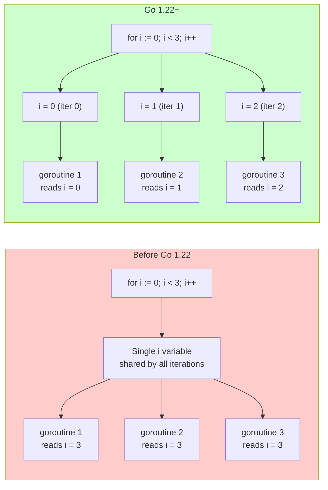
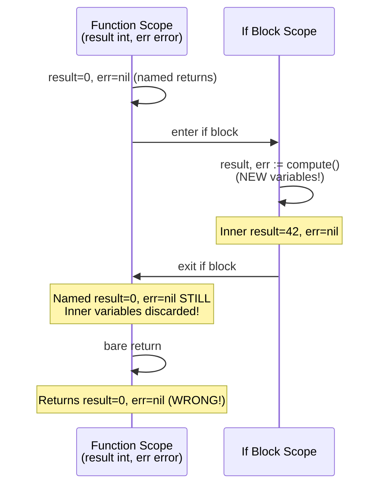
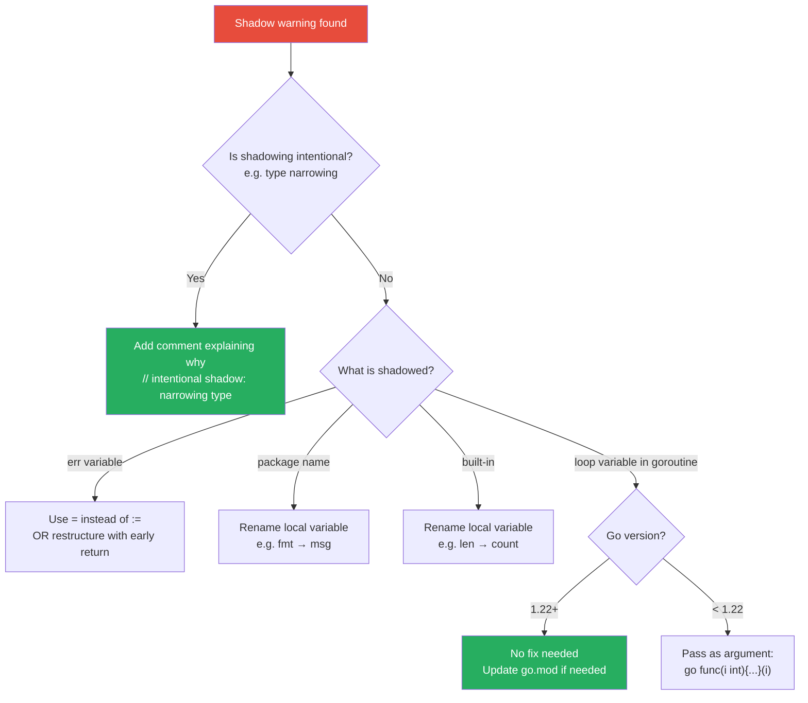

# Scope and Shadowing — Senior Level

## Table of Contents
1. [Introduction](#introduction)
2. [Code Review Standards](#code-review-standards)
3. [Go 1.22 Loop Variable Semantics](#go-122-loop-variable-semantics)
4. [Designing Shadow-Resistant Code](#designing-shadow-resistant-code)
5. [Team Linter Configuration](#team-linter-configuration)
6. [Advanced Closure Patterns](#advanced-closure-patterns)
7. [Scope in Concurrent Code](#scope-in-concurrent-code)
8. [Named Return Values: Deep Analysis](#named-return-values-deep-analysis)
9. [Static Analysis Integration](#static-analysis-integration)
10. [Refactoring Strategies](#refactoring-strategies)
11. [Context and Scope](#context-and-scope)
12. [Interface Scope Traps](#interface-scope-traps)
13. [Package Design and Scope](#package-design-and-scope)
14. [Testing Strategies for Scope Bugs](#testing-strategies-for-scope-bugs)
15. [Mentoring Junior Developers](#mentoring-junior-developers)
16. [Performance Implications](#performance-implications)
17. [Best Practices at Scale](#best-practices-at-scale)
18. [Diagrams & Visual Aids](#diagrams--visual-aids)
19. [Self-Assessment Checklist](#self-assessment-checklist)
20. [Summary](#summary)

---

## Introduction

> Focus: Code review checklists, team linter configuration, Go 1.22 changes, and designing code that minimizes shadowing risks.

At the senior level, scope and shadowing become a **code quality and team responsibility** issue. You are not just writing code — you are:
- Reviewing others' code for subtle scope bugs
- Designing systems that make scope bugs unlikely
- Configuring tooling that enforces standards across the team
- Teaching junior developers to avoid these pitfalls
- Understanding the deeper implications of Go 1.22's loop change

Senior engineers should treat any function with shadow warnings as a **design smell** — a sign that the function may be doing too much, nested too deeply, or using poor naming conventions.

---

## Code Review Standards

### Complete Code Review Checklist for Scope/Shadowing

```markdown
## Scope & Shadowing Review Checklist

### Critical (Block PR if present)
- [ ] err shadowed in nested if blocks causing error loss
- [ ] Security-related variable (authorized, token, user) shadowed
- [ ] Goroutine closure captures loop variable by reference (pre-1.22 module)
- [ ] Named return value accidentally shadowed with :=

### High (Request changes)
- [ ] Package-level names (fmt, os, io, http) used as local variable names
- [ ] Built-in functions (len, cap, make, new, append) shadowed
- [ ] Variable accumulator reset each loop iteration due to :=

### Medium (Comment/suggestion)
- [ ] Function deeper than 4 levels of nesting (high shadow risk)
- [ ] Same variable name reused in 3+ scopes within one function
- [ ] Generic names (result, data, value) used in nested code
- [ ] context.Context variable shadowed or renamed without documentation

### Low (Nit/style)
- [ ] Variable declared with var at top of function (could be closer to use)
- [ ] Intermediate variables that outlive their usefulness
- [ ] Intentional shadowing not commented
```

### How to Write Effective Review Comments

Instead of: "Shadowing issue"

Write:
```
The `:=` on line 47 creates a new `err` variable scoped to the `if` block,
leaving the outer `err` (line 32) unchanged. If step2 returns an error, it
will be silently discarded. Change `:=` to `=` to propagate the error, or
restructure this as an early return pattern to avoid the nesting entirely.

Reference: https://go.dev/ref/spec#Short_variable_declarations
```

### Automated Review with Custom Analyzers

```go
// custom_shadow_checker.go
// A simple AST-based checker for your team's specific patterns

package main

import (
    "go/ast"
    "go/parser"
    "go/token"
    "fmt"
)

func checkErrShadow(filename string) {
    fset := token.NewFileSet()
    f, err := parser.ParseFile(fset, filename, nil, 0)
    if err != nil {
        panic(err)
    }

    ast.Inspect(f, func(n ast.Node) bool {
        assign, ok := n.(*ast.AssignStmt)
        if !ok || assign.Tok.String() != ":=" {
            return true
        }
        for _, lhs := range assign.Lhs {
            ident, ok := lhs.(*ast.Ident)
            if ok && ident.Name == "err" {
                pos := fset.Position(assign.Pos())
                fmt.Printf("%s: potential err shadow at line %d\n",
                    filename, pos.Line)
            }
        }
        return true
    })
}
```

---

## Go 1.22 Loop Variable Semantics

### The Historical Problem

Before Go 1.22, the `for` statement created a single variable per loop and reused it across all iterations. This was an efficiency decision but caused widespread bugs:

```go
// Module with go 1.21 — old behavior
package main

import (
    "fmt"
    "sync"
)

func oldBehavior() {
    var wg sync.WaitGroup
    results := make([]int, 0)
    mu := sync.Mutex{}

    for i := 0; i < 5; i++ {
        wg.Add(1)
        go func() {
            defer wg.Done()
            mu.Lock()
            results = append(results, i) // all capture same i
            mu.Unlock()
        }()
    }
    wg.Wait()
    fmt.Println(results) // [5 5 5 5 5] — not [0 1 2 3 4]
}
```

### Go 1.22 Fix — Per-Iteration Variables

```go
// Module with go 1.22 — new behavior
// go.mod: go 1.22
package main

import (
    "fmt"
    "sync"
)

func newBehavior() {
    var wg sync.WaitGroup
    results := make([]int, 5)

    for i := 0; i < 5; i++ {
        wg.Add(1)
        i := i // In Go 1.22, this line is IMPLICIT — not needed
        go func() {
            defer wg.Done()
            results[i] = i * i
        }()
    }
    wg.Wait()
    fmt.Println(results) // [0 1 4 9 16]
}
```

### Range Loop Also Fixed

```go
// go 1.22+: range also gets per-iteration variables
handlers := make(map[string]http.HandlerFunc)
routes := []struct{ path, handler string }{
    {"/a", "handlerA"},
    {"/b", "handlerB"},
}

for _, route := range routes {
    // In Go 1.22, route is a fresh copy each iteration
    handlers[route.path] = func(w http.ResponseWriter, r *http.Request) {
        fmt.Fprintln(w, route.handler) // safe in Go 1.22
    }
}
```

### Migration Guide: Pre-1.22 to 1.22

When migrating a codebase from pre-1.22 to 1.22:

1. Update `go.mod`: `go 1.22`
2. Remove `i := i` workarounds (they become no-ops, not harmful)
3. Remove argument-passing patterns in goroutines (optional, they still work)
4. Run the full test suite — behavior changes may expose latent bugs
5. Check for code that **depended on** the shared variable behavior (rare but exists)

```bash
# Check for the old workaround pattern that can now be removed
grep -rn "i := i\|url := url\|v := v" ./
```

### GOEXPERIMENT=loopvar

Before Go 1.22, you could preview the new behavior:

```bash
GOEXPERIMENT=loopvar go test ./...
```

### Impact on Existing Tests

Some tests may break after upgrading to 1.22 if they relied on the old behavior:

```go
// This test might change behavior in Go 1.22
func TestLoopCapture(t *testing.T) {
    var funcs []func() int
    for i := 0; i < 3; i++ {
        funcs = append(funcs, func() int { return i })
    }
    // Pre-1.22: all return 3
    // Post-1.22: return 0, 1, 2
    for j, f := range funcs {
        if got := f(); got != j { // This assertion changes!
            t.Errorf("func[%d]() = %d, want %d", j, got, j)
        }
    }
}
```

---

## Designing Shadow-Resistant Code

### Design Principle 1: Single Level of Abstraction

Each function should operate at one level of abstraction. Deep nesting (which causes shadowing) is a sign of mixed abstraction levels:

```go
// BAD: mixed abstraction levels → deep nesting → shadow risk
func handleUserCreation(r *http.Request) (*User, error) {
    body, err := io.ReadAll(r.Body)
    if err != nil {
        return nil, err
    }
    var req CreateUserReq
    if err := json.Unmarshal(body, &req); err != nil {
        return nil, err
    }
    if req.Email == "" {
        return nil, errors.New("email required")
    }
    if exists, err := db.UserExists(req.Email); err != nil {
        return nil, err
    } else if exists {
        return nil, errors.New("email taken")
    }
    user, err := db.CreateUser(req)
    return user, err
}

// GOOD: each function at one level → flat → no shadow risk
func handleUserCreation(r *http.Request) (*User, error) {
    req, err := parseCreateUserRequest(r)
    if err != nil {
        return nil, err
    }
    return createUserInDB(req)
}

func parseCreateUserRequest(r *http.Request) (CreateUserReq, error) {
    var req CreateUserReq
    if err := json.NewDecoder(r.Body).Decode(&req); err != nil {
        return req, fmt.Errorf("decode: %w", err)
    }
    if req.Email == "" {
        return req, errors.New("email required")
    }
    return req, nil
}

func createUserInDB(req CreateUserReq) (*User, error) {
    exists, err := db.UserExists(req.Email)
    if err != nil {
        return nil, fmt.Errorf("check exists: %w", err)
    }
    if exists {
        return nil, errors.New("email taken")
    }
    return db.CreateUser(req)
}
```

### Design Principle 2: Pipeline Pattern

Transform data through a series of functions, each with its own scope:

```go
type pipeline[T any] struct {
    value T
    err   error
}

func (p pipeline[T]) Then(fn func(T) (T, error)) pipeline[T] {
    if p.err != nil {
        return p
    }
    val, err := fn(p.value)
    return pipeline[T]{value: val, err: err}
}

func (p pipeline[T]) Result() (T, error) {
    return p.value, p.err
}

// Usage: no shadowing possible
result, err := pipeline[Request]{value: req}.
    Then(validate).
    Then(enrich).
    Then(transform).
    Result()
```

### Design Principle 3: Options and Builder Patterns

Avoid nested scope by using functional options:

```go
type ServerConfig struct {
    host    string
    port    int
    timeout time.Duration
}

type Option func(*ServerConfig)

func WithHost(h string) Option { return func(c *ServerConfig) { c.host = h } }
func WithPort(p int) Option    { return func(c *ServerConfig) { c.port = p } }
func WithTimeout(d time.Duration) Option {
    return func(c *ServerConfig) { c.timeout = d }
}

func NewServer(opts ...Option) *Server {
    cfg := &ServerConfig{host: "localhost", port: 8080, timeout: 30 * time.Second}
    for _, opt := range opts {
        opt(cfg)  // no nested scope, no shadow risk
    }
    return &Server{cfg: cfg}
}
```

---

## Team Linter Configuration

### Production-Grade `.golangci.yml`

```yaml
# .golangci.yml — Production team configuration
run:
  timeout: 10m
  go: '1.22'
  tests: true

linters:
  disable-all: true
  enable:
    - govet          # includes shadow checker
    - staticcheck    # SA1006, SA4003, etc.
    - revive         # configurable linter
    - gocritic       # advanced checks
    - errorlint      # error wrapping checks
    - ineffassign    # detects assignments with no effect
    - unused         # unused code detection
    - nilerr         # nil error return patterns

linters-settings:
  govet:
    enable:
      - shadow
      - assign
      - composites
      - copylocks
      - loopclosure
      - lostcancel
      - unreachable

  staticcheck:
    checks:
      - "all"
      - "-SA1019"  # allow deprecated usage (team decision)

  revive:
    rules:
      - name: var-naming
      - name: redefines-builtin-id
        severity: error
      - name: shadow
        severity: warning

issues:
  exclude-rules:
    # Allow err shadowing in test files (common pattern)
    - path: "_test.go"
      linters:
        - govet
      text: "shadow"

  max-same-issues: 0
  max-issues-per-linter: 0
```

### IDE Integration

#### VS Code (settings.json)
```json
{
  "go.lintTool": "golangci-lint",
  "go.lintFlags": [
    "--fast",
    "--enable-all"
  ],
  "go.lintOnSave": "package",
  "[go]": {
    "editor.codeActionsOnSave": {
      "source.organizeImports": true
    }
  }
}
```

#### GoLand
GoLand has built-in shadow detection under:
`Preferences → Editor → Inspections → Go → Declaration shadowed by declaration in child scope`

Set severity to **Warning** or **Error** depending on your team's standards.

### Makefile Integration

```makefile
# Makefile

.PHONY: lint lint-shadow lint-strict

lint:
	golangci-lint run ./...

lint-shadow:
	go vet -vettool=$(shell which shadow) ./... 2>&1 | grep -v "^#"

lint-strict:
	golangci-lint run --enable-all --disable exhaustruct ./...

check-loop-vars:
	# Find old-style loop variable copy patterns (safe to remove with go 1.22)
	grep -rn ":= \w\+$" --include="*.go" . | grep -E "^\s+\w+ := \w+$$"
```

---

## Advanced Closure Patterns

### Closure as Scoped State Machine

```go
type Transition func(event string) Transition

func buildStateMachine() Transition {
    var idle, running, stopped Transition

    idle = func(event string) Transition {
        switch event {
        case "start":
            fmt.Println("idle → running")
            return running
        }
        return idle
    }

    running = func(event string) Transition {
        switch event {
        case "stop":
            fmt.Println("running → stopped")
            return stopped
        case "pause":
            fmt.Println("running → idle")
            return idle
        }
        return running
    }

    stopped = func(event string) Transition {
        fmt.Println("stopped, ignoring:", event)
        return stopped
    }

    return idle
}

func main() {
    state := buildStateMachine()
    state = state("start")  // idle → running
    state = state("stop")   // running → stopped
    state = state("start")  // stopped, ignoring: start
}
```

### Closure Capturing: Value vs Reference

```go
// Value copy (by passing as argument)
func makeValueClosure(n int) func() int {
    return func() int {
        return n // n is a copy, immutable from outside
    }
}

// Reference (by capturing)
func makeRefClosure() (get func() int, set func(int)) {
    n := 0
    get = func() int { return n }     // captures n by reference
    set = func(v int) { n = v }       // modifies the same n
    return
}

// Demonstrate difference
func demonstrateClosureCapture() {
    // Value: initial value is baked in
    f1 := makeValueClosure(42)
    fmt.Println(f1()) // 42 always

    // Reference: value can change
    get, set := makeRefClosure()
    fmt.Println(get()) // 0
    set(99)
    fmt.Println(get()) // 99
}
```

---

## Scope in Concurrent Code

### Race Condition from Scope Misuse

```go
// RACE: goroutines share outer variable
var result string
for _, s := range []string{"a", "b", "c"} {
    go func() {
        result = s + s // DATA RACE! both read s and write result
    }()
}

// CORRECT: each goroutine has its own copy
var mu sync.Mutex
var results []string
for _, s := range []string{"a", "b", "c"} {
    s := s
    go func() {
        doubled := s + s
        mu.Lock()
        results = append(results, doubled)
        mu.Unlock()
    }()
}
```

### Scoped Mutex Pattern

```go
type SafeMap struct {
    mu sync.RWMutex
    m  map[string]int
}

func (sm *SafeMap) Get(key string) (int, bool) {
    sm.mu.RLock()
    defer sm.mu.RUnlock()
    v, ok := sm.m[key]  // sm.mu is in function scope — clean
    return v, ok
}

func (sm *SafeMap) Set(key string, val int) {
    sm.mu.Lock()
    defer sm.mu.Unlock()
    sm.m[key] = val
}
```

### WaitGroup and Channel Scope

```go
func fanOut(inputs []int, workers int) []int {
    jobs := make(chan int, len(inputs))
    results := make(chan int, len(inputs))

    // Start workers — each captures jobs and results by reference (correct)
    var wg sync.WaitGroup
    for w := 0; w < workers; w++ {
        wg.Add(1)
        go func() {
            defer wg.Done()
            for job := range jobs {
                results <- job * job
            }
        }()
    }

    // Send jobs
    for _, input := range inputs {
        jobs <- input
    }
    close(jobs)

    // Collect results in goroutine
    go func() {
        wg.Wait()
        close(results)
    }()

    var out []int
    for r := range results {
        out = append(out, r)
    }
    return out
}
```

---

## Named Return Values: Deep Analysis

Named return values are a scoping feature that deserves careful attention:

### When Named Returns Help

```go
// Named returns can simplify defer cleanup
func readConfig(path string) (cfg Config, err error) {
    f, err := os.Open(path)
    if err != nil {
        return  // bare return with named values
    }
    defer func() {
        if cerr := f.Close(); cerr != nil && err == nil {
            err = cerr  // upgrade err if file close fails
        }
    }()

    err = json.NewDecoder(f).Decode(&cfg)
    return
}
```

### When Named Returns Create Shadow Traps

```go
// BUG: data and err are named returns but shadowed immediately
func fetchData() (data []byte, err error) {
    if data, err := httpGet(url); err != nil {  // NEW data and err!
        return nil, err  // explicit return — OK
    } else {
        // data here is the inner data, not the named return
        return data, nil
    }
    // Named return 'data' was never assigned!
}

// CORRECT: use assignment operators
func fetchDataCorrect() (data []byte, err error) {
    data, err = httpGet(url)  // assigns to named returns
    return
}
```

### Named Returns and Defer Interaction

```go
// Advanced: defer can modify named return values
func divide(a, b float64) (result float64, err error) {
    defer func() {
        if r := recover(); r != nil {
            err = fmt.Errorf("panic: %v", r)
            result = 0
        }
    }()
    // If b == 0, this panics
    result = a / b
    return
}
```

---

## Static Analysis Integration

### Writing a Custom Analyzer

```go
// shadow_check/analyzer.go
package shadow_check

import (
    "go/ast"
    "go/types"

    "golang.org/x/tools/go/analysis"
    "golang.org/x/tools/go/analysis/passes/inspect"
    "golang.org/x/tools/go/ast/inspector"
)

var Analyzer = &analysis.Analyzer{
    Name:     "errorshadow",
    Doc:      "checks for shadowed err variables",
    Run:      run,
    Requires: []*analysis.Analyzer{inspect.Analyzer},
}

func run(pass *analysis.Pass) (interface{}, error) {
    insp := pass.ResultOf[inspect.Analyzer].(*inspector.Inspector)

    nodeFilter := []ast.Node{
        (*ast.AssignStmt)(nil),
    }

    insp.Preorder(nodeFilter, func(n ast.Node) {
        assign := n.(*ast.AssignStmt)
        if assign.Tok.String() != ":=" {
            return
        }

        for _, lhs := range assign.Lhs {
            ident, ok := lhs.(*ast.Ident)
            if !ok || ident.Name != "err" {
                continue
            }

            // Check if err already exists in an outer scope
            obj := pass.TypesInfo.Defs[ident]
            if obj == nil {
                continue
            }

            // Look for same name in enclosing scopes
            scope := obj.Parent()
            if scope == nil {
                continue
            }
            outer := scope.Parent()
            for outer != nil {
                if outerObj := outer.Lookup("err"); outerObj != nil {
                    pass.Reportf(ident.Pos(),
                        "err shadowed: outer err at %s",
                        pass.Fset.Position(outerObj.Pos()))
                    break
                }
                outer = outer.Parent()
            }
        }
    })

    return nil, nil
}
```

### Integrating Custom Analyzer

```go
// cmd/errcheck/main.go
package main

import (
    "myproject/shadow_check"
    "golang.org/x/tools/go/analysis/singlechecker"
)

func main() {
    singlechecker.Main(shadow_check.Analyzer)
}
```

---

## Refactoring Strategies

### Strategy 1: Extract Method Refactoring

When a function has deep nesting with shadow risk, extract inner blocks:

```go
// Before: 4 levels deep, shadow risk
func complexHandler(w http.ResponseWriter, r *http.Request) {
    if r.Method == "POST" {
        body, err := io.ReadAll(r.Body)
        if err == nil {
            var data InputData
            if err := json.Unmarshal(body, &data); err == nil {
                if result, err := processData(data); err == nil {
                    json.NewEncoder(w).Encode(result)
                } else {
                    http.Error(w, err.Error(), 500)
                }
            } else {
                http.Error(w, err.Error(), 400)
            }
        } else {
            http.Error(w, err.Error(), 400)
        }
    }
}

// After: flat, no shadow risk
func complexHandlerRefactored(w http.ResponseWriter, r *http.Request) {
    if r.Method != "POST" {
        return
    }

    data, err := decodeInput(r.Body)
    if err != nil {
        http.Error(w, err.Error(), http.StatusBadRequest)
        return
    }

    result, err := processData(data)
    if err != nil {
        http.Error(w, err.Error(), http.StatusInternalServerError)
        return
    }

    json.NewEncoder(w).Encode(result)
}

func decodeInput(r io.Reader) (InputData, error) {
    var data InputData
    if err := json.NewDecoder(r).Decode(&data); err != nil {
        return data, fmt.Errorf("decode: %w", err)
    }
    return data, nil
}
```

### Strategy 2: Error Accumulation Pattern

```go
// For multiple independent validations — avoids nested err shadows
type ValidationError struct {
    Field   string
    Message string
}

type Validator struct {
    errors []ValidationError
}

func (v *Validator) Check(field, msg string, ok bool) {
    if !ok {
        v.errors = append(v.errors, ValidationError{field, msg})
    }
}

func (v *Validator) Valid() bool { return len(v.errors) == 0 }

func validateUser(u User) error {
    v := &Validator{}
    v.Check("email", "required", u.Email != "")
    v.Check("email", "invalid format", isValidEmail(u.Email))
    v.Check("name", "required", u.Name != "")
    v.Check("age", "must be 18+", u.Age >= 18)

    if !v.Valid() {
        return fmt.Errorf("validation: %+v", v.errors)
    }
    return nil
}
```

---

## Context and Scope

The `context.Context` pattern interacts with scope in important ways:

```go
// Anti-pattern: context shadowed in middleware chain
func middlewareChain(next http.Handler) http.Handler {
    return http.HandlerFunc(func(w http.ResponseWriter, r *http.Request) {
        ctx := r.Context()

        // Each middleware adds to context
        ctx = context.WithValue(ctx, "requestID", generateID())

        // BAD: using same name for deadline context
        ctx, cancel := context.WithDeadline(ctx, deadline)
        defer cancel()
        // Now the original ctx is completely lost — is this intentional?

        next.ServeHTTP(w, r.WithContext(ctx))
    })
}

// Better: use explicit names when context changes meaning
func middlewareChainClear(next http.Handler) http.Handler {
    return http.HandlerFunc(func(w http.ResponseWriter, r *http.Request) {
        baseCtx := r.Context()
        enrichedCtx := context.WithValue(baseCtx, "requestID", generateID())
        deadlineCtx, cancel := context.WithDeadline(enrichedCtx, deadline)
        defer cancel()

        next.ServeHTTP(w, r.WithContext(deadlineCtx))
    })
}
```

---

## Interface Scope Traps

```go
// Subtle bug: interface variable shadowed by concrete type
func processResult(r io.Reader) error {
    // r is io.Reader (interface)

    if r, ok := r.(*os.File); ok {  // r is now *os.File
        _ = r.Sync()  // file-specific method
    }
    // Here r is still io.Reader — this is intentional and safe

    // BUG potential:
    data, err := io.ReadAll(r)
    if err != nil {
        return err
    }
    fmt.Println(string(data))
    return nil
}
```

---

## Package Design and Scope

### Exported vs Unexported: Intentional Access Control

```go
package user

// Exported: accessible from other packages
type User struct {
    ID    int
    Email string
    Name  string
}

// unexported: internal implementation detail
type userCache struct {
    mu    sync.RWMutex
    items map[int]*User
}

// Exported: controlled interface to unexported type
func NewCache() *userCache {
    return &userCache{items: make(map[int]*User)}
}
```

### Package-Level Variable Scope Risks

```go
// Package-level variables are accessible from ALL files in the package
// This creates implicit coupling and shadowing risks

// antipattern: package-level mutable state
var globalConfig Config
var globalDB *sql.DB

// Better: dependency injection
type App struct {
    config Config
    db     *sql.DB
}

func NewApp(config Config, db *sql.DB) *App {
    return &App{config: config, db: db}
}
```

---

## Testing Strategies for Scope Bugs

### Table-Driven Tests for Shadow Scenarios

```go
func TestScopeSafety(t *testing.T) {
    t.Run("accumulator not reset", func(t *testing.T) {
        nums := []int{1, 2, 3, 4, 5}
        sum := computeSum(nums) // if := bug, returns 0
        if sum != 15 {
            t.Errorf("got %d, want 15", sum)
        }
    })

    t.Run("error not swallowed", func(t *testing.T) {
        // Force each step to fail independently
        err := processWithSteps(failAt(2)) // fail at step 2
        if err == nil {
            t.Error("expected error from step 2 to propagate")
        }
    })

    t.Run("goroutine captures correct values", func(t *testing.T) {
        results := collectFromGoroutines([]int{10, 20, 30})
        sort.Ints(results)
        want := []int{10, 20, 30}
        if !reflect.DeepEqual(results, want) {
            t.Errorf("got %v, want %v", results, want)
        }
    })
}
```

### Race Detector Integration

```bash
# Run all tests with race detector
go test -race ./...

# Race detector catches scope-related data races
# Particularly goroutine loop capture bugs
```

---

## Mentoring Junior Developers

### Common Teaching Points

1. **The `:=` intuition**: "`:=` is a declaration, not an assignment. It always creates something new. `=` assigns to something that already exists."

2. **The shadow mantra**: "If you can't change the outer variable, add `:=`. If you can, use `=`."

3. **The address trick**: "When debugging, print `&x` before and after a shadow. If they're the same address, no shadow. If different, there's a shadow."

4. **The naming principle**: "If you find yourself wanting to name two variables the same thing in nested scopes, that's Go's way of telling you the function is doing too much."

### Code Review Teaching Template

```markdown
Good catch on step 2! Let me explain what's happening here:

When you write `err := doB()` inside the `if err != nil` block, Go creates a
brand new variable called `err` that only exists inside that if block. The outer
`err` (which holds `doA()`'s error) is completely unchanged.

Think of it like this: you put a sticky note labeled "err" on a piece of paper,
then went into a room and put a DIFFERENT sticky note also labeled "err" on
another piece of paper. When you leave the room, you're back to the original
sticky note — the room's sticky note is gone.

To fix this, change `:=` to `=` on that line. This tells Go "update the existing
err variable" instead of "create a new err variable."
```

---

## Performance Implications

### Escape Analysis and Scope

Variables in tighter scopes are more likely to be allocated on the stack:

```go
// Stack allocation — x stays on stack (tight scope)
func stackBound() int {
    x := 42
    return x * 2
}

// Heap allocation — x escapes to heap (captured by closure)
func heapEscape() func() int {
    x := 42
    return func() int { return x }
}
```

### Checking Escape Analysis

```bash
go build -gcflags="-m -m" ./... 2>&1 | grep "escapes to heap"
```

### Large Variables and Scope

```go
// Good: large buffer scoped tightly — freed after function returns
func processBatch(data []Item) error {
    buf := make([]byte, 4*1024*1024) // 4MB — stays in function scope
    for _, item := range data {
        n := item.Serialize(buf)
        if err := sendBytes(buf[:n]); err != nil {
            return err
        }
    }
    return nil // buf goes out of scope, eligible for GC
}
```

---

## Best Practices at Scale

### 1. Encode Shadow Rules in Architecture Decision Records (ADR)

```markdown
## ADR-042: Variable Shadowing Policy

### Status: Accepted

### Context
We have had 3 production incidents caused by accidental err shadowing.

### Decision
- golangci-lint with shadow checker is mandatory in CI
- PRs with shadow warnings require explicit approval from tech lead
- The `i := i` pattern is banned (use Go 1.22+ instead)
- Package name reuse as variable names is a blocking issue

### Consequences
- ~15% increase in code review time initially
- Estimated 90% reduction in shadow-related bugs
```

### 2. Repository-Level Configuration

```
my-service/
├── .golangci.yml          # linter configuration
├── .editorconfig          # editor configuration
├── Makefile               # lint, test, build targets
├── go.mod                 # go 1.22 specified
└── CONTRIBUTING.md        # mentions shadow policy
```

---

## Postmortems & System Failures

### Postmortem 1: Goroutine Closure Loop Variable Bug — Data Race in Email Campaign System

**Incident:** An email campaign system sent the same email (the last one in the batch) to thousands of users instead of each user's personalized email. The bug was in production for two campaigns.

**Root Cause (pre-Go 1.22 behavior):**
```go
// Go 1.21 and earlier: loop variable is shared across iterations
func sendCampaign(users []User) {
    var wg sync.WaitGroup
    for _, user := range users {
        wg.Add(1)
        go func() {
            defer wg.Done()
            // BUG: 'user' is captured by reference!
            // By the time goroutine runs, loop has advanced.
            sendEmail(user.Email, user.Name)  // always sends to last user!
        }()
    }
    wg.Wait()
}
```

**Fix (Go 1.21 style):**
```go
for _, user := range users {
    user := user  // create new variable scoped to this iteration
    wg.Add(1)
    go func() {
        defer wg.Done()
        sendEmail(user.Email, user.Name)  // captures the local copy
    }()
}
```

**Fix (Go 1.22+ — automatic):**
```go
// In go.mod: go 1.22
// No workaround needed — each iteration gets its own variable
for _, user := range users {
    wg.Add(1)
    go func() {
        defer wg.Done()
        sendEmail(user.Email, user.Name)  // correct in Go 1.22+
    }()
}
```

**Lesson:** The pre-Go 1.22 loop variable closure bug is one of the most common Go mistakes in production. Upgrading to Go 1.22+ eliminates it structurally. Until then, the `user := user` pattern is mandatory when launching goroutines in loops.

### Postmortem 2: err Shadowing Silent Data Corruption in Batch Processor

**Incident:** A financial batch processor silently skipped error handling for thousands of records. Records with errors were marked as "processed" in the database, causing accounting discrepancies discovered only during quarterly audit.

**Root Cause:**
```go
func processBatch(records []Record) error {
    var err error

    for _, r := range records {
        result, err := processRecord(r)  // BUG: shadows outer err with :=
        if err != nil {
            log.Printf("failed record %d: %v", r.ID, err)
            continue
        }

        err = saveResult(result)  // BUG: this 'err' is the INNER scoped err
        // The outer 'err' is never updated!
        if err != nil {
            return err
        }
    }

    return err  // outer err is always nil!
}
```

**Why it's subtle:** The `result, err :=` inside the for loop creates a new `err` variable scoped to that loop iteration. The `saveResult(result)` uses that inner `err`. The outer `err` declared before the loop is never updated, so the function always returns `nil`.

**Fix:**
```go
func processBatch(records []Record) error {
    for _, r := range records {
        result, err := processRecord(r)  // err scoped to this block
        if err != nil {
            log.Printf("failed record %d: %v", r.ID, err)
            continue
        }

        if err = saveResult(result); err != nil {  // reuses same err
            return fmt.Errorf("saving record %d: %w", r.ID, err)
        }
    }
    return nil
}
```

**Lesson:** The `err` shadowing pattern is particularly dangerous in loops and conditional blocks. The `go vet -shadow` tool or `golangci-lint` with shadow enabled catches this. Make it part of your CI pipeline.

### Postmortem 3: Package-Level Variable Shadowed by Import — 6-Hour Outage

**Incident:** A microservice deployed a new version that failed all health checks for 6 hours. The binary started successfully but all database operations returned "operation not permitted."

**Root Cause:**
```go
package main

import (
    "database/sql"
    "log"
)

// Package-level db connection
var db *sql.DB

func init() {
    db, err := sql.Open("postgres", connStr)  // BUG: := shadows package-level db!
    if err != nil {
        log.Fatal(err)
    }
    if err := db.Ping(); err != nil {  // pings the LOCAL db, not package-level
        log.Fatal(err)
    }
    // init() returns: local db is garbage collected!
    // package-level db remains nil
}

func handleQuery() {
    rows, err := db.Query("SELECT ...")  // PANIC: nil pointer on package-level db
    // ...
}
```

**Fix:**
```go
func init() {
    var err error
    db, err = sql.Open("postgres", connStr)  // plain = assigns to package-level db
    if err != nil {
        log.Fatal(err)
    }
    if err = db.Ping(); err != nil {
        log.Fatal(err)
    }
}
```

**Lesson:** Using `:=` when assigning to package-level variables inside `init()` or any function is one of the most dangerous shadowing bugs. The package-level variable silently remains nil. Always use plain `=` when assigning to already-declared variables.

---

## Diagrams & Visual Aids

### Diagram 1: Go 1.22 Loop Variable Change



### Diagram 2: Named Return Value Shadow



### Diagram 3: Shadow Refactoring Decision Tree



---

## Self-Assessment Checklist

- [ ] I can write a complete code review comment for a shadow bug with fix suggestion
- [ ] I can configure golangci-lint with shadow detection for a team project
- [ ] I understand the Go 1.22 loop variable change and its implications for migration
- [ ] I can design code using early returns to eliminate shadow risk
- [ ] I can explain escape analysis in relation to variable scope
- [ ] I can write a custom AST analyzer to detect project-specific shadow patterns
- [ ] I can teach juniors the `:=` vs `=` mental model clearly
- [ ] I understand named return value interaction with shadowing in defer
- [ ] I can identify race conditions caused by scope misuse in goroutines

---

## Summary

Senior-level scope and shadowing work is about **prevention, detection, and teaching**:

1. **Prevention**: Design code with single-level abstractions, early returns, and clear naming to make shadowing structurally unlikely.

2. **Detection**: Configure golangci-lint with shadow checks, integrate into CI, write table-driven tests that verify expected error propagation behavior.

3. **Go 1.22**: The loop variable semantic change is one of Go's most significant quality-of-life improvements. Upgrade to `go 1.22` in your module and remove workarounds.

4. **Teaching**: Use the address-printing trick and clear mental models (`:=` always creates, `=` always assigns) to help team members internalize the rules.

5. **Architecture**: Encode shadow policy in ADRs and enforce via tooling — human code review alone is insufficient for catching subtle shadow bugs.
