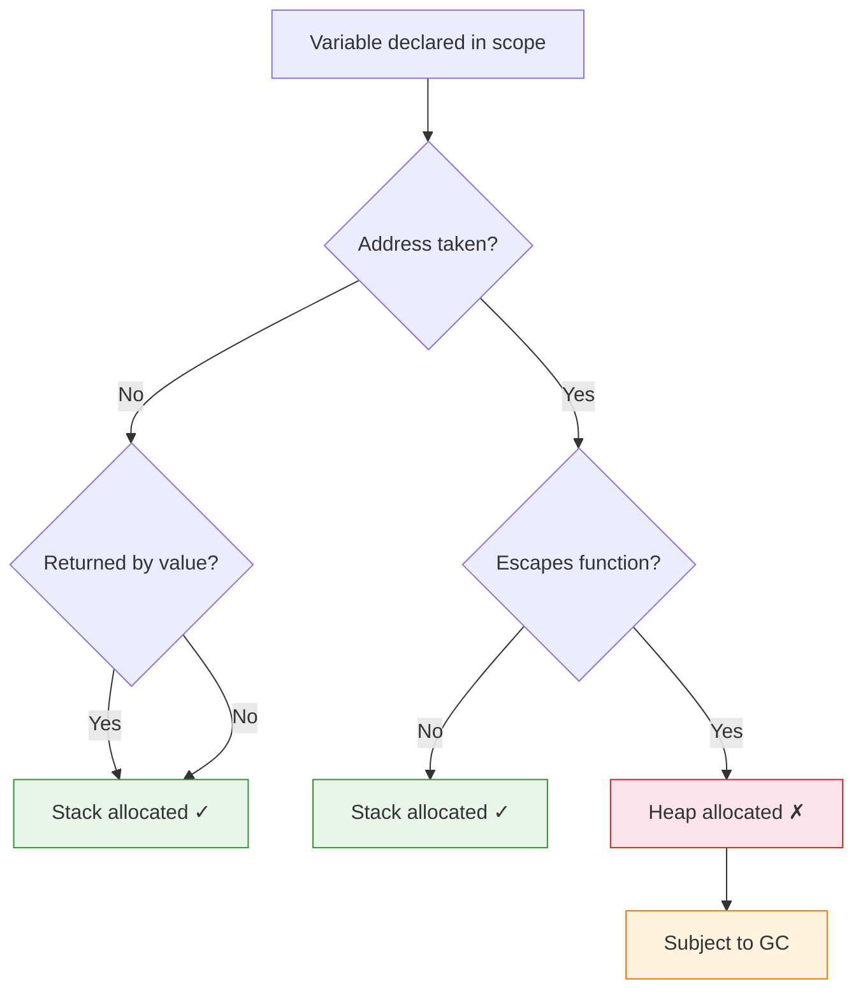
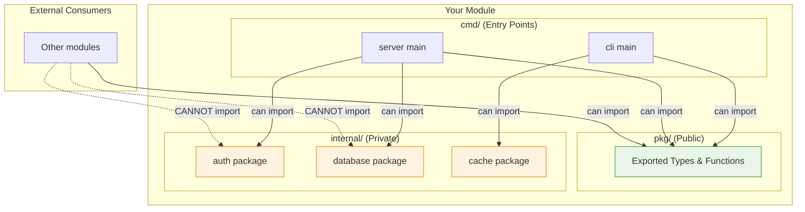
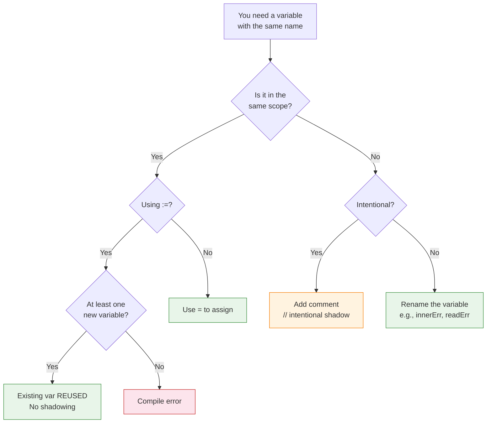

# Scope and Shadowing — Senior Level

## Table of Contents

1. [Introduction](#introduction)
2. [Core Concepts](#core-concepts)
3. [Pros & Cons](#pros--cons)
4. [Use Cases](#use-cases)
5. [Code Examples](#code-examples)
6. [Coding Patterns](#coding-patterns)
7. [Clean Code](#clean-code)
8. [Best Practices](#best-practices)
9. [Product Use / Feature](#product-use--feature)
10. [Error Handling](#error-handling)
11. [Security Considerations](#security-considerations)
12. [Performance Optimization](#performance-optimization)
13. [Metrics & Analytics](#metrics--analytics)
14. [Debugging Guide](#debugging-guide)
15. [Edge Cases & Pitfalls](#edge-cases--pitfalls)
16. [Postmortems](#postmortems)
17. [Common Mistakes](#common-mistakes)
18. [Tricky Points](#tricky-points)
19. [Comparison with Other Languages](#comparison-with-other-languages)
20. [Test](#test)
21. [Tricky Questions](#tricky-questions)
22. [Cheat Sheet](#cheat-sheet)
23. [Summary](#summary)
24. [What You Can Build](#what-you-can-build)
25. [Further Reading](#further-reading)
26. [Related Topics](#related-topics)
27. [Diagrams & Visual Aids](#diagrams--visual-aids)

---

## Introduction

> Focus: "How to optimize?" and "How to architect?"

At the senior level, scope and shadowing are not just language features to understand — they are tools for **architectural decision-making**. You must consider how scope impacts memory lifetime, escape analysis, compiler optimizations, API design, and team-wide code quality.

Senior engineers design systems where scope is deliberate: package-level state is minimized, function scopes are flat, closures capture only what they need, and linting rules enforce shadow detection in CI. You also understand the compiler's perspective — how scope affects stack allocation, inlining decisions, and garbage collection pressure.

This section covers advanced scope patterns, performance implications, postmortem analysis of scope-related production bugs, and strategies for building scope-aware tooling into your development workflow.

---

## Core Concepts

### Scope and Escape Analysis

The Go compiler's escape analysis determines whether a variable can live on the stack (fast) or must be allocated on the heap (slower, requires GC). Scope directly influences this decision:

```go
package main

import "fmt"

// This variable escapes to the heap because it is returned
func createEscaping() *int {
    x := 42    // x is declared in function scope
    return &x  // x escapes — must be heap-allocated
}

// This variable stays on the stack — narrow scope, no escape
func createNonEscaping() int {
    x := 42
    return x // value copy — x stays on stack
}

// Shadowing can affect escape analysis
func shadowAndEscape() *int {
    x := 10 // stack-allocated (does not escape)
    if true {
        x := 20   // new x, also stack-allocated initially
        return &x  // THIS x escapes to heap
    }
    _ = x
    return nil
}
```

Verify escape analysis:

```bash
go build -gcflags="-m -m" main.go 2>&1 | grep "escapes\|moved to heap"
```

### Scope in Compiler SSA Representation

The Go compiler converts code to Static Single Assignment (SSA) form, where each variable is assigned exactly once. Shadowing creates distinct SSA variables:

```go
func ssaDemo() {
    x := 1    // SSA: x_1 = 1
    x = 2     // SSA: x_2 = 2 (same variable, new version)

    if true {
        x := 3 // SSA: x_3 = 3 (different variable entirely)
        _ = x
    }
    // SSA: after if, x refers to x_2
    _ = x
}
```

View SSA output:

```bash
GOSSAFUNC=ssaDemo go build main.go
# Opens ssa.html in browser showing SSA passes
```

### Scope-Driven API Design

```go
// Package-level scope defines the public API
package cache

import (
    "sync"
    "time"
)

// Exported: part of the public API
type Cache struct {
    mu      sync.RWMutex     // unexported: implementation detail
    items   map[string]entry  // unexported: internal data structure
    maxSize int              // unexported: configuration
}

// unexported: internal type, never exposed to callers
type entry struct {
    value     interface{}
    expiresAt time.Time
}

// Exported: public method
func (c *Cache) Get(key string) (interface{}, bool) {
    c.mu.RLock()
    defer c.mu.RUnlock()

    e, ok := c.items[key]
    if !ok || time.Now().After(e.expiresAt) {
        return nil, false
    }
    return e.value, true
}

// Exported: public constructor
func New(maxSize int) *Cache {
    return &Cache{
        items:   make(map[string]entry),
        maxSize: maxSize,
    }
}

// unexported: internal helper, not part of public API
func (c *Cache) evict() {
    // implementation detail
}
```

### Scope and the `internal` Package Pattern

```
myproject/
├── cmd/
│   └── server/
│       └── main.go          // can import internal
├── internal/                 // Go enforces: only parent tree can import
│   ├── auth/
│   │   └── auth.go          // unexported from external, scoped to project
│   └── database/
│       └── db.go
├── pkg/                      // public packages
│   └── api/
│       └── api.go
└── go.mod
```

The `internal` directory is a scope mechanism enforced by the Go toolchain — no external module can import packages under `internal/`.

---

## Pros & Cons

| Pros | Cons |
|------|------|
| Lexical scope enables aggressive compiler optimizations | Complex closures can be hard to reason about |
| Escape analysis uses scope for stack/heap decisions | Scope-related bugs are silent (no compiler warnings) |
| `internal` package provides module-level scoping | No `protected`-equivalent access modifier |
| Simple exported/unexported rule scales well | Refactoring exported names is a breaking change |
| Per-iteration loop vars (Go 1.22+) eliminate a bug class | Must ensure go.mod targets 1.22+ to benefit |

---

## Use Cases

1. **High-performance services** — Scope-aware allocation to minimize GC pressure
2. **Library design** — Exported/unexported API boundaries
3. **Concurrent systems** — Properly scoped closures for goroutine safety
4. **Plugin architectures** — `internal` packages for implementation hiding
5. **Error tracking systems** — Scoped error context accumulation
6. **Code generation** — Generated code must respect scope rules

---

## Code Examples

### Example 1: Scope-Optimized Worker Pool

```go
package main

import (
    "context"
    "fmt"
    "sync"
)

type Job struct {
    ID   int
    Data string
}

type Result struct {
    JobID  int
    Output string
    Err    error
}

func workerPool(ctx context.Context, jobs <-chan Job, numWorkers int) <-chan Result {
    results := make(chan Result, numWorkers)

    var wg sync.WaitGroup
    for i := 0; i < numWorkers; i++ {
        wg.Add(1)
        // Each goroutine has its own scope — workerID is scoped per-goroutine
        workerID := i
        go func() {
            defer wg.Done()
            for {
                select {
                case job, ok := <-jobs:
                    if !ok {
                        return
                    }
                    // job is scoped to this select case in Go 1.22+
                    result := processJob(workerID, job)
                    select {
                    case results <- result:
                    case <-ctx.Done():
                        return
                    }
                case <-ctx.Done():
                    return
                }
            }
        }()
    }

    // Close results channel when all workers are done
    go func() {
        wg.Wait()
        close(results)
    }()

    return results
}

func processJob(workerID int, job Job) Result {
    output := fmt.Sprintf("worker-%d processed job-%d: %s", workerID, job.ID, job.Data)
    return Result{JobID: job.ID, Output: output}
}
```

### Example 2: Middleware Chain with Scoped Context

```go
package middleware

import (
    "context"
    "log"
    "net/http"
    "time"
)

type contextKey string

const (
    requestIDKey contextKey = "request_id"
    userIDKey    contextKey = "user_id"
)

func RequestID(next http.Handler) http.Handler {
    return http.HandlerFunc(func(w http.ResponseWriter, r *http.Request) {
        // requestID is scoped to this handler invocation
        requestID := generateID()
        // Context creates a new scope for downstream handlers
        ctx := context.WithValue(r.Context(), requestIDKey, requestID)
        next.ServeHTTP(w, r.WithContext(ctx))
    })
}

func Logging(next http.Handler) http.Handler {
    return http.HandlerFunc(func(w http.ResponseWriter, r *http.Request) {
        start := time.Now() // scoped to this invocation
        next.ServeHTTP(w, r)
        duration := time.Since(start) // captured in closure scope
        requestID, _ := r.Context().Value(requestIDKey).(string)
        log.Printf("[%s] %s %s %v", requestID, r.Method, r.URL.Path, duration)
    })
}

func Auth(next http.Handler) http.Handler {
    return http.HandlerFunc(func(w http.ResponseWriter, r *http.Request) {
        token := r.Header.Get("Authorization")
        if token == "" {
            http.Error(w, "unauthorized", http.StatusUnauthorized)
            return // early return — no scope leakage
        }

        userID, err := validateToken(token) // err scoped to this function
        if err != nil {
            http.Error(w, "invalid token", http.StatusForbidden)
            return
        }

        ctx := context.WithValue(r.Context(), userIDKey, userID)
        next.ServeHTTP(w, r.WithContext(ctx))
    })
}
```

### Example 3: Scope-Aware Error Wrapping

```go
package main

import (
    "errors"
    "fmt"
)

type AppError struct {
    Op      string
    Kind    ErrorKind
    Err     error
    Context map[string]interface{}
}

type ErrorKind int

const (
    KindNotFound ErrorKind = iota
    KindConflict
    KindInternal
)

func (e *AppError) Error() string {
    return fmt.Sprintf("op=%s kind=%d: %v", e.Op, e.Kind, e.Err)
}

func (e *AppError) Unwrap() error { return e.Err }

// Each function creates a scoped error context
func getUser(id string) (*User, error) {
    user, err := db.FindUser(id)
    if err != nil {
        // err is scoped — we wrap it with operation context
        return nil, &AppError{
            Op:   "getUser",
            Kind: KindNotFound,
            Err:  err,
            Context: map[string]interface{}{
                "user_id": id,
            },
        }
    }
    return user, nil
}

func updateUser(id string, data UpdateData) error {
    user, err := getUser(id) // err reused in this scope
    if err != nil {
        return &AppError{Op: "updateUser", Err: err}
    }

    err = user.Apply(data) // same err variable — no shadowing
    if err != nil {
        return &AppError{Op: "updateUser.apply", Kind: KindConflict, Err: err}
    }

    err = db.Save(user) // same err variable
    if err != nil {
        return &AppError{Op: "updateUser.save", Kind: KindInternal, Err: err}
    }

    return nil
}
```

### Example 4: Functional Options Pattern (Scope-Controlled Configuration)

```go
package server

import (
    "time"
    "log"
)

type Server struct {
    addr         string
    readTimeout  time.Duration
    writeTimeout time.Duration
    logger       *log.Logger
    maxConns     int
}

// Option is an unexported function type — callers use exported constructors
type Option func(*Server)

// Exported option constructors — these are the public API
func WithAddr(addr string) Option {
    return func(s *Server) {
        s.addr = addr
    }
}

func WithTimeouts(read, write time.Duration) Option {
    return func(s *Server) {
        s.readTimeout = read
        s.writeTimeout = write
    }
}

func WithLogger(logger *log.Logger) Option {
    return func(s *Server) {
        s.logger = logger
    }
}

func WithMaxConns(n int) Option {
    return func(s *Server) {
        if n > 0 {
            s.maxConns = n
        }
    }
}

func New(opts ...Option) *Server {
    // Default values scoped to the constructor
    s := &Server{
        addr:         ":8080",
        readTimeout:  5 * time.Second,
        writeTimeout: 10 * time.Second,
        maxConns:     100,
    }

    for _, opt := range opts {
        opt(s) // Each option closure modifies s in its own scope
    }

    return s
}
```

### Example 5: Table-Driven Tests with Proper Scope

```go
package calc

import "testing"

func TestDivide(t *testing.T) {
    tests := []struct {
        name    string
        a, b    float64
        want    float64
        wantErr bool
    }{
        {"normal", 10, 2, 5, false},
        {"zero divisor", 10, 0, 0, true},
        {"negative", -10, 2, -5, false},
        {"both negative", -10, -2, 5, false},
        {"float precision", 1, 3, 0.333333, false},
    }

    for _, tt := range tests {
        // Go 1.22+: tt is per-iteration, safe to use in t.Run
        t.Run(tt.name, func(t *testing.T) {
            // t here shadows the outer t — this is intentional and correct
            got, err := Divide(tt.a, tt.b)
            if (err != nil) != tt.wantErr {
                t.Errorf("Divide(%v, %v) error = %v, wantErr %v",
                    tt.a, tt.b, err, tt.wantErr)
                return
            }
            if !tt.wantErr && !almostEqual(got, tt.want) {
                t.Errorf("Divide(%v, %v) = %v, want %v",
                    tt.a, tt.b, got, tt.want)
            }
        })
    }
}

func almostEqual(a, b float64) bool {
    const epsilon = 1e-4
    diff := a - b
    if diff < 0 {
        diff = -diff
    }
    return diff < epsilon
}
```

---

## Coding Patterns

### Pattern 1: Scope-Isolated Transactions

```go
func transferFunds(ctx context.Context, db *sql.DB, from, to string, amount float64) error {
    // Transaction scoped to this function
    tx, err := db.BeginTx(ctx, nil)
    if err != nil {
        return fmt.Errorf("begin tx: %w", err)
    }
    // Defer rollback — will be no-op if committed
    defer tx.Rollback()

    // Each operation uses tx (scoped to this function), not db
    var balance float64
    err = tx.QueryRowContext(ctx,
        "SELECT balance FROM accounts WHERE id = $1 FOR UPDATE", from).Scan(&balance)
    if err != nil {
        return fmt.Errorf("query balance: %w", err)
    }

    if balance < amount {
        return fmt.Errorf("insufficient funds: have %.2f, need %.2f", balance, amount)
    }

    _, err = tx.ExecContext(ctx,
        "UPDATE accounts SET balance = balance - $1 WHERE id = $2", amount, from)
    if err != nil {
        return fmt.Errorf("debit: %w", err)
    }

    _, err = tx.ExecContext(ctx,
        "UPDATE accounts SET balance = balance + $1 WHERE id = $2", amount, to)
    if err != nil {
        return fmt.Errorf("credit: %w", err)
    }

    if err := tx.Commit(); err != nil {
        return fmt.Errorf("commit: %w", err)
    }

    return nil
}
```

### Pattern 2: Scope-Based Resource Pool

```go
type Pool struct {
    mu       sync.Mutex
    conns    []*Conn
    maxConns int
}

func (p *Pool) Execute(fn func(*Conn) error) error {
    // conn is scoped to this function — caller cannot hold onto it
    conn, err := p.acquire()
    if err != nil {
        return err
    }
    defer p.release(conn) // guaranteed return to pool

    // fn receives conn but cannot store it beyond this call
    return fn(conn)
}
```

### Pattern 3: Builder with Validation Scopes

```go
type QueryBuilder struct {
    query  strings.Builder
    args   []interface{}
    errors []error
}

func (qb *QueryBuilder) Where(condition string, args ...interface{}) *QueryBuilder {
    // Validation scoped to this method
    if condition == "" {
        qb.errors = append(qb.errors, fmt.Errorf("empty WHERE condition"))
        return qb
    }

    if qb.query.Len() > 0 {
        qb.query.WriteString(" AND ")
    }
    qb.query.WriteString(condition)
    qb.args = append(qb.args, args...)
    return qb
}

func (qb *QueryBuilder) Build() (string, []interface{}, error) {
    if len(qb.errors) > 0 {
        return "", nil, errors.Join(qb.errors...)
    }
    return qb.query.String(), qb.args, nil
}
```

---

## Clean Code

### Architectural Scope Rules

1. **Package scope = module boundary** — Think of package-level declarations as the contract between modules
2. **Function scope = unit of work** — Each function should have a clear, single responsibility
3. **Block scope = temporary computation** — Use blocks for short-lived intermediate values
4. **Closure scope = captured context** — Closures should capture the minimum necessary state

```go
// ARCHITECTURAL: Scope hierarchy in a well-designed service
package orderservice

// Package scope: dependencies (injected, not global state)
type Service struct {
    repo    Repository
    payment PaymentGateway
    logger  Logger
}

// Function scope: single operation
func (s *Service) PlaceOrder(ctx context.Context, req PlaceOrderRequest) (*Order, error) {
    // Block scope: validation
    if err := req.Validate(); err != nil {
        return nil, fmt.Errorf("validation: %w", err)
    }

    // Block scope: inventory check
    available, err := s.repo.CheckInventory(ctx, req.Items)
    if err != nil {
        return nil, fmt.Errorf("inventory check: %w", err)
    }
    if !available {
        return nil, ErrOutOfStock
    }

    // Block scope: payment processing
    paymentID, err := s.payment.Charge(ctx, req.Total)
    if err != nil {
        return nil, fmt.Errorf("payment: %w", err)
    }

    // Block scope: order creation
    order := &Order{
        Items:     req.Items,
        Total:     req.Total,
        PaymentID: paymentID,
        Status:    StatusConfirmed,
    }

    err = s.repo.SaveOrder(ctx, order)
    if err != nil {
        // Compensating action scoped to error path
        if refundErr := s.payment.Refund(ctx, paymentID); refundErr != nil {
            s.logger.Error("refund failed", "payment_id", paymentID, "error", refundErr)
        }
        return nil, fmt.Errorf("save order: %w", err)
    }

    return order, nil
}
```

---

## Best Practices

1. **Enforce shadow detection in CI** — Add `go vet -vettool=$(which shadow) ./...` to your pipeline
2. **Use `golangci-lint` with strict config** — Enable `govet`, `shadow`, and `scopelint` linters
3. **Design packages with minimal exported surface** — Export only what consumers need
4. **Use `internal` packages** for implementation details that should not leak
5. **Prefer dependency injection** over package-level mutable state
6. **Write table-driven tests** — they naturally scope test data per case
7. **Use `context.Context`** for request-scoped data instead of package globals
8. **Profile escape analysis** — use `-gcflags="-m"` to verify scope-based allocation
9. **Review closures in goroutines** — ensure captured variables have correct lifetime
10. **Document scope decisions** — explain why a variable is package-level vs function-level

---

## Product Use / Feature

### Production Service Architecture

```go
package main

import (
    "context"
    "log"
    "net/http"
    "os"
    "os/signal"
    "syscall"
    "time"
)

func main() {
    // Application scope: config loaded once, shared across components
    cfg := loadConfig()

    // Application scope: shared dependencies
    logger := log.New(os.Stdout, "[app] ", log.LstdFlags)
    db := connectDB(cfg.DatabaseURL)
    defer db.Close()

    // Application scope: service layer
    userSvc := NewUserService(db, logger)
    orderSvc := NewOrderService(db, logger)

    // Application scope: HTTP server
    mux := http.NewServeMux()
    mux.Handle("/users/", userSvc.Routes())
    mux.Handle("/orders/", orderSvc.Routes())

    server := &http.Server{
        Addr:         cfg.Addr,
        Handler:      mux,
        ReadTimeout:  cfg.ReadTimeout,
        WriteTimeout: cfg.WriteTimeout,
    }

    // Goroutine scope: graceful shutdown
    done := make(chan struct{})
    go func() {
        sigCh := make(chan os.Signal, 1) // scoped to this goroutine
        signal.Notify(sigCh, syscall.SIGINT, syscall.SIGTERM)
        <-sigCh

        ctx, cancel := context.WithTimeout(context.Background(), 30*time.Second)
        defer cancel()

        if err := server.Shutdown(ctx); err != nil {
            logger.Printf("shutdown error: %v", err)
        }
        close(done)
    }()

    logger.Printf("starting server on %s", cfg.Addr)
    if err := server.ListenAndServe(); err != http.ErrServerClosed {
        logger.Fatalf("server error: %v", err)
    }
    <-done
    logger.Println("server stopped")
}
```

---

## Error Handling

### Production Error Chain with Scope Tracking

```go
package errors

import (
    "fmt"
    "runtime"
    "strings"
)

type ScopedError struct {
    Function string
    File     string
    Line     int
    Op       string
    Err      error
}

func (e *ScopedError) Error() string {
    return fmt.Sprintf("[%s:%d %s] %s: %v", e.File, e.Line, e.Function, e.Op, e.Err)
}

func (e *ScopedError) Unwrap() error { return e.Err }

// Wrap captures the caller's scope information automatically
func Wrap(op string, err error) error {
    if err == nil {
        return nil
    }

    pc, file, line, ok := runtime.Caller(1)
    funcName := "unknown"
    if ok {
        fn := runtime.FuncForPC(pc)
        if fn != nil {
            funcName = fn.Name()
            // Extract just the function name
            if idx := strings.LastIndex(funcName, "."); idx >= 0 {
                funcName = funcName[idx+1:]
            }
        }
        // Extract just the filename
        if idx := strings.LastIndex(file, "/"); idx >= 0 {
            file = file[idx+1:]
        }
    }

    return &ScopedError{
        Function: funcName,
        File:     file,
        Line:     line,
        Op:       op,
        Err:      err,
    }
}
```

---

## Security Considerations

### Scope-Based Secret Management

```go
package main

import (
    "crypto/rand"
    "crypto/subtle"
    "fmt"
)

// GOOD: Secret exists in the narrowest possible scope
func validateAPIKey(provided string) bool {
    expected := getAPIKey() // scoped to this function

    // Use constant-time comparison
    result := subtle.ConstantTimeCompare([]byte(provided), []byte(expected))

    // expected goes out of scope here — eligible for GC
    return result == 1
}

// BAD: Secret in package scope — persists for program lifetime
// var apiKey = os.Getenv("API_KEY") // Avoid this pattern

// GOOD: Load secrets on demand, minimize scope
func getAPIKey() string {
    // Read from secure source each time, or cache with a crypto-safe store
    key := readFromVault("api-key")
    return key
}
```

### Preventing Scope-Based Injection

```go
func buildQuery(userInput string) string {
    // BAD: userInput in a scope where it could be concatenated into SQL
    // query := "SELECT * FROM users WHERE name = '" + userInput + "'"

    // GOOD: Use parameterized queries — scope prevents misuse
    return "SELECT * FROM users WHERE name = $1"
}
```

---

## Performance Optimization

### Benchmark: Scope and Allocation

```go
package scope_test

import (
    "fmt"
    "testing"
)

// Wide scope — buffer allocated outside loop
func BenchmarkWideScope(b *testing.B) {
    data := make([][]byte, 100)
    for i := range data {
        data[i] = []byte(fmt.Sprintf("item-%d", i))
    }

    b.ResetTimer()
    for i := 0; i < b.N; i++ {
        result := make([]string, 0, len(data))
        for _, d := range data {
            result = append(result, string(d))
        }
        _ = result
    }
}

// Narrow scope — process and discard per item
func BenchmarkNarrowScope(b *testing.B) {
    data := make([][]byte, 100)
    for i := range data {
        data[i] = []byte(fmt.Sprintf("item-%d", i))
    }

    b.ResetTimer()
    for i := 0; i < b.N; i++ {
        for _, d := range data {
            s := string(d)
            _ = s
        }
    }
}

// Escape analysis impact
func BenchmarkNoEscape(b *testing.B) {
    for i := 0; i < b.N; i++ {
        x := 42 // stays on stack
        x++
        _ = x
    }
}

func BenchmarkEscape(b *testing.B) {
    for i := 0; i < b.N; i++ {
        x := new(int) // escapes to heap
        *x = 42
        _ = x
    }
}

// Closure capture benchmark
func BenchmarkClosureCapture(b *testing.B) {
    for i := 0; i < b.N; i++ {
        x := 42
        fn := func() int {
            return x // captures x
        }
        _ = fn()
    }
}

func BenchmarkNoCapture(b *testing.B) {
    for i := 0; i < b.N; i++ {
        x := 42
        fn := func(v int) int {
            return v // no capture, passed as argument
        }
        _ = fn(x)
    }
}
```

### Escape Analysis Verification

```bash
# Check which variables escape
go build -gcflags="-m" ./... 2>&1 | grep escape

# Detailed escape analysis
go build -gcflags="-m -m" ./... 2>&1 | head -50

# Check inlining decisions (affected by scope complexity)
go build -gcflags="-m -m" ./... 2>&1 | grep inlining
```

---

## Metrics & Analytics

| Metric | Tool | Threshold | Action |
|--------|------|-----------|--------|
| Shadow warnings | `go vet -shadow` | 0 | Fix all shadows or document intentional ones |
| Heap allocations | `go test -benchmem` | Project-specific | Review scope for escape prevention |
| Max function nesting | `gocyclo` | ≤ 4 levels | Refactor to early returns |
| Exported symbols | `go doc -all` | Minimal | Remove unnecessary exports |
| Package-level vars | Static analysis | ≤ 5 per package | Move to struct fields |
| Closure captures | `-gcflags="-m"` | Minimize | Pass as parameters when possible |

---

## Debugging Guide

### Debugging Scope Issues in Production

```go
// Use runtime to inspect goroutine stacks and variable scopes
package debug

import (
    "fmt"
    "runtime"
)

func DumpGoroutineInfo() {
    buf := make([]byte, 1024*1024)
    n := runtime.Stack(buf, true) // true = all goroutines
    fmt.Printf("=== Goroutine Dump ===\n%s\n", buf[:n])
}

// Use build tags for debug-only scope inspection
// //go:build debug

func DebugScope(name string, value interface{}) {
    pc, file, line, _ := runtime.Caller(1)
    fn := runtime.FuncForPC(pc)
    fmt.Printf("[DEBUG] %s:%d (%s) %s = %v\n", file, line, fn.Name(), name, value)
}
```

### Using Delve for Scope Inspection

```bash
# Start delve debugger
dlv debug ./cmd/server

# Set breakpoint at a specific line
(dlv) break main.go:42

# Run until breakpoint
(dlv) continue

# List all local variables in current scope
(dlv) locals

# Print a specific variable with its address
(dlv) print &x

# Step into a new scope (if/for block)
(dlv) next

# Check locals again — new scope variables appear
(dlv) locals

# Check goroutine-specific variables
(dlv) goroutines
(dlv) goroutine 5
(dlv) locals
```

---

## Edge Cases & Pitfalls

### Edge Case 1: Init Function Scope Interactions

```go
package main

import "fmt"

var x = "package"

func init() {
    // init can modify package-level variables
    x = "modified by init"

    // But local variables in init are scoped to init
    y := "init-local"
    _ = y
}

func main() {
    fmt.Println(x) // modified by init
    // fmt.Println(y) // ERROR: y is not accessible
}
```

### Edge Case 2: Multiple init Functions and Scope

```go
// file1.go
package main

var order []string

func init() {
    order = append(order, "file1-init")
}

// file2.go
package main

func init() {
    order = append(order, "file2-init")
}

// main.go
package main

import "fmt"

func init() {
    order = append(order, "main-init")
}

func main() {
    fmt.Println(order) // Order depends on file compilation order
}
```

### Edge Case 3: Deferred Function Scope with Panic Recovery

```go
func safeOperation() (result string, err error) {
    defer func() {
        if r := recover(); r != nil {
            // r is scoped to this deferred closure
            // We can modify named returns here
            err = fmt.Errorf("panic recovered: %v", r)
            result = ""
        }
    }()

    result = riskyComputation()
    return result, nil
}
```

### Edge Case 4: CGo and Scope

```go
/*
#include <stdlib.h>
*/
import "C"
import "unsafe"

func allocateC() {
    // C memory is NOT managed by Go's GC — scope rules do not apply to cleanup
    cstr := C.CString("hello")
    defer C.free(unsafe.Pointer(cstr)) // Must manually free — Go scope won't help

    // If you shadow cstr, the original C memory leaks
    // cstr := C.CString("world") // BUG: original cstr leaked!
}
```

---

## Postmortems

### Postmortem 1: Shadowed Error in Payment Service

**Incident:** Payment confirmations were silently failing. Customers were charged but received "payment failed" messages.

**Root Cause:**
```go
func confirmPayment(orderID string) error {
    var err error

    if tx, err := db.Begin(); err == nil {
        // err is shadowed — this is a NEW err
        _, err := tx.Exec("UPDATE payments SET status = 'confirmed' WHERE order_id = $1", orderID)
        if err != nil {
            tx.Rollback()
            return err // returns inner err
        }
        err = tx.Commit() // assigns to inner err
        // BUG: if Commit fails, the outer err is still nil
    }

    return err // returns nil even if Begin() failed!
}
```

**Fix:**
```go
func confirmPayment(orderID string) error {
    tx, err := db.Begin()
    if err != nil {
        return fmt.Errorf("begin tx: %w", err)
    }
    defer tx.Rollback()

    _, err = tx.Exec("UPDATE payments SET status = 'confirmed' WHERE order_id = $1", orderID)
    if err != nil {
        return fmt.Errorf("update payment: %w", err)
    }

    if err := tx.Commit(); err != nil {
        return fmt.Errorf("commit: %w", err)
    }

    return nil
}
```

**Prevention:** Added `go vet -shadow` to CI pipeline.

### Postmortem 2: Race Condition from Loop Variable Capture

**Incident:** A data processing pipeline produced duplicate results and missed items under load.

**Root Cause:**
```go
// Pre-Go 1.22 code
for _, item := range items {
    go func() {
        process(item) // all goroutines share the same 'item' variable
    }()
}
```

**Fix:** Updated `go.mod` to target Go 1.22+ and verified with `go vet`.

**Prevention:** Upgraded all services to Go 1.22+; added race detector to CI: `go test -race ./...`

### Postmortem 3: Security Bypass via Shadowed Auth Check

**Incident:** An admin endpoint was accessible to unauthenticated users.

**Root Cause:** The `isAdmin` variable was shadowed inside an `if` block, leaving the outer `isAdmin` always `false` while the code path still proceeded.

**Prevention:** Mandatory security review for auth middleware; shadow detection in CI; integration tests for auth flows.

---

## Common Mistakes

| Mistake | Severity | Detection | Fix |
|---------|----------|-----------|-----|
| Shadowed err in error chain | High | `go vet -shadow` | Use `=` or flat structure |
| Shadowed named returns | High | Code review | Avoid `:=` with named returns |
| Package-level mutable state | Medium | Static analysis | Use dependency injection |
| Deep scope nesting (>4 levels) | Medium | `gocyclo` | Early returns, extract functions |
| Shadowed loop variable in goroutine | Critical | `-race` flag | Go 1.22+ or explicit shadow |
| Shadowing built-in identifiers | Medium | `go vet` | Rename variables |

---

## Tricky Points

1. **Escape analysis crosses scope boundaries** — a variable declared in a narrow scope can still escape if its address is captured by a closure or returned.

2. **`:=` with multiple returns from the same scope** — `a, err := f1()` followed by `b, err := f2()` reuses `err`. But if the second is inside an `if` block, a new `err` is created.

3. **`defer` evaluates arguments immediately** — `defer fmt.Println(x)` captures the current value of `x`, not the value at function exit. But `defer func() { fmt.Println(x) }()` captures `x` by reference.

4. **Compiler inlining and scope** — Deeply nested scopes with many variables can prevent inlining, reducing performance.

5. **`go:noescape` directive** — Can override escape analysis for specific functions, but scope rules still apply at the source level.

---

## Comparison with Other Languages

| Feature | Go | Rust | Java | C++ |
|---------|-----|------|------|-----|
| Shadowing built-ins | Allowed (no warning) | Allowed (clippy warns) | Not possible (reserved) | Depends on scope |
| Access modifiers | Export via case | `pub`, `pub(crate)`, etc. | `public`, `private`, `protected` | `public`, `private`, `protected`, `friend` |
| Closure capture | By reference | By ref, by move, explicit | By reference (effectively final) | By ref, by value, explicit |
| Scope and GC | Scope hints GC | Scope IS lifetime (ownership) | JIT manages lifetime | Manual or RAII |
| Loop variable scope | Per-iteration (1.22+) | Per-iteration | Per-iteration | Per-iteration |
| Package/module scope | Package-based, `internal` | Module-based, `pub(crate)` | Package-based, module (9+) | Namespace, include-based |

---

## Test

<details>
<summary><strong>Question 1:</strong> How does scope affect escape analysis?</summary>

**Answer:** Scope is a primary input to escape analysis. A variable declared in a narrow scope that does not have its address taken or captured by a closure can be stack-allocated. If the variable escapes its scope (e.g., returned as a pointer, captured by a goroutine), it must be heap-allocated.

</details>

<details>
<summary><strong>Question 2:</strong> What is the SSA form implication of shadowing?</summary>

**Answer:** In SSA form, the compiler treats shadowed variables as completely different variables with different SSA names. The original variable continues to exist in its scope, and the shadowed one is a new SSA variable. This means there is zero runtime cost to shadowing — it is purely a source-level concept.

</details>

<details>
<summary><strong>Question 3:</strong> Why might deep scope nesting prevent function inlining?</summary>

**Answer:** The Go compiler has an inlining budget based on the "cost" of a function's AST. Deep nesting with many variable declarations increases the cost. Functions exceeding the budget threshold (approximately 80 nodes) are not inlined.

</details>

<details>
<summary><strong>Question 4:</strong> How does the <code>internal</code> package directory enforce scope?</summary>

**Answer:** The Go toolchain enforces that packages under an `internal/` directory can only be imported by packages rooted at the parent of `internal/`. This is a build-time scope restriction, not a language-level one.

</details>

<details>
<summary><strong>Question 5:</strong> Describe a scenario where intentional shadowing improves code quality.</summary>

**Answer:** In table-driven tests, `t.Run(name, func(t *testing.T) { ... })` intentionally shadows the outer `t` with a sub-test `t`. This ensures that test failures are properly attributed to the sub-test. Another example is `v := v` before a goroutine in pre-Go 1.22 code to capture the loop variable.

</details>

---

## Tricky Questions

1. **Q:** Can escape analysis be affected by which scope level a variable is in, even if the code is semantically equivalent?
   **A:** In theory, semantically equivalent code should have the same escape behavior. In practice, the compiler's analysis is not perfect — restructuring code with different scope levels can sometimes change escape decisions, especially at the boundaries of what the compiler can prove.

2. **Q:** What happens if you shadow a package-imported name?
   **A:** You can shadow an imported package name: `fmt := 42` is valid after `import "fmt"`. After this, you cannot call `fmt.Println` in that scope.

3. **Q:** How does `go:linkname` interact with scope?
   **A:** `go:linkname` bypasses Go's scope rules entirely, allowing you to access unexported symbols from other packages. This is unsafe and used only in the standard library and runtime.

4. **Q:** Does the compiler eliminate unused shadowed variables?
   **A:** Go does not compile if a local variable is unused (compile error). So unused shadowed variables are caught at compile time. Package-level variables have no such restriction.

5. **Q:** How does the race detector interact with scope?
   **A:** The race detector instruments variable accesses at runtime. Shadowed variables are distinct — a race on the outer variable is not affected by the inner shadow. However, if a closure captures the outer variable, the race detector will flag concurrent access.

---

## Cheat Sheet

| Scenario | Command/Approach |
|----------|-----------------|
| Detect shadows | `go vet -vettool=$(which shadow) ./...` |
| Check escape analysis | `go build -gcflags="-m" ./...` |
| View SSA form | `GOSSAFUNC=funcName go build .` |
| Check inlining | `go build -gcflags="-m -m" ./...` |
| Race detection | `go test -race ./...` |
| Lint scope issues | `golangci-lint run --enable govet,shadow` |
| Profile allocations | `go test -bench=. -benchmem` |
| Debug with Delve | `dlv debug ./cmd/...` → `locals` |

---

## Summary

- **Scope drives compiler optimizations** — escape analysis, inlining, and stack allocation all depend on scope
- **Shadowing is zero-cost at runtime** — it is a source-level concept resolved at compile time (SSA)
- **Production bugs from shadowing** are common and costly — enforce detection in CI/CD
- **Package design** should minimize exported surface and use `internal` for implementation details
- **Dependency injection** over package globals reduces scope-related bugs
- **Go 1.22 loop variable fix** eliminates a major class of concurrency bugs
- **Escape analysis** can be verified with `-gcflags="-m"` to ensure scope-optimal allocation
- **Table-driven tests** with `t.Run` use intentional shadowing correctly
- **Closures in goroutines** require careful scope analysis to prevent races
- **Postmortem analysis** shows that shadow-related bugs most often involve `err` variables and auth checks

---

## What You Can Build

- **Custom linter** — Detect project-specific scope anti-patterns beyond what `go vet` catches
- **Scope visualization tool** — Generate scope diagrams from Go source code AST
- **Dependency injection framework** — Eliminate package-level state in large codebases
- **Code review bot** — Flag shadowing in pull requests automatically
- **Performance profiler** — Correlate scope depth with allocation patterns

---

## Further Reading

- [Go Specification: Declarations and scope](https://go.dev/ref/spec#Declarations_and_scope)
- [Go Blog: Fixing For Loops in Go 1.22](https://go.dev/blog/loopvar-preview)
- [Go Compiler Internals: SSA](https://github.com/golang/go/blob/master/src/cmd/compile/internal/ssa/README.md)
- [Go Escape Analysis](https://medium.com/a-journey-with-go/go-introduction-to-the-escape-analysis-f7610174e890)
- [Effective Go: Names](https://go.dev/doc/effective_go#names)
- [Go `internal` packages](https://go.dev/doc/go1.4#internalpackages)
- [golangci-lint: Shadow Linter](https://golangci-lint.run/usage/linters/#govet)

---

## Related Topics

- [Escape Analysis](/golang/performance/escape-analysis/) — how scope affects memory allocation
- [Closures](/golang/02-language-basics/03-functions/closures/) — capturing variables from enclosing scopes
- [Concurrency](/golang/05-concurrency/) — goroutine variable capture
- [Package Design](/golang/03-packages/) — exported vs unexported API design
- [Testing](/golang/06-testing/) — table-driven tests and scope
- [Error Handling](/golang/04-error-handling/) — error variable scoping patterns

---

## Diagrams & Visual Aids

### Escape Analysis and Scope



### Package Architecture Scope Diagram



### Scope Lifetime Diagram

```mermaid
gantt
    title Variable Lifetimes by Scope
    dateFormat X
    axisFormat %s

    section Package
    config (package var)       : 0, 100

    section Function main()
    logger (function var)      : 5, 95

    section If Block
    err (block var)            : 10, 30

    section For Loop
    i (loop var)               : 35, 65
    item (loop body)           : 40, 60

    section Goroutine
    result (goroutine var)     : 50, 90
```



### Shadowing Decision Tree


