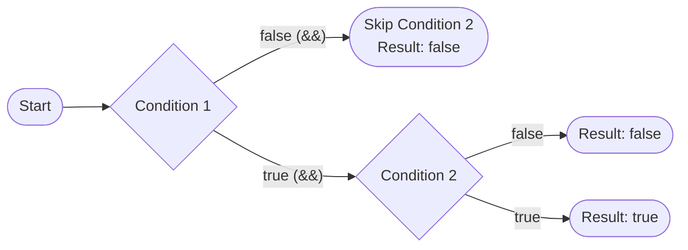
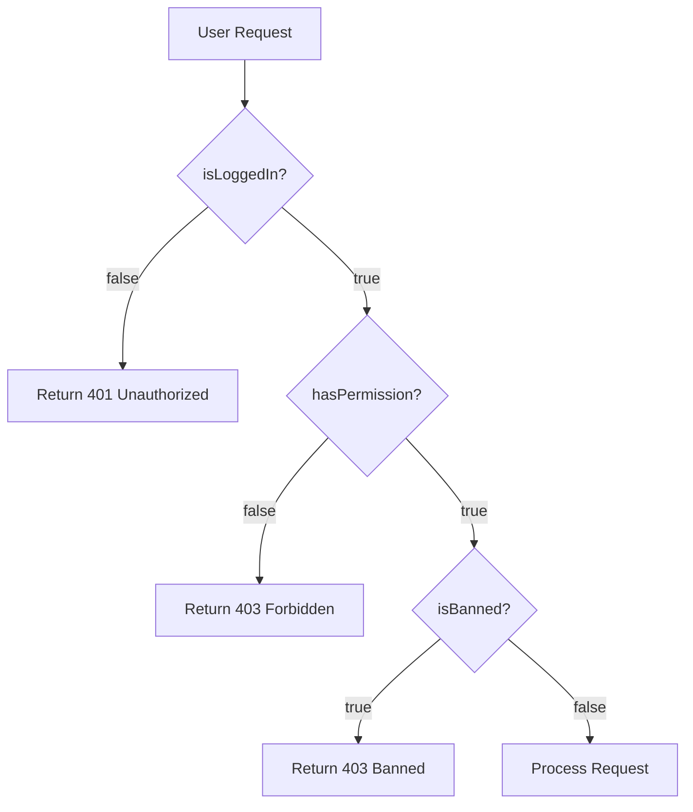

# Boolean — Junior Level

## Table of Contents
1. [Introduction](#introduction)
2. [Prerequisites](#prerequisites)
3. [Glossary](#glossary)
4. [Core Concepts](#core-concepts)
5. [Real-World Analogies](#real-world-analogies)
6. [Mental Models](#mental-models)
7. [Pros & Cons](#pros--cons)
8. [Use Cases](#use-cases)
9. [Code Examples](#code-examples)
10. [Coding Patterns](#coding-patterns)
11. [Clean Code](#clean-code)
12. [Product Use / Feature](#product-use--feature)
13. [Error Handling](#error-handling)
14. [Security Considerations](#security-considerations)
15. [Performance Tips](#performance-tips)
16. [Metrics & Analytics](#metrics--analytics)
17. [Best Practices](#best-practices)
18. [Edge Cases & Pitfalls](#edge-cases--pitfalls)
19. [Common Mistakes](#common-mistakes)
20. [Common Misconceptions](#common-misconceptions)
21. [Tricky Points](#tricky-points)
22. [Test](#test)
23. [Tricky Questions](#tricky-questions)
24. [Cheat Sheet](#cheat-sheet)
25. [Self-Assessment Checklist](#self-assessment-checklist)
26. [Summary](#summary)
27. [What You Can Build](#what-you-can-build)
28. [Further Reading](#further-reading)
29. [Related Topics](#related-topics)
30. [Diagrams & Visual Aids](#diagrams--visual-aids)

---

## Introduction
> Focus: "What is it?" and "How to use it?"

The `bool` type in Go represents a Boolean value — one of only two possible values: `true` or `false`. It is named after mathematician George Boole, who developed Boolean algebra. Boolean values are the foundation of all decision-making in programming: whenever your program needs to make a choice, it relies on a Boolean expression.

In Go, `bool` is a built-in primitive type, just like `int` or `string`. Unlike some other languages (such as C or Python), Go does not allow treating integers or other types as booleans. You cannot write `if 1 { }` in Go — only a genuine `bool` expression works. This strictness makes Go code more readable and prevents entire classes of bugs.

Boolean values appear everywhere: in `if` statements, `for` loop conditions, function return values that signal success or failure, struct fields that track state (e.g., `isActive`, `hasPermission`), and as the result of comparison operators. Understanding `bool` deeply is the first step to writing clear, correct Go programs.

---

## Prerequisites
- Basic understanding of variables in Go
- Familiarity with `fmt.Println`
- Understanding of what a type is in programming
- Basic knowledge of `if` statements

---

## Glossary

| Term | Definition |
|------|-----------|
| `bool` | Go's built-in Boolean type with two possible values |
| `true` | The Boolean value representing "yes", "on", or logical truth |
| `false` | The Boolean value representing "no", "off", or logical falsehood |
| Zero value | The default value a variable has when declared without initialization (`false` for `bool`) |
| Short-circuit evaluation | When Go stops evaluating a Boolean expression as soon as the result is known |
| Comparison operator | An operator (`==`, `!=`, `<`, `>`, `<=`, `>=`) that compares two values and returns a `bool` |
| Logical operator | An operator (`&&`, `||`, `!`) that combines or inverts Boolean values |
| Predicate | A function or expression that returns a `bool` |

---

## Core Concepts

### Declaration and Zero Value

```go
var active bool        // zero value: false
var isReady bool = true
isLoggedIn := false
hasError := true
```

The zero value of `bool` is `false`. This is important: if you declare a `bool` variable without initializing it, it starts as `false`, not as some garbage value.

### Boolean Operators

Go provides three logical operators for working with booleans:

| Operator | Name | Example | Result |
|----------|------|---------|--------|
| `&&` | AND | `true && false` | `false` |
| `\|\|` | OR | `true \|\| false` | `true` |
| `!` | NOT | `!true` | `false` |

```go
a := true
b := false

fmt.Println(a && b)  // false — both must be true
fmt.Println(a || b)  // true  — at least one must be true
fmt.Println(!a)      // false — inverts the value
```

### Comparison Operators Return Bool

Every comparison operator in Go returns a `bool`:

```go
x := 10
y := 20

fmt.Println(x == y)  // false
fmt.Println(x != y)  // true
fmt.Println(x < y)   // true
fmt.Println(x > y)   // false
fmt.Println(x <= y)  // true
fmt.Println(x >= y)  // false
```

### Short-Circuit Evaluation

Go evaluates `&&` and `||` from left to right and stops as soon as the result is determined:

```go
// With &&: if left is false, right is never evaluated
// This is safe even if slice is empty:
if len(slice) > 0 && slice[0] == "x" {
    // ...
}

// With ||: if left is true, right is never evaluated
if hasCache || loadFromDB() {
    // loadFromDB() only called if hasCache is false
}
```

---

## Real-World Analogies

**Light Switch**: A light switch has exactly two states: ON and OFF. This is exactly what `bool` represents. `true` = ON, `false` = OFF.

**Yes/No Question**: Every Boolean is like a yes/no question. "Is the door locked?" yields `true` or `false`. You cannot answer "maybe" or "37".

**AND Gate (door with two locks)**: Imagine a door with two locks. You can only open it if BOTH locks are unlocked. This is `&&` (AND). Both conditions must be `true`.

**OR Gate (multiple entrances)**: A building with multiple entrances. You can get in if ANY entrance is open. This is `||` (OR). At least one condition must be `true`.

**NOT (inverter)**: A NOT gate flips the signal. If a sensor says "no obstacle detected" (`false`), `!false` = `true` means "the path is clear".

---

## Mental Models

### The Truth Table Model

Memorize these truth tables:

```
AND (&&):
true  && true  = true
true  && false = false
false && true  = false
false && false = false

OR (||):
true  || true  = true
true  || false = true
false || true  = true
false || false = false

NOT (!):
!true  = false
!false = true
```

### The Pipeline Model

Think of `&&` as a pipeline — all stages must succeed:
```
condition1 → condition2 → condition3 → execute
   (true)      (true)       (false)  → STOP, don't execute
```

Think of `||` as parallel paths — any one can succeed:
```
condition1 → SUCCESS → execute
condition2 → ...
condition3 → ...
```

### The Zero-Value-Safe Model

In Go, uninitialized booleans are always `false`. So when you add a new `bool` field to a struct, it defaults to the "off/inactive" state. Design your booleans so that `false` is the "safe default":

```go
type User struct {
    IsAdmin    bool  // false = not admin (safe default)
    IsBanned   bool  // false = not banned (safe default)
    IsVerified bool  // false = not verified (safe default)
}
```

---

## Pros & Cons

### Pros
- **Clarity**: Code like `if isReady { }` reads like English
- **Type safety**: Cannot accidentally use `0` or `""` as false
- **Predictable zero value**: Always starts as `false`
- **Short-circuit evaluation**: Enables safe guard conditions
- **Compiler enforcement**: Wrong types cause compile errors, not runtime bugs

### Cons
- **No tri-state**: Cannot represent "unknown" or "not set" (use `*bool` or a custom type for that)
- **Verbose comparisons**: Must be explicit, cannot write `if count { }` like in Python
- **Bool naming can be unclear**: `flag`, `status` are bad names — need descriptive names like `isActive`

---

## Use Cases

1. **Feature flags**: `isFeatureEnabled bool`
2. **State tracking**: `isConnected`, `isLoading`, `hasError`
3. **Validation results**: `isValid := len(input) > 0`
4. **Permission checks**: `canEdit := user.IsAdmin || user.IsOwner`
5. **Loop conditions**: `for !done { ... }`
6. **Early returns**: `if err != nil { return false, err }`
7. **Configuration switches**: `config.DebugMode = true`
8. **Search results**: `found := strings.Contains(s, "go")`

---

## Code Examples

### Example 1: Basic Boolean Variables

```go
package main

import "fmt"

func main() {
    // Declaration with zero value
    var isActive bool
    fmt.Println("isActive:", isActive) // false

    // Declaration with value
    var isReady bool = true
    fmt.Println("isReady:", isReady) // true

    // Short declaration
    hasError := false
    fmt.Println("hasError:", hasError) // false

    // Boolean from comparison
    x := 42
    isPositive := x > 0
    fmt.Println("isPositive:", isPositive) // true
}
```

### Example 2: Boolean Operators

```go
package main

import "fmt"

func main() {
    a := true
    b := false

    // AND
    fmt.Println("AND:", a && b) // false

    // OR
    fmt.Println("OR:", a || b) // true

    // NOT
    fmt.Println("NOT a:", !a) // false
    fmt.Println("NOT b:", !b) // true

    // Combined
    result := (a || b) && !b
    fmt.Println("Combined:", result) // true
}
```

### Example 3: Short-Circuit Evaluation

```go
package main

import "fmt"

func checkDB() bool {
    fmt.Println("  checkDB() was called!")
    return true
}

func main() {
    hasCache := true

    // checkDB() is NOT called because hasCache is already true
    fmt.Println("Case 1: hasCache = true")
    if hasCache || checkDB() {
        fmt.Println("Data available")
    }

    hasCache = false
    // checkDB() IS called because hasCache is false
    fmt.Println("\nCase 2: hasCache = false")
    if hasCache || checkDB() {
        fmt.Println("Data available")
    }
}
```

### Example 4: Booleans in Structs

```go
package main

import "fmt"

type User struct {
    Name       string
    IsAdmin    bool
    IsVerified bool
    IsBanned   bool
}

func (u User) CanPost() bool {
    return u.IsVerified && !u.IsBanned
}

func main() {
    alice := User{
        Name:       "Alice",
        IsAdmin:    true,
        IsVerified: true,
        IsBanned:   false,
    }

    bob := User{
        Name:       "Bob",
        IsVerified: false,
        IsBanned:   true,
    }

    fmt.Printf("%s can post: %v\n", alice.Name, alice.CanPost()) // true
    fmt.Printf("%s can post: %v\n", bob.Name, bob.CanPost())     // false
}
```

### Example 5: strconv with Booleans

```go
package main

import (
    "fmt"
    "strconv"
)

func main() {
    // Format bool to string
    s := strconv.FormatBool(true)
    fmt.Println(s)        // "true"
    fmt.Printf("%T\n", s) // string

    // Parse string to bool
    b1, err := strconv.ParseBool("true")
    if err != nil {
        fmt.Println("Error:", err)
        return
    }
    fmt.Println(b1) // true

    b2, _ := strconv.ParseBool("1")     // true
    b3, _ := strconv.ParseBool("0")     // false
    b4, _ := strconv.ParseBool("T")     // true
    b5, _ := strconv.ParseBool("FALSE") // false
    fmt.Println(b2, b3, b4, b5)

    // Invalid string
    _, err = strconv.ParseBool("yes")
    fmt.Println("Error:", err) // strconv.ParseBool: parsing "yes": invalid syntax
}
```

---

## Coding Patterns

### Pattern 1: Guard Clause (Early Return)

```go
func processUser(user *User) error {
    if user == nil {
        return errors.New("user is nil")
    }
    if !user.IsVerified {
        return errors.New("user not verified")
    }
    if user.IsBanned {
        return errors.New("user is banned")
    }
    // Main logic here — we know user is valid
    return nil
}
```

### Pattern 2: Boolean Flag in Loop

```go
found := false
for _, item := range items {
    if item.ID == targetID {
        found = true
        break
    }
}
if found {
    fmt.Println("Item found!")
}
```

### Pattern 3: Named Predicate Functions

```go
func isEven(n int) bool {
    return n%2 == 0
}

func isValidAge(age int) bool {
    return age >= 0 && age <= 150
}

func isEmptyString(s string) bool {
    return len(s) == 0
}
```

### Pattern 4: Boolean Toggle

```go
isEnabled := true
isEnabled = !isEnabled  // toggle to false
isEnabled = !isEnabled  // toggle back to true
```

---

## Clean Code

### DO: Use Descriptive Boolean Names

```go
// Good — reads like English
if user.IsActive && user.HasPermission {
    grantAccess()
}

// Bad — unclear meaning
if user.Active && user.Permission {
    grantAccess()
}
```

### DO: Prefix Booleans with is/has/can/should/was

```go
isLoggedIn   bool
hasChildren  bool
canDelete    bool
shouldRetry  bool
wasProcessed bool
```

### DO NOT: Return Redundant Boolean Expressions

```go
// Bad
func isPositive(n int) bool {
    if n > 0 {
        return true
    }
    return false
}

// Good
func isPositive(n int) bool {
    return n > 0
}
```

### DO NOT: Compare Bool to Bool Literals

```go
// Bad
if isReady == true { }
if hasError == false { }

// Good
if isReady { }
if !hasError { }
```

---

## Product Use / Feature

**Feature Flags**: In production systems, booleans power feature flags — the ability to turn features on/off without redeploying:

```go
type FeatureFlags struct {
    NewCheckoutEnabled bool
    DarkModeEnabled    bool
    BetaAPIEnabled     bool
}

func handleCheckout(flags FeatureFlags) {
    if flags.NewCheckoutEnabled {
        runNewCheckout()
    } else {
        runLegacyCheckout()
    }
}
```

**User Permissions**: Boolean fields in user models control what actions are allowed:

```go
type Permissions struct {
    CanRead   bool
    CanWrite  bool
    CanDelete bool
    IsAdmin   bool
}
```

**Configuration**: Server configuration uses booleans to enable/disable behavior:

```go
type Config struct {
    Debug        bool
    TLSEnabled   bool
    CacheEnabled bool
}
```

---

## Error Handling

In Go, functions often return a `bool` alongside a value to indicate success, or use `bool` as their return type for validation:

```go
// Pattern: return (value, bool)
func findUser(id int) (User, bool) {
    user, exists := userMap[id]
    return user, exists
}

// Usage
user, found := findUser(42)
if !found {
    fmt.Println("User not found")
    return
}
fmt.Println("Found:", user.Name)
```

```go
// Validation returning bool
func validateEmail(email string) bool {
    return strings.Contains(email, "@") && strings.Contains(email, ".")
}

if !validateEmail(input) {
    fmt.Println("Invalid email address")
}
```

---

## Security Considerations

- **Authorization checks**: Always use `&&` (AND) for multiple permission checks. Never use `||` for security gating:
  ```go
  // SAFE: user must BOTH be verified AND have admin role
  if user.IsVerified && user.IsAdmin {
      deleteRecord()
  }

  // DANGEROUS: user needs only ONE condition
  if user.IsVerified || user.IsAdmin {
      deleteRecord()
  }
  ```

- **Default to deny**: Because Go's zero value for `bool` is `false`, permission booleans default to "no permission" — which is the secure default.

- **Avoid bool blindness**: Using raw `bool` returns from security functions can be confusing. Prefer returning errors that describe WHY access was denied.

---

## Performance Tips

- Boolean operations (`&&`, `||`, `!`) are extremely fast — they compile to single CPU instructions.
- Short-circuit evaluation can improve performance by avoiding expensive function calls:
  ```go
  // checkExpensive() is only called if cheapCheck() returns true
  if cheapCheck() && checkExpensive() {
      // ...
  }
  ```
- Booleans take 1 byte of memory in Go. In memory-critical applications with large arrays of booleans, consider using `uint64` with bit operations.

---

## Metrics & Analytics

```go
type MetricsTracker struct {
    IsSuccess  bool
    HasRetried bool
    WasCached  bool
}

func trackRequest(m MetricsTracker) {
    if m.IsSuccess {
        successCounter.Inc()
    } else {
        failureCounter.Inc()
    }
    if m.HasRetried {
        retryCounter.Inc()
    }
    if m.WasCached {
        cacheHitCounter.Inc()
    }
}
```

---

## Best Practices

1. **Name booleans with is/has/can/should prefixes** — makes intent obvious
2. **Use the zero value as the "safe" default** — `false` should mean "inactive" or "not allowed"
3. **Never compare booleans to `true` or `false` explicitly** — use the value directly
4. **Keep boolean expressions simple** — if an expression is complex, extract it to a named variable or function
5. **Use short-circuit evaluation for safety** — put cheap/safe checks first
6. **Prefer returning `(T, error)` over `(T, bool)`** — errors carry more information
7. **Document boolean struct fields** — explain what `true` means for each field

---

## Edge Cases & Pitfalls

### Pitfall 1: Assuming int 1 is true

```go
// COMPILE ERROR in Go (unlike C!)
x := 1
if x {  // Error: non-boolean condition in if statement
}

// Correct
if x != 0 {
}
```

### Pitfall 2: Operator Precedence

```go
// Be careful with precedence
result := true || false && false
// && has higher precedence than ||
// This is: true || (false && false) = true || false = true

// Use parentheses to be explicit:
result = (true || false) && false  // false
```

### Pitfall 3: Shadowing with Short Declaration

```go
found := false
if condition {
    found := true  // This creates a NEW variable in this scope!
    _ = found
}
fmt.Println(found) // Still false! Outer variable unchanged
```

---

## Common Mistakes

### Mistake 1: Redundant If-Else

```go
// Wrong — overly verbose
func isAdult(age int) bool {
    if age >= 18 {
        return true
    } else {
        return false
    }
}

// Correct — clean and direct
func isAdult(age int) bool {
    return age >= 18
}
```

### Mistake 2: Double Negation

```go
// Confusing
if !(!isActive) {
    // ...
}

// Clear
if isActive {
    // ...
}
```

### Mistake 3: Not Using Short-Circuit

```go
// Dangerous — may panic if slice is empty
if slice[0] == "x" && len(slice) > 0 {
}

// Safe — checks length first
if len(slice) > 0 && slice[0] == "x" {
}
```

---

## Common Misconceptions

**Misconception 1**: "In Go, `0` is `false` and `1` is `true`"
- **Reality**: Go has no implicit conversion between numeric types and `bool`. This is a C/Python concept that does NOT apply to Go.

**Misconception 2**: "Comparing a `bool` to `true` is more explicit and clear"
- **Reality**: `if isReady == true` is redundant noise. `if isReady` is clearer and idiomatic Go.

**Misconception 3**: "The zero value of `bool` could be anything"
- **Reality**: Go guarantees the zero value of `bool` is always `false`. This is part of the language specification.

**Misconception 4**: "Short-circuit evaluation is an optimization, not a feature"
- **Reality**: Short-circuit evaluation is a guaranteed language feature. Go code relies on it for correctness.

---

## Tricky Points

1. **`&&` has higher precedence than `||`**: `a || b && c` is `a || (b && c)`, not `(a || b) && c`.
2. **Booleans cannot be converted to/from int**: `int(true)` is a compile error in Go.
3. **`fmt.Println(true)` prints `"true"` (the word)**, not `1` or `T`.
4. **`strconv.ParseBool` accepts many forms**: `"1"`, `"t"`, `"T"`, `"TRUE"`, `"true"`, `"True"` are all `true`.
5. **A `bool` occupies 1 byte** even though logically it needs only 1 bit.

---

## Test

```go
package main

import "testing"

func isEven(n int) bool {
    return n%2 == 0
}

func TestIsEven(t *testing.T) {
    tests := []struct {
        input    int
        expected bool
    }{
        {0, true},
        {1, false},
        {2, true},
        {-1, false},
        {-2, true},
    }

    for _, tt := range tests {
        result := isEven(tt.input)
        if result != tt.expected {
            t.Errorf("isEven(%d) = %v, want %v", tt.input, result, tt.expected)
        }
    }
}

func TestShortCircuit(t *testing.T) {
    called := false
    sideEffect := func() bool {
        called = true
        return true
    }

    // AND: first is false, second should not be called
    _ = false && sideEffect()
    if called {
        t.Error("sideEffect was called despite short-circuit")
    }

    // OR: first is true, second should not be called
    called = false
    _ = true || sideEffect()
    if called {
        t.Error("sideEffect was called despite short-circuit")
    }
}
```

---

## Tricky Questions

**Q1**: What is the output of `fmt.Println(true && false || true)`?

```go
fmt.Println(true && false || true)
// Answer: true
// Because && has higher precedence: (true && false) || true = false || true = true
```

**Q2**: Can you assign an integer to a bool in Go?

```go
var b bool = 1  // Compile error!
// No — Go has no implicit conversion between int and bool
```

**Q3**: What does `var b bool` print?

```go
var b bool
fmt.Println(b) // "false" — zero value
```

**Q4**: What is the size of a `bool` in Go?

```go
import "unsafe"
fmt.Println(unsafe.Sizeof(true)) // 1 (byte)
```

**Q5**: How do you convert a bool to a string?

```go
import "strconv"
s := strconv.FormatBool(true)  // "true"
// OR
s = fmt.Sprintf("%t", true)    // "true"
// NOT: string(true) — this is a compile error
```

---

## Cheat Sheet

```go
// Declaration
var b bool           // false (zero value)
b := true
b := false

// Operators
a && b   // AND — both must be true
a || b   // OR  — at least one must be true
!a       // NOT — inverts the value

// Comparisons (return bool)
x == y   // equal
x != y   // not equal
x < y    // less than
x > y    // greater than
x <= y   // less than or equal
x >= y   // greater than or equal

// Short-circuit
len(s) > 0 && s[0] == 'x'   // safe: checks length first
hasCache || loadFromDB()      // loadFromDB only if !hasCache

// String conversion
strconv.FormatBool(true)     // "true"
strconv.ParseBool("true")    // true, nil

// Format verb
fmt.Printf("%t\n", true)     // true
fmt.Printf("%v\n", false)    // false

// Good naming: is/has/can/should/was prefix
isActive, hasError, canEdit, shouldRetry, wasDeleted
```

---

## Self-Assessment Checklist

- [ ] I know the two possible values of `bool`: `true` and `false`
- [ ] I know the zero value of `bool` is `false`
- [ ] I can use all three logical operators: `&&`, `||`, `!`
- [ ] I understand short-circuit evaluation and can use it safely
- [ ] I know that comparison operators (`==`, `!=`, `<`, etc.) return `bool`
- [ ] I know Go does NOT allow implicit int-to-bool conversion
- [ ] I can name boolean variables with is/has/can/should/was prefixes
- [ ] I can use `strconv.FormatBool` and `strconv.ParseBool`
- [ ] I know NOT to compare booleans to `true` or `false` literals
- [ ] I understand operator precedence: `&&` before `||`
- [ ] I can extract complex boolean expressions into named functions
- [ ] I understand the security implications of `&&` vs `||` in permission checks

---

## Summary

The `bool` type in Go is simple but fundamental. It has exactly two values (`true` and `false`), a zero value of `false`, and works with three logical operators (`&&`, `||`, `!`). Go enforces strict type safety — there is no implicit conversion from integers or other types to booleans, which prevents bugs common in C or Python. Short-circuit evaluation makes `&&` and `||` not just logical operators but also control flow tools. Boolean naming conventions (is/has/can/should prefixes) make code read like natural language and signal intent clearly to other developers.

---

## What You Can Build

- User authentication system (isLoggedIn, hasPermission)
- Feature flag system (isFeatureEnabled)
- Input validation (isValidEmail, isValidAge)
- Game state management (isGameOver, hasWon, isPlayerAlive)
- Configuration toggles (debugMode, verboseLogging)
- Search algorithms that return found/not-found

---

## Further Reading

- [Go Specification: Boolean types](https://go.dev/ref/spec#Boolean_types)
- [Go Tour: Basic Types](https://tour.golang.org/basics/11)
- [Effective Go](https://go.dev/doc/effective_go)
- [strconv package documentation](https://pkg.go.dev/strconv)
- [Go by Example: If/Else](https://gobyexample.com/if-else)

---

## Related Topics

- `if` and `for` statements (use boolean conditions)
- Comparison operators in Go
- `strconv` package (string conversion)
- Zero values in Go
- Type safety in Go
- Short-circuit evaluation

---

## Diagrams & Visual Aids

### Boolean Operator Truth Table

```
AND (&&) Truth Table:
┌───────┬───────┬────────┐
│   A   │   B   │ A && B │
├───────┼───────┼────────┤
│ true  │ true  │  true  │
│ true  │ false │  false │
│ false │ true  │  false │
│ false │ false │  false │
└───────┴───────┴────────┘

OR (||) Truth Table:
┌───────┬───────┬────────┐
│   A   │   B   │ A || B │
├───────┼───────┼────────┤
│ true  │ true  │  true  │
│ true  │ false │  true  │
│ false │ true  │  true  │
│ false │ false │  false │
└───────┴───────┴────────┘
```

### Short-Circuit Flow



### Boolean Memory Layout

```
bool in memory: 1 byte (8 bits)
┌────┬────┬────┬────┬────┬────┬────┬────┐
│ b7 │ b6 │ b5 │ b4 │ b3 │ b2 │ b1 │ b0 │
│  0 │  0 │  0 │  0 │  0 │  0 │  0 │0/1 │
└────┴────┴────┴────┴────┴────┴────┴────┘
                                      ^
                              1 = true, 0 = false
```

### Decision Flow with Booleans


