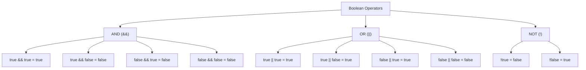
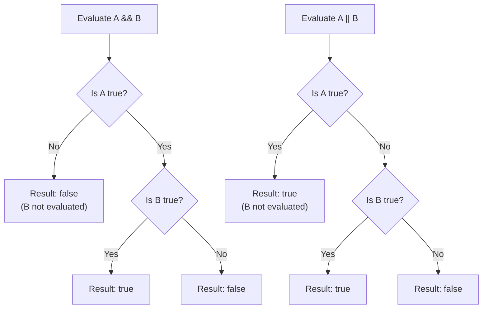
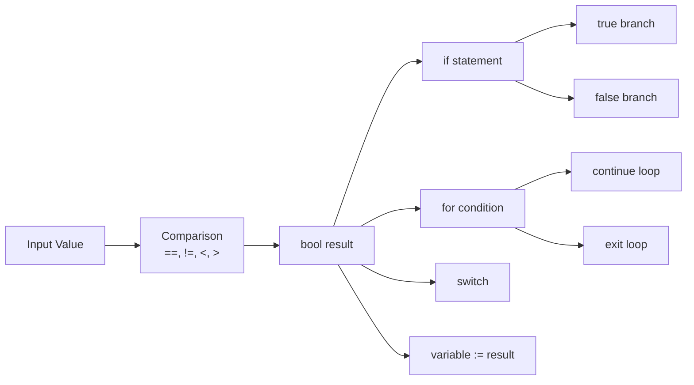
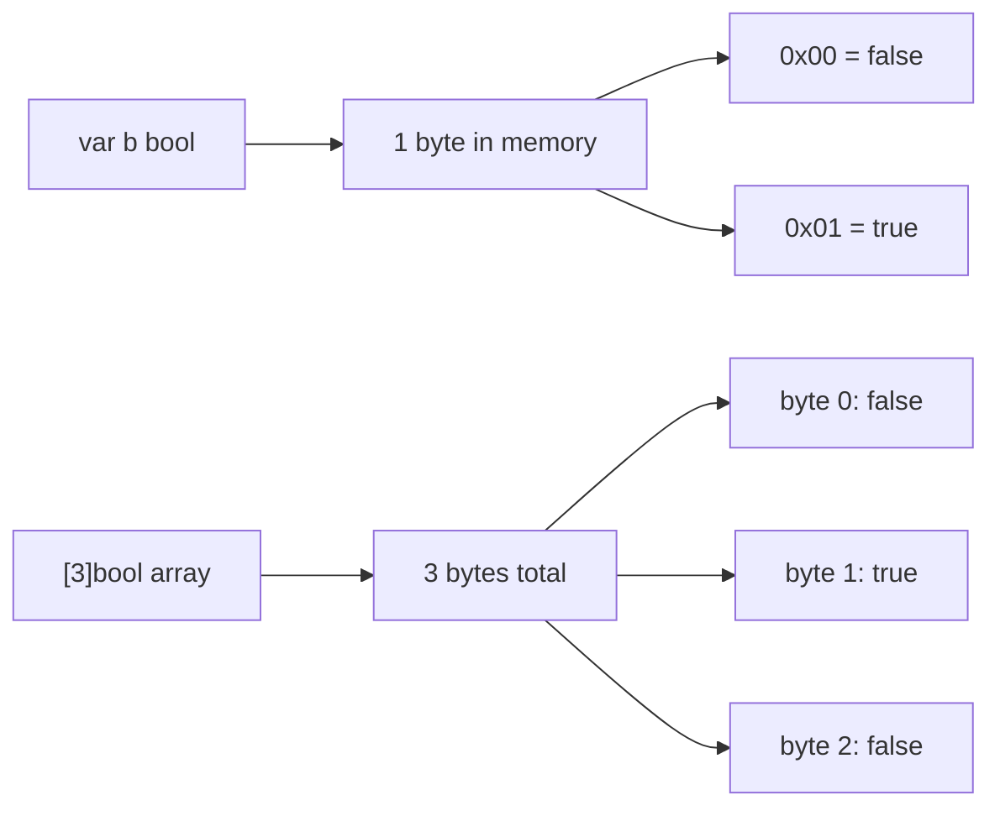

# Boolean — Junior Level

## Table of Contents

1. [Introduction](#introduction)
2. [Prerequisites](#prerequisites)
3. [Glossary](#glossary)
4. [Core Concepts](#core-concepts)
5. [Real-World Analogies](#real-world-analogies)
6. [Mental Models](#mental-models)
7. [Pros & Cons](#pros--cons)
8. [Use Cases](#use-cases)
9. [Code Examples](#code-examples)
10. [Coding Patterns](#coding-patterns)
11. [Clean Code](#clean-code)
12. [Product Use / Feature](#product-use--feature)
13. [Error Handling](#error-handling)
14. [Security Considerations](#security-considerations)
15. [Performance Tips](#performance-tips)
16. [Metrics & Analytics](#metrics--analytics)
17. [Best Practices](#best-practices)
18. [Edge Cases & Pitfalls](#edge-cases--pitfalls)
19. [Common Mistakes](#common-mistakes)
20. [Common Misconceptions](#common-misconceptions)
21. [Tricky Points](#tricky-points)
22. [Test](#test)
23. [Tricky Questions](#tricky-questions)
24. [Cheat Sheet](#cheat-sheet)
25. [Self-Assessment Checklist](#self-assessment-checklist)
26. [Summary](#summary)
27. [What You Can Build](#what-you-can-build)
28. [Further Reading](#further-reading)
29. [Related Topics](#related-topics)
30. [Diagrams & Visual Aids](#diagrams--visual-aids)

---

## Introduction

> Focus: "What is it?"

A **boolean** is the simplest data type in Go. It can hold exactly two values: `true` or `false`. The type is called `bool` in Go, named after mathematician George Boole who invented Boolean algebra.

Booleans are the foundation of all decision-making in programs. Every time your program asks "should I do this or that?", it uses a boolean. The `if` statement, `for` loop condition, and comparison operators all produce or consume boolean values.

In Go, the `bool` type is strict — there is no implicit conversion from integers to booleans. Unlike C or Python, you cannot write `if 1` or `if 0`. You must always use an explicit boolean expression.

---

## Prerequisites

- **Required:** Go installed (version 1.21+) — needed to compile and run examples
- **Required:** Understanding of variables and basic Go syntax — you need to know how to declare variables
- **Helpful:** Familiarity with `if` statements — booleans are most useful in conditional logic
- **Helpful:** Basic terminal/command-line usage — to run Go programs

---

## Glossary

| Term | Definition |
|------|-----------|
| **bool** | Go's built-in boolean type that holds `true` or `false` |
| **true** | One of the two boolean literal values, representing "yes" or "on" |
| **false** | One of the two boolean literal values, representing "no" or "off" |
| **Zero value** | The default value assigned to an uninitialized variable; for `bool` it is `false` |
| **Logical AND (`&&`)** | Returns `true` only if both operands are `true` |
| **Logical OR (`\|\|`)** | Returns `true` if at least one operand is `true` |
| **Logical NOT (`!`)** | Inverts a boolean: `true` becomes `false` and vice versa |
| **Comparison operator** | Operators like `==`, `!=`, `<`, `>` that produce a `bool` result |
| **Short-circuit evaluation** | The compiler skips evaluating the second operand if the first determines the result |
| **Predicate** | A function that returns a boolean value |

---

## Core Concepts

### Concept 1: Declaring Boolean Variables

You can declare booleans using `var`, short declaration `:=`, or as constants.

```go
package main

import "fmt"

func main() {
    // Using var with explicit type
    var isReady bool
    fmt.Println("isReady:", isReady) // false (zero value)

    // Using var with initialization
    var isActive bool = true
    fmt.Println("isActive:", isActive) // true

    // Using short declaration (type inferred)
    hasPermission := false
    fmt.Println("hasPermission:", hasPermission) // false

    // Boolean constants
    const debugMode = true
    fmt.Println("debugMode:", debugMode) // true
}
```

### Concept 2: Boolean Operators

Go provides three logical operators to combine or invert boolean values.

```go
package main

import "fmt"

func main() {
    a := true
    b := false

    // AND: both must be true
    fmt.Println("a && b:", a && b) // false
    fmt.Println("a && a:", a && a) // true

    // OR: at least one must be true
    fmt.Println("a || b:", a || b) // true
    fmt.Println("b || b:", b || b) // false

    // NOT: inverts the value
    fmt.Println("!a:", !a) // false
    fmt.Println("!b:", !b) // true
}
```

### Concept 3: Comparison Operators Return Bool

All comparison operators in Go produce a `bool` result.

```go
package main

import "fmt"

func main() {
    x := 10
    y := 20

    fmt.Println("x == y:", x == y)   // false
    fmt.Println("x != y:", x != y)   // true
    fmt.Println("x < y:", x < y)     // true
    fmt.Println("x > y:", x > y)     // false
    fmt.Println("x <= y:", x <= y)   // true
    fmt.Println("x >= y:", x >= y)   // false

    // String comparison also returns bool
    name := "Go"
    fmt.Println("name == \"Go\":", name == "Go") // true
}
```

### Concept 4: Zero Value

Every uninitialized `bool` variable has the zero value `false`.

```go
package main

import "fmt"

func main() {
    var flag bool
    fmt.Println("flag:", flag) // false

    var flags [3]bool
    fmt.Println("flags:", flags) // [false false false]

    m := make(map[string]bool)
    fmt.Println("m[\"key\"]:", m["key"]) // false (zero value for missing key)
}
```

### Concept 5: No Implicit Conversion

Unlike C, C++, or Python, Go does not allow implicit conversion between integers and booleans.

```go
package main

import "fmt"

func main() {
    // This will NOT compile in Go:
    // if 1 { fmt.Println("truthy") }  // ERROR: non-boolean condition

    // This will NOT compile either:
    // var b bool = 1  // ERROR: cannot use 1 as bool

    // You must use explicit boolean expressions:
    x := 1
    if x != 0 {
        fmt.Println("x is non-zero") // This is the Go way
    }

    // You cannot add booleans:
    // sum := true + true  // ERROR: operator + not defined on bool

    fmt.Println("Go enforces type safety for booleans")
}
```

### Concept 6: Short-Circuit Evaluation

Go evaluates boolean expressions left to right and stops as soon as the result is determined.

```go
package main

import "fmt"

func checkA() bool {
    fmt.Println("  checkA called")
    return false
}

func checkB() bool {
    fmt.Println("  checkB called")
    return true
}

func main() {
    // AND: if first is false, second is not evaluated
    fmt.Println("AND short-circuit:")
    result := checkA() && checkB()
    fmt.Println("  result:", result) // Only "checkA called" prints

    fmt.Println()

    // OR: if first is true, second is not evaluated
    fmt.Println("OR short-circuit:")
    result = checkB() || checkA()
    fmt.Println("  result:", result) // Only "checkB called" prints
}
```

---

## Real-World Analogies

| Boolean Concept | Real-World Analogy |
|----------------|-------------------|
| `true` / `false` | A light switch — it is either ON or OFF, nothing in between |
| `&&` (AND) | Both keys needed to open a safe — both must be present |
| `\|\|` (OR) | Multiple doors to a building — any one open door lets you in |
| `!` (NOT) | A toggle button — press once to flip the state |
| Zero value `false` | A new appliance comes turned OFF by default |
| Short-circuit | Checking if you have a ticket before checking the seat number — no ticket means no need to check the seat |
| No implicit conversion | A keycard system that only accepts keycards, not coins or tokens |
| Comparison operators | A judge's decision — comparing evidence and returning guilty or not guilty |

---

## Mental Models

**The Binary Switch Model**: Think of every boolean as a physical switch. It can only be in two positions. You cannot put it halfway. Every decision in your program flips or checks one of these switches.

**The Gate Model**: Boolean operators are like logic gates in electronics:
- AND gate: electricity flows only if both inputs are on
- OR gate: electricity flows if either input is on
- NOT gate: flips the signal

**The Question Model**: Every boolean answers a yes/no question. Good variable names make the question obvious: `isLoggedIn` answers "Is the user logged in?"

---

## Pros & Cons

| Pros | Cons |
|------|------|
| Simple — only two possible values | Cannot express "unknown" or "maybe" (need `*bool` or tri-state) |
| Type-safe — no implicit int-to-bool conversion | No implicit truthiness makes some code more verbose |
| Efficient — uses only 1 byte of memory | Boolean flags can lead to complex nested conditions |
| Clear intent when named well | Multiple boolean parameters in functions are confusing |
| Short-circuit evaluation improves performance | Operator precedence can be confusing for beginners |

---

## Use Cases

1. **Feature flags**: Enable or disable features at runtime using boolean configuration values
2. **Validation**: Check if user input meets requirements before processing
3. **State tracking**: Track whether a connection is open, a file is loaded, or a process is complete
4. **Access control**: Determine if a user has permission to perform an action
5. **Loop control**: Decide when to continue or break out of a loop
6. **Error checking**: The `ok` idiom in Go (`value, ok := map[key]`) returns a boolean
7. **Filtering**: Select items from a collection based on a boolean condition

---

## Code Examples

### Example 1: User Authentication Check

```go
package main

import "fmt"

func isValidPassword(password string) bool {
    return len(password) >= 8
}

func isValidEmail(email string) bool {
    // Simplified check
    for _, ch := range email {
        if ch == '@' {
            return true
        }
    }
    return false
}

func main() {
    email := "user@example.com"
    password := "securepass"

    if isValidEmail(email) && isValidPassword(password) {
        fmt.Println("Login successful")
    } else {
        fmt.Println("Invalid credentials")
    }
}
```

### Example 2: Map Lookup with ok Idiom

```go
package main

import "fmt"

func main() {
    colors := map[string]string{
        "red":   "#FF0000",
        "green": "#00FF00",
        "blue":  "#0000FF",
    }

    // The ok pattern — the most common boolean pattern in Go
    if hex, ok := colors["red"]; ok {
        fmt.Println("Red hex:", hex)
    }

    if _, ok := colors["purple"]; !ok {
        fmt.Println("Purple not found in map")
    }
}
```

### Example 3: Boolean Function Composition

```go
package main

import (
    "fmt"
    "strings"
    "unicode"
)

func hasUpperCase(s string) bool {
    for _, r := range s {
        if unicode.IsUpper(r) {
            return true
        }
    }
    return false
}

func hasDigit(s string) bool {
    for _, r := range s {
        if unicode.IsDigit(r) {
            return true
        }
    }
    return false
}

func hasSpecialChar(s string) bool {
    return strings.ContainsAny(s, "!@#$%^&*")
}

func isStrongPassword(password string) bool {
    return len(password) >= 8 &&
        hasUpperCase(password) &&
        hasDigit(password) &&
        hasSpecialChar(password)
}

func main() {
    passwords := []string{"weak", "Str0ng!Pass", "nouppercase1!", "Short1!"}

    for _, p := range passwords {
        fmt.Printf("%-20s strong: %v\n", p, isStrongPassword(p))
    }
}
```

### Example 4: Toggle Pattern

```go
package main

import "fmt"

func main() {
    darkMode := false

    // Simulate toggle clicks
    for i := 0; i < 5; i++ {
        darkMode = !darkMode
        fmt.Printf("Click %d: darkMode = %v\n", i+1, darkMode)
    }
}
```

### Example 5: Boolean Filtering

```go
package main

import "fmt"

type Task struct {
    Title     string
    Completed bool
}

func filterTasks(tasks []Task, completed bool) []Task {
    var result []Task
    for _, t := range tasks {
        if t.Completed == completed {
            result = append(result, t)
        }
    }
    return result
}

func main() {
    tasks := []Task{
        {"Write code", true},
        {"Write tests", false},
        {"Deploy", false},
        {"Code review", true},
        {"Update docs", false},
    }

    fmt.Println("Completed tasks:")
    for _, t := range filterTasks(tasks, true) {
        fmt.Println("  -", t.Title)
    }

    fmt.Println("Pending tasks:")
    for _, t := range filterTasks(tasks, false) {
        fmt.Println("  -", t.Title)
    }
}
```

### Example 6: Boolean in Struct Configuration

```go
package main

import "fmt"

type ServerConfig struct {
    Host       string
    Port       int
    EnableTLS  bool
    EnableCORS bool
    DebugMode  bool
}

func printConfig(cfg ServerConfig) {
    fmt.Printf("Server: %s:%d\n", cfg.Host, cfg.Port)
    fmt.Printf("TLS: %v | CORS: %v | Debug: %v\n",
        cfg.EnableTLS, cfg.EnableCORS, cfg.DebugMode)
}

func main() {
    // Zero values mean all booleans default to false (disabled)
    cfg := ServerConfig{
        Host: "localhost",
        Port: 8080,
    }
    printConfig(cfg)

    // Enable specific features
    cfg.EnableTLS = true
    cfg.EnableCORS = true
    fmt.Println("\nAfter configuration:")
    printConfig(cfg)
}
```

---

## Coding Patterns

### Pattern 1: The ok Idiom

```go
// Map lookup
value, ok := myMap[key]

// Type assertion
str, ok := iface.(string)

// Channel receive
val, ok := <-ch
```

### Pattern 2: Guard Clause (Early Return)

```go
func processOrder(order Order) error {
    if !order.IsValid {
        return fmt.Errorf("invalid order")
    }
    if !order.IsPaid {
        return fmt.Errorf("order not paid")
    }
    // Main logic here
    return nil
}
```

### Pattern 3: Boolean Predicate Functions

```go
// Name predicates with is/has/can/should prefixes
func isEven(n int) bool      { return n%2 == 0 }
func hasPrefix(s string) bool { return len(s) > 0 && s[0] == '/' }
func canRetry(attempts int) bool { return attempts < 3 }
```

### Pattern 4: Flag Accumulator

```go
func validateForm(fields map[string]string) bool {
    isValid := true
    if fields["name"] == "" {
        fmt.Println("Name is required")
        isValid = false
    }
    if fields["email"] == "" {
        fmt.Println("Email is required")
        isValid = false
    }
    return isValid
}
```

---

## Clean Code

- **Name booleans as questions**: Use prefixes like `is`, `has`, `can`, `should`, `was`, `will`
- **Avoid double negatives**: Write `if isActive` not `if !isInactive`
- **Keep boolean expressions simple**: Break complex conditions into named variables
- **Avoid boolean parameters in public APIs**: They make call sites hard to read

```go
// Bad: what does true mean?
createUser("alice", true, false)

// Good: use named fields or option pattern
createUser("alice", UserOptions{IsAdmin: true, IsActive: false})
```

```go
// Bad: complex inline condition
if user.Age >= 18 && user.HasID && !user.IsBanned && (user.Country == "US" || user.Country == "UK") {

// Good: extract into named booleans
isAdult := user.Age >= 18
isVerified := user.HasID && !user.IsBanned
isAllowedRegion := user.Country == "US" || user.Country == "UK"
if isAdult && isVerified && isAllowedRegion {
```

---

## Product Use / Feature

Booleans are everywhere in real products:

- **Feature toggles**: `if featureFlags["newUI"]` controls which UI version users see
- **User preferences**: `user.EmailNotifications`, `user.DarkMode`
- **A/B testing**: `isInExperimentGroup` decides which variant to show
- **Circuit breakers**: `isCircuitOpen` decides whether to send requests or fail fast
- **Maintenance mode**: `isMaintenanceMode` shows a maintenance page to users

---

## Error Handling

```go
package main

import (
    "errors"
    "fmt"
)

// Boolean return for simple success/failure
func contains(slice []int, target int) bool {
    for _, v := range slice {
        if v == target {
            return true
        }
    }
    return false
}

// Boolean + error for richer error context
func withdraw(balance float64, amount float64) (bool, error) {
    if amount <= 0 {
        return false, errors.New("amount must be positive")
    }
    if amount > balance {
        return false, fmt.Errorf("insufficient funds: need %.2f, have %.2f", amount, balance)
    }
    return true, nil
}

func main() {
    nums := []int{1, 2, 3, 4, 5}
    fmt.Println("Contains 3:", contains(nums, 3))
    fmt.Println("Contains 9:", contains(nums, 9))

    success, err := withdraw(100.0, 150.0)
    if err != nil {
        fmt.Println("Error:", err)
    }
    fmt.Println("Success:", success)
}
```

---

## Security Considerations

- **Never trust client-provided booleans** for authorization: always verify on the server side
- **Avoid boolean blindness**: when a function returns `bool`, the caller can easily swap true/false meanings
- **Use constant-time comparison** for security-sensitive boolean checks to prevent timing attacks

```go
// Bad: trusting a boolean from user input
type Request struct {
    IsAdmin bool `json:"is_admin"` // User could set this to true!
}

// Good: derive authorization from server-side data
func isAdmin(userID string, db Database) bool {
    user, err := db.GetUser(userID)
    if err != nil {
        return false // Fail closed
    }
    return user.Role == "admin"
}
```

---

## Performance Tips

- Booleans use **1 byte** in memory, even though they represent 1 bit of information
- Place booleans **together in structs** to minimize padding due to alignment
- **Short-circuit evaluation** means putting the cheapest or most likely-to-fail check first can speed up code
- Avoid unnecessary boolean variables — the compiler optimizes simple conditions well

```go
// Put cheap checks first in AND chains
if isLocalCache(key) && isValidInDB(key) { // DB check skipped if cache misses

// Put likely-true checks first in OR chains
if isInMemory(data) || isOnDisk(data) { // disk check skipped if in memory
```

---

## Metrics & Analytics

Booleans are useful for tracking binary metrics:

```go
type Metrics struct {
    TotalRequests   int
    SuccessCount    int
    FailureCount    int
}

func (m *Metrics) Record(success bool) {
    m.TotalRequests++
    if success {
        m.SuccessCount++
    } else {
        m.FailureCount++
    }
}

func (m *Metrics) SuccessRate() float64 {
    if m.TotalRequests == 0 {
        return 0
    }
    return float64(m.SuccessCount) / float64(m.TotalRequests) * 100
}
```

---

## Best Practices

1. **Use meaningful names**: `isReady` not `flag`, `hasPermission` not `b`
2. **Prefer positive naming**: `isActive` over `isNotInactive`
3. **Return early**: Use guard clauses to avoid deep nesting
4. **Keep boolean expressions short**: Extract sub-expressions into named variables
5. **Use the ok idiom**: Always check the second return value from map lookups and type assertions
6. **Default to false**: Leverage zero values so that the "safe" default requires no initialization
7. **Document non-obvious boolean meanings**: When a function returns `bool`, document what `true` means
8. **Avoid passing multiple booleans**: Use a struct or option type instead

---

## Edge Cases & Pitfalls

```go
package main

import "fmt"

func main() {
    // Edge case 1: nil pointer and boolean
    var ptr *bool
    // fmt.Println(*ptr) // PANIC: nil pointer dereference
    fmt.Println("ptr is nil:", ptr == nil) // true

    // Edge case 2: map returns zero value for missing keys
    m := map[string]bool{"exists": true}
    fmt.Println(m["exists"])       // true
    fmt.Println(m["doesNotExist"]) // false (zero value, NOT "key missing")

    // To distinguish missing from false, use the ok idiom:
    val, ok := m["doesNotExist"]
    fmt.Printf("val=%v, ok=%v\n", val, ok) // val=false, ok=false

    // Edge case 3: boolean slices
    flags := make([]bool, 5)
    fmt.Println(flags) // [false false false false false]
}
```

---

## Common Mistakes

| Mistake | Why It's Wrong | Correct Way |
|---------|---------------|-------------|
| `if isReady == true` | Redundant comparison | `if isReady` |
| `if isReady == false` | Confusing double negative | `if !isReady` |
| `var b bool = false` | Redundant initialization | `var b bool` |
| `if 1 { ... }` | Go has no implicit int-to-bool | `if x != 0 { ... }` |
| Using `bool` to return error state | Loses error context | Return `error` type instead |
| Not checking `ok` on map access | Confuses "missing" with `false` | `v, ok := m[k]` |

---

## Common Misconceptions

1. **"Booleans are 1 bit"** — No, Go booleans are 1 byte (8 bits). The CPU addresses memory in bytes, not bits.

2. **"You can convert int to bool"** — No, Go does not allow `bool(1)` or `bool(0)`. There is no implicit or explicit conversion.

3. **"false is 0 and true is 1"** — While internally this is how they are stored, Go does not allow you to use them interchangeably. `true + true` does not compile.

4. **"Short-circuit is optional"** — No, short-circuit evaluation is guaranteed by the Go specification. The right operand of `&&` and `||` is only evaluated if needed.

5. **"`!= false` is the same as `== true`"** — Logically yes, but both are redundant. Just use the boolean directly.

---

## Tricky Points

- **Operator precedence**: `&&` has higher precedence than `||`. So `a || b && c` means `a || (b && c)`, not `(a || b) && c`. When in doubt, use parentheses.
- **Pointer to bool**: `*bool` can represent three states: `nil`, `true`, `false` — useful for optional fields in JSON.
- **Boolean in JSON**: `bool` marshals to JSON `true`/`false`. Zero value `false` is omitted with `omitempty`.

```go
type Config struct {
    Verbose bool  `json:"verbose,omitempty"` // false is omitted!
    Debug   *bool `json:"debug,omitempty"`   // nil is omitted, false is kept
}
```

---

## Test

<details>
<summary>Question 1: What is the zero value of a bool variable in Go?</summary>

**Answer:** `false`

Every `bool` variable declared without initialization defaults to `false`.

```go
var b bool
fmt.Println(b) // false
```
</details>

<details>
<summary>Question 2: What does the expression `true && false` evaluate to?</summary>

**Answer:** `false`

The `&&` (AND) operator requires both operands to be `true`. Since one is `false`, the result is `false`.
</details>

<details>
<summary>Question 3: Will this code compile: `var b bool = 1`?</summary>

**Answer:** No, it will not compile.

Go does not allow implicit or explicit conversion from `int` to `bool`. You would get a compilation error: `cannot use 1 (untyped int constant) as bool value`.
</details>

<details>
<summary>Question 4: In `false && expensiveFunction()`, is expensiveFunction called?</summary>

**Answer:** No.

Due to short-circuit evaluation, when the left side of `&&` is `false`, the right side is never evaluated because the result is already determined to be `false`.
</details>

<details>
<summary>Question 5: What does `!true || false && true` evaluate to?</summary>

**Answer:** `false`

Step by step:
1. `!true` = `false`
2. `false && true` = `false` (higher precedence than `||`)
3. `false || false` = `false`
</details>

---

## Tricky Questions

1. **Q: Can you create a boolean constant in Go?**
   A: Yes. `const isDebug = true` creates an untyped boolean constant. `const isDebug bool = true` creates a typed one.

2. **Q: How do you represent a "nullable" boolean in Go?**
   A: Use `*bool` (pointer to bool). It can be `nil`, `&true`, or `&false`.

3. **Q: What happens if you try to use `&true` directly?**
   A: It does not compile. `true` is not addressable. You need a helper: `v := true; ptr := &v`.

4. **Q: Does `fmt.Println(true)` print "true" or "1"?**
   A: It prints `true`. The `%v` verb formats booleans as the words "true" or "false".

5. **Q: Can you compare two boolean values with `<` or `>`?**
   A: No. Booleans only support `==` and `!=`. Using `<` or `>` with booleans is a compilation error.

---

## Cheat Sheet

| Operation | Syntax | Result |
|-----------|--------|--------|
| Declare | `var b bool` | `false` (zero value) |
| Assign true | `b := true` | `true` |
| AND | `a && b` | `true` if both true |
| OR | `a \|\| b` | `true` if either true |
| NOT | `!a` | Inverts value |
| Equal | `x == y` | `true` if equal |
| Not equal | `x != y` | `true` if different |
| Less than | `x < y` | `true` if x smaller |
| Greater than | `x > y` | `true` if x larger |
| Print | `fmt.Println(b)` | Prints "true"/"false" |
| Format | `fmt.Sprintf("%v", b)` | String "true"/"false" |
| Format | `fmt.Sprintf("%t", b)` | String "true"/"false" |
| Parse | `strconv.ParseBool("true")` | `true, nil` |
| Convert to string | `strconv.FormatBool(true)` | `"true"` |

---

## Self-Assessment Checklist

- [ ] I can declare boolean variables using `var` and `:=`
- [ ] I understand the zero value of `bool` is `false`
- [ ] I can use `&&`, `||`, and `!` operators correctly
- [ ] I know that Go does not allow int-to-bool conversion
- [ ] I can use comparison operators to produce boolean results
- [ ] I understand short-circuit evaluation
- [ ] I can use the `ok` idiom with maps and type assertions
- [ ] I use meaningful boolean variable names (is/has/can prefixes)
- [ ] I can write predicate functions that return `bool`
- [ ] I avoid redundant comparisons like `if b == true`

---

## Summary

- `bool` is Go's boolean type with exactly two values: `true` and `false`
- The zero value is `false` — uninitialized booleans are always false
- Three logical operators: `&&` (AND), `||` (OR), `!` (NOT)
- Comparison operators (`==`, `!=`, `<`, `>`, `<=`, `>=`) return `bool`
- Go has no implicit int-to-bool conversion — you must write explicit conditions
- Short-circuit evaluation is guaranteed: `&&` stops on first `false`, `||` stops on first `true`
- Use meaningful names with `is`, `has`, `can`, `should` prefixes
- The `ok` idiom is the most common boolean pattern in Go

---

## What You Can Build

- A **form validator** that checks each field and returns boolean results
- A **feature flag system** that enables/disables features with boolean configuration
- A **todo list CLI** that tracks completion status with booleans
- A **quiz game** that tracks correct/incorrect answers
- A **permission checker** that validates user access with boolean logic

---

## Further Reading

- [The Go Specification — Boolean types](https://go.dev/ref/spec#Boolean_types)
- [Effective Go](https://go.dev/doc/effective_go)
- [Go by Example — If/Else](https://gobyexample.com/if-else)
- [Go Blog — The Blank Identifier](https://go.dev/doc/articles/wiki/)
- [A Tour of Go — Basic Types](https://go.dev/tour/basics/11)

---

## Related Topics

- **Variables and Declarations** — how to declare and assign variables in Go
- **Control Flow (if/else/switch)** — where booleans are most used
- **Comparison and Equality** — operators that produce boolean results
- **Type System** — Go's strict typing and why implicit conversions are not allowed
- **Pointers** — `*bool` for nullable booleans

---

## Diagrams & Visual Aids

### Boolean Operators Truth Table



### Short-Circuit Evaluation Flow



### Boolean Decision Tree



### Boolean Memory Layout


