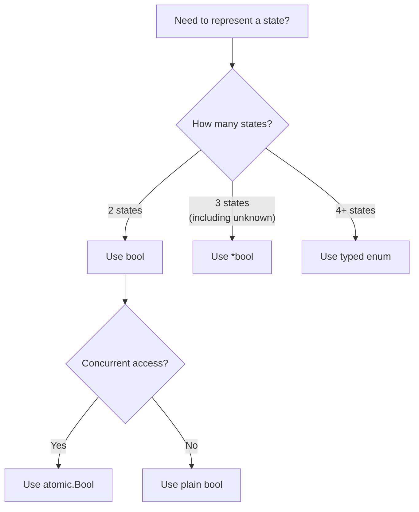
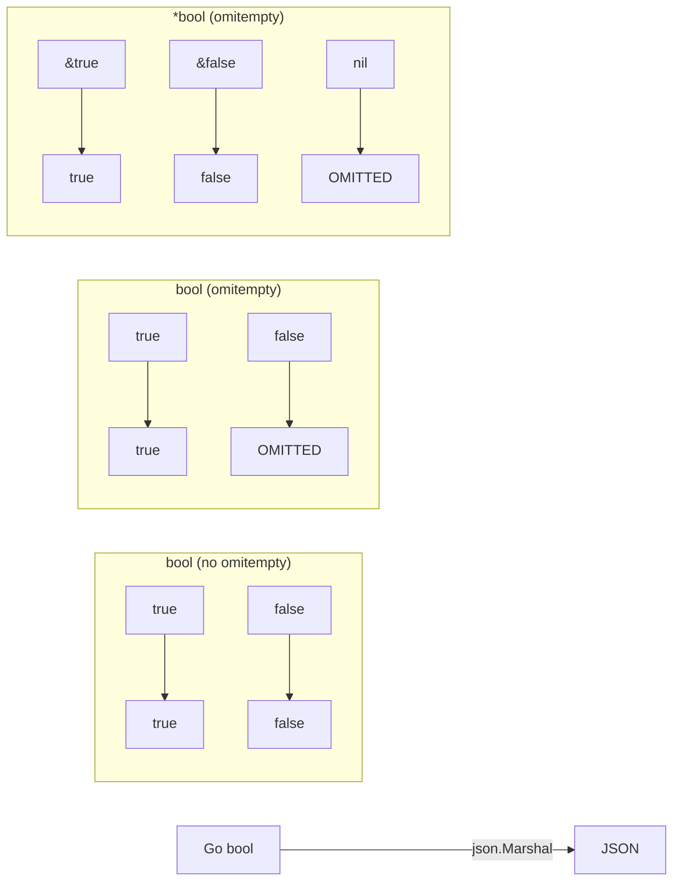
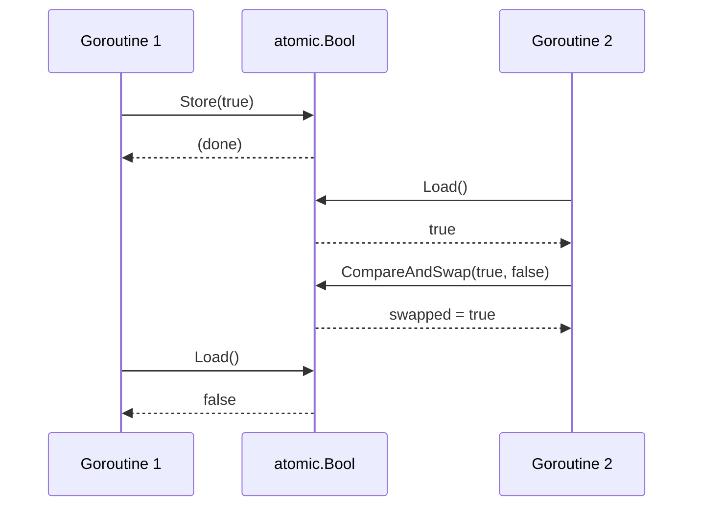
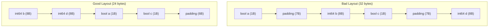

# Boolean — Middle Level

## Table of Contents

1. [Introduction](#introduction)
2. [Core Concepts](#core-concepts)
3. [Evolution & History](#evolution--history)
4. [Pros & Cons](#pros--cons)
5. [Alternative Approaches](#alternative-approaches)
6. [Use Cases](#use-cases)
7. [Code Examples](#code-examples)
8. [Coding Patterns](#coding-patterns)
9. [Clean Code](#clean-code)
10. [Product Use / Feature](#product-use--feature)
11. [Error Handling](#error-handling)
12. [Security Considerations](#security-considerations)
13. [Performance Optimization](#performance-optimization)
14. [Metrics & Analytics](#metrics--analytics)
15. [Debugging Guide](#debugging-guide)
16. [Best Practices](#best-practices)
17. [Edge Cases & Pitfalls](#edge-cases--pitfalls)
18. [Common Mistakes](#common-mistakes)
19. [Anti-Patterns](#anti-patterns)
20. [Tricky Points](#tricky-points)
21. [Comparison with Other Languages](#comparison-with-other-languages)
22. [Test](#test)
23. [Tricky Questions](#tricky-questions)
24. [Cheat Sheet](#cheat-sheet)
25. [Summary](#summary)
26. [What You Can Build](#what-you-can-build)
27. [Further Reading](#further-reading)
28. [Related Topics](#related-topics)
29. [Diagrams & Visual Aids](#diagrams--visual-aids)

---

## Introduction

> Focus: "Why use it?" and "When to use it?"

At the middle level, you already know that `bool` holds `true` or `false`. Now the question is: **when should you use booleans, when should you avoid them, and how do you use them effectively in production code?**

Booleans are deceptively simple. Their simplicity leads developers to overuse them — passing multiple boolean parameters, creating "boolean blindness," and encoding complex states as combinations of flags. Understanding when booleans are the right tool and when to reach for enums, option types, or state machines is a key skill for intermediate Go developers.

This section covers idiomatic boolean patterns in Go, performance considerations, common anti-patterns, and how booleans interact with concurrency, JSON serialization, and testing.

---

## Core Concepts

### Concept 1: Boolean Identity and Comparison

Go booleans are value types. Two `bool` values are equal if they hold the same value. There is no reference equality concern.

```go
package main

import "fmt"

func main() {
    a := true
    b := true
    c := false

    fmt.Println(a == b) // true
    fmt.Println(a == c) // false

    // Booleans are comparable — they can be map keys
    seen := map[bool]int{
        true:  0,
        false: 0,
    }
    results := []bool{true, false, true, true, false}
    for _, r := range results {
        seen[r]++
    }
    fmt.Println("True count:", seen[true])   // 3
    fmt.Println("False count:", seen[false]) // 2
}
```

### Concept 2: Pointer to Bool (Tri-State)

A plain `bool` has two states. A `*bool` has three: `nil`, `true`, and `false`. This is critical for JSON APIs and optional configuration.

```go
package main

import (
    "encoding/json"
    "fmt"
)

type UpdateRequest struct {
    Name    *string `json:"name,omitempty"`
    Active  *bool   `json:"active,omitempty"`
}

func boolPtr(b bool) *bool { return &b }

func main() {
    // Distinguish "not provided" from "set to false"
    req1 := UpdateRequest{Active: boolPtr(true)}
    req2 := UpdateRequest{Active: boolPtr(false)}
    req3 := UpdateRequest{} // Active is nil — not provided

    for i, req := range []UpdateRequest{req1, req2, req3} {
        data, _ := json.Marshal(req)
        fmt.Printf("Request %d: %s\n", i+1, data)
    }
    // Request 1: {"active":true}
    // Request 2: {"active":false}
    // Request 3: {}
}
```

### Concept 3: sync/atomic Boolean Operations

In concurrent Go programs, plain `bool` access is a data race. Use `sync/atomic` or `sync.Mutex` for safe access.

```go
package main

import (
    "fmt"
    "sync"
    "sync/atomic"
)

func main() {
    var isRunning atomic.Bool
    isRunning.Store(true)

    var wg sync.WaitGroup
    for i := 0; i < 5; i++ {
        wg.Add(1)
        go func(id int) {
            defer wg.Done()
            if isRunning.Load() {
                fmt.Printf("Goroutine %d: running\n", id)
            }
        }(i)
    }

    wg.Wait()

    // Atomically swap the value
    old := isRunning.Swap(false)
    fmt.Println("Was running:", old)
    fmt.Println("Now running:", isRunning.Load())

    // CompareAndSwap: only swap if current value matches
    swapped := isRunning.CompareAndSwap(false, true)
    fmt.Println("CAS succeeded:", swapped)
    fmt.Println("Now running:", isRunning.Load())
}
```

### Concept 4: Boolean with flag Package

The `flag` package provides built-in support for boolean command-line flags.

```go
package main

import (
    "flag"
    "fmt"
)

func main() {
    verbose := flag.Bool("verbose", false, "enable verbose output")
    dryRun := flag.Bool("dry-run", false, "simulate without making changes")
    force := flag.Bool("force", false, "force operation without confirmation")

    flag.Parse()

    fmt.Println("Verbose:", *verbose)
    fmt.Println("Dry run:", *dryRun)
    fmt.Println("Force:", *force)

    if *verbose {
        fmt.Println("Running in verbose mode...")
    }
    if *dryRun {
        fmt.Println("Dry run — no changes will be made")
    }
}
```

### Concept 5: Boolean in Interface Satisfaction

Booleans can be used to signal interface compliance at compile time.

```go
package main

import "fmt"

type Toggler interface {
    Toggle()
    IsOn() bool
}

type Switch struct {
    on bool
}

func (s *Switch) Toggle() { s.on = !s.on }
func (s *Switch) IsOn() bool { return s.on }

// Compile-time check that Switch implements Toggler
var _ Toggler = (*Switch)(nil)

func main() {
    s := &Switch{}
    fmt.Println("Initial:", s.IsOn()) // false
    s.Toggle()
    fmt.Println("After toggle:", s.IsOn()) // true
    s.Toggle()
    fmt.Println("After toggle:", s.IsOn()) // false
}
```

---

## Evolution & History

The `bool` type has been part of Go since its initial release (Go 1.0, March 2012). Key milestones:

| Version | Change |
|---------|--------|
| Go 1.0 (2012) | `bool` type, `true`/`false` literals, `&&`, `\|\|`, `!` operators |
| Go 1.4 (2014) | Internal runtime converted from C to Go — boolean handling unified |
| Go 1.19 (2022) | `sync/atomic.Bool` added to standard library |
| Go 1.21 (2023) | `slices` and `maps` packages — functional patterns with boolean predicates |
| Go 1.22 (2024) | Range over integers — reduced need for boolean loop conditions |

George Boole published "An Investigation of the Laws of Thought" in 1854, establishing Boolean algebra. Go's `bool` type directly descends from this mathematical foundation, through C's eventual adoption of `_Bool` in C99 and C++'s native `bool` type.

Unlike C (where `0` is false and any non-zero is true) and unlike Python (where empty collections are falsy), Go chose **strict boolean typing** to eliminate an entire class of bugs.

---

## Pros & Cons

| Pros | Cons |
|------|------|
| Type-safe — prevents accidental int/bool mixing | Cannot represent "unknown" without `*bool` |
| Clear semantics — `true`/`false` are self-documenting | `omitempty` in JSON treats `false` as empty |
| Atomic operations via `sync/atomic.Bool` | Multiple boolean fields create combinatorial explosion |
| Efficient comparison and hashing | No ordered comparison (`<`, `>` not allowed) |
| Works as map key | Cannot be used in arithmetic expressions |
| Zero value (`false`) is usually the safe default | Boolean parameters reduce API readability |

---

## Alternative Approaches

### Instead of Multiple Booleans: Use an Enum

```go
// Bad: multiple booleans create 2^n combinations
type Connection struct {
    IsConnected   bool
    IsAuthenticated bool
    IsEncrypted   bool
}

// Good: use a state enum
type ConnState int

const (
    Disconnected ConnState = iota
    Connected
    Authenticated
    Encrypted
)

type Connection struct {
    State ConnState
}
```

### Instead of Boolean Parameter: Use Functional Options

```go
// Bad: what does true, false mean at the call site?
func NewServer(addr string, tls bool, logging bool) {}

// Good: functional options
type Option func(*Server)

func WithTLS() Option    { return func(s *Server) { s.tls = true } }
func WithLogging() Option { return func(s *Server) { s.logging = true } }

func NewServer(addr string, opts ...Option) *Server {
    s := &Server{addr: addr}
    for _, opt := range opts {
        opt(s)
    }
    return s
}

// Call site is self-documenting:
// NewServer(":8080", WithTLS(), WithLogging())
```

### Instead of *bool: Use a Custom Type

```go
type OptionalBool int

const (
    Unset OptionalBool = iota
    True
    False
)

func (o OptionalBool) String() string {
    switch o {
    case True:
        return "true"
    case False:
        return "false"
    default:
        return "unset"
    }
}
```

---

## Use Cases

1. **Circuit breaker pattern**: Atomic bool tracks whether the circuit is open or closed
2. **Graceful shutdown**: Boolean flag signals goroutines to stop processing
3. **Caching**: Boolean indicates cache hit/miss alongside the cached value
4. **Feature gates**: Runtime boolean checks enable progressive rollouts
5. **Idempotency**: Boolean tracks whether an operation has already been performed
6. **Health checks**: Boolean endpoint returns service readiness
7. **Retry logic**: Boolean indicates whether an error is retryable
8. **Configuration**: Boolean fields control behavior toggles in config structs

---

## Code Examples

### Example 1: Circuit Breaker with Atomic Bool

```go
package main

import (
    "fmt"
    "sync/atomic"
    "time"
)

type CircuitBreaker struct {
    isOpen      atomic.Bool
    failCount   atomic.Int32
    threshold   int32
    resetPeriod time.Duration
}

func NewCircuitBreaker(threshold int32, resetPeriod time.Duration) *CircuitBreaker {
    return &CircuitBreaker{
        threshold:   threshold,
        resetPeriod: resetPeriod,
    }
}

func (cb *CircuitBreaker) Execute(fn func() error) error {
    if cb.isOpen.Load() {
        return fmt.Errorf("circuit is open — request rejected")
    }

    err := fn()
    if err != nil {
        count := cb.failCount.Add(1)
        if count >= cb.threshold {
            cb.isOpen.Store(true)
            fmt.Println("Circuit opened!")
            go cb.scheduleReset()
        }
        return err
    }

    cb.failCount.Store(0)
    return nil
}

func (cb *CircuitBreaker) scheduleReset() {
    time.Sleep(cb.resetPeriod)
    cb.isOpen.Store(false)
    cb.failCount.Store(0)
    fmt.Println("Circuit reset to closed")
}

func main() {
    cb := NewCircuitBreaker(3, 2*time.Second)

    failingOp := func() error { return fmt.Errorf("service unavailable") }

    for i := 0; i < 5; i++ {
        err := cb.Execute(failingOp)
        if err != nil {
            fmt.Printf("Attempt %d: %v\n", i+1, err)
        }
    }

    time.Sleep(3 * time.Second)
    fmt.Println("After reset, circuit open:", cb.isOpen.Load())
}
```

### Example 2: Graceful Shutdown Pattern

```go
package main

import (
    "context"
    "fmt"
    "sync"
    "time"
)

type Worker struct {
    id int
}

func (w *Worker) Run(ctx context.Context, wg *sync.WaitGroup) {
    defer wg.Done()
    for {
        select {
        case <-ctx.Done():
            fmt.Printf("Worker %d: shutting down\n", w.id)
            return
        default:
            fmt.Printf("Worker %d: processing...\n", w.id)
            time.Sleep(500 * time.Millisecond)
        }
    }
}

func main() {
    ctx, cancel := context.WithCancel(context.Background())
    var wg sync.WaitGroup

    for i := 1; i <= 3; i++ {
        wg.Add(1)
        w := &Worker{id: i}
        go w.Run(ctx, &wg)
    }

    time.Sleep(2 * time.Second)
    fmt.Println("Initiating shutdown...")
    cancel()
    wg.Wait()
    fmt.Println("All workers stopped")
}
```

### Example 3: Boolean Predicate with Generics

```go
package main

import "fmt"

func Filter[T any](items []T, predicate func(T) bool) []T {
    result := make([]T, 0, len(items))
    for _, item := range items {
        if predicate(item) {
            result = append(result, item)
        }
    }
    return result
}

func All[T any](items []T, predicate func(T) bool) bool {
    for _, item := range items {
        if !predicate(item) {
            return false
        }
    }
    return true
}

func Any[T any](items []T, predicate func(T) bool) bool {
    for _, item := range items {
        if predicate(item) {
            return true
        }
    }
    return false
}

func None[T any](items []T, predicate func(T) bool) bool {
    return !Any(items, predicate)
}

func main() {
    nums := []int{1, 2, 3, 4, 5, 6, 7, 8, 9, 10}

    isEven := func(n int) bool { return n%2 == 0 }
    isPositive := func(n int) bool { return n > 0 }
    isNegative := func(n int) bool { return n < 0 }

    evens := Filter(nums, isEven)
    fmt.Println("Evens:", evens)                   // [2 4 6 8 10]
    fmt.Println("All positive:", All(nums, isPositive))  // true
    fmt.Println("Any negative:", Any(nums, isNegative))  // false
    fmt.Println("None negative:", None(nums, isNegative)) // true
}
```

### Example 4: JSON Serialization Pitfalls

```go
package main

import (
    "encoding/json"
    "fmt"
)

type UserPreferences struct {
    DarkMode         bool  `json:"dark_mode"`
    EmailNotify      bool  `json:"email_notify,omitempty"`
    PushNotify       *bool `json:"push_notify,omitempty"`
}

func boolPtr(b bool) *bool { return &b }

func main() {
    // Case 1: All defaults (false)
    prefs1 := UserPreferences{}
    data1, _ := json.Marshal(prefs1)
    fmt.Println("Defaults:", string(data1))
    // {"dark_mode":false}
    // Note: email_notify omitted (false + omitempty), push_notify omitted (nil)

    // Case 2: Explicitly set to false
    prefs2 := UserPreferences{
        DarkMode:    false,
        EmailNotify: false,
        PushNotify:  boolPtr(false),
    }
    data2, _ := json.Marshal(prefs2)
    fmt.Println("Explicit false:", string(data2))
    // {"dark_mode":false,"push_notify":false}
    // Note: email_notify still omitted! push_notify preserved because *bool

    // Case 3: All true
    prefs3 := UserPreferences{
        DarkMode:    true,
        EmailNotify: true,
        PushNotify:  boolPtr(true),
    }
    data3, _ := json.Marshal(prefs3)
    fmt.Println("All true:", string(data3))
    // {"dark_mode":true,"email_notify":true,"push_notify":true}
}
```

### Example 5: Boolean Bitset for Performance

```go
package main

import "fmt"

// When you need many booleans, a bitset is more memory-efficient
type Permissions uint8

const (
    CanRead   Permissions = 1 << iota // 0b00000001
    CanWrite                           // 0b00000010
    CanDelete                          // 0b00000100
    CanAdmin                           // 0b00001000
)

func (p Permissions) Has(flag Permissions) bool {
    return p&flag != 0
}

func (p *Permissions) Set(flag Permissions) {
    *p |= flag
}

func (p *Permissions) Clear(flag Permissions) {
    *p &^= flag
}

func (p Permissions) String() string {
    result := ""
    if p.Has(CanRead) { result += "read " }
    if p.Has(CanWrite) { result += "write " }
    if p.Has(CanDelete) { result += "delete " }
    if p.Has(CanAdmin) { result += "admin " }
    if result == "" { return "none" }
    return result
}

func main() {
    var perms Permissions
    fmt.Println("Initial:", perms) // none

    perms.Set(CanRead)
    perms.Set(CanWrite)
    fmt.Println("After set:", perms) // read write

    fmt.Println("Can read:", perms.Has(CanRead))     // true
    fmt.Println("Can delete:", perms.Has(CanDelete)) // false

    perms.Clear(CanWrite)
    fmt.Println("After clear:", perms) // read

    // Combine flags
    adminPerms := CanRead | CanWrite | CanDelete | CanAdmin
    fmt.Println("Admin:", adminPerms) // read write delete admin
}
```

---

## Coding Patterns

### Pattern 1: Once-Only Execution with sync.Once

```go
var (
    instance *Database
    once     sync.Once
)

func GetDB() *Database {
    once.Do(func() {
        instance = connectToDatabase()
    })
    return instance
}
```

### Pattern 2: Boolean Channel Signal

```go
// Use empty struct channel instead of bool channel for signaling
done := make(chan struct{})

go func() {
    // do work
    close(done) // signal completion
}()

<-done // wait for completion
```

### Pattern 3: Retry with Retryable Error

```go
type RetryableError struct {
    Err       error
    Retryable bool
}

func (e *RetryableError) Error() string { return e.Err.Error() }

func callService() error {
    err := doRequest()
    if err != nil {
        return &RetryableError{Err: err, Retryable: isTransient(err)}
    }
    return nil
}

func isTransient(err error) bool {
    // Network errors and 5xx are retryable
    var netErr *net.OpError
    return errors.As(err, &netErr)
}
```

### Pattern 4: Validate and Collect Errors

```go
func validate(input Input) []string {
    var errs []string

    if !isValidEmail(input.Email) {
        errs = append(errs, "invalid email")
    }
    if !isStrongPassword(input.Password) {
        errs = append(errs, "weak password")
    }
    if !isValidAge(input.Age) {
        errs = append(errs, "invalid age")
    }

    return errs // empty slice means valid
}
```

---

## Clean Code

### Rule 1: Eliminate Boolean Parameters

```go
// Bad — caller cannot understand the meaning
func connect(host string, secure bool) {}
connect("example.com", true) // true what?

// Good — use separate functions or options
func Connect(host string) {}
func ConnectTLS(host string) {}
// or
func Connect(host string, opts ...ConnectOption) {}
```

### Rule 2: Replace Boolean State with State Machine

```go
// Bad — multiple booleans for state
type Order struct {
    IsPending   bool
    IsConfirmed bool
    IsShipped   bool
    IsDelivered bool
}

// Good — single state enum
type OrderStatus int
const (
    Pending OrderStatus = iota
    Confirmed
    Shipped
    Delivered
)

type Order struct {
    Status OrderStatus
}
```

### Rule 3: Use Named Return for Boolean Functions

```go
// The ok return value is a Go convention
func lookup(key string) (value string, ok bool) {
    v, exists := cache[key]
    if !exists {
        return "", false
    }
    return v, true
}
```

---

## Product Use / Feature

### Feature Flag System

```go
package main

import (
    "encoding/json"
    "fmt"
    "os"
    "sync"
)

type FeatureFlags struct {
    mu    sync.RWMutex
    flags map[string]bool
}

func NewFeatureFlags(path string) (*FeatureFlags, error) {
    data, err := os.ReadFile(path)
    if err != nil {
        return nil, err
    }

    var flags map[string]bool
    if err := json.Unmarshal(data, &flags); err != nil {
        return nil, err
    }

    return &FeatureFlags{flags: flags}, nil
}

func (ff *FeatureFlags) IsEnabled(feature string) bool {
    ff.mu.RLock()
    defer ff.mu.RUnlock()
    return ff.flags[feature] // returns false for unknown features
}

func (ff *FeatureFlags) SetFlag(feature string, enabled bool) {
    ff.mu.Lock()
    defer ff.mu.Unlock()
    ff.flags[feature] = enabled
}

func main() {
    ff := &FeatureFlags{
        flags: map[string]bool{
            "new_dashboard": true,
            "dark_mode":     true,
            "beta_api":      false,
        },
    }

    features := []string{"new_dashboard", "dark_mode", "beta_api", "unknown_feature"}
    for _, f := range features {
        fmt.Printf("%-20s enabled: %v\n", f, ff.IsEnabled(f))
    }
}
```

---

## Error Handling

### Boolean + Error Pattern

```go
// Pattern 1: ok + error (for operations that can fail)
func authenticate(token string) (ok bool, err error) {
    if token == "" {
        return false, fmt.Errorf("empty token")
    }
    valid, err := validateToken(token)
    if err != nil {
        return false, fmt.Errorf("token validation failed: %w", err)
    }
    return valid, nil
}

// Pattern 2: Errors with boolean helpers
type ValidationError struct {
    Field   string
    Message string
}

func (e *ValidationError) Error() string {
    return fmt.Sprintf("%s: %s", e.Field, e.Message)
}

func IsValidationError(err error) bool {
    var ve *ValidationError
    return errors.As(err, &ve)
}
```

### Never Use Bool Where Error is Needed

```go
// Bad — loses error information
func saveFile(path string, data []byte) bool {
    err := os.WriteFile(path, data, 0644)
    return err == nil // What went wrong? Permission? Disk full? Path invalid?
}

// Good — preserves error information
func saveFile(path string, data []byte) error {
    return os.WriteFile(path, data, 0644)
}
```

---

## Security Considerations

### Constant-Time Boolean Comparison

```go
import "crypto/subtle"

// Bad — timing attack possible
func checkToken(provided, expected string) bool {
    return provided == expected // Early exit reveals length
}

// Good — constant-time comparison
func checkToken(provided, expected string) bool {
    return subtle.ConstantTimeCompare([]byte(provided), []byte(expected)) == 1
}
```

### Boolean Authorization Pitfalls

```go
// Bad — trust client boolean
type Request struct {
    UserID  string `json:"user_id"`
    IsAdmin bool   `json:"is_admin"` // Client can set this!
}

// Good — derive from server state
func isAdmin(ctx context.Context) bool {
    claims, ok := auth.ClaimsFromContext(ctx)
    if !ok {
        return false // Fail closed
    }
    return claims.Role == "admin"
}
```

### Race Condition on Boolean Flags

```go
// Bad — data race
var isShuttingDown bool // Shared across goroutines without synchronization

// Good — atomic access
var isShuttingDown atomic.Bool
```

---

## Performance Optimization

### Boolean Array vs Bitset

```go
package main

import (
    "fmt"
    "math/big"
    "unsafe"
)

func main() {
    // bool array: 1 byte per element
    boolArray := [1000]bool{}
    fmt.Printf("bool[1000] size: %d bytes\n", unsafe.Sizeof(boolArray)) // 1000

    // big.Int bitset: 1 bit per element
    bitset := new(big.Int)
    for i := 0; i < 1000; i++ {
        if i%2 == 0 {
            bitset.SetBit(bitset, i, 1)
        }
    }
    fmt.Printf("big.Int for 1000 bits: ~%d bytes\n", len(bitset.Bytes())) // ~125
}
```

### Struct Field Ordering for Alignment

```go
// Bad — wastes memory due to padding
type BadLayout struct {
    a bool    // 1 byte + 7 padding
    b int64   // 8 bytes
    c bool    // 1 byte + 7 padding
    d int64   // 8 bytes
}
// Total: 32 bytes

// Good — group booleans together
type GoodLayout struct {
    b int64   // 8 bytes
    d int64   // 8 bytes
    a bool    // 1 byte
    c bool    // 1 byte + 6 padding
}
// Total: 24 bytes
```

### Short-Circuit for Performance

```go
// Put cheap/likely checks first
func shouldProcess(item Item) bool {
    return item.IsActive &&           // field access — O(1)
        !item.IsDeleted &&            // field access — O(1)
        item.CreatedAt.After(cutoff) && // time comparison — O(1)
        hasPermission(item.OwnerID)    // DB lookup — O(n) — evaluated last
}
```

---

## Metrics & Analytics

```go
package main

import (
    "fmt"
    "sync/atomic"
)

type BoolMetrics struct {
    trueCount  atomic.Int64
    falseCount atomic.Int64
}

func (m *BoolMetrics) Record(value bool) {
    if value {
        m.trueCount.Add(1)
    } else {
        m.falseCount.Add(1)
    }
}

func (m *BoolMetrics) TrueRate() float64 {
    t := m.trueCount.Load()
    f := m.falseCount.Load()
    total := t + f
    if total == 0 {
        return 0
    }
    return float64(t) / float64(total) * 100
}

func (m *BoolMetrics) Report() string {
    return fmt.Sprintf("True: %d, False: %d, True Rate: %.1f%%",
        m.trueCount.Load(), m.falseCount.Load(), m.TrueRate())
}

func main() {
    m := &BoolMetrics{}

    results := []bool{true, true, false, true, false, true, true, false, true, true}
    for _, r := range results {
        m.Record(r)
    }

    fmt.Println(m.Report()) // True: 7, False: 3, True Rate: 70.0%
}
```

---

## Debugging Guide

### Debugging Boolean Logic

```go
// When complex boolean expressions produce unexpected results, break them apart:
func debugCondition(user User) {
    isAdult := user.Age >= 18
    isVerified := user.EmailVerified
    isActive := !user.IsBanned
    hasConsent := user.AcceptedTerms

    fmt.Printf("isAdult=%v isVerified=%v isActive=%v hasConsent=%v\n",
        isAdult, isVerified, isActive, hasConsent)

    canProceed := isAdult && isVerified && isActive && hasConsent
    fmt.Println("canProceed:", canProceed)
}
```

### Common Debugging Scenarios

| Symptom | Likely Cause | Fix |
|---------|-------------|-----|
| Boolean always false | Zero value not overwritten | Check initialization path |
| Race condition on bool | Concurrent read/write | Use `atomic.Bool` or mutex |
| JSON field missing | `omitempty` with `false` value | Use `*bool` or remove `omitempty` |
| Wrong branch taken | Operator precedence | Add explicit parentheses |
| Map access returns false | Key missing vs value false | Use `v, ok := m[k]` |

### Using Delve Debugger

```bash
# Set breakpoint and inspect boolean values
dlv debug main.go
(dlv) break main.go:42
(dlv) continue
(dlv) print isReady
(dlv) print user.IsAdmin
```

---

## Best Practices

1. **Use `atomic.Bool` for shared state** — never access a boolean from multiple goroutines without synchronization
2. **Prefer `*bool` for optional JSON fields** — `omitempty` omits `false`, which may not be your intent
3. **Use enums for state machines** — if you have more than 2 states, booleans are the wrong tool
4. **Name predicates clearly** — `isValid`, `hasAccess`, `canDelete`, `shouldRetry`
5. **Put cheap checks first** in short-circuit chains for better performance
6. **Return `error` not `bool`** for operations that can fail in multiple ways
7. **Use functional options** instead of boolean parameters in public APIs
8. **Group booleans in structs** to minimize padding and improve cache locality
9. **Use `sync.Once`** instead of a boolean flag for one-time initialization
10. **Document what `true` means** when the boolean's purpose is not obvious from context

---

## Edge Cases & Pitfalls

### Pitfall 1: Boolean in select Statement

```go
// The done channel pattern is preferred over boolean polling
// Bad — busy loop
for !isDone.Load() {
    time.Sleep(10 * time.Millisecond)
}

// Good — channel signaling
<-done
```

### Pitfall 2: JSON omitempty with bool

```go
type Config struct {
    Verbose bool `json:"verbose,omitempty"` // false is OMITTED
}

// Marshaling Config{Verbose: false} produces: {}
// This means you cannot distinguish "not set" from "explicitly false"
```

### Pitfall 3: Bool Pointer Nil Dereference

```go
func process(enabled *bool) {
    // Bad — nil dereference panic
    // if *enabled { ... }

    // Good — nil check first
    if enabled != nil && *enabled {
        // process
    }
}
```

---

## Common Mistakes

| Mistake | Explanation | Fix |
|---------|-------------|-----|
| Using `bool` for concurrent access | Data race | Use `atomic.Bool` |
| `omitempty` on `bool` JSON field | Drops explicit `false` | Use `*bool` or remove `omitempty` |
| Multiple boolean params | Unreadable at call site | Use options pattern |
| Boolean for multi-state | Not extensible | Use typed enum |
| Polling a boolean flag | CPU waste | Use channels or `sync.Cond` |
| `if err == nil { return true } return false` | Redundant | `return err == nil` |

---

## Anti-Patterns

### Anti-Pattern 1: Boolean Blindness

```go
// Bad — what does true mean at the call site?
func formatDate(date time.Time, utc bool) string { ... }
formatDate(now, true)  // true what?

// Good — use named types or separate functions
type TimeZone int
const (
    Local TimeZone = iota
    UTC
)
func formatDate(date time.Time, tz TimeZone) string { ... }
formatDate(now, UTC) // Clear!
```

### Anti-Pattern 2: Boolean Explosion

```go
// Bad — 2^4 = 16 possible states, most invalid
type Document struct {
    IsDraft     bool
    IsPublished bool
    IsArchived  bool
    IsDeleted   bool
}

// Good — single state field
type DocStatus int
const (
    Draft DocStatus = iota
    Published
    Archived
    Deleted
)
```

### Anti-Pattern 3: Using Bool Instead of Error

```go
// Bad — swallows error context
func save(data []byte) bool { ... }

// Good — preserves error information
func save(data []byte) error { ... }
```

---

## Tricky Points

### Point 1: Boolean Constants are Untyped

```go
const isDebug = true // This is an untyped boolean constant

type MyBool bool
var b MyBool = isDebug // Works because isDebug is untyped

const typedDebug bool = true
// var c MyBool = typedDebug // ERROR: cannot use typed bool as MyBool
```

### Point 2: Operator Precedence

```go
// && has higher precedence than ||
a || b && c   // means: a || (b && c)
(a || b) && c // different meaning — use parentheses!

// ! has highest precedence
!a && b       // means: (!a) && b
!(a && b)     // different — negates the whole expression
```

### Point 3: Boolean in switch

```go
// switch true is equivalent to if-else chain
switch {
case x > 100:
    fmt.Println("large")
case x > 10:
    fmt.Println("medium")
default:
    fmt.Println("small")
}

// You can also switch on a boolean variable
switch isReady {
case true:
    fmt.Println("ready")
case false:
    fmt.Println("not ready")
}
```

---

## Comparison with Other Languages

| Feature | Go | C/C++ | Python | Java | Rust |
|---------|-----|-------|--------|------|------|
| Bool type | `bool` | `bool` / `_Bool` | `bool` | `boolean` | `bool` |
| True/False | `true`/`false` | `true`/`false` (1/0) | `True`/`False` | `true`/`false` | `true`/`false` |
| Zero value | `false` | 0 | `False` | `false` | `false` |
| Int to bool | Not allowed | Implicit | Truthy/Falsy | Not allowed | Not allowed |
| Bool to int | Not allowed | Implicit | `int(True)=1` | Not allowed | `as` cast |
| Size | 1 byte | 1 byte (usually) | 28 bytes (object) | 1 byte | 1 byte |
| Atomic | `atomic.Bool` | `std::atomic<bool>` | `threading.Lock` | `AtomicBoolean` | `AtomicBool` |
| Nullable | `*bool` | `std::optional<bool>` | `None` | `Boolean` (wrapper) | `Option<bool>` |
| Short-circuit | Yes | Yes | Yes | Yes | Yes |

---

## Test

<details>
<summary>Question 1: What is the output of this code?</summary>

```go
var m map[string]bool
fmt.Println(m["key"])
```

**Answer:** `false`

Accessing a missing key in a `nil` map returns the zero value. For `bool`, that is `false`. Note: writing to a nil map panics, but reading is safe.
</details>

<details>
<summary>Question 2: What is wrong with this struct for JSON?</summary>

```go
type Config struct {
    Debug bool `json:"debug,omitempty"`
}
```

**Answer:** When `Debug` is explicitly set to `false`, `omitempty` will omit it from the JSON output. The receiver cannot distinguish "not set" from "set to false." Use `*bool` if you need to preserve explicit `false`.
</details>

<details>
<summary>Question 3: Is this code thread-safe?</summary>

```go
var ready bool
go func() { ready = true }()
if ready { fmt.Println("ready") }
```

**Answer:** No. This is a data race. One goroutine writes `ready` while another reads it without synchronization. Use `atomic.Bool` or a mutex.
</details>

<details>
<summary>Question 4: What does `atomic.Bool.CompareAndSwap(false, true)` do?</summary>

**Answer:** It atomically checks if the current value is `false`. If so, it sets it to `true` and returns `true`. If the current value is already `true`, it does nothing and returns `false`. This is useful for ensuring only one goroutine performs an action.
</details>

<details>
<summary>Question 5: Why is `fmt.Println(&true)` a compilation error?</summary>

**Answer:** `true` is a literal constant and is not addressable in Go. You cannot take the address of a constant. You need to assign it to a variable first: `v := true; fmt.Println(&v)`.
</details>

---

## Tricky Questions

1. **Q: Can a custom type based on bool have methods?**
   A: Yes. `type Flag bool` can have methods. `func (f Flag) String() string { ... }` is valid.

2. **Q: Can you range over a bool?**
   A: No. The `range` clause works with arrays, slices, maps, strings, and channels — not booleans.

3. **Q: What happens when you json.Unmarshal `"yes"` into a `bool`?**
   A: It returns an error. JSON expects `true` or `false` literals, not strings like `"yes"` or `"1"`.

4. **Q: Does `reflect.DeepEqual(false, false)` return true?**
   A: Yes. `DeepEqual` compares values, and two `false` values are deeply equal.

5. **Q: Can `sync/atomic.Bool` be used as a map key?**
   A: No. `atomic.Bool` is a struct with unexported fields and is not comparable. Also, it must not be copied.

---

## Cheat Sheet

| Pattern | Code |
|---------|------|
| Declare | `var b bool` (zero value: `false`) |
| Atomic bool | `var ab atomic.Bool` |
| Atomic store | `ab.Store(true)` |
| Atomic load | `ab.Load()` |
| Atomic CAS | `ab.CompareAndSwap(old, new)` |
| Pointer to bool | `v := true; p := &v` |
| Bool helper | `func boolPtr(b bool) *bool { return &b }` |
| JSON optional | `Active *bool \`json:"active,omitempty"\`` |
| Predicate func | `func isEven(n int) bool { return n%2 == 0 }` |
| ok idiom | `v, ok := m[key]` |
| Guard clause | `if !valid { return err }` |
| Parse string | `b, err := strconv.ParseBool("true")` |
| Format string | `s := strconv.FormatBool(true)` |
| Flag | `v := flag.Bool("verbose", false, "usage")` |

---

## Summary

- Booleans are simple but require care in production code — especially with concurrency, JSON, and API design
- Use `atomic.Bool` for concurrent access, never plain `bool`
- Use `*bool` when you need to distinguish "not set" from "false" in JSON
- Avoid boolean parameters in public APIs — use functional options or separate functions
- Replace multiple related booleans with typed enums or state machines
- Short-circuit evaluation is guaranteed — order matters for performance
- Return `error` instead of `bool` when operations can fail in multiple ways
- Group boolean fields in structs for better memory layout

---

## What You Can Build

- **Feature flag service** with runtime toggle support and atomic operations
- **Circuit breaker** that protects services from cascading failures
- **Access control layer** with boolean permission checks
- **Configuration manager** that handles boolean flags from CLI, env, and files
- **Health check endpoint** that aggregates boolean health signals from subsystems
- **Rate limiter** with boolean allow/deny decisions

---

## Further Reading

- [Go Specification — Boolean Types](https://go.dev/ref/spec#Boolean_types)
- [Go Specification — Operators](https://go.dev/ref/spec#Operators)
- [sync/atomic package documentation](https://pkg.go.dev/sync/atomic)
- [encoding/json and omitempty behavior](https://pkg.go.dev/encoding/json)
- [flag package documentation](https://pkg.go.dev/flag)
- [Effective Go — Control Structures](https://go.dev/doc/effective_go#control-structures)

---

## Related Topics

- **Concurrency** — atomic operations, mutexes, and safe boolean access
- **JSON Serialization** — `omitempty` behavior with booleans
- **Error Handling** — when to use `error` vs `bool`
- **Generics** — predicate functions with type parameters
- **Interfaces** — boolean methods for interface satisfaction
- **Bitwise Operations** — using integers as compact boolean sets

---

## Diagrams & Visual Aids

### Boolean Decision Patterns



### Boolean in JSON Serialization



### Atomic Bool Operations



### Struct Memory Layout with Booleans


