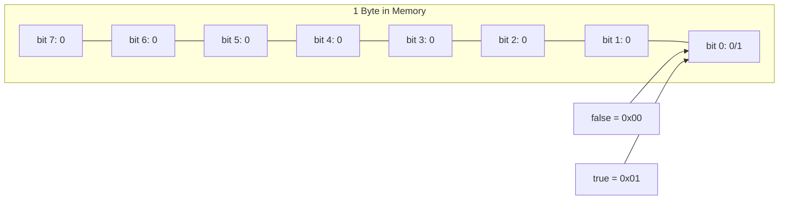
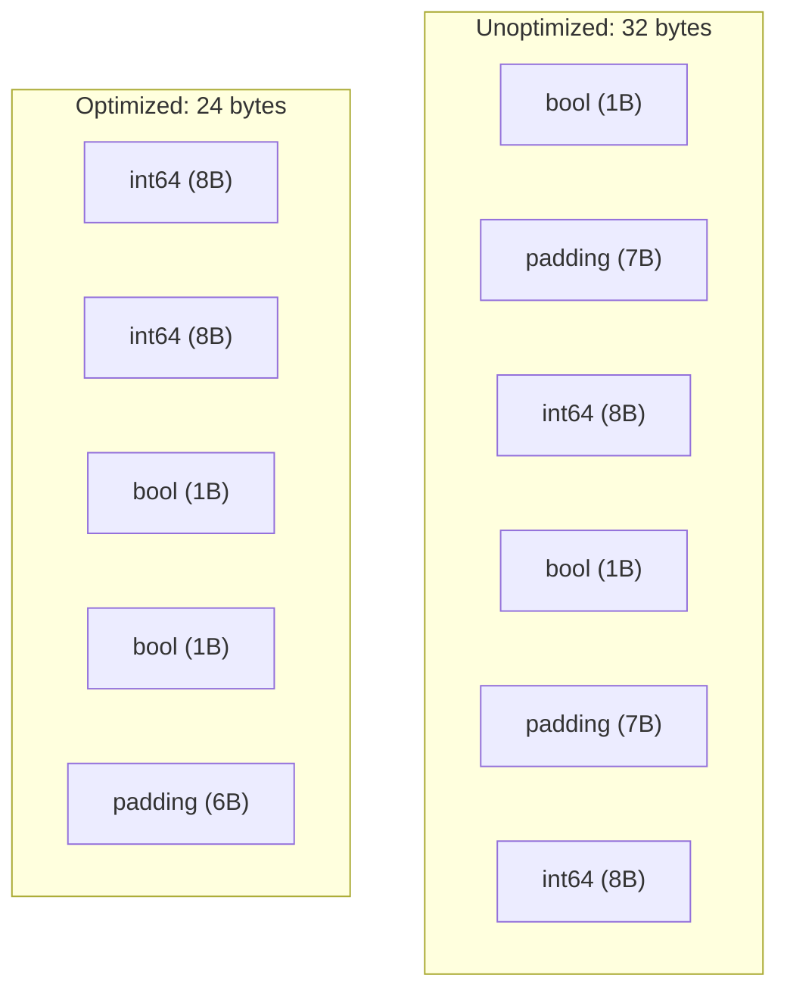
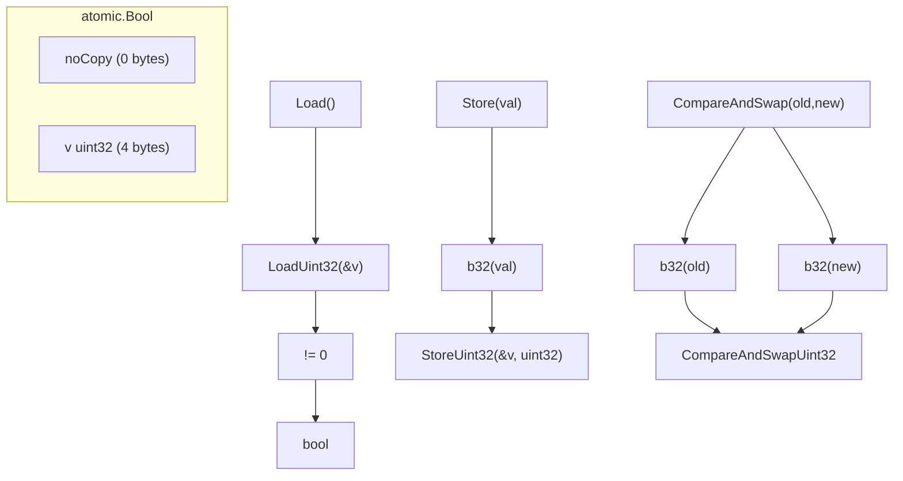
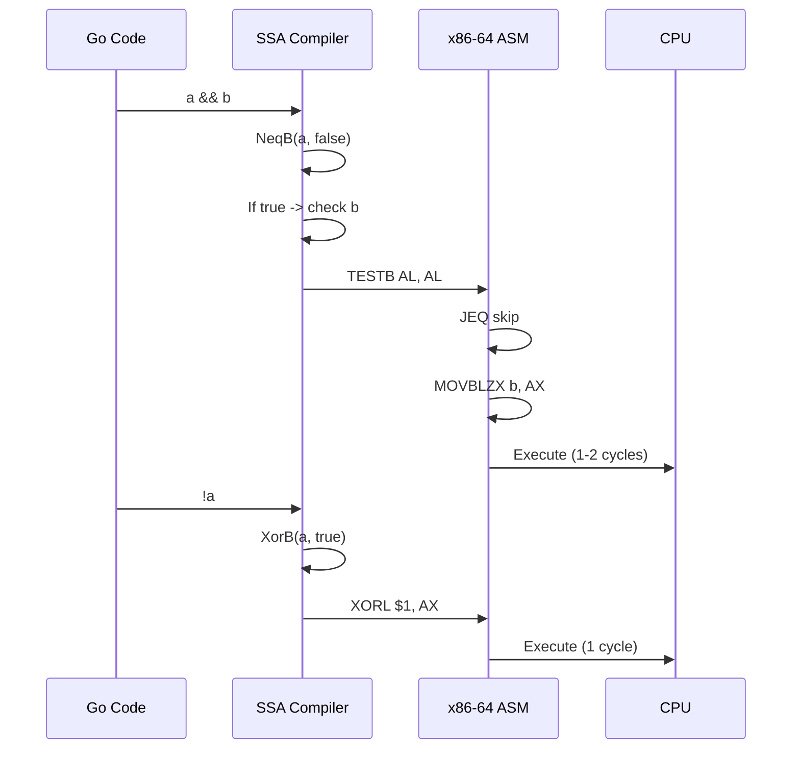
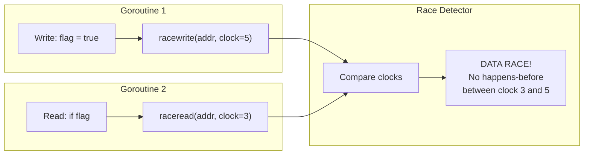

# Boolean — Under the Hood

## Table of Contents

1. [Introduction](#introduction)
2. [How It Works Internally](#how-it-works-internally)
3. [Runtime Deep Dive](#runtime-deep-dive)
4. [Compiler Perspective](#compiler-perspective)
5. [Memory Layout](#memory-layout)
6. [OS/Syscall Level](#ossyscall-level)
7. [Source Code Walkthrough](#source-code-walkthrough)
8. [Assembly Output](#assembly-output)
9. [Performance Internals](#performance-internals)
10. [Metrics Runtime](#metrics-runtime)
11. [Edge Cases at the Lowest Level](#edge-cases-at-the-lowest-level)
12. [Test](#test)
13. [Tricky Questions](#tricky-questions)
14. [Self-Assessment](#self-assessment)
15. [Summary](#summary)
16. [Further Reading](#further-reading)
17. [Diagrams & Visual Aids](#diagrams--visual-aids)

---

## Introduction

> Focus: What happens "under the hood" when Go processes boolean values?

At the professional level, we go beyond the language specification and examine how booleans are represented in memory, compiled to machine code, handled by the runtime, and optimized by the Go compiler. This level of understanding is essential for:

- Writing performance-critical code where every byte and cycle matters
- Understanding race detector behavior with boolean variables
- Debugging memory corruption issues involving boolean fields
- Contributing to the Go compiler or runtime
- Understanding why certain boolean patterns are faster than others

We will examine Go compiler source code, SSA intermediate representation, generated assembly, and the runtime's handling of boolean types.

---

## How It Works Internally

### Boolean Type in the Go Type System

In Go's internal type system, `bool` is a basic type with kind `reflect.Bool`. It is represented as a single byte in memory.

```go
package main

import (
    "fmt"
    "reflect"
    "unsafe"
)

func main() {
    var b bool

    t := reflect.TypeOf(b)
    fmt.Println("Type name:", t.Name())                    // bool
    fmt.Println("Kind:", t.Kind())                         // bool
    fmt.Println("Size:", t.Size(), "bytes")                // 1
    fmt.Println("Alignment:", t.Align(), "bytes")          // 1
    fmt.Println("Field alignment:", t.FieldAlign(), "bytes") // 1
    fmt.Println("Comparable:", t.Comparable())              // true

    // Direct memory inspection
    b = true
    ptr := unsafe.Pointer(&b)
    byteVal := *(*byte)(ptr)
    fmt.Printf("true in memory: 0x%02X (%d)\n", byteVal, byteVal) // 0x01 (1)

    b = false
    byteVal = *(*byte)(ptr)
    fmt.Printf("false in memory: 0x%02X (%d)\n", byteVal, byteVal) // 0x00 (0)
}
```

### Boolean Value Representation

The Go specification guarantees that `false` is stored as `0` and `true` is stored as `1` in the underlying byte. However, the compiler may produce values where any non-zero byte is treated as true internally, though this is not guaranteed by the spec.

```go
package main

import (
    "fmt"
    "unsafe"
)

func main() {
    // Demonstrate that bool is exactly 1 byte
    var b bool
    fmt.Printf("Address of b: %p\n", &b)
    fmt.Printf("Size: %d byte(s)\n", unsafe.Sizeof(b))

    // Force a non-standard boolean value via unsafe
    // WARNING: This is undefined behavior — for demonstration only
    bPtr := (*byte)(unsafe.Pointer(&b))
    *bPtr = 2 // Set to 2 instead of 0 or 1
    fmt.Println("Bool with byte value 2:", b) // Prints: true (implementation-defined)

    // The compiler assumes bool is 0 or 1 — using other values
    // can cause unpredictable behavior in comparisons and branching
    *bPtr = 0xFF
    fmt.Println("Bool with byte value 0xFF:", b) // true (implementation-defined)
}
```

---

## Runtime Deep Dive

### How the Runtime Handles Bool

The Go runtime does not have special handling for `bool` at runtime — it is treated as a 1-byte value type. The interesting aspects are in:

1. **Garbage collector**: Booleans do not contain pointers, so the GC skips them during scanning
2. **Race detector**: Tracks reads and writes to boolean variables for data race detection
3. **Stack allocation**: Small boolean variables are always stack-allocated

```go
package main

import (
    "fmt"
    "runtime"
    "unsafe"
)

func main() {
    // Boolean is stack-allocated (no heap escape)
    b := true
    fmt.Printf("Bool address: %p (stack)\n", &b)

    // Boolean in a slice forces heap allocation
    bools := make([]bool, 10)
    fmt.Printf("Slice data: %p (heap)\n", &bools[0])

    // GC stats — booleans don't add to GC pressure
    var stats runtime.MemStats
    runtime.ReadMemStats(&stats)
    fmt.Printf("Heap objects: %d\n", stats.HeapObjects)
    fmt.Printf("Bool size in heap: %d bytes per element\n", unsafe.Sizeof(false))
}
```

### Race Detector Internals for Bool

```go
package main

import (
    "fmt"
    "sync"
)

// The race detector instruments every memory access.
// For a bool variable, it tracks:
// 1. The goroutine ID performing the access
// 2. Whether it is a read or write
// 3. The logical clock (vector clock) of the access
// 4. The memory address and size (1 byte for bool)

func main() {
    // Run with: go run -race main.go
    var flag bool
    var wg sync.WaitGroup

    wg.Add(2)
    go func() {
        defer wg.Done()
        flag = true // WRITE — race detector logs this
    }()
    go func() {
        defer wg.Done()
        _ = flag // READ — race detector logs this
    }()
    wg.Wait()
    fmt.Println("Done. Run with -race to see the report.")
}
```

### atomic.Bool Implementation

```go
package main

import (
    "fmt"
    "sync/atomic"
    "unsafe"
)

// The actual implementation in Go's standard library:
// type Bool struct {
//     _ noCopy
//     v uint32  // Uses uint32 for atomic alignment, not bool/byte
// }

func main() {
    var ab atomic.Bool
    fmt.Printf("atomic.Bool size: %d bytes\n", unsafe.Sizeof(ab))
    // Usually 4-8 bytes (uint32 + noCopy struct)

    ab.Store(true)
    fmt.Println("Stored true, Load():", ab.Load())

    // Internally, Store(true) calls atomic.StoreUint32(&v, 1)
    // and Load() calls atomic.LoadUint32(&v) != 0
    // CompareAndSwap maps to atomic.CompareAndSwapUint32

    // Why uint32 instead of byte?
    // - Many architectures require 4-byte alignment for atomic ops
    // - ARM32 does not support atomic byte operations
    // - x86-64 supports atomic byte ops but uint32 is more portable
}
```

---

## Compiler Perspective

### SSA Intermediate Representation

The Go compiler converts boolean operations to SSA (Static Single Assignment) form before generating machine code. Boolean operations become comparison and branch instructions.

```go
// To see SSA output:
// GOSSAFUNC=main go build -gcflags="-S" main.go

package main

func boolOps(a, b bool) bool {
    return a && b
}

// SSA for boolOps roughly becomes:
// v1 = Arg <bool> {a}
// v2 = Arg <bool> {b}
// v3 = NeqB v1, ConstBool <bool> [false]  // is a true?
// If v3 -> then, else
// then:
//   v4 = Copy v2                           // result is b
//   Ret v4
// else:
//   Ret ConstBool <bool> [false]           // result is false

func main() {
    result := boolOps(true, false)
    _ = result
}
```

### Compiler Optimizations for Bool

```go
package main

// The compiler optimizes many boolean patterns:

// 1. Constant folding
func alwaysTrue() bool {
    return true && true // Compiled to: return true
}

// 2. Dead code elimination
func deadCode(x int) int {
    if false {
        return x * 2 // This entire branch is eliminated
    }
    return x
}

// 3. Branch elimination
func simplify(a bool) bool {
    if a {
        return true
    }
    return false
    // Compiler simplifies to: return a
}

// 4. Short-circuit optimization
func shortCircuit(a, b bool) bool {
    return a && b
    // Compiler generates:
    //   test a
    //   jz return_false
    //   return b
    // return_false:
    //   return false
}

// 5. Boolean to conditional move (branchless)
func conditional(a bool, x, y int) int {
    if a {
        return x
    }
    return y
    // On x86-64, may become CMOVQ (conditional move) — no branch
}

func main() {}
```

### Compiler Bool Width

```go
package main

import (
    "fmt"
    "unsafe"
)

func main() {
    // The compiler uses 1 byte for bool in memory
    // but may use register-width (8 bytes on 64-bit) in registers
    var b bool
    fmt.Println("Memory size:", unsafe.Sizeof(b)) // 1

    // In a register, bool occupies a full 64-bit register
    // but only the lowest byte matters
    // The upper bytes may contain garbage

    // Array of bools — no padding between elements
    var arr [8]bool
    fmt.Println("8 bools size:", unsafe.Sizeof(arr)) // 8 (no padding)
    for i := range arr {
        fmt.Printf("  arr[%d] at offset %d\n", i,
            uintptr(unsafe.Pointer(&arr[i]))-uintptr(unsafe.Pointer(&arr[0])))
    }
}
```

---

## Memory Layout

### Bool in Structs — Padding Analysis

```go
package main

import (
    "fmt"
    "unsafe"
)

type Layout1 struct {
    a bool    // offset 0, size 1
    // 7 bytes padding
    b int64   // offset 8, size 8
    c bool    // offset 16, size 1
    // 7 bytes padding
    d int64   // offset 24, size 8
}
// Total: 32 bytes

type Layout2 struct {
    b int64   // offset 0, size 8
    d int64   // offset 8, size 8
    a bool    // offset 16, size 1
    c bool    // offset 17, size 1
    // 6 bytes padding
}
// Total: 24 bytes

type Layout3 struct {
    a bool    // offset 0, size 1
    c bool    // offset 1, size 1
    // 2 bytes padding
    e int32   // offset 4, size 4
    b int64   // offset 8, size 8
}
// Total: 16 bytes

func printLayout(name string, size uintptr, fields []struct{ name string; offset uintptr }) {
    fmt.Printf("\n%s (total: %d bytes)\n", name, size)
    for _, f := range fields {
        fmt.Printf("  %-10s offset: %d\n", f.name, f.offset)
    }
}

func main() {
    var l1 Layout1
    printLayout("Layout1", unsafe.Sizeof(l1), []struct{ name string; offset uintptr }{
        {"a (bool)", unsafe.Offsetof(l1.a)},
        {"b (int64)", unsafe.Offsetof(l1.b)},
        {"c (bool)", unsafe.Offsetof(l1.c)},
        {"d (int64)", unsafe.Offsetof(l1.d)},
    })

    var l2 Layout2
    printLayout("Layout2", unsafe.Sizeof(l2), []struct{ name string; offset uintptr }{
        {"b (int64)", unsafe.Offsetof(l2.b)},
        {"d (int64)", unsafe.Offsetof(l2.d)},
        {"a (bool)", unsafe.Offsetof(l2.a)},
        {"c (bool)", unsafe.Offsetof(l2.c)},
    })

    var l3 Layout3
    printLayout("Layout3", unsafe.Sizeof(l3), []struct{ name string; offset uintptr }{
        {"a (bool)", unsafe.Offsetof(l3.a)},
        {"c (bool)", unsafe.Offsetof(l3.c)},
        {"e (int32)", unsafe.Offsetof(l3.e)},
        {"b (int64)", unsafe.Offsetof(l3.b)},
    })
}
```

### Bool Slice Memory Layout

```go
package main

import (
    "fmt"
    "unsafe"
)

func main() {
    bools := []bool{true, false, true, false, true}

    // Slice header: 24 bytes (pointer + length + capacity)
    fmt.Printf("Slice header size: %d bytes\n", unsafe.Sizeof(bools))

    // Data: 5 bytes (1 byte per bool, no padding)
    fmt.Printf("Data size: %d bytes (cap=%d)\n", cap(bools)*int(unsafe.Sizeof(false)), cap(bools))

    // Memory layout of the data
    dataPtr := unsafe.Pointer(&bools[0])
    for i := 0; i < len(bools); i++ {
        addr := unsafe.Add(dataPtr, i)
        val := *(*byte)(addr)
        fmt.Printf("  [%d] addr=%p byte=0x%02X bool=%v\n", i, addr, val, bools[i])
    }

    // Compare with []uint64 bitset
    // 5 bools = 5 bytes in []bool
    // 5 bools = 8 bytes in uint64 bitset (1 word)
    // Breakeven at 8 bools; bitset wins above 8
}
```

### Map with Bool Key/Value

```go
package main

import (
    "fmt"
    "unsafe"
)

func main() {
    // map[string]bool internal bucket layout
    // Each bucket stores up to 8 key-value pairs
    // For bool values, each value is 1 byte
    // tophash (8 bytes) + keys (8 * keysize) + values (8 * 1 byte)

    m := map[string]bool{
        "a": true,
        "b": false,
        "c": true,
    }

    fmt.Printf("map size in memory: ~%d bytes (estimated)\n", unsafe.Sizeof(m))
    // The map header is just a pointer (8 bytes)
    // Actual data is on the heap in bucket structures

    for k, v := range m {
        fmt.Printf("  %s: %v\n", k, v)
    }

    // map[bool]T only has 2 possible buckets
    boolMap := map[bool]string{
        true:  "yes",
        false: "no",
    }
    fmt.Println("Bool key map:", boolMap)
}
```

---

## OS/Syscall Level

### Boolean in System Calls

```go
package main

import (
    "fmt"
    "syscall"
)

func main() {
    // System calls use int (0/1) for boolean values, not Go's bool
    // The Go runtime converts between bool and int at the syscall boundary

    // Example: setting socket options uses int, not bool
    // syscall.SetsockoptInt(fd, level, opt, value)
    // where value is 0 or 1

    // File permissions use mode bits (boolean flags in an integer)
    var stat syscall.Stat_t
    err := syscall.Stat("/tmp", &stat)
    if err != nil {
        fmt.Println("Error:", err)
        return
    }

    // Permission bits are boolean flags packed in uint32
    isDir := stat.Mode&syscall.S_IFDIR != 0
    isReadable := stat.Mode&syscall.S_IRUSR != 0
    isWritable := stat.Mode&syscall.S_IWUSR != 0

    fmt.Printf("Mode: 0o%o\n", stat.Mode)
    fmt.Printf("IsDir: %v, Readable: %v, Writable: %v\n", isDir, isReadable, isWritable)
}
```

### Signal Handling with Booleans

```go
package main

import (
    "fmt"
    "os"
    "os/signal"
    "sync/atomic"
    "syscall"
    "time"
)

func main() {
    var interrupted atomic.Bool

    sigChan := make(chan os.Signal, 1)
    signal.Notify(sigChan, syscall.SIGINT, syscall.SIGTERM)

    go func() {
        sig := <-sigChan
        fmt.Printf("\nReceived signal: %v\n", sig)
        interrupted.Store(true)
    }()

    fmt.Println("Running... Press Ctrl+C to stop")
    for i := 0; i < 10; i++ {
        if interrupted.Load() {
            fmt.Println("Interrupted! Cleaning up...")
            break
        }
        fmt.Printf("Tick %d\n", i)
        time.Sleep(500 * time.Millisecond)
    }
    fmt.Println("Done")
}
```

---

## Source Code Walkthrough

### Go Compiler: Bool Type Definition

The boolean type is defined in the Go compiler source at `cmd/compile/internal/types`:

```go
// From Go source: src/cmd/compile/internal/types/type.go
// Bool is represented as TBOOL in the compiler

// Key compiler constants:
// TBOOL = basic type for bool
// Size = 1 byte
// Alignment = 1 byte

// The compiler's type checker ensures:
// 1. Only bool values can be used in if/for conditions
// 2. && and || operators only accept bool operands
// 3. ! operator only accepts bool operand
// 4. Comparison operators produce bool results
```

### sync/atomic.Bool Source

```go
// From Go source: src/sync/atomic/type.go
// Simplified version of the actual implementation

// A Bool is an atomic boolean value.
// The zero value is false.
type Bool struct {
    _ noCopy
    v uint32
}

// Load atomically loads and returns the value stored in x.
func (x *Bool) Load() bool { return LoadUint32(&x.v) != 0 }

// Store atomically stores val into x.
func (x *Bool) Store(val bool) { StoreUint32(&x.v, b32(val)) }

// Swap atomically stores new into x and returns the previous value.
func (x *Bool) Swap(new bool) (old bool) { return SwapUint32(&x.v, b32(new)) != 0 }

// CompareAndSwap executes the compare-and-swap operation for the boolean value x.
func (x *Bool) CompareAndSwap(old, new bool) (swapped bool) {
    return CompareAndSwapUint32(&x.v, b32(old), b32(new))
}

// b32 returns a uint32 0 or 1 representing b.
func b32(b bool) uint32 {
    if b {
        return 1
    }
    return 0
}
```

### strconv.ParseBool Source

```go
// From Go source: src/strconv/atob.go

// ParseBool returns the boolean value represented by the string.
// It accepts 1, t, T, TRUE, true, True, 0, f, F, FALSE, false, False.
// Any other value returns an error.

// Actual implementation (simplified):
func parseBool(str string) (bool, error) {
    switch str {
    case "1", "t", "T", "true", "TRUE", "True":
        return true, nil
    case "0", "f", "F", "false", "FALSE", "False":
        return false, nil
    }
    return false, fmt.Errorf("strconv.ParseBool: parsing %q: invalid syntax", str)
}
```

### reflect Package Bool Handling

```go
package main

import (
    "fmt"
    "reflect"
)

func main() {
    // reflect.Value.Bool() reads the underlying bool value
    // It panics if the kind is not Bool

    v := reflect.ValueOf(true)
    fmt.Println("Kind:", v.Kind())   // bool
    fmt.Println("Bool:", v.Bool())   // true
    fmt.Println("CanSet:", v.CanSet()) // false (not addressable)

    // Setting a bool via reflection
    var b bool
    rv := reflect.ValueOf(&b).Elem()
    rv.SetBool(true)
    fmt.Println("After SetBool:", b) // true

    // Type assertion in reflect
    iface := interface{}(true)
    rv2 := reflect.ValueOf(iface)
    if rv2.Kind() == reflect.Bool {
        fmt.Println("Is bool:", rv2.Bool())
    }

    // Internally, reflect reads/writes the underlying byte:
    // func (v Value) Bool() bool {
    //     return *(*bool)(v.ptr)
    // }
}
```

---

## Assembly Output

### x86-64 Assembly for Boolean Operations

```go
// Compile with: go tool compile -S bool_ops.go
// Or: go build -gcflags="-S" bool_ops.go

package main

// Simple boolean AND
func boolAnd(a, b bool) bool {
    return a && b
}

// x86-64 assembly (approximately):
// boolAnd:
//   MOVBLZX a+0(FP), AX    // Zero-extend bool 'a' to register
//   TESTB   AL, AL          // Test if a is zero
//   JEQ     return_false    // If a is false, skip b
//   MOVBLZX b+1(FP), AX    // Load b
//   MOVB    AL, ret+2(FP)   // Return b
//   RET
// return_false:
//   MOVB    $0, ret+2(FP)   // Return false
//   RET

// Boolean comparison
func isEqual(x, y int) bool {
    return x == y
}

// x86-64 assembly (approximately):
// isEqual:
//   MOVQ    x+0(FP), AX    // Load x
//   CMPQ    y+8(FP), AX    // Compare with y
//   SETEQ   AL              // Set AL to 1 if equal, 0 otherwise
//   MOVB    AL, ret+16(FP)  // Return result
//   RET

// Boolean NOT
func boolNot(a bool) bool {
    return !a
}

// x86-64 assembly (approximately):
// boolNot:
//   MOVBLZX a+0(FP), AX    // Load a
//   XORL    $1, AX          // XOR with 1 to flip
//   MOVB    AL, ret+1(FP)   // Return result
//   RET

func main() {}
```

### Viewing Real Assembly Output

```go
package main

import (
    "fmt"
    "os/exec"
)

func main() {
    // To view actual assembly for your boolean code:
    // Method 1: go tool compile
    fmt.Println("go tool compile -S file.go 2>&1 | grep 'boolFunc'")

    // Method 2: go build with gcflags
    fmt.Println("go build -gcflags='-S' file.go 2>&1")

    // Method 3: go tool objdump
    fmt.Println("go build -o binary file.go && go tool objdump binary | grep 'boolFunc'")

    // Method 4: Compiler explorer (godbolt.org)
    fmt.Println("Visit https://godbolt.org and select Go compiler")

    // Method 5: SSA visualization
    fmt.Println("GOSSAFUNC=boolFunc go build file.go")
    fmt.Println("Then open ssa.html in browser")

    _ = exec.Command("echo", "demo").Run()
}
```

### Atomic Bool Assembly

```go
// atomic.Bool.Load() on x86-64 generates:
// MOVL (AX), CX              // Atomic load of uint32 (naturally aligned)
// TESTL CX, CX               // Test if zero
// SETNE AL                    // Set result to 1 if non-zero
// This is a single atomic read — no LOCK prefix needed on x86-64
// because aligned 32-bit loads are naturally atomic

// atomic.Bool.Store(true) on x86-64 generates:
// MOVL $1, (AX)              // Atomic store (aligned 32-bit write is atomic)
// XCHGL AX, AX               // Memory barrier (or MFENCE on some implementations)

// atomic.Bool.CompareAndSwap(false, true) on x86-64:
// MOVL $0, AX                // Expected old value
// MOVL $1, CX                // New value
// LOCK CMPXCHGL CX, (DX)     // Atomic compare-and-exchange
// SETEQ AL                    // Set result based on success/failure
```

---

## Performance Internals

### Branch Prediction and Booleans

```go
package main

import (
    "fmt"
    "math/rand"
    "time"
)

// Modern CPUs use branch prediction for boolean conditions
// Predictable patterns (always true, alternating) are fast
// Random patterns cause branch mispredictions (~15-20 cycle penalty)

func benchPredictable(n int) time.Duration {
    data := make([]bool, n)
    for i := range data {
        data[i] = true // 100% predictable
    }

    start := time.Now()
    count := 0
    for _, v := range data {
        if v {
            count++
        }
    }
    _ = count
    return time.Since(start)
}

func benchRandom(n int) time.Duration {
    data := make([]bool, n)
    for i := range data {
        data[i] = rand.Intn(2) == 0 // 50/50 — unpredictable
    }

    start := time.Now()
    count := 0
    for _, v := range data {
        if v {
            count++
        }
    }
    _ = count
    return time.Since(start)
}

func benchBranchless(n int) time.Duration {
    data := make([]bool, n)
    for i := range data {
        data[i] = rand.Intn(2) == 0
    }

    start := time.Now()
    count := 0
    for _, v := range data {
        // Branchless: convert bool to int and add
        b := 0
        if v {
            b = 1
        }
        count += b
    }
    _ = count
    return time.Since(start)
}

func main() {
    const n = 10_000_000

    fmt.Printf("Predictable (all true): %v\n", benchPredictable(n))
    fmt.Printf("Random (50/50):         %v\n", benchRandom(n))
    fmt.Printf("Branchless (50/50):     %v\n", benchBranchless(n))
}
```

### Cache Line Effects

```go
package main

import (
    "fmt"
    "time"
    "unsafe"
)

// A cache line is typically 64 bytes on modern CPUs
// Booleans that are accessed together should be in the same cache line

type CacheFriendly struct {
    // Frequently accessed together — same cache line
    isActive    bool
    isVerified  bool
    isAdmin     bool
    _pad        [5]byte // explicit padding to fill 8 bytes
    accessCount int64   // 8 bytes — still in first cache line
}

type CacheUnfriendly struct {
    isActive    bool
    _pad1       [63]byte // push next field to different cache line
    isVerified  bool
    _pad2       [63]byte
    isAdmin     bool
}

func benchAccess(name string, flags *[3]*bool) time.Duration {
    start := time.Now()
    count := 0
    for i := 0; i < 10_000_000; i++ {
        if *flags[0] && *flags[1] && *flags[2] {
            count++
        }
    }
    _ = count
    return time.Since(start)
}

func main() {
    fmt.Printf("CacheFriendly size:   %d bytes\n", unsafe.Sizeof(CacheFriendly{}))
    fmt.Printf("CacheUnfriendly size: %d bytes\n", unsafe.Sizeof(CacheUnfriendly{}))

    cf := CacheFriendly{isActive: true, isVerified: true, isAdmin: true}
    cu := CacheUnfriendly{isActive: true, isVerified: true, isAdmin: true}

    cfFlags := [3]*bool{&cf.isActive, &cf.isVerified, &cf.isAdmin}
    cuFlags := [3]*bool{&cu.isActive, &cu.isVerified, &cu.isAdmin}

    fmt.Printf("Cache-friendly access:   %v\n", benchAccess("friendly", &cfFlags))
    fmt.Printf("Cache-unfriendly access: %v\n", benchAccess("unfriendly", &cuFlags))
}
```

### Bool vs Byte vs Uint32 for Atomic Operations

```go
package main

import (
    "fmt"
    "sync/atomic"
    "time"
    "unsafe"
)

func benchAtomicBool(n int) time.Duration {
    var ab atomic.Bool
    start := time.Now()
    for i := 0; i < n; i++ {
        ab.Store(i%2 == 0)
        _ = ab.Load()
    }
    return time.Since(start)
}

func benchAtomicUint32(n int) time.Duration {
    var au atomic.Uint32
    start := time.Now()
    for i := 0; i < n; i++ {
        if i%2 == 0 {
            au.Store(1)
        } else {
            au.Store(0)
        }
        _ = au.Load()
    }
    return time.Since(start)
}

func main() {
    const n = 100_000_000

    fmt.Printf("atomic.Bool size:   %d bytes\n", unsafe.Sizeof(atomic.Bool{}))
    fmt.Printf("atomic.Uint32 size: %d bytes\n", unsafe.Sizeof(atomic.Uint32{}))
    fmt.Println()
    fmt.Printf("atomic.Bool:   %v\n", benchAtomicBool(n))
    fmt.Printf("atomic.Uint32: %v\n", benchAtomicUint32(n))
    // They should be nearly identical since atomic.Bool wraps uint32
}
```

---

## Metrics Runtime

### Measuring Boolean Operation Costs

```go
package main

import (
    "fmt"
    "runtime"
    "time"
)

func measureAllocations(name string, fn func()) {
    var before, after runtime.MemStats
    runtime.GC()
    runtime.ReadMemStats(&before)

    start := time.Now()
    fn()
    elapsed := time.Since(start)

    runtime.ReadMemStats(&after)
    allocs := after.TotalAlloc - before.TotalAlloc
    numAllocs := after.Mallocs - before.Mallocs

    fmt.Printf("%-30s time=%-12v alloc=%-10d bytes mallocs=%d\n",
        name, elapsed, allocs, numAllocs)
}

func main() {
    const n = 1_000_000

    // Bool slice vs bitset allocation
    measureAllocations("[]bool (1M)", func() {
        data := make([]bool, n)
        for i := range data {
            data[i] = i%2 == 0
        }
        _ = data
    })

    measureAllocations("[]uint64 bitset (1M)", func() {
        words := (n + 63) / 64
        data := make([]uint64, words)
        for i := 0; i < n; i++ {
            if i%2 == 0 {
                data[i/64] |= 1 << (uint(i) % 64)
            }
        }
        _ = data
    })

    // Bool map vs bitset for sets
    measureAllocations("map[int]bool (10K)", func() {
        m := make(map[int]bool, 10000)
        for i := 0; i < 10000; i++ {
            m[i] = true
        }
        _ = m
    })

    measureAllocations("map[int]struct{} (10K)", func() {
        m := make(map[int]struct{}, 10000)
        for i := 0; i < 10000; i++ {
            m[i] = struct{}{}
        }
        _ = m
    })
}
```

---

## Edge Cases at the Lowest Level

### Edge Case 1: Corrupted Boolean Value

```go
package main

import (
    "fmt"
    "unsafe"
)

func main() {
    // What happens when a bool byte contains a value other than 0 or 1?
    var b bool
    p := (*byte)(unsafe.Pointer(&b))

    // Set to 2 — not a valid bool value
    *p = 2

    // Behavior is implementation-defined
    fmt.Println("Value:", b)      // true (any non-zero is true in practice)
    fmt.Println("== true:", b == true)   // May be false! Compiler compares bytes
    fmt.Println("== false:", b == false) // false

    // This demonstrates why you should NEVER use unsafe to set bool values
    // The compiler assumes bool is 0 or 1 and optimizes accordingly

    // Fix: always go through proper channels
    *p = 1 // proper true
    fmt.Println("Fixed:", b == true) // true
}
```

### Edge Case 2: Bool in Cgo

```go
package main

/*
#include <stdbool.h>

// C's bool is also 1 byte, but the ABI may differ
bool c_and(bool a, bool b) {
    return a && b;
}
*/
import "C"
import "fmt"

func main() {
    // Go bool and C bool have the same representation (1 byte, 0/1)
    // but cgo adds overhead for the call boundary
    result := C.c_and(C.bool(true), C.bool(false))
    fmt.Println("C bool AND:", bool(result)) // false

    // Note: cgo function calls are ~100x slower than Go calls
    // due to stack switching and goroutine management
}
```

### Edge Case 3: Bool in Binary Serialization

```go
package main

import (
    "bytes"
    "encoding/binary"
    "fmt"
)

func main() {
    // encoding/binary does not directly support bool
    // You must convert to byte manually

    buf := new(bytes.Buffer)

    // Write booleans as bytes
    bools := []bool{true, false, true, true, false}
    for _, b := range bools {
        var v byte
        if b {
            v = 1
        }
        binary.Write(buf, binary.LittleEndian, v)
    }

    fmt.Printf("Serialized: %v\n", buf.Bytes()) // [1 0 1 1 0]

    // Read back
    reader := bytes.NewReader(buf.Bytes())
    for i := 0; i < len(bools); i++ {
        var v byte
        binary.Read(reader, binary.LittleEndian, &v)
        fmt.Printf("  [%d] = %v\n", i, v != 0)
    }

    // More efficient: pack 8 booleans per byte
    packed := byte(0)
    for i, b := range bools {
        if b {
            packed |= 1 << uint(i)
        }
    }
    fmt.Printf("Packed: 0b%08b (1 byte for 5 bools)\n", packed)
}
```

---

## Test

<details>
<summary>Question 1: Why does atomic.Bool use uint32 internally instead of a byte?</summary>

**Answer:** Many CPU architectures (especially ARM32) do not support atomic operations on single bytes. The minimum atomically accessible unit is typically 4 bytes (32 bits). Using `uint32` ensures that `atomic.Bool` works correctly on all Go-supported platforms. On x86-64, byte-level atomics are supported, but uint32 is used for cross-platform consistency.
</details>

<details>
<summary>Question 2: What happens if you store the value 2 (not 0 or 1) in a bool using unsafe?</summary>

**Answer:** The behavior is implementation-defined and potentially dangerous. The Go compiler assumes boolean values are always 0 or 1 when generating comparison code. A bool containing `2` will print as `true` but may fail `== true` comparisons because the compiler generates a byte-level comparison (`cmpb $1`), and `2 != 1`. This can cause subtle, hard-to-debug logic errors.
</details>

<details>
<summary>Question 3: How does the race detector track boolean accesses?</summary>

**Answer:** The race detector instruments every memory read and write with calls to `runtime.racefuncenter`, `runtime.raceread`, and `runtime.racewrite`. For each access, it records the goroutine ID, a vector clock timestamp, and whether it was a read or write. When two accesses to the same address from different goroutines are detected without a happens-before relationship (and at least one is a write), a data race is reported.
</details>

<details>
<summary>Question 4: What is the assembly instruction used for `!b` (boolean NOT) on x86-64?</summary>

**Answer:** `XORL $1, AX` — XOR with 1 flips the lowest bit. If AX is 0 (false), XOR with 1 gives 1 (true). If AX is 1 (true), XOR with 1 gives 0 (false). This is a single-cycle instruction with no branch.
</details>

<details>
<summary>Question 5: Why is map[int]struct{} more memory-efficient than map[int]bool for sets?</summary>

**Answer:** `struct{}` has zero size, so map values consume no space. `bool` uses 1 byte per value. In Go's map implementation, each bucket stores 8 values. With `bool`, that is 8 bytes of value storage per bucket. With `struct{}`, it is 0 bytes. For large maps, this adds up significantly. The key storage is identical in both cases.
</details>

---

## Tricky Questions

1. **Q: Can the Go compiler convert `if a { return true } else { return false }` to `return a` at the SSA level?**
   A: Yes. This is a standard optimization called "boolean simplification" that the SSA optimizer performs. The SSA passes detect the pattern and replace it with a direct return of the boolean value.

2. **Q: What is the LOCK prefix in `LOCK CMPXCHGL` for atomic.Bool.CompareAndSwap?**
   A: The LOCK prefix ensures the CMPXCHG instruction has exclusive access to the cache line for the duration of the instruction. It prevents other cores from modifying the value between the compare and the exchange. On x86-64, this is the hardware mechanism for atomic compare-and-swap.

3. **Q: How does the compiler handle `switch true {}` (tagless switch)?**
   A: The compiler treats it as a series of `if-else if` checks. Each case expression is a boolean condition evaluated in order. The first `true` case is executed. This compiles to sequential conditional branches in assembly.

4. **Q: Is reading a bool from a nil map guaranteed to not panic?**
   A: Yes. The Go specification guarantees that reading from a nil map returns the zero value of the value type without panicking. For `map[K]bool`, reading any key from a nil map returns `false`. Writing to a nil map panics.

5. **Q: Why does `unsafe.Sizeof(atomic.Bool{})` return more than 1?**
   A: `atomic.Bool` contains a `noCopy` struct (for `go vet` detection) and a `uint32` field. The `noCopy` struct is zero-sized but the `uint32` requires 4 bytes. With alignment, the total is typically 4 bytes on 32-bit systems and 4-8 bytes on 64-bit systems (implementation-dependent).

---

## Self-Assessment

- [ ] I can explain how `bool` is represented in memory (1 byte, 0x00 or 0x01)
- [ ] I understand why `atomic.Bool` uses `uint32` internally
- [ ] I can read and interpret assembly output for boolean operations
- [ ] I know the difference between branch and branchless boolean evaluation
- [ ] I understand cache line effects on boolean field placement
- [ ] I can explain the race detector's mechanism for booleans
- [ ] I know why `struct{}` is more efficient than `bool` for map value sets
- [ ] I can identify undefined behavior from corrupted boolean values
- [ ] I understand the LOCK CMPXCHG instruction for atomic CAS
- [ ] I know how the SSA optimizer simplifies boolean expressions
- [ ] I can use `unsafe` to inspect boolean memory layout (for debugging only)
- [ ] I understand the performance implications of branch prediction on boolean conditions

---

## Summary

- `bool` is stored as 1 byte (0x00 for false, 0x01 for true)
- The compiler assumes bool values are always 0 or 1 — corrupting this with `unsafe` causes undefined behavior
- `atomic.Bool` wraps `uint32` because many architectures require 4-byte alignment for atomic operations
- Boolean NOT compiles to `XOR $1` — a single branchless instruction
- Boolean AND (`&&`) compiles to a conditional branch (short-circuit is a real branch in assembly)
- Struct field ordering matters: grouping booleans together saves memory due to reduced padding
- The race detector instruments all boolean reads/writes with vector clocks
- `map[K]struct{}` is more memory-efficient than `map[K]bool` for set semantics
- Branch prediction performance varies with boolean value predictability
- Cache-friendly boolean placement (same cache line) can measurably improve performance

---

## Further Reading

- [Go Compiler Internals (SSA)](https://github.com/golang/go/tree/master/src/cmd/compile/internal/ssa)
- [Go Assembly Guide](https://go.dev/doc/asm)
- [sync/atomic Source Code](https://cs.opensource.google/go/go/+/refs/tags/go1.22.0:src/sync/atomic/type.go)
- [Go Data Race Detector Design](https://go.dev/doc/articles/race_detector)
- [Understanding CPU Branch Prediction](https://danluu.com/branch-prediction/)
- [Go Memory Layout and Struct Padding](https://go101.org/article/memory-layout.html)
- [Intel x86-64 Instruction Reference — CMPXCHG](https://www.felixcloutier.com/x86/cmpxchg)

---

## Diagrams & Visual Aids

### Boolean Memory Representation



### Struct Padding Visualization



### Atomic Bool Internal Architecture



### x86-64 Boolean Operation Pipeline



### Race Detector Boolean Tracking


