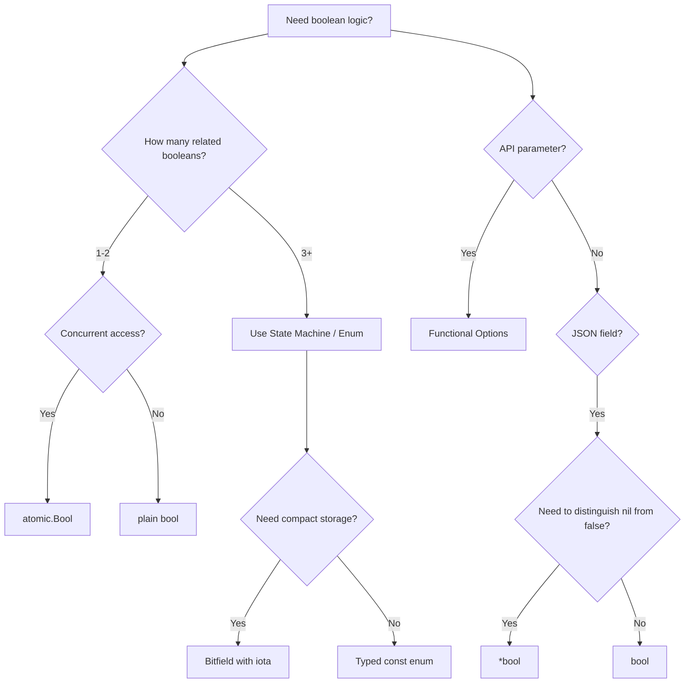
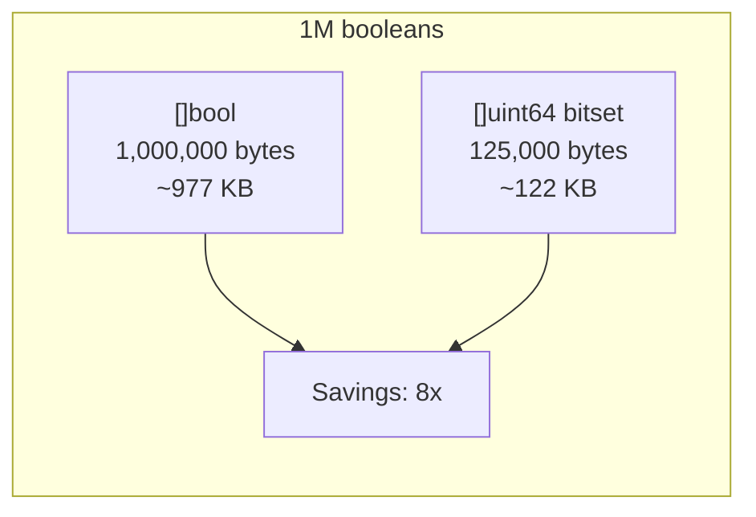
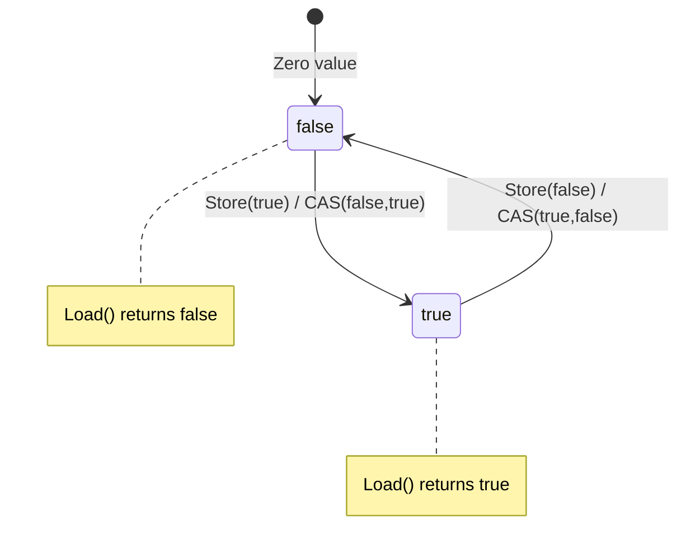
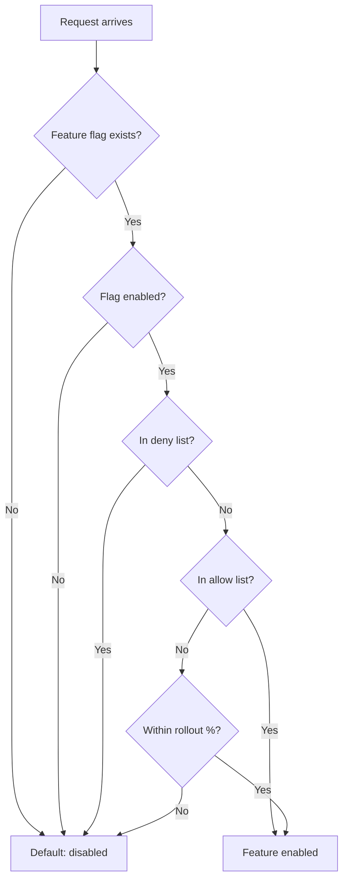

# Boolean — Senior Level

## Table of Contents

1. [Introduction](#introduction)
2. [Core Concepts](#core-concepts)
3. [Pros & Cons](#pros--cons)
4. [Use Cases](#use-cases)
5. [Code Examples](#code-examples)
6. [Coding Patterns](#coding-patterns)
7. [Clean Code](#clean-code)
8. [Best Practices](#best-practices)
9. [Product Use / Feature](#product-use--feature)
10. [Error Handling](#error-handling)
11. [Security](#security)
12. [Performance Optimization](#performance-optimization)
13. [Metrics](#metrics)
14. [Debugging](#debugging)
15. [Edge Cases](#edge-cases)
16. [Postmortems](#postmortems)
17. [Common Mistakes](#common-mistakes)
18. [Tricky Points](#tricky-points)
19. [Comparison with Other Languages](#comparison-with-other-languages)
20. [Test](#test)
21. [Tricky Questions](#tricky-questions)
22. [Cheat Sheet](#cheat-sheet)
23. [Summary](#summary)
24. [What You Can Build](#what-you-can-build)
25. [Further Reading](#further-reading)
26. [Related Topics](#related-topics)
27. [Diagrams & Visual Aids](#diagrams--visual-aids)

---

## Introduction

> Focus: "How to optimize?" and "How to architect?"

At the senior level, booleans are not just `true` or `false` — they are architectural decisions. Every boolean field in a struct, every boolean parameter in an API, and every boolean flag in a system has implications for maintainability, performance, concurrency safety, and extensibility.

Senior engineers must understand:
- When booleans create accidental complexity through combinatorial state explosion
- How to design boolean-based systems that scale (feature flags, circuit breakers, health checks)
- Memory layout implications of boolean fields in high-throughput systems
- Concurrency guarantees of `atomic.Bool` vs mutex-protected booleans
- Bitset patterns for compact boolean storage in performance-critical paths
- Boolean algebra optimization for complex predicate evaluation

This section covers advanced patterns, real production scenarios, and performance benchmarks.

---

## Core Concepts

### Concept 1: Boolean Algebra in Code

De Morgan's laws and boolean algebra are essential for simplifying complex conditions.

```go
package main

import "fmt"

func main() {
    a, b := true, false

    // De Morgan's Laws
    // !(a && b) == !a || !b
    fmt.Println(!(a && b) == (!a || !b)) // true

    // !(a || b) == !a && !b
    fmt.Println(!(a || b) == (!a && !b)) // true

    // Absorption law
    // a || (a && b) == a
    fmt.Println((a || (a && b)) == a) // true

    // a && (a || b) == a
    fmt.Println((a && (a || b)) == a) // true

    // Practical application: simplify complex conditions
    // Before: !(user.IsActive && !user.IsBanned)
    // After (De Morgan): !user.IsActive || user.IsBanned
}
```

### Concept 2: State Machine vs Boolean Flags

```go
package main

import (
    "fmt"
    "sync"
)

// Anti-pattern: boolean flags create 2^n states (many invalid)
type BadConnection struct {
    isConnecting   bool
    isConnected    bool
    isAuthenticated bool
    isClosing      bool
}

// Senior pattern: explicit state machine with transitions
type ConnState int

const (
    StateIdle ConnState = iota
    StateConnecting
    StateConnected
    StateAuthenticated
    StateClosing
    StateClosed
)

func (s ConnState) String() string {
    names := [...]string{"Idle", "Connecting", "Connected", "Authenticated", "Closing", "Closed"}
    if int(s) < len(names) {
        return names[s]
    }
    return "Unknown"
}

type Connection struct {
    mu    sync.RWMutex
    state ConnState
}

// Transition validates state changes
func (c *Connection) Transition(to ConnState) error {
    c.mu.Lock()
    defer c.mu.Unlock()

    valid := map[ConnState][]ConnState{
        StateIdle:          {StateConnecting},
        StateConnecting:    {StateConnected, StateClosed},
        StateConnected:     {StateAuthenticated, StateClosing},
        StateAuthenticated: {StateClosing},
        StateClosing:       {StateClosed},
    }

    allowed, exists := valid[c.state]
    if !exists {
        return fmt.Errorf("no transitions from %s", c.state)
    }

    for _, s := range allowed {
        if s == to {
            c.state = to
            return nil
        }
    }

    return fmt.Errorf("invalid transition: %s -> %s", c.state, to)
}

func (c *Connection) State() ConnState {
    c.mu.RLock()
    defer c.mu.RUnlock()
    return c.state
}

func main() {
    conn := &Connection{state: StateIdle}

    transitions := []ConnState{
        StateConnecting,
        StateConnected,
        StateAuthenticated,
        StateClosing,
        StateClosed,
    }

    for _, next := range transitions {
        err := conn.Transition(next)
        if err != nil {
            fmt.Printf("Error: %v\n", err)
        } else {
            fmt.Printf("Transitioned to: %s\n", conn.State())
        }
    }

    // Invalid transition
    err := conn.Transition(StateConnecting)
    fmt.Printf("Invalid: %v\n", err)
}
```

### Concept 3: Bitfield Permissions System

```go
package main

import (
    "fmt"
    "strings"
)

type Permission uint64

const (
    PermRead       Permission = 1 << iota // 1
    PermWrite                              // 2
    PermDelete                             // 4
    PermCreate                             // 8
    PermAdmin                              // 16
    PermAudit                              // 32
    PermExport                             // 64
    PermImport                             // 128

    // Composite permissions
    PermReadWrite = PermRead | PermWrite
    PermEditor    = PermRead | PermWrite | PermCreate | PermDelete
    PermSuper     = PermEditor | PermAdmin | PermAudit | PermExport | PermImport
)

func (p Permission) Has(flag Permission) bool     { return p&flag == flag }
func (p Permission) HasAny(flag Permission) bool   { return p&flag != 0 }
func (p *Permission) Grant(flag Permission)        { *p |= flag }
func (p *Permission) Revoke(flag Permission)       { *p &^= flag }
func (p *Permission) Toggle(flag Permission)       { *p ^= flag }

func (p Permission) String() string {
    if p == 0 {
        return "none"
    }
    var parts []string
    flags := []struct {
        perm Permission
        name string
    }{
        {PermRead, "read"}, {PermWrite, "write"}, {PermDelete, "delete"},
        {PermCreate, "create"}, {PermAdmin, "admin"}, {PermAudit, "audit"},
        {PermExport, "export"}, {PermImport, "import"},
    }
    for _, f := range flags {
        if p.Has(f.perm) {
            parts = append(parts, f.name)
        }
    }
    return strings.Join(parts, "|")
}

func main() {
    var userPerm Permission

    userPerm.Grant(PermRead)
    userPerm.Grant(PermWrite)
    fmt.Println("User:", userPerm)                         // read|write
    fmt.Println("Has read:", userPerm.Has(PermRead))       // true
    fmt.Println("Has admin:", userPerm.Has(PermAdmin))     // false

    // Check composite
    fmt.Println("Has R+W:", userPerm.Has(PermReadWrite))   // true
    fmt.Println("Has any editor:", userPerm.HasAny(PermEditor)) // true

    userPerm.Revoke(PermWrite)
    fmt.Println("After revoke:", userPerm) // read

    // Super admin
    admin := PermSuper
    fmt.Println("Admin:", admin) // read|write|delete|create|admin|audit|export|import
    fmt.Printf("Stored in %d bits (uint64)\n", 64)
}
```

### Concept 4: Predicate Composition

```go
package main

import "fmt"

type Predicate[T any] func(T) bool

func And[T any](predicates ...Predicate[T]) Predicate[T] {
    return func(v T) bool {
        for _, p := range predicates {
            if !p(v) {
                return false
            }
        }
        return true
    }
}

func Or[T any](predicates ...Predicate[T]) Predicate[T] {
    return func(v T) bool {
        for _, p := range predicates {
            if p(v) {
                return true
            }
        }
        return false
    }
}

func Not[T any](p Predicate[T]) Predicate[T] {
    return func(v T) bool { return !p(v) }
}

type User struct {
    Name     string
    Age      int
    IsActive bool
    Role     string
}

func main() {
    users := []User{
        {"Alice", 30, true, "admin"},
        {"Bob", 17, true, "user"},
        {"Charlie", 25, false, "admin"},
        {"Diana", 22, true, "user"},
        {"Eve", 45, true, "admin"},
    }

    isAdult := Predicate[User](func(u User) bool { return u.Age >= 18 })
    isActive := Predicate[User](func(u User) bool { return u.IsActive })
    isAdmin := Predicate[User](func(u User) bool { return u.Role == "admin" })

    // Compose: active adult admins
    canManage := And(isAdult, isActive, isAdmin)

    // Compose: inactive or underage
    isRestricted := Or(Not(isActive), Not(isAdult))

    fmt.Println("Can manage:")
    for _, u := range users {
        if canManage(u) {
            fmt.Printf("  %s (age %d)\n", u.Name, u.Age)
        }
    }

    fmt.Println("Restricted:")
    for _, u := range users {
        if isRestricted(u) {
            fmt.Printf("  %s (active=%v, age=%d)\n", u.Name, u.IsActive, u.Age)
        }
    }
}
```

---

## Pros & Cons

| Pros | Cons |
|------|------|
| Atomic operations available (`atomic.Bool`) | Boolean flags pollute API signatures |
| Bitfields compress many booleans into single int | Combinatorial explosion with multiple flags |
| Short-circuit evaluation is deterministic | Cannot represent partial/uncertain states |
| Zero value `false` is safe default for most cases | `omitempty` in JSON drops explicit `false` |
| Predicate composition enables clean architectures | Boolean blindness at call sites |
| Compiler optimizes boolean expressions well | Booleans in interfaces reduce testability |

---

## Use Cases

1. **Feature flag infrastructure**: Production boolean management with rollout percentages, A/B testing, and kill switches
2. **Circuit breaker with half-open state**: Atomic boolean controlling traffic flow with recovery probing
3. **Distributed locking**: Boolean state coordinated across nodes via consensus
4. **Health check aggregation**: Multiple subsystem booleans aggregated into overall readiness
5. **Rate limiter decisions**: Boolean allow/deny with sliding window or token bucket
6. **Cache invalidation signals**: Boolean markers for stale cache entries
7. **Canary deployment gates**: Boolean checks that validate canary health before promotion
8. **Chaos engineering toggles**: Runtime booleans that inject failures for testing

---

## Code Examples

### Example 1: Production Feature Flag Service

```go
package main

import (
    "encoding/json"
    "fmt"
    "hash/fnv"
    "sync"
    "time"
)

type FlagRule struct {
    Enabled    bool    `json:"enabled"`
    Percentage float64 `json:"percentage"` // 0.0 - 1.0
    AllowList  []string `json:"allow_list"`
    DenyList   []string `json:"deny_list"`
}

type FeatureFlagService struct {
    mu    sync.RWMutex
    flags map[string]*FlagRule
}

func NewFeatureFlagService() *FeatureFlagService {
    return &FeatureFlagService{
        flags: make(map[string]*FlagRule),
    }
}

func (s *FeatureFlagService) LoadFlags(data []byte) error {
    var flags map[string]*FlagRule
    if err := json.Unmarshal(data, &flags); err != nil {
        return err
    }
    s.mu.Lock()
    s.flags = flags
    s.mu.Unlock()
    return nil
}

func (s *FeatureFlagService) IsEnabled(feature, userID string) bool {
    s.mu.RLock()
    rule, exists := s.flags[feature]
    s.mu.RUnlock()

    if !exists || !rule.Enabled {
        return false
    }

    // Check deny list first (fail closed)
    for _, denied := range rule.DenyList {
        if denied == userID {
            return false
        }
    }

    // Check allow list
    for _, allowed := range rule.AllowList {
        if allowed == userID {
            return true
        }
    }

    // Percentage-based rollout using consistent hashing
    if rule.Percentage < 1.0 {
        h := fnv.New32a()
        h.Write([]byte(feature + ":" + userID))
        bucket := float64(h.Sum32()) / float64(1<<32)
        return bucket < rule.Percentage
    }

    return true
}

func main() {
    svc := NewFeatureFlagService()

    flagData := `{
        "new_dashboard": {"enabled": true, "percentage": 0.5, "allow_list": ["admin1"]},
        "dark_mode": {"enabled": true, "percentage": 1.0},
        "beta_api": {"enabled": false}
    }`

    if err := svc.LoadFlags([]byte(flagData)); err != nil {
        panic(err)
    }

    users := []string{"user1", "user2", "user3", "admin1", "user4"}
    for _, u := range users {
        fmt.Printf("%-10s new_dashboard=%v dark_mode=%v beta_api=%v\n",
            u,
            svc.IsEnabled("new_dashboard", u),
            svc.IsEnabled("dark_mode", u),
            svc.IsEnabled("beta_api", u))
    }

    _ = time.Now() // suppress unused import
}
```

### Example 2: Health Check Aggregator

```go
package main

import (
    "encoding/json"
    "fmt"
    "sync"
    "time"
)

type HealthStatus struct {
    Healthy   bool      `json:"healthy"`
    Message   string    `json:"message,omitempty"`
    CheckedAt time.Time `json:"checked_at"`
}

type HealthChecker func() HealthStatus

type HealthAggregator struct {
    mu       sync.RWMutex
    checks   map[string]HealthChecker
    statuses map[string]HealthStatus
}

func NewHealthAggregator() *HealthAggregator {
    return &HealthAggregator{
        checks:   make(map[string]HealthChecker),
        statuses: make(map[string]HealthStatus),
    }
}

func (h *HealthAggregator) Register(name string, checker HealthChecker) {
    h.mu.Lock()
    defer h.mu.Unlock()
    h.checks[name] = checker
}

func (h *HealthAggregator) RunChecks() {
    h.mu.Lock()
    defer h.mu.Unlock()

    var wg sync.WaitGroup
    results := make(map[string]HealthStatus)
    var resultsMu sync.Mutex

    for name, checker := range h.checks {
        wg.Add(1)
        go func(n string, c HealthChecker) {
            defer wg.Done()
            status := c()
            resultsMu.Lock()
            results[n] = status
            resultsMu.Unlock()
        }(name, checker)
    }

    wg.Wait()
    h.statuses = results
}

func (h *HealthAggregator) IsHealthy() bool {
    h.mu.RLock()
    defer h.mu.RUnlock()

    for _, status := range h.statuses {
        if !status.Healthy {
            return false
        }
    }
    return len(h.statuses) > 0 // No checks = not healthy
}

func (h *HealthAggregator) Report() map[string]HealthStatus {
    h.mu.RLock()
    defer h.mu.RUnlock()

    report := make(map[string]HealthStatus, len(h.statuses))
    for k, v := range h.statuses {
        report[k] = v
    }
    return report
}

func main() {
    agg := NewHealthAggregator()

    agg.Register("database", func() HealthStatus {
        return HealthStatus{Healthy: true, Message: "connected", CheckedAt: time.Now()}
    })
    agg.Register("cache", func() HealthStatus {
        return HealthStatus{Healthy: true, Message: "redis OK", CheckedAt: time.Now()}
    })
    agg.Register("disk", func() HealthStatus {
        return HealthStatus{Healthy: false, Message: "90% full", CheckedAt: time.Now()}
    })

    agg.RunChecks()

    fmt.Println("Overall healthy:", agg.IsHealthy())

    report := agg.Report()
    data, _ := json.MarshalIndent(report, "", "  ")
    fmt.Println(string(data))
}
```

### Example 3: Boolean Expression Evaluator

```go
package main

import "fmt"

type Expr interface {
    Eval(vars map[string]bool) bool
    String() string
}

type Var struct{ Name string }
type NotExpr struct{ Inner Expr }
type AndExpr struct{ Left, Right Expr }
type OrExpr struct{ Left, Right Expr }
type Literal struct{ Value bool }

func (v Var) Eval(vars map[string]bool) bool    { return vars[v.Name] }
func (v Var) String() string                     { return v.Name }

func (n NotExpr) Eval(vars map[string]bool) bool { return !n.Inner.Eval(vars) }
func (n NotExpr) String() string                  { return fmt.Sprintf("NOT(%s)", n.Inner) }

func (a AndExpr) Eval(vars map[string]bool) bool {
    return a.Left.Eval(vars) && a.Right.Eval(vars)
}
func (a AndExpr) String() string { return fmt.Sprintf("(%s AND %s)", a.Left, a.Right) }

func (o OrExpr) Eval(vars map[string]bool) bool {
    return o.Left.Eval(vars) || o.Right.Eval(vars)
}
func (o OrExpr) String() string { return fmt.Sprintf("(%s OR %s)", o.Left, o.Right) }

func (l Literal) Eval(_ map[string]bool) bool { return l.Value }
func (l Literal) String() string              { return fmt.Sprintf("%v", l.Value) }

func main() {
    // Expression: (isAdmin OR (isActive AND hasVerified))
    expr := OrExpr{
        Left: Var{Name: "isAdmin"},
        Right: AndExpr{
            Left:  Var{Name: "isActive"},
            Right: Var{Name: "hasVerified"},
        },
    }

    testCases := []map[string]bool{
        {"isAdmin": true, "isActive": false, "hasVerified": false},
        {"isAdmin": false, "isActive": true, "hasVerified": true},
        {"isAdmin": false, "isActive": true, "hasVerified": false},
        {"isAdmin": false, "isActive": false, "hasVerified": false},
    }

    fmt.Println("Expression:", expr)
    fmt.Println()
    for i, vars := range testCases {
        fmt.Printf("Case %d: %v => %v\n", i+1, vars, expr.Eval(vars))
    }
}
```

### Example 4: Benchmark-Ready Bitset

```go
package main

import (
    "fmt"
    "unsafe"
)

// Bitset stores booleans as individual bits
type Bitset struct {
    data []uint64
    size int
}

func NewBitset(size int) *Bitset {
    words := (size + 63) / 64
    return &Bitset{
        data: make([]uint64, words),
        size: size,
    }
}

func (b *Bitset) Set(i int) {
    if i < 0 || i >= b.size {
        return
    }
    b.data[i/64] |= 1 << (uint(i) % 64)
}

func (b *Bitset) Clear(i int) {
    if i < 0 || i >= b.size {
        return
    }
    b.data[i/64] &^= 1 << (uint(i) % 64)
}

func (b *Bitset) Get(i int) bool {
    if i < 0 || i >= b.size {
        return false
    }
    return b.data[i/64]&(1<<(uint(i)%64)) != 0
}

func (b *Bitset) Toggle(i int) {
    if i < 0 || i >= b.size {
        return
    }
    b.data[i/64] ^= 1 << (uint(i) % 64)
}

func (b *Bitset) Count() int {
    count := 0
    for _, word := range b.data {
        count += popcount(word)
    }
    return count
}

func popcount(x uint64) int {
    // Brian Kernighan's algorithm
    count := 0
    for x != 0 {
        x &= x - 1
        count++
    }
    return count
}

func (b *Bitset) MemoryBytes() int {
    return len(b.data) * int(unsafe.Sizeof(uint64(0)))
}

func main() {
    const n = 1000000

    bs := NewBitset(n)

    // Set every even index
    for i := 0; i < n; i += 2 {
        bs.Set(i)
    }

    fmt.Printf("Bitset size: %d bits\n", n)
    fmt.Printf("Memory used: %d bytes (%.2f KB)\n", bs.MemoryBytes(), float64(bs.MemoryBytes())/1024)
    fmt.Printf("Equivalent []bool: %d bytes (%.2f KB)\n", n, float64(n)/1024)
    fmt.Printf("Compression ratio: %.1fx\n", float64(n)/float64(bs.MemoryBytes()))
    fmt.Printf("Set bits: %d\n", bs.Count())
    fmt.Printf("Get(0): %v, Get(1): %v, Get(2): %v\n", bs.Get(0), bs.Get(1), bs.Get(2))
}
```

---

## Coding Patterns

### Pattern 1: Compare-And-Swap Guard

```go
// Ensure only one goroutine executes initialization
var initialized atomic.Bool

func initOnce() {
    if initialized.CompareAndSwap(false, true) {
        // Only one goroutine reaches here
        performInit()
    }
}
```

### Pattern 2: Boolean Predicate Chain

```go
type Rule func(request *Request) bool

func NewRuleChain(rules ...Rule) Rule {
    return func(r *Request) bool {
        for _, rule := range rules {
            if !rule(r) {
                return false
            }
        }
        return true
    }
}

// Usage
canProcess := NewRuleChain(
    isAuthenticated,
    hasPermission,
    isNotRateLimited,
    isNotBlacklisted,
)
```

### Pattern 3: Functional Option with Boolean

```go
type Option func(*config)

func WithVerbose() Option {
    return func(c *config) { c.verbose = true }
}

// Call site is self-documenting
srv := NewServer(":8080", WithVerbose())
```

### Pattern 4: Context Boolean

```go
type contextKey struct{}

func WithDebug(ctx context.Context) context.Context {
    return context.WithValue(ctx, contextKey{}, true)
}

func IsDebug(ctx context.Context) bool {
    v, ok := ctx.Value(contextKey{}).(bool)
    return ok && v
}
```

---

## Clean Code

### Boolean Naming Convention Table

| Category | Good Name | Bad Name |
|----------|-----------|----------|
| State | `isActive`, `isRunning` | `active`, `state` |
| Capability | `canRetry`, `canDelete` | `retry`, `delete` |
| Ownership | `hasPermission`, `hasChildren` | `permission`, `children` |
| Temporal | `wasProcessed`, `willExpire` | `processed`, `expire` |
| Imperative | `shouldLog`, `shouldRetry` | `log`, `retry` |
| Negative | `isDisabled` (avoid) | `isNotEnabled` (worse) |

### Eliminate Boolean Arguments

```go
// Level 1: Separate functions
func ReadFile(path string) ([]byte, error)          // non-recursive
func ReadFileRecursive(path string) ([]byte, error)  // recursive

// Level 2: Type-safe enum
type SearchMode int
const (
    SearchExact SearchMode = iota
    SearchFuzzy
)
func Search(query string, mode SearchMode) []Result

// Level 3: Functional options
func Query(sql string, opts ...QueryOption) (*Rows, error)
func WithReadOnly() QueryOption
func WithTimeout(d time.Duration) QueryOption
```

---

## Best Practices

1. **Use state machines over boolean combinations** — 3+ related booleans almost always indicate a state machine
2. **Prefer `sync.Once` over atomic bool for init** — `sync.Once` handles panics correctly
3. **Use bitfields for permission systems** — compact, fast, and composable
4. **Compose predicates functionally** — use `And`, `Or`, `Not` combinator functions
5. **Benchmark boolean vs bitset** — for large boolean arrays, bitsets save 8x memory
6. **Put boolean fields last in structs** — reduces padding overhead
7. **Use context values for cross-cutting boolean flags** — debug mode, dry-run mode
8. **Document boolean semantics in godoc** — especially for return values and struct fields
9. **Test both branches** — every boolean should have tests for `true` and `false` paths
10. **Monitor boolean metrics** — success rates, feature flag adoption, error rates

---

## Product Use / Feature

### Production Feature Gate Architecture

```go
package main

import (
    "context"
    "fmt"
    "sync"
    "time"
)

type GateDecision struct {
    Allowed   bool
    Reason    string
    EvalTime  time.Duration
}

type Gate interface {
    Evaluate(ctx context.Context, entityID string) GateDecision
}

type PercentageGate struct {
    name       string
    percentage int // 0-100
}

func (g *PercentageGate) Evaluate(_ context.Context, entityID string) GateDecision {
    start := time.Now()
    hash := fnvHash(entityID)
    allowed := (hash % 100) < uint32(g.percentage)
    return GateDecision{
        Allowed:  allowed,
        Reason:   fmt.Sprintf("percentage gate %d%%", g.percentage),
        EvalTime: time.Since(start),
    }
}

type CompositeGate struct {
    gates []Gate
    mode  string // "all" or "any"
}

func (g *CompositeGate) Evaluate(ctx context.Context, entityID string) GateDecision {
    start := time.Now()
    for _, gate := range g.gates {
        decision := gate.Evaluate(ctx, entityID)
        if g.mode == "all" && !decision.Allowed {
            return GateDecision{Allowed: false, Reason: decision.Reason, EvalTime: time.Since(start)}
        }
        if g.mode == "any" && decision.Allowed {
            return GateDecision{Allowed: true, Reason: decision.Reason, EvalTime: time.Since(start)}
        }
    }
    allowed := g.mode == "all"
    return GateDecision{Allowed: allowed, Reason: "composite", EvalTime: time.Since(start)}
}

func fnvHash(s string) uint32 {
    h := uint32(2166136261)
    for i := 0; i < len(s); i++ {
        h ^= uint32(s[i])
        h *= 16777619
    }
    return h
}

func main() {
    gate := &CompositeGate{
        gates: []Gate{
            &PercentageGate{name: "rollout", percentage: 50},
        },
        mode: "all",
    }

    var mu sync.Mutex
    allowed, denied := 0, 0

    for i := 0; i < 1000; i++ {
        d := gate.Evaluate(context.Background(), fmt.Sprintf("user_%d", i))
        mu.Lock()
        if d.Allowed {
            allowed++
        } else {
            denied++
        }
        mu.Unlock()
    }

    fmt.Printf("Allowed: %d, Denied: %d (%.1f%%)\n", allowed, denied, float64(allowed)/10)
}
```

---

## Error Handling

### Boolean Error Wrapping Pattern

```go
package main

import (
    "errors"
    "fmt"
)

type PermissionError struct {
    UserID   string
    Action   string
    Resource string
}

func (e *PermissionError) Error() string {
    return fmt.Sprintf("user %s cannot %s on %s", e.UserID, e.Action, e.Resource)
}

func IsPermissionError(err error) bool {
    var pe *PermissionError
    return errors.As(err, &pe)
}

func IsRetryable(err error) bool {
    // Network errors and timeouts are retryable
    var netErr interface{ Temporary() bool }
    if errors.As(err, &netErr) {
        return netErr.Temporary()
    }
    return false
}

func processWithRetry(fn func() error, maxRetries int) error {
    var lastErr error
    for attempt := 0; attempt <= maxRetries; attempt++ {
        lastErr = fn()
        if lastErr == nil {
            return nil
        }
        if !IsRetryable(lastErr) {
            return lastErr // Non-retryable: fail immediately
        }
        fmt.Printf("Attempt %d failed (retryable): %v\n", attempt+1, lastErr)
    }
    return fmt.Errorf("exhausted %d retries: %w", maxRetries, lastErr)
}

func main() {
    err := &PermissionError{UserID: "user1", Action: "delete", Resource: "file.txt"}
    fmt.Println("Is permission error:", IsPermissionError(err))
    fmt.Println("Is retryable:", IsRetryable(err))
}
```

---

## Security

### Constant-Time Boolean Operations

```go
package main

import (
    "crypto/subtle"
    "fmt"
)

// ConstantTimeBoolEqual compares two booleans in constant time
func ConstantTimeBoolEqual(a, b bool) bool {
    var x, y int
    if a { x = 1 }
    if b { y = 1 }
    return subtle.ConstantTimeEq(int32(x), int32(y)) == 1
}

// SecureCompare prevents timing attacks
func SecureCompare(provided, expected []byte) bool {
    return subtle.ConstantTimeCompare(provided, expected) == 1
}

// Safe permission check with audit logging
func CheckPermission(userID, resource, action string) (bool, error) {
    // Always evaluate all checks to prevent timing leaks
    isAuthenticated := validateToken(userID)
    hasRole := checkRole(userID, action)
    hasResource := checkResourceAccess(userID, resource)

    // Combine with bitwise AND to avoid short-circuit
    result := isAuthenticated & hasRole & hasResource
    return result == 1, nil
}

func validateToken(userID string) int    { if userID != "" { return 1 }; return 0 }
func checkRole(userID, action string) int { return 1 }
func checkResourceAccess(userID, resource string) int { return 1 }

func main() {
    fmt.Println(ConstantTimeBoolEqual(true, true))   // true
    fmt.Println(ConstantTimeBoolEqual(true, false))  // false

    ok, _ := CheckPermission("user1", "file.txt", "read")
    fmt.Println("Permission:", ok)
}
```

---

## Performance Optimization

### Benchmark: Bool Array vs Bitset

```go
package main

import (
    "fmt"
    "time"
    "unsafe"
)

func benchmarkBoolSlice(n int) time.Duration {
    flags := make([]bool, n)
    start := time.Now()
    for i := 0; i < n; i++ {
        flags[i] = i%2 == 0
    }
    count := 0
    for _, f := range flags {
        if f {
            count++
        }
    }
    elapsed := time.Since(start)
    _ = count
    return elapsed
}

func benchmarkBitset(n int) time.Duration {
    words := (n + 63) / 64
    data := make([]uint64, words)
    start := time.Now()
    for i := 0; i < n; i++ {
        if i%2 == 0 {
            data[i/64] |= 1 << (uint(i) % 64)
        }
    }
    count := 0
    for _, word := range data {
        for word != 0 {
            word &= word - 1
            count++
        }
    }
    elapsed := time.Since(start)
    _ = count
    return elapsed
}

func main() {
    sizes := []int{1_000, 10_000, 100_000, 1_000_000}

    fmt.Printf("%-12s %-15s %-15s %-12s %-12s\n",
        "Size", "[]bool time", "bitset time", "[]bool mem", "bitset mem")
    fmt.Println("-----------------------------------------------------------------------")

    for _, n := range sizes {
        boolTime := benchmarkBoolSlice(n)
        bitTime := benchmarkBitset(n)

        boolMem := n * int(unsafe.Sizeof(false))
        bitMem := ((n + 63) / 64) * int(unsafe.Sizeof(uint64(0)))

        fmt.Printf("%-12d %-15v %-15v %-12d %-12d\n",
            n, boolTime, bitTime, boolMem, bitMem)
    }
}
```

### Struct Alignment Benchmark

```go
package main

import (
    "fmt"
    "unsafe"
)

type Unoptimized struct {
    Flag1 bool
    Value1 int64
    Flag2 bool
    Value2 int64
    Flag3 bool
    Value3 int64
}

type Optimized struct {
    Value1 int64
    Value2 int64
    Value3 int64
    Flag1 bool
    Flag2 bool
    Flag3 bool
}

func main() {
    fmt.Printf("Unoptimized size: %d bytes\n", unsafe.Sizeof(Unoptimized{}))
    fmt.Printf("Optimized size:   %d bytes\n", unsafe.Sizeof(Optimized{}))
    fmt.Printf("Savings:          %d bytes per struct\n",
        unsafe.Sizeof(Unoptimized{}) - unsafe.Sizeof(Optimized{}))

    // At 1 million structs:
    const count = 1_000_000
    unoptTotal := count * unsafe.Sizeof(Unoptimized{})
    optTotal := count * unsafe.Sizeof(Optimized{})
    fmt.Printf("\nAt %d structs:\n", count)
    fmt.Printf("Unoptimized: %.2f MB\n", float64(unoptTotal)/(1024*1024))
    fmt.Printf("Optimized:   %.2f MB\n", float64(optTotal)/(1024*1024))
    fmt.Printf("Savings:     %.2f MB\n", float64(unoptTotal-optTotal)/(1024*1024))
}
```

---

## Metrics

```go
package main

import (
    "fmt"
    "sync/atomic"
    "time"
)

type BooleanMetrics struct {
    trueCount    atomic.Int64
    falseCount   atomic.Int64
    evalDuration atomic.Int64 // nanoseconds total
    evalCount    atomic.Int64
}

func (m *BooleanMetrics) RecordEval(result bool, duration time.Duration) {
    if result {
        m.trueCount.Add(1)
    } else {
        m.falseCount.Add(1)
    }
    m.evalDuration.Add(int64(duration))
    m.evalCount.Add(1)
}

func (m *BooleanMetrics) Stats() map[string]interface{} {
    total := m.trueCount.Load() + m.falseCount.Load()
    avgNs := int64(0)
    if m.evalCount.Load() > 0 {
        avgNs = m.evalDuration.Load() / m.evalCount.Load()
    }
    trueRate := float64(0)
    if total > 0 {
        trueRate = float64(m.trueCount.Load()) / float64(total) * 100
    }

    return map[string]interface{}{
        "true_count":   m.trueCount.Load(),
        "false_count":  m.falseCount.Load(),
        "true_rate":    fmt.Sprintf("%.2f%%", trueRate),
        "avg_eval_ns":  avgNs,
        "total_evals":  total,
    }
}

func main() {
    metrics := &BooleanMetrics{}

    for i := 0; i < 10000; i++ {
        start := time.Now()
        result := i%3 != 0
        metrics.RecordEval(result, time.Since(start))
    }

    stats := metrics.Stats()
    for k, v := range stats {
        fmt.Printf("%-15s %v\n", k, v)
    }
}
```

---

## Debugging

### Race Detector for Boolean Access

```go
// Run with: go run -race main.go
package main

import (
    "fmt"
    "sync"
)

func main() {
    // This will be caught by the race detector
    var ready bool // BAD: unprotected shared boolean
    var wg sync.WaitGroup

    wg.Add(1)
    go func() {
        defer wg.Done()
        ready = true // Write
    }()

    _ = ready // Read — DATA RACE
    wg.Wait()

    fmt.Println("Use -race flag to detect this")
}
```

### Debugging Boolean Expression Evaluation Order

```go
func debugEval(name string, fn func() bool) bool {
    result := fn()
    fmt.Printf("[DEBUG] %s => %v\n", name, result)
    return result
}

// Usage in complex conditions:
if debugEval("isAdmin", func() bool { return user.Role == "admin" }) ||
   debugEval("isOwner", func() bool { return doc.OwnerID == user.ID }) {
    // process
}
```

---

## Edge Cases

### Edge Case 1: Nil Map Boolean Access

```go
var m map[string]bool // nil map
v := m["key"]         // Returns false (zero value) — no panic
// m["key"] = true    // PANIC: assignment to nil map
```

### Edge Case 2: Boolean in reflect

```go
import "reflect"

v := reflect.ValueOf(true)
fmt.Println(v.Kind())  // bool
fmt.Println(v.Bool())  // true
fmt.Println(v.IsZero()) // false (true is not zero)

v2 := reflect.ValueOf(false)
fmt.Println(v2.IsZero()) // true (false IS the zero value)
```

### Edge Case 3: Boolean JSON edge cases

```go
// JSON null -> *bool nil
// JSON true -> *bool &true
// JSON false -> *bool &false
// JSON "true" -> ERROR (string, not boolean)
// JSON 1 -> ERROR (number, not boolean)
// JSON 0 -> ERROR (number, not boolean)
```

### Edge Case 4: Atomic Bool Copy

```go
// atomic.Bool must NOT be copied after first use
var a atomic.Bool
a.Store(true)
// b := a // BUG: copies the atomic — go vet will catch this
```

---

## Postmortems

### Postmortem 1: Feature Flag Race Condition

**What happened:** A feature flag service used a plain `map[string]bool` protected by `sync.RWMutex`. During a hot reload, a goroutine read the old map reference while another replaced it, causing inconsistent flag evaluation.

**Root cause:** The map reference was updated non-atomically. Some goroutines saw the old map, others saw the new one, during the brief replacement window.

**Fix:** Used `atomic.Value` to store the entire map, ensuring atomic swaps.

```go
type SafeFlags struct {
    flags atomic.Value // stores map[string]bool
}

func (sf *SafeFlags) Load() map[string]bool {
    return sf.flags.Load().(map[string]bool)
}

func (sf *SafeFlags) Replace(newFlags map[string]bool) {
    sf.flags.Store(newFlags) // Atomic swap
}
```

### Postmortem 2: JSON omitempty Data Loss

**What happened:** A user preferences API used `bool` with `omitempty`. When a user explicitly set `email_notifications` to `false`, the field was omitted from the JSON response. The frontend interpreted the missing field as "not set" and defaulted to `true`.

**Root cause:** `omitempty` treats `false` as the zero value and omits it.

**Fix:** Changed the field type to `*bool`:

```go
// Before
type Prefs struct {
    EmailNotify bool `json:"email_notify,omitempty"` // BUG
}

// After
type Prefs struct {
    EmailNotify *bool `json:"email_notify,omitempty"` // Fixed
}
```

### Postmortem 3: Boolean Flag Explosion

**What happened:** An order processing system used 7 boolean fields to track order state. Over time, invalid combinations emerged (e.g., `IsShipped=true` and `IsCancelled=true`), causing downstream payment processing errors.

**Root cause:** No validation of state transitions. 2^7 = 128 possible states, most of which were invalid.

**Fix:** Replaced boolean flags with a state machine enum with validated transitions.

---

## Common Mistakes

| Mistake | Impact | Fix |
|---------|--------|-----|
| Plain bool for concurrent access | Data race, undefined behavior | `atomic.Bool` or mutex |
| `omitempty` on bool field | Cannot distinguish unset from false | Use `*bool` |
| Multiple bool parameters | Unreadable call sites | Options pattern |
| Boolean flags for state machine | Invalid state combinations | Typed enum with transitions |
| Ignoring short-circuit order | Performance degradation | Cheap/likely checks first |
| Polling atomic bool in tight loop | CPU waste | Channels or `sync.Cond` |
| `sync.Once` replaced with atomic CAS | Panic not handled properly | Use `sync.Once` |

---

## Tricky Points

### Point 1: atomic.Bool vs sync.Once

```go
// atomic.Bool CAS does NOT handle panic recovery
var started atomic.Bool
func startUnsafe() {
    if started.CompareAndSwap(false, true) {
        init() // If this panics, started remains true — stuck forever
    }
}

// sync.Once handles panic correctly
var once sync.Once
func startSafe() {
    once.Do(func() {
        init() // If this panics, next call retries
    })
}
```

### Point 2: Boolean Interface Methods

```go
type Validator interface {
    IsValid() bool
}

// A nil pointer of a type that implements Validator
// still satisfies the interface — but calling IsValid panics
var v Validator = (*MyStruct)(nil)
// v.IsValid() // PANIC
```

### Point 3: Custom Bool Type Gotcha

```go
type Flag bool

const On Flag = true
const Off Flag = false

// Flag and bool are NOT interchangeable
var f Flag = true   // OK: untyped constant
// var f Flag = b    // ERROR if b is typed bool
var b bool = true
var f2 Flag = Flag(b) // OK: explicit conversion
```

---

## Comparison with Other Languages

| Aspect | Go | Rust | Java | C++ |
|--------|-----|------|------|-----|
| Atomic bool | `atomic.Bool` | `AtomicBool` | `AtomicBoolean` | `std::atomic<bool>` |
| Nullable bool | `*bool` | `Option<bool>` | `Boolean` (wrapper) | `std::optional<bool>` |
| Bitfield | Manual with iota | Bitflags crate | EnumSet | `std::bitset` |
| Bool size | 1 byte | 1 byte | 1 byte | 1 byte |
| Truthiness | None | None | None | Yes (int to bool) |
| Bool array | `[]bool` (1 byte/elem) | `BitVec` | `BitSet` | `vector<bool>` (1 bit) |
| CAS | `CompareAndSwap` | `compare_exchange` | `compareAndSet` | `compare_exchange_strong` |

---

## Test

<details>
<summary>Question 1: Why is sync.Once preferred over atomic.Bool CAS for initialization?</summary>

**Answer:** `sync.Once` handles panics correctly. If the init function panics, `sync.Once` allows the next caller to retry. With `atomic.Bool` CAS, if the function panics after the boolean is set to true, the system is stuck — no goroutine can re-attempt initialization.
</details>

<details>
<summary>Question 2: How much memory does a []bool with 1 million elements use vs a bitset?</summary>

**Answer:** `[]bool` uses 1 byte per element = 1,000,000 bytes (~977 KB). A bitset uses 1 bit per element = 125,000 bytes (~122 KB). The bitset is 8x more memory efficient.
</details>

<details>
<summary>Question 3: What are the three states of *bool and when would you use it?</summary>

**Answer:** `*bool` can be `nil` (not set), `&true` (explicitly true), or `&false` (explicitly false). Use it in JSON APIs where you need to distinguish between "the client did not send this field" and "the client explicitly set it to false." This is essential for PATCH endpoints.
</details>

<details>
<summary>Question 4: How do you prevent timing attacks on boolean security checks?</summary>

**Answer:** Use constant-time operations. Replace short-circuit `&&` with bitwise `&` so all checks execute regardless of intermediate results. Use `crypto/subtle.ConstantTimeCompare` for comparing secrets. This prevents attackers from measuring response time to determine which check failed.
</details>

<details>
<summary>Question 5: What is boolean blindness and how do you avoid it?</summary>

**Answer:** Boolean blindness occurs when a function returns `bool` and the caller cannot easily remember what `true` means. For example, `compare(a, b)` returning `true` — is `a > b` or `a < b`? Fix by using named return values, typed enums, or separate functions like `isGreaterThan(a, b)`.
</details>

---

## Tricky Questions

1. **Q: Can `atomic.Bool` be embedded in a struct that is used as a map key?**
   A: No. `atomic.Bool` contains a `noCopy` field making the struct non-comparable. Map keys must be comparable.

2. **Q: What happens if you use `reflect.DeepEqual` on two `atomic.Bool` values?**
   A: It compares the internal state, but this is NOT safe — reading the atomic value via reflection is not atomic and constitutes a data race.

3. **Q: How many boolean operations per nanosecond can a modern CPU perform?**
   A: Billions. Boolean operations (AND, OR, NOT) are single-cycle instructions. The bottleneck is memory access, not boolean evaluation.

4. **Q: Can you use `go:generate` to create boolean helper functions?**
   A: Yes. You can write a generator that produces `boolPtr`, `derefBool`, and similar helpers. However, with generics (Go 1.18+), a generic `Ptr[T any](v T) *T` function is more idiomatic.

5. **Q: Why does `encoding/binary` not have direct bool read/write?**
   A: Because the binary representation of `bool` is platform-dependent. When serializing, explicitly convert to `byte` (0 or 1) for portable binary formats.

---

## Cheat Sheet

| Scenario | Pattern |
|----------|---------|
| Concurrent bool | `atomic.Bool` |
| One-time init | `sync.Once` |
| Optional JSON field | `*bool` with `omitempty` |
| Permission system | Bitfields with `iota` |
| Many booleans | `[]uint64` bitset |
| Predicate composition | Generic `And`/`Or`/`Not` |
| Boolean API param | Functional options |
| State tracking | Enum with transitions |
| Security comparison | `crypto/subtle` constant-time |
| CLI flags | `flag.Bool` |
| Context propagation | `context.WithValue` |
| Boolean metrics | Atomic counters + rate |

---

## Summary

- At the senior level, booleans are architectural choices — not just data types
- Replace boolean flag combinations with state machines for correctness
- Use `atomic.Bool` for concurrency, `sync.Once` for initialization
- Bitfields compress boolean storage by 8x — critical for large-scale systems
- Predicate composition with generics creates clean, testable rule systems
- Constant-time boolean operations prevent timing attacks in security code
- `*bool` is essential for JSON APIs that distinguish "unset" from "false"
- Monitor boolean metrics (success rates, flag adoption) for operational visibility
- Performance: struct field ordering, short-circuit order, and bitset vs bool array all matter at scale

---

## What You Can Build

- **Distributed feature flag service** with consistent hashing and atomic flag updates
- **Permission engine** using bitfield composition with role inheritance
- **Boolean expression evaluator** for dynamic rule engines
- **Health check aggregation system** with weighted boolean signals
- **Circuit breaker library** with atomic state management and half-open probing
- **Rate limiter** with atomic boolean decisions and sliding window metrics

---

## Further Reading

- [Go Memory Model](https://go.dev/ref/mem) — understanding synchronization guarantees
- [sync/atomic package](https://pkg.go.dev/sync/atomic) — atomic operations reference
- [Go Data Race Detector](https://go.dev/doc/articles/race_detector) — detecting boolean races
- [Boolean Blindness (Haskell Wiki)](https://wiki.haskell.org/Boolean_blindness) — why booleans can be harmful
- [Bit Twiddling Hacks](https://graphics.stanford.edu/~seander/bithacks.html) — advanced bitwise operations

---

## Related Topics

- **sync/atomic** — atomic operations for concurrent boolean access
- **State Machines** — replacing boolean combinations with explicit states
- **Bitwise Operations** — compact boolean storage and permission systems
- **Generics** — type-safe predicate composition
- **reflect** — runtime boolean type inspection
- **encoding/json** — serialization edge cases with booleans
- **crypto/subtle** — constant-time comparison for security

---

## Diagrams & Visual Aids

### Boolean Architecture Decision Tree



### Boolean Memory Comparison



### Atomic Bool State Diagram



### Feature Flag Evaluation Flow



### Boolean Postmortem Timeline

```mermaid
gantt
    title Feature Flag Race Condition Timeline
    dateFormat  HH:mm
    axisFormat  %H:%M

    section Incident
    Flag reload triggered     :a1, 14:00, 1m
    Inconsistent reads begin  :crit, a2, 14:00, 5m
    Alerts fire               :a3, 14:03, 1m
    Root cause identified     :a4, 14:10, 5m
    Fix deployed (atomic.Value) :a5, 14:15, 5m
    Monitoring confirms fix   :a6, 14:20, 10m
```


