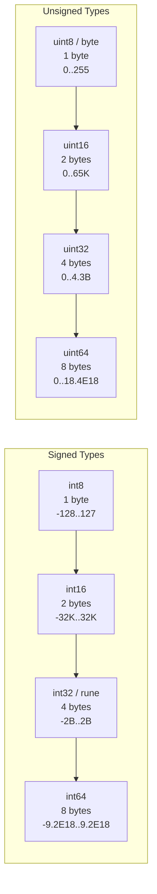
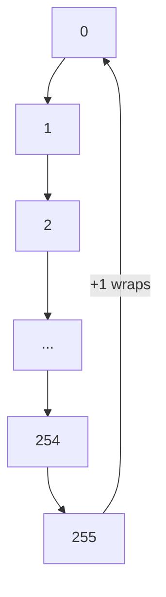
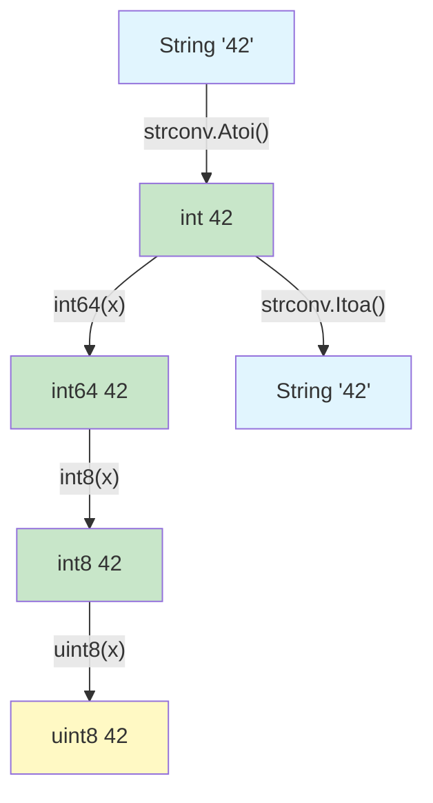
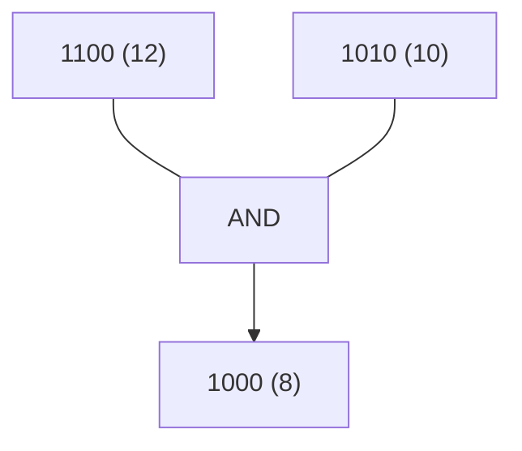

# Integers (Signed & Unsigned) — Junior Level

## Table of Contents

1. [Introduction](#introduction)
2. [Prerequisites](#prerequisites)
3. [Glossary](#glossary)
4. [Core Concepts](#core-concepts)
5. [Real-World Analogies](#real-world-analogies)
6. [Mental Models](#mental-models)
7. [Pros & Cons](#pros--cons)
8. [Use Cases](#use-cases)
9. [Code Examples](#code-examples)
10. [Coding Patterns](#coding-patterns)
11. [Clean Code](#clean-code)
12. [Product Use / Feature](#product-use--feature)
13. [Error Handling](#error-handling)
14. [Security Considerations](#security-considerations)
15. [Performance Tips](#performance-tips)
16. [Metrics & Analytics](#metrics--analytics)
17. [Best Practices](#best-practices)
18. [Edge Cases & Pitfalls](#edge-cases--pitfalls)
19. [Common Mistakes](#common-mistakes)
20. [Common Misconceptions](#common-misconceptions)
21. [Tricky Points](#tricky-points)
22. [Test](#test)
23. [Tricky Questions](#tricky-questions)
24. [Cheat Sheet](#cheat-sheet)
25. [Self-Assessment Checklist](#self-assessment-checklist)
26. [Summary](#summary)
27. [What You Can Build](#what-you-can-build)
28. [Further Reading](#further-reading)
29. [Related Topics](#related-topics)
30. [Diagrams & Visual Aids](#diagrams--visual-aids)

---

## Introduction

> Focus: "What is it?"

Integers are whole numbers without decimal points. In Go, integers come in two families: **signed** (can be negative or positive) and **unsigned** (only zero or positive). Go provides specific integer types with fixed sizes — `int8`, `int16`, `int32`, `int64` for signed, and `uint8`, `uint16`, `uint32`, `uint64` for unsigned — plus the platform-dependent `int` and `uint` types.

Understanding integer types is fundamental to Go programming. Every time you write a loop counter, calculate an array index, handle a file size, or work with binary data, you are working with integers. Choosing the right integer type affects memory usage, performance, and correctness of your program.

Go also provides two important aliases: `byte` (alias for `uint8`) used for raw data, and `rune` (alias for `int32`) used for Unicode code points.

---

## Prerequisites

- **Required:** Basic understanding of Go variables and declarations (`var`, `:=`) — you need to know how to declare and assign variables
- **Required:** Understanding of binary number system basics — integers are stored as binary in memory
- **Helpful but not required:** Knowledge of how computers store numbers — helps understand why there are size limits
- **Helpful but not required:** Experience with the `fmt` package — used in all examples for printing

---

## Glossary

| Term | Definition |
|------|-----------|
| **Signed Integer** | An integer type that can represent negative, zero, and positive values (e.g., `int8`: -128 to 127) |
| **Unsigned Integer** | An integer type that can only represent zero and positive values (e.g., `uint8`: 0 to 255) |
| **Overflow** | When a calculation result exceeds the maximum value of the type and wraps around silently |
| **Underflow** | When a calculation result goes below the minimum value of the type and wraps around |
| **byte** | An alias for `uint8`, commonly used for raw binary data |
| **rune** | An alias for `int32`, used to represent a single Unicode code point |
| **int** | A platform-dependent signed integer, either 32 or 64 bits depending on the OS |
| **uint** | A platform-dependent unsigned integer, either 32 or 64 bits depending on the OS |
| **uintptr** | An unsigned integer large enough to hold any pointer value |
| **Integer Literal** | A way to write an integer value in source code (decimal, hex, octal, binary) |
| **Two's Complement** | The method used to represent signed integers in binary |
| **Bitwise Operator** | An operator that works on individual bits of an integer |

---

## Core Concepts

### Concept 1: Signed Integer Types

Signed integers can hold negative and positive values. The number after `int` tells you how many bits the type uses.

```go
package main

import "fmt"

func main() {
    var a int8 = 127       // 8 bits:  -128 to 127
    var b int16 = 32767    // 16 bits: -32768 to 32767
    var c int32 = 2147483647 // 32 bits: -2,147,483,648 to 2,147,483,647
    var d int64 = 9223372036854775807 // 64 bits

    fmt.Println("int8:", a)
    fmt.Println("int16:", b)
    fmt.Println("int32:", c)
    fmt.Println("int64:", d)

    // int is platform-dependent (32 or 64 bits)
    var e int = 42
    fmt.Println("int:", e)
}
```

### Concept 2: Unsigned Integer Types

Unsigned integers can only hold zero and positive values. Since they do not need to represent negatives, they can hold larger positive values for the same number of bits.

```go
package main

import "fmt"

func main() {
    var a uint8 = 255         // 8 bits:  0 to 255
    var b uint16 = 65535      // 16 bits: 0 to 65535
    var c uint32 = 4294967295 // 32 bits: 0 to 4,294,967,295
    var d uint64 = 18446744073709551615 // 64 bits

    fmt.Println("uint8:", a)
    fmt.Println("uint16:", b)
    fmt.Println("uint32:", c)
    fmt.Println("uint64:", d)
}
```

### Concept 3: byte and rune Aliases

Go provides two type aliases that make code more readable for specific use cases.

```go
package main

import "fmt"

func main() {
    // byte is an alias for uint8 — used for raw data
    var b byte = 'A' // stores the ASCII value 65
    fmt.Printf("byte: %d (character: %c)\n", b, b)

    // rune is an alias for int32 — used for Unicode characters
    var r rune = '世' // stores the Unicode code point
    fmt.Printf("rune: %d (character: %c)\n", r, r)

    // Strings are sequences of bytes
    s := "Hello"
    fmt.Println("bytes:", []byte(s))

    // Ranging over a string gives runes
    for i, r := range s {
        fmt.Printf("index %d: rune %c (value %d)\n", i, r, r)
    }
}
```

### Concept 4: Integer Literals

Go supports multiple ways to write integer values in your source code.

```go
package main

import "fmt"

func main() {
    decimal := 42          // base 10
    hex := 0x2A            // base 16 (hexadecimal), prefix 0x
    octal := 0o52          // base 8 (octal), prefix 0o
    binary := 0b101010     // base 2 (binary), prefix 0b

    fmt.Println(decimal, hex, octal, binary) // all print 42

    // Digit separators with underscore for readability
    million := 1_000_000
    hexColor := 0xFF_FF_FF
    binaryByte := 0b1111_0000

    fmt.Println(million, hexColor, binaryByte)
}
```

### Concept 5: Arithmetic and Bitwise Operators

Go provides a full set of arithmetic and bitwise operators for integers.

```go
package main

import "fmt"

func main() {
    a, b := 15, 4

    // Arithmetic operators
    fmt.Println("a + b =", a+b)  // 19
    fmt.Println("a - b =", a-b)  // 11
    fmt.Println("a * b =", a*b)  // 60
    fmt.Println("a / b =", a/b)  // 3 (integer division, truncates)
    fmt.Println("a % b =", a%b)  // 3 (remainder/modulo)

    // Bitwise operators
    x, y := 0b1100, 0b1010
    fmt.Printf("x & y  = %04b (AND)\n", x&y)   // 1000
    fmt.Printf("x | y  = %04b (OR)\n", x|y)    // 1110
    fmt.Printf("x ^ y  = %04b (XOR)\n", x^y)   // 0110
    fmt.Printf("x &^ y = %04b (AND NOT)\n", x&^y) // 0100
    fmt.Printf("x << 2 = %04b (left shift)\n", x<<2)  // 110000
    fmt.Printf("x >> 1 = %04b (right shift)\n", x>>1)  // 0110
}
```

---

## Real-World Analogies

| Concept | Analogy |
|---------|--------|
| **Signed vs Unsigned** | A thermometer (signed) can go below zero; a ruler (unsigned) only measures positive lengths |
| **Integer sizes (8, 16, 32, 64)** | Like containers of different sizes — a cup, a jar, a bucket, a barrel. Each holds more but takes more space |
| **Overflow** | Like an odometer rolling from 999999 back to 000000 — the number wraps around |
| **byte** | A single slot in a mailbox that can hold one letter (0-255) |
| **rune** | A single character stamp from any writing system in the world |
| **Bitwise operators** | Like light switches — each bit is a switch that is on or off |
| **Integer division** | Dividing 7 apples among 2 people — each gets 3, remainder is 1 |

---

## Mental Models

### Model 1: The Number Line

Think of signed integers as a number line with zero in the middle. For `int8`, the line goes from -128 on the left to 127 on the right. Unsigned integers are like a number line that starts at zero and goes further right: `uint8` goes from 0 to 255.

### Model 2: The Fixed Container

Every integer type is a container with a fixed number of slots (bits). An `int8` has 8 slots. Each slot holds a 0 or 1. For signed types, the leftmost slot indicates the sign (0 = positive, 1 = negative). For unsigned types, all slots contribute to the magnitude.

### Model 3: The Circular Track

Integer overflow is like running on a circular track. If you pass the maximum value, you appear back at the minimum. For `uint8`: 255 + 1 = 0. For `int8`: 127 + 1 = -128.

---

## Pros & Cons

| Pros | Cons |
|------|------|
| Exact control over memory size | Must choose the right type for each use case |
| No hidden precision loss (unlike floats) | Silent overflow — no runtime error |
| Fast arithmetic — native CPU operations | Type conversions required between different int sizes |
| `byte` and `rune` make intent clear | Platform-dependent `int` size can cause portability issues |
| Integer division is predictable | Integer division truncates — no rounding |
| Bitwise operators available for low-level work | Bitwise code can be hard to read |

---

## Use Cases

| Use Case | Recommended Type | Why |
|----------|-----------------|-----|
| Loop counter | `int` | Default integer type, matches platform word size |
| Array/slice index | `int` | `len()` and `cap()` return `int` |
| File size | `int64` | Files can be larger than 2GB |
| Port number | `uint16` | Ports range from 0 to 65535 |
| RGB color value | `uint8` / `byte` | Each channel is 0-255 |
| Unicode character | `rune` / `int32` | Unicode code points fit in 32 bits |
| Binary data | `[]byte` | Standard for raw data in Go |
| Bit flags | `uint32` or `uint64` | Unsigned types for bitwise operations |
| Database ID | `int64` | Handles billions of records |
| HTTP status code | `int` | Standard library uses `int` |

---

## Code Examples

### Example 1: Type Sizes and Ranges

```go
package main

import (
    "fmt"
    "math"
    "unsafe"
)

func main() {
    fmt.Println("=== Signed Integer Ranges ===")
    fmt.Printf("int8:  %d to %d (size: %d byte)\n",
        math.MinInt8, math.MaxInt8, unsafe.Sizeof(int8(0)))
    fmt.Printf("int16: %d to %d (size: %d bytes)\n",
        math.MinInt16, math.MaxInt16, unsafe.Sizeof(int16(0)))
    fmt.Printf("int32: %d to %d (size: %d bytes)\n",
        math.MinInt32, math.MaxInt32, unsafe.Sizeof(int32(0)))
    fmt.Printf("int64: %d to %d (size: %d bytes)\n",
        math.MinInt64, math.MaxInt64, unsafe.Sizeof(int64(0)))

    fmt.Println("\n=== Unsigned Integer Ranges ===")
    fmt.Printf("uint8:  0 to %d (size: %d byte)\n",
        math.MaxUint8, unsafe.Sizeof(uint8(0)))
    fmt.Printf("uint16: 0 to %d (size: %d bytes)\n",
        math.MaxUint16, unsafe.Sizeof(uint16(0)))
    fmt.Printf("uint32: 0 to %d (size: %d bytes)\n",
        math.MaxUint32, unsafe.Sizeof(uint32(0)))
    fmt.Printf("uint64: 0 to %d (size: %d bytes)\n",
        uint64(math.MaxUint64), unsafe.Sizeof(uint64(0)))

    fmt.Printf("\n=== Platform-Dependent ===\n")
    fmt.Printf("int size:  %d bytes\n", unsafe.Sizeof(int(0)))
    fmt.Printf("uint size: %d bytes\n", unsafe.Sizeof(uint(0)))
}
```

### Example 2: String-Integer Conversions

```go
package main

import (
    "fmt"
    "strconv"
)

func main() {
    // String to int
    s := "12345"
    n, err := strconv.Atoi(s)
    if err != nil {
        fmt.Println("Error:", err)
        return
    }
    fmt.Printf("String '%s' -> int %d\n", s, n)

    // Int to string
    num := 67890
    str := strconv.Itoa(num)
    fmt.Printf("Int %d -> string '%s'\n", num, str)

    // Parse specific sizes
    val, err := strconv.ParseInt("9223372036854775807", 10, 64)
    if err != nil {
        fmt.Println("Error:", err)
        return
    }
    fmt.Printf("Parsed int64: %d\n", val)

    // Parse unsigned
    uval, err := strconv.ParseUint("255", 10, 8)
    if err != nil {
        fmt.Println("Error:", err)
        return
    }
    fmt.Printf("Parsed uint8: %d\n", uval)

    // Parse hex
    hexVal, _ := strconv.ParseInt("FF", 16, 32)
    fmt.Printf("Hex FF -> %d\n", hexVal)
}
```

### Example 3: Integer Overflow Demonstration

```go
package main

import (
    "fmt"
    "math"
)

func main() {
    // Unsigned overflow: wraps to 0
    var u uint8 = math.MaxUint8 // 255
    fmt.Printf("uint8 max: %d\n", u)
    u++
    fmt.Printf("uint8 max + 1: %d (wrapped!)\n", u) // 0

    // Signed overflow: wraps to minimum
    var s int8 = math.MaxInt8 // 127
    fmt.Printf("int8 max: %d\n", s)
    s++
    fmt.Printf("int8 max + 1: %d (wrapped!)\n", s) // -128

    // Signed underflow: wraps to maximum
    var s2 int8 = math.MinInt8 // -128
    fmt.Printf("int8 min: %d\n", s2)
    s2--
    fmt.Printf("int8 min - 1: %d (wrapped!)\n", s2) // 127
}
```

### Example 4: Working with Bits

```go
package main

import "fmt"

func main() {
    // Using bit flags for permissions
    const (
        Read    = 1 << iota // 1 (001)
        Write               // 2 (010)
        Execute             // 4 (100)
    )

    // Set permissions
    perms := Read | Write // 3 (011)
    fmt.Printf("Permissions: %03b\n", perms)

    // Check if permission is set
    fmt.Println("Can read:", perms&Read != 0)     // true
    fmt.Println("Can write:", perms&Write != 0)   // true
    fmt.Println("Can execute:", perms&Execute != 0) // false

    // Add a permission
    perms |= Execute
    fmt.Printf("After adding execute: %03b\n", perms) // 111

    // Remove a permission
    perms &^= Write
    fmt.Printf("After removing write: %03b\n", perms) // 101
}
```

### Example 5: Type Conversions Between Integers

```go
package main

import "fmt"

func main() {
    // Explicit type conversion is always required
    var a int32 = 100
    var b int64 = int64(a) // must explicitly convert
    fmt.Println("int32 to int64:", b)

    // Narrowing conversion — potential data loss
    var big int32 = 300
    var small int8 = int8(big) // 300 does not fit in int8
    fmt.Printf("int32(%d) to int8: %d (data loss!)\n", big, small) // 44

    // Signed to unsigned
    var negative int8 = -1
    var unsigned uint8 = uint8(negative)
    fmt.Printf("int8(%d) to uint8: %d\n", negative, unsigned) // 255

    // Safe conversion pattern
    value := int64(50000)
    if value >= 0 && value <= int64(math.MaxUint16) {
        safe := uint16(value)
        fmt.Println("Safe conversion:", safe)
    }
}
```

### Example 6: Formatting Integers

```go
package main

import "fmt"

func main() {
    n := 255

    fmt.Printf("Decimal:     %d\n", n)   // 255
    fmt.Printf("Binary:      %b\n", n)   // 11111111
    fmt.Printf("Octal:       %o\n", n)   // 377
    fmt.Printf("Hex (lower): %x\n", n)   // ff
    fmt.Printf("Hex (upper): %X\n", n)   // FF
    fmt.Printf("Character:   %c\n", 65)  // A
    fmt.Printf("Padded:      %08b\n", n) // 11111111
    fmt.Printf("Width:       %10d\n", n) //        255
    fmt.Printf("Left-align:  %-10d|\n", n) // 255       |
}
```

---

## Coding Patterns

### Pattern 1: Safe Overflow Check

```go
package main

import (
    "errors"
    "fmt"
    "math"
)

func safeAddInt64(a, b int64) (int64, error) {
    if b > 0 && a > math.MaxInt64-b {
        return 0, errors.New("integer overflow")
    }
    if b < 0 && a < math.MinInt64-b {
        return 0, errors.New("integer underflow")
    }
    return a + b, nil
}

func main() {
    result, err := safeAddInt64(math.MaxInt64, 1)
    if err != nil {
        fmt.Println("Error:", err) // integer overflow
    } else {
        fmt.Println("Result:", result)
    }

    result, err = safeAddInt64(100, 200)
    if err != nil {
        fmt.Println("Error:", err)
    } else {
        fmt.Println("Result:", result) // 300
    }
}
```

### Pattern 2: Power of Two Check

```go
func isPowerOfTwo(n uint64) bool {
    return n > 0 && (n&(n-1)) == 0
}
```

### Pattern 3: Absolute Value for Integers

```go
func absInt(n int64) int64 {
    if n < 0 {
        return -n
    }
    return n
}
```

---

## Clean Code

- Use `int` as the default integer type unless you have a specific reason to use a sized type
- Use `byte` when working with raw data, `rune` when working with characters
- Use underscore separators for large numbers: `1_000_000` instead of `1000000`
- Name integer variables descriptively: `userCount` not `n`, `maxRetries` not `max`
- Prefer `uint` types only when you genuinely need unsigned semantics (bit flags, byte operations)
- Always check errors from `strconv.Atoi` and `strconv.ParseInt`

```go
// Bad
var n int32 = 1000000
x := strconv.Itoa(int(n))

// Good
var userCount int = 1_000_000
countStr := strconv.Itoa(userCount)
```

---

## Product Use / Feature

Integers are used everywhere in production Go code:

- **Web servers:** HTTP status codes (`200`, `404`, `500`), port numbers, request counts
- **Databases:** Primary keys, row counts, pagination offsets and limits
- **File processing:** File sizes, byte offsets, line counts
- **Networking:** Packet sizes, sequence numbers, IP addresses (stored as `uint32`)
- **Monitoring:** Counters, gauges, histograms in metrics systems

```go
type PaginationRequest struct {
    Page     int `json:"page"`
    PageSize int `json:"page_size"`
}

func (p PaginationRequest) Offset() int {
    return (p.Page - 1) * p.PageSize
}
```

---

## Error Handling

```go
package main

import (
    "fmt"
    "strconv"
)

func parseUserID(s string) (int64, error) {
    id, err := strconv.ParseInt(s, 10, 64)
    if err != nil {
        return 0, fmt.Errorf("invalid user ID %q: %w", s, err)
    }
    if id <= 0 {
        return 0, fmt.Errorf("user ID must be positive, got %d", id)
    }
    return id, nil
}

func main() {
    // Valid input
    id, err := parseUserID("12345")
    if err != nil {
        fmt.Println("Error:", err)
    } else {
        fmt.Println("User ID:", id)
    }

    // Invalid input — not a number
    _, err = parseUserID("abc")
    fmt.Println("Error:", err) // invalid user ID "abc": strconv.ParseInt: ...

    // Invalid input — negative
    _, err = parseUserID("-5")
    fmt.Println("Error:", err) // user ID must be positive, got -5

    // Overflow
    _, err = parseUserID("99999999999999999999")
    fmt.Println("Error:", err) // value out of range
}
```

---

## Security Considerations

| Risk | Description | Mitigation |
|------|------------|------------|
| **Integer overflow** | Attackers send values that cause overflow in size calculations | Validate input ranges before arithmetic |
| **Negative index** | Using `int` for indices without checking for negative values | Validate `index >= 0` before array access |
| **Large allocation** | User-controlled integer used as allocation size | Cap maximum values and validate |
| **Type conversion loss** | Converting `int64` to `int32` silently truncates | Always range-check before narrowing conversions |

```go
// Vulnerable: user controls allocation size
func processData(size int) []byte {
    buf := make([]byte, size) // attacker sends size = 10GB
    return buf
}

// Safe: validate input
func processDataSafe(size int) ([]byte, error) {
    const maxSize = 10 * 1024 * 1024 // 10 MB limit
    if size <= 0 || size > maxSize {
        return nil, fmt.Errorf("invalid size: %d (max: %d)", size, maxSize)
    }
    return make([]byte, size), nil
}
```

---

## Performance Tips

- Use `int` (platform word size) for general-purpose integers — it matches CPU register size
- Use sized types (`int32`, `int64`) only when memory layout matters (structs, serialization)
- Avoid unnecessary type conversions in hot loops
- Use bitwise operations instead of multiplication/division by powers of 2 where clarity allows
- Prefer `uint` for bitwise operations to avoid sign-extension surprises

```go
// Slower: division
result := n / 8

// Faster: bit shift (equivalent when n >= 0)
result := n >> 3
```

---

## Metrics & Analytics

When tracking integer-related metrics in your application:

```go
import "sync/atomic"

var requestCount int64

func handleRequest() {
    atomic.AddInt64(&requestCount, 1)
    // ... handle request
}

func getMetrics() int64 {
    return atomic.LoadInt64(&requestCount)
}
```

---

## Best Practices

1. **Use `int` by default** — it is the idiomatic Go integer type
2. **Use sized types when size matters** — network protocols, binary formats, database schemas
3. **Always handle `strconv` errors** — never use `_` for the error return
4. **Check for overflow before it happens** — especially with user-provided values
5. **Use `math.MaxInt64` constants** — do not hardcode magic numbers
6. **Use `byte` for data, `rune` for text** — makes intent clear to other developers
7. **Prefer `int64` over `int` in APIs** — for cross-platform compatibility

---

## Edge Cases & Pitfalls

```go
package main

import "fmt"

func main() {
    // Division by zero panics at runtime
    // fmt.Println(10 / 0) // compile error for constants
    b := 0
    // fmt.Println(10 / b) // runtime panic!
    _ = b

    // Negative modulo keeps the sign of the dividend
    fmt.Println(-7 % 3)  // -1 (not 2)
    fmt.Println(7 % -3)  // 1

    // Shift by negative amount is a compile error
    // fmt.Println(1 << -1) // error

    // Untyped constant overflow is a compile error
    // var x int8 = 200 // error: constant 200 overflows int8
}
```

---

## Common Mistakes

| Mistake | Problem | Fix |
|---------|---------|-----|
| `var x int8 = 200` | Constant overflow at compile time | Use `int16` or larger |
| `a + b` without overflow check | Silent wraparound in production | Check before adding |
| `strconv.Atoi(s)` ignoring error | Panic or wrong value on bad input | Always check `err` |
| Mixing `int` and `int64` | Type mismatch compile error | Explicit conversion |
| Using `uint` for loop that counts down | `uint(0) - 1` wraps to max value | Use `int` for countdown loops |
| `int(floatVal)` | Truncates, does not round | Use `math.Round()` first if needed |

---

## Common Misconceptions

| Misconception | Reality |
|--------------|---------|
| "`int` is always 64 bits" | `int` is 32 bits on 32-bit platforms, 64 bits on 64-bit platforms |
| "Go detects integer overflow at runtime" | Go silently wraps around — no panic, no error |
| "`byte` and `uint8` are different types" | `byte` is just an alias for `uint8` — they are identical |
| "I can mix `int` and `int32` freely" | Go requires explicit conversion even between `int` and `int32` |
| "Division by zero is always caught at compile time" | Only constant division by zero is caught; variable division by zero panics at runtime |

---

## Tricky Points

1. **`int` size is not guaranteed** — writing `int` to a file on a 64-bit machine and reading it on a 32-bit machine gives wrong results. Use fixed-size types for serialization.
2. **Negative modulo** — in Go, the result of `%` has the same sign as the dividend, unlike Python.
3. **Untyped constants are flexible** — `const x = 1000` can be assigned to any integer type that fits, but `var x int8 = 1000` fails.
4. **`^` is both XOR and bitwise complement** — `^x` (unary) is complement, `x ^ y` (binary) is XOR.

---

## Test

<details>
<summary>Question 1: What is the zero value of an int in Go?</summary>

**Answer:** `0`

All numeric types in Go have a zero value of `0`.
</details>

<details>
<summary>Question 2: What happens when you add 1 to a uint8 variable that holds 255?</summary>

**Answer:** It wraps around to `0`.

Go does not raise an error on integer overflow. The value silently wraps: `255 + 1 = 0` for `uint8`.
</details>

<details>
<summary>Question 3: What is the difference between byte and uint8?</summary>

**Answer:** There is no difference. `byte` is a type alias for `uint8`. They are completely interchangeable.
</details>

<details>
<summary>Question 4: Can you assign an int value to an int64 variable directly?</summary>

**Answer:** No. Go requires explicit type conversion: `var x int64 = int64(myInt)`. Even though `int` may be 64 bits on your platform, Go treats them as distinct types.
</details>

<details>
<summary>Question 5: What does -7 % 3 evaluate to in Go?</summary>

**Answer:** `-1`

In Go, the modulo operator preserves the sign of the dividend (left operand).
</details>

---

## Tricky Questions

**Q1:** What is the output?
```go
var x int8 = 127
x++
fmt.Println(x)
```
**A:** `-128` — signed overflow wraps from max to min.

**Q2:** What is the output?
```go
fmt.Println(^uint8(0))
```
**A:** `255` — bitwise complement of all zeros gives all ones, which is 255 for uint8.

**Q3:** Does this compile?
```go
var a int = 10
var b int32 = a
```
**A:** No — Go does not allow implicit conversion between `int` and `int32`.

**Q4:** What is `0b1010 & 0b1100`?
**A:** `0b1000` which is `8` in decimal.

---

## Cheat Sheet

| Type | Size | Signed | Range |
|------|------|--------|-------|
| `int8` | 1 byte | Yes | -128 to 127 |
| `int16` | 2 bytes | Yes | -32,768 to 32,767 |
| `int32` / `rune` | 4 bytes | Yes | -2,147,483,648 to 2,147,483,647 |
| `int64` | 8 bytes | Yes | -9.2 x 10^18 to 9.2 x 10^18 |
| `int` | 4 or 8 bytes | Yes | Platform-dependent |
| `uint8` / `byte` | 1 byte | No | 0 to 255 |
| `uint16` | 2 bytes | No | 0 to 65,535 |
| `uint32` | 4 bytes | No | 0 to 4,294,967,295 |
| `uint64` | 8 bytes | No | 0 to 18.4 x 10^18 |
| `uint` | 4 or 8 bytes | No | Platform-dependent |
| `uintptr` | 4 or 8 bytes | No | Large enough for any pointer |

| Operator | Name | Example |
|----------|------|---------|
| `+` | Addition | `5 + 3 = 8` |
| `-` | Subtraction | `5 - 3 = 2` |
| `*` | Multiplication | `5 * 3 = 15` |
| `/` | Division | `7 / 2 = 3` |
| `%` | Modulo | `7 % 2 = 1` |
| `&` | AND | `0b1100 & 0b1010 = 0b1000` |
| `\|` | OR | `0b1100 \| 0b1010 = 0b1110` |
| `^` | XOR | `0b1100 ^ 0b1010 = 0b0110` |
| `&^` | AND NOT | `0b1100 &^ 0b1010 = 0b0100` |
| `<<` | Left shift | `1 << 3 = 8` |
| `>>` | Right shift | `8 >> 2 = 2` |

| Literal | Prefix | Example |
|---------|--------|---------|
| Decimal | none | `42` |
| Hexadecimal | `0x` | `0x2A` |
| Octal | `0o` | `0o52` |
| Binary | `0b` | `0b101010` |

---

## Self-Assessment Checklist

- [ ] I can declare variables of different integer types
- [ ] I understand the difference between signed and unsigned integers
- [ ] I know that `byte` = `uint8` and `rune` = `int32`
- [ ] I know that `int` size depends on the platform
- [ ] I understand integer overflow and that Go does not panic on it
- [ ] I can convert between strings and integers using `strconv`
- [ ] I can use arithmetic and bitwise operators
- [ ] I know the different integer literal formats (hex, octal, binary)
- [ ] I always check errors from parsing functions
- [ ] I understand why explicit type conversion is required between integer types

---

## Summary

- Go provides **signed** (`int8`, `int16`, `int32`, `int64`, `int`) and **unsigned** (`uint8`, `uint16`, `uint32`, `uint64`, `uint`, `uintptr`) integer types
- `byte` is an alias for `uint8`; `rune` is an alias for `int32`
- `int` and `uint` are platform-dependent (32 or 64 bits)
- Integer overflow wraps around **silently** — no panic or error
- Use `strconv.Atoi` / `strconv.Itoa` for string-integer conversions
- Go requires **explicit type conversion** between all integer types
- Use `int` as the default; use sized types for serialization and protocols

---

## What You Can Build

- **Byte counter** — count occurrences of each byte in a file using `[256]int`
- **Simple calculator** — parse integer expressions and compute results
- **Permission checker** — use bit flags to manage user permissions
- **Color converter** — convert between hex colors and RGB values
- **Binary encoder** — convert integers to binary string representation

---

## Further Reading

- [Go Specification: Numeric Types](https://go.dev/ref/spec#Numeric_types)
- [Go Blog: Constants](https://go.dev/blog/constants)
- [Package strconv](https://pkg.go.dev/strconv)
- [Package math](https://pkg.go.dev/math)
- [Package math/big](https://pkg.go.dev/math/big)
- [Effective Go: Integers](https://go.dev/doc/effective_go)

---

## Related Topics

- **Floating-Point Types** — `float32`, `float64` for decimal numbers
- **Complex Types** — `complex64`, `complex128` for complex numbers
- **Constants** — untyped constants and how they interact with integer types
- **Type Conversions** — rules for converting between numeric types
- **Binary Encoding** — `encoding/binary` for reading/writing integers to byte streams
- **math/big** — arbitrary precision integers with `big.Int`

---

## Diagrams & Visual Aids

### Integer Type Size Comparison



### Integer Overflow Circular Model (uint8)



### Integer Conversion Flow



### Bitwise AND Operation Visualization


