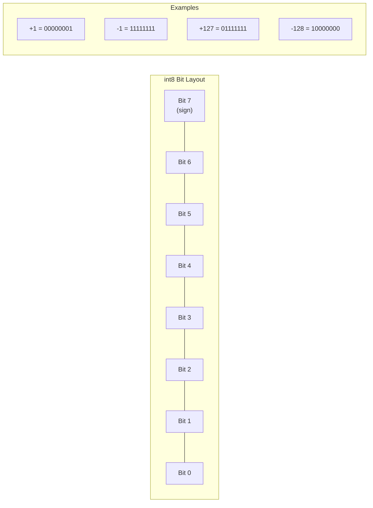
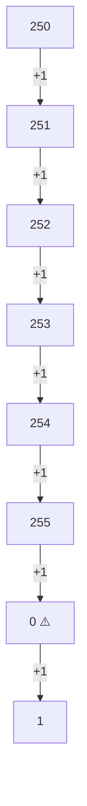
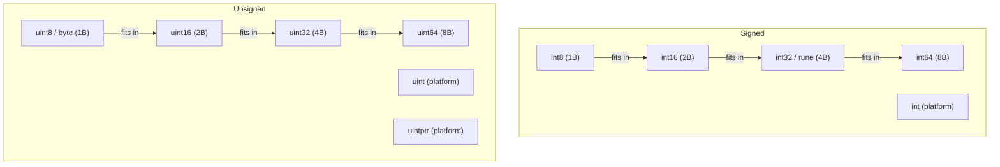
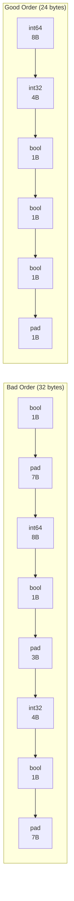
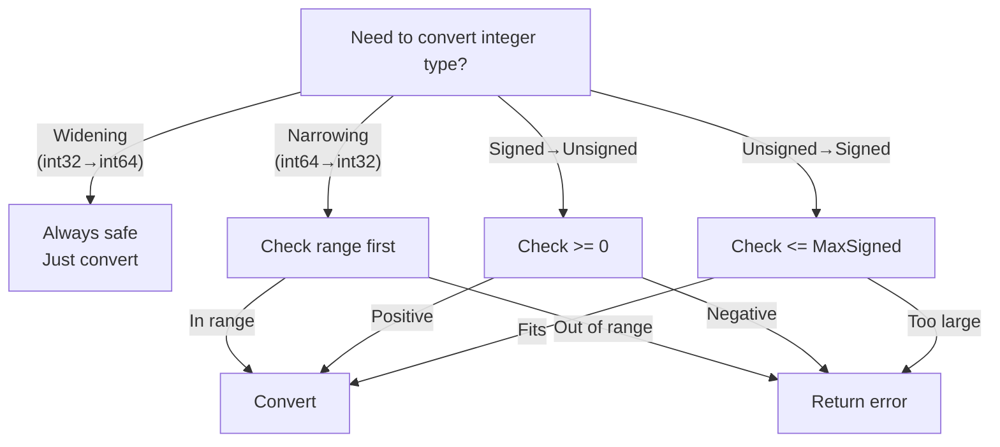

# Integers (Signed & Unsigned) — Middle Level

## Table of Contents

1. [Introduction](#introduction)
2. [Core Concepts](#core-concepts)
3. [Evolution & History](#evolution--history)
4. [Pros & Cons](#pros--cons)
5. [Alternative Approaches](#alternative-approaches)
6. [Use Cases](#use-cases)
7. [Code Examples](#code-examples)
8. [Coding Patterns](#coding-patterns)
9. [Clean Code](#clean-code)
10. [Product Use / Feature](#product-use--feature)
11. [Error Handling](#error-handling)
12. [Security Considerations](#security-considerations)
13. [Performance Optimization](#performance-optimization)
14. [Metrics & Analytics](#metrics--analytics)
15. [Debugging Guide](#debugging-guide)
16. [Best Practices](#best-practices)
17. [Edge Cases & Pitfalls](#edge-cases--pitfalls)
18. [Common Mistakes](#common-mistakes)
19. [Anti-Patterns](#anti-patterns)
20. [Tricky Points](#tricky-points)
21. [Comparison with Other Languages](#comparison-with-other-languages)
22. [Test](#test)
23. [Tricky Questions](#tricky-questions)
24. [Cheat Sheet](#cheat-sheet)
25. [Summary](#summary)
26. [What You Can Build](#what-you-can-build)
27. [Further Reading](#further-reading)
28. [Related Topics](#related-topics)
29. [Diagrams & Visual Aids](#diagrams--visual-aids)

---

## Introduction

> Focus: "Why?" and "When?"

You already know that Go provides signed and unsigned integer types with various sizes. Now the question is: **why** does Go offer so many integer types, and **when** should you choose one over another?

The answer lies in the tradeoff between **memory efficiency**, **safety**, and **performance**. In production systems, integer type choices affect struct padding, cache performance, network protocol compatibility, and overflow safety. A poorly chosen integer type can waste memory in a slice of millions of elements, cause subtle bugs when interacting with C libraries via cgo, or create security vulnerabilities when user input overflows a calculation.

This level covers the deeper mechanics of Go integers: two's complement representation, overflow detection patterns, `math/big` for arbitrary precision, atomic operations for concurrency, and the practical wisdom of choosing types in real codebases.

---

## Core Concepts

### Concept 1: Two's Complement Representation

All signed integers in Go use two's complement. The most significant bit (MSB) acts as the sign bit. For `int8` (8 bits):

- Positive: `0xxxxxxx` — MSB is 0
- Negative: `1xxxxxxx` — MSB is 1
- `-1` is represented as `11111111` (all ones)

```go
package main

import "fmt"

func main() {
    // Visualize two's complement for int8
    values := []int8{0, 1, 127, -1, -128}
    for _, v := range values {
        fmt.Printf("int8 %4d = %08b\n", v, uint8(v))
    }
    // Output:
    // int8    0 = 00000000
    // int8    1 = 00000001
    // int8  127 = 01111111
    // int8   -1 = 11111111
    // int8 -128 = 10000000
}
```

### Concept 2: Platform-Dependent int and Memory Alignment

`int` and `uint` are 32 bits on 32-bit platforms and 64 bits on 64-bit platforms. This matters for struct layout, binary serialization, and cross-compilation.

```go
package main

import (
    "fmt"
    "runtime"
    "unsafe"
)

func main() {
    fmt.Printf("GOARCH: %s\n", runtime.GOARCH)
    fmt.Printf("int size: %d bytes\n", unsafe.Sizeof(int(0)))
    fmt.Printf("uint size: %d bytes\n", unsafe.Sizeof(uint(0)))
    fmt.Printf("uintptr size: %d bytes\n", unsafe.Sizeof(uintptr(0)))

    // Struct alignment matters for memory
    type Compact struct {
        A int8  // 1 byte
        B int8  // 1 byte
        C int16 // 2 bytes
        D int32 // 4 bytes
    }

    type Wasteful struct {
        A int8  // 1 byte + 7 padding
        D int64 // 8 bytes
        B int8  // 1 byte + 3 padding
        C int32 // 4 bytes
    }

    fmt.Printf("Compact size: %d bytes\n", unsafe.Sizeof(Compact{}))   // 8
    fmt.Printf("Wasteful size: %d bytes\n", unsafe.Sizeof(Wasteful{})) // 24
}
```

### Concept 3: Arbitrary Precision with math/big

When standard integer types are not large enough, `math/big.Int` provides arbitrary precision arithmetic.

```go
package main

import (
    "fmt"
    "math/big"
)

func main() {
    // Calculate 100! (factorial)
    result := new(big.Int).SetInt64(1)
    for i := int64(2); i <= 100; i++ {
        result.Mul(result, big.NewInt(i))
    }
    fmt.Printf("100! = %s\n", result.String())
    fmt.Printf("100! has %d digits\n", len(result.String()))

    // Arithmetic with big.Int
    a := new(big.Int).SetString("99999999999999999999999999999", 10)
    b := new(big.Int).SetString("11111111111111111111111111111", 10)

    sum := new(big.Int).Add(a, b)
    fmt.Println("Sum:", sum)

    product := new(big.Int).Mul(a, b)
    fmt.Println("Product:", product)

    // Compare
    fmt.Println("a > b:", a.Cmp(b) > 0) // true
}
```

### Concept 4: Atomic Integer Operations

For concurrent access to shared integers, use `sync/atomic` to avoid data races.

```go
package main

import (
    "fmt"
    "sync"
    "sync/atomic"
)

func main() {
    var counter atomic.Int64
    var wg sync.WaitGroup

    for i := 0; i < 1000; i++ {
        wg.Add(1)
        go func() {
            defer wg.Done()
            counter.Add(1)
        }()
    }

    wg.Wait()
    fmt.Println("Counter:", counter.Load()) // always 1000

    // Compare-and-swap for lock-free updates
    counter.Store(0)
    old := counter.Load()
    swapped := counter.CompareAndSwap(old, 42)
    fmt.Println("Swapped:", swapped, "Value:", counter.Load())
}
```

### Concept 5: Integer Encoding for Network/Storage

Binary encoding uses fixed-size integers for protocol correctness.

```go
package main

import (
    "bytes"
    "encoding/binary"
    "fmt"
)

func main() {
    // Write integers in big-endian (network byte order)
    buf := new(bytes.Buffer)
    binary.Write(buf, binary.BigEndian, uint32(0x12345678))
    fmt.Printf("Big-endian bytes: %x\n", buf.Bytes()) // 12 34 56 78

    // Read them back
    var value uint32
    binary.Read(buf, binary.BigEndian, &value)
    fmt.Printf("Read back: 0x%X\n", value) // 0x12345678

    // Little-endian (x86 native)
    buf2 := new(bytes.Buffer)
    binary.Write(buf2, binary.LittleEndian, uint32(0x12345678))
    fmt.Printf("Little-endian bytes: %x\n", buf2.Bytes()) // 78 56 34 12
}
```

---

## Evolution & History

| Year | Event |
|------|-------|
| 2009 | Go launched with all integer types; `int` was always platform-dependent |
| 2012 | Go 1.0 — integer type specifications finalized |
| 2013 | `go vet` added checks for suspicious integer conversions |
| 2019 | Go 1.13 — binary literals (`0b`), octal prefix (`0o`), digit separators (`_`) |
| 2021 | Go 1.17 — `unsafe.Add` and `unsafe.Slice` for pointer arithmetic |
| 2022 | Go 1.19 — `atomic.Int64`, `atomic.Uint64` typed wrappers added |
| 2023 | Go 1.21 — `min()`, `max()` built-in functions work with integers |
| 2024 | Go 1.22 — range-over-int: `for i := range 10` |

The addition of binary literals and digit separators in Go 1.13 was a significant usability improvement. The `0o` prefix for octal made it unambiguous (the old `0777` syntax still works but `0o777` is preferred).

---

## Pros & Cons

| Aspect | Pros | Cons |
|--------|------|------|
| **Type Safety** | Explicit conversions prevent accidental mixing | Verbose conversion code |
| **Performance** | Native CPU operations, zero overhead | No overflow detection by default |
| **Memory** | Precise control over struct sizes | Must think about alignment/padding |
| **Concurrency** | `sync/atomic` for lock-free operations | Atomic operations limited to specific sizes |
| **Big Numbers** | `math/big` for arbitrary precision | `big.Int` is much slower than native types |
| **Portability** | Fixed-size types for cross-platform code | `int` varies by platform |

---

## Alternative Approaches

| Need | Standard Approach | Alternative |
|------|-------------------|-------------|
| Numbers beyond int64 | `math/big.Int` | Third-party uint128/int128 libraries |
| Overflow detection | Manual check before operation | `math/bits.Add64` returns carry bit |
| Fixed-point decimal | `int64` with scale factor | `shopspring/decimal` library |
| Counted integers (enum) | `iota` constants | Code generation tools |
| Saturating arithmetic | Manual clamping | Custom wrapper type |

```go
package main

import (
    "fmt"
    "math/bits"
)

func main() {
    // Using math/bits for overflow-aware addition
    sum, carry := bits.Add64(^uint64(0), 1, 0)
    fmt.Printf("MaxUint64 + 1: sum=%d, carry=%d\n", sum, carry)
    // sum=0, carry=1 (overflow detected)

    // Saturating addition
    a, b := uint64(^uint64(0)-5), uint64(10)
    result := saturatingAddU64(a, b)
    fmt.Printf("Saturating add: %d\n", result) // MaxUint64
}

func saturatingAddU64(a, b uint64) uint64 {
    sum, carry := bits.Add64(a, b, 0)
    if carry != 0 {
        return ^uint64(0) // MaxUint64
    }
    return sum
}
```

---

## Use Cases

### Use Case 1: Binary Protocol Parser

```go
package main

import (
    "encoding/binary"
    "fmt"
)

// Simple TLV (Type-Length-Value) parser
type TLV struct {
    Type   uint16
    Length uint16
    Value  []byte
}

func parseTLV(data []byte) (TLV, int, error) {
    if len(data) < 4 {
        return TLV{}, 0, fmt.Errorf("need at least 4 bytes, got %d", len(data))
    }
    t := binary.BigEndian.Uint16(data[0:2])
    l := binary.BigEndian.Uint16(data[2:4])
    if int(l) > len(data)-4 {
        return TLV{}, 0, fmt.Errorf("value length %d exceeds available data", l)
    }
    return TLV{Type: t, Length: l, Value: data[4 : 4+l]}, 4 + int(l), nil
}

func main() {
    // Encode: type=1, length=5, value="hello"
    data := []byte{0x00, 0x01, 0x00, 0x05, 'h', 'e', 'l', 'l', 'o'}
    tlv, n, err := parseTLV(data)
    if err != nil {
        fmt.Println("Error:", err)
        return
    }
    fmt.Printf("Type: %d, Length: %d, Value: %s, consumed: %d bytes\n",
        tlv.Type, tlv.Length, tlv.Value, n)
}
```

### Use Case 2: Bit Set for Feature Flags

```go
package main

import "fmt"

type Features uint64

const (
    FeatureDarkMode    Features = 1 << iota // 1
    FeatureNotifications                     // 2
    FeatureAnalytics                         // 4
    FeatureBetaAccess                        // 8
    FeatureAPI                               // 16
    FeatureExport                            // 32
)

func (f Features) Has(flag Features) bool   { return f&flag != 0 }
func (f *Features) Set(flag Features)       { *f |= flag }
func (f *Features) Clear(flag Features)     { *f &^= flag }
func (f *Features) Toggle(flag Features)    { *f ^= flag }

func main() {
    var user Features
    user.Set(FeatureDarkMode)
    user.Set(FeatureNotifications)
    user.Set(FeatureAPI)

    fmt.Printf("Features: %06b\n", user)
    fmt.Println("Has dark mode:", user.Has(FeatureDarkMode))
    fmt.Println("Has beta access:", user.Has(FeatureBetaAccess))

    user.Toggle(FeatureDarkMode)
    fmt.Println("After toggle, has dark mode:", user.Has(FeatureDarkMode))
}
```

---

## Code Examples

### Example 1: Safe Integer Arithmetic Library

```go
package main

import (
    "errors"
    "fmt"
    "math"
)

var ErrOverflow = errors.New("integer overflow")
var ErrDivByZero = errors.New("division by zero")

func SafeAdd(a, b int64) (int64, error) {
    if (b > 0 && a > math.MaxInt64-b) || (b < 0 && a < math.MinInt64-b) {
        return 0, ErrOverflow
    }
    return a + b, nil
}

func SafeSub(a, b int64) (int64, error) {
    if (b < 0 && a > math.MaxInt64+b) || (b > 0 && a < math.MinInt64+b) {
        return 0, ErrOverflow
    }
    return a - b, nil
}

func SafeMul(a, b int64) (int64, error) {
    if a == 0 || b == 0 {
        return 0, nil
    }
    result := a * b
    if result/a != b {
        return 0, ErrOverflow
    }
    return result, nil
}

func SafeDiv(a, b int64) (int64, error) {
    if b == 0 {
        return 0, ErrDivByZero
    }
    if a == math.MinInt64 && b == -1 {
        return 0, ErrOverflow // MinInt64 / -1 overflows
    }
    return a / b, nil
}

func main() {
    r, err := SafeAdd(math.MaxInt64, 1)
    fmt.Printf("MaxInt64 + 1: result=%d, err=%v\n", r, err)

    r, err = SafeMul(math.MaxInt64/2, 3)
    fmt.Printf("MaxInt64/2 * 3: result=%d, err=%v\n", r, err)

    r, err = SafeDiv(math.MinInt64, -1)
    fmt.Printf("MinInt64 / -1: result=%d, err=%v\n", r, err)

    r, err = SafeAdd(100, 200)
    fmt.Printf("100 + 200: result=%d, err=%v\n", r, err)
}
```

### Example 2: Integer Bit Manipulation Utilities

```go
package main

import (
    "fmt"
    "math/bits"
)

func main() {
    var n uint64 = 0b10110100

    fmt.Printf("Value:           %08b (%d)\n", n, n)
    fmt.Printf("Leading zeros:   %d\n", bits.LeadingZeros64(n))
    fmt.Printf("Trailing zeros:  %d\n", bits.TrailingZeros64(n))
    fmt.Printf("Ones count:      %d\n", bits.OnesCount64(n))
    fmt.Printf("Bit length:      %d\n", bits.Len64(n))
    fmt.Printf("Reversed:        %064b\n", bits.Reverse64(n))
    fmt.Printf("Rotated left 2:  %08b\n", uint8(bits.RotateLeft64(n, 2)))

    // Next power of 2
    v := uint64(100)
    next := nextPowerOf2(v)
    fmt.Printf("Next power of 2 after %d: %d\n", v, next)
}

func nextPowerOf2(v uint64) uint64 {
    if v == 0 {
        return 1
    }
    return 1 << bits.Len64(v-1)
}
```

### Example 3: Integer-Based Hash Ring

```go
package main

import (
    "fmt"
    "hash/fnv"
    "sort"
)

type HashRing struct {
    nodes  map[uint32]string
    sorted []uint32
}

func NewHashRing(nodes []string) *HashRing {
    ring := &HashRing{nodes: make(map[uint32]string)}
    for _, node := range nodes {
        hash := hashKey(node)
        ring.nodes[hash] = node
        ring.sorted = append(ring.sorted, hash)
    }
    sort.Slice(ring.sorted, func(i, j int) bool {
        return ring.sorted[i] < ring.sorted[j]
    })
    return ring
}

func (r *HashRing) Get(key string) string {
    hash := hashKey(key)
    idx := sort.Search(len(r.sorted), func(i int) bool {
        return r.sorted[i] >= hash
    })
    if idx >= len(r.sorted) {
        idx = 0
    }
    return r.nodes[r.sorted[idx]]
}

func hashKey(key string) uint32 {
    h := fnv.New32a()
    h.Write([]byte(key))
    return h.Sum32()
}

func main() {
    ring := NewHashRing([]string{"server-1", "server-2", "server-3"})
    keys := []string{"user:100", "user:200", "user:300", "order:1", "order:2"}
    for _, key := range keys {
        fmt.Printf("%s -> %s\n", key, ring.Get(key))
    }
}
```

### Example 4: Packed Struct with Bit Fields

```go
package main

import "fmt"

// Pack multiple values into a single uint32
// [31..24] = flags (8 bits)
// [23..16] = priority (8 bits)
// [15..0]  = id (16 bits)

type PackedMessage uint32

func NewPackedMessage(id uint16, priority uint8, flags uint8) PackedMessage {
    return PackedMessage(uint32(flags)<<24 | uint32(priority)<<16 | uint32(id))
}

func (m PackedMessage) ID() uint16       { return uint16(m & 0xFFFF) }
func (m PackedMessage) Priority() uint8  { return uint8((m >> 16) & 0xFF) }
func (m PackedMessage) Flags() uint8     { return uint8((m >> 24) & 0xFF) }

func main() {
    msg := NewPackedMessage(1234, 5, 0b10000001)
    fmt.Printf("Packed: 0x%08X\n", uint32(msg))
    fmt.Printf("ID: %d, Priority: %d, Flags: %08b\n",
        msg.ID(), msg.Priority(), msg.Flags())
}
```

### Example 5: Range-over-int (Go 1.22+)

```go
package main

import "fmt"

func main() {
    // Go 1.22+: range over integer
    fmt.Println("=== Range over int ===")
    for i := range 5 {
        fmt.Printf("i = %d\n", i) // 0, 1, 2, 3, 4
    }

    // Building a slice of squares
    squares := make([]int, 10)
    for i := range len(squares) {
        squares[i] = i * i
    }
    fmt.Println("Squares:", squares)
}
```

---

## Coding Patterns

### Pattern 1: Overflow-Safe Type Conversion

```go
package main

import (
    "fmt"
    "math"
)

func Int64ToInt32(v int64) (int32, bool) {
    if v < math.MinInt32 || v > math.MaxInt32 {
        return 0, false
    }
    return int32(v), true
}

func Int64ToUint64(v int64) (uint64, bool) {
    if v < 0 {
        return 0, false
    }
    return uint64(v), true
}

func Uint64ToInt64(v uint64) (int64, bool) {
    if v > uint64(math.MaxInt64) {
        return 0, false
    }
    return int64(v), true
}

func main() {
    v, ok := Int64ToInt32(3_000_000_000)
    fmt.Printf("3B to int32: %d, ok=%v\n", v, ok) // 0, false

    v2, ok := Int64ToInt32(1_000_000)
    fmt.Printf("1M to int32: %d, ok=%v\n", v2, ok) // 1000000, true
}
```

### Pattern 2: Enum with String Representation

```go
package main

import "fmt"

type Status int

const (
    StatusPending Status = iota
    StatusActive
    StatusSuspended
    StatusDeleted
)

var statusNames = map[Status]string{
    StatusPending:   "pending",
    StatusActive:    "active",
    StatusSuspended: "suspended",
    StatusDeleted:   "deleted",
}

func (s Status) String() string {
    if name, ok := statusNames[s]; ok {
        return name
    }
    return fmt.Sprintf("Status(%d)", s)
}

func (s Status) IsValid() bool {
    _, ok := statusNames[s]
    return ok
}

func main() {
    s := StatusActive
    fmt.Println(s)           // active
    fmt.Println(s.IsValid()) // true
    fmt.Println(Status(99))  // Status(99)
}
```

### Pattern 3: Clamping Values

```go
func clamp(value, minVal, maxVal int) int {
    return max(minVal, min(maxVal, value)) // Go 1.21+
}

func clampUint8(value int) uint8 {
    if value < 0 {
        return 0
    }
    if value > 255 {
        return 255
    }
    return uint8(value)
}
```

---

## Clean Code

### Naming Conventions

```go
// Good: descriptive names with units
var maxConnectionsPerHost int = 100
var requestTimeoutMs int64 = 5000
var bufferSizeBytes int = 4096

// Bad: single letter or ambiguous
var n int = 100
var t int64 = 5000
var s int = 4096
```

### Constant Groups

```go
// Good: organized constant groups
const (
    KiB = 1024
    MiB = 1024 * KiB
    GiB = 1024 * MiB
)

const (
    DefaultPort    = 8080
    DefaultTimeout = 30 // seconds
    MaxRetries     = 3
)
```

### Avoid Magic Numbers

```go
// Bad
if resp.StatusCode == 200 {
    // ...
}

// Good
import "net/http"
if resp.StatusCode == http.StatusOK {
    // ...
}
```

---

## Product Use / Feature

### Rate Limiter with Integer Counters

```go
package main

import (
    "fmt"
    "sync"
    "time"
)

type RateLimiter struct {
    mu       sync.Mutex
    tokens   int
    maxTokens int
    refillRate int
    lastRefill time.Time
}

func NewRateLimiter(maxTokens, refillRate int) *RateLimiter {
    return &RateLimiter{
        tokens:     maxTokens,
        maxTokens:  maxTokens,
        refillRate: refillRate,
        lastRefill: time.Now(),
    }
}

func (r *RateLimiter) Allow() bool {
    r.mu.Lock()
    defer r.mu.Unlock()

    now := time.Now()
    elapsed := int(now.Sub(r.lastRefill).Seconds())
    if elapsed > 0 {
        r.tokens = min(r.maxTokens, r.tokens+elapsed*r.refillRate)
        r.lastRefill = now
    }

    if r.tokens > 0 {
        r.tokens--
        return true
    }
    return false
}

func main() {
    limiter := NewRateLimiter(5, 1) // 5 tokens max, 1 per second

    for i := 0; i < 8; i++ {
        allowed := limiter.Allow()
        fmt.Printf("Request %d: allowed=%v\n", i+1, allowed)
    }
}
```

---

## Error Handling

### Wrapping Integer Parsing Errors

```go
package main

import (
    "fmt"
    "strconv"
)

type ValidationError struct {
    Field   string
    Value   string
    Message string
}

func (e *ValidationError) Error() string {
    return fmt.Sprintf("validation error: field=%s, value=%q, message=%s",
        e.Field, e.Value, e.Message)
}

func ParsePort(s string) (uint16, error) {
    n, err := strconv.ParseUint(s, 10, 16)
    if err != nil {
        return 0, &ValidationError{
            Field:   "port",
            Value:   s,
            Message: fmt.Sprintf("must be a number between 0 and 65535: %v", err),
        }
    }
    if n == 0 {
        return 0, &ValidationError{
            Field:   "port",
            Value:   s,
            Message: "port 0 is reserved",
        }
    }
    return uint16(n), nil
}

func main() {
    tests := []string{"8080", "0", "70000", "abc", "-1"}
    for _, t := range tests {
        port, err := ParsePort(t)
        if err != nil {
            fmt.Println("Error:", err)
        } else {
            fmt.Printf("Port: %d\n", port)
        }
    }
}
```

---

## Security Considerations

### Integer Overflow Attacks

```go
package main

import (
    "fmt"
    "math"
)

// Vulnerable: integer overflow in size calculation
func vulnerableAlloc(width, height int32) []byte {
    size := width * height * 4 // RGBA — can overflow!
    return make([]byte, size)
}

// Safe: check for overflow before allocation
func safeAlloc(width, height int32) ([]byte, error) {
    if width <= 0 || height <= 0 {
        return nil, fmt.Errorf("dimensions must be positive")
    }
    // Check multiplication overflow
    pixels := int64(width) * int64(height)
    size := pixels * 4
    const maxSize = 100 * 1024 * 1024 // 100 MB limit
    if size > maxSize || size < 0 {
        return nil, fmt.Errorf("image too large: %d bytes", size)
    }
    return make([]byte, size), nil
}

// Vulnerable: length wrapping
func vulnerableSlice(data []byte, offset, length uint32) []byte {
    end := offset + length // can wrap to small value!
    return data[offset:end]
}

// Safe: check for overflow
func safeSlice(data []byte, offset, length uint32) ([]byte, error) {
    end := uint64(offset) + uint64(length) // promote to wider type
    if end > uint64(len(data)) {
        return nil, fmt.Errorf("slice bounds out of range")
    }
    return data[offset : offset+length], nil
}

func main() {
    // Demonstrate overflow in width * height
    w, h := int32(math.MaxInt16+1), int32(math.MaxInt16+1)
    product := w * h
    fmt.Printf("%d * %d = %d (overflowed!)\n", w, h, product)

    buf, err := safeAlloc(w, h)
    if err != nil {
        fmt.Println("Safe check caught it:", err)
    }
    _ = buf
}
```

---

## Performance Optimization

### Struct Field Ordering

```go
package main

import (
    "fmt"
    "unsafe"
)

// Poorly ordered: 32 bytes due to padding
type BadOrder struct {
    A bool    // 1 + 7 padding
    B int64   // 8
    C bool    // 1 + 3 padding
    D int32   // 4
    E bool    // 1 + 7 padding
}

// Well ordered: 24 bytes — fields sorted by size descending
type GoodOrder struct {
    B int64   // 8
    D int32   // 4
    A bool    // 1
    C bool    // 1
    E bool    // 1 + 1 padding
}

func main() {
    fmt.Printf("BadOrder:  %d bytes\n", unsafe.Sizeof(BadOrder{}))
    fmt.Printf("GoodOrder: %d bytes\n", unsafe.Sizeof(GoodOrder{}))
}
```

### Bit Operations vs Arithmetic

```go
package main

import (
    "fmt"
    "testing"
)

func divideBy8Arithmetic(n int) int { return n / 8 }
func divideBy8Bitshift(n int) int   { return n >> 3 }

func isPowerOf2Mod(n uint64) bool   { return n > 0 && n%n == 0 } // wrong example
func isPowerOf2Bits(n uint64) bool  { return n > 0 && (n&(n-1)) == 0 }

func main() {
    // The compiler often optimizes division by constants to shifts,
    // but explicit shifts are clearer for bit-manipulation intent.
    fmt.Println(divideBy8Arithmetic(64)) // 8
    fmt.Println(divideBy8Bitshift(64))   // 8

    for _, v := range []uint64{0, 1, 2, 3, 4, 16, 100, 1024} {
        fmt.Printf("%4d is power of 2: %v\n", v, isPowerOf2Bits(v))
    }
    _ = testing.Benchmark // reference for benchmarking
}
```

---

## Metrics & Analytics

```go
package main

import (
    "fmt"
    "sync/atomic"
    "time"
)

type IntegerMetrics struct {
    ParseSuccessCount atomic.Int64
    ParseFailureCount atomic.Int64
    OverflowCount     atomic.Int64
    TotalProcessed    atomic.Int64
}

func (m *IntegerMetrics) Report() {
    total := m.TotalProcessed.Load()
    success := m.ParseSuccessCount.Load()
    failures := m.ParseFailureCount.Load()
    overflows := m.OverflowCount.Load()

    fmt.Printf("=== Metrics at %s ===\n", time.Now().Format(time.RFC3339))
    fmt.Printf("Total processed: %d\n", total)
    fmt.Printf("Successes: %d (%.1f%%)\n", success, pct(success, total))
    fmt.Printf("Failures: %d (%.1f%%)\n", failures, pct(failures, total))
    fmt.Printf("Overflows: %d (%.1f%%)\n", overflows, pct(overflows, total))
}

func pct(part, total int64) float64 {
    if total == 0 {
        return 0
    }
    return float64(part) / float64(total) * 100
}

func main() {
    m := &IntegerMetrics{}
    m.TotalProcessed.Add(1000)
    m.ParseSuccessCount.Add(950)
    m.ParseFailureCount.Add(45)
    m.OverflowCount.Add(5)
    m.Report()
}
```

---

## Debugging Guide

### Problem 1: Unexpected Negative Value

```go
// Symptom: variable that should be positive is negative
var count uint32 = 10
count -= 20 // wraps to 4294967286

// Debug: print as both signed and unsigned
fmt.Printf("uint32: %d, as int32: %d\n", count, int32(count))

// Fix: use int and check before subtraction
var countSafe int = 10
if countSafe >= 20 {
    countSafe -= 20
} else {
    fmt.Println("Cannot subtract: would go negative")
}
```

### Problem 2: JSON Number Precision Loss

```go
package main

import (
    "encoding/json"
    "fmt"
)

func main() {
    // JSON numbers are float64 by default
    data := []byte(`{"id": 9007199254740993}`)
    var result map[string]interface{}
    json.Unmarshal(data, &result)
    fmt.Printf("ID: %.0f\n", result["id"]) // precision lost!

    // Fix: use json.Number or specific struct
    type Record struct {
        ID int64 `json:"id"`
    }
    var rec Record
    json.Unmarshal(data, &rec)
    fmt.Printf("ID (correct): %d\n", rec.ID)
}
```

### Problem 3: Loop Never Terminates

```go
// Bug: unsigned counter counts down past zero
// for i := uint(10); i >= 0; i-- { // infinite loop! uint is always >= 0

// Fix: use int for countdown loops
for i := 10; i >= 0; i-- {
    fmt.Println(i)
}
```

---

## Best Practices

1. **Use `int` by default** — only use sized types when you have a specific reason
2. **Use `int64` in APIs and serialization** — avoids platform-dependency issues
3. **Never use `uint` for loop counters that count down** — use `int` instead
4. **Order struct fields by size** — largest first to minimize padding
5. **Use `atomic` for concurrent counters** — never share plain integers between goroutines
6. **Validate before narrowing conversions** — always check range
7. **Use `encoding/binary` for wire formats** — specify endianness explicitly
8. **Prefer `math/bits` for bit manipulation** — optimized, portable, readable
9. **Use digit separators** — `1_000_000` is more readable than `1000000`
10. **Use `min()` and `max()` built-ins** (Go 1.21+) — cleaner than manual comparisons

---

## Edge Cases & Pitfalls

```go
package main

import (
    "fmt"
    "math"
)

func main() {
    // MinInt64 / -1 panics at runtime (not overflow — actual panic)
    // This is the only integer division that can panic besides /0
    a := math.MinInt64
    b := -1
    // fmt.Println(a / b) // panic: runtime error: integer divide by zero
    // (On some architectures it triggers a hardware exception)
    _ = a
    _ = b

    // Shifting by >= type width gives 0
    var x uint32 = 1
    fmt.Println(x << 32) // 0 (shift >= 32 bits for uint32)
    fmt.Println(x << 31) // 2147483648

    // Untyped constant arithmetic is arbitrary precision
    const huge = 1 << 200 // this is fine as a constant
    // var y int64 = huge  // compile error: overflows int64
    const ratio = huge / (1 << 190) // = 1024, fits in int
    fmt.Println(ratio)

    // Comparing signed and unsigned requires conversion
    var s int = -1
    var u uint = 1
    // fmt.Println(s < u) // compile error: mismatched types
    fmt.Println(s < int(u)) // true
}
```

---

## Common Mistakes

| Mistake | Why It Is Wrong | Correct Approach |
|---------|----------------|-----------------|
| Using `uint` for countdown loops | `uint(0) - 1` wraps to max | Use `int` for loops that decrement |
| Ignoring `strconv` errors | Silent wrong values | Always check `err` |
| Using `int` in binary protocols | Size varies by platform | Use `int32` or `int64` |
| `int(someFloat)` without rounding | Truncates toward zero | Use `int(math.Round(f))` |
| Assuming `len()` returns `int64` | `len()` returns `int` | Convert if needed |
| Mixing `byte` arithmetic with `int` | Type mismatch | Explicit conversion |

---

## Anti-Patterns

### Anti-Pattern 1: Using float64 for Integer Math

```go
// Bad: floating point introduces precision errors
func badSum(values []int) int {
    sum := 0.0
    for _, v := range values {
        sum += float64(v)
    }
    return int(sum) // precision loss for large sums
}

// Good: use integer arithmetic
func goodSum(values []int) int {
    sum := 0
    for _, v := range values {
        sum += v
    }
    return sum
}
```

### Anti-Pattern 2: Unnecessary Type Conversions

```go
// Bad: converting back and forth
func bad(a, b int) int {
    return int(int64(a) + int64(b)) // pointless if you are just adding two ints
}

// Good: just use int
func good(a, b int) int {
    return a + b
}
```

### Anti-Pattern 3: Hardcoded Bit Sizes

```go
// Bad: magic numbers
mask := uint64(0xFFFFFFFF)

// Good: use expressions
mask := uint64(1<<32) - 1
```

---

## Tricky Points

1. **`^x` vs `x ^ y`**: Unary `^` is bitwise complement, binary `^` is XOR. In C, complement is `~x`.
2. **Go has no `>>>` operator**: Right shift of signed integers is arithmetic (sign-extending). Use unsigned types for logical right shift.
3. **Constant expressions have arbitrary precision**: `const x = 1 << 1000` is valid. It only fails when assigned to a variable.
4. **`MinInt64 / -1`**: This causes a hardware trap on x86 — Go translates it to a panic.
5. **Negative shift amounts**: compile-time error for constants, runtime panic for variables (Go 1.13+: shift count must be unsigned or untyped constant).

---

## Comparison with Other Languages

| Feature | Go | C/C++ | Java | Python | Rust |
|---------|-----|-------|------|--------|------|
| Integer sizes | Explicit (int8..int64) | Platform-dependent (int, long) | Fixed (byte, short, int, long) | Arbitrary precision | Explicit (i8..i128) |
| Overflow behavior | Silent wraparound | Undefined behavior (signed) | Silent wraparound | Grows automatically | Panic in debug, wrap in release |
| Unsigned types | Yes (uint8..uint64) | Yes | No (except char) | No | Yes (u8..u128) |
| Bitwise complement | `^x` | `~x` | `~x` | `~x` | `!x` |
| AND NOT operator | `&^` | `& ~` | `& ~` | `& ~` | `& !` |
| Integer division | Truncates toward zero | Truncates toward zero | Truncates toward zero | Floors toward negative infinity | Truncates toward zero |
| Checked arithmetic | Manual / `math/bits` | Compiler builtins | Math.addExact() | Built-in | .checked_add() |

---

## Test

<details>
<summary>Question 1: Why does Go require explicit conversion between int and int64?</summary>

**Answer:** Go's type system is strict — `int` and `int64` are distinct types even if they have the same underlying size on 64-bit platforms. This prevents subtle bugs when code is compiled for different architectures where `int` might be 32 bits.
</details>

<details>
<summary>Question 2: What is the output of this code?</summary>

```go
var x uint8 = 200
var y uint8 = 100
fmt.Println(x + y)
```

**Answer:** `44`. The sum `300` overflows `uint8` (max 255). `300 - 256 = 44`.
</details>

<details>
<summary>Question 3: How does Go's modulo operator differ from Python's for negative numbers?</summary>

**Answer:** Go's `%` preserves the sign of the dividend: `-7 % 3 = -1`. Python floors the result: `-7 % 3 = 2`. In Go, `(-7/3)*3 + (-7%3) == -7` always holds.
</details>

<details>
<summary>Question 4: When should you use math/big.Int instead of int64?</summary>

**Answer:** When values can exceed `int64` range (9.2 x 10^18), such as cryptographic calculations, factorial of large numbers, or financial calculations requiring exact arbitrary-precision arithmetic.
</details>

<details>
<summary>Question 5: Why should you never use uint for a loop counter that decrements to zero?</summary>

**Answer:** `uint(0) - 1` wraps to `math.MaxUint64`, causing an infinite loop or accessing out-of-bounds memory. Use `int` for countdown loops.
</details>

---

## Tricky Questions

**Q1:** What does `int64(float64(math.MaxInt64))` produce?
**A:** `math.MinInt64` (negative!). `float64` cannot represent `MaxInt64` exactly — it rounds up, and converting back overflows to `MinInt64`.

**Q2:** Is `var x byte = 'A'` the same as `var x byte = 65`?
**A:** Yes — `'A'` is an untyped rune constant with value 65, which fits in `byte`.

**Q3:** Why does this panic? `a, b := math.MinInt64, -1; fmt.Println(a/b)`
**A:** `MinInt64 / -1` would be `MaxInt64 + 1`, which overflows. On x86, this triggers a SIGFPE hardware exception.

**Q4:** What is `^int8(0)`?
**A:** `-1`. Bitwise complement of `00000000` is `11111111`, which in two's complement is `-1`.

---

## Cheat Sheet

| Operation | Code |
|-----------|------|
| Max value of int64 | `math.MaxInt64` |
| Min value of int64 | `math.MinInt64` |
| Max value of uint64 | `uint64(math.MaxUint64)` |
| String to int | `strconv.Atoi("42")` |
| Int to string | `strconv.Itoa(42)` |
| Parse with base/size | `strconv.ParseInt("FF", 16, 32)` |
| Format as binary | `fmt.Sprintf("%b", 42)` |
| Format as hex | `fmt.Sprintf("%x", 255)` |
| Count set bits | `bits.OnesCount64(n)` |
| Size of type | `unsafe.Sizeof(int32(0))` |
| Atomic increment | `counter.Add(1)` |
| Big integer | `big.NewInt(42)` |
| Overflow-aware add | `bits.Add64(a, b, 0)` |
| Next power of 2 | `1 << bits.Len64(n-1)` |
| Check power of 2 | `n > 0 && (n&(n-1)) == 0` |

---

## Summary

- Go integer types are **strict** — no implicit conversions between types
- **Two's complement** is used for signed types; overflow wraps silently
- Use `int` by default, sized types for serialization/protocols
- `math/big.Int` for numbers exceeding `int64` range
- `sync/atomic` for concurrent integer operations
- `encoding/binary` for network byte order encoding
- `math/bits` for efficient bit manipulation
- Struct field ordering affects memory layout — sort by size descending
- Always validate user input before integer arithmetic
- Go 1.21+ adds `min()`/`max()`, Go 1.22+ adds range-over-int

---

## What You Can Build

- **Binary protocol parser/serializer** — parse TCP/UDP packets with fixed-size fields
- **Bloom filter** — use bit arrays for probabilistic set membership
- **Consistent hash ring** — distribute keys across servers using uint32 hashes
- **Feature flag system** — pack 64 boolean flags into a single uint64
- **Rate limiter** — token bucket with atomic integer counters

---

## Further Reading

- [Go Specification: Numeric Types](https://go.dev/ref/spec#Numeric_types)
- [Go Blog: Constants](https://go.dev/blog/constants)
- [Package math/bits](https://pkg.go.dev/math/bits)
- [Package math/big](https://pkg.go.dev/math/big)
- [Package encoding/binary](https://pkg.go.dev/encoding/binary)
- [Package sync/atomic](https://pkg.go.dev/sync/atomic)
- [Go Wiki: Padding and Alignment](https://go.dev/wiki/)

---

## Related Topics

- **Floating-Point Types** — IEEE 754, precision, comparison pitfalls
- **Constants and iota** — untyped constants, enumeration patterns
- **Binary Encoding** — `encoding/binary`, endianness, protocol buffers
- **Unsafe Package** — pointer arithmetic, struct layout inspection
- **Generics** — type constraints for numeric types (`constraints.Integer`)
- **Atomic Operations** — lock-free programming with integer atomics

---

## Diagrams & Visual Aids

### Two's Complement Representation (int8)



### Integer Overflow Wraparound (uint8)



### Integer Type Hierarchy



### Struct Padding Visualization



### Safe Conversion Decision Tree


