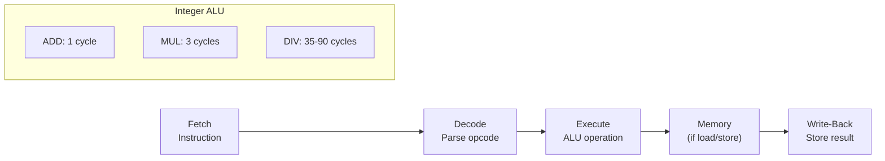
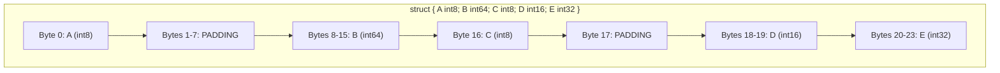
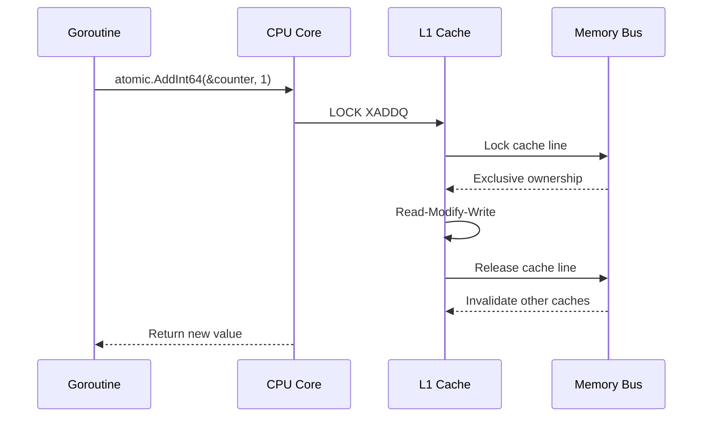
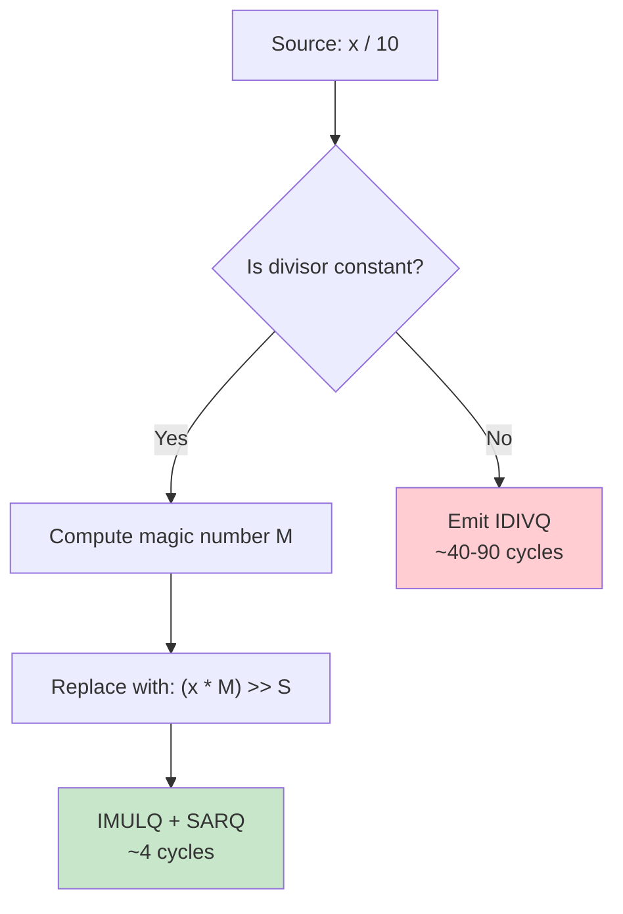
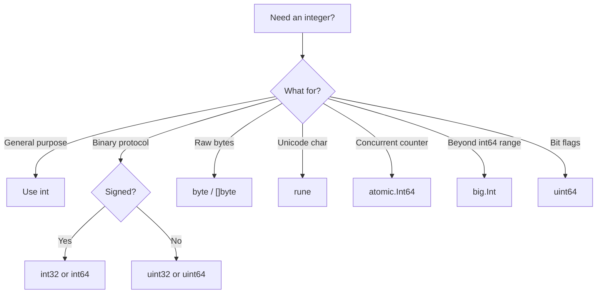

# Integers (Signed & Unsigned) — Under the Hood

## Table of Contents

1. [Introduction](#introduction)
2. [How It Works Internally](#how-it-works-internally)
3. [Runtime Deep Dive](#runtime-deep-dive)
4. [Compiler Perspective](#compiler-perspective)
5. [Memory Layout](#memory-layout)
6. [OS/Syscall Level](#ossyscall-level)
7. [Source Code Walkthrough](#source-code-walkthrough)
8. [Assembly Output](#assembly-output)
9. [Performance Internals](#performance-internals)
10. [Metrics Runtime](#metrics-runtime)
11. [Edge Cases Lowest Level](#edge-cases-lowest-level)
12. [Test](#test)
13. [Tricky Questions](#tricky-questions)
14. [Self-Assessment](#self-assessment)
15. [Summary](#summary)
16. [Further Reading](#further-reading)
17. [Diagrams & Visual Aids](#diagrams--visual-aids)

---

## Introduction

> Focus: "Under the hood"

This level explores how Go integers work at the hardware and runtime level. You will understand how the Go compiler translates integer operations to machine instructions, how the CPU actually performs addition with carry chains, why `int` is platform-dependent, how `sync/atomic` maps to hardware atomics, and what the Go runtime does (or does not do) for integer operations.

Understanding these internals helps you write code that cooperates with the hardware rather than fighting it — predicting cache behavior, understanding why certain operations are fast or slow, and making informed decisions about data layout in performance-critical systems.

---

## How It Works Internally

### CPU Arithmetic Unit

Integer operations are performed by the ALU (Arithmetic Logic Unit) inside the CPU. Each integer type maps directly to a register size or a subset of it:

| Go Type | x86-64 Register | ARM64 Register | Width |
|---------|-----------------|----------------|-------|
| `int8` / `uint8` | AL, BL (8-bit) | W0 (lower 8) | 8 bits |
| `int16` / `uint16` | AX, BX (16-bit) | W0 (lower 16) | 16 bits |
| `int32` / `uint32` | EAX, EBX (32-bit) | W0 | 32 bits |
| `int64` / `uint64` | RAX, RBX (64-bit) | X0 | 64 bits |
| `int` / `uint` | RAX (64-bit on amd64) | X0 (64-bit on arm64) | Platform word |

### Two's Complement in Hardware

The CPU does not distinguish signed from unsigned for addition and subtraction — the same binary operation works for both. The only difference is how the result is interpreted and which condition flags are checked:

```go
package main

import "fmt"

func main() {
    // Both operations produce the same bit pattern
    var u uint8 = 255
    var s int8 = -1

    // Binary representation is identical: 11111111
    fmt.Printf("uint8(255) = %08b\n", u)
    fmt.Printf("int8(-1)   = %08b\n", uint8(s))

    // Adding 1 to both: same hardware ADD instruction
    u += 1
    s += 1
    fmt.Printf("uint8: 255+1 = %d (%08b)\n", u, u)     // 0
    fmt.Printf("int8:  -1+1  = %d (%08b)\n", s, uint8(s)) // 0
}
```

### Division Implementation

Integer division is the most expensive arithmetic operation. On x86-64, the `DIV`/`IDIV` instructions take 20-90+ cycles depending on operand size.

```go
package main

import "fmt"

func main() {
    // Division by constant: compiler converts to multiplication + shift
    // n / 10 becomes: (n * 0xCCCCCCCCCCCCCCCD) >> 67
    a := 1000
    b := a / 10
    fmt.Println(b) // 100

    // Division by variable: uses actual DIV instruction (slow)
    c := 10
    d := a / c
    fmt.Println(d) // 100

    // Modulo by power of 2: compiler uses AND
    // n % 8 becomes n & 7
    e := 100 % 8
    fmt.Println(e) // 4
}
```

---

## Runtime Deep Dive

### The Go Runtime and Integers

The Go runtime has minimal involvement with integer operations. Unlike garbage-collected reference types, integers are value types stored inline — no heap allocation, no GC pressure, no indirection.

```go
package main

import (
    "fmt"
    "runtime"
    "unsafe"
)

func main() {
    // Integers live on the stack — no heap allocation
    x := int64(42)
    fmt.Printf("Value: %d, Address: %p, Size: %d bytes\n",
        x, &x, unsafe.Sizeof(x))

    // Even in slices, integers are stored inline (no pointers)
    s := make([]int64, 1000)
    fmt.Printf("Slice header: %d bytes\n", unsafe.Sizeof(s))
    fmt.Printf("Slice backing: %d bytes\n", len(s)*int(unsafe.Sizeof(s[0])))

    // Array of integers: contiguous in memory
    var arr [4]int64
    for i := range arr {
        fmt.Printf("arr[%d] at %p\n", i, &arr[i])
    }
    // Addresses are exactly 8 bytes apart

    var m runtime.MemStats
    runtime.ReadMemStats(&m)
    fmt.Printf("Heap alloc: %d bytes\n", m.HeapAlloc)
}
```

### Atomic Operations in the Runtime

`sync/atomic` functions map directly to hardware atomic instructions. On x86-64, `atomic.AddInt64` compiles to a `LOCK XADD` instruction.

```go
package main

import (
    "fmt"
    "sync/atomic"
    "unsafe"
)

func main() {
    var counter int64 = 0

    // atomic.AddInt64 -> LOCK XADDQ on x86-64
    atomic.AddInt64(&counter, 1)

    // atomic.CompareAndSwapInt64 -> LOCK CMPXCHGQ on x86-64
    atomic.CompareAndSwapInt64(&counter, 1, 2)

    // atomic.LoadInt64 -> MOVQ (naturally atomic on x86-64 for aligned values)
    val := atomic.LoadInt64(&counter)

    fmt.Printf("Counter: %d, Alignment: %d\n", val, unsafe.Alignof(counter))
}
```

### 32-bit Platform Considerations

On 32-bit platforms (`GOARCH=386`, `GOARCH=arm`), 64-bit integer operations require special handling:

```go
package main

import (
    "fmt"
    "runtime"
    "sync/atomic"
    "unsafe"
)

func main() {
    fmt.Printf("GOARCH: %s\n", runtime.GOARCH)
    fmt.Printf("Word size: %d bytes\n", unsafe.Sizeof(uintptr(0)))

    // On 32-bit: int is 4 bytes, int64 is still 8 bytes
    fmt.Printf("int size: %d\n", unsafe.Sizeof(int(0)))
    fmt.Printf("int64 size: %d\n", unsafe.Sizeof(int64(0)))

    // On 32-bit: atomic.Int64 uses locks internally
    // because the CPU cannot atomically read/write 8 bytes
    var counter atomic.Int64
    counter.Store(42)
    fmt.Println("Counter:", counter.Load())

    // WARNING: On 32-bit platforms, this struct's int64 field
    // must be 8-byte aligned for atomic operations to work!
    type AlignedCounter struct {
        _    [0]func() // prevent direct comparison
        count int64     // must be first field or explicitly aligned
    }
}
```

---

## Compiler Perspective

### Constant Folding

The Go compiler evaluates constant expressions at compile time using arbitrary-precision arithmetic:

```go
package main

import "fmt"

func main() {
    // These are computed at compile time — no runtime cost
    const (
        a = 1 << 100         // valid as untyped constant
        b = a >> 90           // = 1024
        c = 1_000_000 * 1_000_000 // = 1_000_000_000_000
    )

    // Only when assigned to a variable does size matter
    var x int = b // 1024 fits in int
    fmt.Println(x)
    fmt.Println(c) // printed as untyped constant — no overflow

    // The compiler converts: var y int = 1<<100
    // Error: constant 1267650600228229401496703205376 overflows int
}
```

### Strength Reduction

The compiler automatically optimizes integer operations:

```go
// Source code:
func divideBy7(x int) int { return x / 7 }

// Compiler generates (conceptually):
// func divideBy7(x int) int {
//     return int((int128(x) * 0x2492492492492493) >> 65)
// }
// This is the "magic number" division optimization

// Source code:
func modulo16(x uint) uint { return x % 16 }

// Compiler generates:
// func modulo16(x uint) uint { return x & 15 }

// Source code:
func multiply8(x int) int { return x * 8 }

// Compiler generates:
// func multiply8(x int) int { return x << 3 }
```

### Bounds Check Elimination (BCE)

The compiler can eliminate array bounds checks when it can prove the index is safe:

```go
package main

func sumSlice(s []int) int {
    total := 0
    // The compiler knows i < len(s), so no bounds check needed
    for i := 0; i < len(s); i++ {
        total += s[i] // BCE: bounds check eliminated
    }
    return total
}

func accessWithHint(s []int, i int) int {
    // Explicit bounds check helps the compiler
    if i >= 0 && i < len(s) {
        return s[i] // BCE: bounds check eliminated
    }
    return 0
}

func main() {
    s := []int{1, 2, 3, 4, 5}
    _ = sumSlice(s)
    _ = accessWithHint(s, 2)
}
```

View BCE decisions with: `go build -gcflags="-d=ssa/check_bce/debug=1" main.go`

### Escape Analysis and Integers

Integers almost never escape to the heap:

```go
package main

import "fmt"

func noEscape() int {
    x := 42    // stack allocated
    y := x * 2 // stack allocated
    return y   // returned by value — no escape
}

func escapes() *int {
    x := 42   // escapes to heap because address is returned
    return &x
}

func main() {
    fmt.Println(noEscape())
    fmt.Println(*escapes())
}
// Check with: go build -gcflags="-m" main.go
// escapes: &x escapes to heap
```

---

## Memory Layout

### Integer in Memory (Little-Endian, x86-64)

```go
package main

import (
    "encoding/binary"
    "fmt"
    "math"
    "unsafe"
)

func main() {
    // int64 value 0x0102030405060708
    var x int64 = 0x0102030405060708
    ptr := (*[8]byte)(unsafe.Pointer(&x))

    fmt.Printf("Value: 0x%016X\n", x)
    fmt.Print("Memory (low to high): ")
    for i := 0; i < 8; i++ {
        fmt.Printf("%02X ", ptr[i])
    }
    fmt.Println()
    // Output on x86-64 (little-endian):
    // 08 07 06 05 04 03 02 01

    // Negative number in memory
    var neg int64 = -1
    negPtr := (*[8]byte)(unsafe.Pointer(&neg))
    fmt.Print("-1 in memory: ")
    for i := 0; i < 8; i++ {
        fmt.Printf("%02X ", negPtr[i])
    }
    fmt.Println() // FF FF FF FF FF FF FF FF

    // Native byte order detection
    var one int32 = 1
    firstByte := (*byte)(unsafe.Pointer(&one))
    if *firstByte == 1 {
        fmt.Println("Little-endian system")
    } else {
        fmt.Println("Big-endian system")
    }

    _ = binary.BigEndian
    _ = math.MaxInt64
}
```

### Struct Padding and Alignment Rules

```go
package main

import (
    "fmt"
    "unsafe"
)

func main() {
    // Alignment rules on x86-64:
    // - 1-byte types: align to 1
    // - 2-byte types: align to 2
    // - 4-byte types: align to 4
    // - 8-byte types: align to 8

    type Example struct {
        A int8   // offset 0, size 1
        // 7 bytes padding
        B int64  // offset 8, size 8
        C int8   // offset 16, size 1
        // 1 byte padding
        D int16  // offset 18, size 2
        E int32  // offset 20, size 4
        // 0 bytes padding (already aligned)
        // Total: 24 bytes, struct alignment: 8
    }

    var e Example
    fmt.Printf("Sizeof:  %d\n", unsafe.Sizeof(e))
    fmt.Printf("Alignof: %d\n", unsafe.Alignof(e))

    fmt.Printf("A: offset=%d, size=%d, align=%d\n",
        unsafe.Offsetof(e.A), unsafe.Sizeof(e.A), unsafe.Alignof(e.A))
    fmt.Printf("B: offset=%d, size=%d, align=%d\n",
        unsafe.Offsetof(e.B), unsafe.Sizeof(e.B), unsafe.Alignof(e.B))
    fmt.Printf("C: offset=%d, size=%d, align=%d\n",
        unsafe.Offsetof(e.C), unsafe.Sizeof(e.C), unsafe.Alignof(e.C))
    fmt.Printf("D: offset=%d, size=%d, align=%d\n",
        unsafe.Offsetof(e.D), unsafe.Sizeof(e.D), unsafe.Alignof(e.D))
    fmt.Printf("E: offset=%d, size=%d, align=%d\n",
        unsafe.Offsetof(e.E), unsafe.Sizeof(e.E), unsafe.Alignof(e.E))
}
```

### Slice of Integers in Memory

```go
package main

import (
    "fmt"
    "unsafe"
)

func main() {
    s := []int32{10, 20, 30, 40, 50}

    // Slice header: pointer (8) + len (8) + cap (8) = 24 bytes
    fmt.Printf("Slice header size: %d bytes\n", unsafe.Sizeof(s))

    // Backing array: 5 * 4 = 20 bytes, contiguous
    for i := range s {
        ptr := unsafe.Pointer(&s[i])
        fmt.Printf("s[%d] = %d at %p\n", i, s[i], ptr)
    }
    // Each address is exactly 4 bytes apart (sizeof int32)
}
```

---

## OS/Syscall Level

### Integer Representation in System Calls

System calls use platform-specific integer types. Go's `syscall` package maps these:

```go
package main

import (
    "fmt"
    "os"
    "syscall"
)

func main() {
    // File info uses various integer types at the OS level
    fi, err := os.Stat("/etc/hosts")
    if err != nil {
        fmt.Println("Error:", err)
        return
    }

    stat := fi.Sys().(*syscall.Stat_t)

    fmt.Printf("Inode:   %d (uint64)\n", stat.Ino)    // uint64
    fmt.Printf("Mode:    %o (uint32)\n", stat.Mode)    // uint32
    fmt.Printf("Nlinks:  %d (uint64)\n", stat.Nlink)   // uint64
    fmt.Printf("UID:     %d (uint32)\n", stat.Uid)     // uint32
    fmt.Printf("GID:     %d (uint32)\n", stat.Gid)     // uint32
    fmt.Printf("Size:    %d (int64)\n", stat.Size)     // int64
    fmt.Printf("Blocks:  %d (int64)\n", stat.Blocks)   // int64
    fmt.Printf("Blksize: %d (int64)\n", stat.Blksize)  // int64
}
```

### mmap and Integer Alignment

Memory-mapped I/O requires proper alignment for integer access:

```go
package main

import (
    "encoding/binary"
    "fmt"
    "os"
    "syscall"
)

func main() {
    // Create a temporary file with integer data
    f, err := os.CreateTemp("", "intmap")
    if err != nil {
        fmt.Println("Error:", err)
        return
    }
    defer os.Remove(f.Name())
    defer f.Close()

    // Write integers in native byte order
    data := make([]byte, 4096)
    for i := 0; i < 512; i++ {
        binary.LittleEndian.PutUint64(data[i*8:], uint64(i*i))
    }
    f.Write(data)

    // Memory-map the file
    mmap, err := syscall.Mmap(int(f.Fd()), 0, 4096,
        syscall.PROT_READ, syscall.MAP_SHARED)
    if err != nil {
        fmt.Println("mmap error:", err)
        return
    }
    defer syscall.Munmap(mmap)

    // Read integers from mmap (must respect alignment)
    for i := 0; i < 5; i++ {
        val := binary.LittleEndian.Uint64(mmap[i*8:])
        fmt.Printf("mmap[%d] = %d\n", i, val)
    }
}
```

---

## Source Code Walkthrough

### Go Runtime: Integer Constants

Key integer constants are defined in `runtime/internal/math`:

```go
// From Go source: src/math/const.go
// These are the maximum and minimum values for each type

// MaxInt8 = 1<<7 - 1
// MinInt8 = -1 << 7
// MaxInt16 = 1<<15 - 1
// MinInt16 = -1 << 15
// MaxInt32 = 1<<31 - 1
// MinInt32 = -1 << 31
// MaxInt64 = 1<<63 - 1
// MinInt64 = -1 << 63
// MaxUint8 = 1<<8 - 1
// MaxUint16 = 1<<16 - 1
// MaxUint32 = 1<<32 - 1
// MaxUint64 = 1<<64 - 1
```

### Go Runtime: Atomic Implementation

On x86-64, atomic operations in Go compile directly to hardware instructions:

```go
// Simplified from src/sync/atomic/asm.s (amd64)

// func AddInt64(addr *int64, delta int64) int64
// TEXT sync/atomic.AddInt64(SB), NOSPLIT, $0-24
//     MOVQ    addr+0(FP), BP
//     MOVQ    delta+8(FP), AX
//     LOCK
//     XADDQ   AX, (BP)      // atomic add, returns old value
//     ADDQ    delta+8(FP), AX // add delta to get new value
//     MOVQ    AX, ret+16(FP)
//     RET

// func CompareAndSwapInt64(addr *int64, old, new int64) bool
// TEXT sync/atomic.CompareAndSwapInt64(SB), NOSPLIT, $0-25
//     MOVQ    addr+0(FP), BP
//     MOVQ    old+8(FP), AX
//     MOVQ    new+16(FP), CX
//     LOCK
//     CMPXCHGQ CX, (BP)     // compare RAX with [BP], swap if equal
//     SETEQ   ret+24(FP)
//     RET
```

### Go Compiler: Integer Operation SSA

The Go compiler represents integer operations as SSA (Static Single Assignment) form:

```go
// For the function:
func add(a, b int64) int64 { return a + b }

// SSA representation (simplified):
// v1 = Arg <int64> {a}
// v2 = Arg <int64> {b}
// v3 = Add64 <int64> v1 v2
// Return v3

// View SSA with: GOSSAFUNC=add go build -gcflags="-S" main.go
```

---

## Assembly Output

### Viewing Go Assembly

```go
package main

// go tool compile -S main.go | head -50
// Or: go build -gcflags="-S" main.go

func addInts(a, b int64) int64 {
    return a + b
}

// x86-64 assembly output:
// addInts:
//     MOVQ    "".b+16(SP), AX
//     ADDQ    "".a+8(SP), AX
//     MOVQ    AX, "".~r0+24(SP)
//     RET

func divideBy10(n int64) int64 {
    return n / 10
}

// x86-64 assembly output (magic number multiplication):
// divideBy10:
//     MOVQ    "".n+8(SP), AX
//     MOVQ    $0x6666666666666667, CX
//     IMULQ   CX
//     SARQ    $2, DX
//     SHRQ    $63, AX
//     ADDQ    AX, DX
//     MOVQ    DX, "".~r0+16(SP)
//     RET

func bitwiseOps(a, b uint64) (uint64, uint64, uint64) {
    return a & b, a | b, a ^ b
}

// x86-64 assembly output:
// bitwiseOps:
//     MOVQ    a+8(SP), AX
//     MOVQ    b+16(SP), CX
//     MOVQ    AX, DX
//     ANDQ    CX, DX        // AND
//     MOVQ    AX, BX
//     ORQ     CX, BX        // OR
//     XORQ    CX, AX        // XOR
//     MOVQ    DX, ret0+24(SP)
//     MOVQ    BX, ret1+32(SP)
//     MOVQ    AX, ret2+40(SP)
//     RET

func popcount(x uint64) int {
    // math/bits.OnesCount64 compiles to POPCNT on supported CPUs
    count := 0
    for x != 0 {
        count++
        x &= x - 1
    }
    return count
}

func main() {
    _ = addInts(1, 2)
    _ = divideBy10(100)
    _, _, _ = bitwiseOps(0xFF, 0x0F)
    _ = popcount(42)
}
```

### Comparing Signed vs Unsigned Division Assembly

```go
// Signed division: IDIVQ (handles sign)
func signedDiv(a, b int64) int64 { return a / b }
// Assembly:
//     CQO                  // sign-extend RAX into RDX:RAX
//     IDIVQ    CX          // signed divide

// Unsigned division: DIVQ (no sign handling)
func unsignedDiv(a, b uint64) uint64 { return a / b }
// Assembly:
//     XORQ     DX, DX      // zero-extend (clear upper bits)
//     DIVQ     CX           // unsigned divide
```

---

## Performance Internals

### CPU Pipeline and Integer Operations

| Operation | x86-64 Latency | Throughput | Notes |
|-----------|----------------|------------|-------|
| ADD/SUB | 1 cycle | 4/cycle | Fastest integer ops |
| MUL (64-bit) | 3 cycles | 1/cycle | Pipelined |
| DIV (64-bit) | 35-90 cycles | ~1/35 cycles | Not pipelined |
| POPCNT | 1 cycle | 1/cycle | Requires hardware support |
| LZCNT/TZCNT | 1 cycle | 1/cycle | Leading/trailing zero count |
| LOCK XADD | ~20 cycles | varies | Cache line lock |
| LOCK CMPXCHG | ~20 cycles | varies | Compare-and-swap |
| Shift | 1 cycle | 2/cycle | Fast |
| AND/OR/XOR | 1 cycle | 4/cycle | Same as ADD |

### Branch Prediction and Integer Comparisons

```go
package main

import (
    "fmt"
    "math/rand"
    "sort"
    "time"
)

func sumIfPositiveSorted(data []int) int64 {
    var sum int64
    for _, v := range data {
        if v >= 0 {
            sum += int64(v)
        }
    }
    return sum
}

func main() {
    const size = 10_000_000
    data := make([]int, size)
    for i := range data {
        data[i] = rand.Intn(512) - 256
    }

    // Unsorted: branch predictor struggles
    start := time.Now()
    _ = sumIfPositiveSorted(data)
    unsorted := time.Since(start)

    // Sorted: branch predictor succeeds
    sort.Ints(data)
    start = time.Now()
    _ = sumIfPositiveSorted(data)
    sorted := time.Since(start)

    fmt.Printf("Unsorted: %v\n", unsorted)
    fmt.Printf("Sorted:   %v\n", sorted)
    fmt.Printf("Sorted is %.1fx faster\n", float64(unsorted)/float64(sorted))
}
```

### Auto-Vectorization

```go
package main

import "fmt"

// The Go compiler can auto-vectorize simple integer loops on amd64
func sumSlice(s []int64) int64 {
    var total int64
    for _, v := range s {
        total += v
    }
    return total
}

// Structure-of-arrays enables better vectorization
func addArrays(a, b, result []int32) {
    // Compiler can vectorize: process 4 int32s per SSE instruction
    // or 8 per AVX2 instruction
    for i := range a {
        result[i] = a[i] + b[i]
    }
}

func main() {
    s := make([]int64, 1000)
    for i := range s {
        s[i] = int64(i)
    }
    fmt.Println("Sum:", sumSlice(s))
}
```

---

## Metrics Runtime

### Measuring Integer Operation Costs

```go
package main

import (
    "fmt"
    "math/big"
    "sync/atomic"
    "time"
)

func benchOp(name string, iterations int, op func()) {
    start := time.Now()
    for i := 0; i < iterations; i++ {
        op()
    }
    elapsed := time.Since(start)
    nsPerOp := float64(elapsed.Nanoseconds()) / float64(iterations)
    fmt.Printf("%-30s %10.2f ns/op\n", name, nsPerOp)
}

func main() {
    const N = 100_000_000
    var x, y int64 = 123456789, 987654321
    var ux, uy uint64 = 123456789, 987654321
    var counter atomic.Int64
    bx := big.NewInt(123456789)
    by := big.NewInt(987654321)
    bResult := new(big.Int)

    fmt.Println("=== Integer Operation Benchmarks ===")
    fmt.Println()

    benchOp("int64 add", N, func() { _ = x + y })
    benchOp("int64 multiply", N, func() { _ = x * y })
    benchOp("int64 divide (variable)", N, func() { _ = x / y })
    benchOp("int64 divide (const 10)", N, func() { _ = x / 10 })
    benchOp("int64 modulo (variable)", N, func() { _ = x % y })
    benchOp("int64 modulo (const 16)", N, func() { _ = x % 16 })
    benchOp("uint64 AND", N, func() { _ = ux & uy })
    benchOp("uint64 shift left", N, func() { _ = ux << 3 })
    benchOp("atomic.Add", N, func() { counter.Add(1) })
    benchOp("big.Int add", N/100, func() { bResult.Add(bx, by) })
    benchOp("big.Int multiply", N/100, func() { bResult.Mul(bx, by) })
}
```

---

## Edge Cases Lowest Level

### Hardware-Level Edge Cases

```go
package main

import (
    "fmt"
    "math"
    "math/bits"
    "unsafe"
)

func main() {
    // Edge Case 1: IDIV exception for MinInt64 / -1
    // On x86-64, IDIV raises #DE (Divide Error) when quotient overflows
    // Go runtime catches SIGFPE and converts to panic
    // math.MinInt64 / -1 would be math.MaxInt64 + 1, which overflows

    // Edge Case 2: Unaligned atomic access
    // On some architectures (ARM, MIPS), unaligned 64-bit atomic access causes SIGBUS
    type Misaligned struct {
        A byte
        B int64 // might not be 8-byte aligned depending on platform
    }
    m := Misaligned{}
    fmt.Printf("B offset: %d (aligned: %v)\n",
        unsafe.Offsetof(m.B), unsafe.Offsetof(m.B)%8 == 0)

    // Edge Case 3: Shift by type width
    var x uint32 = 1
    shift := uint(32)
    result := x << shift
    fmt.Printf("1 << 32 (uint32): %d\n", result) // 0 on most platforms

    // Edge Case 4: NaN-like behavior does not exist for integers
    // There is no integer equivalent of float NaN or Inf
    // Division by zero panics instead

    // Edge Case 5: OnesCount on zero
    fmt.Printf("OnesCount64(0): %d\n", bits.OnesCount64(0))       // 0
    fmt.Printf("TrailingZeros64(0): %d\n", bits.TrailingZeros64(0)) // 64
    fmt.Printf("LeadingZeros64(0): %d\n", bits.LeadingZeros64(0))   // 64
    fmt.Printf("Len64(0): %d\n", bits.Len64(0))                     // 0

    // Edge Case 6: Signed right shift vs unsigned right shift
    var signed int64 = -8
    var unsigned uint64 = uint64(signed)
    fmt.Printf("int64(-8)  >> 1 = %d\n", signed>>1)     // -4 (arithmetic shift, sign-extending)
    fmt.Printf("uint64(-8) >> 1 = %d\n", unsigned>>1)   // 9223372036854775804 (logical shift)

    _ = math.MaxInt64
}
```

### Floating-Point to Integer Conversion Edge Cases

```go
package main

import (
    "fmt"
    "math"
)

func main() {
    // float64 -> int64 conversion for special values
    fmt.Println("int64(math.NaN()):", int64(math.NaN()))       // undefined
    fmt.Println("int64(math.Inf(1)):", int64(math.Inf(1)))     // MinInt64
    fmt.Println("int64(math.Inf(-1)):", int64(math.Inf(-1)))   // MinInt64

    // Precision loss in round-trip
    original := int64(math.MaxInt64)
    asFloat := float64(original)
    backToInt := int64(asFloat)
    fmt.Printf("Original:   %d\n", original)
    fmt.Printf("As float64: %.0f\n", asFloat)
    fmt.Printf("Back to int: %d\n", backToInt)
    fmt.Printf("Equal: %v\n", original == backToInt) // false!

    // Safe range for exact float64 -> int64 conversion
    // float64 has 53-bit mantissa, so integers up to 2^53 are exact
    maxExact := int64(1 << 53) // 9007199254740992
    fmt.Printf("Max exact int in float64: %d\n", maxExact)
}
```

---

## Test

<details>
<summary>Question 1: Why does the Go compiler replace division by constant 10 with multiplication by a magic number?</summary>

**Answer:** Integer division (`IDIV`/`DIV`) takes 35-90 CPU cycles, while multiplication (`IMUL`) takes only 3 cycles. The compiler uses the mathematical identity `n / d ≈ (n * M) >> S` where `M` is a precomputed "magic number" and `S` is a shift amount. This technique (called "magic number division" or "reciprocal multiplication") is 10-30x faster than hardware division.
</details>

<details>
<summary>Question 2: What hardware instruction does atomic.AddInt64 compile to on x86-64?</summary>

**Answer:** `LOCK XADDQ`. The `LOCK` prefix makes the `XADD` (exchange and add) instruction atomic by locking the cache line. This ensures that the read-modify-write cycle is not interrupted by other cores. On x86-64, this takes approximately 20 cycles.
</details>

<details>
<summary>Question 3: Why is atomic.Int64 especially important on 32-bit platforms?</summary>

**Answer:** On 32-bit platforms, a 64-bit integer cannot be read or written in a single instruction — it requires two 32-bit operations. Without atomic operations, another goroutine could read the value between the two writes, seeing half of the old value and half of the new value (a "torn read"). `atomic.Int64` uses special instructions or internal locks to prevent this.
</details>

<details>
<summary>Question 4: What causes the SIGFPE panic when dividing MinInt64 by -1?</summary>

**Answer:** The mathematical result of `MinInt64 / -1` is `MaxInt64 + 1`, which does not fit in `int64`. On x86-64, the `IDIV` instruction raises a hardware #DE (Divide Error) exception because the quotient overflows the destination register. The OS delivers this as SIGFPE, which the Go runtime catches and converts to a panic.
</details>

<details>
<summary>Question 5: Why does sorting data before a conditional sum loop make it faster?</summary>

**Answer:** Modern CPUs use branch prediction to speculatively execute instructions before a branch is resolved. When data is sorted, the branch `if v >= 0` follows a predictable pattern (all negatives then all positives), giving the branch predictor a very high success rate. With random data, the branch predictor guesses wrong ~50% of the time, causing pipeline flushes that waste ~15 cycles each.
</details>

---

## Tricky Questions

**Q1:** Can the Go compiler auto-vectorize integer operations?
**A:** As of Go 1.21+, the compiler performs limited auto-vectorization for simple loops on amd64. However, it is far less aggressive than GCC/Clang/LLVM. For critical paths, manual use of `math/bits` functions (which map to single instructions) is recommended.

**Q2:** What is the actual memory cost of `atomic.Int64` vs plain `int64`?
**A:** On 64-bit platforms, they are the same size (8 bytes). `atomic.Int64` is a struct wrapping `int64` with no additional fields. The cost is purely in the `LOCK` prefix on operations, not storage.

**Q3:** Why does `unsafe.Sizeof(true)` return 1 even though a bool is a single bit?
**A:** Memory is byte-addressable — the smallest unit the CPU can address is 1 byte. A `bool` occupies 1 byte (8 bits) even though only 1 bit of information is needed. This is why packing booleans into integer bit flags saves memory.

**Q4:** What happens if you use `unsafe.Pointer` to write a `uint32` at an unaligned address on ARM?
**A:** On ARM processors (without alignment fixups), unaligned access causes a hardware fault (SIGBUS). On x86-64, unaligned access works but may be slower (crossing cache line boundaries). The Go compiler ensures proper alignment for normal variables, but `unsafe.Pointer` arithmetic can violate alignment.

---

## Self-Assessment

- [ ] I can explain how two's complement works at the bit level
- [ ] I understand why the compiler replaces constant division with magic number multiplication
- [ ] I know what `LOCK XADDQ` does and when it is used
- [ ] I can explain false sharing and how cache line padding prevents it
- [ ] I understand why MinInt64 / -1 causes a hardware exception
- [ ] I know the difference between arithmetic and logical right shift
- [ ] I can read basic Go assembly output for integer operations
- [ ] I understand struct padding rules and can calculate struct sizes manually
- [ ] I know why atomic operations are critical on 32-bit platforms
- [ ] I can explain bounds check elimination and when it applies

---

## Summary

- Integer operations map directly to CPU instructions with **zero runtime overhead**
- The compiler performs **strength reduction**: division by constants becomes multiplication
- **Two's complement** allows the same hardware ADD instruction for signed and unsigned
- `sync/atomic` maps to hardware `LOCK` prefix instructions on x86-64
- **Struct padding** follows alignment rules: type alignment = type size (up to 8 bytes)
- **Branch prediction** significantly affects conditional integer operations
- `IDIV` is 35-90x slower than `ADD` — avoid division in hot paths
- **32-bit platforms** require `atomic` for 64-bit integers to prevent torn reads
- **Escape analysis** keeps integers on the stack — no GC pressure
- `math/bits` functions compile to single CPU instructions (`POPCNT`, `LZCNT`, etc.)

---

## Further Reading

- [Go Compiler SSA Documentation](https://github.com/golang/go/blob/master/src/cmd/compile/internal/ssa/README.md)
- [Go Assembly Guide](https://go.dev/doc/asm)
- [Agner Fog's Instruction Tables](https://www.agner.org/optimize/instruction_tables.pdf) — CPU cycle counts
- [Go Source: sync/atomic](https://github.com/golang/go/tree/master/src/sync/atomic)
- [Go Source: math/bits](https://github.com/golang/go/tree/master/src/math/bits)
- [Hacker's Delight](https://en.wikipedia.org/wiki/Hacker%27s_Delight) — bit manipulation reference
- [x86-64 Architecture Manual](https://www.intel.com/content/www/us/en/developer/articles/technical/intel-sdm.html)

---

## Diagrams & Visual Aids

### CPU Integer Pipeline



### Memory Layout of Struct with Padding



### Atomic Operation Flow (x86-64)



### Compiler Optimization Pipeline for Integer Division



### Integer Type Decision Tree


