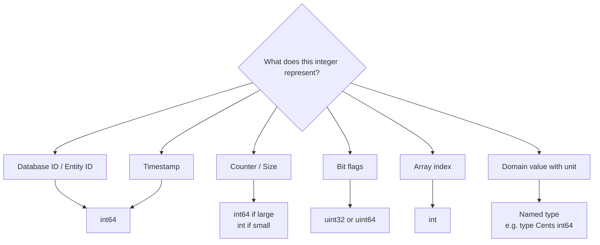

# Integers — Senior Level

## Introduction
> Focus: "How to optimize?" and "How to architect?"

Senior-level integer knowledge means writing integer code that is correct under all conditions: overflow-safe, architecture-aware, and optimally performant. This document covers architectural patterns for integer-heavy systems, overflow detection strategies, SIMD-friendly integer code, and lessons from production failures.

---

## Architectural Integer Patterns

### The Strong Newtype Pattern

```go
// Define domain-specific integer types that cannot be accidentally mixed
type UserID int64
type ProductID int64
type OrderID int64
type Price int64     // cents
type Quantity int32

// This prevents passing UserID where ProductID is expected
func PlaceOrder(user UserID, product ProductID, qty Quantity, price Price) (OrderID, error) {
    // all types are distinct — compile-time safety
    return OrderID(generateID()), nil
}

// Methods on domain types
func (p Price) IsValid() bool        { return p > 0 }
func (p Price) WithTax(bps int64) Price { return p + p*Price(bps)/10000 }
func (p Price) String() string       { return fmt.Sprintf("$%d.%02d", p/100, p%100) }
```

### Integer ID Design Decisions

```go
// Option 1: Sequential int64 (database auto-increment)
// Pros: simple, sortable by time, predictable size
// Cons: guessable, reveals count, sequential guessing attacks
type SeqID int64

// Option 2: Random int64 (crypto random)
// Pros: unguessable
// Cons: no time ordering, collision risk (very low but nonzero)
import "crypto/rand"
func NewRandomID() int64 {
    var b [8]byte
    rand.Read(b[:])
    return int64(binary.BigEndian.Uint64(b[:]) >> 1) // clear sign bit
}

// Option 3: Snowflake-like (time + worker + sequence)
// Pros: sortable, unguessable without context, distributed
// Structure: 41-bit ms + 10-bit worker + 12-bit sequence
```

---

## Overflow Detection Strategies

### Using math/bits for Overflow-Safe Arithmetic

```go
import "math/bits"

// Safe unsigned addition
func safeAddUint64(a, b uint64) (uint64, bool) {
    sum, carry := bits.Add64(a, b, 0)
    return sum, carry != 0
}

// Safe unsigned multiplication
func safeMulUint64(a, b uint64) (uint64, bool) {
    hi, lo := bits.Mul64(a, b)
    return lo, hi != 0
}

// Safe signed addition (using wider type)
func safeAddInt32(a, b int32) (int32, error) {
    result := int64(a) + int64(b)
    if result > math.MaxInt32 || result < math.MinInt32 {
        return 0, fmt.Errorf("int32 overflow: %d + %d = %d", a, b, result)
    }
    return int32(result), nil
}
```

### Production Overflow Guard

```go
type SafeInt64 int64

var ErrOverflow = errors.New("integer overflow")

func (a SafeInt64) Add(b SafeInt64) (SafeInt64, error) {
    if b > 0 && a > SafeInt64(math.MaxInt64)-b {
        return 0, fmt.Errorf("%w: %d + %d", ErrOverflow, a, b)
    }
    if b < 0 && a < SafeInt64(math.MinInt64)-b {
        return 0, fmt.Errorf("%w: %d + %d", ErrOverflow, a, b)
    }
    return a + b, nil
}
```

---

## Performance Engineering

### Cache-Friendly Integer Arrays

```go
// Small integers pack more data per cache line
// Cache line = 64 bytes

// int64 array: 8 values per cache line
data64 := make([]int64, 1000000)

// int32 array: 16 values per cache line (2x more cache-friendly)
data32 := make([]int32, 1000000)

// int8 array: 64 values per cache line (8x more cache-friendly)
// Use when values fit in int8 range
data8 := make([]int8, 1000000)

// Benchmark shows: int8 array sum is ~3x faster than int64 for large arrays
// due to cache efficiency
```

### SIMD-Friendly Integer Operations

```go
// Go's SIMD auto-vectorization works best with:
// 1. Simple loops with no data dependencies
// 2. Power-of-2 array sizes (alignment)
// 3. Consistent types (no mixed int32/int64)

// This loop auto-vectorizes on AMD64 (4 int64 ops per AVX instruction):
func sumInt64(data []int64) int64 {
    var sum int64
    for _, v := range data {
        sum += v
    }
    return sum
}
```

### Branchless Integer Algorithms

```go
// Branchless absolute value
func abs64(x int64) int64 {
    mask := x >> 63  // 0 if positive, -1 if negative
    return (x ^ mask) - mask
}

// Branchless min
func minInt(a, b int) int {
    diff := a - b
    mask := diff >> (bits.UintSize - 1) // all 1s if negative
    return b + (diff & mask)
}

// Branchless clamp
func clamp(x, lo, hi int) int {
    if x < lo { return lo }  // compiler generates CMOV (no branch)
    if x > hi { return hi }
    return x
}
```

---

## Postmortems & System Failures

### Failure 1: CloudFlare Loop Bug (2017)
A subtle unsigned integer underflow in a length calculation caused an infinite loop in production, affecting DNS resolution for millions of sites. A `uint` variable was decremented below 0, wrapping to MaxUint and running for billions of iterations before engineers noticed.
**Lesson**: Use signed `int` for loop counters. Validate user-provided lengths before using as unsigned.

### Failure 2: Facebook Integer Overflow (2021)
BGP routing tables stored as 32-bit integers overflowed during a configuration change, contributing to a 6-hour global outage. Internal counters representing route counts wrapped silently.
**Lesson**: Use `int64` for any counter that might grow large. Add instrumentation to detect when values approach type limits.

### Failure 3: Database ID Exhaustion
A startup used `int32` for auto-increment primary keys. After 2.1 billion records (typical for any moderately successful app), the database silently started generating negative IDs, corrupting foreign key relationships.
**Lesson**: Always use `int64` (BIGINT) for database primary keys.

---

## Concurrency with Integer Types

### Atomic Integer Operations

```go
import "sync/atomic"

type Counter struct {
    _    [0]func() // prevents unkeyed initialization
    value int64    // must be int64, and 64-bit aligned
}

func NewCounter() *Counter { return &Counter{} }
func (c *Counter) Inc() { atomic.AddInt64(&c.value, 1) }
func (c *Counter) Dec() { atomic.AddInt64(&c.value, -1) }
func (c *Counter) Get() int64 { return atomic.LoadInt64(&c.value) }
func (c *Counter) Reset() { atomic.StoreInt64(&c.value, 0) }
```

---

## Best Practices

1. Use domain types (newtype pattern) for all business integers
2. Use `int64` for any counter, ID, or timestamp
3. Implement overflow detection in safety-critical code
4. Use `math/bits` for low-level integer operations
5. Prefer signed `int` for loop variables (unsigned underflow is a common bug)
6. Add `Stringer` to integer domain types for better debugging
7. Test integer boundary conditions: 0, 1, MaxInt, MinInt, MaxInt-1

---

## Test Strategies

```go
// Table-driven overflow tests
func TestSafeAdd(t *testing.T) {
    tests := []struct {
        a, b     int64
        wantErr  bool
        wantResult int64
    }{
        {math.MaxInt64, 1, true, 0},
        {math.MinInt64, -1, true, 0},
        {math.MaxInt64, 0, false, math.MaxInt64},
        {0, 0, false, 0},
        {1, 2, false, 3},
    }
    for _, tt := range tests {
        result, err := safeAddInt64(tt.a, tt.b)
        if (err != nil) != tt.wantErr {
            t.Errorf("safeAdd(%d, %d) err=%v, wantErr=%v", tt.a, tt.b, err, tt.wantErr)
        }
        if err == nil && result != tt.wantResult {
            t.Errorf("safeAdd(%d, %d) = %d, want %d", tt.a, tt.b, result, tt.wantResult)
        }
    }
}
```

---

## Summary

Senior integer programming is about correctness guarantees and performance at scale. Key techniques: strong domain types for compile-time safety, overflow detection using `math/bits` or wider types, cache-friendly array design, branchless algorithms for hot paths, and atomic operations for concurrent counters. Historical failures (Cloudflare, Facebook, database ID exhaustion) show that integer type mistakes are not theoretical — they cause real outages.

---

## Diagrams & Visual Aids

### Integer Type Selection Tree


