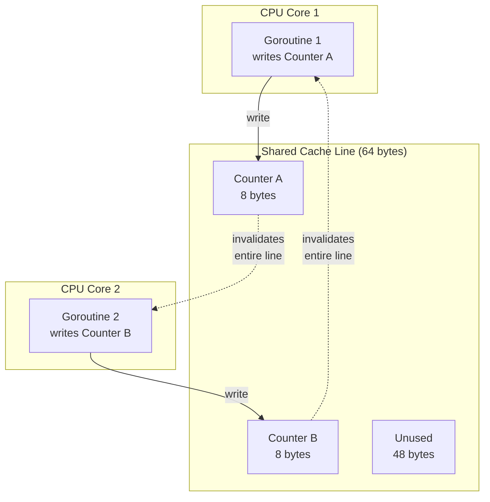
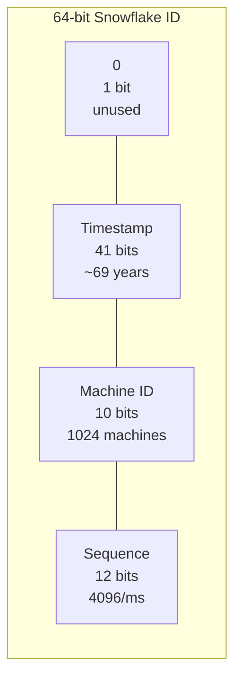
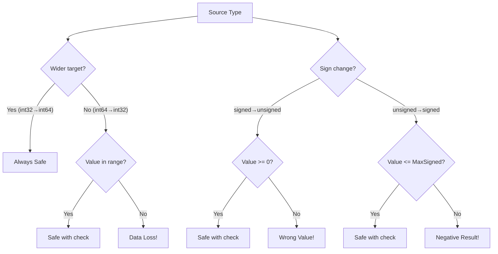
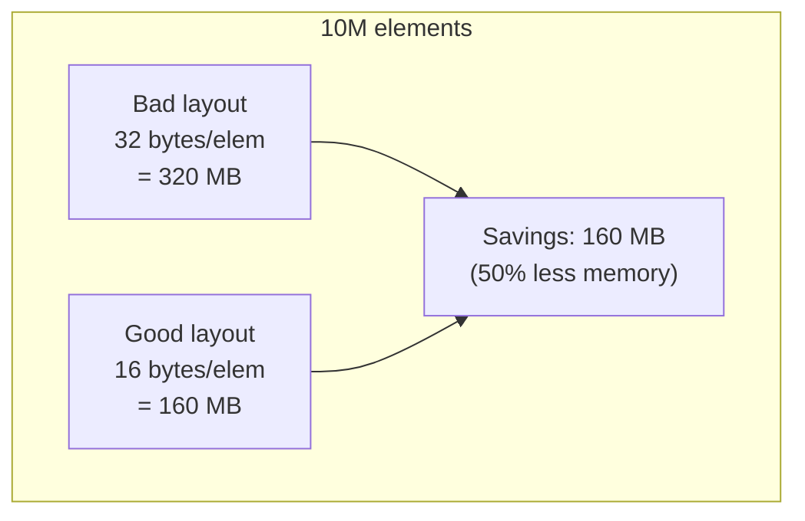

# Integers (Signed & Unsigned) — Senior Level

## Table of Contents

1. [Introduction](#introduction)
2. [Core Concepts](#core-concepts)
3. [Pros & Cons](#pros--cons)
4. [Use Cases](#use-cases)
5. [Code Examples](#code-examples)
6. [Coding Patterns](#coding-patterns)
7. [Clean Code](#clean-code)
8. [Best Practices](#best-practices)
9. [Product Use / Feature](#product-use--feature)
10. [Error Handling](#error-handling)
11. [Security Considerations](#security-considerations)
12. [Performance Optimization](#performance-optimization)
13. [Metrics & Analytics](#metrics--analytics)
14. [Debugging Guide](#debugging-guide)
15. [Edge Cases & Pitfalls](#edge-cases--pitfalls)
16. [Postmortems](#postmortems)
17. [Common Mistakes](#common-mistakes)
18. [Tricky Points](#tricky-points)
19. [Comparison with Other Languages](#comparison-with-other-languages)
20. [Test](#test)
21. [Tricky Questions](#tricky-questions)
22. [Cheat Sheet](#cheat-sheet)
23. [Summary](#summary)
24. [What You Can Build](#what-you-can-build)
25. [Further Reading](#further-reading)
26. [Related Topics](#related-topics)
27. [Diagrams & Visual Aids](#diagrams--visual-aids)

---

## Introduction

> Focus: "How to optimize?" and "How to architect?"

At the senior level, integer handling is about making architectural decisions that affect system reliability, performance at scale, and long-term maintainability. You need to understand when silent overflow creates security vulnerabilities, how struct padding wastes megabytes in large collections, when `big.Int` is acceptable and when it becomes a bottleneck, and how to design integer-based systems (counters, identifiers, hash functions) that scale to billions of operations.

This level covers production-hardened overflow protection, cache-line-aware data layout, lock-free concurrent counters, integer-based encodings for performance-critical systems, and real postmortem scenarios where integer issues caused production failures.

---

## Core Concepts

### Concept 1: Cache-Line-Aware Integer Layout

Modern CPUs load memory in cache lines (typically 64 bytes). When multiple goroutines access integers on the same cache line, **false sharing** occurs — each write invalidates the cache line on all other cores.

```go
package main

import (
    "fmt"
    "sync"
    "sync/atomic"
    "testing"
    "unsafe"
)

// Bad: counters on the same cache line
type SharedCounters struct {
    ReadCount  atomic.Int64
    WriteCount atomic.Int64
    ErrorCount atomic.Int64
}

// Good: pad each counter to its own cache line
type PaddedCounters struct {
    ReadCount  atomic.Int64
    _pad1      [56]byte // 64 - 8 = 56 bytes padding
    WriteCount atomic.Int64
    _pad2      [56]byte
    ErrorCount atomic.Int64
    _pad3      [56]byte
}

func main() {
    fmt.Printf("SharedCounters size: %d bytes\n", unsafe.Sizeof(SharedCounters{}))
    fmt.Printf("PaddedCounters size: %d bytes\n", unsafe.Sizeof(PaddedCounters{}))
    _ = sync.WaitGroup{}
    _ = testing.Benchmark
}
```

### Concept 2: Lock-Free Data Structures with CAS

Compare-and-swap (CAS) operations enable building lock-free counters, stacks, and sequences.

```go
package main

import (
    "fmt"
    "sync"
    "sync/atomic"
)

// Lock-free monotonic ID generator
type IDGenerator struct {
    current atomic.Uint64
}

func (g *IDGenerator) Next() uint64 {
    return g.current.Add(1)
}

// Lock-free max tracker
type MaxTracker struct {
    value atomic.Int64
}

func (m *MaxTracker) Update(v int64) {
    for {
        old := m.value.Load()
        if v <= old {
            return
        }
        if m.value.CompareAndSwap(old, v) {
            return
        }
    }
}

func (m *MaxTracker) Get() int64 {
    return m.value.Load()
}

func main() {
    gen := &IDGenerator{}
    tracker := &MaxTracker{}

    var wg sync.WaitGroup
    for i := 0; i < 100; i++ {
        wg.Add(1)
        go func() {
            defer wg.Done()
            id := gen.Next()
            tracker.Update(int64(id))
        }()
    }
    wg.Wait()

    fmt.Printf("Last ID: %d\n", gen.current.Load())
    fmt.Printf("Max seen: %d\n", tracker.Get())
}
```

### Concept 3: Integer Encoding Schemes

Efficient integer encoding reduces storage and network bandwidth for systems handling millions of values.

```go
package main

import (
    "encoding/binary"
    "fmt"
)

// Varint encoding: small numbers use fewer bytes
func main() {
    values := []int64{0, 1, 127, 128, 16383, 16384, 2097151}

    for _, v := range values {
        buf := make([]byte, binary.MaxVarintLen64)
        n := binary.PutVarint(buf, v)
        fmt.Printf("Value: %8d -> %d bytes (hex: %x)\n", v, n, buf[:n])
    }

    // ZigZag encoding for signed values (used by Protocol Buffers)
    for _, v := range []int64{0, -1, 1, -2, 2, -64, 64} {
        encoded := zigzagEncode(v)
        decoded := zigzagDecode(encoded)
        fmt.Printf("Value: %4d -> zigzag: %d -> decoded: %d\n", v, encoded, decoded)
    }
}

func zigzagEncode(n int64) uint64 {
    return uint64((n << 1) ^ (n >> 63))
}

func zigzagDecode(n uint64) int64 {
    return int64((n >> 1) ^ -(n & 1))
}
```

### Concept 4: SIMD-Friendly Integer Arrays

Structuring data for vectorization allows the compiler and CPU to process multiple integers simultaneously.

```go
package main

import "fmt"

// Structure of Arrays (SoA) — cache-friendly, SIMD-friendly
type ParticlesSoA struct {
    X []int32
    Y []int32
    Z []int32
    Mass []int32
}

// Array of Structures (AoS) — less cache-friendly for bulk operations
type Particle struct {
    X, Y, Z, Mass int32
}
type ParticlesAoS []Particle

func (p *ParticlesSoA) AddGravity(g int32) {
    // This loop is SIMD-friendly — processes contiguous int32 slice
    for i := range p.Y {
        p.Y[i] += g
    }
}

func (p ParticlesAoS) AddGravity(g int32) {
    // This loop has stride-4 access — less cache-friendly
    for i := range p {
        p[i].Y += g
    }
}

func main() {
    n := 1000
    soa := &ParticlesSoA{
        X: make([]int32, n),
        Y: make([]int32, n),
        Z: make([]int32, n),
        Mass: make([]int32, n),
    }
    soa.AddGravity(-10)
    fmt.Printf("SoA Y[0] = %d\n", soa.Y[0])
}
```

### Concept 5: Generics with Integer Constraints

Go 1.18+ generics allow writing type-safe functions that work across all integer types.

```go
package main

import (
    "fmt"
    "golang.org/x/exp/constraints"
)

// Works with any integer type
func SafeAdd[T constraints.Integer](a, b T) (T, bool) {
    result := a + b
    // For unsigned: overflow if result < a
    // For signed: overflow if signs match but result sign differs
    if (a > 0 && b > 0 && result < 0) || (a < 0 && b < 0 && result > 0) {
        return 0, false
    }
    // Unsigned overflow check
    if result < a && b > 0 {
        return 0, false
    }
    return result, true
}

func Abs[T constraints.Signed](n T) T {
    if n < 0 {
        return -n
    }
    return n
}

func Sum[T constraints.Integer](values []T) T {
    var total T
    for _, v := range values {
        total += v
    }
    return total
}

func main() {
    fmt.Println(Sum([]int{1, 2, 3, 4, 5}))
    fmt.Println(Sum([]int64{100, 200, 300}))
    fmt.Println(Sum([]uint8{10, 20, 30}))
    fmt.Println(Abs(int32(-42)))
}
```

---

## Pros & Cons

| Aspect | Pros | Cons |
|--------|------|------|
| **Overflow semantics** | Predictable wraparound, no UB like C | Silent bugs; must manually detect |
| **Strict typing** | Prevents accidental misuse across types | Conversion boilerplate in complex code |
| **Atomic operations** | Lock-free concurrency primitives | Only available for specific sizes |
| **Generics** | Write once for all integer types | Type constraint complexity |
| **Memory layout** | Full control over padding/alignment | Must manually optimize struct layout |
| **big.Int** | Arbitrary precision when needed | 10-100x slower than native integers |

---

## Use Cases

### Use Case 1: Distributed Counter System

```go
package main

import (
    "fmt"
    "sync"
    "sync/atomic"
)

// Sharded counter to minimize contention
type ShardedCounter struct {
    shards [16]struct {
        count atomic.Int64
        _pad  [56]byte
    }
}

func (c *ShardedCounter) Inc(goroutineID int) {
    shard := goroutineID & 15 // fast modulo for power of 2
    c.shards[shard].count.Add(1)
}

func (c *ShardedCounter) Total() int64 {
    var total int64
    for i := range c.shards {
        total += c.shards[i].count.Load()
    }
    return total
}

func main() {
    counter := &ShardedCounter{}
    var wg sync.WaitGroup

    for i := 0; i < 1000; i++ {
        wg.Add(1)
        id := i
        go func() {
            defer wg.Done()
            for j := 0; j < 1000; j++ {
                counter.Inc(id)
            }
        }()
    }

    wg.Wait()
    fmt.Printf("Total: %d\n", counter.Total()) // 1,000,000
}
```

### Use Case 2: Snowflake ID Generator

```go
package main

import (
    "fmt"
    "sync"
    "time"
)

// Snowflake ID: 64-bit unique ID
// [1 bit unused][41 bits timestamp][10 bits machine][12 bits sequence]
type Snowflake struct {
    mu        sync.Mutex
    epoch     int64 // custom epoch in milliseconds
    machineID int64
    sequence  int64
    lastTime  int64
}

func NewSnowflake(machineID int64) *Snowflake {
    return &Snowflake{
        epoch:     1609459200000, // 2021-01-01 00:00:00 UTC
        machineID: machineID & 0x3FF, // 10 bits
    }
}

func (s *Snowflake) Generate() int64 {
    s.mu.Lock()
    defer s.mu.Unlock()

    now := time.Now().UnixMilli() - s.epoch

    if now == s.lastTime {
        s.sequence = (s.sequence + 1) & 0xFFF // 12 bits
        if s.sequence == 0 {
            // Sequence exhausted, wait for next millisecond
            for now <= s.lastTime {
                now = time.Now().UnixMilli() - s.epoch
            }
        }
    } else {
        s.sequence = 0
    }

    s.lastTime = now
    return (now << 22) | (s.machineID << 12) | s.sequence
}

func (s *Snowflake) Parse(id int64) (timestamp int64, machineID int64, sequence int64) {
    timestamp = (id >> 22) + s.epoch
    machineID = (id >> 12) & 0x3FF
    sequence = id & 0xFFF
    return
}

func main() {
    sf := NewSnowflake(1)
    for i := 0; i < 5; i++ {
        id := sf.Generate()
        ts, mid, seq := sf.Parse(id)
        t := time.UnixMilli(ts)
        fmt.Printf("ID: %d | Time: %s | Machine: %d | Seq: %d\n",
            id, t.Format(time.RFC3339), mid, seq)
    }
}
```

---

## Code Examples

### Example 1: Overflow-Safe Arithmetic Library with Generics

```go
package main

import (
    "errors"
    "fmt"
    "math"
)

var (
    ErrOverflow  = errors.New("integer overflow")
    ErrUnderflow = errors.New("integer underflow")
    ErrDivZero   = errors.New("division by zero")
)

type SafeInt64 struct {
    Value int64
}

func NewSafeInt64(v int64) SafeInt64 {
    return SafeInt64{Value: v}
}

func (a SafeInt64) Add(b SafeInt64) (SafeInt64, error) {
    if b.Value > 0 && a.Value > math.MaxInt64-b.Value {
        return SafeInt64{}, ErrOverflow
    }
    if b.Value < 0 && a.Value < math.MinInt64-b.Value {
        return SafeInt64{}, ErrUnderflow
    }
    return SafeInt64{Value: a.Value + b.Value}, nil
}

func (a SafeInt64) Mul(b SafeInt64) (SafeInt64, error) {
    if a.Value == 0 || b.Value == 0 {
        return SafeInt64{}, nil
    }
    result := a.Value * b.Value
    if result/a.Value != b.Value {
        return SafeInt64{}, ErrOverflow
    }
    return SafeInt64{Value: result}, nil
}

func (a SafeInt64) Div(b SafeInt64) (SafeInt64, error) {
    if b.Value == 0 {
        return SafeInt64{}, ErrDivZero
    }
    if a.Value == math.MinInt64 && b.Value == -1 {
        return SafeInt64{}, ErrOverflow
    }
    return SafeInt64{Value: a.Value / b.Value}, nil
}

func main() {
    a := NewSafeInt64(math.MaxInt64)
    b := NewSafeInt64(1)

    result, err := a.Add(b)
    if err != nil {
        fmt.Printf("Add overflow: %v\n", err)
    }

    c := NewSafeInt64(math.MinInt64)
    d := NewSafeInt64(-1)
    result, err = c.Div(d)
    if err != nil {
        fmt.Printf("Div overflow: %v\n", err)
    }
    _ = result
}
```

### Example 2: High-Performance Bitmap

```go
package main

import (
    "fmt"
    "math/bits"
    "strings"
)

type Bitmap struct {
    words []uint64
    size  int
}

func NewBitmap(size int) *Bitmap {
    nwords := (size + 63) / 64
    return &Bitmap{
        words: make([]uint64, nwords),
        size:  size,
    }
}

func (b *Bitmap) Set(pos int)    { b.words[pos/64] |= 1 << (uint(pos) % 64) }
func (b *Bitmap) Clear(pos int)  { b.words[pos/64] &^= 1 << (uint(pos) % 64) }
func (b *Bitmap) Test(pos int) bool { return b.words[pos/64]&(1<<(uint(pos)%64)) != 0 }

func (b *Bitmap) Count() int {
    count := 0
    for _, w := range b.words {
        count += bits.OnesCount64(w)
    }
    return count
}

func (b *Bitmap) And(other *Bitmap) *Bitmap {
    result := NewBitmap(b.size)
    for i := range result.words {
        result.words[i] = b.words[i] & other.words[i]
    }
    return result
}

func (b *Bitmap) Or(other *Bitmap) *Bitmap {
    result := NewBitmap(b.size)
    for i := range result.words {
        result.words[i] = b.words[i] | other.words[i]
    }
    return result
}

func (b *Bitmap) String() string {
    var sb strings.Builder
    for i := 0; i < b.size; i++ {
        if b.Test(i) {
            sb.WriteByte('1')
        } else {
            sb.WriteByte('0')
        }
    }
    return sb.String()
}

func main() {
    bm := NewBitmap(16)
    bm.Set(0)
    bm.Set(3)
    bm.Set(7)
    bm.Set(15)

    fmt.Printf("Bitmap: %s\n", bm)
    fmt.Printf("Count: %d\n", bm.Count())
    fmt.Printf("Test(3): %v\n", bm.Test(3))
    fmt.Printf("Test(4): %v\n", bm.Test(4))

    bm2 := NewBitmap(16)
    bm2.Set(3)
    bm2.Set(4)
    bm2.Set(7)

    intersection := bm.And(bm2)
    fmt.Printf("AND: %s (count=%d)\n", intersection, intersection.Count())
}
```

### Example 3: Benchmarking Integer Operations

```go
package main

import (
    "fmt"
    "math/big"
    "testing"
    "time"
)

func benchmarkNativeAdd(n int) time.Duration {
    start := time.Now()
    var sum int64
    for i := 0; i < n; i++ {
        sum += int64(i)
    }
    elapsed := time.Since(start)
    _ = sum
    return elapsed
}

func benchmarkBigIntAdd(n int) time.Duration {
    start := time.Now()
    sum := new(big.Int)
    for i := 0; i < n; i++ {
        sum.Add(sum, big.NewInt(int64(i)))
    }
    elapsed := time.Since(start)
    return elapsed
}

func benchmarkAtomicAdd(n int) time.Duration {
    start := time.Now()
    var counter int64
    for i := 0; i < n; i++ {
        counter += int64(i)
    }
    elapsed := time.Since(start)
    _ = counter
    return elapsed
}

func main() {
    n := 10_000_000

    native := benchmarkNativeAdd(n)
    bigint := benchmarkBigIntAdd(n)

    fmt.Printf("Native int64 add (%d ops): %v\n", n, native)
    fmt.Printf("big.Int add (%d ops):      %v\n", n, bigint)
    fmt.Printf("big.Int is %.1fx slower\n", float64(bigint)/float64(native))

    _ = testing.Benchmark
}
```

---

## Coding Patterns

### Pattern 1: Epoch-Based Versioning

```go
package main

import (
    "fmt"
    "sync/atomic"
    "time"
)

// Epoch is packed into upper bits, counter in lower bits
type VersionedCounter struct {
    state atomic.Uint64 // [32 bits epoch][32 bits counter]
}

func (vc *VersionedCounter) Increment() (epoch uint32, counter uint32) {
    for {
        old := vc.state.Load()
        oldEpoch := uint32(old >> 32)
        oldCount := uint32(old & 0xFFFFFFFF)

        newEpoch := uint32(time.Now().Unix())
        var newCount uint32
        if newEpoch == oldEpoch {
            newCount = oldCount + 1
        } else {
            newCount = 1
        }

        newState := uint64(newEpoch)<<32 | uint64(newCount)
        if vc.state.CompareAndSwap(old, newState) {
            return newEpoch, newCount
        }
    }
}

func main() {
    vc := &VersionedCounter{}
    for i := 0; i < 5; i++ {
        epoch, counter := vc.Increment()
        fmt.Printf("Epoch: %d, Counter: %d\n", epoch, counter)
    }
}
```

### Pattern 2: Integer Pool with Bit Tracking

```go
package main

import (
    "fmt"
    "math/bits"
    "sync"
)

// Allocates integer IDs from 0..63 using a single uint64
type IDPool struct {
    mu   sync.Mutex
    used uint64
}

func (p *IDPool) Allocate() (int, bool) {
    p.mu.Lock()
    defer p.mu.Unlock()

    free := ^p.used
    if free == 0 {
        return 0, false // all 64 IDs in use
    }
    // Find lowest free bit
    id := bits.TrailingZeros64(free)
    p.used |= 1 << id
    return id, true
}

func (p *IDPool) Release(id int) {
    p.mu.Lock()
    defer p.mu.Unlock()
    p.used &^= 1 << id
}

func (p *IDPool) Available() int {
    p.mu.Lock()
    defer p.mu.Unlock()
    return 64 - bits.OnesCount64(p.used)
}

func main() {
    pool := &IDPool{}

    ids := make([]int, 0)
    for i := 0; i < 5; i++ {
        id, ok := pool.Allocate()
        if ok {
            ids = append(ids, id)
            fmt.Printf("Allocated ID: %d\n", id)
        }
    }
    fmt.Printf("Available: %d\n", pool.Available())

    pool.Release(ids[2])
    fmt.Printf("After releasing %d, available: %d\n", ids[2], pool.Available())

    id, _ := pool.Allocate()
    fmt.Printf("Re-allocated ID: %d\n", id) // reuses released ID
}
```

---

## Clean Code

### Type-Safe Wrappers

```go
// Define distinct types for IDs to prevent mixing
type UserID int64
type OrderID int64
type ProductID int64

// This prevents accidentally passing an OrderID where a UserID is expected
func GetUser(id UserID) { /* ... */ }
func GetOrder(id OrderID) { /* ... */ }

// Compile error: cannot use orderID (OrderID) as UserID
// GetUser(OrderID(123))
```

### Constants Over Magic Numbers

```go
const (
    MaxBatchSize    = 1000
    DefaultPageSize = 50
    MaxPageSize     = 200

    // Byte size constants
    KB = 1024
    MB = 1024 * KB
    GB = 1024 * MB

    // Time constants in milliseconds
    ReadTimeoutMs  = 5_000
    WriteTimeoutMs = 10_000

    // Bit masks
    LowerNibble = 0x0F
    UpperNibble = 0xF0
    LowByte     = 0xFF
)
```

---

## Best Practices

1. **Use type aliases for domain IDs** — prevents mixing `UserID` with `OrderID`
2. **Pad concurrent counters to cache lines** — prevents false sharing
3. **Use `atomic.Int64` over `atomic.AddInt64`** — safer API, no pointer aliasing
4. **Prefer structure-of-arrays for bulk integer processing** — better cache utilization
5. **Use varint encoding for storage** — reduces disk/network usage for small values
6. **Profile before optimizing** — `go tool pprof` shows where integer operations matter
7. **Use `math/bits` for portable bit manipulation** — compiler optimizes to hardware instructions
8. **Benchmark with `testing.B`** — `b.ReportAllocs()` reveals hidden allocations
9. **Document overflow behavior** — comment when overflow is intentional (e.g., hash functions)
10. **Use generics for integer utilities** — write once, type-safe for all integer types

---

## Product Use / Feature

### High-Performance Event Counter

```go
package main

import (
    "fmt"
    "sync"
    "sync/atomic"
    "time"
)

type EventCounter struct {
    buckets    [60]atomic.Int64 // one per second, circular
    currentIdx atomic.Int32
    startTime  time.Time
}

func NewEventCounter() *EventCounter {
    ec := &EventCounter{startTime: time.Now()}
    go ec.rotator()
    return ec
}

func (ec *EventCounter) rotator() {
    ticker := time.NewTicker(time.Second)
    for range ticker.C {
        idx := int32(time.Since(ec.startTime).Seconds()) % 60
        ec.currentIdx.Store(idx)
        // Clear the next bucket
        next := (idx + 1) % 60
        ec.buckets[next].Store(0)
    }
}

func (ec *EventCounter) Record() {
    idx := ec.currentIdx.Load()
    ec.buckets[idx].Add(1)
}

func (ec *EventCounter) LastMinute() int64 {
    var total int64
    for i := range ec.buckets {
        total += ec.buckets[i].Load()
    }
    return total
}

func main() {
    counter := NewEventCounter()

    var wg sync.WaitGroup
    for i := 0; i < 100; i++ {
        wg.Add(1)
        go func() {
            defer wg.Done()
            for j := 0; j < 1000; j++ {
                counter.Record()
            }
        }()
    }
    wg.Wait()

    fmt.Printf("Events in last minute: %d\n", counter.LastMinute())
}
```

---

## Error Handling

### Production-Grade Integer Validation

```go
package main

import (
    "fmt"
    "math"
    "strconv"
)

type IntegerValidator struct {
    Name    string
    Min     int64
    Max     int64
    AllowZero bool
}

type ValidationResult struct {
    Value  int64
    Errors []string
}

func (v IntegerValidator) Validate(input string) ValidationResult {
    result := ValidationResult{}

    if input == "" {
        result.Errors = append(result.Errors,
            fmt.Sprintf("%s: empty input", v.Name))
        return result
    }

    parsed, err := strconv.ParseInt(input, 10, 64)
    if err != nil {
        if numErr, ok := err.(*strconv.NumError); ok {
            switch numErr.Err {
            case strconv.ErrRange:
                result.Errors = append(result.Errors,
                    fmt.Sprintf("%s: value out of int64 range", v.Name))
            case strconv.ErrSyntax:
                result.Errors = append(result.Errors,
                    fmt.Sprintf("%s: not a valid integer", v.Name))
            }
        }
        return result
    }

    result.Value = parsed

    if !v.AllowZero && parsed == 0 {
        result.Errors = append(result.Errors,
            fmt.Sprintf("%s: zero not allowed", v.Name))
    }
    if parsed < v.Min {
        result.Errors = append(result.Errors,
            fmt.Sprintf("%s: %d below minimum %d", v.Name, parsed, v.Min))
    }
    if parsed > v.Max {
        result.Errors = append(result.Errors,
            fmt.Sprintf("%s: %d above maximum %d", v.Name, parsed, v.Max))
    }

    return result
}

func main() {
    portValidator := IntegerValidator{
        Name: "port", Min: 1, Max: 65535,
    }
    ageValidator := IntegerValidator{
        Name: "age", Min: 0, Max: 150, AllowZero: true,
    }

    tests := []struct {
        validator IntegerValidator
        input     string
    }{
        {portValidator, "8080"},
        {portValidator, "0"},
        {portValidator, "99999"},
        {portValidator, "abc"},
        {ageValidator, "25"},
        {ageValidator, "999"},
    }

    for _, t := range tests {
        r := t.validator.Validate(t.input)
        if len(r.Errors) > 0 {
            fmt.Printf("FAIL %s=%q: %v\n", t.validator.Name, t.input, r.Errors)
        } else {
            fmt.Printf("OK   %s=%q -> %d\n", t.validator.Name, t.input, r.Value)
        }
    }
    _ = math.MaxInt64
}
```

---

## Security Considerations

### Defense Against Integer-Based Attacks

```go
package main

import (
    "fmt"
    "math"
)

// Checked multiplication for allocation sizes
func checkedMul(a, b int64) (int64, bool) {
    if a == 0 || b == 0 {
        return 0, true
    }
    result := a * b
    if result/a != b || result < 0 {
        return 0, false
    }
    return result, true
}

// Safe buffer allocation with multiple dimension checks
func allocImageBuffer(width, height, channels int64) ([]byte, error) {
    // Validate individual dimensions
    if width <= 0 || width > 65536 {
        return nil, fmt.Errorf("invalid width: %d", width)
    }
    if height <= 0 || height > 65536 {
        return nil, fmt.Errorf("invalid height: %d", height)
    }
    if channels <= 0 || channels > 4 {
        return nil, fmt.Errorf("invalid channels: %d", channels)
    }

    // Check multiplication overflow at each step
    pixels, ok := checkedMul(width, height)
    if !ok {
        return nil, fmt.Errorf("width * height overflows")
    }

    totalBytes, ok := checkedMul(pixels, channels)
    if !ok {
        return nil, fmt.Errorf("total size overflows")
    }

    const maxAlloc = 256 * 1024 * 1024 // 256 MB
    if totalBytes > maxAlloc {
        return nil, fmt.Errorf("allocation too large: %d bytes (max %d)", totalBytes, maxAlloc)
    }

    return make([]byte, totalBytes), nil
}

func main() {
    // Normal case
    buf, err := allocImageBuffer(1920, 1080, 4)
    if err != nil {
        fmt.Println("Error:", err)
    } else {
        fmt.Printf("Allocated %d bytes for 1920x1080 RGBA\n", len(buf))
    }

    // Attack: overflow attempt
    _, err = allocImageBuffer(math.MaxInt32, math.MaxInt32, 4)
    fmt.Println("Overflow attempt:", err)

    // Attack: huge allocation
    _, err = allocImageBuffer(65536, 65536, 4)
    fmt.Println("Huge allocation:", err)
}
```

---

## Performance Optimization

### Benchmark: Struct Layout Impact

```go
package main

import (
    "fmt"
    "testing"
    "time"
    "unsafe"
)

type BadLayout struct {
    Active bool
    Score  int64
    Rank   int32
    Flag   bool
}

type GoodLayout struct {
    Score  int64
    Rank   int32
    Active bool
    Flag   bool
}

func benchmarkSum(size int) {
    bad := make([]BadLayout, size)
    good := make([]GoodLayout, size)

    // Initialize
    for i := range bad {
        bad[i] = BadLayout{Score: int64(i)}
        good[i] = GoodLayout{Score: int64(i)}
    }

    start := time.Now()
    var sumBad int64
    for i := range bad {
        sumBad += bad[i].Score
    }
    badTime := time.Since(start)

    start = time.Now()
    var sumGood int64
    for i := range good {
        sumGood += good[i].Score
    }
    goodTime := time.Since(start)

    fmt.Printf("Bad layout  (%2d bytes): %v (sum=%d)\n",
        unsafe.Sizeof(BadLayout{}), badTime, sumBad)
    fmt.Printf("Good layout (%2d bytes): %v (sum=%d)\n",
        unsafe.Sizeof(GoodLayout{}), goodTime, sumGood)
}

func main() {
    benchmarkSum(10_000_000)
    _ = testing.Benchmark
}
```

### Benchmark: Division vs Bit Shift

```go
// Benchmark file: integer_bench_test.go
// Run with: go test -bench=. -benchmem

package main

import "testing"

func BenchmarkDivision(b *testing.B) {
    x := int64(123456789)
    for i := 0; i < b.N; i++ {
        _ = x / 8
    }
}

func BenchmarkBitShift(b *testing.B) {
    x := int64(123456789)
    for i := 0; i < b.N; i++ {
        _ = x >> 3
    }
}

func BenchmarkModulo(b *testing.B) {
    x := int64(123456789)
    for i := 0; i < b.N; i++ {
        _ = x % 16
    }
}

func BenchmarkBitAnd(b *testing.B) {
    x := int64(123456789)
    for i := 0; i < b.N; i++ {
        _ = x & 15
    }
}
```

---

## Metrics & Analytics

```go
package main

import (
    "fmt"
    "math"
    "sync/atomic"
    "time"
)

type HistogramBucket struct {
    UpperBound int64
    Count      atomic.Int64
}

type IntHistogram struct {
    Buckets []HistogramBucket
}

func NewIntHistogram(bounds []int64) *IntHistogram {
    buckets := make([]HistogramBucket, len(bounds)+1)
    for i, b := range bounds {
        buckets[i].UpperBound = b
    }
    buckets[len(bounds)].UpperBound = math.MaxInt64
    return &IntHistogram{Buckets: buckets}
}

func (h *IntHistogram) Observe(value int64) {
    for i := range h.Buckets {
        if value <= h.Buckets[i].UpperBound {
            h.Buckets[i].Count.Add(1)
            return
        }
    }
}

func (h *IntHistogram) Report() {
    fmt.Printf("=== Histogram at %s ===\n", time.Now().Format(time.RFC3339))
    for _, b := range h.Buckets {
        count := b.Count.Load()
        bar := ""
        for i := int64(0); i < count && i < 50; i++ {
            bar += "#"
        }
        if b.UpperBound == math.MaxInt64 {
            fmt.Printf("  (+inf]: %4d %s\n", count, bar)
        } else {
            fmt.Printf("  (%5d]: %4d %s\n", b.UpperBound, count, bar)
        }
    }
}

func main() {
    hist := NewIntHistogram([]int64{10, 50, 100, 500, 1000})

    values := []int64{5, 12, 47, 3, 99, 200, 750, 50, 10, 1001, 8, 42}
    for _, v := range values {
        hist.Observe(v)
    }

    hist.Report()
}
```

---

## Debugging Guide

### Detecting Data Races on Integers

```go
// Run with: go run -race main.go
package main

import (
    "fmt"
    "sync"
)

func main() {
    // This WILL trigger the race detector
    counter := 0
    var wg sync.WaitGroup
    for i := 0; i < 100; i++ {
        wg.Add(1)
        go func() {
            defer wg.Done()
            counter++ // DATA RACE: unsynchronized write
        }()
    }
    wg.Wait()
    fmt.Println("Counter:", counter) // incorrect result

    // Fix: use sync/atomic
    // var safeCounter atomic.Int64
    // safeCounter.Add(1)
}
```

### Debugging Overflow with Printf

```go
package main

import "fmt"

func debugOverflow() {
    var a, b int32 = 2_000_000_000, 1_000_000_000
    result := a + b

    // Debug: check sign change indicates overflow
    fmt.Printf("a=%d (sign bit: %d)\n", a, uint32(a)>>31)
    fmt.Printf("b=%d (sign bit: %d)\n", b, uint32(b)>>31)
    fmt.Printf("result=%d (sign bit: %d)\n", result, uint32(result)>>31)

    // Both positive but result is negative = overflow
    if a > 0 && b > 0 && result < 0 {
        fmt.Println("OVERFLOW DETECTED!")
    }
}

func main() {
    debugOverflow()
}
```

---

## Edge Cases & Pitfalls

```go
package main

import (
    "fmt"
    "math"
)

func main() {
    // Edge Case 1: MinInt64 has no positive counterpart
    x := int64(math.MinInt64)
    fmt.Println(-x == x) // true! -MinInt64 overflows back to MinInt64

    // Edge Case 2: Comparing lengths of different containers
    s := make([]int, 5)
    m := make(map[int]int)
    m[1] = 1
    m[2] = 2
    // Both len() return int, so this is safe
    fmt.Println(len(s) > len(m))

    // Edge Case 3: Integer division rounds toward zero (not floor)
    fmt.Println(-7 / 2)  // -3 (toward zero), Python gives -4 (floor)
    fmt.Println(-7 % 2)  // -1 (Go), Python gives 1

    // Edge Case 4: Shift count type
    var shift uint = 4
    fmt.Println(1 << shift) // OK: shift count must be unsigned integer type or untyped

    // Edge Case 5: Untyped constant can be huge
    const huge = 1 << 100
    const small = huge >> 99 // = 2, fits in int
    fmt.Println(small)

    // Edge Case 6: Zero-value initialization
    var arr [10]int64 // all zeros
    fmt.Println(arr[0]) // 0
}
```

---

## Postmortems

### Postmortem 1: Counter Overflow Causing Negative Metrics

**Incident:** A metrics dashboard showed negative request counts after running for 292 years worth of nanoseconds (~9.2 x 10^18 ns). In reality, the counter was using `int64` nanosecond timestamps and overflowed when calculating durations across long periods.

**Root Cause:** Using `int64` nanoseconds for absolute timestamps instead of `time.Time`. When two large nanosecond values were subtracted, intermediate calculations overflowed.

**Fix:**
```go
// Bad: raw nanosecond arithmetic
startNs := time.Now().UnixNano()
// ... long operation ...
endNs := time.Now().UnixNano()
durationNs := endNs - startNs // can overflow if values are large

// Good: use time.Duration
start := time.Now()
// ... long operation ...
duration := time.Since(start) // safe subtraction
```

**Lesson:** Use `time.Time` and `time.Duration` instead of raw integer timestamps.

### Postmortem 2: Image Processing DoS via Integer Overflow

**Incident:** An image upload endpoint accepted user-provided width/height values. An attacker sent `width=65536, height=65536, channels=4`, causing `width * height * channels` to overflow `int32`, resulting in a small allocation but large memcpy — crashing the server.

**Root Cause:** Size calculation used `int32` arithmetic without overflow checks.

**Fix:**
```go
// Promote to int64 and validate
size := int64(width) * int64(height) * int64(channels)
if size > maxAllowedSize || size < 0 {
    return ErrImageTooLarge
}
```

**Lesson:** Always use wider types for intermediate size calculations and enforce maximum limits.

### Postmortem 3: Distributed Counter Inconsistency

**Incident:** A sharded counter showed different totals depending on when goroutines read the shards. Concurrent reads and writes without atomics led to torn reads on 32-bit platforms where `int64` operations are not atomic.

**Root Cause:** Non-atomic `int64` reads/writes on 32-bit ARM architecture.

**Fix:** Switched to `atomic.Int64` for all shared counters.

---

## Common Mistakes

| Mistake | Impact | Fix |
|---------|--------|-----|
| Non-atomic concurrent counter | Data races, wrong counts | Use `atomic.Int64` |
| Struct padding waste | Memory bloat in large slices | Order fields by size descending |
| Using `int` in wire protocols | Cross-platform incompatibility | Use fixed-size types |
| `big.Int` in hot path | 100x slower than native | Profile first, use only when needed |
| Ignoring MinInt64 / -1 division | Runtime panic | Check before dividing |
| Mixing atomic and non-atomic access | Undefined behavior, torn reads | Use atomic consistently |

---

## Tricky Points

1. **`-MinInt64 == MinInt64`**: The most negative `int64` has no positive counterpart within `int64`. Negating it overflows back to itself.
2. **`float64(MaxInt64)` loses precision**: `float64` has only 53 bits of mantissa; `MaxInt64` needs 63 bits. The round-trip is lossy.
3. **32-bit atomicity**: On 32-bit platforms, `int64` reads/writes are NOT atomic without `sync/atomic`. A torn read can see half of each value.
4. **Compiler constant folding**: The Go compiler evaluates constant expressions at compile time with arbitrary precision, but variables use machine arithmetic.
5. **`unsafe.Sizeof` returns `uintptr`**: Not `int` — be careful when comparing with `int` values.

---

## Comparison with Other Languages

| Feature | Go | Rust | C++ | Java |
|---------|-----|------|-----|------|
| Overflow (signed) | Silent wrap | Panic (debug) / Wrap (release) | Undefined behavior | Silent wrap |
| Overflow (unsigned) | Silent wrap | Panic (debug) / Wrap (release) | Defined wrap | No unsigned types |
| Checked arithmetic | Manual | `.checked_add()` | `__builtin_add_overflow` | `Math.addExact()` |
| Saturating arithmetic | Manual | `.saturating_add()` | Manual | Manual |
| Wrapping arithmetic | Default | `.wrapping_add()` | Default (unsigned) | Default |
| Integer generics | `constraints.Integer` | `num` traits | Templates | No |
| Arbitrary precision | `math/big` | `num-bigint` | Boost.Multiprecision | `BigInteger` |
| SIMD integers | Compiler auto-vectorization | `std::simd` | Intrinsics/auto | Vector API |

---

## Test

<details>
<summary>Question 1: Why should concurrent counters be padded to cache line boundaries?</summary>

**Answer:** Without padding, multiple counters may share a cache line. When one goroutine writes to its counter, the CPU invalidates the entire cache line for all other cores (false sharing), causing severe performance degradation even though the goroutines are writing to different variables.
</details>

<details>
<summary>Question 2: What happens with float64(math.MaxInt64)?</summary>

**Answer:** `float64` has only 53 bits of mantissa, but `MaxInt64` requires 63 bits. The conversion rounds up to `9.223372036854776e+18`, which when converted back to `int64` overflows to `MinInt64`.
</details>

<details>
<summary>Question 3: When is big.Int appropriate in production?</summary>

**Answer:** When values genuinely exceed `int64` range (>9.2 x 10^18): cryptographic operations (RSA key generation), blockchain computations, scientific computing, and financial calculations requiring exact arbitrary precision. Never use it in hot paths where native integers suffice.
</details>

<details>
<summary>Question 4: Why is struct field ordering important for slices with millions of elements?</summary>

**Answer:** Poor field ordering adds padding bytes between fields to satisfy alignment requirements. For a struct with `bool, int64, bool, int32, bool`, padding can waste 15+ bytes per element. In a slice of 10 million elements, that is 150 MB of wasted memory and reduced cache utilization.
</details>

---

## Tricky Questions

**Q1:** Is `atomic.Int64` safe on 32-bit platforms?
**A:** Yes — `sync/atomic` ensures 64-bit atomicity even on 32-bit platforms by using special instructions or locks internally. Plain `int64` reads/writes are NOT atomic on 32-bit.

**Q2:** Can the Go compiler optimize `x / 8` to `x >> 3`?
**A:** Yes, for unsigned integers. For signed integers, the compiler generates a slightly different sequence to handle negative numbers correctly (arithmetic shift + correction).

**Q3:** What is the maximum number of features you can track with `uint64` bit flags?
**A:** 64 features. For more, use a `[]uint64` bitmap.

---

## Cheat Sheet

| Pattern | Code |
|---------|------|
| Cache-line-padded counter | `struct { count atomic.Int64; _pad [56]byte }` |
| Lock-free max tracker | CAS loop comparing and swapping |
| Snowflake ID | `(timestamp << 22) \| (machineID << 12) \| sequence` |
| Varint encode | `binary.PutVarint(buf, val)` |
| ZigZag encode | `(n << 1) ^ (n >> 63)` |
| Checked multiply | `result := a * b; ok := result/a == b` |
| Bit pool allocate | `id := bits.TrailingZeros64(^used)` |
| Generic integer sum | `func Sum[T constraints.Integer](s []T) T` |
| Struct size check | `unsafe.Sizeof(MyStruct{})` |
| Atomic CAS | `counter.CompareAndSwap(old, new)` |

---

## Summary

- **Cache-line padding** prevents false sharing in concurrent integer counters
- **Lock-free CAS loops** enable high-performance concurrent integer operations
- **Struct field ordering** by size descending minimizes padding waste
- **Overflow checking** must be explicit — use `math/bits.Add64` for carry detection
- **Varint/ZigZag encoding** reduces storage for variable-size integers
- **`big.Int`** is 10-100x slower — profile before using
- **Type-safe ID wrappers** prevent mixing different entity IDs
- **Generics** (`constraints.Integer`) enable reusable integer utilities
- **32-bit platforms** require `sync/atomic` for 64-bit integer safety

---

## What You Can Build

- **Snowflake/ULID ID generator** — distributed unique ID system
- **Bitmap index engine** — fast set operations for analytics queries
- **Lock-free concurrent data structures** — counters, queues, stacks
- **Binary protocol codec** — encode/decode network protocols
- **Feature flag system** — manage 64+ flags per entity with bit arrays
- **Time-series metrics engine** — sliding window counters with atomic operations

---

## Further Reading

- [Go Memory Model](https://go.dev/ref/mem)
- [Package sync/atomic](https://pkg.go.dev/sync/atomic)
- [Package math/bits](https://pkg.go.dev/math/bits)
- [Go Compiler Explorer](https://godbolt.org/) — view assembly output
- [False Sharing in Go](https://go.dev/blog/)
- [Hacker's Delight (book)](https://en.wikipedia.org/wiki/Hacker%27s_Delight) — bit manipulation techniques
- [Go Performance Wiki](https://go.dev/wiki/Performance)

---

## Related Topics

- **Memory Model** — happens-before relationships for atomic operations
- **CPU Cache Architecture** — L1/L2/L3, cache lines, false sharing
- **Lock-Free Programming** — CAS, ABA problem, memory ordering
- **Binary Serialization** — Protocol Buffers, FlatBuffers, MessagePack
- **Generics and Type Constraints** — `constraints.Integer`, `constraints.Unsigned`
- **Compiler Optimizations** — constant folding, strength reduction, auto-vectorization

---

## Diagrams & Visual Aids

### Cache Line False Sharing



### Snowflake ID Bit Layout



### Integer Conversion Safety Matrix



### Performance Impact of Struct Padding


