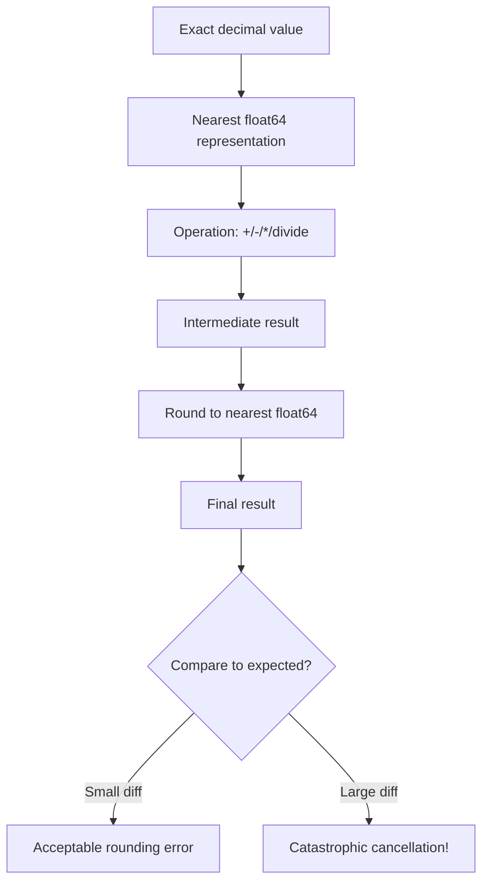
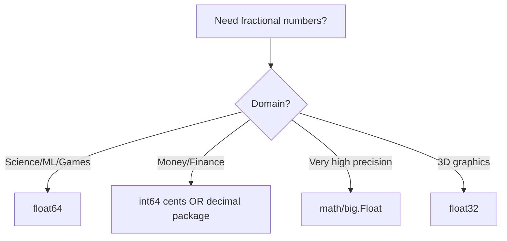

# Floating Points in Go — Middle Level

## Table of Contents
1. [Introduction](#introduction)
2. [Prerequisites](#prerequisites)
3. [Glossary](#glossary)
4. [Core Concepts](#core-concepts)
5. [Evolution & Historical Context](#evolution--historical-context)
6. [Real-World Analogies](#real-world-analogies)
7. [Mental Models](#mental-models)
8. [Pros & Cons](#pros--cons)
9. [Use Cases](#use-cases)
10. [Code Examples](#code-examples)
11. [Coding Patterns](#coding-patterns)
12. [Clean Code](#clean-code)
13. [Product Use / Feature](#product-use--feature)
14. [Error Handling](#error-handling)
15. [Security](#security)
16. [Performance Tips](#performance-tips)
17. [Metrics](#metrics)
18. [Best Practices](#best-practices)
19. [Edge Cases](#edge-cases)
20. [Common Mistakes](#common-mistakes)
21. [Common Misconceptions](#common-misconceptions)
22. [Tricky Points](#tricky-points)
23. [Alternative Approaches](#alternative-approaches)
24. [Anti-Patterns](#anti-patterns)
25. [Debugging Guide](#debugging-guide)
26. [Comparison with Other Languages](#comparison-with-other-languages)
27. [Test (Quiz)](#test-quiz)
28. [Tricky Questions](#tricky-questions)
29. [Cheat Sheet](#cheat-sheet)
30. [Self-Assessment](#self-assessment)
31. [Summary](#summary)
32. [What You Can Build](#what-you-can-build)
33. [Further Reading](#further-reading)
34. [Related Topics](#related-topics)
35. [Diagrams & Visual Aids](#diagrams--visual-aids)

---

## Introduction

At the middle level, understanding floating-point numbers means going beyond "how to use them" to "why they behave this way" and "when to choose them over alternatives." You need to understand precision tradeoffs, accumulation of rounding errors, and when floats are the wrong tool entirely.

Key questions at this level:
- Why does the same computation give different results in different orders?
- When should I use `float32` vs `float64`?
- What are the production-safe alternatives to floats for domain-specific use cases?
- How do I debug unexpected float behavior?

---

## Prerequisites

- Solid understanding of Go types and interfaces
- Familiarity with the `math` package
- Basic knowledge of binary representation
- Experience with production Go code
- Understanding of error handling patterns

---

## Glossary

| Term | Definition |
|------|------------|
| **ULP** | Unit in the Last Place — the gap between a float and its nearest neighbor |
| **Catastrophic cancellation** | Significant precision loss when subtracting two nearly equal numbers |
| **Subnormal numbers** | Very small floats close to zero with reduced precision |
| **Rounding mode** | How a result is rounded when it can't be represented exactly |
| **Fused multiply-add (FMA)** | Hardware instruction that computes a*b+c with a single rounding |
| **Denormalized** | Another name for subnormal numbers |
| **Guard bits** | Extra bits used during intermediate computation for precision |
| **Sterbenz lemma** | If a/2 ≤ b ≤ 2a, then a-b is computed exactly |
| **Kahan summation** | Algorithm to reduce accumulated error when summing many floats |

---

## Core Concepts

### IEEE 754 Representation

Every `float64` is stored as:
- 1 sign bit
- 11 exponent bits (biased by 1023)
- 52 mantissa bits (with an implicit leading 1)

The value is: `(-1)^sign × 2^(exp-1023) × (1.mantissa)`

This means `float64` can exactly represent:
- All integers up to 2^53 = 9,007,199,254,740,992
- Powers of 2 (1, 2, 4, 8, ...)
- Simple fractions whose denominator is a power of 2 (0.5, 0.25, 0.125)

It **cannot** represent most decimal fractions (0.1, 0.2, 0.3) exactly.

### Precision and Relative Error

The relative error of float64 is bounded by machine epsilon: `ε = 2^-52 ≈ 2.22e-16`.

This means every float64 operation can introduce a relative error of at most ε.

```go
import "math"

// Machine epsilon for float64
const machineEpsilon = 1.0 / (1 << 52) // 2^-52 ≈ 2.22e-16
fmt.Println(machineEpsilon)
```

### Catastrophic Cancellation

When subtracting two nearly equal floating-point numbers, you lose significant digits:

```go
a := 1.0000000001
b := 1.0000000000
diff := a - b
// Expected: 1e-10
// Actual: varies, with all the digits of precision gone
fmt.Printf("%.20f\n", diff) // shows how many digits are correct
```

### Kahan Summation Algorithm

When summing many floats, errors accumulate. Kahan summation compensates:

```go
// Naive sum (accumulates error)
func naiveSum(vals []float64) float64 {
    sum := 0.0
    for _, v := range vals {
        sum += v
    }
    return sum
}

// Kahan compensated sum (much more accurate)
func kahanSum(vals []float64) float64 {
    sum := 0.0
    comp := 0.0 // compensation for low-order bits
    for _, v := range vals {
        y := v - comp
        t := sum + y
        comp = (t - sum) - y
        sum = t
    }
    return sum
}
```

---

## Evolution & Historical Context

Before IEEE 754 (formalized in 1985), every computer manufacturer used their own floating-point format. A program that ran on one machine might give completely different results on another. IEEE 754 was a landmark standardization effort.

**Key milestones:**
- **1985**: IEEE 754-1985 published — standardized 32-bit and 64-bit formats
- **1990s**: Hardware FPUs (floating-point units) became standard in CPUs
- **2008**: IEEE 754-2008 updated the standard, added decimal floating point
- **2019**: IEEE 754-2019 minor revision
- **Go 1.0 (2012)**: Go adopted IEEE 754 for all float types
- **Go 1.9 (2017)**: Added `math/bits` package for bit manipulation

Go deliberately kept only two float types (`float32`, `float64`) matching the IEEE 754 single and double precision formats, avoiding the complexity of `long double` (80-bit) found in C/C++ on x86.

---

## Real-World Analogies

### The Checkbook Analogy
Imagine tracking a checkbook balance by always rounding to the nearest dollar. Each transaction introduces a small rounding error. After thousands of transactions, the accumulated error could be significant. This is why float is wrong for financial calculations.

### The Ruler Manufacturing Analogy
If you manufacture rulers that are accurate to 0.1mm, and you measure something 1000 times and add the results, your total error could be up to 100mm. Precision errors accumulate. The Kahan algorithm is like always tracking the rounding error and correcting for it next time.

---

## Mental Models

### Model 1: Floats Live on a Number Line with Gaps

```
0.0    0.25   0.5   0.75   1.0   1.5   2.0          4.0
 |      |      |     |      |     |     |             |

The gaps between consecutive floats are NOT uniform.
Near 1.0, the gap is ε = 2.22e-16
Near 2.0, the gap is 2ε
Near 0.5, the gap is ε/2
```

### Model 2: Think in Significant Digits, Not Decimal Places

`float64` gives you 15-16 significant digits, but NOT 15 decimal places. The number `1e15 + 0.5` may lose the `0.5` because the significant digits are used up by `1000000000000000`.

### Model 3: Order of Operations Matters

```go
// These can give different results due to floating-point non-associativity
a := (1e15 + 1.0) - 1e15   // May give 0.0 or 1.0 depending on rounding
b := 1e15 + (1.0 - 1e15)   // Likely different from a
```

---

## Pros & Cons

### Pros
- Hardware native — operations happen in a single CPU instruction
- IEEE 754 standard — reproducible across platforms (mostly)
- Huge range (10^-308 to 10^308 for float64)
- Built-in operations: `+`, `-`, `*`, `/` with hardware speed
- `math` package has comprehensive functions

### Cons
- Not exact for most decimal fractions
- Rounding errors accumulate in loops
- `==` comparison unreliable
- Non-associative: `(a+b)+c ≠ a+(b+c)` in general
- Hard to debug precision issues
- Wrong for financial, legal, and exact counting domains

---

## Use Cases

### When Floats Are the Right Choice

```go
// Scientific computing
func gravForce(m1, m2, r float64) float64 {
    const G = 6.674e-11
    return G * m1 * m2 / (r * r)
}

// Statistics (small relative errors acceptable)
func mean(data []float64) float64 {
    sum := 0.0
    for _, v := range data {
        sum += v
    }
    return sum / float64(len(data))
}

// Machine learning
type Weights []float32 // float32 common in ML for memory efficiency
```

### When Floats Are the Wrong Choice

```go
// WRONG: Financial calculation
func addTax(price float64, taxRate float64) float64 {
    return price + price*taxRate // accumulates errors
}

// RIGHT: Use integer cents
func addTaxCents(priceCents int64, taxRateBPS int64) int64 {
    // taxRateBPS = basis points (1/100 of 1%)
    return priceCents + priceCents*taxRateBPS/10000
}
```

---

## Code Examples

### Example 1: Precision Analysis

```go
package main

import (
    "fmt"
    "math"
)

func main() {
    // Demonstrate accumulation error
    sum := 0.0
    for i := 0; i < 10; i++ {
        sum += 0.1
    }
    fmt.Printf("Sum of 10x 0.1: %.20f\n", sum)
    fmt.Printf("Expected 1.0:   %.20f\n", 1.0)
    fmt.Printf("Difference: %e\n", math.Abs(sum-1.0))
    // Sum of 10x 0.1: 0.99999999999999988898
    // Expected 1.0:   1.00000000000000000000
    // Difference: 1.110223e-16
}
```

### Example 2: Epsilon Comparison with Relative Tolerance

```go
package main

import "math"

// Absolute epsilon: good for numbers near 0
func absoluteEqual(a, b, eps float64) bool {
    return math.Abs(a-b) < eps
}

// Relative epsilon: good for large numbers
func relativeEqual(a, b, relTol float64) bool {
    return math.Abs(a-b) <= relTol*math.Max(math.Abs(a), math.Abs(b))
}

// Combined: handles both near-zero and large numbers
func nearlyEqual(a, b float64) bool {
    const absTol = 1e-12
    const relTol = 1e-9
    diff := math.Abs(a - b)
    if diff <= absTol {
        return true
    }
    return diff <= relTol*math.Max(math.Abs(a), math.Abs(b))
}
```

### Example 3: Float Accumulation vs Kahan

```go
package main

import (
    "fmt"
    "math"
)

func naiveSum(n int) float64 {
    sum := 0.0
    for i := 1; i <= n; i++ {
        sum += 1.0 / float64(i*i)
    }
    return sum
}

func kahanSum(n int) float64 {
    sum := 0.0
    c := 0.0
    for i := 1; i <= n; i++ {
        y := (1.0 / float64(i*i)) - c
        t := sum + y
        c = (t - sum) - y
        sum = t
    }
    return sum
}

func main() {
    // sum of 1/n^2 converges to π²/6
    expected := math.Pi * math.Pi / 6
    n := 1_000_000

    naive := naiveSum(n)
    kahan := kahanSum(n)

    fmt.Printf("Expected:     %.15f\n", expected)
    fmt.Printf("Naive sum:    %.15f (err: %e)\n", naive, math.Abs(naive-expected))
    fmt.Printf("Kahan sum:    %.15f (err: %e)\n", kahan, math.Abs(kahan-expected))
}
```

### Example 4: Working with float32 for Graphics

```go
package main

import (
    "fmt"
    "math"
)

type Vec3 struct {
    X, Y, Z float32
}

func (v Vec3) Length() float32 {
    return float32(math.Sqrt(float64(v.X*v.X + v.Y*v.Y + v.Z*v.Z)))
}

func (v Vec3) Normalize() Vec3 {
    l := v.Length()
    if l == 0 {
        return Vec3{}
    }
    return Vec3{v.X / l, v.Y / l, v.Z / l}
}

func main() {
    v := Vec3{3.0, 4.0, 0.0}
    fmt.Printf("Length: %.4f\n", v.Length())  // 5.0000
    n := v.Normalize()
    fmt.Printf("Normalized: (%.4f, %.4f, %.4f)\n", n.X, n.Y, n.Z)
}
```

---

## Coding Patterns

### Pattern 1: Adaptive Epsilon

For calculations where you don't know the scale of numbers in advance:

```go
func adaptiveEqual(a, b float64) bool {
    if a == b {
        return true // handles Inf, and exact equality
    }
    diff := math.Abs(a - b)
    norm := math.Min(math.Abs(a)+math.Abs(b), math.MaxFloat64)
    return diff < math.Max(math.SmallestNonzeroFloat64, 1e-9*norm)
}
```

### Pattern 2: Decimal Rounding

```go
// Round to n decimal places
func roundTo(val float64, decimals int) float64 {
    factor := math.Pow(10, float64(decimals))
    return math.Round(val*factor) / factor
}

fmt.Println(roundTo(3.14159, 2))  // 3.14
fmt.Println(roundTo(2.675, 2))    // Note: may give 2.67 due to float representation
```

### Pattern 3: Sorting Floats Safely (Handling NaN)

```go
import "sort"

// Standard sort.Float64s doesn't handle NaN properly
// NaN should be pushed to end
func sortFloats(vals []float64) {
    sort.Slice(vals, func(i, j int) bool {
        // NaN comes last
        if math.IsNaN(vals[i]) {
            return false
        }
        if math.IsNaN(vals[j]) {
            return true
        }
        return vals[i] < vals[j]
    })
}
```

---

## Clean Code

### Naming and Documentation

```go
// Good: document what precision is acceptable
const (
    // coordinateEpsilon is the tolerance for comparing GPS coordinates.
    // At equator, 1e-7 degrees ≈ 11mm, sufficient for our use case.
    coordinateEpsilon = 1e-7

    // temperatureEpsilon for sensor readings; sensor accuracy is ±0.1°C.
    temperatureEpsilon = 0.05
)

// Good: document units
type SensorReading struct {
    TemperatureCelsius float64
    PressurePascals    float64
    HumidityPercent    float64
}
```

### Avoid Float in Map Keys

```go
// BAD: float as map key — NaN as key is permanently unreachable
m := map[float64]string{
    1.0: "one",
    math.NaN(): "nan", // inserted but never retrieved
}

// GOOD: convert to string key or use int representation
func floatKey(f float64) string {
    return strconv.FormatFloat(f, 'g', -1, 64)
}
```

---

## Product Use / Feature

### Real-World: Financial Report (Correct Approach)

```go
package main

import "fmt"

// Store money as integer cents to avoid float issues
type Money struct {
    Cents int64
}

func (m Money) String() string {
    return fmt.Sprintf("$%d.%02d", m.Cents/100, m.Cents%100)
}

func (m Money) Add(other Money) Money {
    return Money{m.Cents + other.Cents}
}

func (m Money) Multiply(factor float64) Money {
    // Convert to float only for multiplication, round, convert back
    result := int64(math.Round(float64(m.Cents) * factor))
    return Money{result}
}

func main() {
    price := Money{999}   // $9.99
    tax := price.Multiply(0.08) // 8% tax
    total := price.Add(tax)
    fmt.Println(price)  // $9.99
    fmt.Println(tax)    // $0.80
    fmt.Println(total)  // $10.79
}
```

### Real-World: Statistics Service

```go
package stats

import "math"

// RunningStats computes mean and variance incrementally (Welford's algorithm)
// Avoids catastrophic cancellation vs. naive two-pass approach
type RunningStats struct {
    count int
    mean  float64
    m2    float64
}

func (s *RunningStats) Add(x float64) {
    s.count++
    delta := x - s.mean
    s.mean += delta / float64(s.count)
    delta2 := x - s.mean
    s.m2 += delta * delta2
}

func (s *RunningStats) Mean() float64 { return s.mean }

func (s *RunningStats) Variance() float64 {
    if s.count < 2 {
        return 0
    }
    return s.m2 / float64(s.count-1)
}

func (s *RunningStats) StdDev() float64 {
    return math.Sqrt(s.Variance())
}
```

---

## Error Handling

### Robust Float Parsing

```go
import (
    "fmt"
    "math"
    "strconv"
)

type FloatParseError struct {
    Input string
    Err   error
}

func (e *FloatParseError) Error() string {
    return fmt.Sprintf("invalid float %q: %v", e.Input, e.Err)
}

func parseFiniteFloat(s string) (float64, error) {
    f, err := strconv.ParseFloat(s, 64)
    if err != nil {
        return 0, &FloatParseError{s, err}
    }
    if math.IsNaN(f) {
        return 0, fmt.Errorf("NaN is not allowed")
    }
    if math.IsInf(f, 0) {
        return 0, fmt.Errorf("infinity is not allowed")
    }
    return f, nil
}
```

---

## Security

### Floating-Point in Security-Critical Code

1. **Timing attacks via float comparison**: floating-point comparisons can have non-constant time on some architectures. For security tokens, use constant-time comparison of integers or byte slices.

2. **Float overflow in bounds checking**:

```go
// VULNERABLE: float overflow bypasses bounds check
func allocateSlice(sizeFloat float64) []byte {
    size := int(sizeFloat)  // if sizeFloat is huge, size wraps to negative
    if size < 0 {
        panic("negative size")
    }
    return make([]byte, size) // could still be exploited
}

// SAFE: validate before converting
func safeAllocate(sizeFloat float64) ([]byte, error) {
    const maxSize = 1 << 30 // 1GB limit
    if math.IsNaN(sizeFloat) || math.IsInf(sizeFloat, 0) {
        return nil, fmt.Errorf("invalid size")
    }
    if sizeFloat < 0 || sizeFloat > maxSize {
        return nil, fmt.Errorf("size %f out of range", sizeFloat)
    }
    return make([]byte, int(sizeFloat)), nil
}
```

3. **JSON parsing and float precision**: JSON numbers become float64 in Go's `encoding/json` by default. Large integers lose precision.

```go
// Dangerous: large integer becomes float64, loses precision
var data map[string]interface{}
json.Unmarshal([]byte(`{"id": 9007199254740993}`), &data)
fmt.Println(data["id"])  // 9.007199254740992e+15 — WRONG!

// Safe: use json.Number or specific struct
var result struct {
    ID json.Number `json:"id"`
}
json.Unmarshal([]byte(`{"id": 9007199254740993}`), &result)
fmt.Println(result.ID.String())  // "9007199254740993" — correct
```

---

## Performance Tips

### float32 vs float64 in Practice

```go
// Benchmark setup
// go test -bench=. -benchmem

func BenchmarkFloat32Ops(b *testing.B) {
    x := float32(1.5)
    for i := 0; i < b.N; i++ {
        x = x*x + 1.0
    }
    _ = x
}

func BenchmarkFloat64Ops(b *testing.B) {
    x := float64(1.5)
    for i := 0; i < b.N; i++ {
        x = x*x + 1.0
    }
    _ = x
}
// On amd64: float64 is typically same speed or faster than float32
// float32 advantage: memory (half the size = better cache utilization in large arrays)
```

### SIMD Considerations

Go's compiler can auto-vectorize float operations in some cases. Avoid:
- Branches in tight float loops
- Data-dependent early exits
- Pointer aliasing

---

## Metrics

| Metric | float32 | float64 |
|--------|---------|---------|
| Size | 4 bytes | 8 bytes |
| Mantissa bits | 23 | 52 |
| Exponent bits | 8 | 11 |
| Decimal digits | ~7 | ~15-16 |
| Min positive normal | ~1.18e-38 | ~2.23e-308 |
| Max normal | ~3.40e+38 | ~1.80e+308 |
| Machine epsilon | ~1.19e-7 | ~2.22e-16 |

---

## Best Practices

1. **Use `float64` as the default** — only switch to `float32` when memory is explicitly constrained.
2. **Document epsilon values** with units and rationale.
3. **Use Welford's algorithm** for incremental mean/variance (avoids catastrophic cancellation).
4. **Use Kahan summation** when summing many small values.
5. **Validate float inputs** at API boundaries — check for NaN and Inf.
6. **Avoid float map keys** — NaN can create unreachable entries.
7. **Use `math.Round` not `int(f + 0.5)`** — the latter is wrong for negative numbers.

```go
// Wrong rounding for negative numbers
x := -1.5
fmt.Println(int(x + 0.5)) // 0 — WRONG! Expected -2 or -1
fmt.Println(math.Round(x)) // -2 — CORRECT (round half away from zero)
```

---

## Edge Cases

```go
// 1. math.MaxFloat64 overflow
fmt.Println(math.MaxFloat64 * 2)  // +Inf, not an error

// 2. Subnormal numbers (very close to zero)
tiny := math.SmallestNonzeroFloat64 // 5e-324
fmt.Println(tiny / 2)               // 0.0 — underflows to zero!

// 3. Negative zero
negZero := math.Copysign(0, -1)
fmt.Println(negZero)         // -0
fmt.Println(negZero == 0.0)  // true! -0 == +0
fmt.Println(1.0/negZero)     // -Inf

// 4. Float to int conversion (truncation, not rounding)
fmt.Println(int(3.9))   // 3
fmt.Println(int(-3.9))  // -3

// 5. Large integer precision loss
var x float64 = 1<<53 + 1  // 9007199254740993
fmt.Println(x == float64(1<<53))  // true! The +1 is lost
```

---

## Common Mistakes

### Mistake: Relative vs Absolute Epsilon

```go
// WRONG for large numbers: absolute epsilon fails
const eps = 1e-9
a := 1e15
b := a + 1.0 // 1e15 + 1 cannot be represented, may equal a
fmt.Println(math.Abs(a-b) < eps) // false but a and b are "equal" in float

// WRONG for small numbers: relative epsilon fails
a := 1e-15
b := 2e-15
// These differ by 100%, but relative comparison with small threshold says equal

// RIGHT: use combined tolerance
func nearEqual(a, b, absTol, relTol float64) bool {
    diff := math.Abs(a - b)
    return diff <= absTol || diff <= relTol*math.Max(math.Abs(a), math.Abs(b))
}
```

---

## Common Misconceptions

1. **"Float arithmetic is non-deterministic"** — FALSE. IEEE 754 guarantees the same result for the same inputs on any conforming implementation. The issue is that different orderings of operations give different results.

2. **"Go's float64 is more accurate than C's double"** — FALSE. They are the same IEEE 754 double precision.

3. **"I should avoid math.Sqrt and use my own"** — FALSE. `math.Sqrt` is implemented using the hardware `SQRTSD` instruction, which gives the correctly-rounded result.

---

## Tricky Points

### Non-Associativity

```go
a, b, c := 1e15, -1e15, 1.0
fmt.Println((a+b)+c) // 1.0 — correct
fmt.Println(a+(b+c)) // may give 0.0 depending on evaluation

// In loops, the order of summation matters:
// Summing from smallest to largest is more accurate
```

### Compiler Optimizations

Go's compiler respects IEEE 754 strictly — it will NOT reorder float operations for optimization (unlike some C compilers with `-ffast-math`). This is a feature: reproducibility.

---

## Alternative Approaches

### 1. Integer Arithmetic (for money)

```go
// Use int64 for cents
type Cents int64

func (c Cents) String() string {
    return fmt.Sprintf("$%d.%02d", int64(c)/100, int64(c)%100)
}
```

### 2. shopspring/decimal Package

```go
import "github.com/shopspring/decimal"

price := decimal.NewFromString("10.99")
tax := decimal.NewFromFloat(0.08)
total := price.Add(price.Mul(tax))
fmt.Println(total) // 11.8692 — exact decimal arithmetic
```

### 3. big.Float for Arbitrary Precision

```go
import "math/big"

// 256-bit precision float
f := new(big.Float).SetPrec(256).SetFloat64(0.1)
g := new(big.Float).SetPrec(256).SetFloat64(0.2)
sum := new(big.Float).Add(f, g)
fmt.Println(sum.Text('f', 30)) // 0.300000000000000000...
// Note: still not exactly 0.3, but much more precise
```

### 4. Fixed-Point Arithmetic

```go
// 4 decimal places: multiply everything by 10000
type Fixed int64

const scale = 10000

func NewFixed(f float64) Fixed {
    return Fixed(int64(f * scale))
}

func (f Fixed) Float64() float64 {
    return float64(f) / scale
}
```

---

## Anti-Patterns

### Anti-Pattern 1: Float Loop Counter

```go
// BAD: float loop counter accumulates error
for f := 0.0; f != 1.0; f += 0.1 {
    // This loop may never terminate! 0.0 + 0.1*10 != 1.0
}

// GOOD: use integer counter
for i := 0; i < 10; i++ {
    f := float64(i) * 0.1
    // use f
}
```

### Anti-Pattern 2: Float As Map Key

```go
// BAD
scores := map[float64]string{1.0: "one"}
// NaN key is a bug: map[math.NaN()] = "nan" can never be retrieved

// GOOD: use string keys if you need float-like keys
scores := map[string]string{"1.0": "one"}
```

### Anti-Pattern 3: Ignoring Precision in Config

```go
// BAD: parsing config float without validation
cfg.Threshold = parseFloat(os.Getenv("THRESHOLD")) // no NaN/Inf check

// GOOD
thresh, err := parseFiniteFloat(os.Getenv("THRESHOLD"))
if err != nil || thresh <= 0 || thresh > 100 {
    log.Fatal("invalid THRESHOLD")
}
```

---

## Debugging Guide

### Step 1: Print with Full Precision

```go
// Default Println hides precision issues
fmt.Println(0.1 + 0.2)        // 0.30000000000000004 — already shows it
fmt.Printf("%.20f\n", 0.1+0.2) // 0.30000000000000004441
```

### Step 2: Use math/bits to Inspect Raw Bits

```go
import (
    "fmt"
    "math"
    "math/bits"
)

func floatBits(f float64) string {
    b := math.Float64bits(f)
    sign := b >> 63
    exp := (b >> 52) & 0x7FF
    mantissa := b & ((1 << 52) - 1)
    return fmt.Sprintf("sign=%d exp=%d mantissa=%d", sign, exp, mantissa)
}

fmt.Println(floatBits(0.1))
// sign=0 exp=1019 mantissa=2702159776422298
```

### Step 3: Check Accumulated Error

```go
// Add a running error counter to your computation
func debugSum(vals []float64) (float64, float64) {
    sum := 0.0
    compensator := 0.0 // track round-off
    for _, v := range vals {
        y := v - compensator
        t := sum + y
        compensator = (t - sum) - y
        sum = t
    }
    return sum, compensator
}
```

### Step 4: Bisect to Find the Problematic Operation

If a function returns wrong result, narrow down which operation causes the error by printing intermediate values.

---

## Comparison with Other Languages

| Feature | Go | Python | Java | C/C++ | Rust |
|---------|----|---------|----|-------|------|
| Float types | float32, float64 | float (float64) | float, double | float, double, long double | f32, f64 |
| Default float | float64 | float64 | double | double | f64 |
| Fast-math optimization | No | No | No | Optional (-ffast-math) | Optional (unsafe) |
| Decimal type | External (shopspring) | Decimal stdlib | BigDecimal | External | External |
| Overflow behavior | +/-Inf | +/-Inf | +/-Inf | Undefined (C) | +/-Inf |
| Integer division panics | Yes | No | Yes | Undefined | Panics |

**Key Go difference**: Go does NOT have a `long double` (80-bit extended precision) type like C on x86. Go only has IEEE 754 single and double precision, making behavior more consistent across architectures.

---

## Test (Quiz)

1. What does `math.Round(-2.5)` return?
   - a) -2.0
   - b) **-3.0** ✓ (rounds away from zero)
   - c) -2.5
   - d) 3.0

2. What is the purpose of Kahan summation?
   - a) Sort floats
   - b) **Reduce accumulated rounding error** ✓
   - c) Convert floats to integers
   - d) Check for NaN

3. Why is float a bad choice for map keys?
   - a) Floats are too large
   - b) Map doesn't support floats
   - c) **NaN != NaN, so NaN keys can never be retrieved** ✓
   - d) Float comparison is slow

4. What does `math.Copysign(1.0, -3.0)` return?
   - a) -1.0 — copies sign of second argument ✓
   - b) -3.0
   - c) 1.0
   - d) 3.0

---

## Tricky Questions

**Q: Is Go's float arithmetic deterministic?**
A: Yes — Go strictly follows IEEE 754, so the same computation always gives the same result on any conforming platform. However, different orderings of the same operations can give different results due to non-associativity.

**Q: Can you have negative zero in Go?**
A: Yes. `math.Copysign(0, -1)` produces `-0`. It compares equal to `+0`, but `1.0/(-0.0) = -Inf`.

**Q: What is the result of `math.MaxFloat64 * 2`?**
A: `+Inf` — floating-point overflow produces infinity, not a panic.

---

## Cheat Sheet

```go
// Packages
import (
    "math"
    "math/big"
    "strconv"
)

// Comparison
nearEqual := math.Abs(a-b) < 1e-9    // absolute tolerance
relEqual  := math.Abs(a-b)/math.Max(math.Abs(a),math.Abs(b)) < 1e-9

// Special value checks
math.IsNaN(f)       // check NaN
math.IsInf(f, 1)    // check +Inf
math.IsInf(f, -1)   // check -Inf
math.IsInf(f, 0)    // check either Inf

// Rounding
math.Round(x)     // round half away from zero
math.RoundToEven(x) // banker's rounding (not in stdlib — implement manually)
math.Floor(x)     // toward -Inf
math.Ceil(x)      // toward +Inf
math.Trunc(x)     // toward 0

// Bit manipulation
math.Float64bits(f)          // float64 -> uint64
math.Float64frombits(b)      // uint64 -> float64

// Accumulation
// Use Kahan summation for large sums
// Use Welford's algorithm for running mean/variance

// Money: NEVER use float
// Use int64 (cents) or github.com/shopspring/decimal
```

---

## Self-Assessment

Rate yourself (1–5) on each:

- [ ] I understand IEEE 754 structure (sign, exponent, mantissa)
- [ ] I know when to use absolute vs relative epsilon
- [ ] I can implement Kahan summation from memory
- [ ] I understand catastrophic cancellation
- [ ] I know why floats are wrong for financial calculations
- [ ] I can use `math/big.Float` for high-precision needs
- [ ] I understand that Go float arithmetic IS deterministic
- [ ] I know about negative zero and its effects

---

## Summary

At the middle level, understanding floats means:
- Knowing **why** `0.1 + 0.2 ≠ 0.3` (binary representation)
- Understanding **error accumulation** and how to mitigate it (Kahan, Welford)
- Knowing the **alternatives** (integer cents, `decimal` package, `big.Float`)
- Understanding **when NOT to use floats** (financial, legal, counting)
- Being able to **debug** precision issues by inspecting bits and printing at full precision

---

## What You Can Build

- A numerical integration library using Kahan summation
- A statistics engine with Welford's online algorithm
- A money/currency library using integer cents
- A graph plotting tool with coordinate precision management
- A scientific unit conversion library with explicit precision tracking

---

## Further Reading

- [What Every Computer Scientist Should Know About Floating-Point Arithmetic (Goldberg)](https://docs.oracle.com/cd/E19957-01/806-3568/ncg_goldberg.html)
- [Go spec: Numeric types](https://go.dev/ref/spec#Numeric_types)
- [shopspring/decimal package](https://github.com/shopspring/decimal)
- [Kahan summation on Wikipedia](https://en.wikipedia.org/wiki/Kahan_summation_algorithm)
- [Go math package source](https://cs.opensource.google/go/go/+/main:src/math/)

---

## Related Topics

- Complex numbers (built on float)
- `math/big` package for arbitrary precision
- `encoding/json` float handling
- Benchmarking with `testing.B`

---

## Diagrams & Visual Aids

### Float64 Layout
```
Bit: 63     62     52    51                               0
     +------+----------+----------------------------------+
     | sign |  exp(11) |         mantissa (52)            |
     +------+----------+----------------------------------+
```

### Precision Loss Flow


### When to Use What

