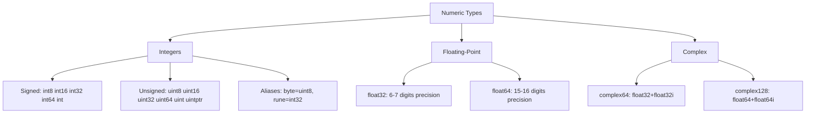

# Numeric Types — Junior Level

## Table of Contents
1. [Introduction](#introduction)
2. [Prerequisites](#prerequisites)
3. [Glossary](#glossary)
4. [Core Concepts](#core-concepts)
5. [Real-World Analogies](#real-world-analogies)
6. [Mental Models](#mental-models)
7. [Pros & Cons](#pros--cons)
8. [Use Cases](#use-cases)
9. [Code Examples](#code-examples)
10. [Coding Patterns](#coding-patterns)
11. [Clean Code](#clean-code)
12. [Product Use / Feature](#product-use--feature)
13. [Error Handling](#error-handling)
14. [Security Considerations](#security-considerations)
15. [Performance Tips](#performance-tips)
16. [Metrics & Analytics](#metrics--analytics)
17. [Best Practices](#best-practices)
18. [Edge Cases & Pitfalls](#edge-cases--pitfalls)
19. [Common Mistakes](#common-mistakes)
20. [Common Misconceptions](#common-misconceptions)
21. [Tricky Points](#tricky-points)
22. [Test](#test)
23. [Tricky Questions](#tricky-questions)
24. [Cheat Sheet](#cheat-sheet)
25. [Self-Assessment Checklist](#self-assessment-checklist)
26. [Summary](#summary)
27. [What You Can Build](#what-you-can-build)
28. [Further Reading](#further-reading)
29. [Related Topics](#related-topics)
30. [Diagrams & Visual Aids](#diagrams--visual-aids)

---

## Introduction
> Focus: "What is it?" and "How to use it?"

Go has a rich set of numeric types designed to give programmers precise control over memory usage and value ranges. Unlike some languages that have a single "number" type, Go distinguishes between integers, floating-point numbers, and complex numbers — and within each category, provides multiple sizes. This precision prevents bugs, enables performance optimization, and makes the programmer's intent explicit.

The numeric type system in Go can be grouped into three families: integers (whole numbers, both signed and unsigned), floating-point numbers (decimals, following the IEEE 754 standard), and complex numbers (for mathematical computing). Each family has subtypes based on how many bits they use in memory — 8, 16, 32, or 64 bits. The default integer type is `int` (platform-dependent size), and the default float type is `float64`.

Understanding numeric types in Go means knowing not just what values they can hold, but also their zero values, potential overflow behavior, conversion rules, and when to use each type. This knowledge prevents subtle bugs like integer overflow and floating-point comparison errors that are extremely common in real-world programs.

---

## Prerequisites
- Basic Go syntax (variables, functions)
- Understanding of what a type is
- Basic concept of binary numbers (helpful but not required)

---

## Glossary

| Term | Definition |
|------|-----------|
| Integer | A whole number without a decimal part (e.g., -5, 0, 42) |
| Signed integer | An integer that can be negative (uses one bit for the sign) |
| Unsigned integer | An integer that can only be zero or positive |
| Floating-point | A number with a decimal part (e.g., 3.14, -0.5) |
| Complex number | A number with a real and imaginary part (e.g., `3+4i`) |
| Overflow | When a computation produces a value outside the type's range |
| Precision | The number of significant decimal digits a float type can represent |
| IEEE 754 | The international standard for floating-point arithmetic |
| `byte` | Alias for `uint8` — represents a single byte |
| `rune` | Alias for `int32` — represents a Unicode code point |

---

## Core Concepts

### The Numeric Type Family in Go

```
Numeric Types
├── Integers
│   ├── Signed:   int8, int16, int32, int64, int
│   └── Unsigned: uint8, uint16, uint32, uint64, uint, uintptr
│   └── Aliases:  byte (=uint8), rune (=int32)
├── Floating-Point
│   ├── float32
│   └── float64
└── Complex
    ├── complex64  (float32 real + float32 imaginary)
    └── complex128 (float64 real + float64 imaginary)
```

### Type Sizes and Ranges

| Type | Size | Min Value | Max Value |
|------|------|-----------|-----------|
| `int8` | 8 bits | -128 | 127 |
| `int16` | 16 bits | -32,768 | 32,767 |
| `int32` | 32 bits | -2,147,483,648 | 2,147,483,647 |
| `int64` | 64 bits | -9.2×10^18 | 9.2×10^18 |
| `uint8` | 8 bits | 0 | 255 |
| `uint16` | 16 bits | 0 | 65,535 |
| `uint32` | 32 bits | 0 | 4,294,967,295 |
| `uint64` | 64 bits | 0 | 1.8×10^19 |
| `float32` | 32 bits | ~1.2×10^-38 | ~3.4×10^38 |
| `float64` | 64 bits | ~2.2×10^-308 | ~1.8×10^308 |
| `int` | 32 or 64 bits | platform-dependent | platform-dependent |
| `uint` | 32 or 64 bits | 0 | platform-dependent |

### Zero Values

All numeric types have a zero value of `0` (or `0.0` for floats, `0+0i` for complex):

```go
var i int        // 0
var f float64    // 0.0
var c complex128 // (0+0i)
```

### Default Types

When you write a numeric literal, Go infers its type:

```go
x := 42      // type: int (default integer type)
y := 3.14    // type: float64 (default float type)
z := 3 + 4i  // type: complex128 (default complex type)
```

---

## Real-World Analogies

**int8 is like a single byte's value space**: A traffic light has 3 states. An int8 can hold 256 different values. Use the smallest type that fits your domain.

**float64 vs float32**: Think of float32 as a ruler with centimeter marks, and float64 as one with millimeter marks. float64 has much more precision.

**Overflow is like an odometer rolling over**: When a car odometer reaches 999,999 km, the next km shows 000,000. Integer overflow works the same way — it wraps around without error.

**unsigned int**: A bank account balance should never be negative, so you'd use an unsigned type. A temperature can be negative, so you'd use a signed type.

---

## Mental Models

### The Bucket Model

Each numeric type is a bucket of a specific size. A bigger bucket holds bigger numbers:

```
int8    ████████  (8 bits)
int16   ████████████████  (16 bits)
int32   ████████████████████████████████  (32 bits)
int64   ████████ ... ████████  (64 bits — very large)
```

### The Signed vs Unsigned Model

Signed types use one bit for the sign, leaving fewer bits for magnitude:

```
int8:  [sign][value 7 bits]  → range: -128 to +127
uint8: [value 8 bits]        → range: 0 to +255
```

### Choosing the Right Type

```
Need a whole number?  → int (unless you need specific size/range)
Need decimals?        → float64 (unless memory is critical)
Dealing with bytes?   → byte (uint8)
Unicode characters?   → rune (int32)
Very large integers?  → int64
Physics/DSP math?     → complex128
```

---

## Pros & Cons

### Pros
- **Explicit sizes**: No surprises about how many bits a type uses
- **Performance control**: Use smaller types to save memory when processing millions of records
- **Platform independence**: `int64` always means 64 bits, unlike `long` in C
- **Rich standard library**: `math`, `math/bits`, `math/cmplx` provide comprehensive support
- **Overflow is wrapping (not undefined behavior)**: Unlike C, Go integer overflow is well-defined

### Cons
- **Verbose conversions**: Must explicitly convert between types (e.g., `float64(myInt)`)
- **int size varies by platform**: `int` is 32-bit on 32-bit systems and 64-bit on 64-bit systems — can surprise beginners
- **No automatic widening**: Adding int8 + int16 requires explicit conversion
- **Floating-point imprecision**: `0.1 + 0.2 != 0.3` — a classic gotcha in all languages

---

## Use Cases

| Type | Typical Use Case |
|------|-----------------|
| `int` | General-purpose integer (loop counters, indices, sizes) |
| `int64` | Large IDs, timestamps (Unix nanoseconds), database primary keys |
| `int32` | Rune values, some APIs, interop |
| `int8` | Small flag values, space-optimized arrays |
| `uint8` / `byte` | Raw bytes, image pixel data, network packets |
| `uint32` | IP addresses, file offsets |
| `uint64` | Large bit flags, cryptographic operations |
| `float64` | Scientific calculations, coordinates, percentages |
| `float32` | Graphics/3D vertices (memory-efficient float arrays) |
| `complex128` | Signal processing, Fourier transforms |

---

## Code Examples

### Example 1: Declaring Numeric Variables

```go
package main

import "fmt"

func main() {
    // Default types
    count := 42          // int
    price := 9.99        // float64
    area := 3.14 * 5 * 5 // float64

    // Explicit types
    var age int8 = 25
    var score uint16 = 1000
    var balance float32 = 1234.56
    var id int64 = 9876543210

    fmt.Printf("count: %d (%T)\n", count, count)
    fmt.Printf("price: %.2f (%T)\n", price, price)
    fmt.Printf("age: %d (%T)\n", age, age)
    fmt.Printf("score: %d (%T)\n", score, score)
    fmt.Printf("balance: %.2f (%T)\n", balance, balance)
    fmt.Printf("id: %d (%T)\n", id, id)
    fmt.Printf("area: %.2f\n", area)
}
```

### Example 2: Integer Literals in Different Bases

```go
package main

import "fmt"

func main() {
    decimal := 255          // decimal
    hex     := 0xFF         // hexadecimal (same value)
    octal   := 0o377        // octal (same value)
    binary  := 0b11111111   // binary (same value)

    fmt.Println(decimal, hex, octal, binary) // all print: 255 255 255 255

    // Underscores for readability
    million := 1_000_000
    creditCard := 1234_5678_9012_3456

    fmt.Println(million)     // 1000000
    fmt.Println(creditCard)  // 1234567890123456
}
```

### Example 3: Type Conversion

```go
package main

import "fmt"

func main() {
    var i int = 42
    var f float64 = float64(i)   // int to float64
    var u uint = uint(f)          // float64 to uint (truncates)

    fmt.Printf("int: %d → float64: %f → uint: %d\n", i, f, u)

    // Potential data loss
    big := int64(1000)
    small := int8(big)  // 1000 overflows int8! Wraps around
    fmt.Printf("int64(1000) → int8: %d\n", small) // -24

    // String to number
    // Use strconv — not direct casting
}
```

### Example 4: Overflow Behavior

```go
package main

import "fmt"

func main() {
    var x int8 = 127
    fmt.Println("Before overflow:", x) // 127

    x++ // wraps around to -128
    fmt.Println("After overflow:", x)  // -128

    var u uint8 = 0
    u-- // wraps around to 255
    fmt.Println("Uint8 underflow:", u) // 255
}
```

### Example 5: Constants for Type Ranges

```go
package main

import (
    "fmt"
    "math"
)

func main() {
    fmt.Println("int8 max:", math.MaxInt8)    // 127
    fmt.Println("int8 min:", math.MinInt8)    // -128
    fmt.Println("uint8 max:", math.MaxUint8)  // 255
    fmt.Println("int64 max:", math.MaxInt64)  // 9223372036854775807
    fmt.Println("float64 max:", math.MaxFloat64)
    fmt.Println("float32 max:", math.MaxFloat32)
}
```

---

## Coding Patterns

### Pattern 1: Choose int for General Use

```go
// Most of the time, just use int
func sumSlice(nums []int) int {
    total := 0
    for _, n := range nums {
        total += n
    }
    return total
}
```

### Pattern 2: Use int64 for Large IDs

```go
type Order struct {
    ID        int64  // database IDs should be int64
    UserID    int64
    Amount    float64
    Quantity  int    // quantities fit in int
}
```

### Pattern 3: byte for Raw Data

```go
func readBytes(data []byte) {
    for i, b := range data {
        fmt.Printf("byte[%d] = %d (0x%02X)\n", i, b, b)
    }
}
```

### Pattern 4: Type Aliases Improve Readability

```go
type Celsius    float64
type Fahrenheit float64
type Meters     float64
type Seconds    float64

func toFahrenheit(c Celsius) Fahrenheit {
    return Fahrenheit(c*9/5 + 32)
}
```

---

## Clean Code

### Use Named Types to Prevent Unit Errors

```go
// Bad: raw float64 — confuses meters and feet
func setHeight(h float64) {}

// Good: named type prevents mixing units
type Meters float64
type Feet   float64
func setHeight(h Meters) {}
```

### Avoid Magic Numbers

```go
// Bad
if status == 2 { ... }

// Good
const StatusActive = 2
if status == StatusActive { ... }
```

### Keep Numeric Formatting Consistent

```go
// Use consistent decimal places with fmt.Sprintf
price := fmt.Sprintf("%.2f", amount)  // always 2 decimal places
```

---

## Product Use / Feature

**E-commerce**: Prices use `float64` or better, `int64` (storing cents to avoid floating-point issues). Product IDs use `int64`.

**Image Processing**: Pixel values use `uint8` (0-255). Image dimensions use `int` or `uint32`.

**Network Protocols**: Port numbers fit in `uint16` (0-65535). IP addresses stored in `uint32`.

**Timestamps**: Unix timestamps in nanoseconds use `int64` (e.g., `time.Now().UnixNano()`).

**Pagination**: Page numbers and offsets use `int` or `int64`.

---

## Error Handling

Numeric errors often come from parsing strings:

```go
package main

import (
    "fmt"
    "strconv"
)

func parseAge(s string) (int, error) {
    n, err := strconv.Atoi(s)
    if err != nil {
        return 0, fmt.Errorf("invalid age %q: %w", s, err)
    }
    if n < 0 || n > 150 {
        return 0, fmt.Errorf("age %d out of valid range [0, 150]", n)
    }
    return n, nil
}

func main() {
    age, err := parseAge("25")
    if err != nil {
        fmt.Println("Error:", err)
        return
    }
    fmt.Println("Age:", age)
}
```

---

## Security Considerations

- **Integer overflow in security calculations**: Always validate ranges when computing sizes, offsets, or indices from user input.
- **Avoid unsigned underflow in loop conditions**: `for i := uint(len(s)); i >= 0; i--` — this loops forever because uint can never be negative!
- **Money arithmetic**: Never use `float64` for money calculations — use `int64` (store cents) or a decimal library.
- **Bounds checking**: Go automatically checks array/slice bounds at runtime, but you should still validate numeric inputs before using them as indices.

---

## Performance Tips

- **Use `int` for loop counters** — it's the platform's native integer size and most efficient.
- **Use `float64` over `float32` for calculations** — CPUs are often faster with 64-bit floats on modern hardware.
- **For large byte arrays, use `[]byte` (uint8)** — smallest unit and optimized in the runtime.
- **Avoid unnecessary type conversions in hot loops** — each conversion has a small cost.

---

## Metrics & Analytics

```go
type RequestMetrics struct {
    TotalRequests  int64   // can be very large
    TotalBytes     uint64  // always non-negative
    AvgResponseMs  float64 // milliseconds with decimals
    ErrorRate      float64 // 0.0 to 1.0 percentage
    StatusCodes    map[int]int64  // HTTP status code counts
}
```

---

## Best Practices

1. **Use `int` as the default integer type** unless you have a specific reason for a different size.
2. **Use `float64` as the default float type** — more precision, not significantly slower.
3. **Never use `float64` for monetary values** — store as `int64` cents.
4. **Use `byte` for raw binary data**, `rune` for Unicode characters.
5. **Always check for overflow** when working with values that could exceed the type's range.
6. **Use named types** when a raw number has a specific unit (Celsius, Meters, etc.).
7. **Use `math.MaxInt64` and similar constants** to check ranges.

---

## Edge Cases & Pitfalls

### Pitfall 1: float Comparison

```go
a := 0.1 + 0.2
b := 0.3
fmt.Println(a == b)  // false! Floating-point imprecision
```

### Pitfall 2: Integer Division

```go
result := 5 / 2  // 2, not 2.5! Integer division truncates
result2 := 5.0 / 2.0  // 2.5 — float division
```

### Pitfall 3: Overflow Without Warning

```go
var x int8 = 127
x++
fmt.Println(x)  // -128, no panic or error!
```

### Pitfall 4: Unsigned Loop Termination

```go
// INFINITE LOOP — uint never goes below 0
for i := uint(5); i >= 0; i-- {
    fmt.Println(i)
}
```

---

## Common Mistakes

### Mistake 1: Using Float for Currency

```go
// Wrong
price := 19.99
tax := 0.08
total := price * (1 + tax)  // floating-point errors accumulate

// Right: store as int64 cents
priceCents := int64(1999)  // $19.99
taxCents := priceCents * 8 / 100
totalCents := priceCents + taxCents
```

### Mistake 2: Implicit Type Mismatch

```go
var a int32 = 10
var b int64 = 20
// c := a + b  // Compile error: mismatched types
c := int64(a) + b  // Correct: explicit conversion
```

---

## Common Misconceptions

**"int is always 32 bits"**: On 64-bit systems (almost all modern computers), `int` is 64 bits.

**"float64 is always precise"**: Float64 has 15-16 significant decimal digits, but still cannot represent most decimal fractions exactly.

**"uint is always safe for non-negative values"**: Overflow with unsigned types wraps silently, which can create bugs in loops and calculations.

**"int and int64 are the same on 64-bit systems"**: They are the same size but different types. Go will NOT implicitly convert between them.

---

## Tricky Points

1. `int` and `int64` are **different types** even on 64-bit systems.
2. Dividing two `int` values gives an `int` result (truncated).
3. Overflow is silent in Go — no panic, no error.
4. `byte` and `uint8` are identical (aliases), so `byte(255) == uint8(255)`.
5. `rune` and `int32` are identical (aliases).
6. Untyped integer constants can be used wherever an integer is needed.

---

## Test

```go
package main

import (
    "testing"
)

func TestIntegerOverflow(t *testing.T) {
    var x int8 = 127
    x++
    if x != -128 {
        t.Errorf("expected -128 after int8 overflow, got %d", x)
    }
}

func TestIntegerDivision(t *testing.T) {
    result := 7 / 2
    if result != 3 {
        t.Errorf("expected 3 (integer division), got %d", result)
    }
}

func TestFloatPrecision(t *testing.T) {
    a := 0.1 + 0.2
    if a == 0.3 {
        t.Error("float equality check passed unexpectedly — floating point arithmetic is imprecise")
    }
}

func TestByteIsUint8(t *testing.T) {
    var b byte = 255
    var u uint8 = 255
    if b != u {
        t.Error("byte and uint8 should be identical")
    }
}
```

---

## Tricky Questions

**Q1**: What is the result of `5 / 2` in Go?
```go
fmt.Println(5 / 2) // 2 — integer division, not 2.5
```

**Q2**: What happens when you add `int32` and `int64`?
```go
var a int32 = 5
var b int64 = 10
// c := a + b // Compile error: mismatched types int32 and int64
```

**Q3**: What is the zero value of `float64`?
```go
var f float64
fmt.Println(f) // 0 (printed as "0", not "0.0")
```

**Q4**: Why is `int` preferred over `int64` for array indices?
Because `int` matches the platform's native word size, making index operations most efficient.

**Q5**: Can you assign `0` to a `float64` variable?
```go
var f float64 = 0  // Yes! Untyped constant 0 is assignable to any numeric type
```

---

## Cheat Sheet

```go
// Integer types
int8, int16, int32, int64    // signed
uint8, uint16, uint32, uint64 // unsigned
int, uint                     // platform size (32 or 64 bit)
byte   = uint8                // raw bytes
rune   = int32                // Unicode code points
uintptr                       // pointer arithmetic

// Float types
float32  // 6-7 decimal digits precision
float64  // 15-16 decimal digits precision (prefer this)

// Complex types
complex64   // float32 real + imaginary
complex128  // float64 real + imaginary

// Literals
42         // int
42.0       // float64
0xFF       // hex int
0b1010     // binary int
0o17       // octal int
1_000_000  // readable int
3 + 4i     // complex128

// Constants
math.MaxInt8, math.MinInt8
math.MaxUint8 ... math.MaxUint64
math.MaxFloat32, math.MaxFloat64

// Conversion (always explicit)
float64(myInt)
int(myFloat)   // truncates
```

---

## Self-Assessment Checklist

- [ ] I can name all 6 integer types (int8, int16, int32, int64, int, and their unsigned variants)
- [ ] I know that `byte` = `uint8` and `rune` = `int32`
- [ ] I know the default integer type is `int` and default float is `float64`
- [ ] I understand why float equality (`==`) is unreliable
- [ ] I know integer division truncates toward zero
- [ ] I know overflow wraps silently in Go
- [ ] I can write integer literals in decimal, hex, binary, and octal
- [ ] I can use underscores in numeric literals for readability
- [ ] I can convert between numeric types explicitly
- [ ] I know to avoid `float64` for money calculations
- [ ] I can use `math.MaxInt64` and similar constants

---

## Summary

Go's numeric type system is explicit and comprehensive. It provides signed integers (int8 to int64 plus int), unsigned integers (uint8 to uint64 plus uint), floating-point types (float32 and float64), and complex numbers (complex64 and complex128). The defaults are `int` for integers and `float64` for floats. Conversions between types must always be explicit. Key pitfalls include integer overflow (silent wrapping), floating-point imprecision, and integer division truncation. Using the right type for the job prevents bugs and communicates intent clearly.

---

## What You Can Build

- A temperature converter (Celsius/Fahrenheit) using named numeric types
- A pixel color manipulator using `uint8` for RGB values
- A simple bank account using `int64` (cents) for precise money math
- A statistics calculator with float64 arithmetic
- A byte pattern analyzer using hex and binary literals

---

## Further Reading

- [Go Specification: Numeric Types](https://go.dev/ref/spec#Numeric_types)
- [Go by Example: Variables](https://gobyexample.com/variables)
- [math package docs](https://pkg.go.dev/math)
- [strconv package docs](https://pkg.go.dev/strconv)

---

## Related Topics

- Integer type in detail (02-numeric-types/01-integers)
- Floating-point types (02-numeric-types/02-floating-points)
- Complex numbers (02-numeric-types/03-complex-numbers)
- Type conversion (05-type-conversion)
- Constants in Go

---

## Diagrams & Visual Aids

### Numeric Type Hierarchy



### Type Size Visualization

```
bit width:   8      16           32                    64
            ┌──┐  ┌────┐  ┌───────────┐  ┌──────────────────────┐
signed:     │i8│  │i16 │  │   int32   │  │        int64         │
            └──┘  └────┘  └───────────┘  └──────────────────────┘
            ┌──┐  ┌────┐  ┌───────────┐  ┌──────────────────────┐
unsigned:   │u8│  │u16 │  │  uint32   │  │        uint64        │
            └──┘  └────┘  └───────────┘  └──────────────────────┘
```
