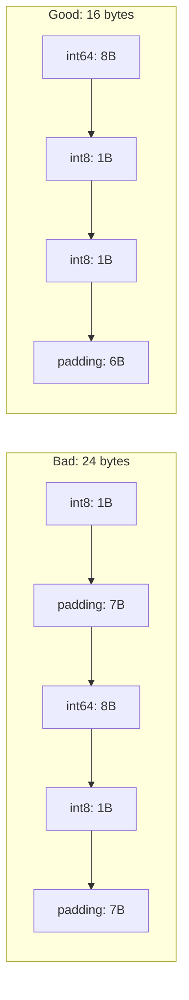

# Numeric Types — Senior Level

## Table of Contents
1. [Introduction](#introduction)
2. [Architecture Decisions](#architecture-decisions)
3. [Performance Benchmarks](#performance-benchmarks)
4. [Memory Layout](#memory-layout)
5. [Overflow and Saturation Arithmetic](#overflow-and-saturation-arithmetic)
6. [Type System Design Patterns](#type-system-design-patterns)
7. [Numeric Stability](#numeric-stability)
8. [Postmortems & System Failures](#postmortems--system-failures)
9. [Concurrency and Numeric Types](#concurrency-and-numeric-types)
10. [Cross-Platform Considerations](#cross-platform-considerations)
11. [Optimization Techniques](#optimization-techniques)
12. [Test Strategies](#test-strategies)
13. [Interview Questions](#interview-questions)
14. [Summary](#summary)
15. [Diagrams & Visual Aids](#diagrams--visual-aids)

---

## Introduction
> Focus: "How to optimize?" and "How to architect?"

At the senior level, numeric types are not just about holding values — they are about making deliberate architectural decisions that affect performance, correctness, and maintainability. This means choosing the right type for the right domain, designing type hierarchies that prevent unit errors, understanding the performance implications of each type, and handling edge cases that only appear under production load.

Senior engineers think about numeric types in terms of: invariants (what values are valid?), overflow risk (how does this behave at the limits?), performance (what is the CPU cost of this operation at scale?), and cross-system compatibility (how does this serialize across language boundaries?).

---

## Architecture Decisions

### Designing Domain Types over Primitives

```go
// Anti-pattern: primitive obsession
func transfer(amount float64, fromAccount, toAccount int64) error {
    // What unit is amount? Dollars? Cents? Is it valid?
    // What kind of ID are these? User ID? Account ID?
}

// Better: strong domain types
type Cents int64
type AccountID int64
type UserID int64

func (c Cents) IsValid() bool {
    return c > 0
}

func (c Cents) String() string {
    return fmt.Sprintf("$%d.%02d", c/100, c%100)
}

func Transfer(amount Cents, from, to AccountID) error {
    if !amount.IsValid() {
        return fmt.Errorf("invalid transfer amount: %v", amount)
    }
    // ...
    return nil
}
```

### Numeric Type Selection Matrix

| Domain | Type | Reasoning |
|--------|------|-----------|
| Array index, loop counter | `int` | Native pointer size, best CPU efficiency |
| Database ID, primary key | `int64` | Will exceed 2^31 in large systems |
| Unix timestamp (seconds) | `int64` | Year 2038 safety |
| Unix timestamp (nanos) | `int64` | time.Now().UnixNano() returns int64 |
| Money | `int64` (cents) | No FP imprecision |
| Percentage | `float64` | Accept FP imprecision; validate 0-100 |
| IP address | `uint32` or [4]byte | 32-bit network byte order |
| Port number | `uint16` | 0-65535 by TCP/IP spec |
| Pixel value | `uint8` | 0-255 per color channel |
| File size | `int64` | Files > 4GB use >32 bits |
| HTTP status code | `int` | Small range, idiomatic int |
| Duration | `time.Duration` (int64 nanos) | stdlib standard |

---

## Performance Benchmarks

```go
package bench_test

import (
    "testing"
)

// Benchmark: int32 vs int64 vs float64 addition
func BenchmarkInt32Add(b *testing.B) {
    var x int32 = 1
    for i := 0; i < b.N; i++ { x += 1 }
}

func BenchmarkInt64Add(b *testing.B) {
    var x int64 = 1
    for i := 0; i < b.N; i++ { x += 1 }
}

func BenchmarkFloat64Add(b *testing.B) {
    var x float64 = 1.0
    for i := 0; i < b.N; i++ { x += 1.0 }
}

// On AMD64: all three run at ~1 ns/op — same instruction count
// On ARM32: int64 takes 2 cycles vs 1 for int32

// SIMD operations show bigger float32 vs float64 difference:
// float32 arrays can pack 2x more values in AVX registers
```

### Memory Usage Comparison

```go
// 1 million elements:
// []int8:   1 MB (very cache-friendly)
// []int32:  4 MB
// []int64:  8 MB
// []float32: 4 MB
// []float64: 8 MB

// For read-heavy, calculation-light workloads, smaller types
// dramatically improve cache hit rates and throughput.
```

---

## Memory Layout

```
int8:    1 byte
int16:   2 bytes (must be 2-byte aligned)
int32:   4 bytes (must be 4-byte aligned)
int64:   8 bytes (must be 8-byte aligned)
float32: 4 bytes (IEEE 754 single)
float64: 8 bytes (IEEE 754 double)
complex64:  8 bytes  (two float32)
complex128: 16 bytes (two float64)

Struct alignment example:
type Bad struct {
    a int8   // 1 byte
              // 7 bytes padding
    b int64  // 8 bytes
    c int8   // 1 byte
              // 7 bytes padding
}
// Total: 24 bytes (inefficient!)

type Good struct {
    b int64  // 8 bytes
    a int8   // 1 byte
    c int8   // 1 byte
              // 6 bytes padding
}
// Total: 16 bytes (better!)
```

---

## Overflow and Saturation Arithmetic

### Detecting Overflow Before It Happens

```go
import "math/bits"

// Safe addition with overflow detection (using math/bits)
func safeAddInt64(a, b int64) (int64, bool) {
    result, overflow := bits.Add64(uint64(a), uint64(b), 0)
    // Check if sign changed unexpectedly
    if (a > 0 && b > 0 && int64(result) < 0) ||
       (a < 0 && b < 0 && int64(result) > 0) {
        return 0, false  // overflow
    }
    _ = overflow
    return int64(result), true
}

// Saturation arithmetic (clamp instead of wrap)
func saturatingAddInt8(a, b int8) int8 {
    result := int16(a) + int16(b)
    if result > 127 { return 127 }
    if result < -128 { return -128 }
    return int8(result)
}
```

---

## Type System Design Patterns

### Newtype Pattern for Type Safety

```go
// Prevents mixing incompatible units at compile time
type Meters float64
type Feet float64
type Seconds float64
type Milliseconds float64

func (m Meters) ToFeet() Feet {
    return Feet(m * 3.28084)
}

func (ms Milliseconds) ToSeconds() Seconds {
    return Seconds(ms / 1000)
}

// This won't compile — prevents unit bugs!
// var speed Meters = Feet(5)  // compile error
```

### Validated Numeric Wrapper

```go
type Percentage struct {
    value float64
}

func NewPercentage(v float64) (Percentage, error) {
    if v < 0 || v > 100 {
        return Percentage{}, fmt.Errorf("percentage %f out of range [0, 100]", v)
    }
    return Percentage{value: v}, nil
}

func (p Percentage) Value() float64 { return p.value }
func (p Percentage) AsFraction() float64 { return p.value / 100 }
```

---

## Numeric Stability

### Kahan Summation Algorithm

```go
// Naive sum accumulates FP errors for large sequences
func naiveSum(data []float64) float64 {
    sum := 0.0
    for _, v := range data {
        sum += v
    }
    return sum
}

// Kahan compensated summation — dramatically reduces error
func kahanSum(data []float64) float64 {
    var sum, compensation float64
    for _, v := range data {
        y := v - compensation
        t := sum + y
        compensation = (t - sum) - y
        sum = t
    }
    return sum
}
```

### Numerically Stable Comparison

```go
// Different epsilons for different use cases
const (
    EpsilonAbsolute = 1e-9  // for values near 0
    EpsilonRelative = 1e-6  // for large values
)

func nearlyEqual(a, b float64) bool {
    if a == b { return true }  // handles infinities
    diff := math.Abs(a - b)
    if a == 0 || b == 0 || diff < math.SmallestNonzeroFloat64 {
        return diff < EpsilonAbsolute
    }
    return diff/(math.Abs(a)+math.Abs(b)) < EpsilonRelative
}
```

---

## Postmortems & System Failures

### Case 1: Ariane 5 Rocket Explosion (1996)
**What happened**: A 64-bit floating-point value (horizontal velocity) was converted to a 16-bit signed integer. The value exceeded the int16 maximum, causing an overflow and triggering the self-destruct mechanism. Loss: $370 million.
**Lesson**: Always check whether a value can exceed the target type's range before converting. Use overflow detection functions.

### Case 2: Year 2038 Problem
**What happened**: Unix timestamps stored as `int32` will overflow on January 19, 2038, at 03:14:07 UTC, wrapping to a negative value representing 1901.
**Lesson**: Use `int64` for all timestamp storage. The Go `time` package uses `int64` internally, but legacy systems (databases, APIs) may use int32.

### Case 3: Binary Search Overflow Bug (Java, Jdk <= 6)
**What happened**: `mid = (lo + hi) / 2` in binary search. If `lo + hi > MaxInt`, the addition overflows to a negative number, causing an invalid array index.
**Fix**: `mid = lo + (hi - lo) / 2`
**Lesson**: Addition of two positive large numbers can overflow. This affects any code that averages two large indices.

### Case 4: Boeing 787 Integer Counter
**What happened**: A counter stored as a 32-bit integer would overflow after 248 days of continuous operation, causing generator shutdowns.
**Lesson**: For safety-critical systems, use the widest integer type, add monitoring for counter growth, and implement overflow detection.

---

## Concurrency and Numeric Types

### Atomic Operations

```go
import "sync/atomic"

type Counter struct {
    value int64  // must be int64 for atomic ops on 32-bit platforms
}

func (c *Counter) Increment() {
    atomic.AddInt64(&c.value, 1)
}

func (c *Counter) Get() int64 {
    return atomic.LoadInt64(&c.value)
}

// Note: use int64, not int, for atomic operations
// On 32-bit platforms, 64-bit atomic operations need 8-byte alignment
// which is guaranteed for int64 fields but not always for int
```

---

## Cross-Platform Considerations

```go
// int size: 32-bit on 32-bit platforms, 64-bit on 64-bit platforms
// This means code that works on 64-bit may fail on 32-bit if
// you store values > MaxInt32 in an int

// For serialization: ALWAYS use fixed-width types
type SerializedData struct {
    Count  int32   `json:"count"`  // not int
    Offset int64   `json:"offset"` // not int
    Value  float64 `json:"value"`  // not float32
}

// For cross-language JSON: int64 > 2^53 loses precision in JS
// Solution: serialize as string
type APIResponse struct {
    ID    string  `json:"id"`    // int64 as string
    Count int32   `json:"count"` // safe in JS (< 2^31)
}
```

---

## Optimization Techniques

### Use int for Indexing (Not int64)

```go
// On 64-bit: same size, but compiler can optimize index math better
for i := 0; i < len(data); i++ {  // i is int — optimal
    _ = data[i]
}

// Range loop also uses int for index
for i, v := range data {  // i is int
    _ = i; _ = v
}
```

### Avoid Repeated Type Conversions

```go
// Bad: converting in hot loop
func processPixels(img []uint8) []float64 {
    result := make([]float64, len(img))
    for i, p := range img {
        result[i] = float64(p) / 255.0 * 2.0 - 1.0  // conversion each iteration
    }
    return result
}

// Better: precompute the LUT (lookup table)
var lutUint8ToFloat64 [256]float64
func init() {
    for i := range lutUint8ToFloat64 {
        lutUint8ToFloat64[i] = float64(i)/255.0*2.0 - 1.0
    }
}

func processPixelsFast(img []uint8) []float64 {
    result := make([]float64, len(img))
    for i, p := range img {
        result[i] = lutUint8ToFloat64[p]  // table lookup, no conversion
    }
    return result
}
```

---

## Test Strategies

```go
package numtypes_test

import (
    "math"
    "testing"
    "testing/quick"
)

// Property-based testing for numeric operations
func TestAdditionCommutativity(t *testing.T) {
    f := func(a, b int32) bool {
        return a+b == b+a
    }
    if err := quick.Check(f, nil); err != nil {
        t.Error(err)
    }
}

// Overflow boundary tests
func TestInt8Boundaries(t *testing.T) {
    cases := []struct{ input int8; increment int8; expected int8 }{
        {math.MaxInt8, 1, math.MinInt8},   // overflow wrap
        {math.MinInt8, -1, math.MaxInt8},  // underflow wrap
    }
    for _, c := range cases {
        result := c.input + c.increment
        if result != c.expected {
            t.Errorf("%d + %d = %d, want %d", c.input, c.increment, result, c.expected)
        }
    }
}

// Float stability test
func TestKahanSumStability(t *testing.T) {
    // Sum 1.0 + 1e15 + (-1e15) should equal 1.0
    data := []float64{1.0, 1e15, -1e15}
    naive := data[0] + data[1] + data[2]
    kahan := kahanSum(data)

    if naive != 1.0 {
        t.Logf("Naive sum error: got %v, want 1.0", naive)
    }
    if kahan != 1.0 {
        t.Errorf("Kahan sum error: got %v, want 1.0", kahan)
    }
}
```

---

## Interview Questions

**Q**: How would you design a money type in Go?
**A**: Use `int64` to store cents (or smallest currency unit). Create a named type `Money int64` with methods for formatting, arithmetic, and validation. Never use `float64` — IEEE 754 cannot represent most decimal fractions exactly, leading to rounding errors in financial calculations.

**Q**: Explain how integer overflow works in Go and how you detect it.
**A**: Go's integer overflow is well-defined: it wraps around using Two's Complement arithmetic. `MaxInt8 + 1 = MinInt8`. Go does not panic. Detection: use a wider type for the calculation, then check bounds before converting back. The `math/bits` package provides overflow-aware operations.

**Q**: When would you choose `float32` over `float64`?
**A**: When dealing with very large arrays of floating-point data where memory and cache pressure matter (e.g., graphics vertex buffers, ML model weights during inference). On modern CPUs, SIMD instructions process 8 float32 values vs 4 float64 values per instruction. For scalar calculations, float64 is almost always preferred.

**Q**: What is the Year 2038 problem and how does Go handle it?
**A**: Unix time stored as `int32` overflows on Jan 19, 2038. Go's `time.Time` uses `int64` internally, so Go programs are safe. But code that interfaces with legacy C libraries, databases, or protocols may still receive `int32` timestamps.

---

## Summary

At the senior level, numeric type selection is an architectural decision. Use strong domain types (newtype pattern) to prevent unit confusion. Implement overflow detection for security-critical and safety-critical code. Be aware of floating-point instability in summation-heavy code (use Kahan algorithm when precision matters). Design APIs that are robust to cross-platform int size differences by using fixed-width types in serialized formats. Learn from historical failures (Ariane 5, Y2K, Y2038) to understand the real cost of numeric type bugs.

---

## Diagrams & Visual Aids

### Two's Complement Overflow Visualization

```
int8 number line (wraps around):
... -2  -1   0   1   2 ...
  ↑                    ↑
-128 ←—— wraps ——→ +127

After int8(127) + 1:
0111 1111  (+127)
+ 0000 0001 (+1)
──────────────
  1000 0000  = -128 in two's complement
```

### Memory Alignment in Structs


