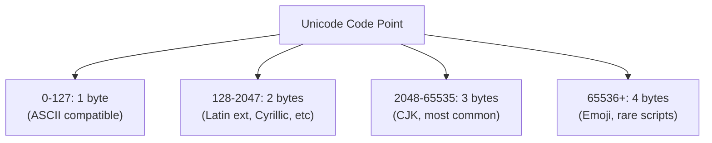

# Runes — Junior Level

## Table of Contents
1. [Introduction](#introduction)
2. [Prerequisites](#prerequisites)
3. [Glossary](#glossary)
4. [Core Concepts](#core-concepts)
5. [Real-World Analogies](#real-world-analogies)
6. [Mental Models](#mental-models)
7. [Pros & Cons](#pros--cons)
8. [Use Cases](#use-cases)
9. [Code Examples](#code-examples)
10. [Coding Patterns](#coding-patterns)
11. [Clean Code](#clean-code)
12. [Product Use / Feature](#product-use--feature)
13. [Error Handling](#error-handling)
14. [Security Considerations](#security-considerations)
15. [Performance Tips](#performance-tips)
16. [Metrics & Analytics](#metrics--analytics)
17. [Best Practices](#best-practices)
18. [Edge Cases & Pitfalls](#edge-cases--pitfalls)
19. [Common Mistakes](#common-mistakes)
20. [Common Misconceptions](#common-misconceptions)
21. [Tricky Points](#tricky-points)
22. [Test](#test)
23. [Tricky Questions](#tricky-questions)
24. [Cheat Sheet](#cheat-sheet)
25. [Self-Assessment Checklist](#self-assessment-checklist)
26. [Summary](#summary)
27. [What You Can Build](#what-you-can-build)
28. [Further Reading](#further-reading)
29. [Related Topics](#related-topics)
30. [Diagrams & Visual Aids](#diagrams--visual-aids)

---

## Introduction
> Focus: "What is it?" and "How to use it?"

A `rune` in Go is an alias for `int32` and represents a single Unicode code point. Unicode is the standard that assigns a unique number (code point) to every character in every human writing system — from Latin letters to Chinese characters, Arabic script, emojis, and beyond. A rune is Go's way of representing "one character" in the Unicode sense.

Why is this distinction important? Because Go strings are sequences of bytes (UTF-8 encoded), not sequences of characters. The English letter "A" is 1 byte, but the Chinese character "中" is 3 bytes. If you try to split a string by bytes, you'll cut characters in half! The `rune` type lets you work with characters correctly, regardless of their byte size.

The difference between bytes and runes is one of the most important concepts in Go string handling. Getting it wrong leads to garbled text, incorrect string lengths, and broken international character processing.

---

## Prerequisites
- Basic Go variables and types
- Understanding of strings in Go
- Basic knowledge of character encoding (helpful)

---

## Glossary

| Term | Definition |
|------|-----------|
| `rune` | Alias for `int32`; represents a Unicode code point |
| Unicode | The universal character encoding standard |
| Code point | A unique number assigned to each Unicode character |
| UTF-8 | A variable-length encoding of Unicode (1-4 bytes per character) |
| Byte | An 8-bit unit (uint8) |
| Grapheme | What a user perceives as a single character (may be multiple code points) |
| BOM | Byte Order Mark — a special Unicode sequence sometimes at start of files |
| `unicode` package | Go package for Unicode character classification |

---

## Core Concepts

### rune is int32

```go
type rune = int32  // exact definition in Go
var r rune = 'A'  // single character in single quotes
fmt.Println(r)    // 65 (Unicode code point for A)
fmt.Printf("%c\n", r) // A (print as character)
```

### Rune Literals

```go
r1 := 'A'          // 65   (ASCII/Unicode code point)
r2 := '中'          // 20013 (Chinese character)
r3 := '\n'         // 10   (newline escape)
r4 := '\t'         // 9    (tab escape)
r5 := '\u0041'     // 65   (Unicode escape: A)
r6 := '\U0001F600' // 😀  (emoji — 4-byte Unicode)
r7 := '\xFF'       // 255  (byte escape)
```

### bytes vs runes in Strings

```go
s := "Hello, 中文"

// byte count
fmt.Println(len(s))  // 13 (7 ASCII + 6 bytes for 2 Chinese chars)

// rune count  
fmt.Println(len([]rune(s)))  // 9 (7 ASCII + 2 Chinese chars)

// OR use unicode/utf8 package
import "unicode/utf8"
fmt.Println(utf8.RuneCountInString(s))  // 9
```

### Iterating: range Gives Runes

```go
s := "Hi中"
for i, r := range s {
    fmt.Printf("index=%d rune=%d char=%c bytes=%d\n",
        i, r, r, utf8.RuneLen(r))
}
// Output:
// index=0 rune=72  char=H bytes=1
// index=1 rune=105 char=i bytes=1
// index=2 rune=20013 char=中 bytes=3
// Note: index jumps by the byte size of each rune
```

### Byte Iteration (raw bytes)

```go
s := "Hi中"
for i, b := range []byte(s) {
    fmt.Printf("byte[%d] = %d\n", i, b)
}
// Output: 5 bytes (H=72, i=105, 中 = 228, 184, 173)
```

---

## Real-World Analogies

**Rune = Character in a book**: When you read "中", you see one character. A rune represents that single character concept.

**UTF-8 = Shipping box**: Different characters need different-sized boxes. 'A' needs a small box (1 byte), '中' needs a large box (3 bytes). The rune tells you WHAT character it is; the bytes tell you HOW it's stored.

**Byte vs Rune**: Like counting words vs counting letters. A word "the" has 3 letters (runes) and 3 bytes. But "über" has 4 letters and 5 bytes (ü is 2 bytes in UTF-8).

---

## Mental Models

### The Postal Code Model

Think of Unicode code points as postal codes. "中" has code point U+4E2D (20013 in decimal). Just as a postal code uniquely identifies a location, a code point uniquely identifies a character.

### The Fixed vs Variable Length Model

```
Character | Code Point | UTF-8 bytes
A         | U+0041     | 1 byte  [41]
é         | U+00E9     | 2 bytes [C3 A9]
中        | U+4E2D     | 3 bytes [E4 B8 AD]
😀        | U+1F600    | 4 bytes [F0 9F 98 80]
```

A rune always holds the code point (fixed: int32). UTF-8 encoding uses variable bytes.

---

## Pros & Cons

### Pros
- **Unicode-correct character processing**: work with actual characters, not raw bytes
- **Type alias for int32**: zero overhead, rune IS int32
- **Range loop integration**: `for i, r := range s` gives runes automatically
- **Rich `unicode` package**: IsLetter, IsDigit, ToUpper, ToLower, etc.
- **Clear intent**: using `rune` communicates "I'm working with Unicode characters"

### Cons
- **Extra memory**: converting string to []rune copies the data
- **Invisible complexity**: rune != grapheme cluster (emoji modifiers, ZWJ sequences)
- **Confusing for beginners**: why does `len("中")` = 3 not 1?

---

## Use Cases

1. **Counting characters**: `len([]rune(s))` vs `len(s)` for byte count
2. **Reversing strings**: Must reverse by rune, not byte
3. **Truncating strings**: Truncate at rune boundaries
4. **Checking character type**: `unicode.IsLetter(r)`, `unicode.IsDigit(r)`
5. **Case conversion**: `unicode.ToUpper(r)`, `unicode.ToLower(r)`
6. **Character validation**: Ensure input contains only certain characters
7. **Unicode normalization**: Processing text from multiple scripts

---

## Code Examples

### Example 1: Basic Rune Operations

```go
package main

import (
    "fmt"
    "unicode"
)

func main() {
    r := 'G'
    fmt.Println("Rune:", r)              // 71 (code point)
    fmt.Printf("Character: %c\n", r)   // G
    fmt.Printf("Type: %T\n", r)        // int32

    // Unicode checks
    fmt.Println("IsLetter:", unicode.IsLetter(r))  // true
    fmt.Println("IsUpper:", unicode.IsUpper(r))    // true
    fmt.Println("ToLower:", string(unicode.ToLower(r))) // g
}
```

### Example 2: String as Rune Slice

```go
package main

import "fmt"

func main() {
    s := "Hello, 世界"

    // Wrong: byte count
    fmt.Println("Bytes:", len(s))           // 13

    // Right: rune count
    runes := []rune(s)
    fmt.Println("Characters:", len(runes))  // 9

    // Access characters safely
    fmt.Printf("First char: %c\n", runes[0])  // H
    fmt.Printf("Last char:  %c\n", runes[len(runes)-1])  // 界

    // Index by character
    fmt.Printf("Char 7: %c\n", runes[7])  // 世
}
```

### Example 3: Range Loop

```go
package main

import "fmt"

func main() {
    s := "Hello中"

    fmt.Println("Using range (runes):")
    for i, r := range s {
        fmt.Printf("  s[%d] = %c (U+%04X, %d bytes)\n",
            i, r, r, len(string(r)))
    }

    fmt.Println("\nUsing []byte (raw bytes):")
    for i, b := range []byte(s) {
        fmt.Printf("  byte[%d] = 0x%02X (%d)\n", i, b, b)
    }
}
```

### Example 4: String Reversal (Correct Way)

```go
package main

import "fmt"

func reverseString(s string) string {
    runes := []rune(s)
    for i, j := 0, len(runes)-1; i < j; i, j = i+1, j-1 {
        runes[i], runes[j] = runes[j], runes[i]
    }
    return string(runes)
}

func main() {
    s := "Hello, 中文!"
    fmt.Println("Original:", s)
    fmt.Println("Reversed:", reverseString(s))
    // Reversed: !文中 ,olleH
}
```

### Example 5: Character Classification

```go
package main

import (
    "fmt"
    "unicode"
)

func analyzeString(s string) {
    for _, r := range s {
        switch {
        case unicode.IsLetter(r):
            fmt.Printf("%c: letter\n", r)
        case unicode.IsDigit(r):
            fmt.Printf("%c: digit\n", r)
        case unicode.IsSpace(r):
            fmt.Printf("%c: space\n", r)
        case unicode.IsPunct(r):
            fmt.Printf("%c: punctuation\n", r)
        default:
            fmt.Printf("%c: other\n", r)
        }
    }
}

func main() {
    analyzeString("Go 3.14!")
}
```

---

## Coding Patterns

### Pattern 1: Safe String Truncation

```go
func truncate(s string, maxRunes int) string {
    runes := []rune(s)
    if len(runes) <= maxRunes {
        return s
    }
    return string(runes[:maxRunes])
}
```

### Pattern 2: Count Specific Characters

```go
func countChar(s string, target rune) int {
    count := 0
    for _, r := range s {
        if r == target {
            count++
        }
    }
    return count
}
```

### Pattern 3: Filter Characters

```go
func removeNonLetters(s string) string {
    var result []rune
    for _, r := range s {
        if unicode.IsLetter(r) || unicode.IsSpace(r) {
            result = append(result, r)
        }
    }
    return string(result)
}
```

### Pattern 4: Check if ASCII

```go
func isASCII(s string) bool {
    for _, r := range s {
        if r > 127 {
            return false
        }
    }
    return true
}
```

---

## Clean Code

### Use Descriptive Variable Names

```go
// Bad
for _, x := range s { }

// Good
for _, ch := range s { }      // for single characters
for _, r := range s { }       // r is conventional for rune
for _, letter := range word { } // descriptive
```

### Prefer utf8.RuneCountInString Over []rune Conversion

```go
// Less efficient: allocates new []rune
count := len([]rune(s))

// More efficient: counts without allocation
count := utf8.RuneCountInString(s)
```

---

## Product Use / Feature

**Internationalization (i18n)**: Any app that supports multiple languages must handle runes correctly. Username validation, character counting for tweets/messages, text search across languages.

**Username Validation**: Don't limit usernames to ASCII — `unicode.IsLetter` and `unicode.IsNumber` work for all scripts.

**Text Display**: When truncating display text (e.g., "Show 20 characters"), use rune count, not byte count.

**Search**: Full-text search must handle multi-byte characters correctly.

---

## Error Handling

```go
import "unicode/utf8"

// Check if a string contains valid UTF-8
func validateUTF8(s string) error {
    if !utf8.ValidString(s) {
        return fmt.Errorf("string contains invalid UTF-8 sequence")
    }
    return nil
}

// Find first invalid UTF-8 byte
for i, r := range s {
    if r == utf8.RuneError {
        // Check if it's a genuine replacement character or an error
        _, size := utf8.DecodeRuneInString(s[i:])
        if size == 1 {
            return fmt.Errorf("invalid UTF-8 at byte %d", i)
        }
    }
}
```

---

## Security Considerations

- **Input validation**: Always validate that user input is valid UTF-8 before processing.
- **Unicode normalization attacks**: Different Unicode sequences can look identical but compare differently. Use `golang.org/x/text/unicode/norm` for normalization.
- **Homoglyph attacks**: Characters from different scripts look visually similar (e.g., Cyrillic "а" vs Latin "a"). Validate that strings use only expected character sets.
- **Length limits**: Limit user input by rune count, not byte count — `len([]rune(input)) > maxLen`.

---

## Performance Tips

- **Use `utf8.RuneCountInString` instead of `len([]rune(s))`** — no allocation
- **Use range loop** instead of converting to `[]rune` when you only need to iterate
- **Only convert to `[]rune` when you need random access** to characters by index
- **`strings.Map` and `strings.IndexRune`** work correctly with runes without manual conversion

---

## Metrics & Analytics

```go
type TextStats struct {
    ByteCount  int
    RuneCount  int
    LineCount  int
    WordCount  int
    HasNonASCII bool
}

func analyzeText(s string) TextStats {
    stats := TextStats{
        ByteCount: len(s),
        RuneCount: utf8.RuneCountInString(s),
    }
    for _, r := range s {
        if r == '\n' { stats.LineCount++ }
        if r == ' ' { stats.WordCount++ }
        if r > 127 { stats.HasNonASCII = true }
    }
    return stats
}
```

---

## Best Practices

1. **Use `range` for iterating over strings** — gives runes automatically
2. **Use `utf8.RuneCountInString` for character count** — no allocation
3. **Convert to `[]rune` only when you need random access** by character index
4. **Validate UTF-8 input** from external sources with `utf8.ValidString`
5. **Use the `unicode` package** for character classification
6. **Truncate by rune count**, not byte count
7. **Use `string(r)` to convert a single rune back to string**

---

## Edge Cases & Pitfalls

### Pitfall 1: Using len() for Character Count

```go
s := "中文"
fmt.Println(len(s))           // 6 (bytes!)
fmt.Println(len([]rune(s)))   // 2 (characters)
```

### Pitfall 2: Byte Indexing Cuts Characters

```go
s := "中文"
fmt.Println(s[:1])  // Garbage byte! Not a valid character
fmt.Println(string([]rune(s)[:1]))  // "中" — correct
```

### Pitfall 3: utf8.RuneError

```go
// range gives utf8.RuneError (U+FFFD) for invalid UTF-8 sequences
// This is NOT an error — it's the replacement character
// Check if it's a real error:
for i, r := range s {
    if r == utf8.RuneError {
        _, size := utf8.DecodeRuneInString(s[i:])
        if size == 1 {
            fmt.Println("Invalid UTF-8 at byte", i)
        }
    }
}
```

---

## Common Mistakes

### Mistake 1: Byte Indexing for Characters

```go
// Wrong
s := "Hello, 中文!"
lastChar := s[len(s)-1]  // byte, might be mid-character!

// Right
runes := []rune(s)
lastRune := runes[len(runes)-1]  // last character
```

### Mistake 2: Confusing rune Literal and String Literal

```go
var r rune = 'A'    // single quotes — rune literal
var s string = "A"  // double quotes — string literal
// 'A' == 65 (int32), "A" == "A" (string) — different types!
```

---

## Common Misconceptions

**"rune = UTF-8 byte sequence"**: No — a rune is a Unicode code point (int32). UTF-8 is the encoding used to store that code point as bytes.

**"One rune = one visible character"**: Not always. Emoji like 👨‍👩‍👧 consist of multiple code points (runes) joined by Zero Width Joiner characters. A "grapheme cluster" is what users see as one character.

**"`len(s)` gives the number of characters"**: No — `len(s)` gives the number of bytes. Use `utf8.RuneCountInString(s)` for character count.

---

## Tricky Points

1. `rune` is identical to `int32` — they are the same type.
2. Single quotes `'A'` create a rune literal; double quotes `"A"` create a string.
3. `len(string)` = bytes, `len([]rune(string))` = characters.
4. `range` over a string yields `(int, rune)` pairs where int is byte offset.
5. `s[i]` gives a `byte` (uint8), not a rune.
6. `string(65)` creates the string "A" (rune 65 → string), not "65".

---

## Test

```go
package main

import (
    "testing"
    "unicode/utf8"
)

func TestRuneCount(t *testing.T) {
    s := "Hello, 中文"
    byteLen := len(s)
    runeLen := utf8.RuneCountInString(s)

    if byteLen != 13 {
        t.Errorf("expected 13 bytes, got %d", byteLen)
    }
    if runeLen != 9 {
        t.Errorf("expected 9 runes, got %d", runeLen)
    }
}

func TestRangeGivesRunes(t *testing.T) {
    s := "中"
    var runes []rune
    for _, r := range s {
        runes = append(runes, r)
    }
    if len(runes) != 1 {
        t.Errorf("expected 1 rune, got %d", len(runes))
    }
    if runes[0] != '中' {
        t.Errorf("expected rune 中, got %c", runes[0])
    }
}

func TestReverseString(t *testing.T) {
    s := "Go中文"
    reversed := reverseString(s)
    if reversed != "文中oG" {
        t.Errorf("reversed %q = %q, want %q", s, reversed, "文中oG")
    }
}
```

---

## Tricky Questions

**Q1**: What does `len("中")` return?
```go
fmt.Println(len("中"))  // 3 (bytes, not 1 character)
```

**Q2**: What is the type of `'A'` in Go?
```go
r := 'A'
fmt.Printf("%T\n", r)  // int32 (rune is alias for int32)
```

**Q3**: What does `string(65)` produce?
```go
fmt.Println(string(65))  // "A" (rune 65 = A, not "65")
```

**Q4**: How many bytes does the Chinese character "中" take in UTF-8?
```
3 bytes: 0xE4 0xB8 0xAD
```

**Q5**: Can you use `s[0]` to get the first rune of a string?
```go
// s[0] gives the first BYTE as uint8, not the first rune
// For rune: first rune using range or utf8.DecodeRuneInString
r, _ := utf8.DecodeRuneInString(s)
```

---

## Cheat Sheet

```go
// Declare
var r rune = 'A'           // 65
r := '中'                  // 20013
r := '\u4e2d'             // 20013 (Unicode escape)
r := '\U0001F600'         // 😀 (emoji)

// Type: rune = int32
fmt.Printf("%T", 'A')     // int32

// Print
fmt.Printf("%c", r)       // as character
fmt.Printf("%d", r)       // as integer
fmt.Printf("U+%04X", r)  // as Unicode code point

// String ↔ Rune
string(r)                 // rune to string
[]rune("hello")           // string to []rune
'H' == []rune("H")[0]    // true

// Count characters
len(s)                    // byte count
utf8.RuneCountInString(s) // rune count (no alloc)
len([]rune(s))            // rune count (with alloc)

// Iterate
for i, r := range s { }  // i=byte index, r=rune

// Unicode package
unicode.IsLetter(r)       // true if letter
unicode.IsDigit(r)        // true if digit
unicode.IsSpace(r)        // true if whitespace
unicode.ToUpper(r)        // uppercase rune
unicode.ToLower(r)        // lowercase rune
```

---

## Self-Assessment Checklist

- [ ] I know that `rune` is an alias for `int32`
- [ ] I know single quotes make rune literals, double quotes make strings
- [ ] I know `len(s)` = bytes, not characters
- [ ] I can use `utf8.RuneCountInString(s)` for character count
- [ ] I know `range` over a string yields runes
- [ ] I can convert between `string`, `[]rune`, and `[]byte`
- [ ] I can use `unicode.IsLetter`, `unicode.ToUpper`, etc.
- [ ] I know how to correctly reverse a Unicode string
- [ ] I know how to truncate a string by character count
- [ ] I can validate UTF-8 input with `utf8.ValidString`

---

## Summary

`rune` is Go's way of representing a single Unicode character. It's an alias for `int32` and holds a Unicode code point. The key insight is that strings in Go are byte sequences (UTF-8), and one character may take 1-4 bytes. Using `len(s)` gives bytes, not characters. The `range` loop over a string automatically decodes UTF-8 and yields runes. For character counting, use `utf8.RuneCountInString`. For random access by character index, convert to `[]rune`. The `unicode` package provides character classification and case conversion.

---

## What You Can Build

- Unicode-aware text editor (correct cursor movement)
- Multi-language username validator
- Text statistics tool (character/word count)
- String reversal that handles all languages
- Password strength checker with Unicode support

---

## Further Reading

- [Go Blog: Strings, bytes, runes and characters](https://go.dev/blog/strings)
- [unicode package](https://pkg.go.dev/unicode)
- [unicode/utf8 package](https://pkg.go.dev/unicode/utf8)
- [Unicode FAQ](https://www.unicode.org/faq/)

---

## Related Topics

- Strings in Go (parent topic)
- UTF-8 encoding
- `unicode` and `unicode/utf8` packages
- String manipulation with `strings` package
- `golang.org/x/text` for advanced Unicode

---

## Diagrams & Visual Aids

### Byte vs Rune Count

```
String: "Hi中"
Bytes:  H  i  E4 B8 AD
        ^  ^  ^─────^
        1B 1B  3 bytes (one rune)
        
len("Hi中") = 5 (bytes)
len([]rune("Hi中")) = 3 (runes/characters)
```

### range Loop Index Behavior

```
"Hi中" — range loop:
  i=0, r=H  (H takes 1 byte, next i=1)
  i=1, r=i  (i takes 1 byte, next i=2)
  i=2, r=中  (中 takes 3 bytes, next i=5)
  
  → index i is BYTE position, not character number
```

### UTF-8 Encoding Ranges


