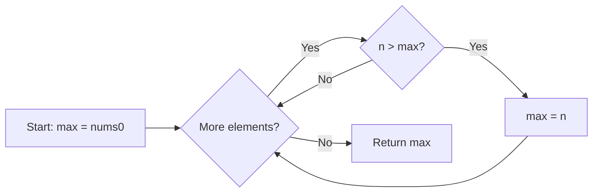
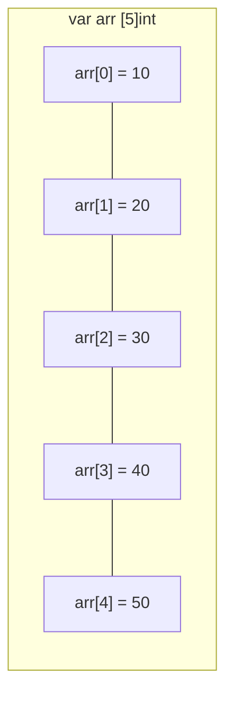
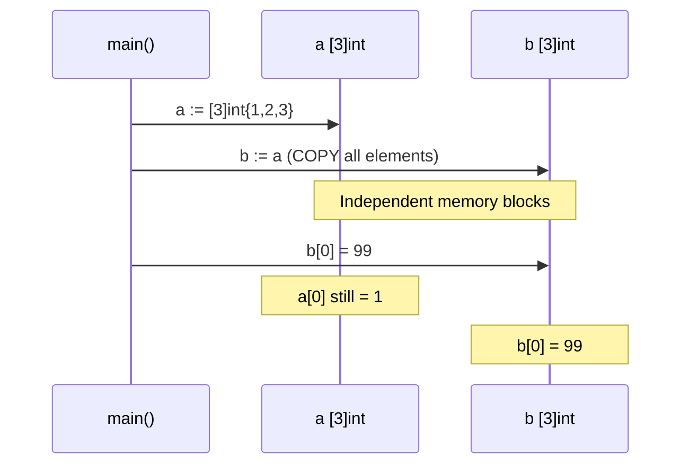
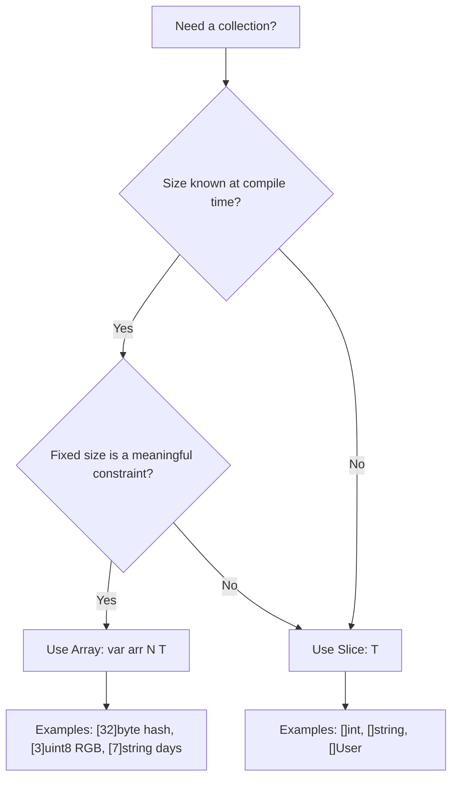

# Arrays — Junior Level

## Table of Contents
1. Introduction
2. Prerequisites
3. Glossary
4. Core Concepts
5. Real-World Analogies
6. Mental Models
7. Pros & Cons
8. Use Cases
9. Code Examples
10. Coding Patterns
11. Clean Code
12. Product Use / Feature
13. Error Handling
14. Security Considerations
15. Performance Tips
16. Metrics & Analytics
17. Best Practices
18. Edge Cases & Pitfalls
19. Common Mistakes
20. Common Misconceptions
21. Tricky Points
22. Test
23. Tricky Questions
24. Cheat Sheet
25. Self-Assessment Checklist
26. Summary
27. What You Can Build
28. Further Reading
29. Related Topics
30. Diagrams & Visual Aids

---

## Introduction

An **array** in Go is a fixed-size, ordered collection of elements of the same type. Think of it as a row of numbered boxes — each box holds one value, every box is the same size, and the total number of boxes never changes after you create the array. You access each box by its position number (called an **index**), starting from zero.

Arrays are the foundational building block for collections in Go. While you will use slices far more often in real programs, understanding arrays is essential because slices are built on top of arrays. Every slice has an underlying array powering it behind the scenes.

One of the most important things to understand early on is that **the size of an array is part of its type** in Go. This means `[3]int` and `[5]int` are completely different types — you cannot assign one to the other or pass one where the other is expected. This makes arrays very predictable and safe, but also inflexible for general-purpose use.

---

## Prerequisites

- **Required:** Basic Go syntax (variables, types, `fmt.Println`)
- **Required:** Understanding of what a type is in Go
- **Helpful:** Familiarity with loops (`for`)
- **Helpful:** Basic understanding of memory (variables live in memory)

---

## Glossary

| Term | Definition |
|------|-----------|
| Array | A fixed-size sequence of elements of the same type |
| Index | The position of an element in an array (starts at 0) |
| Element | A single value stored in an array |
| Length | The number of elements an array can hold |
| Zero value | The default value Go assigns when you don't set a value |
| Value type | A type that is copied when assigned or passed to a function |
| Composite type | A type built from other types (arrays, slices, structs, maps) |
| Multi-dimensional | An array whose elements are also arrays |

---

## Core Concepts

### Concept 1: Declaration and Initialization

There are three main ways to declare an array in Go:

```go
package main

import "fmt"

func main() {
    // Form 1: Declare with zero values
    var scores [5]int
    fmt.Println(scores) // [0 0 0 0 0]

    // Form 2: Declare with initial values
    names := [3]string{"Alice", "Bob", "Charlie"}
    fmt.Println(names) // [Alice Bob Charlie]

    // Form 3: Let compiler count the elements with [...]
    coords := [...]float64{1.1, 2.2, 3.3}
    fmt.Println(coords)      // [1.1 2.2 3.3]
    fmt.Println(len(coords)) // 3
}
```

The `[...]` syntax is very convenient — you list your values and Go figures out the size for you. The size is still fixed after declaration.

### Concept 2: Indexing and Accessing Elements

Arrays use zero-based indexing. The first element is at index `0`, and the last element is at index `len(array) - 1`.

```go
package main

import "fmt"

func main() {
    fruits := [4]string{"apple", "banana", "cherry", "date"}

    fmt.Println(fruits[0]) // apple  (first element)
    fmt.Println(fruits[3]) // date   (last element)

    // Modify an element
    fruits[1] = "blueberry"
    fmt.Println(fruits) // [apple blueberry cherry date]

    // Safe way to access last element
    last := fruits[len(fruits)-1]
    fmt.Println(last) // date
}
```

### Concept 3: Arrays Are Value Types

This is the most important concept about arrays in Go. When you assign an array to another variable or pass it to a function, **Go copies the entire array**. Changing the copy does not affect the original.

```go
package main

import "fmt"

func main() {
    a := [3]int{1, 2, 3}
    b := a       // b is a COPY of a
    b[0] = 99    // changing b does NOT change a

    fmt.Println(a) // [1 2 3]  — unchanged
    fmt.Println(b) // [99 2 3] — changed
}
```

```go
package main

import "fmt"

func double(arr [3]int) {
    for i := range arr {
        arr[i] *= 2 // modifying the copy inside function
    }
    fmt.Println("inside function:", arr) // [2 4 6]
}

func main() {
    original := [3]int{1, 2, 3}
    double(original)
    fmt.Println("outside function:", original) // [1 2 3] — NOT changed
}
```

### Concept 4: Iterating Over Arrays

The most common way to go through every element of an array is with a `for` loop combined with `range`.

```go
package main

import "fmt"

func main() {
    temperatures := [5]float64{72.1, 68.4, 75.2, 80.0, 69.9}

    // Method 1: range gives index and value
    for i, temp := range temperatures {
        fmt.Printf("Day %d: %.1f°F\n", i+1, temp)
    }

    // Method 2: traditional for loop
    for i := 0; i < len(temperatures); i++ {
        fmt.Println(temperatures[i])
    }

    // Method 3: only values (discard index with _)
    for _, temp := range temperatures {
        fmt.Println(temp)
    }
}
```

### Concept 5: Comparing Arrays

Two arrays of the same type can be compared with `==`. Go compares each element one by one.

```go
package main

import "fmt"

func main() {
    a := [3]int{1, 2, 3}
    b := [3]int{1, 2, 3}
    c := [3]int{1, 2, 4}

    fmt.Println(a == b) // true  — all elements match
    fmt.Println(a == c) // false — last element differs
    fmt.Println(a != c) // true
}
```

---

## Real-World Analogies

| Concept | Analogy |
|---------|---------|
| Array | A fixed-size parking lot with numbered spaces |
| Index | The parking space number (starts at 0) |
| Length | The total number of parking spaces |
| Value type (copy) | Photocopying a form — changes to the copy don't affect the original |
| Zero value | Empty parking spaces waiting to be filled |
| `[...]int` | Buying exactly as many boxes as items you have to pack |
| Multi-dimensional array | A chess board (grid with rows and columns) |

---

## Mental Models

Think of an array as a **train with a fixed number of carriages**. Each carriage (element) is the same size and holds the same type of cargo. You can access any carriage directly by its number. Once the train is built, you cannot add or remove carriages — the count is permanent.

When you assign an array to another variable, imagine a **train factory that instantly clones the entire train**. You get an identical but completely separate train. Changing one train has zero effect on the other.

The index is simply the carriage's number, counting from 0. Carriage 0 is the engine (first), and the last carriage is number `len-1`.

---

## Pros & Cons

| Pros | Cons |
|------|------|
| Fixed size = predictable memory usage | Cannot grow or shrink dynamically |
| Value semantics = no accidental aliasing | Copying large arrays is expensive |
| Comparable with == | Must know size at compile time |
| Cache-friendly (contiguous memory) | Different sizes are different types |
| Safe — bounds checking prevents overflows | Passing large arrays copies them |

**When to use:** Fixed-size data known at compile time (checksums, color channels, grid sizes).

**When NOT to use:** Collections that might grow, general-purpose lists, unknown size upfront.

---

## Use Cases

- **Use Case 1: Cryptographic hashes.** `sha256.Sum256()` returns `[32]byte` — a fixed 32-byte array.
- **Use Case 2: Color representation.** `[3]uint8{255, 0, 0}` for RGB red. Always exactly 3 components.
- **Use Case 3: Board games.** A tic-tac-toe board is always `[3][3]string`. The grid never changes size.
- **Use Case 4: Day-of-week labels.** `[7]string{"Mon","Tue","Wed","Thu","Fri","Sat","Sun"}` — always 7 days.

---

## Code Examples

### Example 1: Computing the Average

```go
package main

import "fmt"

func main() {
    grades := [5]float64{88.5, 92.0, 79.5, 95.0, 84.0}

    var total float64
    for _, g := range grades {
        total += g
    }

    average := total / float64(len(grades))
    fmt.Printf("Average grade: %.2f\n", average) // 87.80
}
```

### Example 2: SHA256 Checksum (Fixed-Size Array in Standard Library)

```go
package main

import (
    "crypto/sha256"
    "fmt"
)

func main() {
    data := []byte("Hello, Go!")
    sum := sha256.Sum256(data)   // returns [32]byte

    fmt.Printf("Type:   %T\n", sum)      // [32]uint8
    fmt.Printf("Length: %d\n", len(sum)) // 32
    fmt.Printf("Hash:   %x\n", sum)
}
```

### Example 3: Multi-dimensional Array (Tic-Tac-Toe Board)

```go
package main

import "fmt"

func main() {
    var board [3][3]string

    board[0][0] = "X"
    board[1][1] = "O"
    board[2][2] = "X"

    for row := 0; row < 3; row++ {
        for col := 0; col < 3; col++ {
            cell := board[row][col]
            if cell == "" {
                cell = "."
            }
            fmt.Print(cell, " ")
        }
        fmt.Println()
    }
    // X . .
    // . O .
    // . . X
}
```

---

## Coding Patterns

### Pattern 1: Find Maximum Value

```go
package main

import "fmt"

func findMax(nums [5]int) int {
    max := nums[0]
    for _, n := range nums[1:] {
        if n > max {
            max = n
        }
    }
    return max
}

func main() {
    data := [5]int{42, 7, 99, 3, 56}
    fmt.Println("Max:", findMax(data)) // 99
}
```



### Pattern 2: Using Pointer to Avoid Copy

```go
package main

import "fmt"

// Accept a pointer to avoid copying the entire array
func doubleAll(arr *[5]int) {
    for i := range arr {
        arr[i] *= 2
    }
}

func main() {
    nums := [5]int{1, 2, 3, 4, 5}
    doubleAll(&nums)
    fmt.Println(nums) // [2 4 6 8 10]
}
```

```mermaid
flowchart TD
    A[nums in main] -->|pass &nums address| B[doubleAll function]
    B -->|arr[i] times 2| A
    A --> C[nums modified in-place]
```

---

## Clean Code

**Before (magic numbers, unclear naming):**
```go
var a [7]int
a[0] = 1
a[6] = 7
for i := 0; i < 7; i++ {
    fmt.Println(a[i])
}
```

**After (clear naming and constants):**
```go
const daysInWeek = 7

var dailySteps [daysInWeek]int
dailySteps[0] = 8500 // Monday
dailySteps[6] = 6200 // Sunday

for day, steps := range dailySteps {
    fmt.Printf("Day %d: %d steps\n", day+1, steps)
}
```

---

## Product Use / Feature

**Scenario:** You are building a metrics dashboard. You need to store the last 24 hours of CPU usage readings. Since there are always exactly 24 hourly slots, an array is a perfect fit.

```go
package main

import "fmt"

const hoursPerDay = 24

type CPUMetrics struct {
    HourlyUsage [hoursPerDay]float64
}

func (m *CPUMetrics) RecordHour(hour int, usage float64) {
    if hour >= 0 && hour < hoursPerDay {
        m.HourlyUsage[hour] = usage
    }
}

func (m *CPUMetrics) DayAverage() float64 {
    var total float64
    for _, u := range m.HourlyUsage {
        total += u
    }
    return total / hoursPerDay
}

func main() {
    metrics := CPUMetrics{}
    for h := 0; h < hoursPerDay; h++ {
        metrics.RecordHour(h, float64(30+h%20))
    }
    fmt.Printf("Day average CPU: %.2f%%\n", metrics.DayAverage())
}
```

---

## Error Handling

Arrays in Go will **panic** at runtime if you try to access an index that is out of bounds. Unlike some languages, there is no error return — it is a program crash.

```go
package main

import "fmt"

func safeGet(arr [5]int, index int) (int, bool) {
    if index < 0 || index >= len(arr) {
        return 0, false
    }
    return arr[index], true
}

func main() {
    data := [5]int{10, 20, 30, 40, 50}

    if val, ok := safeGet(data, 3); ok {
        fmt.Println("Value:", val) // Value: 40
    }

    if _, ok := safeGet(data, 10); !ok {
        fmt.Println("Index out of range!") // printed
    }

    // This would PANIC at runtime:
    // fmt.Println(data[10])
}
```

---

## Security Considerations

- Go automatically performs **bounds checking** at runtime. Accessing `arr[n]` where `n >= len(arr)` causes a panic rather than reading arbitrary memory. This prevents buffer overflow attacks common in C/C++.
- When dealing with fixed-size arrays for cryptography (like `[32]byte` for AES keys), always initialize arrays completely — Go's zero value helps, but verify your initialization logic.
- Never expose array indices from untrusted user input without bounds checking first.

---

## Performance Tips

- Arrays are stored **contiguously in memory**, making them cache-friendly and very fast to iterate.
- For small arrays, arrays are faster than slices because there is no pointer indirection.
- For large arrays, prefer passing a **pointer to the array** (`*[N]T`) to avoid copying all elements on every function call.
- Use `[...]T` syntax when the size is determined by the initializer — it avoids off-by-one mistakes.

---

## Metrics & Analytics

When working with arrays in performance-sensitive code:

```go
package main

import "fmt"

// Pass by value — copies 8000 bytes for [1000]int
func sumByValue(arr [1000]int) int {
    total := 0
    for _, v := range arr {
        total += v
    }
    return total
}

// Pass by pointer — only copies 8 bytes (pointer size)
func sumByPointer(arr *[1000]int) int {
    total := 0
    for _, v := range arr {
        total += v
    }
    return total
}

func main() {
    var arr [1000]int
    for i := range arr {
        arr[i] = i
    }
    fmt.Println(sumByValue(arr))    // works but expensive
    fmt.Println(sumByPointer(&arr)) // efficient
}
```

---

## Best Practices

1. **Use `[...]T` initializer syntax** when you know the values upfront — it prevents size mismatches.
2. **Prefer slices over arrays** for general-purpose collections; use arrays only when fixed size is meaningful.
3. **Pass pointers to large arrays** (`*[N]T`) to avoid expensive copies in function calls.
4. **Always bounds-check** when using a dynamic index (from user input or calculations).
5. **Name array sizes with constants** (`const maxPlayers = 4`) for maintainability.
6. **Use `range`** instead of index loops to avoid off-by-one errors.
7. **Document why the size is fixed** with a comment if it is not immediately obvious.

---

## Edge Cases & Pitfalls

1. **Out-of-bounds panic:** Accessing `arr[-1]` or `arr[len(arr)]` panics at runtime. Always validate indices.
2. **Comparing different-sized arrays:** `[3]int` and `[4]int` are different types and cannot be compared.
3. **Large arrays on the stack:** Very large arrays (e.g., `[1000000]int`) can cause a stack overflow. Use a slice for large collections.
4. **The copy trap:** Forgetting that arrays are value types — modifying a function parameter does not affect the caller.
5. **Slice vs array confusion:** `[]int` (slice) and `[5]int` (array) look similar but behave completely differently.

---

## Common Mistakes

**Mistake 1: Expecting function to modify the original array**
```go
// WRONG — modifies copy
func setFirst(arr [3]int, val int) { arr[0] = val }

// CORRECT — modifies original via pointer
func setFirst(arr *[3]int, val int) { arr[0] = val }
```

**Mistake 2: Off-by-one in loop bounds**
```go
// WRONG — arr[5] panics when len=5
for i := 0; i <= len(arr); i++ { fmt.Println(arr[i]) }

// CORRECT
for i := 0; i < len(arr); i++ { fmt.Println(arr[i]) }
// OR better:
for _, v := range arr { fmt.Println(v) }
```

**Mistake 3: Forgetting zero-based indexing**
```go
arr := [3]int{10, 20, 30}
fmt.Println(arr[1]) // 20 — NOT the first element!
fmt.Println(arr[0]) // 10 — first element
```

**Mistake 4: Trying to use append on an array**
```go
arr := [3]int{1, 2, 3}
// WRONG — append does not work on arrays
// arr = append(arr, 4)

// CORRECT — convert to slice first
s := arr[:]
s = append(s, 4)
```

---

## Common Misconceptions

1. **"Arrays and slices are the same thing."** They are not. Arrays have a fixed size that is part of their type. Slices are dynamic views into an underlying array.

2. **"Modifying an array passed to a function changes the original."** No. Arrays are value types. Unless you pass a pointer, the function works on a copy.

3. **"I can use `append` on an array."** No. `append` is for slices only. Convert to a slice first with `arr[:]`.

---

## Tricky Points

1. **`[...]` is not a dynamic size.** When you write `a := [...]int{1, 2, 3}`, the compiler counts the elements and fixes the size at compile time to `[3]int`.

2. **Ranging over an array gives copies of elements.** The `v` in `for i, v := range arr` is a copy of `arr[i]`. Modify `arr[i]` directly to change the element.

3. **Nil arrays don't exist.** Unlike slices, maps, and pointers, arrays cannot be nil. `var a [5]int` gives you a valid array with all zero values.

---

## Test

**1. What is the zero value of `var a [3]int`?**
- A) `nil`
- B) `[0 0 0]`
- C) `[1 1 1]`
- D) Compilation error

**Answer: B** — Go initializes all integers to 0.

---

**2. What does this print?**
```go
a := [3]int{1, 2, 3}
b := a
b[0] = 99
fmt.Println(a[0])
```
- A) 99
- B) 1
- C) 0
- D) Panic

**Answer: B** — `b` is a copy. Changing `b[0]` does not change `a[0]`.

---

**3. Which declaration uses the compiler to count elements?**
- A) `var a [3]int`
- B) `a := []int{1, 2, 3}`
- C) `a := [...]int{1, 2, 3}`
- D) `a := make([]int, 3)`

**Answer: C** — `[...]` tells the compiler to count the elements.

---

**4. What happens when you access `arr[10]` on a `[5]int` array?**
- A) Returns 0
- B) Returns garbage value
- C) Compilation error
- D) Runtime panic

**Answer: D** — Go performs bounds checking at runtime and panics on out-of-bounds access.

---

**5. Are `[3]int` and `[5]int` the same type in Go?**
- A) Yes, they are both integer arrays
- B) No, the size is part of the type
- C) They are compatible but not identical
- D) Depends on the Go version

**Answer: B** — In Go, the size is part of the type. `[3]int` and `[5]int` are completely different types.

---

## Tricky Questions

**Q: Can you use `==` to compare two `[]int` slices?**
A: No. Slices cannot be compared with `==` (except to `nil`). But **arrays** can be compared with `==` — it compares all elements.

**Q: What is `len([...]string{"a", "b", "c"})`?**
A: `3`. The compiler counts the elements and creates a `[3]string`.

**Q: If you range over an array and modify the loop variable, does the array change?**
A: No. In `for i, v := range arr`, `v` is a copy. To modify the array, use `arr[i] = newValue`.

**Q: Can you create a nil array in Go?**
A: No. Arrays cannot be nil. A declared but uninitialized array `var a [5]int` is a valid array with all zero values.

**Q: What is the return type of `sha256.Sum256([]byte("hello"))`?**
A: `[32]uint8` (equivalently `[32]byte`). The SHA256 algorithm always produces exactly 32 bytes.

---

## Cheat Sheet

```go
// Declaration
var a [5]int                   // [0 0 0 0 0]
b := [3]string{"x", "y", "z"} // [x y z]
c := [...]int{1, 2, 3, 4}      // [1 2 3 4], type [4]int

// Access
a[0]          // first element
a[len(a)-1]   // last element

// Length
len(a)        // number of elements

// Modify
a[2] = 42

// Iterate
for i, v := range a { }  // index and value
for i := range a { }     // index only
for _, v := range a { }  // value only

// Compare (same-size arrays only)
a == b        // element-wise comparison

// Pass by pointer (avoid copy)
func f(arr *[5]int) { arr[0] = 1 }
f(&a)

// Multi-dimensional
var grid [3][3]int
grid[1][2] = 5

// Convert to slice
s := a[:]     // slice over entire array
```

---

## Self-Assessment Checklist

- [ ] I can declare an array using all three syntax forms
- [ ] I understand that the size is part of the type in Go
- [ ] I can explain the difference between array and slice
- [ ] I know that arrays are value types and are copied on assignment
- [ ] I can iterate over an array using both index loop and `range`
- [ ] I understand what happens when you access an out-of-bounds index
- [ ] I can pass a pointer to an array to avoid copying
- [ ] I can create and use a multi-dimensional array

---

## Summary

Arrays in Go are fixed-size, ordered collections of same-type elements. Their size is part of their type, making them highly predictable and type-safe. Key characteristics: they are **value types** (copied on assignment), **zero-initialized** by default, and support **element-by-element comparison**. The most important gotcha for beginners is that passing an array to a function copies it entirely — use a pointer if you need to modify the original or avoid the copy cost. In practice, you will use slices most of the time, but arrays are the right tool for fixed-size data like cryptographic hashes, color channels, and game grids.

---

## What You Can Build

- A **scoreboard** for a fixed number of players in a game
- A **weekly planner** storing one task per day (7 elements)
- A **pixel color** type using `[4]uint8` for RGBA values
- A **checksum verifier** using `sha256.Sum256` which returns `[32]byte`
- A **rolling buffer** of the last N readings from a sensor

---

## Further Reading

- [Go Specification: Array types](https://go.dev/ref/spec#Array_types)
- [A Tour of Go: Arrays](https://go.dev/tour/moretypes/6)
- [Effective Go](https://go.dev/doc/effective_go)
- [Go Blog: Slices: usage and internals](https://go.dev/blog/slices-intro)

---

## Related Topics

- **Slices** — the dynamic, flexible wrapper around arrays (next topic)
- **Loops and range** — iterating over arrays
- **Pointers** — passing arrays efficiently
- **Structs** — another composite type, groups different types together
- **Maps** — unordered key-value collection

---

## Diagrams & Visual Aids

### Array Memory Layout



### Value Type Copy Semantics



### When to Use Array vs Slice


