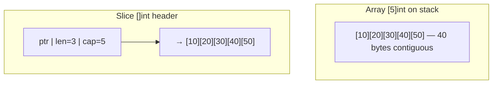
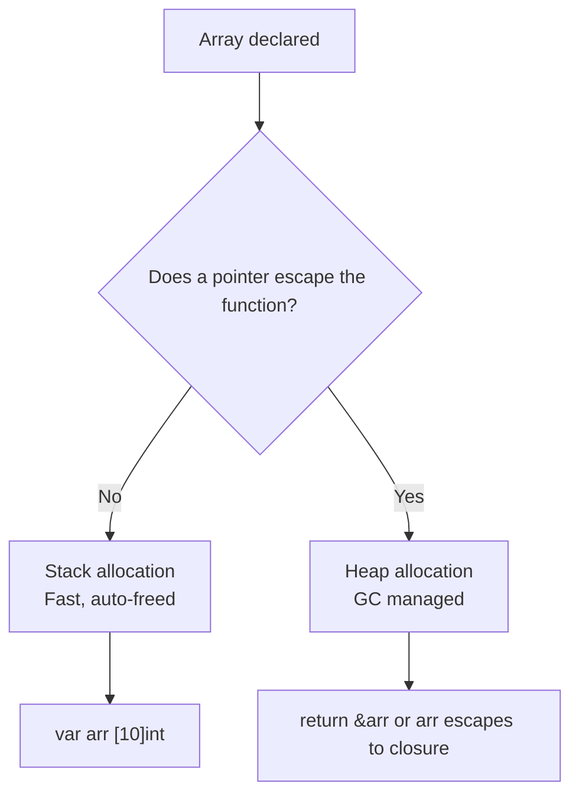
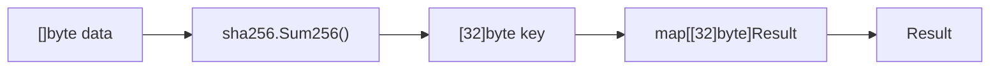

# Arrays — Middle Level

## Table of Contents
1. Introduction
2. Evolution & Historical Context
3. Why Arrays Exist in Go
4. When to Use Arrays
5. How Arrays Work Internally
6. Alternative Approaches
7. Anti-Patterns
8. Comparison with Other Languages
9. Advanced Code Examples
10. Debugging Guide
11. Performance Deep Dive
12. Concurrency Considerations
13. Testing Arrays
14. Common Patterns in Production Code
15. Edge Cases & Advanced Pitfalls
16. Test
17. Tricky Questions
18. Cheat Sheet
19. Summary
20. Further Reading
21. Diagrams & Visual Aids

---

## Introduction

At the junior level you learned *what* arrays are. Now the key questions are: **why does Go have arrays at all if slices exist?** And more practically: **when should you choose an array over a slice?**

The answer lies in Go's philosophy of making constraints explicit. When you write `[32]byte`, you are making a compile-time guarantee that this value is exactly 32 bytes — no more, no less. The compiler enforces this. Slices cannot provide that guarantee because their length is a runtime property. This distinction matters enormously for cryptography, fixed-protocol headers, and embedded systems work.

Another key insight: arrays are not just a "primitive" that slices replace. They are the *substrate* that slices live on. Every slice header contains a pointer to an underlying array. Understanding arrays deeply means understanding exactly what slices are doing in memory and why certain slice operations can cause surprising aliasing bugs.

---

## Evolution & Historical Context

Go's array design deliberately broke from Java's approach (where arrays are reference types and can be resized via new allocation) and C's approach (where arrays decay to pointers and have no built-in length). Go chose:

1. **Value semantics** — arrays behave like structs, not pointers
2. **Size as part of the type** — enabling compile-time size safety
3. **Runtime bounds checking** — eliminating a whole class of memory safety bugs

The Go team has stated that slices were designed specifically because raw arrays are too rigid for most use cases. Arrays are kept for when you *want* that rigidity. The `crypto/sha256` package returning `[32]byte` is the canonical example in Go's standard library.

---

## Why Arrays Exist in Go

### Compile-Time Size Guarantees

```go
package main

import "crypto/sha256"
import "fmt"

func verify(expected [32]byte, data []byte) bool {
    computed := sha256.Sum256(data)
    return computed == expected // array comparison: element by element
}

func main() {
    hash := sha256.Sum256([]byte("hello"))
    fmt.Println(verify(hash, []byte("hello"))) // true
    fmt.Println(verify(hash, []byte("world"))) // false
}
```

The function signature `verify(expected [32]byte, ...)` makes it *impossible* to pass a hash of the wrong size. With `[]byte`, a caller could pass 16 bytes and the bug would only surface at runtime.

### Struct-Like Embedding

Arrays can be embedded in structs and compared like structs:

```go
type UUID [16]byte

func (u UUID) String() string {
    return fmt.Sprintf("%x-%x-%x-%x-%x", u[0:4], u[4:6], u[6:8], u[8:10], u[10:])
}

u1 := UUID{1, 2, 3, 4, 5, 6, 7, 8, 9, 10, 11, 12, 13, 14, 15, 16}
u2 := u1
fmt.Println(u1 == u2) // true — arrays are comparable
```

This pattern is widely used in Go codebases for typed identifiers (UUIDs, hashes, addresses).

---

## When to Use Arrays

**Use arrays when:**
- The size is semantically meaningful and fixed by definition (SHA256 = always 32 bytes)
- You want compile-time size enforcement
- You need the type to be comparable with `==`
- You are implementing fixed-size data protocols (network packet headers)
- Performance matters and the size is small enough that copying is acceptable

**Use slices instead when:**
- The number of elements is determined at runtime
- You need to append/remove elements
- You are passing collections between functions frequently
- The size varies by use case

```go
// ARRAY: semantically fixed-size
type IPv4 [4]byte       // always 4 bytes
type MAC [6]byte        // always 6 bytes
type SHA256Hash [32]byte // always 32 bytes

// SLICE: variable-size
type Payload []byte      // can be any length
type UserList []User     // grows dynamically
```

---

## How Arrays Work Internally

### Memory Layout

An array `[5]int` on a 64-bit system occupies exactly `5 × 8 = 40 bytes` of contiguous memory. There is no header, no length field stored alongside — the size is baked into the type and known at compile time.

```
Memory address:  0x100  0x108  0x110  0x118  0x120
Value:          [  10 ][  20 ][  30 ][  40 ][  50 ]
```

The pointer to `arr[0]` gives you the start. Element `arr[i]` lives at `base + i * sizeof(element)`.

### Stack vs Heap Allocation

Small arrays typically live on the **stack** — extremely fast to allocate and deallocate. The Go compiler decides whether to escape an array to the heap based on escape analysis:

```go
func stackArray() {
    var arr [10]int // likely stays on stack
    _ = arr
}

func heapArray() *[10]int {
    arr := [10]int{} // escapes to heap because we return a pointer
    return &arr
}
```

---

## Alternative Approaches

### Array vs Slice for Fixed-Size Collections

```go
// Approach 1: Array (fixed-size, value semantics)
type RGB [3]uint8

// Approach 2: Slice (flexible but no compile-time guarantee)
type RGB []uint8

// Approach 3: Struct (named fields, most explicit)
type RGB struct {
    R, G, B uint8
}
```

For RGB colors, the struct approach is best for readability; the array approach for storage efficiency and easy comparison; the slice approach only if size varies (which it shouldn't for RGB).

### Using `unsafe.Slice` for Reinterpretation

```go
import "unsafe"

arr := [4]byte{0x01, 0x02, 0x03, 0x04}
// Reinterpret as uint32 (platform-dependent endianness)
val := *(*uint32)(unsafe.Pointer(&arr[0]))
fmt.Printf("%d\n", val)
```

This is an advanced pattern for performance-critical code or protocol parsing; use with caution.

---

## Anti-Patterns

### Anti-Pattern 1: Large Arrays Passed by Value

```go
// BAD: copies 8MB on every call
func processData(data [1000000]byte) {
    // ...
}

// GOOD: pass pointer or use slice
func processData(data *[1000000]byte) { /* ... */ }
func processData(data []byte)          { /* ... */ }
```

### Anti-Pattern 2: Using Arrays Where Slices Are Needed

```go
// BAD: array type in function signature limits callers
func sum(nums [5]int) int { /* ... */ } // only [5]int accepted

// GOOD: slice accepts any length
func sum(nums []int) int { /* ... */ } // call with arr[:] if needed
```

### Anti-Pattern 3: Ignoring Copy Semantics

```go
// BAD: developer expects this to modify original
func initArray(arr [5]int) {
    for i := range arr {
        arr[i] = i * 10
    }
    // arr is a copy! changes lost on return
}

// GOOD: use pointer
func initArray(arr *[5]int) {
    for i := range arr {
        arr[i] = i * 10
    }
}
```

---

## Comparison with Other Languages

| Feature | Go | C | Java | Python |
|---------|-----|---|------|--------|
| Fixed size | Yes (type) | Yes (stack) | Yes (object) | No (list) |
| Value semantics | Yes | No (decays to ptr) | No (reference) | No (reference) |
| Bounds checking | Runtime | None | Runtime | Runtime |
| Comparable with == | Yes | No | No (use Arrays.equals) | Yes (==) |
| Nil arrays | No | No | Yes (null) | N/A |
| Multi-dimensional | Nested arrays | Pointers | Array of arrays | List of lists |

Go's approach is unique: arrays are value types *and* have built-in bounds checking. C arrays have neither. Java arrays are references. Python lists are completely dynamic.

---

## Advanced Code Examples

### Example 1: Fixed-Size Ring Buffer

```go
package main

import "fmt"

type RingBuffer struct {
    data  [8]int
    head  int
    count int
}

func (r *RingBuffer) Push(v int) bool {
    if r.count == len(r.data) {
        return false // full
    }
    r.data[(r.head+r.count)%len(r.data)] = v
    r.count++
    return true
}

func (r *RingBuffer) Pop() (int, bool) {
    if r.count == 0 {
        return 0, false // empty
    }
    v := r.data[r.head]
    r.head = (r.head + 1) % len(r.data)
    r.count--
    return v, true
}

func main() {
    rb := RingBuffer{}
    for i := 0; i < 8; i++ {
        rb.Push(i * 10)
    }
    for i := 0; i < 4; i++ {
        v, _ := rb.Pop()
        fmt.Println(v) // 0, 10, 20, 30
    }
}
```

### Example 2: Protocol Header Parsing

```go
package main

import (
    "encoding/binary"
    "fmt"
)

// IPv4 header is exactly 20 bytes minimum
type IPv4Header [20]byte

func (h IPv4Header) Version() uint8     { return h[0] >> 4 }
func (h IPv4Header) IHL() uint8         { return h[0] & 0x0F }
func (h IPv4Header) TotalLength() uint16 { return binary.BigEndian.Uint16(h[2:4]) }
func (h IPv4Header) TTL() uint8         { return h[8] }
func (h IPv4Header) Protocol() uint8    { return h[9] }

func main() {
    // Simulate a raw packet header
    var header IPv4Header
    header[0] = 0x45 // version=4, IHL=5
    header[8] = 64   // TTL=64
    header[9] = 6    // TCP

    fmt.Printf("Version: %d\n", header.Version())   // 4
    fmt.Printf("TTL: %d\n", header.TTL())           // 64
    fmt.Printf("Protocol: %d\n", header.Protocol()) // 6 (TCP)
}
```

### Example 3: Matrix Operations

```go
package main

import "fmt"

type Matrix3x3 [3][3]float64

func (m Matrix3x3) Multiply(n Matrix3x3) Matrix3x3 {
    var result Matrix3x3
    for i := 0; i < 3; i++ {
        for j := 0; j < 3; j++ {
            for k := 0; k < 3; k++ {
                result[i][j] += m[i][k] * n[k][j]
            }
        }
    }
    return result
}

func main() {
    identity := Matrix3x3{
        {1, 0, 0},
        {0, 1, 0},
        {0, 0, 1},
    }
    m := Matrix3x3{
        {1, 2, 3},
        {4, 5, 6},
        {7, 8, 9},
    }
    result := m.Multiply(identity)
    fmt.Println(result) // [[1 2 3] [4 5 6] [7 8 9]]
}
```

---

## Debugging Guide

### Problem: Array not being modified in function

**Symptom:** You pass an array to a function, modify it inside, but the original is unchanged.

```go
// Bug
func init(arr [5]int) { arr[0] = 42 }  // copy modified
arr := [5]int{}
init(arr)
fmt.Println(arr[0]) // 0, not 42!

// Fix: use pointer
func init(arr *[5]int) { arr[0] = 42 }
init(&arr)
fmt.Println(arr[0]) // 42
```

### Problem: Runtime panic on array access

**Symptom:** Program crashes with `index out of range`

```go
// Debug: add bounds checking
index := getUserInput()
if index >= 0 && index < len(arr) {
    fmt.Println(arr[index])
} else {
    fmt.Println("invalid index:", index)
}
```

### Problem: Array comparison fails to compile

**Symptom:** `invalid operation: a == b (mismatched types [3]int and [4]int)`

**Fix:** You cannot compare arrays of different sizes. Ensure the sizes match, or compare as slices using `reflect.DeepEqual` or a manual loop.

---

## Performance Deep Dive

### Cache Locality

Arrays are contiguous in memory, making them ideal for sequential access patterns. The CPU prefetcher can predict the next access and load data into cache before you need it.

```go
// Fast: sequential access (cache-friendly)
for i := range arr {
    sum += arr[i]
}

// Slow: random access (cache-unfriendly, though still valid)
for _, idx := range randomIndices {
    sum += arr[idx]
}
```

### Escape Analysis

```go
// This array stays on the stack (no escape)
func noEscape() int {
    arr := [100]int{}
    for i := range arr { arr[i] = i }
    return arr[50]
}

// This array escapes to heap (pointer returned)
func escapes() *[100]int {
    arr := [100]int{}
    return &arr
}
```

Use `go build -gcflags="-m"` to see escape analysis output.

---

## Concurrency Considerations

Arrays are value types, so sharing them between goroutines requires care:

```go
package main

import (
    "fmt"
    "sync"
)

func main() {
    var arr [5]int
    var mu sync.Mutex
    var wg sync.WaitGroup

    for i := 0; i < 5; i++ {
        wg.Add(1)
        go func(idx int) {
            defer wg.Done()
            mu.Lock()
            arr[idx] = idx * 10
            mu.Unlock()
        }(i)
    }

    wg.Wait()
    fmt.Println(arr) // [0 10 20 30 40]
}
```

If goroutines access different indices (no overlap), no mutex is needed:

```go
// Safe: each goroutine writes to a different index
for i := 0; i < 5; i++ {
    wg.Add(1)
    go func(idx int) {
        defer wg.Done()
        arr[idx] = idx * 10 // no conflict with other goroutines
    }(i)
}
```

---

## Testing Arrays

```go
package main

import (
    "crypto/sha256"
    "testing"
)

func TestSHA256Fixed(t *testing.T) {
    // sha256.Sum256 returns [32]byte
    hash := sha256.Sum256([]byte("hello"))
    if len(hash) != 32 {
        t.Errorf("expected 32 bytes, got %d", len(hash))
    }
}

func TestArrayEquality(t *testing.T) {
    a := [3]int{1, 2, 3}
    b := [3]int{1, 2, 3}
    c := [3]int{1, 2, 4}

    if a != b {
        t.Error("equal arrays should be equal")
    }
    if a == c {
        t.Error("different arrays should not be equal")
    }
}

func BenchmarkSumByValue(b *testing.B) {
    arr := [1000]int{}
    for i := range arr { arr[i] = i }
    b.ResetTimer()
    for n := 0; n < b.N; n++ {
        sum := 0
        for _, v := range arr { sum += v }
        _ = sum
    }
}
```

---

## Common Patterns in Production Code

### Pattern: Typed Fixed-Size Buffer

```go
type SessionID [16]byte
type RequestID [8]byte

func generateSessionID() SessionID {
    var id SessionID
    // fill with random bytes (crypto/rand in production)
    for i := range id {
        id[i] = byte(i) // simplified
    }
    return id
}

// Map key works because [16]byte is comparable
sessions := map[SessionID]string{}
id := generateSessionID()
sessions[id] = "user:alice"
```

### Pattern: Constant-Time Comparison (Security)

```go
import "crypto/subtle"

func secureCompare(a, b [32]byte) bool {
    // constant-time to prevent timing attacks
    return subtle.ConstantTimeCompare(a[:], b[:]) == 1
}
```

---

## Edge Cases & Advanced Pitfalls

1. **Slice of array shares memory:** `s := arr[:]` — modifying `s` modifies `arr`.
2. **Array in map key:** Arrays are valid map keys (they are comparable). `map[[32]byte]string` is a valid hash-indexed lookup table.
3. **Zero-size array `[0]T`:** Valid in Go. Often used as a struct field for zero-cost signaling or sync.Mutex-like patterns.
4. **Blank identifier in array:** `[5]int{0: 1, 4: 5}` sets index 0 to 1 and index 4 to 5, leaving others as zero.
5. **Stack overflow with large arrays:** `var arr [10000000]int` on the stack will crash. Use `new([10000000]int)` to allocate on the heap.

---

## Test

**1. Why does Go's `sha256.Sum256` return `[32]byte` instead of `[]byte`?**
- A) Performance — arrays are faster
- B) Compile-time size guarantee — callers know the size without checking
- C) Because byte slices don't support comparison
- D) Historical accident

**Answer: B** — The fixed-size array enforces the invariant at the type level.

---

**2. What does escape analysis determine for arrays?**
- A) Whether the array can be compared
- B) Whether the array is allocated on the stack or heap
- C) Whether the array is thread-safe
- D) Whether the array's elements are zero-initialized

**Answer: B** — Escape analysis determines whether a variable needs to live on the heap.

---

**3. Can `[16]byte` be used as a map key?**
- A) No, arrays cannot be map keys
- B) Yes, because arrays are comparable
- C) Only if the values are ASCII
- D) Only with a custom hash function

**Answer: B** — Arrays are comparable, so they can be used as map keys.

---

**4. What is the output?**
```go
arr := [3]int{0: 10, 2: 30}
fmt.Println(arr)
```
- A) `[10 0 30]`
- B) `[10 30 0]`
- C) Compilation error
- D) `[0 10 30]`

**Answer: A** — Index-keyed initialization. Index 0 = 10, index 1 = 0 (zero value), index 2 = 30.

---

**5. Which command shows whether a variable escapes to the heap?**
- A) `go run -trace`
- B) `go vet`
- C) `go build -gcflags="-m"`
- D) `go test -race`

**Answer: C** — The `-m` flag prints escape analysis decisions.

---

## Tricky Questions

**Q: If you have `arr := [5]int{1,2,3,4,5}` and `s := arr[1:3]`, then modify `s[0] = 99`, what is `arr[1]`?**
A: `99`. The slice `s` shares the underlying array with `arr`. Modifying through the slice modifies the original array.

**Q: What happens if you define `type A [3]int` and `type B [3]int` — can you compare `A{} == B{}`?**
A: No. Even though the underlying type is the same (`[3]int`), `A` and `B` are distinct named types. You would need to convert: `A{} == A(B{})`.

**Q: What is a zero-size array `[0]T` useful for?**
A: As a struct field for signaling or padding, e.g., `struct { _ [0]sync.Mutex }` makes the struct non-comparable (since `sync.Mutex` is not comparable). Also used as channel signal types.

---

## Cheat Sheet

```go
// Fixed-size type pattern
type SHA256 [32]byte
type UUID   [16]byte
type IPv4   [4]byte

// Array as map key (comparable)
cache := map[[32]byte]Result{}
hash := sha256.Sum256(input)
if result, ok := cache[hash]; ok { return result }

// Index-keyed initialization
arr := [5]int{0: 100, 4: 400} // [100 0 0 0 400]

// Pointer to avoid copy
func process(arr *[1000]int) { arr[0]++ }

// Escape analysis
go build -gcflags="-m" ./...

// Slice from array (shares memory)
s := arr[:]
s[0] = 99 // modifies arr[0]!

// Constant-time comparison
subtle.ConstantTimeCompare(a[:], b[:])
```

---

## Summary

Arrays in Go are value types with compile-time-known sizes. The size being part of the type is a feature, not a limitation — it lets you encode invariants like "this is always a 32-byte SHA256 hash" in the type system. Arrays are allocated contiguously in memory (often on the stack), are cache-friendly, and can be compared with `==`. They form the substrate that slices are built on. Use arrays when the fixed size is semantically meaningful; use slices for everything else.

---

## Further Reading

- [Go Specification: Array types](https://go.dev/ref/spec#Array_types)
- [Go Blog: Arrays, slices (and strings): The mechanics of append](https://go.dev/blog/slices)
- [Go Escape Analysis](https://go.dev/doc/faq#stack_or_heap)
- [crypto/sha256 source](https://cs.opensource.google/go/go/+/main:src/crypto/sha256/)

---

## Diagrams & Visual Aids

### Array Memory Layout vs Slice Header



### Stack vs Heap Decision



### Array as Map Key Pattern


