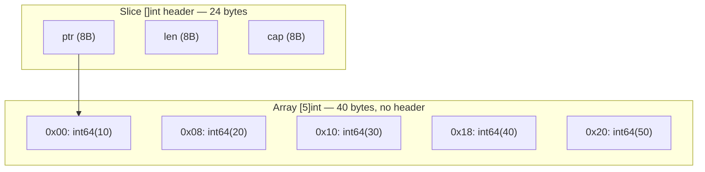
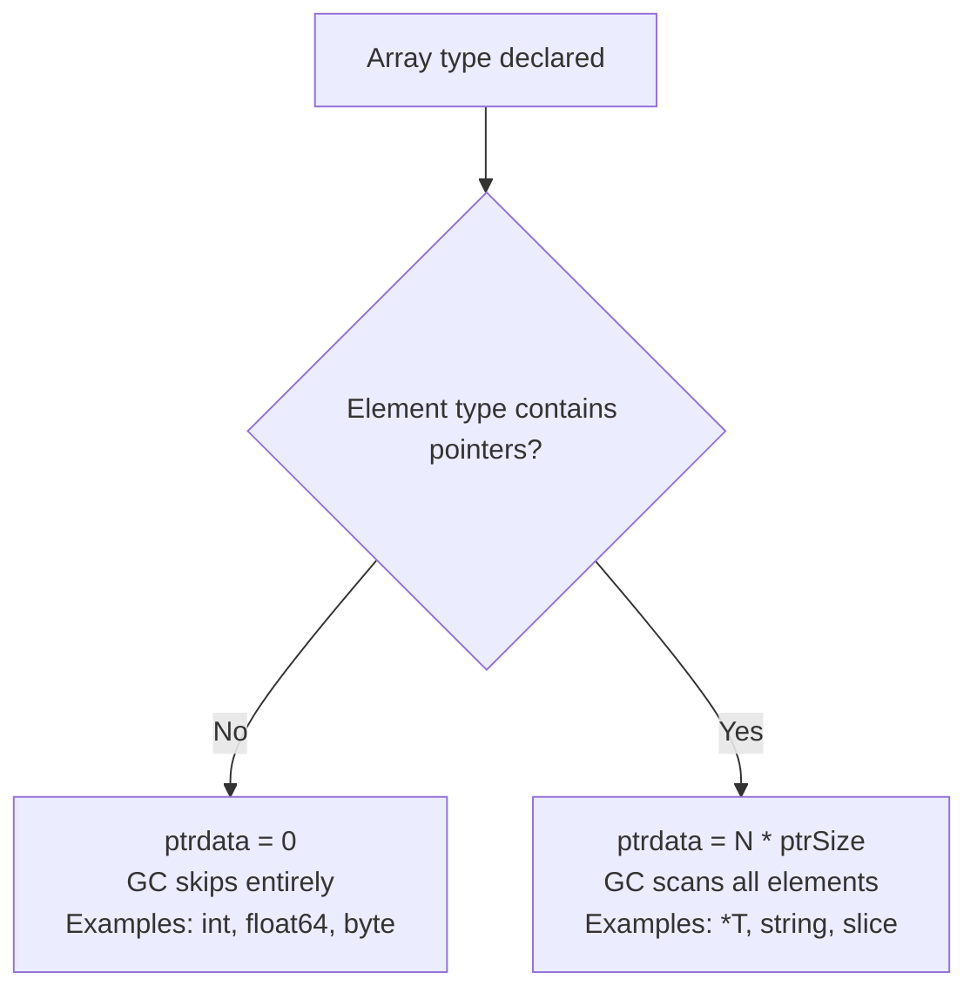
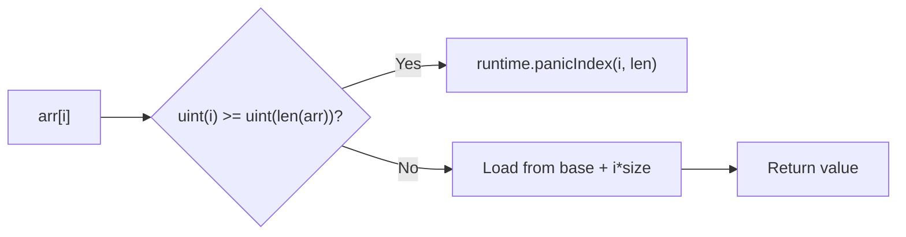

# Arrays — Professional Level (Internals)

## Table of Contents
1. Introduction — Under the Hood
2. How Arrays Work Internally
3. Runtime Deep Dive
4. Compiler Perspective
5. Memory Layout
6. OS/Syscall Level
7. Source Code Walkthrough
8. Assembly Output Analysis
9. Performance Internals
10. Metrics & Analytics (Runtime)
11. Edge Cases at the Lowest Level
12. Test
13. Tricky Questions
14. Summary
15. Further Reading
16. Diagrams & Visual Aids

---

## Introduction — Under the Hood

Go arrays have no runtime representation beyond their raw bytes in memory. Unlike slices (which have a 3-word header), maps (which are pointers to runtime hash tables), or channels (runtime data structures), an array `[N]T` is simply `N * sizeof(T)` bytes laid out contiguously. There is no object header, no reference count, no type tag — just the raw data.

This simplicity has profound implications: arrays are the most primitive aggregate type in Go, and understanding them at the bit level gives you insight into how all other Go types are built on top of them.

---

## How Arrays Work Internally

### Array Type Representation in the Compiler

The Go compiler represents array types as:

```go
// src/cmd/compile/internal/types/type.go (simplified)
type Array struct {
    Elem  *Type // element type
    Bound int64 // number of elements (-1 means slice)
}
```

The `Bound` field is what makes arrays a **compile-time** concept — it is known before any code runs. When the compiler sees `[5]int`, it creates an `Array{Elem: intType, Bound: 5}` node.

### Size Computation

Array size is computed as:
```
sizeof([N]T) = N * sizeof(T)
```

With alignment padding per element:
```
sizeof([N]T) = N * alignedSizeOf(T)
```

For `[5]int` on a 64-bit system: `5 * 8 = 40 bytes`
For `[3]bool`: `3 * 1 = 3 bytes` (bool is 1 byte in Go)
For `[2]complex128`: `2 * 16 = 32 bytes`

---

## Runtime Deep Dive

### No Array Runtime Type Header

Unlike slices, arrays have zero runtime overhead per instance. Compare:

```
Slice header (3 words = 24 bytes on 64-bit):
┌─────────┬─────────┬─────────┐
│  ptr    │   len   │   cap   │
│ 8 bytes │ 8 bytes │ 8 bytes │
└─────────┴─────────┴─────────┘

Array [5]int (exactly 40 bytes, no header):
┌──────┬──────┬──────┬──────┬──────┐
│ e[0] │ e[1] │ e[2] │ e[3] │ e[4] │
│ 8B   │ 8B   │ 8B   │ 8B   │ 8B   │
└──────┴──────┴──────┴──────┴──────┘
```

### Garbage Collector and Arrays

The GC only needs to scan an array if its element type contains pointers. For `[N]int`, `[N]float64`, `[N]byte`: **GC does not scan** — these are treated as inert memory. For `[N]*T`, `[N]string`, `[N]slice`: **GC scans each element** looking for pointers.

The GC uses a bitmap (stored in the type's `ptrdata` field) to know which words within the array contain pointers:

```go
// src/runtime/mbitmap.go
// For [5]int: ptrdata = 0 (no pointers, GC skips entirely)
// For [5]*int: ptrdata = 40 (all 5 words are pointers, GC scans all)
// For [5]struct{v int; p *int}: ptrdata covers pointer positions
```

### bounds checking at runtime

Every array (and slice) access goes through a bounds check:

```go
arr[i] // compiles to roughly:
// if uint(i) >= uint(len(arr)) { runtime.panicIndex(i, len(arr)) }
// load arr[i]
```

The comparison uses `uint` (unsigned) so negative indices also fail (they wrap to a huge positive number, which is >= len).

The `runtime.panicIndex` function:
```
src/runtime/panic.go:
func panicIndex(x int, y int) {
    panicCheck1(getcallerpc(), "index out of range")
    panic(boundsError{x: int64(x), signed: true, y: y, code: boundsIndex})
}
```

---

## Compiler Perspective

### How Array Indexing Compiles

Given:
```go
arr := [3]int{10, 20, 30}
x := arr[1]
```

The compiler generates (pseudo-IR):
```
// Bounds check (may be eliminated if compiler can prove in-bounds)
if 1 >= 3 { panic }        // compile-time constant — eliminated!
// Direct memory access: base + index * elementSize
x = *(base_of_arr + 1 * 8) // load from addr base+8
```

For compile-time constant indices like `arr[1]`, bounds checks are eliminated at compile time. For runtime indices, the compiler generates the check unless it can prove safety through value range analysis.

### SSA Representation

The Go compiler converts code to **Static Single Assignment (SSA)** form before optimization:

```
// arr := [3]int{10, 20, 30}  →  SSA:
v1 = LocalAddr <*[3]int> arr
Store <int> (Const64 <int> [10]) v1
Store <int> (Const64 <int> [20]) (OffPtr <*int> [8] v1)
Store <int> (Const64 <int> [30]) (OffPtr <*int> [16] v1)

// x := arr[1]  →  SSA (with BCE applied):
v2 = OffPtr <*int> [8] v1    // pointer to arr[1]
v3 = Load <int> v2           // load the value
```

View SSA: `GOSSAFUNC=main go build main.go`

---

## Memory Layout

### Stack Layout for Local Arrays

```
Stack frame layout for:
func main() {
    arr := [5]int{1, 2, 3, 4, 5}
    // ...
}

High address ↑
┌────────────────────┐
│ return address     │ (8 bytes)
├────────────────────┤
│ saved BP           │ (8 bytes, frame pointer)
├────────────────────┤
│ arr[4] = 5         │ offset -8
│ arr[3] = 4         │ offset -16
│ arr[2] = 3         │ offset -24
│ arr[1] = 2         │ offset -32
│ arr[0] = 1         │ offset -40
└────────────────────┘ ← SP (stack pointer)
Low address ↓
```

Arrays on the stack are adjacent to other local variables. The compiler assigns offsets from SP (stack pointer) at compile time.

### Heap Layout for Escaped Arrays

When an array escapes to the heap, Go's allocator places it in a **size class** based on its size:

```
[5]int = 40 bytes → size class 48 (next power-of-2 or size class boundary)
[8]int = 64 bytes → size class 64
[9]int = 72 bytes → size class 80
```

The heap object has a standard Go allocation header (for GC bookkeeping) but this is separate from the array data itself.

---

## OS/Syscall Level

### Arrays and System Calls

Arrays are often used at the syscall boundary because system calls work with raw byte buffers:

```go
package main

import (
    "syscall"
    "unsafe"
)

func readFileRaw(fd int) ([4096]byte, int, error) {
    var buf [4096]byte
    // syscall.Read takes a slice (pointer + length)
    // We convert our array to a slice for the syscall
    n, err := syscall.Read(fd, buf[:])
    return buf, n, err
}

// At the OS level, this becomes:
// read(fd, &buf[0], 4096)  — direct pointer to array memory
// The OS writes directly into our array's memory
```

The key insight: the array lives on the stack (if small enough), and we pass its address directly to the OS. The OS writes into the stack frame — zero copying, zero allocation.

### mmap and Arrays

```go
import "syscall"

// Memory-map a fixed-size structure (e.g., a header)
func mmapHeader(file *os.File) (*[64]byte, error) {
    data, err := syscall.Mmap(
        int(file.Fd()), 0, 64,
        syscall.PROT_READ, syscall.MAP_SHARED,
    )
    if err != nil {
        return nil, err
    }
    // Reinterpret the mmap'd byte slice as a fixed-size array pointer
    return (*[64]byte)(data), nil
}
```

---

## Source Code Walkthrough

### Array Assignment (Copy) in the Runtime

When you write `b := a` for an array, the compiler generates a `memmove` or `memcopy` call for larger arrays:

```go
// src/runtime/memmove_amd64.s
// For small arrays (<=32 bytes): unrolled copy with MOVQ instructions
// For medium arrays (32-256 bytes): REP MOVSQ (string move instruction)
// For large arrays (>256 bytes): optimized multi-register copy with prefetching
```

For `[3]int` (24 bytes), the compiler typically generates:
```asm
MOVQ (AX), CX      // copy 8 bytes
MOVQ 8(AX), DX
MOVQ 16(AX), SI
MOVQ CX, (BX)
MOVQ DX, 8(BX)
MOVQ SI, 16(BX)
```

No function call overhead — it unrolls to direct memory moves.

### Zeroing Arrays

`var arr [5]int` (zero initialization) compiles to:
```
// Small arrays: compiler emits explicit MOVQ 0, ... instructions
// Large arrays: calls runtime.memclrNoHeapPointers
```

From `src/runtime/memclr_amd64.s`:
```asm
// For arrays with no pointers, zero memory efficiently
// Uses XORPS/VMOVDQU for SIMD zeroing when available
```

---

## Assembly Output Analysis

### Viewing Generated Assembly

```bash
go tool compile -S main.go > main.s
# OR
go build -gcflags="-S" main.go 2>&1 | head -100
```

### Example: `[5]int` Sum

```go
func sumArr(arr [5]int) int {
    sum := 0
    for _, v := range arr { sum += v }
    return sum
}
```

Generated amd64 assembly (simplified):
```asm
TEXT "".sumArr(SB), NOSPLIT|ABIInternal, $0-48
    // arr is passed by value on stack (40 bytes = 5*8)
    // registers: AX, BX, CX, DI, SI, R8
    XORL  AX, AX          // sum = 0
    MOVQ  "".arr+0(SP), BX  // load arr[0]
    ADDQ  BX, AX
    MOVQ  "".arr+8(SP), BX  // load arr[1]
    ADDQ  BX, AX
    // ... (loop may be unrolled for small fixed-size arrays)
    MOVQ  "".arr+32(SP), BX // load arr[4]
    ADDQ  BX, AX
    RET
```

Note: the loop is unrolled because the array size is a compile-time constant (5).

---

## Performance Internals

### Copy Cost Model

Copying `[N]T` costs approximately:
- `N * sizeof(T)` bytes moved through memory bandwidth
- For cached data (L1/L2): ~0.3-1 cycle per 8 bytes
- For cold data (RAM): ~100+ cycles per 8 bytes

**Rule of thumb:** Arrays larger than 128 bytes should be passed by pointer if copied frequently.

### Cache Miss Analysis

```
L1 cache: 32KB, ~4 cycles latency
L2 cache: 256KB, ~12 cycles
L3 cache: 8MB, ~40 cycles
RAM: ~100ns = ~300 cycles

[8]int64 = 64 bytes = 1 cache line → always fits in cache
[1024]int = 8KB → fits in L1, often hot
[131072]int = 1MB → often cold, causes L3 misses
```

### GOGC and Arrays

Large heap-allocated arrays contribute to GC pause times proportionally to their size (for pointer-containing elements) or to the total heap size (for all elements):

```go
// [1000000]int: 8MB on heap
// GC overhead: negligible (no pointers to scan)

// [1000000]*MyStruct: 8MB of pointers on heap
// GC overhead: must scan all 1M pointers every GC cycle
// → prefer [1000000]MyStruct (embed, not pointer) when possible
```

---

## Metrics & Analytics (Runtime)

### Using runtime/metrics to Track Allocations

```go
package main

import (
    "fmt"
    "runtime"
    "runtime/metrics"
)

func trackArrayAllocations() {
    // Get heap allocation metrics
    sample := []metrics.Sample{
        {Name: "/memory/classes/heap/objects:bytes"},
        {Name: "/gc/heap/allocs:bytes"},
    }
    metrics.Read(sample)

    var before runtime.MemStats
    runtime.ReadMemStats(&before)

    // Allocate an array on the heap
    arr := new([10000]int)
    _ = arr

    var after runtime.MemStats
    runtime.ReadMemStats(&after)

    fmt.Printf("Heap allocated: %d bytes\n", after.HeapAlloc-before.HeapAlloc)
    fmt.Printf("Total alloc delta: %d bytes\n", after.TotalAlloc-before.TotalAlloc)
}

func main() {
    trackArrayAllocations()
}
```

### pprof Integration

```go
import _ "net/http/pprof"
import "net/http"

func main() {
    go http.ListenAndServe(":6060", nil)
    // Then: go tool pprof http://localhost:6060/debug/pprof/heap
    // Look for large array allocations in the heap profile
}
```

---

## Edge Cases at the Lowest Level

### 1. Zero-Size Arrays and Pointer Equality

```go
var a [0]int
var b [0]int
// &a and &b may or may not be equal — Go spec allows this
// In practice, &a == &b when both are zero-size (they share address)
fmt.Println(&a == &b) // implementation-defined
```

### 2. Array Alignment Guarantees

Go guarantees that an array's first element is aligned to the element type's alignment requirement. For `[5]int64`, the array starts at an 8-byte-aligned address.

### 3. Comparing Arrays with NaN

```go
a := [3]float64{1.0, math.NaN(), 3.0}
b := [3]float64{1.0, math.NaN(), 3.0}
fmt.Println(a == b) // FALSE — NaN != NaN even in arrays
```

IEEE 754 specifies that `NaN != NaN`, and Go's `==` on float64 respects this.

### 4. Array in Struct Padding

```go
type S struct {
    a int8    // 1 byte at offset 0
    b [2]int8 // 2 bytes at offset 1
    c int32   // 4 bytes at offset 4
}
// Total: 8 bytes (1 + 2 + 1 padding + 4)
fmt.Println(unsafe.Sizeof(S{})) // 8
```

### 5. Compiler-Constant Array Length

The length of an array is always a compile-time constant. This enables:
- Loop unrolling
- Bounds check elimination for constant indices
- Compile-time size calculations for stack frame layout

---

## Test

**1. What is the size of `[3]bool` in bytes?**
- A) 3
- B) 8
- C) 24
- D) 4

**Answer: A** — `bool` is 1 byte in Go. `[3]bool` = 3 * 1 = 3 bytes.

---

**2. When does Go's GC skip scanning an array?**
- A) When the array is on the stack
- B) When the array has no pointer-containing elements
- C) When the array size is less than 128 bytes
- D) When the array is declared with `var`

**Answer: B** — Arrays with non-pointer element types (int, float64, byte, etc.) have `ptrdata = 0` and are never scanned by the GC.

---

**3. What runtime function handles array bounds check failures?**
- A) `runtime.panic`
- B) `runtime.panicIndex`
- C) `runtime.throw`
- D) `runtime.goexit`

**Answer: B** — `runtime.panicIndex(x int, y int)` is called when an index `x` is out of bounds for a collection of size `y`.

---

**4. Which SSA optimization removes compile-time constant bounds checks?**
- A) Dead code elimination
- B) Bounds check elimination (BCE)
- C) Inlining
- D) Escape analysis

**Answer: B** — BCE removes bounds checks when the compiler can prove at compile time that the index is always valid.

---

## Tricky Questions

**Q: Why does `[0]int` have a valid address in Go?**
A: Go allocates a unique address to every variable, including zero-size ones. The spec allows (but does not require) two zero-size variables to share the same address. In practice, `zerobase` — a special runtime symbol at a fixed address — is used for many zero-size allocations.

**Q: What is `ptrdata` in an array type, and why does it matter?**
A: `ptrdata` is the number of bytes from the start of the object that may contain pointers. For `[N]int`, `ptrdata = 0`. For `[N]*T`, `ptrdata = N * 8`. The GC uses this to decide how many words to scan. Arrays of non-pointer types are completely ignored by the GC's scan phase.

**Q: How does the runtime handle bounds checks on ARM vs AMD64?**
A: On AMD64, bounds checks typically generate a `CMP` and `JAE` (jump if above or equal). On ARM, it generates a `CMP` and conditional branch. The compiler may also use `unsigned` comparison tricks: since `uint(-1) > uint(len)`, negative indices also fail the unsigned bounds check, eliminating a separate negativity check.

---

## Summary

Arrays in Go are the simplest possible aggregate type: contiguous bytes in memory, no runtime header, no GC overhead for non-pointer elements. The compiler knows the size at compile time, enabling loop unrolling, bounds check elimination, and optimal stack frame layout. The GC skips arrays with non-pointer elements entirely. Arrays are copied via unrolled `MOVQ` sequences for small sizes and `memmove` for larger ones. The runtime bounds check uses unsigned comparison to handle negative indices in a single branch. Understanding these internals explains why arrays are both the foundation of Go's type system and a high-performance primitive used throughout the standard library.

---

## Further Reading

- [Go compiler source: cmd/compile/internal/types/type.go](https://cs.opensource.google/go/go/+/main:src/cmd/compile/internal/types/type.go)
- [Go runtime source: memmove_amd64.s](https://cs.opensource.google/go/go/+/main:src/runtime/memmove_amd64.s)
- [Go runtime: bounds check](https://cs.opensource.google/go/go/+/main:src/runtime/panic.go)
- [SSA in Go compiler](https://go.dev/src/cmd/compile/internal/ssa/README)
- [Go memory model](https://go.dev/ref/mem)
- [Bounds check elimination](https://go101.org/article/bounds-check-elimination.html)

---

## Diagrams & Visual Aids

### Array vs Slice Memory Structure



### GC Scan Decision



### Bounds Check Flow


