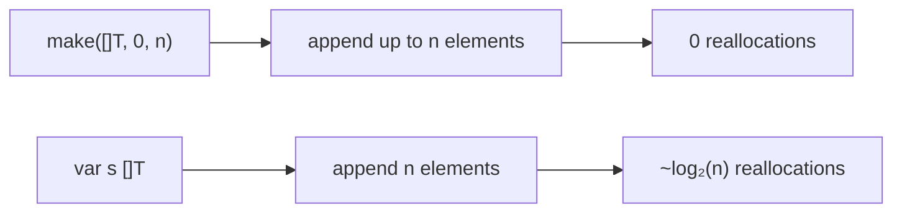
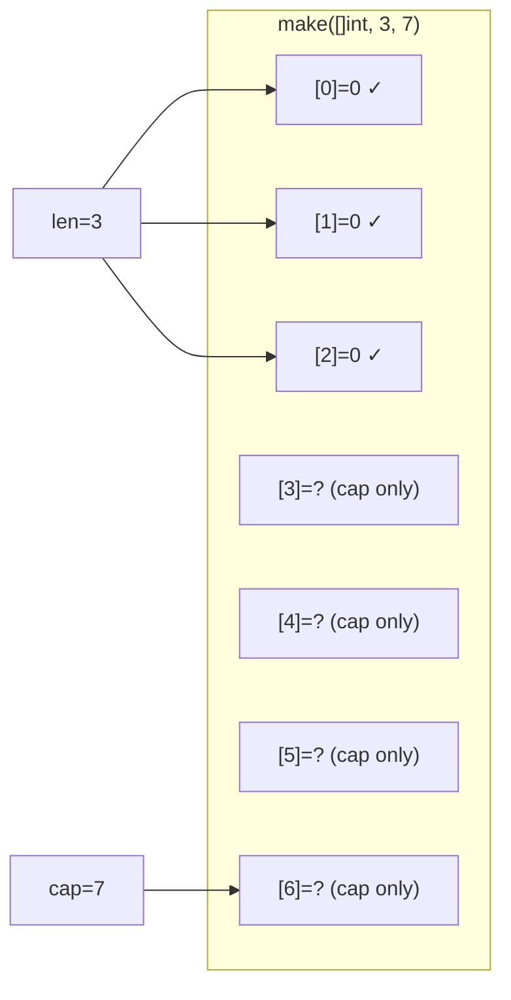
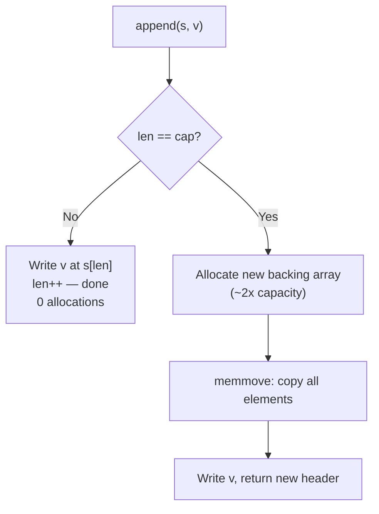
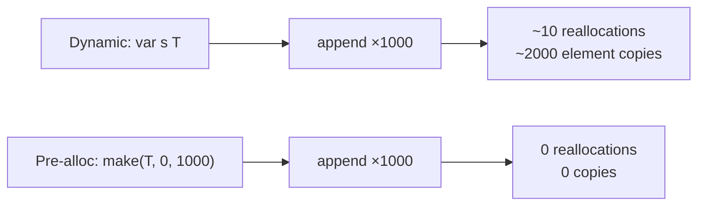

# Slice Capacity and Growth — Junior Level

## Table of Contents
1. Introduction
2. Prerequisites
3. Glossary
4. Core Concepts
5. Real-World Analogies
6. Mental Models
7. Pros & Cons
8. Use Cases
9. Code Examples
10. Coding Patterns
11. Clean Code
12. Product Use / Feature
13. Error Handling
14. Security Considerations
15. Performance Tips
16. Metrics & Analytics
17. Best Practices
18. Edge Cases & Pitfalls
19. Common Mistakes
20. Common Misconceptions
21. Tricky Points
22. Test
23. Tricky Questions
24. Cheat Sheet
25. Self-Assessment Checklist
26. Summary
27. What You Can Build
28. Further Reading
29. Related Topics
30. Diagrams & Visual Aids

---

## Introduction

Every Go slice has two size-related properties: **length** (`len`) — how many elements you can currently access — and **capacity** (`cap`) — how many elements the backing array can hold before Go needs to allocate a new one. When you `append` elements and the length reaches the capacity, Go automatically creates a larger backing array, copies all elements into it, and continues. This is called **growth**.

Understanding capacity and growth helps you write faster programs. Without capacity hints, Go performs multiple reallocations as your slice grows. With a capacity hint (`make([]T, 0, n)`), you get a single allocation and much better performance. This is one of the simplest and most impactful Go performance optimizations.

The growth factor is approximately 2x for small slices but decreases for larger ones. Go 1.18 changed the formula to provide smoother growth across all sizes, but the core idea remains: when you need more room, Go finds a bigger container.

---

## Prerequisites

- **Required:** Go slice basics — what slices are, `len()`, `cap()`, `append()`
- **Required:** `make()` built-in
- **Helpful:** Basic understanding of memory allocation

---

## Glossary

| Term | Definition |
|------|-----------|
| Capacity (`cap`) | Total elements the backing array holds from the slice's pointer onward |
| Length (`len`) | Number of elements currently accessible in the slice |
| Growth | Allocating a new, larger backing array when `append` exceeds `cap` |
| Reallocation | Creating a new backing array + copying all elements |
| Pre-allocation | Creating a slice with sufficient capacity via `make([]T, 0, n)` |
| Growth factor | The ratio of new capacity to old capacity during reallocation |

---

## Core Concepts

### Concept 1: len vs cap

```go
package main

import "fmt"

func main() {
    // make([]T, length, capacity)
    s := make([]int, 3, 10)

    fmt.Println("len:", len(s))   // 3 — accessible elements
    fmt.Println("cap:", cap(s))   // 10 — total capacity

    s[0], s[1], s[2] = 10, 20, 30

    // Append within capacity — no reallocation
    s = append(s, 40)
    fmt.Println("after append:", len(s), cap(s)) // 4 10
}
```

### Concept 2: Observing Reallocation

```go
package main

import "fmt"

func main() {
    s := make([]int, 0, 3) // len=0, cap=3

    for i := 1; i <= 6; i++ {
        oldCap := cap(s)
        s = append(s, i)
        newCap := cap(s)

        if newCap != oldCap {
            fmt.Printf("REALLOC: len=%d, cap: %d → %d\n", len(s), oldCap, newCap)
        } else {
            fmt.Printf("OK:      len=%d, cap=%d\n", len(s), newCap)
        }
    }
}
// OK:      len=1, cap=3
// OK:      len=2, cap=3
// OK:      len=3, cap=3
// REALLOC: len=4, cap: 3 → 6
// OK:      len=5, cap=6
// OK:      len=6, cap=6
```

### Concept 3: Growth is Approximately 2x

```go
package main

import "fmt"

func main() {
    s := make([]int, 0)
    prev := 0

    for i := 0; i < 20; i++ {
        s = append(s, i)
        if cap(s) != prev {
            fmt.Printf("len=%2d: cap=%2d\n", len(s), cap(s))
            prev = cap(s)
        }
    }
}
// len= 1: cap= 1
// len= 2: cap= 2
// len= 3: cap= 4
// len= 5: cap= 8
// len= 9: cap=16
// len=17: cap=32
```

### Concept 4: Pre-allocating with make

```go
package main

import "fmt"

func main() {
    n := 10

    // Without pre-allocation: multiple reallocations
    var slow []int
    reallocCount := 0
    prevCap := 0
    for i := 0; i < n; i++ {
        slow = append(slow, i)
        if cap(slow) != prevCap { reallocCount++; prevCap = cap(slow) }
    }
    fmt.Println("Reallocations (no pre-alloc):", reallocCount) // ~4

    // With pre-allocation: zero reallocations
    fast := make([]int, 0, n)
    reallocCount2 := 0
    prevCap2 := cap(fast)
    for i := 0; i < n; i++ {
        fast = append(fast, i)
        if cap(fast) != prevCap2 { reallocCount2++; prevCap2 = cap(fast) }
    }
    fmt.Println("Reallocations (pre-alloc):", reallocCount2) // 0
}
```

### Concept 5: make([]T, n) vs make([]T, 0, n)

```go
package main

import "fmt"

func main() {
    // make([]T, n) — creates n zero elements
    a := make([]int, 5)  // [0 0 0 0 0], len=5, cap=5
    a[0] = 100           // assign by index
    fmt.Println(a)       // [100 0 0 0 0]

    // make([]T, 0, n) — empty with reserved capacity
    b := make([]int, 0, 5)  // [], len=0, cap=5
    b = append(b, 100)       // add via append
    fmt.Println(b)           // [100]

    // Common mistake: using n when you should use 0,n
    wrong := make([]int, 5)
    wrong = append(wrong, 100)
    fmt.Println(wrong) // [0 0 0 0 0 100] — 100 appended AFTER the zeros!
}
```

---

## Real-World Analogies

| Concept | Analogy |
|---------|---------|
| Capacity | A water bottle's total volume |
| Length | How much water is currently in it |
| Pre-allocation | Buying the right-sized bottle before filling it |
| Reallocation | Pouring water into a bigger bottle when first fills up |
| Growth factor | Each new bottle is roughly twice as large |
| `make([]T, 0, n)` | Reserving 10 conference seats before knowing exactly how many will come |

---

## Mental Models

Think of capacity as **reserved seats** and length as **occupied seats**. When all reserved seats are taken (len == cap) and one more person arrives (append), you must move everyone to a new, bigger venue (reallocation). Go automatically finds a venue about twice as big, moves everyone, and adds the new person.

Pre-allocation means **reserving enough seats for everyone before the event starts** — no mid-event venue changes needed.

---

## Pros & Cons

| Pros of Pre-allocation | Cons of No Pre-allocation |
|----------------------|--------------------------|
| Single allocation | O(log n) reallocations |
| 5-10x faster in benchmarks | Each realloc copies all elements |
| Predictable memory | Memory usage grows unpredictably |
| Fewer GC cycles | More garbage collected |

**When to pre-allocate:** Known size, hot loops, performance-sensitive code.

**When NOT to pre-allocate:** Truly unknown size, rarely-called code, when memory is more constrained than time.

---

## Use Cases

- **Use Case 1:** Filter function — pre-allocate to `len(input)` (worst case, all pass).
- **Use Case 2:** Database query results — pre-allocate to `limit` or expected row count.
- **Use Case 3:** Building HTTP response body bytes — pre-allocate to estimated size.
- **Use Case 4:** Collecting matched file paths — dynamic growth when count unknown.

---

## Code Examples

### Example 1: Counting Reallocations

```go
package main

import "fmt"

func countReallocations(n int) int {
    s := make([]int, 0)
    count := 0
    prev := 0
    for i := 0; i < n; i++ {
        s = append(s, i)
        if cap(s) != prev {
            count++
            prev = cap(s)
        }
    }
    return count
}

func main() {
    for _, n := range []int{10, 100, 1000, 10000} {
        fmt.Printf("n=%5d: %2d reallocations\n", n, countReallocations(n))
    }
}
// n=   10:  4 reallocations
// n=  100:  7 reallocations
// n= 1000: 10 reallocations
// n=10000: 14 reallocations
// Growth: O(log n) reallocations
```

### Example 2: Filter with Pre-allocation

```go
package main

import "fmt"

func filterPositive(nums []int) []int {
    result := make([]int, 0, len(nums)) // worst case: all positive
    for _, n := range nums {
        if n > 0 {
            result = append(result, n)
        }
    }
    return result
}

func main() {
    nums := []int{-1, 2, -3, 4, -5, 6}
    pos := filterPositive(nums)
    fmt.Println(pos)       // [2 4 6]
    fmt.Println(cap(pos))  // 6 (pre-allocated to len(nums))
}
```

### Example 3: Trim Excess Capacity

```go
package main

import "fmt"

func main() {
    // After filtering, excess capacity may waste memory
    result := make([]int, 0, 100)
    for i := 0; i < 10; i++ { // only use 10 of 100
        result = append(result, i)
    }
    fmt.Printf("Before trim: len=%d, cap=%d\n", len(result), cap(result)) // 10, 100

    // Trim to exact size
    trimmed := append([]int(nil), result...)
    fmt.Printf("After trim:  len=%d, cap=%d\n", len(trimmed), cap(trimmed)) // 10, 10
}
```

---

## Coding Patterns

### Pattern 1: Pre-allocate for Transform

```go
// Transform: exact output size known — use make([]T, n)
func double(nums []int) []int {
    result := make([]int, len(nums)) // exact size
    for i, n := range nums {
        result[i] = n * 2
    }
    return result
}

// Filter: max output size = input size — use make([]T, 0, n)
func filterEvens(nums []int) []int {
    result := make([]int, 0, len(nums)) // max capacity
    for _, n := range nums {
        if n%2 == 0 { result = append(result, n) }
    }
    return result
}
```



### Pattern 2: Check Remaining Capacity

```go
// Check before append if reallocation matters
remaining := cap(s) - len(s)
if remaining == 0 {
    fmt.Println("Next append will reallocate!")
}
if remaining >= batchSize {
    // Safe to append the entire batch without reallocation
    s = append(s, batch...)
}
```

---

## Clean Code

**Before:**
```go
result := make([]User, 0, 1000)
```

**After (explain the intent):**
```go
// Pre-allocate to maximum page size — eliminates reallocations for typical queries
const maxPageSize = 1000
result := make([]User, 0, maxPageSize)
```

---

## Product Use / Feature

**Scenario:** A search API returns up to 100 results. Pre-allocating to 100 avoids all reallocations.

```go
package main

import "fmt"

const maxResults = 100

type Document struct{ ID int; Title string }

func search(docs []Document, query string) []Document {
    results := make([]Document, 0, maxResults) // single allocation
    for _, doc := range docs {
        if len(results) == maxResults { break }
        if matchesQuery(doc.Title, query) {
            results = append(results, doc) // never reallocates
        }
    }
    return results
}

func matchesQuery(title, query string) bool { return len(title) > 0 }

func main() {
    docs := make([]Document, 500)
    for i := range docs { docs[i] = Document{i, fmt.Sprintf("doc-%d", i)} }
    results := search(docs, "go")
    fmt.Println("Results:", len(results)) // 100
}
```

---

## Error Handling

```go
func makeSafeSlice(capacity int) ([]int, error) {
    const maxCap = 10_000_000
    if capacity < 0 || capacity > maxCap {
        return nil, fmt.Errorf("invalid capacity: %d (must be 0..%d)", capacity, maxCap)
    }
    return make([]int, 0, capacity), nil
}
```

---

## Security Considerations

- **Unbounded growth from untrusted input:** Never use `make([]byte, 0, n)` where `n` comes from user input without a cap — an attacker can send a huge `n` to exhaust memory.
- **Always cap pre-allocation hints:** `capacity = min(untrustedN, maxAllowed)`.

---

## Performance Tips

1. **Pre-allocate with `make([]T, 0, n)`** when you know approximate size.
2. **Use `make([]T, n)` for transforms** where output size equals input size.
3. **Check growth with benchmarks** (`b.ReportAllocs()`) to verify pre-allocation works.
4. **Trim long-lived filtered slices** to release wasted capacity.

---

## Metrics & Analytics

```go
// Track reallocation events in production (for monitoring)
type SliceMetrics struct {
    reallocations int64
}

func appendWithMetrics[T any](s []T, v T, m *SliceMetrics) []T {
    if len(s) == cap(s) {
        m.reallocations++
    }
    return append(s, v)
}
```

---

## Best Practices

1. Pre-allocate when size is known or estimable.
2. Never use `make([]T, n)` when you plan to `append` — use `make([]T, 0, n)`.
3. Cap untrusted size hints to a safe maximum.
4. Trim long-lived filtered results: `append([]T(nil), result...)`.
5. Use `b.ReportAllocs()` in benchmarks to verify pre-allocation effectiveness.

---

## Edge Cases & Pitfalls

1. **Exact cap is not guaranteed:** After growth, cap may be slightly more than 2x due to size class rounding.
2. **`make([]T, n)` vs `make([]T, 0, n)`:** First creates n zero elements; second creates an empty slice with n capacity.
3. **Large append batch:** `append(s, bigSlice...)` may give capacity larger than 2x if `len(bigSlice)` is large.

---

## Common Mistakes

**Mistake 1: make([]T, n) when you should use make([]T, 0, n)**
```go
// WRONG: creates n zeros, then appends after them
result := make([]int, n)
for i := 0; i < n; i++ {
    result = append(result, compute(i))  // appended after n zeros!
}
fmt.Println(len(result)) // 2n, not n!

// CORRECT
result := make([]int, 0, n)
for i := 0; i < n; i++ {
    result = append(result, compute(i))
}
fmt.Println(len(result)) // n ✓
```

**Mistake 2: Assuming cap is always 2x**
```go
s := make([]byte, 5)
s = append(s, 0)
// cap may be 10, 12, or some other value — don't depend on it!
```

---

## Common Misconceptions

1. **"capacity and length are the same."** No — len is how many elements you can access, cap is how many the backing array holds.
2. **"append always doubles."** Not exactly — actual value depends on size classes.
3. **"Pre-allocating uses memory immediately."** Yes — the backing array is allocated at `make` time even if len=0.

---

## Tricky Points

1. **After reallocation, old slice variables point to the old backing array.**
2. **`s = s[:cap(s)]` extends len to cap** — safe but exposes uninitialized elements.
3. **`cap(s) - len(s)` tells you how many appends before next reallocation.**

---

## Test

**1. What does `make([]int, 3, 10)` produce?**
- A) A slice with len=3, cap=3
- B) A slice with len=3, cap=10, all zeros
- C) A nil slice
- D) A slice with len=10, cap=10

**Answer: B**

---

**2. When does `append(s, v)` trigger reallocation?**
- A) Always
- B) When `len(s) == cap(s)`
- C) Every other append
- D) When `cap(s) < 2*len(s)`

**Answer: B**

---

**3. What is `len` and `cap` after `s = make([]int, 5); s = append(s, 6)`?**
- A) len=5, cap=5
- B) len=6, cap=6
- C) len=6, cap=10
- D) len=1, cap=10

**Answer: C** — `make([]int, 5)` creates len=5, cap=5. Appending 6th element triggers reallocation to ~10.

---

**4. How many reallocations occur when appending 1000 elements to `var s []int`?**
- A) 1
- B) ~10
- C) 100
- D) 1000

**Answer: B** — O(log₂ 1000) ≈ 10 reallocations.

---

**5. What is the correct pre-allocation for a filter function on a 500-element input?**
- A) `make([]int, 500)`
- B) `make([]int, 0, 500)`
- C) `make([]int, 0)`
- D) `make([]int, 250)`

**Answer: B** — `make([]int, 0, 500)` reserves 500 elements without creating zeros.

---

## Tricky Questions

**Q: What is `cap(s)` after `s := make([]int, 0, 5); s = append(s, 1,2,3,4,5,6)`?**
A: Approximately 10. Appending 6 elements exceeds cap=5, triggering reallocation. Growth is approximately 2x: 5 × 2 = 10. The actual value may differ due to size class rounding.

**Q: Does `s = s[:0]` trigger reallocation?**
A: No. Setting length to 0 does not change the backing array. `cap(s)` remains unchanged. The next `append` writes to `s.array[0]` — no reallocation needed if len < cap.

**Q: After `t := s; s = append(s, v)` (where len(s)==cap(s)), are t and s independent?**
A: Yes. The append triggered reallocation. `s` now points to a new backing array. `t` still points to the old backing array. They are fully independent.

---

## Cheat Sheet

```go
// Pre-allocate for filter (max output = input size)
result := make([]T, 0, len(input))
for _, v := range input {
    if keep(v) { result = append(result, v) }
}

// Pre-allocate for transform (exact output size)
result := make([]T, len(input))
for i, v := range input { result[i] = transform(v) }

// Check remaining capacity
remaining := cap(s) - len(s)

// Trim excess capacity (after long-lived filter)
trimmed := append([]T(nil), filtered...)

// Extend to capacity (reveals uninitialized elements)
full := s[:cap(s)]

// Track reallocations
prevCap := cap(s)
s = append(s, v)
if cap(s) != prevCap { /* reallocation occurred */ }
```

---

## Self-Assessment Checklist

- [ ] I understand the difference between `len` and `cap`
- [ ] I know when `append` triggers reallocation (len == cap)
- [ ] I can pre-allocate with `make([]T, 0, n)` for append-based loops
- [ ] I can pre-allocate with `make([]T, n)` for index-based assignment
- [ ] I understand growth is approximately 2x for small slices
- [ ] I know that after reallocation, old slice variables become independent
- [ ] I can trim excess capacity after filtering

---

## Summary

Slice capacity controls when `append` must allocate a new backing array. Without pre-allocation, appending N elements causes O(log N) reallocations — each copying all previous elements. Pre-allocating with `make([]T, 0, n)` reduces this to a single allocation and is one of the simplest Go performance optimizations. The growth factor is approximately 2x for small slices (decreasing for larger ones). After reallocation, previously shared slices become independent — an important fact for understanding aliasing.

---

## What You Can Build

- **Efficient search function** with pre-allocated results slice
- **Growth visualizer** tool that shows reallocation events
- **Benchmark comparison** of pre-allocated vs dynamic growth

---

## Further Reading

- [Go Blog: Slices internals](https://go.dev/blog/slices-intro)
- [Go runtime growslice source](https://cs.opensource.google/go/go/+/main:src/runtime/slice.go)

---

## Related Topics

- **make() built-in** — creating slices with capacity hints
- **Slice basics** — foundational knowledge
- **sync.Pool** — reusing slices to avoid allocation entirely

---

## Diagrams & Visual Aids

### len vs cap Visualization



### Reallocation Decision Flow



### Pre-allocation vs Dynamic


