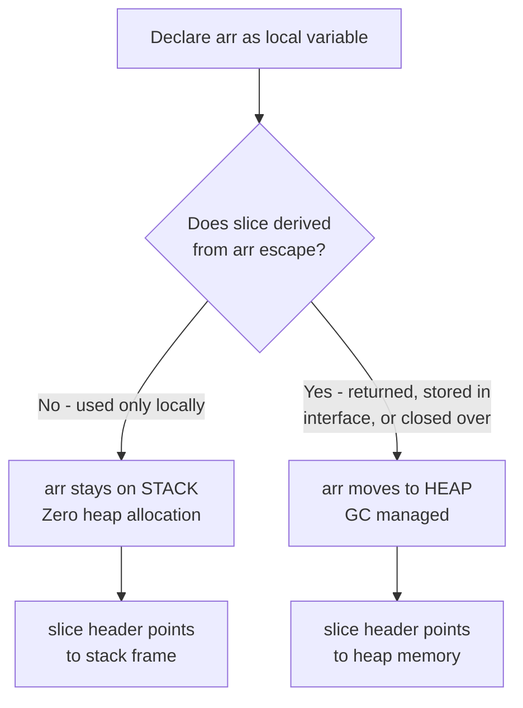

# Array to Slice Conversion — Middle Guide

## 1. Introduction

### Why does it matter?
At the junior level you learned *what* array-to-slice conversion is. At the middle level the key questions are **why** the language works this way, **when** to use it versus alternatives, and how to reason about shared ownership in real programs.

Go's design philosophy — zero-cost abstractions — means you never pay for a layer of indirection you don't need. Arrays live on the stack; slices are views into arrays. This architecture lets you write code that is simultaneously ergonomic (use slices everywhere) and performant (back them with stack arrays when possible).

### How to use it — production patterns
```go
// Pattern 1: io.Reader with stack buffer (zero heap allocation)
func readFully(r io.Reader) ([]byte, error) {
    var buf [4096]byte
    var result []byte
    for {
        n, err := r.Read(buf[:])
        result = append(result, buf[:n]...)
        if err == io.EOF {
            return result, nil
        }
        if err != nil {
            return nil, err
        }
    }
}

// Pattern 2: Sub-slice with bounded capacity for safe API
func safeWindow(arr *[256]byte, start, end int) []byte {
    return arr[start:end:end] // cap == len — caller cannot re-slice further
}
```

---

## 2. Prerequisites
- Comfortable with Go slices, `make`, `append`, `copy`
- Understanding of pointers and memory addresses
- Basic knowledge of Go's escape analysis
- Familiarity with `io.Reader` / `io.Writer` interfaces

---

## 3. Glossary

| Term | Definition |
|------|-----------|
| **Escape analysis** | Compiler pass that decides if a variable must move to the heap |
| **Inlining** | Compiler optimization that replaces a function call with its body |
| **Three-index slice** | `s[i:j:k]` — controls both length and capacity |
| **Memory aliasing** | Two variables that refer to the same underlying memory |
| **Defensive copy** | Creating an independent copy to avoid aliasing bugs |
| **Zero-value** | The default value of a type when declared but not initialized |
| **unsafe.SliceData** | Built-in (Go 1.20+) to get a slice's backing pointer |
| **reflect.SliceHeader** | Old way to inspect slice internals (deprecated in 1.20) |

---

## 4. Core Concepts

### Why arrays are different from slices in Go
Go deliberately kept arrays as **value types**. This is unlike C where an array name decays to a pointer automatically. In Go, you must be explicit: write `arr[:]` to get a slice. This explicitness prevents whole categories of bugs where you accidentally alias data.

### Why capacity matters for append safety
When you `append` to a slice that has `len < cap`, Go writes into the existing backing array — it does not allocate new memory. This is efficient but has a critical side effect: **it mutates the array the slice came from**.

```go
arr := [5]int{1, 2, 3, 4, 5}
s := arr[0:3]            // len=3, cap=5
s = append(s, 100)       // len < cap → writes arr[3]!
fmt.Println(arr)         // [1 2 3 100 5] ← arr[3] was 4
```

Using the full slice expression prevents this:
```go
s2 := arr[0:3:3]         // len=3, cap=3
s2 = append(s2, 100)     // cap==len → new allocation, arr unchanged
fmt.Println(arr)         // [1 2 3 4 5] ← untouched
```

### Why the compiler may move arrays to the heap
If a slice derived from a local array is returned from a function, or stored in an interface, the compiler's escape analysis may move the array to the heap. This is transparent to correctness but negates the zero-allocation benefit.

```go
// array DOES NOT escape — stays on stack
func hash(data []byte) [32]byte {
    var buf [32]byte
    // fill buf ...
    return buf // returned by value — copy, original stays on stack
}

// array ESCAPES to heap — slice outlives the function
func getSlice() []byte {
    var buf [32]byte
    return buf[:] // slice pointing to buf — buf must move to heap
}
```

---

## 5. Real-World Analogies

**Whiteboard segment:** A whiteboard is the array. A "region of interest" frame you hold up is the slice — it restricts what viewers can see, but the whiteboard data underneath is the same. If someone writes inside your frame, the whiteboard is changed.

**Apartment sub-let:** The array is an apartment block. You own one floor. When you "convert" it to a slice, you give a key (slice header) to a friend. They can access the same rooms. If you change furniture (data), your friend sees the change immediately.

---

## 6. Mental Models

**Model 1 — Slice as a lens:** A slice is a lens that focuses on a segment of an array. Multiple lenses can overlap.

**Model 2 — Capacity as a fence:** Capacity is a fence at the right end. The slice can see everything up to the fence, but not beyond. The full slice expression moves the fence closer.

**Model 3 — Shared ownership contract:** When you hand a `[]T` to a function, you are implicitly saying "I'm sharing my backing array with you." If the function must not modify or re-slice beyond your window, use a full slice expression or pass a copy.

---

## 7. Pros & Cons

### Pros
- **Zero allocation** for stack-backed buffers
- **Composable** with all standard library APIs expecting `[]T`
- **Cache-friendly** — contiguous memory, single allocation
- **Explicit** — no implicit decay from array to pointer (unlike C)

### Cons
- **Shared mutation is implicit** — easy to forget
- **Memory pinning** — a tiny slice keeps a large array alive
- **Escape analysis surprises** — returning a slice forces array to heap
- **Not safe for concurrent access** — no built-in synchronization

---

## 8. Use Cases

### When to use array-to-slice conversion
| Scenario | Why It's Good |
|----------|--------------|
| Network I/O (read buffers) | Fixed stack buffer, no GC |
| Crypto operations (keys, nonces) | Fixed size, stack-safe |
| Parsing fixed-format binary data | Direct memory view |
| Sorting a portion of a lookup table | No allocation |
| Passing fixed data to a variadic API | Bridges type mismatch |

### When NOT to use
| Scenario | Better Alternative |
|----------|--------------------|
| You need the slice to outlive its stack frame | `make([]T, n)` |
| You need to grow beyond the array size | `make + append` |
| Concurrent access from goroutines | Channels or sync primitives |

---

## 9. Code Examples

### Example 1: Detecting escape with gcflags
```go
// main.go
package main

import "fmt"

func doesNotEscape() []int {
    // This array escapes because we return a slice pointing to it
    var arr [5]int
    return arr[:] // arr moves to heap
}

func staysOnStack() [5]int {
    var arr [5]int
    arr[0] = 42
    return arr // returned by value — arr stays on stack
}

func main() {
    s := doesNotEscape()
    fmt.Println(s)
    a := staysOnStack()
    fmt.Println(a[:])
}
// Run: go build -gcflags="-m" main.go
// Output includes: "arr escapes to heap" for doesNotEscape
```

### Example 2: Full slice expression preventing accidental append mutation
```go
package main

import "fmt"

func appendSafe(data []byte) []byte {
    // This function appends to data.
    // If data has spare capacity, it would silently modify the caller's array.
    return append(data, 0xFF)
}

func main() {
    arr := [8]byte{1, 2, 3, 4, 5, 6, 7, 8}

    // UNSAFE: caller's arr[3] may be overwritten
    result1 := appendSafe(arr[0:3])
    fmt.Println("arr after unsafe:", arr) // arr[3] = 0xFF !

    // SAFE: full slice expression caps capacity
    arr2 := [8]byte{1, 2, 3, 4, 5, 6, 7, 8}
    result2 := appendSafe(arr2[0:3:3])
    fmt.Println("arr2 after safe:", arr2) // unchanged
    _ = result1
    _ = result2
}
```

### Example 3: Reusing a stack buffer in a loop
```go
package main

import (
    "fmt"
    "math/rand"
)

func processChunk(data []byte) int {
    sum := 0
    for _, b := range data {
        sum += int(b)
    }
    return sum
}

func main() {
    var buf [64]byte // stack-allocated, reused each iteration
    total := 0
    for i := 0; i < 1000; i++ {
        // Fill buf with "data"
        for j := range buf {
            buf[j] = byte(rand.Intn(256))
        }
        total += processChunk(buf[:])
    }
    fmt.Println("total:", total)
    // buf is never heap-allocated — 0 GC pressure
}
```

### Example 4: Binary protocol parsing
```go
package main

import (
    "encoding/binary"
    "fmt"
)

type Header struct {
    Magic   uint32
    Version uint16
    Length  uint16
}

func parseHeader(data *[8]byte) Header {
    return Header{
        Magic:   binary.BigEndian.Uint32(data[0:4]),
        Version: binary.BigEndian.Uint16(data[4:6]),
        Length:  binary.BigEndian.Uint16(data[6:8]),
    }
}

func main() {
    raw := [8]byte{0xDE, 0xAD, 0xBE, 0xEF, 0x00, 0x01, 0x00, 0x20}
    h := parseHeader(&raw)
    fmt.Printf("Magic: %X, Version: %d, Length: %d\n", h.Magic, h.Version, h.Length)
}
```

---

## 10. Coding Patterns

### Pattern: Bounded capacity slice factory
```go
func boundedSlice(arr *[1024]byte, start, end int) []byte {
    if start < 0 || end > len(arr) || start > end {
        return nil
    }
    return arr[start:end:end]
}
```

### Pattern: Zeroing an array via slice
```go
var key [32]byte
// ... use key ...
// Zero out key
zeros := key[:] // no allocation
for i := range zeros {
    zeros[i] = 0
}
// or more idiomatically:
key = [32]byte{} // zero the whole array at once
```

---

## 11. Clean Code

- **Single responsibility:** Functions should declare whether they take ownership of a slice or merely observe it.
- **Document aliases:** If a returned slice aliases an array, document it clearly.
- **Use `copy` at API boundaries:** When accepting user data that may be modified, make a defensive copy.
- **Prefer value semantics for small arrays:** Return `[32]byte` by value rather than `[]byte` when the size is fixed.

---

## 12. Product Use / Feature Context

Go's standard library uses array-to-slice conversion extensively:

- `crypto/sha256`: operates on `[32]byte`, accepts `[]byte` for input.
- `net`: uses fixed-size stack buffers in the DNS resolver to avoid heap allocation.
- `encoding/binary`: `Read`/`Write` accept `[]byte` — callers pass `arr[:]`.
- `bufio.Scanner`: internally uses a `[4096]byte` read buffer.

---

## 13. Error Handling

### Defensive boundary checking
```go
func window(arr []int, start, size int) ([]int, error) {
    if start < 0 {
        return nil, fmt.Errorf("start %d is negative", start)
    }
    end := start + size
    if end > len(arr) {
        return nil, fmt.Errorf("window [%d:%d] exceeds slice length %d", start, end, len(arr))
    }
    // Use bounded cap to prevent caller from accessing beyond window
    return arr[start:end:end], nil
}
```

---

## 14. Security Considerations

### Information leakage via re-slicing
```go
// VULNERABLE: receiver can re-slice to read beyond intended window
func badAPI(arr *[1024]byte, n int) []byte {
    return arr[:n] // cap = 1024! receiver can do s[:1024]
}

// SAFE: cap is limited to n
func goodAPI(arr *[1024]byte, n int) []byte {
    return arr[:n:n]
}
```

### Zeroing sensitive data
```go
func handlePassword(input []byte) {
    var key [32]byte
    deriveKey(key[:], input)
    defer func() {
        // Explicitly zero to prevent lingering secrets
        for i := range key {
            key[i] = 0
        }
    }()
    // use key[:]...
}
```

---

## 15. Performance Tips

### Benchmark: stack vs heap buffer
```go
// BenchmarkStack: array on stack, no allocation
func BenchmarkStack(b *testing.B) {
    for i := 0; i < b.N; i++ {
        var buf [512]byte
        processData(buf[:])
    }
}

// BenchmarkHeap: make allocates on heap
func BenchmarkHeap(b *testing.B) {
    for i := 0; i < b.N; i++ {
        buf := make([]byte, 512)
        processData(buf)
    }
}
// Stack variant: 0 allocs/op
// Heap variant:  1 alloc/op, ~200ns overhead
```

---

## 16. Metrics & Analytics

Key metrics to track:
- **allocs/op in benchmarks:** Array-to-slice conversions inside tight loops should show 0 allocs.
- **GC pause time:** Reducing heap allocations (via stack buffers) reduces GC pause time.
- **pprof heap profile:** If you see repeated small allocations in buffer-heavy code, switch to stack arrays.

---

## 17. Best Practices

1. **Pass `*[N]T` to functions that need to operate on a fixed-size array** — avoids array copy.
2. **Use `arr[low:high:high]` when sharing sub-slices** — prevents accidental capacity extension.
3. **Do not hold long-lived slices into temporary arrays** — prevents keeping large arrays alive.
4. **Profile before optimizing** — stack vs heap difference matters only in hot paths.
5. **Prefer `bytes.Equal` over manual loop for `[]byte` comparison.**

---

## 18. Edge Cases & Pitfalls

```go
// Edge 1: Zero-length array slice
var empty [0]int
s := empty[:]
fmt.Println(len(s), cap(s), s == nil) // 0 0 false

// Edge 2: Multi-dimensional array to slice
arr2d := [3][4]int{{1,2,3,4},{5,6,7,8},{9,10,11,12}}
row := arr2d[1][:]   // slice of second row: [5 6 7 8]
fmt.Println(row)

// Edge 3: Slice of pointer-to-array
arrPtr := &[5]int{1,2,3,4,5}
s2 := arrPtr[1:3] // Go auto-dereferences pointer-to-array in slice expression
fmt.Println(s2)   // [2 3]
```

---

## 19. Common Mistakes

| Mistake | Why It Happens | Fix |
|---------|---------------|-----|
| `append` silently writes into original array | Forgetting len < cap means same backing array | Use `arr[i:j:j]` or `copy` |
| Returning `arr[:]` from function expecting no allocation | Slice outlives frame — escape analysis kicks in | Use `make` if lifetime > function |
| Comparing slices with `==` | Only nil slice can be compared with `==` | Use `bytes.Equal` or `reflect.DeepEqual` |
| Not zeroing sensitive arrays after use | GC doesn't zero old heap memory | Explicit zero loop or `key = [N]T{}` |

---

## 20. Common Misconceptions

- **"If I use a full slice expression, the array is copied"** — FALSE. Full slice expression only changes the reported capacity.
- **"A slice derived from a stack array is always stack-allocated"** — FALSE. If the slice escapes (e.g., returned, stored in interface), the array moves to heap.
- **"cap(arr[:]) == len(arr[:])"** — Only when you use `arr[:]` (full). Partial slices have cap > len.

---

## 21. Evolution & Historical Context

Before Go 1.2, there was no full slice expression. Programmers had to rely on conventions and documentation to prevent callers from re-slicing beyond intended boundaries. Go 1.2 introduced the three-index slice expression (`s[i:j:k]`) to address this security and correctness concern.

Go's array-as-value-type design was a deliberate departure from C's implicit array-to-pointer decay, which was a source of countless bugs. Go chose safety over implicit convenience.

---

## 22. Alternative Approaches

| Approach | When to Use | Trade-off |
|----------|------------|-----------|
| `make([]T, n)` | Unknown/dynamic size | Heap allocation |
| `[N]T` by value | Fixed size, value semantics | Copying cost for large N |
| `*[N]T` (pointer) | Fixed size, shared mutation | Pointer indirection |
| `bytes.Buffer` | Building variable-length data | More overhead |
| `sync.Pool` | High-frequency buffer reuse | Pool management complexity |

---

## 23. Anti-Patterns

```go
// ANTI-PATTERN 1: Leaking capacity in public API
func getUserData(store *[1024]byte, n int) []byte {
    return store[:n] // WRONG: exposes full 1024 cap
}

// ANTI-PATTERN 2: Holding reference to large backing array
var cache []byte
func cacheFirst4(arr *[1024*1024]byte) {
    cache = arr[:4] // keeps entire 1 MB array alive!
    // Fix: cache = make([]byte, 4); copy(cache, arr[:4])
}

// ANTI-PATTERN 3: Concurrent modification
var shared [10]int
s := shared[:]
go func() { s[0] = 1 }()
go func() { s[0] = 2 }() // DATA RACE
```

---

## 24. Debugging Guide

### Checking escape analysis
```bash
go build -gcflags="-m -m" ./... 2>&1 | grep "escapes to heap"
```

### Checking for data races
```bash
go test -race ./...
go run -race main.go
```

### Printing slice internals
```go
import "unsafe"

func sliceInfo(s []int) {
    h := (*[3]uintptr)(unsafe.Pointer(&s))
    fmt.Printf("ptr=%x len=%d cap=%d\n", h[0], h[1], h[2])
}
```

### Verifying shared memory
```go
arr := [5]int{1, 2, 3, 4, 5}
s := arr[1:3]
fmt.Println(&arr[1] == &s[0]) // true — same address
```

---

## 25. Comparison with Other Languages

| Language | Behavior |
|----------|---------|
| **C** | Array name decays to pointer implicitly; `arr[i:j]` doesn't exist — manual pointer arithmetic |
| **C++** | `std::span<T>(arr, n)` — similar to Go's slice but explicit, no `append` semantics |
| **Rust** | Slices `&arr[i..j]` — borrow checker prevents aliasing bugs at compile time |
| **Java** | `Arrays.copyOfRange` — always copies; no zero-copy slice semantics |
| **Python** | `arr[i:j]` — always copies for lists; `memoryview` for zero-copy buffer protocol |

Go sits between C (explicit but unsafe) and Rust (explicit with compile-time safety), offering zero-copy slices with runtime bounds checking.

---

## 26. Tricky Points

1. **Pointer-to-array auto-dereferencing:** `arrPtr[i:j]` works if `arrPtr` is `*[N]T` — Go auto-dereferences.
2. **Slice comparisons at runtime vs compile time:** You cannot compare slices with `==` (except to nil); arrays of the same type can.
3. **`copy` returns the number of elements copied** — the minimum of `len(dst)` and `len(src)`.
4. **`append` on a nil slice:** Valid — `append(nil, 1, 2, 3)` returns a new slice. But `append` on a slice derived from an array with capacity room mutates the array.

---

## 27. Test

**Q1:** What is the capacity of `arr[2:4]` for `arr := [7]int{...}`?
**A1:** 7 − 2 = 5

**Q2:** If you do `s := arr[2:4:5]` and then `s = append(s, 99)`, does `arr[5]` change?
**A2:** Only if `arr` has at least 6 elements. Yes, `arr[4]` (index = low + len(append result) - 1) would be set to 99.

**Q3:** How do you make a copy of `arr[:]` that does not share memory?
**A3:** `dst := make([]int, len(arr)); copy(dst, arr[:])`

---

## 28. Tricky Questions

1. Can you take a slice of a slice with a full slice expression? Yes: `s[i:j:k]` where k ≤ cap(s).
2. Does `arr[:0]` return nil? No. It returns a non-nil empty slice with cap=len(arr).
3. What happens if you `grow` a slice using `s = s[:cap(s)]` before all elements are initialized? You get the uninitialized values of the backing array — potential information leakage.
4. Why can't two goroutines read from a slice concurrently if one is writing? The write is not atomic; reads may observe partial writes.

---

## 29. Cheat Sheet

```go
// Array to slice — zero cost
s := arr[:]             // full
s := arr[i:j]           // partial, cap = len(arr)-i
s := arr[i:j:k]         // full expr, cap = k-i

// Verify shared memory
&arr[i] == &s[0]        // true when s = arr[i:]

// Prevent cap leakage
s := arr[i:j:j]         // cap = len(s) — no re-slicing possible

// Independent copy
dst := make([]T, len(arr))
copy(dst, arr[:])

// Stack check (escape analysis)
go build -gcflags="-m" ./...
```

---

## 30. Diagrams & Visual Aids

### Mermaid: Escape Analysis Decision



### Memory layout with two overlapping slices

```
arr := [8]int{1,2,3,4,5,6,7,8}
s1  := arr[1:5]    // len=4, cap=7
s2  := arr[3:6]    // len=3, cap=5

Index: [0] [1] [2] [3] [4] [5] [6] [7]
arr:    1   2   3   4   5   6   7   8
            ├────────────┤             s1 visible region
                    ├─────────┤       s2 visible region
                    ↑
               OVERLAP: s1[2] == s2[0] == arr[3]
```
