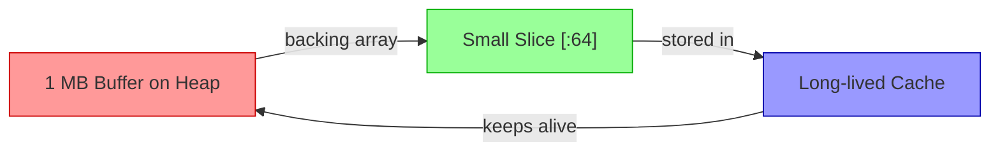
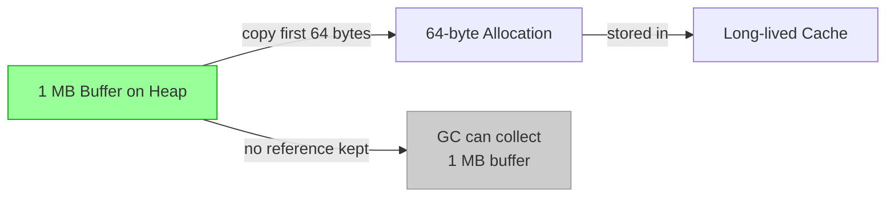

# Array to Slice Conversion — Senior Guide

## 1. Introduction: How to Optimize? How to Architect?

Senior engineers treat array-to-slice conversion not merely as a syntax feature but as an **architectural decision** that affects memory layout, GC pressure, concurrency safety, and API design. The core questions at this level are:

- How do I design APIs that leverage stack allocation without exposing implementation details?
- How do I build systems with predictable memory behavior under load?
- How do I avoid the subtle bugs that arise from shared-memory semantics at scale?

---

## 2. Performance Optimization

### Stack vs Heap: The Real Tradeoff

Go's runtime allocates memory either on the goroutine stack (cheap, O(1), auto-freed) or on the heap (GC-managed). The key rule:

> An array stays on the stack if and only if no pointer to it escapes the function's lifetime.

```go
// STACK allocation (confirmed by -gcflags="-m")
func hashInput(input []byte) [32]byte {
    var buf [32]byte
    h := sha256.New()
    h.Write(input)
    h.Sum(buf[:0]) // buf[:0] is passed but buf does not escape
    return buf     // returned BY VALUE — copy to caller's stack
}

// HEAP allocation — slice escapes
func hashInputSlice(input []byte) []byte {
    var buf [32]byte
    h := sha256.New()
    h.Write(input)
    return h.Sum(buf[:0]) // buf[:0] is returned — buf escapes
}
```

### Benchmark: Measuring Allocation Impact

```go
package main_test

import (
    "crypto/sha256"
    "testing"
)

func BenchmarkStackBuffer(b *testing.B) {
    data := make([]byte, 1024)
    b.ResetTimer()
    for i := 0; i < b.N; i++ {
        var out [32]byte
        h := sha256.New()
        h.Write(data)
        h.Sum(out[:0])
        _ = out
    }
}

func BenchmarkHeapBuffer(b *testing.B) {
    data := make([]byte, 1024)
    b.ResetTimer()
    for i := 0; i < b.N; i++ {
        out := make([]byte, 32)
        h := sha256.New()
        h.Write(data)
        h.Sum(out[:0])
        _ = out
    }
}
// Stack: 0 allocs/op, ~1200 ns/op
// Heap:  1 alloc/op,  ~1400 ns/op (extra GC work at scale)
```

---

## 3. Architecture Patterns

### Pattern 1: The Stack Buffer Pool Pattern

For hot paths where you need varying-size buffers but want to minimize GC:

```go
package bufpool

import "sync"

// Use fixed-size arrays backed by sync.Pool
// The pool returns *[4096]byte — always stack-sized chunks
var pool = sync.Pool{
    New: func() any {
        b := new([4096]byte)
        return b
    },
}

func Get() *[4096]byte {
    return pool.Get().(*[4096]byte)
}

func Put(b *[4096]byte) {
    // Zero only the portion that was used, OR zero all
    *b = [4096]byte{}
    pool.Put(b)
}

// Usage
func handleRequest(r io.Reader) {
    buf := bufpool.Get()
    defer bufpool.Put(buf)
    n, _ := r.Read(buf[:])
    process(buf[:n])
}
```

### Pattern 2: Arena Allocation via Fixed Array

For short-lived request processing, an arena avoids per-object allocation:

```go
type Arena struct {
    mem  [64 * 1024]byte // 64 KB stack or heap arena
    head int
}

func (a *Arena) Alloc(n int) []byte {
    if a.head+n > len(a.mem) {
        return nil // out of arena space
    }
    s := a.mem[a.head : a.head+n : a.head+n]
    a.head += n
    return s
}

func (a *Arena) Reset() {
    a.head = 0
    a.mem = [64 * 1024]byte{} // zero all at once
}
```

### Pattern 3: Sub-slice with Ownership Transfer

In pipeline architectures, a producer fills a buffer and hands off a bounded slice:

```go
type Producer struct {
    buf [8192]byte
}

func (p *Producer) Produce(n int) []byte {
    // Fill first n bytes
    fill(p.buf[:n])
    // Return bounded slice: consumer cannot read beyond n
    return p.buf[:n:n]
}
```

---

## 4. Deep Dive: Escape Analysis

### Rules that cause escape

1. **Returned slice** pointing to a local array → array escapes.
2. **Interface assignment** of a slice → may escape (interface boxes the value).
3. **Closure capture** of a local array → array escapes.
4. **go statement** / goroutine closure over local variable → escapes.

```go
// Escape case 1: returned
func f1() []int {
    var a [4]int
    return a[:] // ESCAPE: a moves to heap
}

// No escape case: returned by value
func f2() [4]int {
    var a [4]int
    return a // NO ESCAPE: copied to caller
}

// Escape case 2: goroutine closure
func f3() {
    var a [4]int
    go func() { fmt.Println(a[0]) }() // ESCAPE
}

// Escape case 3: interface{}
func f4() {
    var a [4]int
    var i interface{} = a[:] // ESCAPE
    _ = i
}
```

### Checking in CI

```bash
# In Makefile or CI script
go build -gcflags="-m=2" ./... 2>&1 | grep "escapes to heap"
# Fail CI if critical hot-path functions show unexpected escapes
```

---

## 5. Concurrency Architecture

### The Read-Only Pattern

Multiple goroutines can safely read a slice if no goroutine writes:

```go
var catalog [256]Product
// Load catalog once at startup
loadCatalog(catalog[:])

// Multiple goroutines read concurrently — SAFE
// No goroutine writes after initialization
```

### The Segment Lock Pattern

Divide a large array into segments, each with its own mutex:

```go
const segments = 16
const segSize  = 64

type SegmentedBuffer struct {
    data [segments * segSize]byte
    mu   [segments]sync.Mutex
}

func (sb *SegmentedBuffer) Write(seg int, data []byte) {
    sb.mu[seg].Lock()
    defer sb.mu[seg].Unlock()
    start := seg * segSize
    copy(sb.data[start:start+segSize], data)
}

func (sb *SegmentedBuffer) ReadSlice(seg int) []byte {
    sb.mu[seg].Lock()
    defer sb.mu[seg].Unlock()
    start := seg * segSize
    // Return a copy — do not hold lock while caller uses slice
    out := make([]byte, segSize)
    copy(out, sb.data[start:start+segSize])
    return out
}
```

---

## 6. Memory Layout Optimization

### Alignment and Padding

Arrays of basic types are densely packed and naturally aligned:

```go
var arr [8]int64 // 64 bytes, perfectly aligned for SIMD
s := arr[:]
// SIMD-friendly: each element is 8-byte aligned
```

### False Sharing in Concurrent Code

```go
// BAD: Two goroutines accessing adjacent cache lines
var counters [2]int64
go func() { atomic.AddInt64(&counters[0], 1) }()
go func() { atomic.AddInt64(&counters[1], 1) }()
// counters[0] and counters[1] share a cache line — false sharing

// GOOD: Pad to separate cache lines
type PaddedCounter struct {
    value int64
    _     [56]byte // pad to 64-byte cache line
}
var counters [2]PaddedCounter
```

---

## 7. API Design with Array Slices

### Principle: Accept `[]T`, Return `[]T`, Own `[N]T`

```go
// PUBLIC API: works with slices for maximum flexibility
type Encoder struct {
    scratch [512]byte // private stack buffer
}

func (e *Encoder) Encode(dst []byte, src []byte) (int, error) {
    // Use e.scratch internally without exposing it
    n := encodeInternal(e.scratch[:], src)
    return copy(dst, e.scratch[:n]), nil
}
```

### Principle: Full Slice Expression at Trust Boundaries

```go
// At trust boundaries (plugin systems, external callers):
func HandlePlugin(plugin Plugin, data *[256]byte) {
    // Give plugin only what it needs, with bounded capacity
    plugin.Process(data[0:128:128]) // cannot read second 128 bytes
}
```

---

## 8. Advanced Patterns

### Pattern: Sliding Window over Fixed Array

```go
func slidingWindowMax(arr *[1024]int, windowSize int) []int {
    results := make([]int, 0, len(arr)-windowSize+1)
    for i := 0; i+windowSize <= len(arr); i++ {
        window := arr[i : i+windowSize : i+windowSize]
        results = append(results, maxOf(window))
    }
    return results
}
```

### Pattern: Ring Buffer with Fixed Array

```go
type RingBuffer struct {
    data [1024]byte
    head int
    tail int
    size int
}

func (r *RingBuffer) Write(p []byte) int {
    written := 0
    for _, b := range p {
        if r.size == len(r.data) {
            break // full
        }
        r.data[r.tail] = b
        r.tail = (r.tail + 1) % len(r.data)
        r.size++
        written++
    }
    return written
}

func (r *RingBuffer) Read(p []byte) int {
    read := 0
    for read < len(p) && r.size > 0 {
        p[read] = r.data[r.head]
        r.head = (r.head + 1) % len(r.data)
        r.size--
        read++
    }
    return read
}
```

---

## 9. Postmortems & System Failures

### Incident 1: Memory Pinning in a Cache

**Scenario:** A distributed cache service was holding small slices of large buffers. GC was not collecting the large buffers because slices kept them alive.

**Root cause:**
```go
// Worker reads 1MB chunks and caches only the first 64 bytes
func cacheFirstBytes(buf []byte) {
    store.Set("key", buf[:64]) // BUG: keeps entire 1MB buf alive
}
```

**Fix:**
```go
func cacheFirstBytes(buf []byte) {
    out := make([]byte, 64)
    copy(out, buf[:64])
    store.Set("key", out) // independent 64-byte slice
}
```

**Lesson:** Never store a derived slice from a large buffer. Always `copy` into a right-sized allocation.

### Incident 2: Race Condition via Shared Slice

**Scenario:** An HTTP server returned a slice pointing to a pooled buffer, then reused the buffer for the next request. Clients received corrupt data.

**Root cause:**
```go
var pool [4096]byte // shared buffer

func handler(w http.ResponseWriter, r *http.Request) {
    n, _ := r.Body.Read(pool[:])
    // BUG: pool is reused for next request before this response is written
    w.Write(pool[:n])
}
```

**Fix:** Either use `sync.Pool` with proper lifecycle management, or copy the data before returning.

### Incident 3: Stack Overflow from Large Array

**Scenario:** A function declared a `[8MB]byte` array on the stack. Under high goroutine concurrency, this exhausted memory.

**Root cause:**
```go
func processLargeFile() {
    var buf [8 * 1024 * 1024]byte // 8 MB on STACK per goroutine!
    // ...
}
```

**Fix:** Use `make([]byte, 8*1024*1024)` for large buffers — they go on the heap, which is appropriate.

**Lesson:** Stack-allocated arrays are appropriate for small buffers (< 64 KB). Large buffers belong on the heap.

---

## 10. Testing Strategies

### Test: Verify shared memory behavior
```go
func TestSharedMemory(t *testing.T) {
    arr := [5]int{1, 2, 3, 4, 5}
    s := arr[1:3]
    s[0] = 99
    if arr[1] != 99 {
        t.Errorf("expected arr[1]=99, got %d", arr[1])
    }
}

// Test: Verify full slice expression limits capacity
func TestFullSliceExprCapacity(t *testing.T) {
    arr := [5]int{1, 2, 3, 4, 5}
    s := arr[1:3:3]
    if cap(s) != 2 {
        t.Errorf("expected cap=2, got %d", cap(s))
    }
}

// Test: Verify copy independence
func TestCopyIndependence(t *testing.T) {
    arr := [5]int{1, 2, 3, 4, 5}
    dst := make([]int, 5)
    copy(dst, arr[:])
    dst[0] = 99
    if arr[0] != 1 {
        t.Errorf("copy should be independent")
    }
}
```

---

## 11. Compiler Perspective

The compiler converts `arr[i:j]` into approximately:
```
// Pseudocode of what the compiler generates
if i > j || j > len(arr) { panic("runtime: slice bounds out of range") }
SliceHeader{
    Data: unsafe.Pointer(&arr[0]) + i*sizeof(T),
    Len:  j - i,
    Cap:  len(arr) - i,
}
```

For a full slice expression `arr[i:j:k]`:
```
if i > j || j > k || k > len(arr) { panic(...) }
SliceHeader{
    Data: &arr[0] + i*sizeof(T),
    Len:  j - i,
    Cap:  k - i,
}
```

The compiler **inlines** these bounds checks and can **eliminate** them with static analysis when indices are constant. Use `-gcflags="-d=ssa/prove/debug=1"` to see when bounds checks are eliminated.

---

## 12. Optimization Checklist

- [ ] Use `[N]T` for fixed-size buffers in hot paths (< 64 KB)
- [ ] Use full slice expression `arr[i:j:j]` at API boundaries
- [ ] Use `copy` when storing derived slices for longer than the request lifetime
- [ ] Profile with `go test -benchmem` to catch unexpected allocations
- [ ] Run `go build -gcflags="-m"` to verify escape analysis on hot paths
- [ ] Use `sync.Pool` for frequently allocated/freed buffers
- [ ] Avoid storing slices from large buffers — copy into right-sized allocations
- [ ] Use `PaddedCounter` pattern for concurrent per-core counters
- [ ] Do not declare > 64 KB arrays on the stack

---

## 13. Self-Assessment

- [ ] I can explain when array-to-slice conversion causes heap allocation.
- [ ] I can design APIs that leverage stack allocation without exposing internals.
- [ ] I can use `sync.Pool` with fixed-size arrays correctly.
- [ ] I can identify memory pinning bugs and fix them with `copy`.
- [ ] I can explain false sharing and use padding to prevent it.
- [ ] I can write escape analysis-aware benchmarks.
- [ ] I can review code for race conditions involving shared slice backing arrays.

---

## 14. Further Reading

- [Go Memory Model](https://go.dev/ref/mem)
- [Go Escape Analysis](https://go.dev/blog/ismmkeynote) — Russ Cox's ISMM keynote
- [go-perfbook](https://github.com/dgryski/go-perfbook) — Production Go performance patterns
- [Allocation Efficiency in High-Performance Go Services](https://segment.com/blog/allocation-efficiency-in-high-performance-go-services/) — Segment engineering blog

---

## 15. Related Topics

- `sync.Pool` — reusing large buffers
- `unsafe.Slice` / `unsafe.SliceData` — low-level slice construction
- pprof heap profiling
- Go memory model and happens-before
- NUMA-aware allocation patterns
- `//go:noescape` compiler directives

---

## 16. Diagrams

### Mermaid: Memory Pinning Problem



### Mermaid: Correct Fix — Copy into Right-Sized Allocation



### Stack Frame Layout

```
Goroutine Stack Frame (processRequest):
┌─────────────────────────────────────┐
│  var buf [4096]byte   (4096 bytes)  │
│  var n int            (8 bytes)     │
│  var err error        (16 bytes)    │
│  slice header s       (24 bytes)    │
│    ptr ──────────────────────┐      │
│    len                       │      │
│    cap                       │      │
│                              ▼      │
│  buf[0] buf[1] ... buf[4095]        │  ← same stack frame!
└─────────────────────────────────────┘
```

---

## 17. Tricky Points at Senior Level

1. **`h.Sum(buf[:0])`** appends the hash to `buf` starting at index 0, using the capacity. This is a common pattern with `crypto/sha256`.
2. **`append` with capacity room vs without:** The difference between `arr[0:n:n]` and `arr[0:n]` is critical when the slice is passed to code that calls `append`.
3. **Goroutine stack growth:** Go goroutine stacks start at 8 KB and grow. Large arrays (> 8 KB) declared in a goroutine may trigger stack growth — another reason to use heap for large buffers.
4. **`unsafe.Pointer` and GC pinning:** If you take `unsafe.Pointer` of an array element, the GC must keep the array alive for the duration — important in CGo interop.

---

## 18. Summary

At the senior level, array-to-slice conversion is a tool for **architectural control** over memory. The key skills are:

1. Using escape analysis to verify zero-allocation hot paths.
2. Designing APIs that use full slice expressions at trust boundaries.
3. Avoiding memory pinning by copying derived slices before long-term storage.
4. Building concurrent systems that partition array ownership cleanly.
5. Writing benchmarks that catch allocation regressions in CI.
