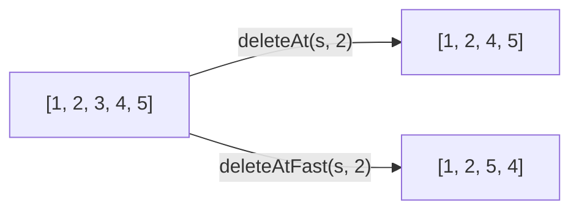
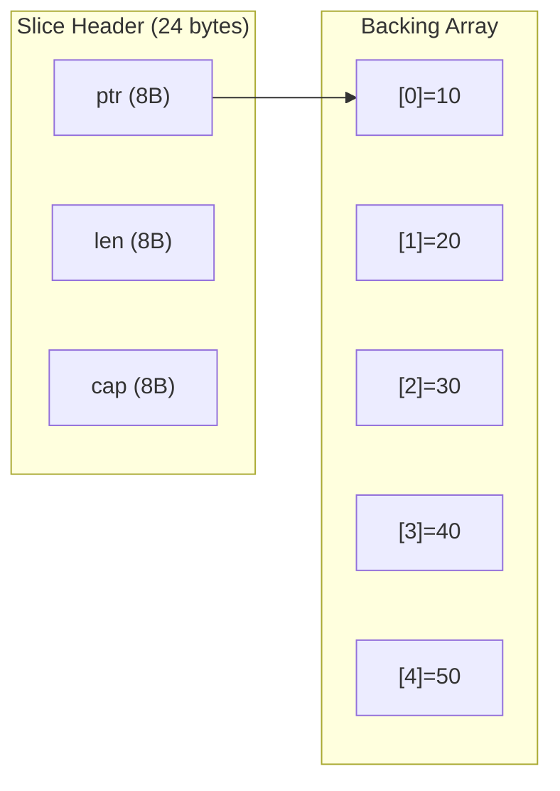
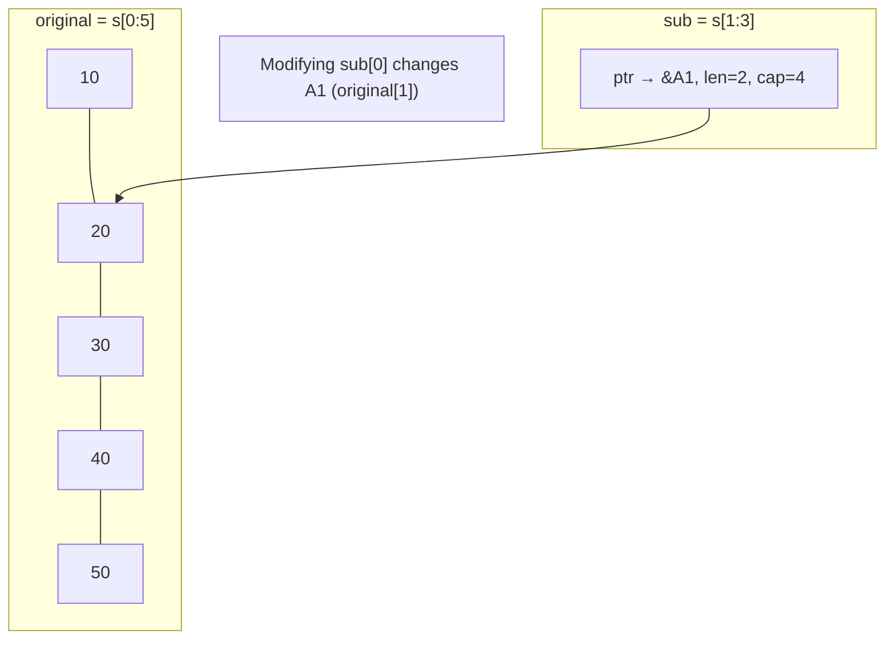

# Slices — Junior Level

## Table of Contents
1. Introduction
2. Prerequisites
3. Glossary
4. Core Concepts
5. Real-World Analogies
6. Mental Models
7. Pros & Cons
8. Use Cases
9. Code Examples
10. Coding Patterns
11. Clean Code
12. Product Use / Feature
13. Error Handling
14. Security Considerations
15. Performance Tips
16. Metrics & Analytics
17. Best Practices
18. Edge Cases & Pitfalls
19. Common Mistakes
20. Common Misconceptions
21. Tricky Points
22. Test
23. Tricky Questions
24. Cheat Sheet
25. Self-Assessment Checklist
26. Summary
27. What You Can Build
28. Further Reading
29. Related Topics
30. Diagrams & Visual Aids

---

## Introduction

A **slice** in Go is a flexible, dynamic view into an underlying array. Unlike arrays, slices can grow and shrink at runtime, making them the most commonly used collection type in Go. Almost every Go program works with slices on a daily basis — reading lines from a file, collecting results from a database query, processing JSON arrays.

A slice has three components: a **pointer** to the first element it references in an underlying array, a **length** (how many elements you can access), and a **capacity** (how many elements the underlying array has from that pointer onward). Understanding these three components is the key to understanding slices.

Slices are declared with `[]T` (no number in the brackets). They can be created from array expressions, slice literals, or the `make` built-in. They support `append` to add elements and `copy` to duplicate data independently.

---

## Prerequisites

- **Required:** Understanding of arrays in Go (previous section)
- **Required:** Basic Go syntax (variables, loops, functions)
- **Helpful:** Understanding of pointers at a conceptual level
- **Helpful:** Familiarity with `len()` built-in

---

## Glossary

| Term | Definition |
|------|-----------|
| Slice | A descriptor (ptr, len, cap) pointing into an underlying array |
| Length (`len`) | Number of elements accessible through the slice |
| Capacity (`cap`) | Number of elements from the slice's start to the end of its backing array |
| Nil slice | A slice with zero value: ptr=nil, len=0, cap=0 |
| Empty slice | A non-nil slice with len=0 (e.g., `[]int{}`) |
| Backing array | The underlying array that the slice points to |
| Slice expression | `a[low:high]` creates a slice over array or slice `a` |
| append | Built-in function to add elements to a slice |
| copy | Built-in function to copy elements between slices |

---

## Core Concepts

### Concept 1: Creating Slices

```go
package main

import "fmt"

func main() {
    // Method 1: Slice literal (most common)
    fruits := []string{"apple", "banana", "cherry"}
    fmt.Println(fruits)        // [apple banana cherry]
    fmt.Println(len(fruits))   // 3
    fmt.Println(cap(fruits))   // 3

    // Method 2: make([]T, length) — all zero values
    scores := make([]int, 5)
    fmt.Println(scores) // [0 0 0 0 0]

    // Method 3: make([]T, length, capacity) — pre-allocated
    buffer := make([]byte, 0, 100) // len=0, cap=100
    fmt.Println(len(buffer), cap(buffer)) // 0 100

    // Method 4: nil slice (zero value)
    var data []int
    fmt.Println(data == nil) // true
    fmt.Println(len(data))   // 0 (safe!)
}
```

### Concept 2: The Three Components

Every slice has exactly three fields internally:

```go
package main

import "fmt"

func main() {
    s := []int{10, 20, 30, 40, 50}

    fmt.Println("Slice:", s)         // [10 20 30 40 50]
    fmt.Println("Length:", len(s))   // 5 — how many elements accessible
    fmt.Println("Capacity:", cap(s)) // 5 — how many from ptr to end of array

    // Sub-slice shares backing array
    sub := s[1:4]
    fmt.Println("Sub:", sub)            // [20 30 40]
    fmt.Println("Sub length:", len(sub))   // 3
    fmt.Println("Sub capacity:", cap(sub)) // 4 (from index 1 to end of s's array)
}
```

### Concept 3: append — Adding Elements

`append` is the built-in for adding elements to a slice. **Always assign the result back.**

```go
package main

import "fmt"

func main() {
    var nums []int  // nil slice, len=0, cap=0

    // append to nil slice works fine
    nums = append(nums, 1)
    nums = append(nums, 2, 3)     // multiple at once
    nums = append(nums, []int{4, 5, 6}...) // unpack another slice

    fmt.Println(nums) // [1 2 3 4 5 6]

    // You MUST assign the result back
    // append(nums, 7) without assignment — useless! nums unchanged
}
```

### Concept 4: Slices Share Backing Array

This is the most important concept for avoiding bugs:

```go
package main

import "fmt"

func main() {
    original := []int{1, 2, 3, 4, 5}
    shared := original[1:3]   // shares backing array!

    shared[0] = 99  // modifies original[1]!
    fmt.Println(original) // [1 99 3 4 5]
    fmt.Println(shared)   // [99 3]

    // To make an INDEPENDENT copy, use copy()
    dst := make([]int, len(original[1:3]))
    copy(dst, original[1:3])
    dst[0] = 0
    fmt.Println(original) // [1 99 3 4 5] — unchanged!
    fmt.Println(dst)      // [0 3]
}
```

### Concept 5: Iterating Over Slices

```go
package main

import "fmt"

func main() {
    names := []string{"Alice", "Bob", "Charlie"}

    // Method 1: range (preferred)
    for i, name := range names {
        fmt.Printf("%d: %s\n", i, name)
    }

    // Method 2: index only
    for i := range names {
        fmt.Println(names[i])
    }

    // Method 3: value only
    for _, name := range names {
        fmt.Println(name)
    }
}
```

---

## Real-World Analogies

| Concept | Analogy |
|---------|---------|
| Slice | A window into a spreadsheet — you can slide it to see different rows |
| Length | How many rows you can see through the window |
| Capacity | How many rows are in the spreadsheet from your window's left edge |
| Nil slice | A window that doesn't exist yet |
| Empty slice | A window that exists but shows 0 rows |
| append | Adding new rows to the spreadsheet (may trigger a larger spreadsheet) |
| Shared backing array | Two windows looking at the same spreadsheet |
| copy | Printing a section of the spreadsheet — the print is independent |

---

## Mental Models

Think of a slice as a **clipboard with three properties**: where in a photo album it starts (pointer), how many photos you've selected (length), and how many photos are left in the album from your starting point (capacity).

When you `append` and there's room in the album (cap > len), your selection just extends. When there's no room, Go creates a **brand new, larger photo album**, copies all your photos into it, and gives you a new clipboard pointing to the new album. This is why you must **always assign the result of `append`** back — the new clipboard might point to a completely different album!

The most dangerous trap: two clipboards pointing to the same album. If you edit a photo using clipboard A, clipboard B sees the change because they both point to the same underlying album.

---

## Pros & Cons

| Pros | Cons |
|------|------|
| Dynamic size — grows with append | Shared backing array can cause surprising aliasing |
| Reference semantics — cheap to pass | Nil vs empty distinction can confuse |
| Rich built-in support (append, copy, range) | Capacity mismanagement causes unnecessary reallocations |
| Works with most Go standard library APIs | No built-in remove-from-middle operation |
| Zero value (nil) is usable (len=0) | Append must always be assigned back |

**When to use:** Almost always — for any variable-size collection.

**When NOT to use:** When you need compile-time size guarantees (use arrays) or key-value lookup (use maps).

---

## Use Cases

- **Use Case 1:** Collecting results from a database query into `[]User`
- **Use Case 2:** Building a response body with repeated `append` to `[]byte`
- **Use Case 3:** Filtering a list: `filtered = append(filtered, item)` for matching items
- **Use Case 4:** Reading lines from a file into `[]string`

---

## Code Examples

### Example 1: Filter Function

```go
package main

import "fmt"

// filter returns elements where the predicate is true
func filter(nums []int, pred func(int) bool) []int {
    result := make([]int, 0, len(nums)) // pre-allocate capacity
    for _, n := range nums {
        if pred(n) {
            result = append(result, n)
        }
    }
    return result
}

func main() {
    nums := []int{1, 2, 3, 4, 5, 6, 7, 8, 9, 10}
    evens := filter(nums, func(n int) bool { return n%2 == 0 })
    fmt.Println(evens) // [2 4 6 8 10]
}
```

### Example 2: Stack Implementation

```go
package main

import "fmt"

type Stack struct {
    data []int
}

func (s *Stack) Push(v int) {
    s.data = append(s.data, v)
}

func (s *Stack) Pop() (int, bool) {
    if len(s.data) == 0 {
        return 0, false
    }
    n := len(s.data) - 1
    v := s.data[n]
    s.data = s.data[:n] // shrink the slice
    return v, true
}

func (s *Stack) Len() int { return len(s.data) }

func main() {
    s := &Stack{}
    s.Push(1)
    s.Push(2)
    s.Push(3)
    v, _ := s.Pop()
    fmt.Println(v)      // 3
    fmt.Println(s.Len()) // 2
}
```

### Example 3: Building a CSV Row

```go
package main

import (
    "fmt"
    "strings"
)

func buildCSVRow(fields []string) string {
    var parts []string
    for _, f := range fields {
        // Quote fields that contain commas
        if strings.Contains(f, ",") {
            f = `"` + f + `"`
        }
        parts = append(parts, f)
    }
    return strings.Join(parts, ",")
}

func main() {
    row := buildCSVRow([]string{"Alice", "Smith, Jr.", "alice@example.com"})
    fmt.Println(row) // Alice,"Smith, Jr.",alice@example.com
}
```

---

## Coding Patterns

### Pattern 1: Delete Element by Index

```go
// Delete element at index i (order preserved)
func deleteAt(s []int, i int) []int {
    return append(s[:i], s[i+1:]...)
}

// Delete element at index i (order NOT preserved, faster)
func deleteAtFast(s []int, i int) []int {
    s[i] = s[len(s)-1]  // overwrite with last
    return s[:len(s)-1]  // shrink
}
```



### Pattern 2: Filter In-Place (Avoid Allocation)

```go
// Reuse the same slice's memory — no new allocation
func filterInPlace(s []int, pred func(int) bool) []int {
    result := s[:0] // zero-length, same backing array
    for _, v := range s {
        if pred(v) {
            result = append(result, v)
        }
    }
    return result
}
```

```mermaid
flowchart TD
    A[Original slice backing array] --> B{pred matches?}
    B -- Yes --> C[Write to result in same memory]
    B -- No --> D[Skip]
    C --> E[result = result[:count]]
```

---

## Clean Code

**Before:**
```go
data := []int{}
for i := 0; i < n; i++ {
    data = append(data, compute(i))
}
```

**After (pre-allocated):**
```go
data := make([]int, 0, n)   // capacity hint avoids reallocations
for i := 0; i < n; i++ {
    data = append(data, compute(i))
}
```

**Before (confusing nil check):**
```go
if users == nil || len(users) == 0 {
    return errors.New("no users")
}
```

**After (idiomatic):**
```go
if len(users) == 0 {  // works for both nil AND empty slices
    return errors.New("no users")
}
```

---

## Product Use / Feature

**Scenario:** Building a paginated API endpoint. The handler collects results into a slice, applies offset/limit, and returns them.

```go
package main

import (
    "fmt"
    "sort"
)

type User struct {
    ID   int
    Name string
}

func getUsers(db []User, offset, limit int) []User {
    if offset >= len(db) {
        return []User{}  // empty, not nil — important for JSON
    }
    end := offset + limit
    if end > len(db) {
        end = len(db)
    }
    // Return a copy to avoid leaking the DB slice to callers
    result := make([]User, end-offset)
    copy(result, db[offset:end])
    return result
}

func main() {
    db := []User{
        {1, "Alice"}, {2, "Bob"}, {3, "Charlie"},
        {4, "Dave"}, {5, "Eve"},
    }
    sort.Slice(db, func(i, j int) bool { return db[i].ID < db[j].ID })

    page1 := getUsers(db, 0, 2)
    page2 := getUsers(db, 2, 2)
    fmt.Println(page1) // [{1 Alice} {2 Bob}]
    fmt.Println(page2) // [{3 Charlie} {4 Dave}]
}
```

---

## Error Handling

```go
package main

import (
    "errors"
    "fmt"
)

var ErrEmptySlice = errors.New("slice is empty")

func first(s []int) (int, error) {
    if len(s) == 0 {
        return 0, ErrEmptySlice
    }
    return s[0], nil
}

func safeIndex(s []int, i int) (int, error) {
    if i < 0 || i >= len(s) {
        return 0, fmt.Errorf("index %d out of range [0, %d)", i, len(s))
    }
    return s[i], nil
}

func main() {
    s := []int{10, 20, 30}
    v, err := first(s)
    fmt.Println(v, err) // 10 <nil>

    v, err = safeIndex(s, 5)
    fmt.Println(v, err) // 0 index 5 out of range [0, 3)
}
```

---

## Security Considerations

- **Bounds checking:** Go panics on out-of-bounds access. Always validate external indices.
- **Slice exposure:** Returning a sub-slice of an internal slice lets callers modify your internal data. Return a copy with `make` + `copy` for safety.
- **Nil vs empty:** An API that returns `nil` instead of `[]User{}` may cause issues in JSON encoding (returns `null` vs `[]`). Return empty slices for clarity.
- **Capacity leaks:** A slice of a large array keeps the whole array alive. Use `append([]T(nil), original...)` to copy just what you need.

---

## Performance Tips

1. **Pre-allocate with `make([]T, 0, n)`** when you know the approximate final size.
2. **Avoid append in tight loops** without pre-allocation — each reallocation copies all elements.
3. **Use `copy` for independent duplicates** — safer than sub-slicing.
4. **Filter in-place** by reusing `s[:0]` as the destination — avoids allocation.
5. **Check `cap(s) > len(s)`** before append if you need to avoid reallocation.

---

## Metrics & Analytics

```go
package main

import "fmt"

// Track growth events to understand allocation behavior
func trackGrowth(n int) {
    s := make([]int, 0)
    prevCap := cap(s)
    growths := 0

    for i := 0; i < n; i++ {
        s = append(s, i)
        if cap(s) != prevCap {
            fmt.Printf("len=%d cap grew: %d → %d\n", len(s), prevCap, cap(s))
            prevCap = cap(s)
            growths++
        }
    }
    fmt.Printf("Total growths for %d elements: %d\n", n, growths)
}

func main() {
    trackGrowth(20)
}
// Output shows growth factor (approx 2x each time)
```

---

## Best Practices

1. **Use `len(s) == 0`** not `s == nil` to check for empty — handles both nil and empty slices.
2. **Pre-allocate capacity** with `make([]T, 0, n)` when size is known.
3. **Always assign `append` result** — `append(s, v)` without assignment is a no-op.
4. **Copy before returning sub-slices** from public APIs to prevent callers from modifying internals.
5. **Use `...` to spread a slice** into `append`: `s = append(s, other...)`.
6. **Prefer slice over array** for function parameters — `[]int` is more flexible than `[5]int`.
7. **Return `[]T{}` not `nil`** from functions that produce collections, for consistent JSON marshaling.

---

## Edge Cases & Pitfalls

1. **Shared backing array:** `sub := s[1:3]` shares memory with `s`. Modifying `sub[0]` changes `s[1]`.
2. **Append after sub-slice:** If you append to a sub-slice within the original's capacity, it overwrites original data.
3. **Nil vs empty:** `var s []int` is nil; `s := []int{}` is not nil. Both have `len(s) == 0`, but `s == nil` differs.
4. **range variable is a copy:** `for _, v := range s { v = 99 }` does not change `s[i]`.
5. **Capacity retention:** `s = s[:0]` does not free memory — the backing array is still alive.

---

## Common Mistakes

**Mistake 1: Not assigning append result**
```go
// WRONG
append(s, 4)      // return value discarded

// CORRECT
s = append(s, 4)
```

**Mistake 2: Modifying loop variable**
```go
// WRONG — v is a copy
for _, v := range s { v *= 2 }

// CORRECT
for i := range s { s[i] *= 2 }
```

**Mistake 3: Assuming sub-slice is independent**
```go
// WRONG — sub shares backing array with s
sub := s[1:3]
sub[0] = 99 // modifies s!

// CORRECT — independent copy
sub := make([]int, 2)
copy(sub, s[1:3])
```

---

## Common Misconceptions

1. **"A nil slice and an empty slice are the same."** For most purposes they behave the same (`len = 0`, `append` works), but `== nil` differs, and JSON marshaling differs (`null` vs `[]`).

2. **"Slicing a slice creates a copy."** No. `s2 := s[1:3]` creates a new slice header but shares the backing array. Changes through `s2` affect `s`.

3. **"append is always cheap."** When `cap(s) == len(s)`, append must allocate a new, larger backing array and copy all elements — O(n) cost.

---

## Tricky Points

1. **Three-index slicing:** `s[low:high:max]` sets capacity as well as length. `s[0:3:3]` creates a slice of length 3 and capacity 3, preventing appends from overwriting the original.

2. **nil slice is appendable:** `var s []int; s = append(s, 1)` works perfectly. You don't need to initialize.

3. **`copy` returns the number of elements copied:** `n := copy(dst, src)` — `n = min(len(dst), len(src))`. The destination and source can overlap.

---

## Test

**1. What is the output?**
```go
s := []int{1, 2, 3, 4, 5}
t := s[1:3]
t[0] = 99
fmt.Println(s[1])
```
- A) 2
- B) 99
- C) 1
- D) Panic

**Answer: B** — `t` shares the backing array with `s`. `t[0]` is `s[1]`.

---

**2. What is `len` and `cap` of `s[2:4]` where `s = make([]int, 5)`?**
- A) len=2, cap=2
- B) len=2, cap=3
- C) len=2, cap=5
- D) len=4, cap=5

**Answer: B** — `s[2:4]`: len = 4-2 = 2. cap = 5-2 = 3 (elements from index 2 to end of backing array).

---

**3. Which creates a nil slice?**
- A) `s := []int{}`
- B) `s := make([]int, 0)`
- C) `var s []int`
- D) `s := make([]int, 0, 10)`

**Answer: C** — `var s []int` is the zero value: nil, len=0, cap=0.

---

**4. What happens if you don't assign the result of `append`?**
- A) The slice is modified in place
- B) The compiler gives an error
- C) The new element is silently lost
- D) Panic at runtime

**Answer: C** — `append` returns a new slice value. If not assigned, the result is discarded.

---

**5. How do you safely copy `s[1:3]` into an independent slice?**
- A) `t := s[1:3]`
- B) `t := s[1:3:3]`
- C) `t := make([]int, 2); copy(t, s[1:3])`
- D) `t := append([]int{}, s[1:3])`

**Answer: C or D** — Both create an independent copy. C uses `make`+`copy`; D uses `append` to a nil slice (also works).

---

## Tricky Questions

**Q: What is the difference between `var s []int` and `s := []int{}`?**
A: `var s []int` is nil (`s == nil` is true), len=0, cap=0. `s := []int{}` is not nil, len=0, cap=0. Both work with `append` and `len`. Difference matters for JSON (`null` vs `[]`) and `== nil` checks.

**Q: What does `s = s[:0]` do?**
A: Sets the length to 0 but keeps the capacity. Effectively "clears" the slice without releasing memory. The backing array is still allocated. Good for reusing a buffer.

**Q: What is three-index slicing `s[1:3:4]`?**
A: Creates a slice with ptr pointing to `s[1]`, length = 3-1 = 2, capacity = 4-1 = 3. The third index limits capacity to prevent appends from overwriting elements beyond index 4.

---

## Cheat Sheet

```go
// Creation
s := []int{1, 2, 3}          // literal
s := make([]int, 5)           // len=5, cap=5
s := make([]int, 0, 10)       // len=0, cap=10
var s []int                   // nil slice

// Properties
len(s)    // length
cap(s)    // capacity
s == nil  // true only for nil slice

// Access
s[0]          // first element
s[len(s)-1]   // last element

// Slicing (shares backing array)
s[1:3]      // [s[1], s[2]], len=2, cap=cap(s)-1
s[:3]       // [s[0], s[1], s[2]]
s[2:]       // [s[2]..s[len-1]]
s[:]        // entire slice
s[1:3:4]    // len=2, cap=3 (limited capacity)

// Append (always assign back!)
s = append(s, 1)
s = append(s, 1, 2, 3)
s = append(s, other...)   // spread

// Copy (independent)
dst := make([]int, len(src))
n := copy(dst, src)        // n = elements copied

// Delete element at i (order preserved)
s = append(s[:i], s[i+1:]...)

// Iterate
for i, v := range s { }
for i := range s { s[i] = ... }
```

---

## Self-Assessment Checklist

- [ ] I can create slices with literals, make, and nil declaration
- [ ] I understand len vs cap and can predict their values after slicing
- [ ] I know that slices share backing arrays and when this causes bugs
- [ ] I always assign the result of `append` back to the slice variable
- [ ] I can use `copy` to make an independent duplicate
- [ ] I know the difference between nil and empty slices
- [ ] I can iterate using both index loop and `range`
- [ ] I understand three-index slicing `s[low:high:max]`

---

## Summary

Slices are the most used collection type in Go. They are dynamic views into underlying arrays, with three components: pointer, length, and capacity. Key rules: (1) always assign `append` results back, (2) sub-slices share the backing array — modifications affect the original, (3) use `copy` for independent duplicates, (4) `len(s) == 0` checks for empty whether nil or not. Pre-allocating capacity with `make([]T, 0, n)` avoids reallocations in loops.

---

## What You Can Build

- **Todo list:** `[]Task` with add, complete, and delete operations
- **Event log:** append-only `[]Event` with filtering
- **User search results:** paginated `[]User` from a database
- **HTTP request body builder:** `[]byte` with repeated appends
- **Pipeline filter:** chain of filter functions over `[]Item`

---

## Further Reading

- [A Tour of Go: Slices](https://go.dev/tour/moretypes/7)
- [Go Blog: Slices: usage and internals](https://go.dev/blog/slices-intro)
- [Go Specification: Slice types](https://go.dev/ref/spec#Slice_types)
- [Go Blog: Arrays, slices (and strings)](https://go.dev/blog/slices)

---

## Related Topics

- **Arrays** — the underlying data structure slices point to
- **make** — creating initialized slices with capacity hints
- **Capacity and Growth** — how append allocates new backing arrays
- **Maps** — key-value collection, also reference type
- **strings.Builder** — efficient string building (similar to slice patterns)

---

## Diagrams & Visual Aids

### Slice Header Components



### Sub-slice Sharing



### append Growth Decision

```mermaid
flowchart TD
    A["append(s, v)"] --> B{len(s) < cap(s)?}
    B -- Yes --> C[Write v at s[len], return new header with len+1]
    B -- No --> D[Allocate new larger backing array]
    D --> E[Copy all elements]
    E --> F[Write v at end]
    F --> G[Return new slice pointing to new array]
```
