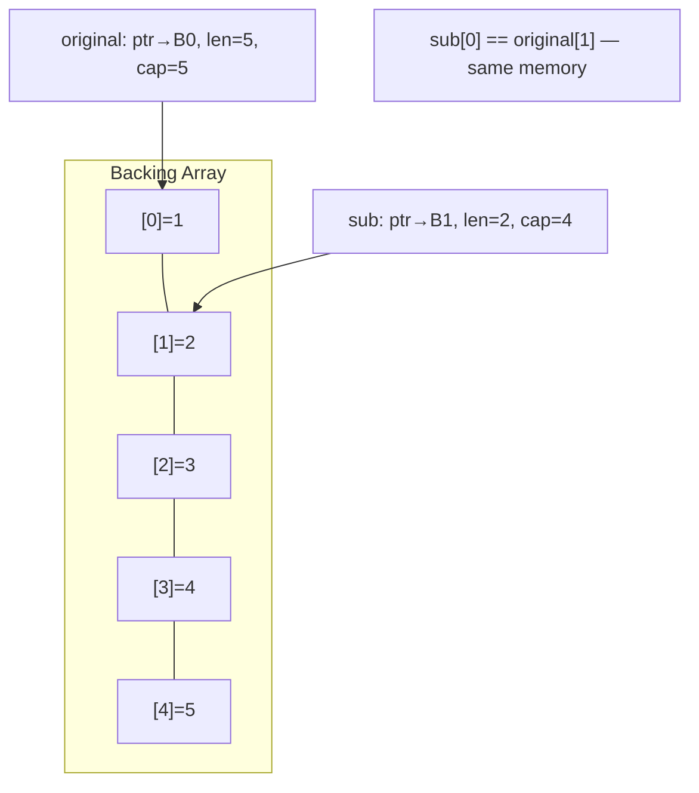
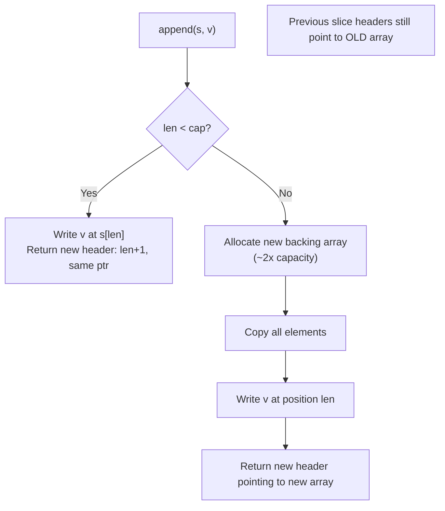
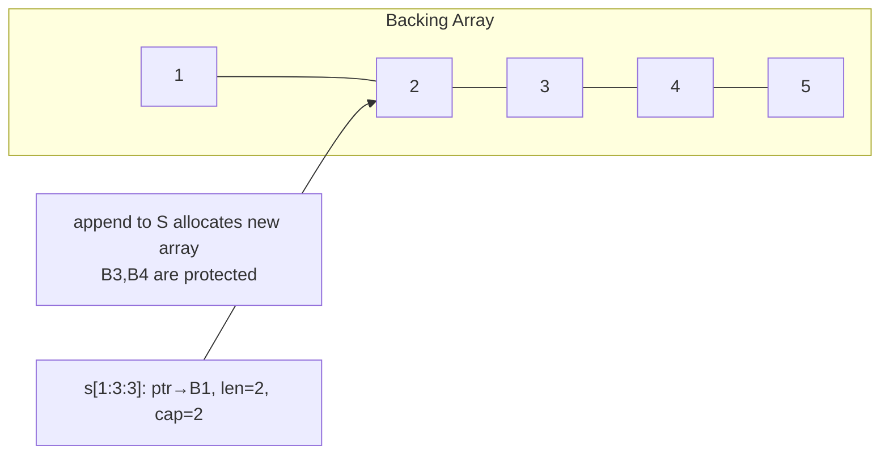

# Slices — Middle Level

## Table of Contents
1. Introduction
2. Evolution & Historical Context
3. Why Slices? Design Philosophy
4. The Slice Header in Detail
5. Aliasing and Memory Sharing
6. Growth Algorithm Deep Dive
7. Alternative Approaches
8. Anti-Patterns
9. Comparison with Other Languages
10. Advanced Code Examples
11. Debugging Guide
12. Performance Analysis
13. Concurrency Considerations
14. Testing Slices
15. Edge Cases & Advanced Pitfalls
16. Test
17. Tricky Questions
18. Cheat Sheet
19. Summary
20. Further Reading
21. Diagrams & Visual Aids

---

## Introduction

At the junior level, you learned *what* slices are and how to use them. Now the key questions are: **why are slices designed the way they are?**, **when does sharing become a bug?**, and **how do you avoid the subtle aliasing problems that plague even experienced Go programmers?**

Slices are Go's answer to a fundamental tradeoff: arrays give you predictability and value semantics; dynamic lists need flexibility and reference semantics. Slices thread this needle by separating the **descriptor** (the slice header: pointer, length, capacity) from the **data** (the backing array). The descriptor is passed by value (it's cheap — just 24 bytes), but the data is shared.

This design choice enables enormous flexibility but also creates the main source of slice bugs: **aliasing**. Two slices can point to the same memory, and you need to reason carefully about when this is desirable and when it causes bugs.

---

## Evolution & Historical Context

Go 1.0 introduced slices as a first-class type, learning from the pain of C's array-pointer duality (where arrays silently decay to pointers, losing size information) and Java's `ArrayList` (which hides all memory management).

Go's slice design has three key historical decisions:
1. **Three-word header** (ptr, len, cap) — explicit length and capacity, no sentinel null terminators
2. **Value-semantic header** — the header is copied on assignment, but the backing array is shared
3. **Built-in `append`** — handles growth transparently, returning the new slice

Go 1.17 added slice-to-array-pointer conversion. Go 1.20 added direct slice-to-array conversion. These extensions make slices more interoperable with fixed-size data.

---

## Why Slices? Design Philosophy

### The Problem with Pure Arrays

```go
// If Go only had arrays:
func processData(data [1000]int) { }  // must know size at compile time
func processData(data [2000]int) { }  // need a different function!
// This doesn't scale
```

### The Problem with Pure Pointers (like C)

```go
// C-style: arrays as pointers lose size information
void processData(int *data, int len) { } // manual length tracking, error-prone
```

### Go's Solution: The Slice

```go
// Go: slice carries pointer + length + capacity
func processData(data []int) { }  // works for any size!
// Caller passes arr[:] for arrays, s for slices
```

The slice header is the "fat pointer" that solves C's problem while keeping efficiency.

---

## The Slice Header in Detail

Understanding the exact memory layout of a slice header explains many slice behaviors:

```go
// Conceptual representation (from reflect package):
type SliceHeader struct {
    Data uintptr  // pointer to first element of backing array
    Len  int      // number of elements accessible
    Cap  int      // elements from Data to end of backing array
}
```

When you write `s := []int{10, 20, 30}`:
- Go allocates an array `[3]int` on the heap (backing array)
- Creates a slice header: `{Data: &arr[0], Len: 3, Cap: 3}`
- `s` holds this header (24 bytes on 64-bit)

When you write `t := s[1:2]`:
- No allocation
- New header: `{Data: &arr[1], Len: 1, Cap: 2}`
- `t` points to the second element of `s`'s backing array

```go
package main

import (
    "fmt"
    "unsafe"
    "reflect"
)

func main() {
    s := []int{10, 20, 30, 40, 50}
    t := s[1:3]

    sh := (*reflect.SliceHeader)(unsafe.Pointer(&s))
    th := (*reflect.SliceHeader)(unsafe.Pointer(&t))

    fmt.Printf("s: Data=%x Len=%d Cap=%d\n", sh.Data, sh.Len, sh.Cap)
    fmt.Printf("t: Data=%x Len=%d Cap=%d\n", th.Data, th.Len, th.Cap)
    // t.Data = s.Data + 8 (one int64 ahead)
    // t.Len = 2, t.Cap = 4
}
```

---

## Aliasing and Memory Sharing

### When Aliasing Is Intentional

```go
// Efficient: pass large slice to function (only 24 bytes copied)
func sum(data []int) int {
    total := 0
    for _, v := range data {
        total += v
    }
    return total
}

// No copy of data — just the header
result := sum(bigSlice)
```

### When Aliasing Causes Bugs

#### Bug 1: Sub-slice Modification

```go
func getFirstThree(s []int) []int {
    return s[:3]  // DANGER: caller can modify original!
}

func main() {
    data := []int{1, 2, 3, 4, 5}
    first := getFirstThree(data)
    first[0] = 99
    fmt.Println(data) // [99 2 3 4 5] — modified!
}

// Fix: return a copy
func getFirstThreeSafe(s []int) []int {
    result := make([]int, 3)
    copy(result, s[:3])
    return result
}
```

#### Bug 2: Append Overwrites Sibling Slices

```go
func main() {
    base := make([]int, 3, 5)
    base[0], base[1], base[2] = 1, 2, 3

    a := base[:3]    // len=3, cap=5
    b := base[:3]    // same data, len=3, cap=5

    a = append(a, 10) // writes to base[3], len(a)=4, cap=5
    b = append(b, 20) // writes to base[3] AGAIN! len(b)=4

    fmt.Println(a) // [1 2 3 10]  — but a[3] was overwritten!
    fmt.Println(b) // [1 2 3 20]
    fmt.Println(a) // [1 2 3 20]  — a[3] = 20, not 10!
}
```

#### Bug 3: Capacity Leak

```go
func process(data []byte) []byte {
    // Reads a huge file, returns first 10 bytes
    // BUG: keeps entire file in memory via backing array!
    return data[:10]
}

// Fix: copy to release the reference to the large backing array
func processSafe(data []byte) []byte {
    result := make([]byte, 10)
    copy(result, data[:10])
    return result
}
```

---

## Growth Algorithm Deep Dive

When `append` exceeds capacity, Go allocates a new backing array. The growth formula evolved across Go versions:

### Pre-Go 1.18: Simple Doubling

```
if cap < 1024:
    newCap = 2 * cap
else:
    newCap = grow by 25% until newCap >= needed
```

### Go 1.18+: Smoother Growth

```go
// Approximate: uses a formula that transitions smoothly
// from ~2x growth for small slices to ~1.25x for large ones
// The exact formula is in src/runtime/slice.go: growslice()
```

**Observing growth:**
```go
package main

import "fmt"

func main() {
    s := make([]int, 0)
    prev := 0
    for i := 0; i <= 64; i++ {
        s = append(s, i)
        if cap(s) != prev {
            fmt.Printf("len=%2d cap=%2d (growth: %dx)\n",
                len(s), cap(s), cap(s)/max(prev, 1))
            prev = cap(s)
        }
    }
}

func max(a, b int) int {
    if a > b { return a }
    return b
}
```

### Key Insight: After Growth, Two Slices Are Independent

```go
s := make([]int, 3, 3)
t := s   // t shares backing array with s

s = append(s, 4)  // s exceeds capacity → new backing array!
// Now s and t point to DIFFERENT arrays

s[0] = 99
fmt.Println(t[0]) // 1 — t still points to old array
```

---

## Alternative Approaches

### slice vs linked list

```go
// Slice: cache-friendly, O(1) append, O(n) insert-at-beginning
items := make([]Item, 0, 100)
items = append(items, newItem)

// Linked list: O(1) insert-anywhere, but poor cache locality
// Use container/list for specific access patterns
import "container/list"
l := list.New()
l.PushBack(newItem)
```

**Rule:** Use slices for most cases. Use linked lists only when you need O(1) insertions in the middle and your data set is too large for frequent shifts.

### slice vs sync.Map for concurrent access

```go
// Slice: not safe for concurrent modification
// sync.Mutex + slice: common pattern
type SafeSlice struct {
    mu   sync.RWMutex
    data []Item
}

func (s *SafeSlice) Append(v Item) {
    s.mu.Lock()
    defer s.mu.Unlock()
    s.data = append(s.data, v)
}

func (s *SafeSlice) Get(i int) Item {
    s.mu.RLock()
    defer s.mu.RUnlock()
    return s.data[i]
}
```

---

## Anti-Patterns

### Anti-Pattern 1: Returning Sub-slices of Internal Data

```go
// BAD: exposes internal slice — callers can corrupt internal state
type Cache struct {
    items []Item
}
func (c *Cache) All() []Item { return c.items } // dangerous!

// GOOD: return a copy
func (c *Cache) All() []Item {
    result := make([]Item, len(c.items))
    copy(result, c.items)
    return result
}
```

### Anti-Pattern 2: Growing One Element at a Time in a Loop

```go
// BAD: O(n log n) allocations
var result []int
for _, v := range largeInput {
    result = append(result, transform(v))
}

// GOOD: pre-allocate
result := make([]int, 0, len(largeInput))
for _, v := range largeInput {
    result = append(result, transform(v))
}
```

### Anti-Pattern 3: Ignoring the Aliasing Risk

```go
// BAD: silently shares backing array
func first(s []int) []int { return s[:1] }

// GOOD: document aliasing OR return copy
// Option A: Document the sharing
// first returns a sub-slice sharing memory with s. Do not modify.
func first(s []int) []int { return s[:1] }

// Option B: Independent copy
func firstSafe(s []int) []int {
    return append([]int{}, s[:1]...)
}
```

### Anti-Pattern 4: Using `len(s) > 0` When Checking Slice Existence

```go
// BAD for APIs: treats nil and empty differently
if results != nil && len(results) > 0 { ... }

// GOOD: treat nil and empty the same
if len(results) > 0 { ... }
```

---

## Comparison with Other Languages

| Feature | Go Slice | Rust Vec | Java ArrayList | Python list |
|---------|----------|----------|----------------|-------------|
| Header size | 24 bytes | 24 bytes | object ref | ~56 bytes |
| Bounds checked | Runtime | Compile+Runtime | Runtime | Runtime |
| Capacity control | make(,len,cap) | Vec::with_capacity | ensureCapacity | N/A |
| Sharing/aliasing | Manual (via slice expr) | Borrow checker prevents | Reference | Reference |
| Null/None equivalent | nil slice | Option<Vec<T>> | null | None |
| Growth factor | ~2x (adaptive) | 2x | 1.5x | ~1.125x |
| Thread safety | Not safe | Not safe (without Arc) | Not safe | GIL |

Go and Rust are similar in layout, but Rust's borrow checker prevents aliasing bugs at compile time. Go requires you to reason about aliasing manually.

---

## Advanced Code Examples

### Example 1: Functional Pipeline

```go
package main

import "fmt"

type Predicate[T any] func(T) bool
type Transform[T, U any] func(T) U

func Filter[T any](s []T, pred Predicate[T]) []T {
    result := make([]T, 0, len(s))
    for _, v := range s {
        if pred(v) {
            result = append(result, v)
        }
    }
    return result
}

func Map[T, U any](s []T, f Transform[T, U]) []U {
    result := make([]U, len(s))
    for i, v := range s {
        result[i] = f(v)
    }
    return result
}

func main() {
    nums := []int{1, 2, 3, 4, 5, 6, 7, 8, 9, 10}
    evens := Filter(nums, func(n int) bool { return n%2 == 0 })
    doubled := Map(evens, func(n int) int { return n * 2 })
    fmt.Println(doubled) // [4 8 12 16 20]
}
```

### Example 2: Chunk Iterator

```go
package main

import "fmt"

// Chunk splits a slice into groups of size n (no allocation)
func Chunk[T any](s []T, size int) [][]T {
    if size <= 0 {
        panic("chunk size must be positive")
    }
    chunks := make([][]T, 0, (len(s)+size-1)/size)
    for len(s) > 0 {
        end := size
        if end > len(s) {
            end = len(s)
        }
        chunks = append(chunks, s[:end])
        s = s[end:]
    }
    return chunks
}

func main() {
    data := []int{1, 2, 3, 4, 5, 6, 7}
    for i, chunk := range Chunk(data, 3) {
        fmt.Printf("chunk %d: %v\n", i, chunk)
    }
    // chunk 0: [1 2 3]
    // chunk 1: [4 5 6]
    // chunk 2: [7]
}
```

### Example 3: Rotate Slice In-Place

```go
package main

import "fmt"

// RotateLeft rotates slice left by k positions in-place
// [1,2,3,4,5] rotated by 2 = [3,4,5,1,2]
func RotateLeft(s []int, k int) {
    n := len(s)
    if n == 0 { return }
    k = k % n
    reverse(s[:k])
    reverse(s[k:])
    reverse(s)
}

func reverse(s []int) {
    for i, j := 0, len(s)-1; i < j; i, j = i+1, j-1 {
        s[i], s[j] = s[j], s[i]
    }
}

func main() {
    s := []int{1, 2, 3, 4, 5}
    RotateLeft(s, 2)
    fmt.Println(s) // [3 4 5 1 2]
}
```

---

## Debugging Guide

### Problem: Unexpected modification of original data

**Symptom:** A function that receives a slice modifies data the caller didn't expect.

```go
// Debug: check if functions return sub-slices
func inspect(s []int) string {
    h := (*reflect.SliceHeader)(unsafe.Pointer(&s))
    return fmt.Sprintf("Data=%x Len=%d Cap=%d", h.Data, h.Len, h.Cap)
}
// If two slices have the same Data address, they share backing array
```

### Problem: Mysterious data overwrite after append

**Symptom:** Data changes unexpectedly after an unrelated append.

**Strategy:** Use `s[low:high:high]` (three-index) to limit capacity, preventing appends from overwriting data beyond `high`.

```go
// Before: sub has capacity into original's backing array
sub := original[1:3]             // cap = len(original) - 1

// After: sub's capacity is limited to its length
sub := original[1:3:3]           // cap = 2, appends won't touch original[3:]
```

### Problem: Memory leak — large slice not garbage collected

**Symptom:** Memory keeps growing even though you only need a small portion.

```go
// Fix: copy the small portion
func extractHeader(data []byte) []byte {
    header := make([]byte, 20)
    copy(header, data[:20])
    return header  // data can now be GC'd if no other references
}
```

---

## Performance Analysis

### Benchmark: Pre-allocation vs Dynamic Growth

```go
package main_test

import "testing"

func BenchmarkNoPrealloc(b *testing.B) {
    for n := 0; n < b.N; n++ {
        var s []int
        for i := 0; i < 1000; i++ {
            s = append(s, i)
        }
        _ = s
    }
}

func BenchmarkPrealloc(b *testing.B) {
    for n := 0; n < b.N; n++ {
        s := make([]int, 0, 1000)
        for i := 0; i < 1000; i++ {
            s = append(s, i)
        }
        _ = s
    }
}

// Results typically:
// BenchmarkNoPrealloc-8     200000    8000 ns/op    25088 B/op    11 allocs/op
// BenchmarkPrealloc-8      1000000    1200 ns/op     8192 B/op     1 allocs/op
```

Pre-allocation is typically 5-7x faster and reduces allocations from log(n) to 1.

---

## Concurrency Considerations

```go
package main

import (
    "fmt"
    "sync"
)

// Safe: read-only concurrent access (no mutex needed)
var readOnlyData = []int{1, 2, 3, 4, 5}

func readSafely(i int) int {
    return readOnlyData[i] // safe if nobody writes
}

// Unsafe: concurrent reads AND writes
type UnsafeCounter struct {
    counts []int // DATA RACE if multiple goroutines write
}

// Safe: protected with mutex
type SafeCounter struct {
    mu     sync.Mutex
    counts []int
}

func (c *SafeCounter) Inc(i int) {
    c.mu.Lock()
    defer c.mu.Unlock()
    c.counts[i]++
}

// Alternative: use atomic per-element counter
// For high-throughput, consider sync/atomic or channel-based
```

---

## Testing Slices

```go
package main

import (
    "reflect"
    "testing"
)

func TestFilter(t *testing.T) {
    tests := []struct {
        name  string
        input []int
        pred  func(int) bool
        want  []int
    }{
        {
            name:  "filter evens",
            input: []int{1, 2, 3, 4, 5},
            pred:  func(n int) bool { return n%2 == 0 },
            want:  []int{2, 4},
        },
        {
            name:  "empty result",
            input: []int{1, 3, 5},
            pred:  func(n int) bool { return n%2 == 0 },
            want:  []int{},
        },
        {
            name:  "nil input",
            input: nil,
            pred:  func(n int) bool { return true },
            want:  []int{},
        },
    }

    for _, tt := range tests {
        t.Run(tt.name, func(t *testing.T) {
            got := Filter(tt.input, tt.pred)
            if !reflect.DeepEqual(got, tt.want) {
                t.Errorf("Filter() = %v, want %v", got, tt.want)
            }
        })
    }
}
```

---

## Edge Cases & Advanced Pitfalls

1. **Append to nil slice works:** `var s []int; s = append(s, 1)` — valid.
2. **`copy` between overlapping slices:** defined behavior — `copy` handles overlaps correctly.
3. **`s = s[:0]` does NOT release memory:** backing array lives on.
4. **`append(s, s...)` doubles elements:** valid, appends all elements of `s` to `s`.
5. **Three-index slice with cap < len:** `s[0:3:2]` panics — high > max.
6. **Nil vs empty in JSON:** `json.Marshal([]int(nil))` → `"null"`, `json.Marshal([]int{})` → `"[]"`.

---

## Test

**1. What is the risk of returning `s[:n]` from a public API?**
- A) It panics if n > len(s)
- B) The caller can modify the original slice's backing array
- C) It creates a memory leak
- D) It is never safe

**Answer: B** — The returned sub-slice shares backing array with `s`. Caller modifications affect the original.

---

**2. After `a = append(a, 4)` where `cap(a) == len(a)`, what happens to `b` that previously shared `a`'s backing array?**
- A) `b` is also updated
- B) `b` still points to the old backing array
- C) `b` becomes nil
- D) `b` panics on next access

**Answer: B** — `a` gets a new backing array. `b` still points to the old one. They are now independent.

---

**3. What does `s[1:3:4]` set the capacity to?**
- A) 3
- B) 4
- C) 2
- D) 1

**Answer: A** — Capacity = max - low = 4 - 1 = 3.

---

**4. Which is the idiomatic Go way to check for empty slice?**
- A) `s != nil`
- B) `len(s) > 0`
- C) `s != nil && len(s) > 0`
- D) `cap(s) > 0`

**Answer: B** — `len(s) == 0` correctly handles both nil and empty slices.

---

**5. What is the approximate number of allocations when appending 1000 elements to a nil slice without pre-allocation?**
- A) 1
- B) 10
- C) 100
- D) 1000

**Answer: B** — Growth is approximately doubling (log₂(1000) ≈ 10 reallocations).

---

## Tricky Questions

**Q: If you append to a sub-slice within the original's capacity, does it affect the original?**
A: Yes! `sub := original[1:3]` has cap = `cap(original) - 1`. `append(sub, 99)` writes `99` to `original[3]` if cap allows. This is the "append overwrites sibling data" bug. Fix: `sub := original[1:3:3]` limits capacity.

**Q: What does `append([]int{}, s...)` do that `s[:]` doesn't?**
A: `append([]int{}, s...)` creates a new, independent backing array. `s[:]` shares the same backing array. The `append` form is a safe copy idiom.

**Q: Why does `json.Marshal([]int(nil))` produce `"null"` but `json.Marshal([]int{})` produce `"[]"`?**
A: The `encoding/json` package checks `reflect.Value.IsNil()` for slice types. A nil slice marshals to `null` (JSON null). An empty (non-nil) slice marshals to `[]` (empty JSON array). This is why APIs should return `[]T{}` not `nil` for empty collections.

---

## Cheat Sheet

```go
// Safe sub-slice (limited capacity)
safe := s[1:3:3]  // cap = 2, appends won't touch s[3:]

// Independent copy
copy1 := append([]int{}, s...)             // append idiom
copy2 := make([]int, len(s)); copy(copy2, s) // explicit copy

// Filter in-place (no allocation)
n := 0
for _, v := range s {
    if keep(v) { s[n] = v; n++ }
}
s = s[:n]

// Delete at index i (preserving order)
s = append(s[:i], s[i+1:]...)

// Delete at index i (fast, changes order)
s[i] = s[len(s)-1]
s = s[:len(s)-1]

// Check growth
prevCap := cap(s)
s = append(s, v)
if cap(s) != prevCap { /* reallocation occurred */ }

// Prevent capacity leak
small := make([]byte, 20)
copy(small, huge[:20])  // huge can now be GC'd
```

---

## Summary

Slices are three-word descriptors (pointer, length, capacity) that provide a dynamic view into underlying arrays. The key middle-level insights: (1) sub-slices share backing arrays — this is efficient but requires care, (2) after append causes reallocation, previously shared slices become independent, (3) pre-allocation with `make([]T, 0, n)` dramatically reduces allocations, (4) use three-index slicing `s[low:high:max]` to protect against accidental overwrites, (5) return copies from public APIs to prevent callers from corrupting internal state.

---

## Further Reading

- [Go Blog: Slices: usage and internals](https://go.dev/blog/slices-intro)
- [Go specification: Slice expressions](https://go.dev/ref/spec#Slice_expressions)
- [Go runtime: growslice](https://cs.opensource.google/go/go/+/main:src/runtime/slice.go)
- [Aliasing in Go](https://go.dev/blog/slices)

---

## Diagrams & Visual Aids

### Aliasing After Sub-slice



### Append Growth Decision



### Memory Safety with Three-Index Slice


