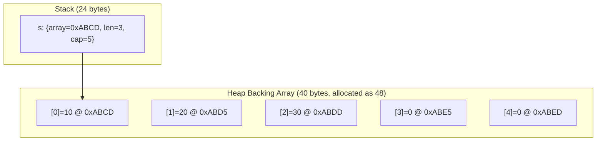
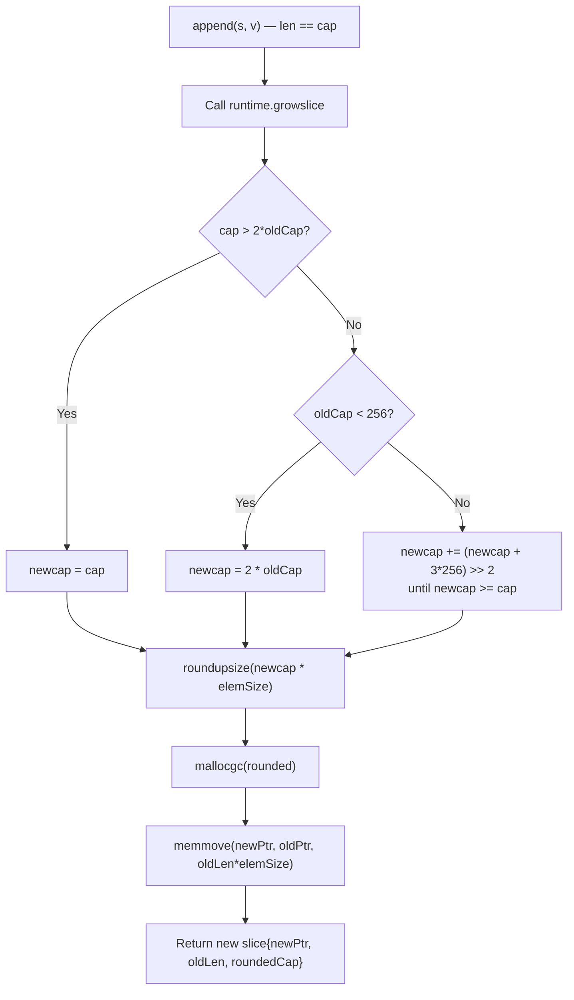
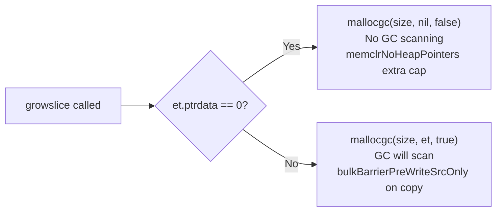

# Slices — Professional Level (Internals)

## Table of Contents
1. Introduction — Under the Hood
2. How Slices Work Internally
3. Runtime Deep Dive
4. Compiler Perspective
5. Memory Layout
6. OS/Syscall Level
7. Source Code Walkthrough
8. Assembly Output Analysis
9. Performance Internals
10. Metrics & Analytics (Runtime)
11. Edge Cases at the Lowest Level
12. Test
13. Tricky Questions
14. Summary
15. Further Reading
16. Diagrams & Visual Aids

---

## Introduction — Under the Hood

A Go slice at the machine level is a 24-byte value: three 8-byte words containing a pointer, a length, and a capacity. Everything that makes slices "dynamic" is implemented in the runtime function `growslice` and the compiler-inserted calls to it. Understanding slices at the professional level means reading the actual runtime source code, understanding the assembly generated for slice operations, and knowing how the garbage collector interacts with slice memory.

---

## How Slices Work Internally

### The Runtime Slice Structure

```go
// src/runtime/slice.go
type slice struct {
    array unsafe.Pointer
    len   int
    cap   int
}
```

This is the canonical runtime representation. The `reflect.SliceHeader` struct mirrors this:
```go
// src/reflect/value.go
type SliceHeader struct {
    Data uintptr
    Len  int
    Cap  int
}
```

### Slice Creation Paths

**Literal `[]int{1, 2, 3}`:**
1. Compiler allocates `[3]int{1, 2, 3}` as a static read-only value in the binary's `.rodata` section (for small literals with constant values)
2. If the slice may be modified, compiler allocates on the heap via `runtime.newobject`
3. Slice header is created: `{Data: &array, Len: 3, Cap: 3}`

**`make([]int, len, cap)`:**
1. Calls `runtime.makeslice(et *_type, len, cap int) unsafe.Pointer`
2. `makeslice` validates `len <= cap` and that `len` and `cap` are non-negative
3. Calls `mallocgc(et.size * uintptr(cap), et, ...)` to allocate the backing array
4. Returns pointer to allocated memory; compiler creates the slice header

---

## Runtime Deep Dive

### makeslice

```go
// src/runtime/slice.go (simplified)
func makeslice(et *_type, len, cap int) unsafe.Pointer {
    mem, overflow := math.MulUintptr(et.size, uintptr(cap))
    if overflow || mem > maxAlloc || len < 0 || len > cap {
        // Compute what went wrong for a better panic message
        mem, overflow := math.MulUintptr(et.size, uintptr(len))
        if overflow || mem > maxAlloc || len < 0 {
            panicmakeslicelen()
        }
        panicmakeslicecap()
    }
    return mallocgc(mem, et, true)
}
```

Key validation:
- `len` must be >= 0 and <= `cap`
- `cap` must not overflow when multiplied by element size
- Total size must not exceed `maxAlloc` (max addressable memory)

### growslice — Full Analysis

```go
// src/runtime/slice.go (Go 1.21)
func growslice(et *_type, old slice, cap int) slice {
    // ... safety checks ...

    newcap := old.cap
    doublecap := newcap + newcap
    if cap > doublecap {
        newcap = cap
    } else {
        const threshold = 256
        if old.cap < threshold {
            newcap = doublecap
        } else {
            for 0 < newcap && newcap < cap {
                newcap += (newcap + 3*threshold) >> 2
            }
            if newcap <= 0 {
                newcap = cap
            }
        }
    }

    // Compute memory needed, round to size class
    var overflow bool
    var lenmem, newlenmem, capmem uintptr
    switch {
    case et.size == 1:
        lenmem = uintptr(old.len)
        newlenmem = uintptr(cap)
        capmem = roundupsize(uintptr(newcap))
        overflow = uintptr(newcap) > maxAlloc
        newcap = int(capmem)
    case et.size == goarch.PtrSize:
        lenmem = uintptr(old.len) * goarch.PtrSize
        newlenmem = uintptr(cap) * goarch.PtrSize
        capmem = roundupsize(uintptr(newcap) * goarch.PtrSize)
        overflow = uintptr(newcap) > maxAlloc/goarch.PtrSize
        newcap = int(capmem / goarch.PtrSize)
    // ... other cases ...
    }

    // Allocate new backing array
    var p unsafe.Pointer
    if et.ptrdata == 0 {
        p = mallocgc(capmem, nil, false)  // no GC scanning needed
        memclrNoHeapPointers(add(p, newlenmem), capmem-newlenmem)
    } else {
        p = mallocgc(capmem, et, true)   // GC must scan for pointers
        // zero out extra capacity
        if lenmem > 0 && writeBarrierEnabled {
            bulkBarrierPreWriteSrcOnly(...)
        }
    }

    // Copy old data to new backing array
    memmove(p, old.array, lenmem)

    return slice{p, old.len, newcap}
}
```

### The roundupsize Function

`growslice` calls `roundupsize` to align the requested capacity to Go's memory size classes. This is why `cap(s)` after `append` may be larger than computed:

```go
// Size classes (simplified): 8, 16, 24, 32, 48, 64, 80, 96, 112, 128, ...
// For example, requesting 40 bytes → returns 48 bytes (next size class)
// This means [5]int (40 bytes) in a growing slice gets 48 bytes → cap=6 for int64
```

---

## Compiler Perspective

### How slice[i] Compiles

```go
s[i]  // compiles to roughly:
// 1. Load slice header: ptr, len, cap
// 2. Bounds check: if uint(i) >= uint(len) { runtime.panicIndex(i, len) }
// 3. Calculate address: ptr + i * sizeof(T)
// 4. Load value from address
```

### How append Compiles

```go
s = append(s, v)  // compiles to roughly:
// 1. Check if len(s) < cap(s)
// 2a. If yes: s.array[s.len] = v; s.len++; (store new header to s)
// 2b. If no: call runtime.growslice(T, s, len(s)+1) → new slice; new_slice.array[new_slice.len-1] = v; s = new_slice
```

The compiler generates optimized code paths for the common case (cap > len) to avoid a function call overhead.

### SSA for slice operations

View the SSA: `GOSSAFUNC=myFunc go build main.go`

For `s[2]` on `[]int`:
```
v1 = Load <*[]int> s
v2 = SlicePtr v1      // extract pointer
v3 = SliceLen v1      // extract length
v4 = IsInBounds <bool> (Const64 [2]) v3   // bounds check: 2 < len
If v4 → bounds_ok, bounds_fail
bounds_ok:
v5 = PtrIndex v2 (Const64 [2])  // compute &s[2]
v6 = Load <int> v5               // load s[2]
```

---

## Memory Layout

### Slice on Stack

```
Function stack frame:
┌─────────────────────┐ ← frame top
│ local variables     │
├─────────────────────┤
│ s.cap  = 5          │ offset -8
│ s.len  = 3          │ offset -16
│ s.array = 0x...     │ offset -24 (pointer to heap or other stack)
├─────────────────────┤ ← SP (stack pointer)
```

The slice header is 24 bytes on the stack. The backing array (if not stack-allocated) is on the heap at the address stored in `s.array`.

### Slice Backing Array on Heap

```
Heap object (from mallocgc):
┌──────────┬──────────┬──────────┬──────────┬──────────┐
│ element 0│ element 1│ element 2│ element 3│ element 4│
│  8 bytes │  8 bytes │  8 bytes │  8 bytes │  8 bytes │
└──────────┴──────────┴──────────┴──────────┴──────────┘
↑
s.array points here

For []int{1,2,3,4,5}: 5 * 8 = 40 bytes, rounded to 48 bytes (size class)
So actual allocation = 48 bytes, cap = 6 (48/8)
```

---

## OS/Syscall Level

### Slices and Read/Write Syscalls

```go
// net.Conn.Read uses a []byte — this maps directly to:
// read(fd, &s.array, s.len)
// The OS kernel writes directly into the slice's backing array
// Zero-copy from kernel space to the slice

func readIntoSlice(conn net.Conn) ([]byte, error) {
    buf := make([]byte, 4096)  // heap allocated
    n, err := conn.Read(buf)   // syscall: read(fd, buf.Data, buf.Len)
    return buf[:n], err        // sub-slice of returned bytes
}
```

### io.Reader Interface and Slices

```go
// io.Reader is defined as:
type Reader interface {
    Read(p []byte) (n int, err error)
}
// The parameter p []byte is a 24-byte header passed by value
// The backing array is SHARED between caller and callee
// The callee writes into p's backing array — this is how zero-copy I/O works
```

### mmap with Slices

```go
import "syscall"

func mmapFile(f *os.File, size int) ([]byte, error) {
    data, err := syscall.Mmap(
        int(f.Fd()), 0, size,
        syscall.PROT_READ|syscall.PROT_WRITE,
        syscall.MAP_SHARED,
    )
    // data is a []byte whose backing array is memory-mapped
    // Writes to data go directly to the file — no system call needed
    return data, err
}
```

---

## Source Code Walkthrough

### copy() Implementation

```go
// src/runtime/slice.go
func slicecopy(toPtr unsafe.Pointer, toLen int, fromPtr unsafe.Pointer, fromLen int, width uintptr) int {
    if fromLen == 0 || toLen == 0 {
        return 0
    }
    n := fromLen
    if toLen < n {
        n = toLen
    }
    if width == 0 {
        return n
    }
    // ... race detection code ...
    size := uintptr(n) * width
    if size == 1 {
        *(*byte)(toPtr) = *(*byte)(fromPtr)  // fast path for single byte
    } else {
        memmove(toPtr, fromPtr, size)  // handles overlapping correctly
    }
    return n
}
```

Key: `copy` uses `memmove` (not `memcopy`) because the source and destination may overlap (when both slices share a backing array).

### append() for Multiple Elements

When `append(s, other...)` is called:
1. Compiler computes required capacity: `len(s) + len(other)`
2. If `cap(s) >= len(s) + len(other)`: calls `memmove` to copy `other` into `s[len(s):]`
3. If not: calls `growslice` with `cap = len(s) + len(other)`, then `memmove`

---

## Assembly Output Analysis

```bash
go tool compile -S main.go | grep -A 20 "func sum"
```

For:
```go
func sumSlice(s []int) int {
    total := 0
    for _, v := range s {
        total += v
    }
    return total
}
```

Generated AMD64 assembly (simplified):
```asm
TEXT "".sumSlice(SB), NOSPLIT|ABIInternal, $0-32
    // s passed as: AX=ptr, BX=len, CX=cap (register ABI, Go 1.17+)
    XORL SI, SI         // total = 0
    XORL DI, DI         // i = 0
    JMP  check
loop:
    MOVQ (AX)(DI*8), R8 // v = s[i]  (ptr + i*8)
    ADDQ R8, SI         // total += v
    INCQ DI             // i++
check:
    CMPQ DI, BX         // i < len(s)?
    JLT  loop
    MOVQ SI, AX         // return total
    RET
```

Note: in the range loop, bounds checking is eliminated because the compiler knows `i` stays within `[0, len(s))`.

---

## Performance Internals

### Memory Size Classes and Actual Capacity

Go's allocator uses size classes. Requesting N bytes gives you the next size class up:

```
Requested → Actual:
1 → 8 bytes (cap = 8 for []byte, 1 for []int64)
17 → 24 bytes
33 → 48 bytes
65 → 96 bytes
```

This means after certain `append` operations, `cap(s)` may be larger than `2*len(s)` due to size class rounding.

### Write Barrier Cost

When the element type contains pointers, `growslice` must use write barriers during the copy. Write barriers tell the GC about pointer updates to maintain tri-color invariant:

```go
// For []int — no write barrier (no pointers)
// append is just: memmove + update len

// For []*User — write barrier on every element copy
// append must call bulkBarrierPreWriteSrcOnly for each pointer
// This adds ~5-20ns per element for pointer types
```

### Benchmarking append for Pointer vs Value Types

```go
func BenchmarkAppendInts(b *testing.B) {
    b.ReportAllocs()
    for n := 0; n < b.N; n++ {
        s := make([]int, 0, 1000)
        for i := 0; i < 1000; i++ { s = append(s, i) }
    }
}

func BenchmarkAppendIntPtrs(b *testing.B) {
    b.ReportAllocs()
    vals := make([]int, 1000)
    b.ResetTimer()
    for n := 0; n < b.N; n++ {
        s := make([]*int, 0, 1000)
        for i := range vals { s = append(s, &vals[i]) }
    }
}
// AppendIntPtrs is typically 2-5x slower due to write barriers
```

---

## Metrics & Analytics (Runtime)

### Tracking Slice Allocations

```go
package main

import (
    "fmt"
    "runtime"
)

func measureSliceAlloc() {
    var before, after runtime.MemStats
    runtime.ReadMemStats(&before)

    s := make([]byte, 0, 1024*1024) // 1MB
    s = append(s, make([]byte, 512*1024)...) // 512KB
    _ = s

    runtime.ReadMemStats(&after)
    fmt.Printf("HeapAlloc delta: %d bytes\n", after.HeapAlloc-before.HeapAlloc)
    fmt.Printf("Mallocs delta:   %d\n", after.Mallocs-before.Mallocs)
}
```

### Using pprof for Slice Allocation Hotspots

```go
import (
    "os"
    "runtime/pprof"
)

func main() {
    f, _ := os.Create("mem.prof")
    defer pprof.WriteHeapProfile(f)
    defer f.Close()

    // Your code here
    runMyWorkload()
}
// Then: go tool pprof -alloc_space mem.prof
// Look for runtime.makeslice and runtime.growslice in the profile
```

---

## Edge Cases at the Lowest Level

### 1. Slice of Zero-Size Elements

```go
s := make([]struct{}, 1000000)
// All 1M elements point to runtime.zerobase — no actual allocation for data
// s.array = &runtime.zerobase (a special symbol)
// Only the slice header is allocated (24 bytes)
fmt.Println(cap(s)) // 1000000
fmt.Println(len(s)) // 1000000
```

### 2. Integer Overflow in makeslice

```go
// Attempting to create a slice too large to fit in memory:
s := make([]int, 1<<62) // panics: runtime: out of memory
// makeslice checks: 8 * (1<<62) overflows uintptr → panicmakeslicecap()
```

### 3. Write Barrier and GC Interaction

```go
// When growing a []*T slice, every pointer in the old array
// must be re-registered with the GC write barrier.
// This is why growing pointer-containing slices is more expensive
// than growing value slices.
```

### 4. Slice of Interfaces

```go
// []interface{} is a slice where each element is 2 words:
// (type pointer, data pointer)
// For values fitting in one word (like int), data is stored inline.
// For larger values, data is allocated on the heap.
// This means []interface{} has 2x pointer density of []*T

s := []interface{}{1, "hello", struct{}{}}
// GC must scan 2 pointers per element
```

### 5. reflect.SliceHeader Mutation

```go
// Advanced: create a slice from raw pointer using reflect
import ("reflect"; "unsafe")

data := [5]int{1, 2, 3, 4, 5}
var s []int
sh := (*reflect.SliceHeader)(unsafe.Pointer(&s))
sh.Data = uintptr(unsafe.Pointer(&data[0]))
sh.Len = 5
sh.Cap = 5
fmt.Println(s) // [1 2 3 4 5]
// WARNING: GC does not track this pointer! Use unsafe.Slice instead (Go 1.17+)

// Preferred (Go 1.17+):
s2 := unsafe.Slice(&data[0], 5) // GC-safe
```

---

## Test

**1. What function does the runtime call when `append` needs more capacity?**
- A) `runtime.reallocSlice`
- B) `runtime.growslice`
- C) `runtime.extendSlice`
- D) `runtime.appendSlice`

**Answer: B** — `runtime.growslice` is the internal function called by append when capacity must increase.

---

**2. Why is `copy` implemented with `memmove` rather than `memcopy`?**
- A) `memmove` is faster
- B) `copy` between two slices sharing a backing array can have overlapping source and destination
- C) `memcopy` is not available in Go
- D) `memmove` handles different element sizes

**Answer: B** — Since two slices can share a backing array, `copy(s[1:], s[:])` has overlapping regions. `memmove` correctly handles overlapping memory regions; `memcopy` does not.

---

**3. What is `roundupsize` used for in `growslice`?**
- A) Ensuring the capacity is a power of 2
- B) Aligning the requested capacity to the next memory allocator size class
- C) Preventing integer overflow
- D) Satisfying alignment requirements for SIMD

**Answer: B** — `roundupsize` returns the next memory size class that fits the requested bytes. This means actual capacity after growth may exceed the computed target.

---

**4. When does `growslice` use write barriers during the copy?**
- A) Always
- B) Never — the GC handles this separately
- C) When the element type contains pointer fields (`et.ptrdata > 0`)
- D) Only for slices larger than 1KB

**Answer: C** — When `et.ptrdata > 0`, the element type contains pointers. The GC's tri-color invariant requires write barriers when copying pointers to new locations.

---

## Tricky Questions

**Q: What is `runtime.zerobase` and how does it relate to zero-size element slices?**
A: `zerobase` is a special runtime symbol at a fixed address used as the backing "array" for zero-size types. `make([]struct{}, N)` allocates no actual bytes for elements — all elements point to `zerobase`. Only the slice header (24 bytes) is allocated. This allows N-length slices of zero-size elements to exist without consuming proportional memory.

**Q: How does the Go compiler handle `append` to avoid a function call when cap > len?**
A: The compiler generates an inline check: if `s.len < s.cap`, it performs the append inline (write the value, increment len, update the slice variable). Only when `s.len >= s.cap` does it call `runtime.growslice`. This avoids function call overhead for the common case.

**Q: Why does `unsafe.Slice` (Go 1.17+) replace `reflect.SliceHeader` manipulation?**
A: `reflect.SliceHeader` stores `Data` as `uintptr`, which is not recognized by the GC as a pointer. The GC might move the object and invalidate the `uintptr`. `unsafe.Slice(&ptr, n)` keeps `ptr` as an `unsafe.Pointer`, which IS recognized by the GC, making it safe during GC cycles.

---

## Summary

At the professional level, slices are composed of three components: a 24-byte header on the stack, a backing array on the heap (via `mallocgc`), and the runtime's `growslice` function that handles reallocation. The compiler generates bounds checks for every index operation and eliminates them when it can prove safety. The `copy` built-in uses `memmove` to handle overlapping slices. Write barriers are inserted for pointer-containing element types during `growslice` to maintain GC invariants. The `roundupsize` function causes actual capacity to exceed computed targets by rounding to memory size class boundaries. Zero-size element slices use `zerobase` as their backing pointer — no actual element storage is needed.

---

## Further Reading

- [src/runtime/slice.go](https://cs.opensource.google/go/go/+/main:src/runtime/slice.go)
- [src/runtime/malloc.go](https://cs.opensource.google/go/go/+/main:src/runtime/malloc.go)
- [Go SSA documentation](https://cs.opensource.google/go/go/+/main:src/cmd/compile/internal/ssa/)
- [Go write barriers](https://go.dev/src/runtime/mbarrier.go)
- [unsafe.Slice](https://pkg.go.dev/unsafe#Slice)

---

## Diagrams & Visual Aids

### Slice Memory Structure



### growslice Decision Flow



### Write Barrier Decision


