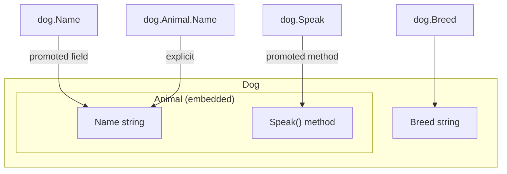

# Structs in Go — Middle Level

## Overview

At the middle level, understanding structs means going beyond basic field access to grasp memory layout, method receiver semantics, interface satisfaction, embedding mechanics, and design patterns. This file covers the "why" behind Go's struct design choices and how to use structs effectively in production code.

---

## 1. Why Go Uses Structs Instead of Classes

Go deliberately omits classes, inheritance hierarchies, and constructors. The reasons:

1. **Simplicity:** A struct is just data. Behavior is added via methods, separately. You can always read a struct type and understand its data layout without understanding a class hierarchy.

2. **No hidden magic:** No constructors that run automatically, no destructors, no virtual dispatch (unless via interfaces). What you see is what happens.

3. **Composition over inheritance:** Instead of `Dog extends Animal`, Go uses embedding: `type Dog struct { Animal }`. This is explicit and avoids the fragile base class problem.

4. **Value semantics by default:** Struct assignment copies, not references. This reduces aliasing bugs and makes code easier to reason about.

```go
// In Java/C++: two variables might refer to the same object
// Person a = new Person(); Person b = a; b.name = "Bob"; // changes a.name too!

// In Go: struct assignment is always a copy
a := Person{Name: "Alice"}
b := a
b.Name = "Bob"
fmt.Println(a.Name) // "Alice" — unchanged
```

---

## 2. Memory Layout Deep Dive

Go lays out struct fields sequentially in memory, with padding for alignment:

```go
type Padded struct {
    A bool    // 1 byte + 7 bytes padding (next field needs 8-byte alignment)
    B int64   // 8 bytes
    C bool    // 1 byte + 7 bytes padding
    // Total: 24 bytes
}

type Packed struct {
    B int64   // 8 bytes
    A bool    // 1 byte
    C bool    // 1 byte + 6 bytes padding (to align to 8 bytes for next field or end)
    // Total: 16 bytes
}
```

Verify with `unsafe`:

```go
import (
    "fmt"
    "unsafe"
)

fmt.Println(unsafe.Sizeof(Padded{})) // 24
fmt.Println(unsafe.Sizeof(Packed{})) // 16
fmt.Println(unsafe.Alignof(Padded{}.B)) // 8
fmt.Println(unsafe.Offsetof(Padded{}.C)) // 16
```

**Rule for minimal size:** Order fields from largest to smallest alignment requirement:
1. `int64`, `float64`, pointers (8 bytes)
2. `int32`, `float32` (4 bytes)
3. `int16` (2 bytes)
4. `bool`, `byte`, `int8` (1 byte)

---

## 3. Value Receiver vs Pointer Receiver: Deep Analysis

The choice of receiver type has semantic and performance implications:

```go
type BigStruct struct {
    Data [1024]byte
}

// Value receiver: copies 1024 bytes on each call — expensive!
func (b BigStruct) ProcessSlow() { ... }

// Pointer receiver: passes 8-byte pointer — fast
func (b *BigStruct) ProcessFast() { ... }
```

**Semantic implications:**

```go
type Counter struct{ n int }

// Value receiver — modifies a COPY
func (c Counter) IncrementWrong() {
    c.n++ // only modifies the local copy
}

// Pointer receiver — modifies the original
func (c *Counter) IncrementRight() {
    c.n++
}

c := Counter{n: 0}
c.IncrementWrong()
fmt.Println(c.n) // 0 — unchanged

c.IncrementRight()
fmt.Println(c.n) // 1 — changed
```

**Consistency rule:** If any method of a type uses a pointer receiver, all methods should use pointer receivers. Mixed receiver types cause confusion about whether a value or pointer is needed to satisfy an interface.

---

## 4. Interface Satisfaction and Struct Methods

A struct satisfies an interface if it has all the required methods. The receiver type matters:

```go
type Greeter interface {
    Greet() string
}

type English struct{ Name string }
type French struct{ Name string }

func (e English) Greet() string { return "Hello, " + e.Name }
func (f *French) Greet() string { return "Bonjour, " + f.Name } // pointer receiver!

var g Greeter

g = English{Name: "Alice"}     // OK — value satisfies Greeter
g = &English{Name: "Alice"}    // also OK — pointer also satisfies

g = &French{Name: "Pierre"}    // OK — *French has Greet()
// g = French{Name: "Pierre"}  // COMPILE ERROR: French value does not have Greet()
// (only *French has it because of pointer receiver)
```

**Key rule:** A value of type `T` satisfies an interface only if the interface methods are defined with value receivers. A pointer `*T` satisfies the interface whether the methods use value or pointer receivers.

---

## 5. Embedding: Promoted Fields and Methods

Embedding promotes the embedded type's fields and methods to the outer struct:

```go
type Logger struct {
    Prefix string
}

func (l Logger) Log(msg string) {
    fmt.Printf("[%s] %s\n", l.Prefix, msg)
}

type Service struct {
    Logger           // embedded — no field name
    Name string
}

s := Service{
    Logger: Logger{Prefix: "SERVICE"},
    Name:   "Auth",
}

s.Log("starting up")       // promoted — same as s.Logger.Log("starting up")
fmt.Println(s.Prefix)      // promoted field — same as s.Logger.Prefix
fmt.Println(s.Logger.Prefix) // explicit access also works
```

**Method override:** The outer struct can override an embedded method:

```go
func (s Service) Log(msg string) {
    // Custom behavior first
    fmt.Printf("[%s/%s] %s\n", s.Prefix, s.Name, msg)
    // Optionally call embedded method:
    // s.Logger.Log(msg)
}

s.Log("overridden") // calls Service.Log, not Logger.Log
s.Logger.Log("explicit") // calls Logger.Log directly
```

---

## 6. The Difference Between Embedding and Field

```go
// EMBEDDING: promoted fields and methods
type A struct {
    Value int
}
func (a A) Hello() { fmt.Println("Hello from A") }

type B struct {
    A // embedded
}

b := B{A: A{Value: 42}}
fmt.Println(b.Value)  // 42 — promoted
b.Hello()              // promoted method

// FIELD: explicit access required
type C struct {
    A A // named field
}

c := C{A: A{Value: 42}}
fmt.Println(c.A.Value) // must use c.A.Value
c.A.Hello()            // must use c.A.Hello()
```

Embedding = promotion + implicit access. Field = explicit access.

---

## 7. Struct Tagging and Reflection

Struct tags are string literals attached to fields, read at runtime via reflection:

```go
import (
    "encoding/json"
    "fmt"
    "reflect"
)

type Event struct {
    ID        int    `json:"id" db:"event_id" validate:"required"`
    Name      string `json:"name" db:"event_name" validate:"required,min=3"`
    Timestamp int64  `json:"timestamp,omitempty" db:"created_at"`
}

// Reading tags via reflection:
t := reflect.TypeOf(Event{})
for i := 0; i < t.NumField(); i++ {
    field := t.Field(i)
    jsonTag := field.Tag.Get("json")
    dbTag := field.Tag.Get("db")
    fmt.Printf("Field: %-10s json:%-20s db:%s\n", field.Name, jsonTag, dbTag)
}
```

Tags are purely metadata — they don't affect the struct's behavior unless you write code that reads them (or use a package that does).

---

## 8. Encoding/Decoding with JSON Tags

The most common use of struct tags is with `encoding/json`:

```go
type APIResponse struct {
    Success bool        `json:"success"`
    Data    interface{} `json:"data,omitempty"`
    Error   string      `json:"error,omitempty"`
    Code    int         `json:"code"`
}

// Marshal (struct → JSON)
resp := APIResponse{Success: true, Data: map[string]string{"key": "val"}}
jsonBytes, _ := json.Marshal(resp)
fmt.Println(string(jsonBytes))
// {"success":true,"data":{"key":"val"},"code":0}
// Note: error is omitted (empty + omitempty), data is present

// Unmarshal (JSON → struct)
input := `{"success":false,"error":"not found","code":404}`
var parsed APIResponse
json.Unmarshal([]byte(input), &parsed)
fmt.Println(parsed.Success) // false
fmt.Println(parsed.Error)   // not found
fmt.Println(parsed.Code)    // 404
```

---

## 9. Struct as Map Key

Structs whose fields are all comparable can be used as map keys:

```go
type Point struct{ X, Y int }

// Using struct as map key
visited := map[Point]bool{}
visited[Point{0, 0}] = true
visited[Point{1, 2}] = true

fmt.Println(visited[Point{0, 0}]) // true
fmt.Println(visited[Point{5, 5}]) // false

// Practical example: 2D grid coordinates
type Cell struct{ Row, Col int }
grid := map[Cell]string{
    {0, 0}: "start",
    {3, 3}: "end",
}
fmt.Println(grid[Cell{0, 0}]) // start
```

This is a powerful pattern — using a struct as a composite key avoids string concatenation (`"0,0"`) and is faster due to value equality.

---

## 10. Functional Options Pattern

A common Go API design pattern that uses struct initialization:

```go
type Server struct {
    host    string
    port    int
    timeout int
    maxConn int
}

type Option func(*Server)

func WithHost(host string) Option {
    return func(s *Server) { s.host = host }
}

func WithPort(port int) Option {
    return func(s *Server) { s.port = port }
}

func WithTimeout(t int) Option {
    return func(s *Server) { s.timeout = t }
}

func NewServer(opts ...Option) *Server {
    s := &Server{
        host:    "localhost", // defaults
        port:    8080,
        timeout: 30,
        maxConn: 100,
    }
    for _, opt := range opts {
        opt(s)
    }
    return s
}

// Usage: callers only specify what they need
s1 := NewServer()
s2 := NewServer(WithPort(9090))
s3 := NewServer(WithHost("0.0.0.0"), WithPort(443), WithTimeout(60))
```

This pattern allows API evolution (add new options without breaking callers) and readable call sites.

---

## 11. Builder Pattern

Another approach for constructing complex structs:

```go
type Query struct {
    table   string
    where   []string
    limit   int
    orderBy string
}

type QueryBuilder struct {
    q Query
}

func NewQuery(table string) *QueryBuilder {
    return &QueryBuilder{q: Query{table: table, limit: -1}}
}

func (b *QueryBuilder) Where(condition string) *QueryBuilder {
    b.q.where = append(b.q.where, condition)
    return b // enables chaining
}

func (b *QueryBuilder) Limit(n int) *QueryBuilder {
    b.q.limit = n
    return b
}

func (b *QueryBuilder) OrderBy(field string) *QueryBuilder {
    b.q.orderBy = field
    return b
}

func (b *QueryBuilder) Build() Query {
    return b.q
}

// Usage:
q := NewQuery("users").
    Where("age > 18").
    Where("active = true").
    Limit(10).
    OrderBy("name").
    Build()
```

---

## 12. Copying Structs: Shallow vs Deep

Struct assignment is a **shallow copy**: value fields are fully copied, but pointer and slice fields share underlying data:

```go
type Node struct {
    Value    int
    Children []*Node
    Tags     []string
}

a := Node{
    Value: 1,
    Tags:  []string{"go", "struct"},
}
b := a // shallow copy

b.Value = 99    // independent
b.Tags[0] = "c" // SHARED: modifies a.Tags[0] too!

fmt.Println(a.Value)   // 1 — independent (int is copied)
fmt.Println(a.Tags[0]) // "c" — CHANGED (slice header copied, but data shared)
```

For a deep copy, you must manually copy pointer/slice fields:

```go
func deepCopy(n Node) Node {
    copy := n
    copy.Tags = make([]string, len(n.Tags))
    copy(copy.Tags, n.Tags)
    return copy
}
```

---

## 13. Nil Pointer to Struct

You can call methods on a nil pointer to a struct — if the method handles nil correctly:

```go
type Tree struct {
    Value int
    Left  *Tree
    Right *Tree
}

func (t *Tree) Sum() int {
    if t == nil {
        return 0
    }
    return t.Value + t.Left.Sum() + t.Right.Sum()
}

var root *Tree // nil pointer
fmt.Println(root.Sum()) // 0 — works! nil is handled

root = &Tree{
    Value: 1,
    Left:  &Tree{Value: 2},
    Right: &Tree{Value: 3},
}
fmt.Println(root.Sum()) // 6
```

This is a common pattern for recursive tree structures — nil represents an empty subtree.

---

## 14. Struct Alignment and Padding Rules

Alignment requirements for common types on 64-bit systems:

| Type | Size | Alignment |
|------|------|-----------|
| `bool`, `int8`, `uint8`, `byte` | 1 | 1 |
| `int16`, `uint16` | 2 | 2 |
| `int32`, `uint32`, `float32` | 4 | 4 |
| `int64`, `uint64`, `float64` | 8 | 8 |
| `int`, `uint`, `uintptr`, pointer | 8 | 8 |
| `string` | 16 | 8 |
| `slice` | 24 | 8 |
| `interface` | 16 | 8 |

Padding is inserted so that each field starts at an address that's a multiple of its alignment requirement.

```go
import "unsafe"

type Example struct {
    A byte    // offset 0, size 1
    // 7 bytes padding
    B int64   // offset 8, size 8
    C byte    // offset 16, size 1
    // 3 bytes padding
    D int32   // offset 20, size 4
}
// Total: 24 bytes

fmt.Println(unsafe.Offsetof(Example{}.A)) // 0
fmt.Println(unsafe.Offsetof(Example{}.B)) // 8
fmt.Println(unsafe.Offsetof(Example{}.C)) // 16
fmt.Println(unsafe.Offsetof(Example{}.D)) // 20
fmt.Println(unsafe.Sizeof(Example{}))     // 24
```

---

## 15. Interface Composition and Struct

Structs often implement multiple interfaces:

```go
type Reader interface { Read(p []byte) (int, error) }
type Writer interface { Write(p []byte) (int, error) }
type ReadWriter interface {
    Reader
    Writer
}

type Buffer struct {
    data []byte
    pos  int
}

func (b *Buffer) Read(p []byte) (int, error) {
    n := copy(p, b.data[b.pos:])
    b.pos += n
    return n, nil
}

func (b *Buffer) Write(p []byte) (int, error) {
    b.data = append(b.data, p...)
    return len(p), nil
}

// *Buffer implements Reader, Writer, and ReadWriter
var _ Reader = (*Buffer)(nil)     // compile-time check
var _ Writer = (*Buffer)(nil)     // compile-time check
var _ ReadWriter = (*Buffer)(nil) // compile-time check
```

The `var _ Interface = (*Type)(nil)` pattern is a compile-time assertion that a type implements an interface.

---

## 16. Struct Anti-Patterns

### Anti-pattern 1: Too many fields in one struct

```go
// BAD: God struct
type Everything struct {
    UserID         int
    UserName       string
    UserEmail      string
    OrderID        int
    OrderTotal     float64
    ProductID      int
    ProductName    string
    ShippingAddr   string
    // 20 more fields...
}

// GOOD: Separate concerns
type User    struct { ID int; Name, Email string }
type Order   struct { ID int; UserID int; Total float64 }
type Product struct { ID int; Name string }
```

### Anti-pattern 2: Using public fields for mutable state

```go
// BAD: caller can corrupt internal state
type Cache struct {
    Data map[string]string
    Size int
}
c := Cache{Data: make(map[string]string)}
c.Data["key"] = "val"
c.Size++ // caller must manually sync Size — easy to forget!

// GOOD: encapsulate mutation
type Cache struct {
    data map[string]string
}
func (c *Cache) Set(k, v string) { c.data[k] = v }
func (c *Cache) Get(k string) (string, bool) { v, ok := c.data[k]; return v, ok }
func (c *Cache) Len() int { return len(c.data) }
```

### Anti-pattern 3: Pointer receiver on tiny, immutable structs

```go
type Point struct{ X, Y float64 }

// Unnecessary pointer receiver for a read-only method on a small struct
func (p *Point) Distance(q *Point) float64 { // pointer receiver not needed
    dx, dy := p.X-q.X, p.Y-q.Y
    return math.Sqrt(dx*dx + dy*dy)
}

// Better: value receiver (no mutation, struct is only 16 bytes)
func (p Point) Distance(q Point) float64 {
    dx, dy := p.X-q.X, p.Y-q.Y
    return math.Sqrt(dx*dx + dy*dy)
}
```

---

## 17. Table-Driven Tests with Struct

Go's idiomatic test pattern uses slices of anonymous structs:

```go
func TestAdd(t *testing.T) {
    tests := []struct {
        name     string
        a, b     int
        expected int
    }{
        {"positive", 1, 2, 3},
        {"negative", -1, -2, -3},
        {"zero", 0, 5, 5},
        {"overflow risk", math.MaxInt32, 1, math.MaxInt32 + 1},
    }

    for _, tt := range tests {
        t.Run(tt.name, func(t *testing.T) {
            got := add(tt.a, tt.b)
            if got != tt.expected {
                t.Errorf("add(%d, %d) = %d, want %d", tt.a, tt.b, got, tt.expected)
            }
        })
    }
}
```

---

## 18. Struct Initialization Patterns Comparison

| Pattern | When to use |
|---------|-------------|
| `T{f: v}` | Simple structs, most common |
| `&T{f: v}` | When you need a pointer immediately |
| `var t T` | Zero value is the correct initial state |
| `NewT(args)` | Struct has complex initialization or validation |
| `T{opt1, opt2}` | Functional options pattern |
| Builder | Complex structs with many optional fields |

---

## 19. Generics with Structs (Go 1.18+)

Structs can be parameterized with type parameters:

```go
type Pair[T, U any] struct {
    First  T
    Second U
}

p := Pair[string, int]{First: "age", Second: 30}
fmt.Println(p.First, p.Second) // age 30

// Generic stack
type Stack[T any] struct {
    items []T
}

func (s *Stack[T]) Push(v T) { s.items = append(s.items, v) }

func (s *Stack[T]) Pop() (T, bool) {
    if len(s.items) == 0 {
        var zero T
        return zero, false
    }
    n := len(s.items) - 1
    v := s.items[n]
    s.items = s.items[:n]
    return v, true
}

stack := &Stack[int]{}
stack.Push(1)
stack.Push(2)
v, _ := stack.Pop()
fmt.Println(v) // 2
```

---

## 20. Struct Comparison with `reflect.DeepEqual`

When structs contain non-comparable fields:

```go
import "reflect"

type Record struct {
    ID    int
    Tags  []string
    Meta  map[string]int
}

r1 := Record{ID: 1, Tags: []string{"a", "b"}, Meta: map[string]int{"x": 1}}
r2 := Record{ID: 1, Tags: []string{"a", "b"}, Meta: map[string]int{"x": 1}}

// r1 == r2 // compile error: slice/map fields not comparable

fmt.Println(reflect.DeepEqual(r1, r2)) // true — compares recursively
```

`reflect.DeepEqual` is fine for tests but is slow (~100× slower than `==`) — don't use in hot paths.

---

## 21. Mermaid Diagram: Embedding Promotion



---

## 22. Practice Questions

1. How does Go's struct memory layout differ between `struct{A int32; B int64}` and `struct{B int64; A int32}`?
2. Why does `func (s Service) Log()` have higher precedence than `func (l Logger) Log()` when both exist?
3. When does a value `T` satisfy an interface that has a pointer receiver method on `*T`?
4. What is the difference between `b := a` and a deep copy for a struct containing a `[]string` field?
5. How do you perform a compile-time check that a struct implements an interface?
6. When should you use the functional options pattern vs. a plain options struct?
7. What is the maximum size a struct can have before you should switch to passing by pointer?
