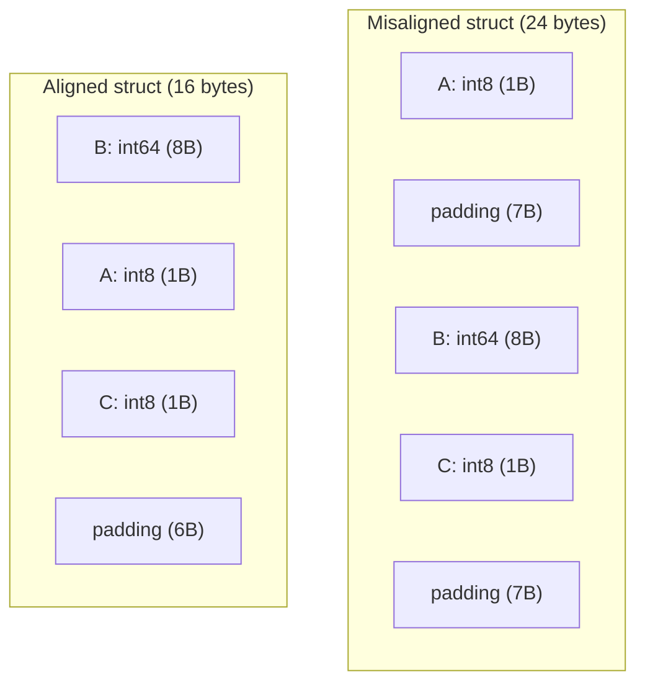

# Structs — Senior Level

## 1. Introduction

At the senior level, structs are examined through system design, memory optimization, interface architecture, and production failure analysis. The questions shift from "how do I use structs?" to "what architectural decisions does this struct design encode?" and "what failure modes emerge at scale?"

---

## 2. Language Design Philosophy

Go structs embody the principle of **composition over inheritance**. By providing embedding (not inheritance), Go forces developers to think in terms of capabilities (interfaces) and data ownership rather than type hierarchies. This leads to:
- Simpler dependency graphs
- Easier testing (interfaces are mocked without frameworks)
- Better encapsulation at the package level rather than class level

The decision to make structs value types by default is deliberate: it makes copying explicit, prevents accidental aliasing, and fits Go's concurrency model where shared state should be minimized.

---

## 3. Memory Layout Deep Dive

### Alignment rules on 64-bit systems

```go
// Every field is aligned to its own size (up to 8 bytes)
// Struct size is padded to a multiple of the largest alignment

type Misaligned struct {
    A int8    // 1 byte, offset 0
              // 7 bytes padding
    B int64   // 8 bytes, offset 8
    C int8    // 1 byte, offset 16
              // 7 bytes padding
}
// Total: 24 bytes — 14 bytes wasted!

type Aligned struct {
    B int64   // 8 bytes, offset 0
    A int8    // 1 byte, offset 8
    C int8    // 1 byte, offset 9
              // 6 bytes padding to align to 8
}
// Total: 16 bytes
```

### Mermaid: struct memory layout comparison



### Measuring layouts

```go
import "unsafe"

type T struct {
    A bool    // offset 0, size 1
    B int32   // offset 4, size 4 (aligned to 4)
    C int64   // offset 8, size 8
    D bool    // offset 16, size 1
}
// Total: 24 bytes

fmt.Println(unsafe.Sizeof(T{}))         // 24
fmt.Println(unsafe.Offsetof(T{}.A))     // 0
fmt.Println(unsafe.Offsetof(T{}.B))     // 4
fmt.Println(unsafe.Offsetof(T{}.C))     // 8
fmt.Println(unsafe.Offsetof(T{}.D))     // 16
```

### Empty struct

```go
// Empty struct: zero size!
type Signal struct{}

// Uses:
set  := map[string]struct{}{"a": {}, "b": {}}
done := make(chan struct{})
close(done) // broadcast signal to all receivers
```

---

## 4. Interface Architecture with Structs

### Interface segregation

```go
// WRONG: one fat interface
type Storage interface {
    Read(key string) ([]byte, error)
    Write(key string, val []byte) error
    Backup() error
    Restore() error
}

// RIGHT: small focused interfaces
type Reader      interface { Read(key string) ([]byte, error) }
type Writer      interface { Write(key string, val []byte) error; Delete(key string) error }
type Lister      interface { List(prefix string) ([]string, error) }
type BackupAgent interface { Backup() error; Restore() error }

type ReadWriter interface {
    Reader
    Writer
}

// Compile-time checks
var (
    _ Reader = (*FileStorage)(nil)
    _ Writer = (*FileStorage)(nil)
    _ Lister = (*FileStorage)(nil)
)
```

---

## 5. Embedding at Scale

### The decorator pattern via embedding

```go
type CachingReader struct {
    Reader
    cache map[string][]byte
    mu    sync.RWMutex
}

func (cr *CachingReader) Read(key string) ([]byte, error) {
    cr.mu.RLock()
    if data, ok := cr.cache[key]; ok {
        cr.mu.RUnlock()
        return data, nil
    }
    cr.mu.RUnlock()

    data, err := cr.Reader.Read(key)
    if err != nil {
        return nil, err
    }

    cr.mu.Lock()
    cr.cache[key] = data
    cr.mu.Unlock()
    return data, nil
}
```

### Test doubles via embedding

```go
type EmailService struct{ smtpHost string }
func (e *EmailService) Send(to, subject, body string) error { return nil }

type MockEmailService struct {
    EmailService
    SentMessages []string
}

func (m *MockEmailService) Send(to, subject, body string) error {
    m.SentMessages = append(m.SentMessages, fmt.Sprintf("%s:%s", to, subject))
    return nil
}
```

---

## 6. Struct Concurrency Patterns

### Copy-on-update immutable config

```go
type Config struct {
    Host    string
    Port    int
    Timeout time.Duration
}

type AtomicConfig struct {
    mu  sync.RWMutex
    cfg Config
}

func (ac *AtomicConfig) Get() Config {
    ac.mu.RLock()
    defer ac.mu.RUnlock()
    return ac.cfg // safe copy
}

func (ac *AtomicConfig) Update(fn func(*Config)) {
    ac.mu.Lock()
    defer ac.mu.Unlock()
    fn(&ac.cfg)
}
```

### Sharded struct map

```go
const numShards = 64

type ShardedMap struct {
    shards [numShards]struct {
        sync.RWMutex
        items map[string]interface{}
    }
}

func (sm *ShardedMap) shard(key string) int {
    h := fnv.New32a()
    h.Write([]byte(key))
    return int(h.Sum32()) % numShards
}

func (sm *ShardedMap) Get(key string) (interface{}, bool) {
    s := &sm.shards[sm.shard(key)]
    s.RLock()
    defer s.RUnlock()
    v, ok := s.items[key]
    return v, ok
}
```

---

## 7. Postmortems & System Failures

### Postmortem 1: Value copy mutation — lost updates

**Incident:** E-commerce orders silently lost status updates.

```go
// BUGGY
type Order struct{ ID int64; Status string }

func (db *OrderDB) UpdateStatus(id int64, status string) error {
    order := db.orders[id]  // COPY
    order.Status = status   // modifies copy only
    return nil              // original unchanged!
}
```

**Fix:** Store `*Order` in map or explicitly reassign `db.orders[id] = order`.

### Postmortem 2: Struct alignment crash on 32-bit ARM

**Incident:** atomic operations on `int64` field crashed on 32-bit devices.

```go
// BUG: int64 not 8-byte aligned in array elements on 32-bit
type Counter struct {
    label string // 8 bytes (32-bit: ptr4+len4)
    count int64  // offset 8 — aligned on 64-bit but not guaranteed in array
}

// FIX: put int64 first
type Counter struct {
    count int64
    label string
}
// Or use sync/atomic.Int64 (Go 1.19+)
```

### Postmortem 3: Goroutine leak from struct holding channel

**Incident:** Memory grew continuously; thousands of goroutines blocked.

```go
// BUGGY: consumer exits, workers block forever
type Worker struct {
    results chan<- Result
}
func (w *Worker) Process(item Item) {
    w.results <- compute(item) // blocks if consumer is gone!
}

// FIX: use context for cancellation
type Worker struct {
    results chan<- Result
    ctx     context.Context
}
func (w *Worker) Process(item Item) {
    select {
    case w.results <- compute(item):
    case <-w.ctx.Done():
        return
    }
}
```

---

## 8. Performance Optimization

### Struct size regression tests

```go
func TestStructSizes(t *testing.T) {
    maxSizes := map[string]uintptr{
        "User":   64,
        "Order":  96,
        "Config": 32,
    }
    actuals := map[string]uintptr{
        "User":   unsafe.Sizeof(User{}),
        "Order":  unsafe.Sizeof(Order{}),
        "Config": unsafe.Sizeof(Config{}),
    }
    for name, actual := range actuals {
        if max, ok := maxSizes[name]; ok && actual > max {
            t.Errorf("%s: %d bytes exceeds max %d", name, actual, max)
        }
    }
}
```

### Struct pool

```go
var reqPool = sync.Pool{
    New: func() interface{} {
        return &Request{Headers: make(map[string]string, 8)}
    },
}

func handle(conn net.Conn) {
    req := reqPool.Get().(*Request)
    defer func() {
        req.Reset()
        reqPool.Put(req)
    }()
    processRequest(req)
}

func (r *Request) Reset() {
    r.Method = ""
    r.Path = ""
    for k := range r.Headers { delete(r.Headers, k) }
    r.Body = r.Body[:0]
}
```

---

## 9. Generics and Structs (Go 1.18+)

```go
type Stack[T any] struct {
    items []T
}

func (s *Stack[T]) Push(v T)         { s.items = append(s.items, v) }
func (s *Stack[T]) Len() int         { return len(s.items) }
func (s *Stack[T]) Pop() (T, bool) {
    if len(s.items) == 0 {
        var zero T
        return zero, false
    }
    last := s.items[len(s.items)-1]
    s.items = s.items[:len(s.items)-1]
    return last, true
}

type Result[T any] struct {
    Value T
    Err   error
}

func (r Result[T]) Unwrap() T {
    if r.Err != nil { panic(r.Err) }
    return r.Value
}
```

---

## 10. Domain-Driven Design Patterns

### Value Object (comparable, no identity)

```go
type Money struct {
    Amount   int64  // cents — no float for money!
    Currency string
}

func (m Money) Add(other Money) (Money, error) {
    if m.Currency != other.Currency {
        return Money{}, fmt.Errorf("currency mismatch: %s vs %s", m.Currency, other.Currency)
    }
    return Money{Amount: m.Amount + other.Amount, Currency: m.Currency}, nil
}

price1 := Money{Amount: 1000, Currency: "USD"}
price2 := Money{Amount: 1000, Currency: "USD"}
fmt.Println(price1 == price2) // true — same value = same thing
```

### Entity (has identity, mutable)

```go
type UserID int64

type User struct {
    id      UserID
    Name    string
    Email   string
    version int64 // optimistic locking
}

func NewUser(id UserID, name, email string) *User {
    return &User{id: id, Name: name, Email: email, version: 1}
}

func (u *User) ID() UserID { return u.id } // identity is immutable
```

---

## 11. Testing Patterns

```go
func TestMoneyAdd(t *testing.T) {
    tests := []struct {
        name    string
        a, b    Money
        want    Money
        wantErr bool
    }{
        {
            name: "same currency",
            a:    Money{100, "USD"},
            b:    Money{200, "USD"},
            want: Money{300, "USD"},
        },
        {
            name:    "currency mismatch",
            a:       Money{100, "USD"},
            b:       Money{100, "EUR"},
            wantErr: true,
        },
    }
    for _, tt := range tests {
        t.Run(tt.name, func(t *testing.T) {
            got, err := tt.a.Add(tt.b)
            if (err != nil) != tt.wantErr {
                t.Fatalf("error = %v, wantErr %v", err, tt.wantErr)
            }
            if !tt.wantErr && got != tt.want {
                t.Errorf("got %v, want %v", got, tt.want)
            }
        })
    }
}
```

---

## 12. Code Review Checklist

- [ ] Exported fields are documented
- [ ] Single responsibility — struct not doing too much
- [ ] Sensitive fields are unexported
- [ ] Named fields in struct literals
- [ ] Consistent receiver types (all value or all pointer)
- [ ] Structs with maps/slices NOT used as map keys
- [ ] Memory layout optimized (larger fields first)
- [ ] Constructor functions for structs with invariants
- [ ] Compile-time interface checks present
- [ ] Struct pools used in allocation-heavy hot paths

---

## 13. Observability

```go
type TracedRequest struct {
    ctx    context.Context
    span   trace.Span
    method string
    path   string
}

func NewTracedRequest(ctx context.Context, method, path string) *TracedRequest {
    ctx, span := tracer.Start(ctx, method+" "+path)
    return &TracedRequest{ctx: ctx, span: span, method: method, path: path}
}

func (r *TracedRequest) Finish(status int) {
    r.span.SetAttributes(attribute.Int("http.status_code", status))
    r.span.End()
}
```

---

## 14. Senior Interview Questions

**Q: Explain memory layout implication of bool before int64.**
On 64-bit: `bool` (1 byte) is followed by 7 bytes padding to align `int64` to offset 8. Reordering puts `int64` first, reduces struct size by 8 bytes.

**Q: Why is embedding an interface more flexible than embedding a concrete type?**
An embedded interface field can hold any conforming type at runtime — enabling runtime-configurable composition and dependency injection. A concrete type is fixed at compile time.

**Q: When is it unsafe to copy a struct?**
When it contains a mutex, WaitGroup, or any type with internal synchronized state. The copy shares the underlying state, causing data corruption.

---

## 15. Edge Cases

```go
// Empty struct in channel — pure signal, no allocation
done := make(chan struct{})
close(done)
<-done

// Struct as map key — all fields must be comparable
type Point struct{ X, Y int }
grid := map[Point]bool{{0, 0}: true, {1, 2}: true}

// Interface field makes struct NOT comparable at runtime
type Risky struct{ Val interface{} }
m := map[Risky]int{}
m[Risky{Val: 1}] = 1       // ok: int is comparable
m[Risky{Val: []int{1}}] = 1 // PANIC: unhashable type []int
```

---

## 16. Summary

Senior-level struct mastery means:
1. Measuring and testing struct sizes to catch regressions
2. Designing small, cohesive interfaces that structs implement
3. Using concurrency patterns (copy-on-update, sharded maps)
4. Recognizing and preventing classic struct bugs from postmortems
5. Applying DDD: value objects vs entities
6. Leveraging generics for reusable data structures
7. Running compile-time checks for critical interface requirements

---

## 17. Further Reading

- [Go spec: Struct types](https://go.dev/ref/spec#Struct_types)
- [Russ Cox: Go Data Structures](https://research.swtch.com/godata)
- [fieldalignment analyzer](https://pkg.go.dev/golang.org/x/tools/go/analysis/passes/fieldalignment)
- [Uber Go Style Guide: Structs](https://github.com/uber-go/guide/blob/master/style.md)
- [Dave Cheney: Struct composition](https://dave.cheney.net/2015/05/22/struct-embedding)
