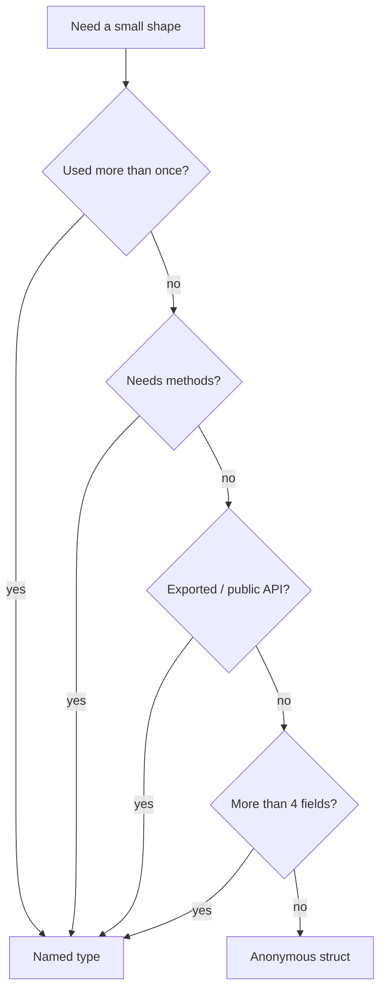

# Go Anonymous Structs — Middle Level

## 1. Introduction

At the middle level, anonymous structs are a deliberate design tool: you choose them when a shape is **truly local** to one function or test, and you choose a named type the moment that shape escapes the function or grows past three or four fields. You also know the subtle parts of structural identity (tag matters, order matters), the limits in public APIs, and the trade-offs against named types.

---

## 2. Prerequisites
- Junior-level material (this topic)
- Named structs (2.3.5)
- Type identity rules (2.4)
- JSON marshaling
- Table-driven tests
- HTTP handlers

---

## 3. Glossary

| Term | Definition |
|------|-----------|
| Anonymous struct | Struct value declared inline; type has no name |
| Structural identity | Two anonymous structs are the same type iff fields match exactly |
| Field tag | Backtick-quoted string after a field; part of the type identity |
| One-off | Used once; not promoted to a named type |
| DTO | Data Transfer Object — a shape used at an API boundary |
| Composite literal | A `T{...}` value-construction expression |
| Promoted shape | A previously anonymous struct lifted into a named type |

---

## 4. Core Concepts

### 4.1 Anonymous Structs as a Locality Statement

Choosing an anonymous struct says: "this shape is only used here, and naming it would not pay for itself." When that statement is true, anonymous structs reduce the number of named types in the package and keep the shape next to the code that uses it.

When the statement stops being true — the shape is used in two functions, or imported from another package — switch to a named type.

### 4.2 Structural Identity Rules (Detailed)

Two struct types (named or anonymous) are the same type iff:
- They have the same number of fields, in the same order.
- Each field has the same name (or both are anonymous fields).
- Each field has the same type (recursively, by identity).
- Each field has the same tag string (byte-for-byte).
- Each field has the same export status (uppercase first letter).

Anonymous structs benefit from this because two `struct{X int}` literals in the same package give you the same type. As soon as one literal adds a tag, swaps a field, or reorders fields, the types diverge.

```go
// Same type
type T1 = struct{ A int }
type T2 = struct{ A int }

// Different — tag differs
type T3 = struct{ A int `json:"a"` }
type T4 = struct{ A int }

// Different — field order
type T5 = struct{ A, B int }
type T6 = struct{ B, A int }
```

### 4.3 Why Methods Are Not Allowed

A method declaration `func (r ReceiverType) M(...) {...}` requires a single named receiver type defined in the same package. The grammar does not accept a struct literal as a receiver type. So an anonymous struct cannot have methods, and therefore cannot satisfy any interface that demands methods.

The only interface an anonymous struct can satisfy is `interface{}` (or `any`).

### 4.4 Anonymous Structs in Function Signatures

Legal but rude:

```go
// Caller has to spell the entire shape:
func describe(p struct{ X, Y int }) string { ... }

describe(struct{ X, Y int }{1, 2}) // verbose
```

Two reasons to avoid:
1. The caller cannot use a different (but identical-looking) type from another package.
2. Documentation tools have nothing to link to.

### 4.5 Table-Driven Tests as the Killer App

```go
cases := []struct {
    name        string
    input       string
    wantTokens  int
    wantErr     bool
}{
    {"empty", "", 0, false},
    {"one", "a", 1, false},
    {"bad", "\xff", 0, true},
}
for _, c := range cases {
    t.Run(c.name, func(t *testing.T) { ... })
}
```

The shape is local. It changes test by test. It does not deserve a name.

### 4.6 Inline JSON Shapes in HTTP Handlers

```go
func health(w http.ResponseWriter, r *http.Request) {
    _ = json.NewEncoder(w).Encode(struct {
        Status string `json:"status"`
        Build  string `json:"build"`
    }{
        Status: "ok",
        Build:  buildID,
    })
}
```

The response shape exists only here. Naming it would pollute the package.

### 4.7 Trade-Offs Against Named Types

| Concern | Anonymous wins | Named wins |
|---------|----------------|------------|
| One-off use | yes | — |
| Shared between functions | — | yes |
| Cross-package | — | yes |
| Need methods | — | yes |
| Need to be referenced in docs | — | yes |
| Compact tests | yes | — |
| Stable wire schema | — | yes |
| Tag-driven serialization | both | both |

The decision is almost always: "named, unless the shape is local AND simple AND has no methods."

### 4.8 When NOT to Use

- gRPC service definitions.
- Persisted database models.
- Wire formats shared across services.
- Anywhere methods are required.
- Public function signatures.
- Library APIs.

### 4.9 Embedding

Anonymous structs can appear as a **named field** in a named struct (legal), but they cannot be used as an **anonymous (embedded) field** because anonymous fields must be type names.

```go
// OK — named field, anonymous type
type Outer struct {
    Meta struct{ ID int }
}

// NOT OK — anonymous field cannot be a struct literal
type Bad struct {
    struct{ ID int } // syntax error
}
```

---

## 5. Real-World Analogies

**A scratch pad on a desk**: it lives where you work, has labels for the columns, and is recycled. Naming it would imply you plan to refile and reuse it.

**An ad-hoc spreadsheet sent over chat**: shape, content, single use, and gone. If two teammates start sending the same shape every week, you create a named template.

**A custom paper form at a clinic**: filled, scanned, archived, never reused. If the form starts showing up in every visit, the clinic prints a named version.

---

## 6. Mental Models

### Model 1 — Locality

```
named type    ────► reusable, exported, has methods
anonymous     ────► local-only, no name, no methods
```

### Model 2 — Identity

```
struct{ A int `t:"x"` }     struct{ A int }
        │                          │
        └── tag differs ────► different types
```

### Model 3 — Refactor Threshold

```
1 use   → anonymous
2 uses  → consider named
3 uses  → named almost always
+method → named, no choice
```

---

## 7. Pros & Cons

### Pros
- No type-name pollution.
- Shape stays next to the code that uses it.
- Same memory layout and runtime cost as named structs.
- Compact, idiomatic in tests.
- Easy to compose for one-off serialization.

### Cons
- No methods.
- Awkward in public APIs.
- Easy to drift out of sync if accidentally duplicated.
- No central place to document.
- Tag differences silently break identity.

---

## 8. Use Cases

1. Table-driven tests.
2. One-off JSON request/response shapes.
3. Logging and metrics payloads in a single handler.
4. Small return bundles from private helpers.
5. Temporary value grouping during refactors.
6. Configuration shapes used by a single helper.

---

## 9. Code Examples

### Example 1 — Test Table With Subtests

```go
package strings_test

import (
    "strings"
    "testing"
)

func TestToUpper(t *testing.T) {
    cases := []struct {
        name string
        in   string
        want string
    }{
        {"empty", "", ""},
        {"ascii", "go", "GO"},
        {"mixed", "GoLang", "GOLANG"},
    }
    for _, c := range cases {
        t.Run(c.name, func(t *testing.T) {
            if got := strings.ToUpper(c.in); got != c.want {
                t.Errorf("got %q, want %q", got, c.want)
            }
        })
    }
}
```

### Example 2 — Inline Request Body

```go
package main

import (
    "bytes"
    "encoding/json"
    "net/http"
)

func sendEvent(client *http.Client, name string, count int) error {
    body, _ := json.Marshal(struct {
        Name  string `json:"name"`
        Count int    `json:"count"`
    }{Name: name, Count: count})

    resp, err := client.Post("https://api.example.com/events",
        "application/json", bytes.NewReader(body))
    if err != nil {
        return err
    }
    defer resp.Body.Close()
    return nil
}
```

### Example 3 — Inline Response Decode

```go
package main

import (
    "encoding/json"
    "net/http"
)

func fetchUserName(id int) (string, error) {
    resp, err := http.Get(fmt.Sprintf("https://api.example.com/users/%d", id))
    if err != nil {
        return "", err
    }
    defer resp.Body.Close()

    var out struct {
        Name string `json:"name"`
    }
    if err := json.NewDecoder(resp.Body).Decode(&out); err != nil {
        return "", err
    }
    return out.Name, nil
}
```

The decoder fills only the fields the struct names; the rest of the JSON is discarded. This is a strong reason to keep the struct anonymous and inline: the function uses just one field, so a named type would over-promise.

### Example 4 — Slice of Anonymous Records

```go
package main

import "fmt"

func main() {
    rows := []struct {
        Path string
        Size int64
    }{
        {"/etc/hosts", 220},
        {"/etc/passwd", 1340},
        {"/etc/group", 760},
    }
    var total int64
    for _, r := range rows {
        total += r.Size
    }
    fmt.Println(total)
}
```

### Example 5 — Returning a Small Bundle

```go
package main

import "strings"

func split2(s, sep string) (struct{ A, B string }, bool) {
    var out struct{ A, B string }
    i := strings.Index(s, sep)
    if i < 0 {
        return out, false
    }
    out.A = s[:i]
    out.B = s[i+len(sep):]
    return out, true
}
```

A private helper. The shape exists only here. A named type is unnecessary.

---

## 10. Coding Patterns

### Pattern 1 — Test Table
```go
cases := []struct{ in, want int }{
    {1, 1}, {2, 4}, {3, 9},
}
```

### Pattern 2 — Inline Encode
```go
_ = json.NewEncoder(w).Encode(struct {
    Status string `json:"status"`
}{"ok"})
```

### Pattern 3 — Inline Decode (Pluck One Field)
```go
var x struct{ Name string `json:"name"` }
_ = json.NewDecoder(r).Decode(&x)
```

### Pattern 4 — Local Configuration
```go
cfg := struct {
    Workers int
    Timeout time.Duration
}{Workers: 4, Timeout: 5 * time.Second}
```

### Pattern 5 — Embedded Subgroup
```go
type Job struct {
    ID   int
    Meta struct {
        StartedAt time.Time
        Owner     string
    }
}
```

---

## 11. Clean Code Guidelines

1. **Default to named types.** Anonymous is the exception, not the rule.
2. **Inline shapes only when local.** Local meaning: one function, one file.
3. **Cap field count at four.** Beyond that, the shape deserves a name.
4. **Always use named-field syntax.** Positional initialization with anonymous structs reads badly.
5. **Do not export anonymous shapes.** Move them to named types when they cross a package boundary.
6. **Do not log anonymous-struct values blindly.** They have no `String()` and you cannot redact fields.

```go
// Good — local, small
got := struct{ A, B int }{1, 2}

// Bad — should be a named type
got := struct {
    UserID, OrgID, RoleID int
    Name, Email, Phone    string
    Active, Banned        bool
}{ /* ... */ }
```

---

## 12. Product Use / Feature Example

**A small admin endpoint** that returns three counters:

```go
package main

import (
    "encoding/json"
    "net/http"
)

type counters interface {
    Users() int
    Orgs() int
    Sessions() int
}

func adminStats(c counters) http.HandlerFunc {
    return func(w http.ResponseWriter, r *http.Request) {
        _ = json.NewEncoder(w).Encode(struct {
            Users    int `json:"users"`
            Orgs     int `json:"orgs"`
            Sessions int `json:"sessions"`
        }{
            Users:    c.Users(),
            Orgs:     c.Orgs(),
            Sessions: c.Sessions(),
        })
    }
}
```

The response shape exists only here. If three more endpoints need the same triple, refactor to a named type.

---

## 13. Error Handling

Anonymous structs cannot implement `error`. For error-shaped data inside a single helper, use a named field carrying an `error`:

```go
type result struct {
    Value int
    Err   error
}
```

Or, inline:

```go
res := struct {
    Value int
    Err   error
}{Value: 0, Err: io.EOF}
```

The shape carries an error but is not itself an `error`.

---

## 14. Security Considerations

1. **Auditability**: a sensitive payload (passwords, tokens) deserves a named type so the schema can be reviewed centrally.
2. **No method overrides**: you cannot add `MarshalJSON` to redact fields. Use a named type when redaction matters.
3. **Drift across files**: two near-identical anonymous structs differ silently if a tag changes; security-sensitive fields are easy to miss.
4. **Logging**: avoid logging anonymous-struct values containing secrets; you cannot define a custom `String()` to mask fields.

---

## 15. Performance Tips

1. Allocation behavior is identical to a named struct.
2. Field padding follows the same rules — same `unsafe.Sizeof`, same alignment.
3. Methods are missing, but a regular function with a struct parameter is just as fast.
4. JSON encoding cost is the same — `encoding/json` reflects on the type either way.

---

## 16. Metrics & Analytics

Inline metric events:

```go
metrics.Emit(struct {
    Name  string `json:"name"`
    Value int    `json:"value"`
    Tags  []string `json:"tags"`
}{Name: "click", Value: 1, Tags: []string{"home"}})
```

For repeated event shapes, a named `metrics.Event` type wins because the catalog of events is part of the contract with downstream consumers.

---

## 17. Best Practices

1. Anonymous for local one-offs.
2. Named for cross-package, exported, or long-lived shapes.
3. Cap field count.
4. Always use named-field initialization.
5. Avoid in public function signatures.
6. Move to a named type as soon as a method is needed.
7. Refactor when duplication appears.

---

## 18. Edge Cases & Pitfalls

### Pitfall 1 — Tag Drift
```go
// File a:
var a struct{ ID int `json:"id"` }
// File b:
var b struct{ ID int }
// a = b // not assignable: tag differs
```
Fix: pick one tag policy or define a named type.

### Pitfall 2 — Cross-Package "Same" Shape
Each package's `struct{ID int}` is its own nominal type for the package's compilation unit's purposes. Even though structural identity says they're "the same" by shape, you still cannot easily exchange values across package boundaries because callers have to construct the literal themselves. Use a shared named type.

### Pitfall 3 — Embedding Trap
```go
type Outer struct {
    Meta struct{ ID int }
    ID   int
}
// Outer.ID    // top-level
// Outer.Meta.ID // nested — no collision because path differs
```
But if you embed a named type with `ID` and also have `Meta struct{ ID int }`, you can hit ambiguity.

### Pitfall 4 — Public Function Signature
```go
// Forces every caller to spell the shape:
func New() (handle struct{ ID int }, err error) {...}
```
Fix: name the type.

### Pitfall 5 — Mutating a Slice of Anonymous Structs
```go
xs := []struct{ N int }{{1}, {2}}
for _, x := range xs {
    x.N = 99 // modifies the loop copy, not the slice element
}
fmt.Println(xs) // [{1} {2}]
```
Same as for named structs, but the rule still surprises people.
Fix: index by `i`, write `xs[i].N = 99`.

### Pitfall 6 — Test Table That Outgrows Itself
```go
cases := []struct {
    name, in, want, lang, locale string
    flag, debug                  bool
    timeout                      time.Duration
    setup                        func()
}{ /* 20 entries */ }
```
The shape now belongs to a named type with subtests as separate functions.

---

## 19. Common Mistakes

| Mistake | Fix |
|---------|-----|
| Anonymous struct in exported API | Use a named type |
| Trying to add methods | Use a named type |
| Duplicating the shape in two files | Promote to a named type |
| Forgetting tags must match | Be consistent or use a named type |
| Hugely wide test table | Split or define a named row type |

---

## 20. Common Misconceptions

**Misconception 1**: "Anonymous structs are slower."
**Truth**: Identical layout and codegen.

**Misconception 2**: "Anonymous structs cannot have tags."
**Truth**: They can. Tags are part of the type and visible to reflection.

**Misconception 3**: "Two `struct{A int}` in different packages are the same type."
**Truth**: Identity is structural, but using the value across packages requires the caller to construct the literal — which is the rough part. It is mechanically possible (assignability holds), but it is bad design.

**Misconception 4**: "`json.Marshal(struct{...}{...})` can't handle anonymous structs."
**Truth**: It handles them like any other struct.

**Misconception 5**: "You should never use anonymous structs."
**Truth**: They are idiomatic in tests and inline JSON. Avoid them in public APIs and where methods are needed.

---

## 21. Tricky Points

1. Tags are part of the type — even invisible whitespace differences in tags will break identity (tags are byte-for-byte identical or different).
2. Field ORDER is part of the type. `{A,B int}` differs from `{B,A int}`.
3. `unsafe.Sizeof` and `reflect.Type.Size` give identical results to the named twin.
4. A `reflect.Type.Name()` call returns `""` for an anonymous struct.
5. The compiler still emits a runtime type descriptor; reflection works fully.

---

## 22. Test

```go
package anon_test

import (
    "encoding/json"
    "testing"
)

func TestAnonAssign(t *testing.T) {
    var a struct{ X int }
    var b struct{ X int }
    a = b // same type
    _ = a
}

func TestAnonTagsDiffer(t *testing.T) {
    a := struct {
        X int `json:"x"`
    }{X: 1}
    out, err := json.Marshal(a)
    if err != nil {
        t.Fatal(err)
    }
    if string(out) != `{"x":1}` {
        t.Fatalf("got %s", out)
    }
}

func TestTableDriven(t *testing.T) {
    cases := []struct {
        in, want int
    }{
        {1, 2}, {2, 3},
    }
    for _, c := range cases {
        if got := c.in + 1; got != c.want {
            t.Errorf("in=%d got=%d want=%d", c.in, got, c.want)
        }
    }
}
```

---

## 23. Tricky Questions

**Q1**: Are these the same type?
```go
struct{ A int `json:"a"` }
struct{ A int `json:"a" `} // trailing space inside backticks
```
**A**: No. Tag strings are compared byte-for-byte; trailing whitespace is significant.

**Q2**: Can `interface{ Hello() }` ever be satisfied by an anonymous struct?
**A**: No. The struct cannot have methods, so it cannot satisfy any interface with methods.

**Q3**: Can an anonymous struct be a map key?
**A**: Yes, as long as all its fields are comparable. The compiler synthesizes the equality.

**Q4**: Will this assign?
```go
var a struct{ X int }
var b struct{ Y int }
a = b
```
**A**: No. Field name differs.

---

## 24. Cheat Sheet

```go
// Single value
p := struct{ X, Y int }{1, 2}

// Slice with elided element type
xs := []struct{ A int }{{1}, {2}, {3}}

// Map of anonymous structs
m := map[string]struct{ A int }{"x": {1}}

// Test table
cases := []struct {
    in, want int
}{
    {1, 2},
}

// Inline JSON encode
_ = json.NewEncoder(w).Encode(struct {
    Status string `json:"status"`
}{"ok"})

// Inline JSON decode
var resp struct {
    Name string `json:"name"`
}
_ = json.NewDecoder(r).Decode(&resp)

// Embedded named field
type Outer struct {
    Meta struct{ ID int }
}
```

---

## 25. Self-Assessment Checklist

- [ ] I default to named types and pick anonymous deliberately.
- [ ] I can list the conditions for two anonymous structs to share a type.
- [ ] I avoid anonymous structs in exported APIs.
- [ ] I refactor to a named type when methods or reuse appear.
- [ ] I cap anonymous structs at four fields in practice.
- [ ] I use named-field initialization.
- [ ] I know tags are part of the type.

---

## 26. Summary

Anonymous structs are for one-off, local shapes. They shine in table-driven tests and inline JSON shaping. They cannot have methods and they age poorly when reused or exported. Structural identity is strict: every field name, type, tag, and order must match. Performance and reflection behave just like a named struct. Promote to a named type the moment the shape is reused, exported, or needs methods.

---

## 27. What You Can Build

- Comprehensive test tables.
- Inline request/response handlers.
- Small ad-hoc payloads.
- Embedded "metadata" sub-structs.
- Quick configuration objects for a single helper.
- Local "tuple" returns from private functions.

---

## 28. Further Reading

- [Go Spec — Struct types](https://go.dev/ref/spec#Struct_types)
- [Go Spec — Type identity](https://go.dev/ref/spec#Type_identity)
- [Effective Go — Composite literals](https://go.dev/doc/effective_go#composite_literals)
- [Dave Cheney — Practical Go: Real-world advice](https://dave.cheney.net/practical-go)

---

## 29. Related Topics

- 2.3.5 Structs
- 2.3.6 Empty Struct
- 2.4 Type Identity
- Method declarations (Chapter 3)
- Reflection basics

---

## 30. Diagrams & Visual Aids

### Decision flow



### Identity rule

```
struct{ A int `json:"a"` }      struct{ A int }
        \                              /
         \  tag differs               /
          ─────► different types ────
```
