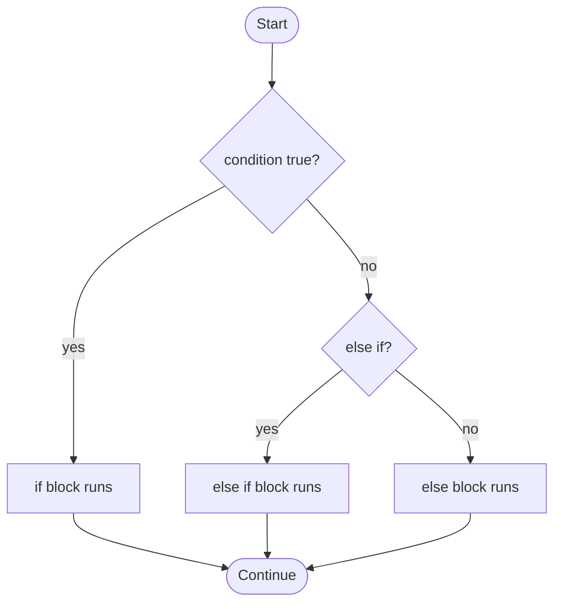
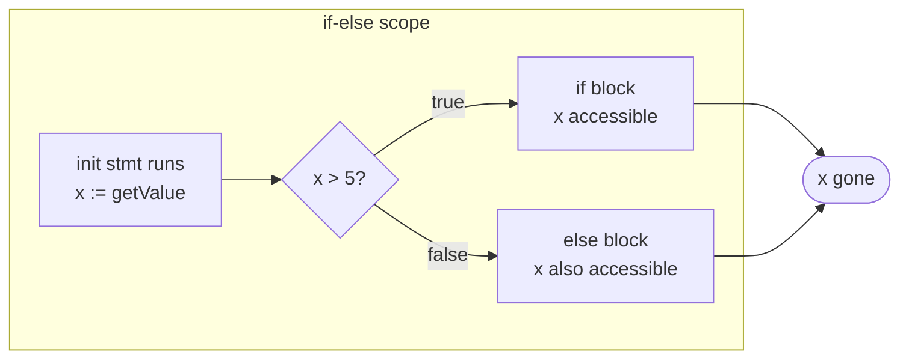
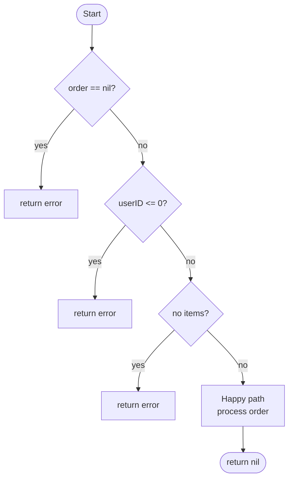

# if Statement — Junior Level

## 1. What Is an `if` Statement?

An `if` statement lets your program make decisions. If a condition is true, one block of code runs; otherwise it's skipped.

```go
package main

import "fmt"

func main() {
    x := 10

    if x > 5 {
        fmt.Println("x is greater than 5")
    }
}
// Output: x is greater than 5
```

The condition goes between `if` and `{` — no parentheses needed.

---

## 2. Go's `if` Syntax — Three Key Rules

**Rule 1: No parentheses around the condition**
```go
// WRONG (like C/Java):
if (x > 0) { }

// CORRECT (Go style):
if x > 0 { }
```

**Rule 2: Braces are always required**
```go
// WRONG — even for one statement:
// if x > 0
//     fmt.Println("positive")

// CORRECT:
if x > 0 {
    fmt.Println("positive")
}
```

**Rule 3: Opening brace on the same line**
```go
// WRONG — Go requires same-line opening brace:
// if x > 0
// {
//     fmt.Println("positive")
// }

// CORRECT:
if x > 0 {
    fmt.Println("positive")
}
```

---

## 3. `if-else` Statement

Add an `else` block for code that runs when the condition is false.

```go
func main() {
    age := 16

    if age >= 18 {
        fmt.Println("You can vote")
    } else {
        fmt.Println("You cannot vote yet")
    }
}
// Output: You cannot vote yet
```

---

## 4. `if-else if-else` Chain

Check multiple conditions in sequence.

```go
func main() {
    score := 75

    if score >= 90 {
        fmt.Println("Grade: A")
    } else if score >= 80 {
        fmt.Println("Grade: B")
    } else if score >= 70 {
        fmt.Println("Grade: C")
    } else if score >= 60 {
        fmt.Println("Grade: D")
    } else {
        fmt.Println("Grade: F")
    }
}
// Output: Grade: C
```

Conditions are checked from top to bottom. The first true condition wins.

---

## 5. Control Flow Diagram



---

## 6. Boolean Conditions

The condition in an `if` must be a boolean expression.

```go
func main() {
    isReady := true
    isDone := false

    if isReady {
        fmt.Println("System is ready")
    }

    if !isDone {
        fmt.Println("Still working...")
    }

    // AVOID: if isReady == true — redundant, use if isReady
    // AVOID: if isDone == false — redundant, use if !isDone
}
```

---

## 7. Comparison Operators

```go
a, b := 10, 20

if a == b { fmt.Println("equal") }
if a != b { fmt.Println("not equal") }    // not equal
if a < b  { fmt.Println("a less") }       // a less
if a > b  { fmt.Println("a greater") }
if a <= b { fmt.Println("a <= b") }       // a <= b
if a >= b { fmt.Println("a >= b") }
```

---

## 8. Logical Operators: `&&`, `||`, `!`

```go
func main() {
    age := 25
    hasLicense := true

    // AND: both must be true
    if age >= 18 && hasLicense {
        fmt.Println("Can drive")
    }

    // OR: at least one must be true
    isStudent := false
    isSenior := true
    if isStudent || isSenior {
        fmt.Println("Eligible for discount")
    }

    // NOT: inverts a boolean
    isBlocked := false
    if !isBlocked {
        fmt.Println("Access granted")
    }
}
```

---

## 9. The `if` Init Statement — Go's Unique Feature

Go allows running a short statement before the condition. Variables declared here are scoped to the entire `if-else` block.

```go
// Format: if init; condition { }

func main() {
    if x := 42; x > 40 {
        fmt.Println("x is", x) // 42
    }
    // x is NOT accessible here

    // With function call:
    if n := len("Hello"); n > 3 {
        fmt.Println("long string, length:", n) // 5
    }
}
```

---

## 10. The Most Common Go Pattern: Error Checking

```go
package main

import (
    "fmt"
    "strconv"
)

func main() {
    // Pattern 1: init statement error check
    if n, err := strconv.Atoi("42"); err != nil {
        fmt.Println("Error:", err)
    } else {
        fmt.Println("Parsed number:", n) // 42
    }

    // Pattern 2: separate declaration + guard (preferred when returning)
    n, err := strconv.Atoi("not-a-number")
    if err != nil {
        fmt.Println("Error:", err)
        return
    }
    fmt.Println("Number:", n)
}
```

---

## 11. Control Flow: Init Statement Scope



```go
func main() {
    if x := 10; x > 5 {
        fmt.Println("x in if:", x)    // x accessible
    } else {
        fmt.Println("x in else:", x)  // x accessible in else too!
    }
    // x is undefined here
}
```

---

## 12. Comparing Strings

```go
func main() {
    language := "Go"

    if language == "Go" {
        fmt.Println("You're learning Go!")
    }

    if language != "Python" {
        fmt.Println("Not Python")
    }

    // String comparison is case-sensitive:
    if "go" != "Go" {
        fmt.Println("lowercase and uppercase differ")
    }
}
```

---

## 13. Checking for `nil`

```go
package main

import "fmt"

type User struct{ Name string }

func getUser(id int) *User {
    if id == 1 {
        return &User{Name: "Alice"}
    }
    return nil
}

func main() {
    u := getUser(1)
    if u != nil {
        fmt.Println("Found:", u.Name)
    }

    u2 := getUser(999)
    if u2 == nil {
        fmt.Println("Not found")
    }
}
```

---

## 14. Nested `if` Statements

```go
func main() {
    age := 20
    hasID := true

    if age >= 18 {
        if hasID {
            fmt.Println("Entry allowed")
        } else {
            fmt.Println("Need ID")
        }
    } else {
        fmt.Println("Must be 18+")
    }
}
```

Note: Deep nesting makes code hard to read. Guard clauses are usually better.

---

## 15. No Ternary Operator in Go

Unlike C/Java/JavaScript, Go does NOT have `? :`.

```go
// JavaScript: let max = a > b ? a : b

// Go: use if-else
a, b := 10, 20
var max int
if a > b {
    max = a
} else {
    max = b
}
fmt.Println(max) // 20

// Or write a helper function:
func maxInt(a, b int) int {
    if a > b {
        return a
    }
    return b
}
```

---

## 16. Guard Clauses — Early Return Pattern

Instead of deep nesting, check for invalid conditions early and return.



```go
// WITHOUT guard clauses (deep nesting — hard to read):
func processOrder(order *Order) error {
    if order != nil {
        if order.UserID > 0 {
            if len(order.Items) > 0 {
                // actual logic buried deep
                return nil
            }
        }
    }
    return errors.New("invalid")
}

// WITH guard clauses (flat — easy to read):
func processOrder(order *Order) error {
    if order == nil {
        return errors.New("order is nil")
    }
    if order.UserID <= 0 {
        return errors.New("invalid user ID")
    }
    if len(order.Items) == 0 {
        return errors.New("no items")
    }
    // Happy path here
    return nil
}
```

---

## 17. `if` with Multiple Return Values

```go
package main

import (
    "fmt"
    "os"
)

func main() {
    // Environment variable lookup
    if val, ok := os.LookupEnv("HOME"); ok {
        fmt.Println("HOME =", val)
    } else {
        fmt.Println("HOME not set")
    }

    // Map lookup
    m := map[string]int{"a": 1, "b": 2}
    if val, ok := m["c"]; ok {
        fmt.Println("Found:", val)
    } else {
        fmt.Println("Key 'c' not found")
    }
}
```

---

## 18. Comparing Numbers — Float Gotcha

```go
package main

import (
    "fmt"
    "math"
)

func main() {
    // Integer comparison — always exact
    x := 5
    if x == 5 {
        fmt.Println("exactly 5")
    }

    // Float comparison — AVOID == (floating point imprecision)
    f := 0.1 + 0.2
    fmt.Println(f) // 0.30000000000000004

    // WRONG:
    if f == 0.3 { fmt.Println("won't print") }

    // CORRECT: use epsilon
    if math.Abs(f-0.3) < 1e-9 {
        fmt.Println("approximately 0.3")
    }
}
```

---

## 19. `if` in Validation Functions

```go
package main

import (
    "fmt"
    "strings"
)

func validateEmail(email string) string {
    if email == "" {
        return "email is required"
    }
    if !strings.Contains(email, "@") {
        return "must contain @"
    }
    if !strings.Contains(email, ".") {
        return "must contain ."
    }
    return "" // valid
}

func main() {
    for _, email := range []string{"alice@example.com", "bad", ""} {
        if err := validateEmail(email); err != "" {
            fmt.Printf("Invalid %q: %s\n", email, err)
        } else {
            fmt.Printf("Valid: %q\n", email)
        }
    }
}
```

---

## 20. Common Mistakes

**Mistake 1: `=` instead of `==`**
```go
x := 5
// if x = 10 { }  // COMPILE ERROR in Go — prevents bugs!
if x == 10 { }    // correct
```

**Mistake 2: `if x == true`**
```go
isValid := true
if isValid == true { }  // redundant
if isValid { }           // idiomatic
```

**Mistake 3: `if x == false`**
```go
hasError := false
if hasError == false { }  // redundant
if !hasError { }           // idiomatic
```

**Mistake 4: Forgetting else scope**
```go
if x := getValue(); x > 0 {
    use(x)
}
// use(x) here  // ERROR: x undefined outside if block
```

---

## 21. `if` with Type Assertion

```go
package main

import "fmt"

func describe(i interface{}) {
    if s, ok := i.(string); ok {
        fmt.Println("String:", s)
    } else if n, ok := i.(int); ok {
        fmt.Println("Integer:", n)
    } else if b, ok := i.(bool); ok {
        fmt.Println("Boolean:", b)
    } else {
        fmt.Println("Unknown type")
    }
}

func main() {
    describe("Hello")  // String: Hello
    describe(42)       // Integer: 42
    describe(true)     // Boolean: true
    describe(3.14)     // Unknown type
}
```

---

## 22. `if` with Slice and Map Checks

```go
package main

import "fmt"

func main() {
    // Slice length check
    items := []string{}
    if len(items) == 0 {
        fmt.Println("empty slice")
    }

    // Map existence check
    config := map[string]string{
        "host": "localhost",
    }
    if port, ok := config["port"]; ok {
        fmt.Println("port:", port)
    } else {
        fmt.Println("port not configured")
    }
}
```

---

## 23. `if` in HTTP Handlers

```go
func loginHandler(w http.ResponseWriter, r *http.Request) {
    if r.Method != http.MethodPost {
        http.Error(w, "method not allowed", http.StatusMethodNotAllowed)
        return
    }

    var req LoginRequest
    if err := json.NewDecoder(r.Body).Decode(&req); err != nil {
        http.Error(w, "invalid JSON", http.StatusBadRequest)
        return
    }

    if req.Username == "" {
        http.Error(w, "username required", http.StatusBadRequest)
        return
    }

    if req.Username != "admin" || req.Password != "secret" {
        http.Error(w, "invalid credentials", http.StatusUnauthorized)
        return
    }

    w.WriteHeader(http.StatusOK)
    w.Write([]byte(`{"status":"ok"}`))
}
```

---

## 24. `if` with Channel Receive

```go
func main() {
    ch := make(chan int, 1)
    ch <- 42
    close(ch)

    if val, ok := <-ch; ok {
        fmt.Println("Received:", val)  // 42
    } else {
        fmt.Println("Channel closed")
    }
}
```

---

## 25. Short-Circuit Evaluation

Go evaluates `&&` and `||` from left to right and stops as soon as the result is known.

```go
func expensiveCheck() bool {
    fmt.Println("running expensive check")
    return true
}

func main() {
    x := 0

    // Short-circuit AND: if left is false, right never evaluates
    if x > 0 && expensiveCheck() {
        fmt.Println("both true")
    }
    // Output: (nothing — expensiveCheck never called!)

    // Short-circuit OR: if left is true, right never evaluates
    if x == 0 || expensiveCheck() {
        fmt.Println("at least one true")
    }
    // Output: at least one true (expensiveCheck never called!)
}
```

---

## 26. `if` Without `else`

In Go, `else` is often unnecessary after a `return`, `break`, `continue`, or `panic`.

```go
func divide(a, b float64) (float64, error) {
    if b == 0 {
        return 0, fmt.Errorf("division by zero")
    }
    // No else needed — if b==0, we already returned
    return a / b, nil
}

func processItems(items []Item) {
    for _, item := range items {
        if !item.IsValid() {
            continue
        }
        // No else needed — continue already skipped invalid
        process(item)
    }
}
```

---

## 27. Using Named Booleans for Readability

```go
func canPurchase(user User, item Item) bool {
    // Instead of one long condition:
    // if user.Age >= 18 && user.Balance >= item.Price && !user.IsBlocked && item.InStock {

    // Break into named booleans for clarity:
    isAdult := user.Age >= 18
    hasFunds := user.Balance >= item.Price
    notBlocked := !user.IsBlocked
    available := item.InStock

    if isAdult && hasFunds && notBlocked && available {
        return true
    }
    return false
}
```

---

## 28. `if` Statement in Loops

```go
func main() {
    numbers := []int{1, -2, 3, -4, 5, -6}

    positiveSum := 0
    for _, n := range numbers {
        if n > 0 {
            positiveSum += n
        }
    }
    fmt.Println("Sum of positives:", positiveSum) // 9
}
```

---

## 29. `if` for Different Return Types

```go
func classify(n int) string {
    if n < 0 {
        return "negative"
    } else if n == 0 {
        return "zero"
    } else if n < 10 {
        return "small"
    } else if n < 100 {
        return "medium"
    } else {
        return "large"
    }
}

func main() {
    for _, n := range []int{-5, 0, 3, 42, 500} {
        fmt.Printf("%4d → %s\n", n, classify(n))
    }
}
// Output:
//   -5 → negative
//    0 → zero
//    3 → small
//   42 → medium
//  500 → large
```

---

## 30. Quick Reference Cheat Sheet

```go
// Basic if
if condition { }

// if-else
if condition {
    // true
} else {
    // false
}

// if-else if-else
if condA {
    // A
} else if condB {
    // B
} else {
    // default
}

// With init statement (variables scoped to if-else block)
if x := compute(); x > 0 {
    use(x)
} else {
    handle(x)
}

// Error check (most common Go pattern)
if err := doSomething(); err != nil {
    return err
}

// Boolean idioms (Go style)
if flag { }          // not: if flag == true
if !flag { }         // not: if flag == false
if ptr != nil { }    // nil check
if val, ok := m[k]; ok { }  // map/type assertion

// Guard clause (early return)
if invalid {
    return error
}
// happy path here...

// Short-circuit evaluation
if cheapCheck() && expensiveCheck() { }  // expensiveCheck only if cheap is true
if quickCheck() || expensiveCheck() { }  // expensiveCheck only if quick is false
```

**Key Rules:**
1. No parentheses around condition: `if x > 0 { }` not `if (x > 0) { }`
2. Braces always required — even for single statements
3. Opening brace on same line
4. No ternary `?:` operator — use if-else
5. Init statement scopes variables: `if x := f(); x > 0 { }`
6. Use `if flag` not `if flag == true`
7. Prefer guard clauses (early return) over deep nesting
8. Avoid `==` for float comparison — use epsilon
