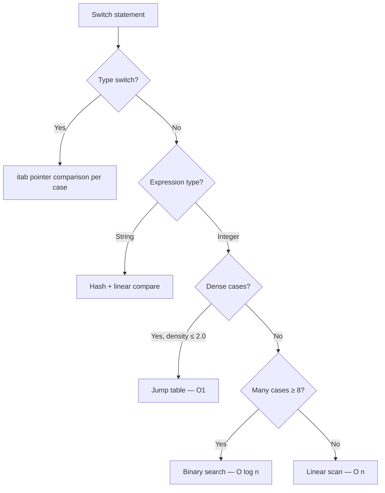
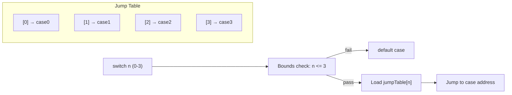
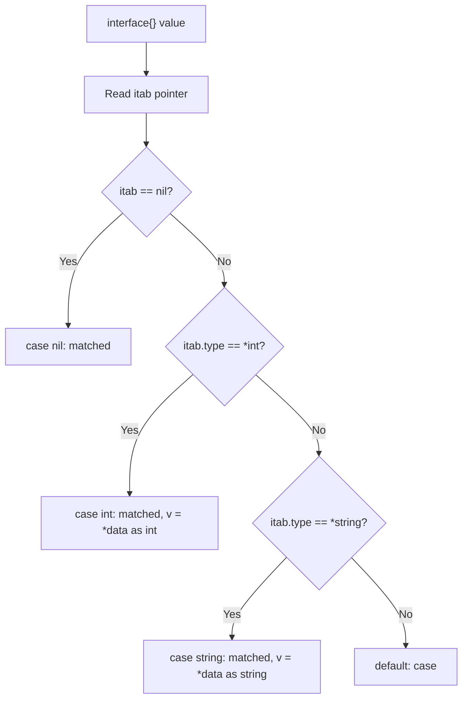

# switch Statement — Professional Level

## Table of Contents
1. [Introduction](#introduction)
2. [How It Works Internally](#how-it-works-internally)
3. [Runtime Deep Dive](#runtime-deep-dive)
4. [Compiler Perspective](#compiler-perspective)
5. [Memory Layout](#memory-layout)
6. [OS / Syscall Level](#os--syscall-level)
7. [Source Code Walkthrough](#source-code-walkthrough)
8. [Assembly Output Analysis](#assembly-output-analysis)
9. [Performance Internals](#performance-internals)
10. [Metrics & Analytics (Runtime Level)](#metrics--analytics-runtime-level)
11. [Edge Cases at the Lowest Level](#edge-cases-at-the-lowest-level)
12. [Test](#test)
13. [Tricky Questions](#tricky-questions)
14. [Summary](#summary)
15. [Further Reading](#further-reading)
16. [Diagrams & Visual Aids](#diagrams--visual-aids)

---

## Introduction: What Happens Under the Hood?

When you write `switch x { case 1: ... case 2: ... }`, the surface is simple. But under the hood, the Go compiler performs sophisticated analysis to choose between linear comparison, binary search, or jump table code generation — all invisible to the programmer. For type switches, the runtime reads interface type descriptors (itab pointers) and performs pointer comparisons. Understanding these internals lets you write switch statements that compile to maximally efficient machine code.

---

## How It Works Internally

### AST Representation

The Go parser represents a switch as `*ast.SwitchStmt` (expression switch) or `*ast.TypeSwitchStmt` (type switch):

```
*ast.SwitchStmt {
    Init: nil,
    Tag:  *ast.Ident{Name: "x"},   // the switched expression
    Body: *ast.BlockStmt{
        List: []*ast.CaseClause{
            {List: [BasicLit{1}], Body: [...]},  // case 1:
            {List: [BasicLit{2}], Body: [...]},  // case 2:
            {List: nil, Body: [...]},             // default:
        }
    }
}
```

For expressionless switch `switch { case x > 0: }`, the `Tag` field is nil, and each `CaseClause.List` contains boolean expressions.

For type switch `switch v := i.(type)`:
```
*ast.TypeSwitchStmt {
    Init:   nil,
    Assign: *ast.AssignStmt{ Tok: DEFINE, Lhs: [v], Rhs: [TypeAssertExpr{X: i}] },
    Body:   *ast.BlockStmt{ ... }
}
```

### Type Checking

`go/types` verifies:
1. The switched expression is comparable (or nil for type switch)
2. Each case value is the same type as the tag (or assignable to it)
3. No duplicate case values (caught by `go vet` and type checker)
4. The `fallthrough` statement is valid (not in last case, not in type switch)

---

## Runtime Deep Dive

### Expression switch execution

1. Evaluate the tag expression once (stored in a register)
2. Compare against each case value in the generated order
3. Jump to matching case body
4. Execute body (including any `fallthrough`)
5. Jump to end of switch

The key: the tag is evaluated **exactly once**, even for complex expressions like function calls.

### Type switch execution

1. Load the interface value (two words: itab pointer + data pointer)
2. For each case type, compare the itab pointer to the type's descriptor
3. Nil interface: itab pointer is nil; checked by `case nil:`
4. Match found: assign `v` to the typed value and jump to case body

The comparison is pointer equality, not structural equality — very fast.

### Fallthrough mechanics

`fallthrough` is implemented as an unconditional jump to the next case's body (not its condition). The next case's condition is NOT re-evaluated.

```go
switch x {
case 1:
    fmt.Println("one")
    fallthrough           // jumps directly to case 2's body
case 2:
    fmt.Println("two")   // executed for x==1 AND x==2
case 3:
    fmt.Println("three") // NOT executed for x==1 via fallthrough
}
```

---

## Compiler Perspective

### Switch lowering in SSA

The compiler's `switch` lowering pass (`cmd/compile/internal/ir`) transforms the switch into SSA blocks:

**Linear scan (≤4 integer cases or string cases):**
```
b1: tag = Param x
    v1 = Eq64 tag 1    // x == 1?
    If v1 → case1 b2

b2: v2 = Eq64 tag 2    // x == 2?
    If v2 → case2 end

case1: ...
case2: ...
end:
```

**Jump table (dense integers):**
```
b1: tag = Param x
    // Bounds check: 0 <= tag <= 6
    v1 = Less64U tag 7
    If !v1 → default end
    // Jump through table
    v2 = Load &jumpTable[tag]
    Jump v2

jumpTable: [addr_case0, addr_case1, ..., addr_case6]
```

**Binary search (sparse integers, 5+ cases):**
```
// Sorted case values: [1, 5, 10, 50, 100]
// Midpoint: 10
b1: v1 = Less64 tag 10
    If v1 → left_half right_half

left_half:
    v2 = Less64 tag 5
    If v2 → check_1 check_5
    ...
```

### String switch optimization

For string switches with few cases, the compiler generates:
1. Compare string length first (cheap)
2. If lengths match, compare content

For many cases, it may generate a hash of the switch tag and use a jump table indexed by hash:

```go
// Compiler-generated for large string switches:
hash := stringHash(tag)
switch hash {
case hash("GET"):
    if tag == "GET" { ... }
case hash("POST"):
    if tag == "POST" { ... }
}
```

---

## Memory Layout

### Case values are compile-time constants

All case values in an expression switch must be constants (or zero values). They are embedded in the generated code as immediate values — no runtime memory allocation.

### Type switch: itab layout

The interface type descriptor layout used by type switches:

```
itab (non-nil interface):
+------------------+
| *_type (type ptr)|  ← compared against case type descriptors
+------------------+
| fun[0]           |  method table
+------------------+
| fun[1]           |
+------------------+
...

_type struct:
+------------------+
| size uintptr     |
| ptrdata uintptr  |
| hash uint32      |  ← used for type identity
| tflag            |
| align/fieldAlign |
| kind             |
| equal func       |
| gcdata *byte     |
| str nameOff      |
| ptrToThis typeOff|
+------------------+
```

When `case int:` is evaluated in a type switch, the compiler generates a comparison against the `*_type` pointer for `int`. Since each type has exactly one `*_type` in the binary, this is a single pointer comparison.

---

## OS / Syscall Level

`switch` itself has no OS involvement — it is purely CPU-level control flow (compare + jump instructions). However, `switch` cases often guard syscall selection:

```go
// select system calls based on operation
func doSyscall(op int, fd int, buf []byte) (int, error) {
    switch op {
    case opRead:
        n, _, errno := syscall.Syscall(syscall.SYS_READ, uintptr(fd),
            uintptr(unsafe.Pointer(&buf[0])), uintptr(len(buf)))
        if errno != 0 {
            return 0, errno
        }
        return int(n), nil
    case opWrite:
        n, _, errno := syscall.Syscall(syscall.SYS_WRITE, uintptr(fd),
            uintptr(unsafe.Pointer(&buf[0])), uintptr(len(buf)))
        if errno != 0 {
            return 0, errno
        }
        return int(n), nil
    default:
        return 0, errors.New("unknown operation")
    }
}
```

The switch dispatch here is pure CPU — the syscall inside the case is what involves the OS.

---

## Source Code Walkthrough

### Where switch is compiled: `cmd/compile/internal/walk/switch.go`

The key function is `walkSwitchStmt`. For integer switches:

```go
// src/cmd/compile/internal/walk/switch.go (simplified)
func walkSwitchStmt(sw *ir.SwitchStmt) {
    // 1. Evaluate tag once
    tag := typecheck(sw.Tag, ctxExpr)

    // 2. Collect cases and sort by value
    cases := collectCases(sw)

    // 3. Choose dispatch strategy
    if isDense(cases) && isInteger(tag.Type()) {
        generateJumpTable(cases, tag)
    } else if len(cases) >= 8 {
        generateBinarySearch(cases, tag)
    } else {
        generateLinearScan(cases, tag)
    }
}
```

The `isDense` function checks if the range of values divided by the count is below a threshold (typically ~2.0) — if values are dense enough, a jump table is more efficient.

### Type switch: `typeSwitchStmt`

```go
// Type switch lowering
func walkTypeSwitchStmt(sw *ir.SwitchStmt) {
    // Get the interface value (two-word struct)
    iface := sw.Tag

    // For each case type:
    for _, c := range sw.Cases {
        typ := c.List[0].(*ir.TypeNode).Type()

        // Generate: if iface.itab == &typ_descriptor { ... }
        check := ir.NewBinaryExpr(pos, ir.OEQ,
            ir.NewSelectorExpr(pos, ir.ODOTPTR, iface, itabField),
            typeDescriptor(typ))

        genIf(check, c.Body)
    }
}
```

---

## Assembly Output Analysis

### Jump table assembly (x86-64)

```go
func classify(n int) string {
    switch n {
    case 0: return "zero"
    case 1: return "one"
    case 2: return "two"
    case 3: return "three"
    default: return "other"
    }
}
```

Generated assembly (simplified):
```asm
TEXT main.classify(SB):
    MOVQ AX, CX           ; copy n
    CMPQ CX, $3           ; n > 3?
    JA   default_case     ; jump to default if above 3
    LEAQ jumptable(SB), DX
    MOVLQSX (DX)(CX*4), CX ; load table[n] (32-bit offset)
    ADDQ DX, CX           ; compute absolute address
    JMP  CX               ; jump to case

jumptable:
    .long case0 - jumptable
    .long case1 - jumptable
    .long case2 - jumptable
    .long case3 - jumptable

case0: LEAQ str_zero(SB), AX; RET
case1: LEAQ str_one(SB), AX; RET
case2: LEAQ str_two(SB), AX; RET
case3: LEAQ str_three(SB), AX; RET
default_case: LEAQ str_other(SB), AX; RET
```

The jump table is an array of offsets. The dispatch is: bounds check + table load + jump — 3-4 instructions total.

### Type switch assembly

```go
func describe(i interface{}) string {
    switch i.(type) {
    case int:    return "int"
    case string: return "string"
    default:     return "other"
    }
}
```

Generated assembly (simplified):
```asm
TEXT main.describe(SB):
    ; AX = itab pointer (first word of interface)
    ; BX = data pointer (second word)
    TESTQ AX, AX            ; is interface nil?
    JE    nil_case

    MOVQ  0(AX), CX         ; load type pointer from itab
    LEAQ  type·int(SB), DX  ; address of int's type descriptor
    CMPQ  CX, DX            ; itab.type == int?
    JE    case_int

    LEAQ  type·string(SB), DX  ; address of string's type descriptor
    CMPQ  CX, DX              ; itab.type == string?
    JE    case_string

    ; default case
    LEAQ str_other(SB), AX
    RET

case_int:    LEAQ str_int(SB), AX; RET
case_string: LEAQ str_string(SB), AX; RET
nil_case:    ...
```

Each case is one load + one compare + one conditional jump — extremely fast.

---

## Performance Internals

### Jump table vs binary search breakeven

Based on Go compiler behavior and x86-64 microarchitecture:

| # Cases | Strategy | Avg Instructions |
|---------|----------|-----------------|
| 1-4 | Linear scan | 1-4 comparisons |
| 5-7 | Binary search | ~3 comparisons |
| 8-12 (dense) | Jump table | ~3 instructions (bounds + load + jump) |
| 8-12 (sparse) | Binary search | ~3-4 comparisons |
| 20+ (dense) | Jump table | ~3 instructions |
| 20+ (sparse) | Binary search | ~4-5 comparisons |

Jump tables win for dense integer cases because they have constant cost regardless of N.

### String switch hash caching

For repeated string switches on the same value (e.g., HTTP method routing in a tight loop), the compiler does NOT cache the hash between calls. If you switch on the same string value millions of times, consider pre-hashing or converting to an integer enum first.

```go
// FAST: integer enum switch (jump table)
type Method int
const (GetMethod Method = iota; PostMethod; ...)
func handle(m Method) { switch m { ... } }

// SLOWER: string switch (hash + compare each call)
func handle(m string) { switch m { ... } }
```

### PGO and switch

Profile-Guided Optimization (Go 1.21+) can reorder switch cases so the most-taken case appears first in the linear scan / binary search, improving branch prediction and instruction cache usage.

---

## Metrics & Analytics (Runtime Level)

### Profiling switch hot paths

```go
// Using pprof to identify which switch cases are hot
import _ "net/http/pprof"

// After collecting a CPU profile:
// go tool pprof -source cpu.pprof
// Look for which case bodies show high sample counts
```

### Custom metrics per case

```go
var caseCounters [4]atomic.Int64  // one per case

func handleRequest(method string) {
    switch method {
    case "GET":
        caseCounters[0].Add(1)
        handleGET()
    case "POST":
        caseCounters[1].Add(1)
        handlePOST()
    case "PUT":
        caseCounters[2].Add(1)
        handlePUT()
    default:
        caseCounters[3].Add(1)
        http.Error(w, "Method not allowed", 405)
    }
}
```

---

## Edge Cases at the Lowest Level

### Edge Case 1: Duplicate case value

```go
// go vet catches this at compile time
switch x {
case 1:
    fmt.Println("one")
case 1:    // ERROR: duplicate case 1 in switch
    fmt.Println("also one")
}
```

The type checker and `go vet` both catch duplicate case values.

### Edge Case 2: fallthrough in last case

```go
switch x {
case 1:
    fmt.Println("one")
    fallthrough  // valid: falls to case 2
case 2:
    fmt.Println("two")
    fallthrough  // COMPILE ERROR: cannot fallthrough final case in switch
}
```

`fallthrough` in the last case is a compile error because there is no next case to fall into.

### Edge Case 3: Type switch with multiple types in one case

```go
// Multiple types in one case: v has the type of the interface
switch v := i.(type) {
case int, int64:
    // v has type interface{} here — NOT int or int64
    // because the compiler can't know which one it is
    fmt.Printf("integer type: %T\n", v)
case string:
    fmt.Println(v)  // v has type string here
}
```

When multiple types are in one case, the variable `v` has the original interface type.

### Edge Case 4: Switch expression evaluated once but has side effects

```go
count := 0
getValue := func() int {
    count++
    return 5
}

switch getValue() {  // called ONCE, count becomes 1
case 5:
    fmt.Println("five")
case 10:
    fmt.Println("ten")
}
fmt.Println("count:", count)  // always prints 1
```

The switch tag expression is evaluated exactly once, regardless of how many cases there are.

### Edge Case 5: Comparing interface values in switch

```go
var a interface{} = 1
var b interface{} = 1

switch a {
case b:    // runtime comparison of interface values
    fmt.Println("equal")  // prints — interface comparison compares contained values
}

var c interface{} = []int{1, 2, 3}
// switch c { case c: ... }  // RUNTIME PANIC: []int is not comparable
```

Switching on interface values works for comparable types but panics at runtime if the contained type is not comparable (slices, maps, functions).

---

## Test

**1. What AST node represents a type switch in Go?**
- A) `*ast.SwitchStmt`
- B) `*ast.TypeSwitchStmt` ✓
- C) `*ast.TypeAssertExpr`
- D) `*ast.CaseClause`

**2. When does the compiler generate a jump table for a switch?**
- A) Always for integer switches
- B) When cases are consecutive integers and dense enough ✓
- C) When there are exactly 8 cases
- D) Never — Go always uses binary search

**3. What does `fallthrough` do at the machine code level?**
- A) Re-evaluates the next case's condition
- B) Jumps directly to the next case's body, skipping its condition ✓
- C) Exits the switch
- D) Jumps to the default case

**4. Why is a type switch using pointer comparison fast?**
- A) Each type's itab pointer is unique and compared as a raw pointer ✓
- B) Type names are interned strings
- C) The compiler pre-sorts types
- D) Reflection is used

**5. What happens when a type switch has `case int, int64:` and the value is an int?**
- A) `v` has type `int`
- B) `v` has type `interface{}` — the compiler can't determine which type ✓
- C) Compile error
- D) `v` has type `int64`

---

## Tricky Questions

**Q1: How does the `isDense` heuristic work for jump table generation?**

The compiler checks if `(maxValue - minValue + 1) / numCases <= threshold` (typically ~2). If cases cover more than half the range between min and max, a jump table is generated. For example, cases {0,1,2,3,4} span 5 values with 5 cases — density 1.0 → jump table. Cases {0, 100, 1000} span 1001 values with 3 cases — density 334 → linear scan.

**Q2: Why can't you use `fallthrough` in a type switch?**

The Go specification explicitly forbids it. `fallthrough` in a type switch would be semantically ambiguous: the next case might have a different type for `v`, making it impossible to type-check the subsequent code. The design decision was to disallow it entirely.

**Q3: What is the difference between `switch {}` and `switch false {}`?**

`switch {}` is an expressionless switch — each case must be a boolean expression. `switch false {}` is an expression switch where the tag is the constant `false`. In `switch false`, cases must match `false`, and `case true:` would never execute. `switch {}` is the common idiom for expressionless switches; `switch false` is unusual and effectively makes all conditions `!condition`.

**Q4: How does PGO affect switch case ordering?**

With PGO, the compiler profiles which cases are taken most often. It then reorders the generated comparison sequence so the hottest cases are checked first (for linear and binary search), reducing average comparison count. For jump tables, PGO has less impact since all cases have the same dispatch cost (O(1)).

---

## Summary

The `switch` statement compiles through sophisticated analysis: AST parsing captures the tag expression and case clauses, the SSA lowering pass chooses between jump table (dense integers), binary search (sparse integers), or linear scan (few cases), and the code generator emits the appropriate machine instructions. Type switches use interface itab pointer comparisons — single pointer equality checks per case. The tag expression is evaluated exactly once. Key edge cases: `fallthrough` forbidden in type switches and last cases, `case nil:` for nil interface matching, and interface comparisons in switch can panic for non-comparable types. PGO can optimize case ordering for linear-scan switches based on production profiling data.

---

## Further Reading

- [Go Compiler: walk/switch.go](https://github.com/golang/go/blob/master/src/cmd/compile/internal/walk/switch.go)
- [Go Specification: Switch statements](https://go.dev/ref/spec#Switch_statements)
- [Interface internals](https://research.swtch.com/interfaces)
- [Go SSA documentation](https://pkg.go.dev/golang.org/x/tools/go/ssa)
- [Profile-Guided Optimization](https://go.dev/doc/pgo)

---

## Diagrams & Visual Aids

### Switch compilation strategy selection



### Jump table layout in memory



### Type switch itab comparison


