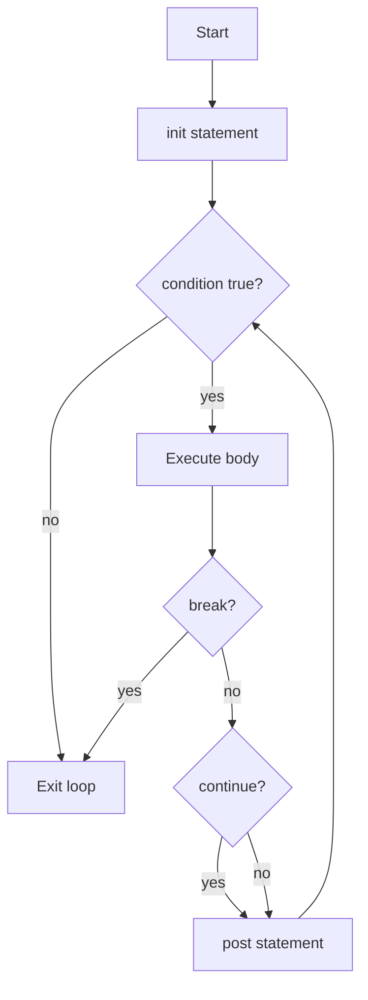
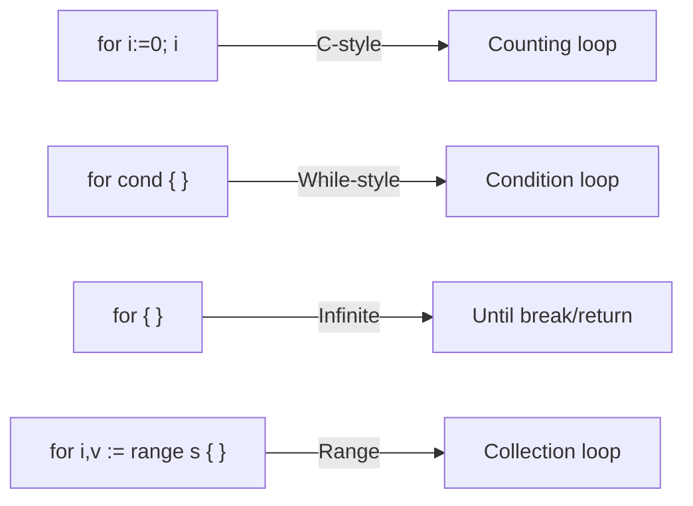

# Go for Loop (C-style) — Junior Level

## 1. Introduction

### What is it?
The `for` loop in Go is the only looping construct. Unlike most other languages, Go does not have `while`, `do-while`, or `until` — all looping is done with `for`. The three-component (C-style) form of `for` closely resembles the `for` loop in C, Java, or C#: an initialization, a condition, and a post statement.

### How to use it?
```go
for init; condition; post {
    // body
}
```

- **init**: Runs once before the loop starts (e.g., `i := 0`)
- **condition**: Evaluated before each iteration — loop continues while true
- **post**: Runs after each iteration (e.g., `i++`)

```go
package main

import "fmt"

func main() {
    for i := 0; i < 5; i++ {
        fmt.Println(i)
    }
}
// Output: 0 1 2 3 4
```

---

## 2. Prerequisites
- Basic Go syntax: variables, types, fmt.Println
- Boolean expressions
- Understanding of blocks `{ }`

---

## 3. Glossary

| Term | Definition |
|------|-----------|
| `for` | Go's only loop keyword |
| init statement | Code that runs once before the loop |
| condition | Boolean expression evaluated before each iteration |
| post statement | Code that runs after each iteration |
| `break` | Exits the loop immediately |
| `continue` | Skips to the post statement and starts next iteration |
| infinite loop | `for { }` — loops forever until break or return |
| loop variable | The variable declared in the init statement (e.g., `i`) |
| iteration | One execution of the loop body |
| nested loop | A loop inside another loop |

---

## 4. Core Concepts

### 4.1 All Three Components Are Optional
```go
// Full C-style
for i := 0; i < 10; i++ { }

// No init (use existing variable)
i := 0
for ; i < 10; i++ { }

// No post (update inside body)
for i := 0; i < 10; {
    i++
}

// Condition only (= while loop)
for i < 10 {
    i++
}

// Infinite loop
for {
    // loops forever
}
```

### 4.2 Go Has Only `for`
Unlike C, Java, or Python, Go has exactly ONE loop keyword: `for`. This covers all loop patterns:
- `for { }` = infinite loop (replaces `while(true)`)
- `for cond { }` = while loop
- `for i := 0; cond; post { }` = C-style for loop
- `for i, v := range collection { }` = range loop (covered in a separate topic)

### 4.3 Loop Variable Scope
The variable declared in the init statement is scoped to the for loop block:
```go
for i := 0; i < 5; i++ {
    fmt.Println(i)
}
// i is NOT accessible here — compile error: undefined: i
```

### 4.4 break and continue
- `break` exits the loop immediately
- `continue` skips the rest of the loop body and goes to the post statement

```go
for i := 0; i < 10; i++ {
    if i == 3 {
        continue // skip 3
    }
    if i == 7 {
        break    // stop at 7
    }
    fmt.Println(i)
}
// Output: 0 1 2 4 5 6
```

---

## 5. Real-World Analogies

**Odometer on a car**: The C-style for loop is like an odometer:
- **Init**: Set the starting mileage (`i := 0`)
- **Condition**: Check if we've reached the destination (`i < 100`)
- **Post**: Increment each mile (`i++`)

**Counting repetitions at the gym**: "Do 10 push-ups": start at 1, count up to 10, increment by 1 each time.

**A for-loop is a recipe**: You know exactly how many times to repeat each step.

---

## 6. Mental Models

```
for i := 0; i < N; i++ { body }

       ┌──────────────────────────────┐
       │ init: i := 0                 │
       └──────────────┬───────────────┘
                      ↓
             ┌────────────────┐
       ┌─────┤ condition i<N? ├─────┐
       │ no  └────────────────┘ yes │
       ↓                            ↓
   exit loop                  execute body
                                    ↓
                             post: i++
                                    │
                               (back to condition)
```

---

## 7. Pros & Cons

### Pros
- Single keyword for all loop types — simple, consistent
- All three components optional — highly flexible
- Clear, explicit iteration control
- No off-by-one errors if written carefully
- Compiler can optimize simple counting loops well

### Cons
- Easy to introduce off-by-one bugs (`<` vs `<=`)
- Forgetting the post statement creates an infinite loop
- Nested loops can be hard to read
- No built-in Python-style `range(start, stop, step)` — must do manually

---

## 8. Use Cases

1. Iterating a fixed number of times
2. Processing array/slice elements by index
3. Building strings character by character
4. Implementing retry logic with a maximum attempt count
5. Countdown timers
6. Matrix operations (nested loops)
7. Summing or searching in a numerical range
8. Game loop (update frame N times)

---

## 9. Code Examples

### Example 1 — Sum of 1 to 100
```go
package main

import "fmt"

func main() {
    sum := 0
    for i := 1; i <= 100; i++ {
        sum += i
    }
    fmt.Println("Sum:", sum) // Sum: 5050
}
```

### Example 2 — Countdown
```go
package main

import "fmt"

func main() {
    for i := 10; i >= 0; i-- {
        fmt.Printf("%d ", i)
    }
    fmt.Println("\nBlastoff!")
}
// Output: 10 9 8 7 6 5 4 3 2 1 0
// Blastoff!
```

### Example 3 — Step by 2 (Even Numbers)
```go
package main

import "fmt"

func main() {
    fmt.Print("Even numbers: ")
    for i := 0; i <= 20; i += 2 {
        fmt.Printf("%d ", i)
    }
    fmt.Println()
}
// Output: Even numbers: 0 2 4 6 8 10 12 14 16 18 20
```

### Example 4 — Multiple Variables in Loop
```go
package main

import "fmt"

func main() {
    for i, j := 0, 10; i < j; i, j = i+1, j-1 {
        fmt.Printf("i=%d, j=%d\n", i, j)
    }
}
// Output:
// i=0, j=10
// i=1, j=9
// i=2, j=8
// i=3, j=7
// i=4, j=6
```

### Example 5 — While-style Loop
```go
package main

import "fmt"

func main() {
    n := 1
    for n < 1000 {
        n *= 2
    }
    fmt.Println(n) // 1024 (first power of 2 >= 1000)
}
```

### Example 6 — Nested Loops (Multiplication Table)
```go
package main

import "fmt"

func main() {
    for i := 1; i <= 5; i++ {
        for j := 1; j <= 5; j++ {
            fmt.Printf("%4d", i*j)
        }
        fmt.Println()
    }
}
```

### Example 7 — Infinite Loop with Break
```go
package main

import (
    "bufio"
    "fmt"
    "os"
)

func main() {
    scanner := bufio.NewScanner(os.Stdin)
    for {
        fmt.Print("Enter text (or 'quit' to exit): ")
        scanner.Scan()
        text := scanner.Text()
        if text == "quit" {
            break
        }
        fmt.Println("You entered:", text)
    }
    fmt.Println("Goodbye!")
}
```

---

## 10. Coding Patterns

### Pattern 1 — Accumulator
```go
func sumSlice(nums []int) int {
    total := 0
    for i := 0; i < len(nums); i++ {
        total += nums[i]
    }
    return total
}
```

### Pattern 2 — Search
```go
func linearSearch(nums []int, target int) int {
    for i := 0; i < len(nums); i++ {
        if nums[i] == target {
            return i
        }
    }
    return -1
}
```

### Pattern 3 — Fill / Initialize
```go
func makeMatrix(rows, cols int) [][]int {
    matrix := make([][]int, rows)
    for i := 0; i < rows; i++ {
        matrix[i] = make([]int, cols)
        for j := 0; j < cols; j++ {
            matrix[i][j] = i*cols + j
        }
    }
    return matrix
}
```

### Pattern 4 — Retry with Limit
```go
func withRetry(maxAttempts int, fn func() error) error {
    var lastErr error
    for attempt := 0; attempt < maxAttempts; attempt++ {
        if err := fn(); err == nil {
            return nil
        } else {
            lastErr = err
        }
    }
    return fmt.Errorf("all %d attempts failed: %w", maxAttempts, lastErr)
}
```

---

## 11. Clean Code Guidelines

1. **Use `range` for slices/maps when you don't need the index math**: `for i, v := range slice` is cleaner.
2. **Use descriptive loop variables**: `for row := 0; row < rows; row++` is clearer than `for i`.
3. **Extract nested loop bodies to functions**: Deep nesting hurts readability.
4. **Prefer `i++` over `i += 1`**: Idiomatic Go.
5. **Use `n := len(s)` outside the loop**: Avoid recomputing in the condition (though the compiler often optimizes this).

```go
// Bad: magic number
for i := 0; i < 7; i++ { ... }

// Good: named constant
const daysInWeek = 7
for day := 0; day < daysInWeek; day++ { ... }
```

---

## 12. Product Use / Feature Example

**Paginated API fetch:**
```go
func fetchAllUsers(client *APIClient, pageSize int) ([]User, error) {
    var allUsers []User
    for page := 0; ; page++ {
        users, hasMore, err := client.GetUsers(page, pageSize)
        if err != nil {
            return nil, fmt.Errorf("page %d: %w", page, err)
        }
        allUsers = append(allUsers, users...)
        if !hasMore {
            break
        }
    }
    return allUsers, nil
}
```

---

## 13. Error Handling

```go
func processFiles(paths []string) []error {
    var errs []error
    for i := 0; i < len(paths); i++ {
        if err := processFile(paths[i]); err != nil {
            errs = append(errs, fmt.Errorf("file[%d] %s: %w", i, paths[i], err))
            // Continue processing other files
        }
    }
    return errs
}
```

---

## 14. Security Considerations

1. **Bound all loops with a maximum iteration count**: Prevent infinite loops from malformed input.
2. **Validate loop bounds against slice length**: Prevent index-out-of-bounds panics.
3. **Be careful with concurrent loop variables**: Goroutines capturing loop variables can cause data races.

```go
// Dangerous: goroutine captures loop variable
for i := 0; i < 5; i++ {
    go func() {
        fmt.Println(i) // all goroutines may print 5!
    }()
}

// Safe: pass as argument
for i := 0; i < 5; i++ {
    go func(n int) {
        fmt.Println(n) // correct
    }(i)
}
```

---

## 15. Performance Tips

1. **Cache `len()` outside the loop**: Although the compiler usually optimizes this, it's explicit.
```go
// OK (compiler optimizes for simple slices)
for i := 0; i < len(s); i++ { }

// Explicit cache for non-trivial cases
for i, n := 0, len(s); i < n; i++ { }
```

2. **Prefer counting up over counting down** for array access — better cache locality.
3. **Avoid function calls in loop conditions**: Move invariant computations outside.
4. **Use `continue` to skip instead of nesting `if`** — keeps loop body flat.

---

## 16. Metrics & Analytics

```go
// Count loop iterations for profiling
func processWithMetrics(items []int) {
    iterCount := 0
    for i := 0; i < len(items); i++ {
        iterCount++
        process(items[i])
    }
    metrics.Record("iterations", iterCount)
}
```

---

## 17. Best Practices

1. Use C-style for when you need index-based access or non-trivial step sizes.
2. Use `for range` for simple sequential iteration over slices/maps.
3. Use `for { break }` (infinite + break) when the exit condition is complex.
4. Always ensure the loop terminates (condition eventually becomes false).
5. For nested loops, consider using labeled break/continue for clarity.
6. Pre-initialize slices/maps before the loop to avoid repeated allocations.

---

## 18. Edge Cases & Pitfalls

### Pitfall 1 — Off-by-one (< vs <=)
```go
s := []int{0, 1, 2, 3, 4}
for i := 0; i <= len(s); i++ {  // BUG: i <= len(s) goes out of bounds!
    fmt.Println(s[i])           // panic at i == 5
}
// Fix: i < len(s)
```

### Pitfall 2 — Goroutine captures loop variable
```go
var wg sync.WaitGroup
for i := 0; i < 3; i++ {
    wg.Add(1)
    go func() {        // captures &i (pointer!)
        defer wg.Done()
        fmt.Println(i) // all may print 3 (final value)
    }()
}
// Fix: go func(i int) { fmt.Println(i) }(i)
```

### Pitfall 3 — Infinite loop when post statement doesn't advance condition
```go
for i := 0; i < 10; {
    fmt.Println(i)
    // BUG: forgot i++
    // Infinite loop!
}
```

### Pitfall 4 — Integer overflow in loop
```go
for i := 0; i < math.MaxInt; i++ {
    // This loop runs for a very long time
}
```

---

## 19. Common Mistakes

| Mistake | Fix |
|---------|-----|
| `i <= len(s)` causes panic | Use `i < len(s)` |
| Goroutine captures loop var | Pass `i` as function argument |
| Forgetting `i++` in body | Always have post statement or body increment |
| Infinite loop by accident | Verify condition is eventually false |
| Modifying slice length inside loop | Cache `len()` before loop |

---

## 20. Common Misconceptions

**Misconception 1**: "Go has while loops"
**Truth**: Go only has `for`. `for cond { }` is Go's while loop.

**Misconception 2**: "The loop variable `i` is accessible after the loop"
**Truth**: `i` declared in the init statement is scoped to the loop block.

**Misconception 3**: "You need a post statement in every for loop"
**Truth**: All three components are optional. `for { }` is valid.

**Misconception 4**: "continue skips the entire remaining loop including post"
**Truth**: `continue` goes to the post statement (e.g., `i++`), then checks the condition.

---

## 21. Tricky Points

1. `continue` in a C-style for loop goes to the **post statement** first, then the condition.
2. `break` exits the **innermost** loop only — use labels for outer loops.
3. The init statement can declare multiple variables with `:=`.
4. Post statement cannot be a declaration (`:=`) — only assignments and calls.
5. `for i, j := 0, 10; i < j; i, j = i+1, j-1` — Go comma-assignment is legal in post.

---

## 22. Test

```go
package main

import "testing"

func sumN(n int) int {
    sum := 0
    for i := 1; i <= n; i++ {
        sum += i
    }
    return sum
}

func TestSumN(t *testing.T) {
    tests := []struct {
        n    int
        want int
    }{
        {0, 0},
        {1, 1},
        {5, 15},
        {10, 55},
        {100, 5050},
    }
    for _, tt := range tests {
        if got := sumN(tt.n); got != tt.want {
            t.Errorf("sumN(%d) = %d; want %d", tt.n, got, tt.want)
        }
    }
}
```

---

## 23. Tricky Questions

**Q1**: What does `continue` do in this loop?
```go
for i := 0; i < 5; i++ {
    if i == 2 { continue }
    fmt.Println(i)
}
```
**A**: Prints 0, 1, 3, 4. When i==2, `continue` jumps to `i++`, making i=3, then checks `3 < 5`.

**Q2**: What is the output?
```go
i := 0
for ; i < 3; i++ {
    fmt.Print(i, " ")
}
fmt.Println(i)
```
**A**: `0 1 2 3` — after the loop, `i` is 3 (the value that made the condition false). The outer `i` is accessible because it was declared outside the for.

**Q3**: Does this loop ever terminate?
```go
for i := 0; i >= 0; i++ {
    fmt.Println(i)
}
```
**A**: Eventually `i` overflows `int` and becomes negative — but this takes ~9 quintillion iterations on 64-bit systems. In practice, treat as infinite.

---

## 24. Cheat Sheet

```
// C-style for
for i := 0; i < n; i++ { }

// While (condition only)
for condition { }

// Infinite
for { }

// Multiple variables
for i, j := 0, n; i < j; i, j = i+1, j-1 { }

// Countdown
for i := n; i >= 0; i-- { }

// Step
for i := 0; i < n; i += step { }

// break: exit loop
// continue: next iteration (runs post first)
// break label: exit labeled loop
// continue label: next iteration of labeled loop
```

---

## 25. Self-Assessment Checklist

- [ ] I can write a basic C-style for loop
- [ ] I know all three components are optional
- [ ] I understand the difference between `<` and `<=` in the condition
- [ ] I can count down with a for loop
- [ ] I can use multiple variables in a for loop
- [ ] I understand that `continue` goes to the post statement
- [ ] I understand that `break` exits only the innermost loop
- [ ] I know how to write an infinite loop
- [ ] I understand the loop variable scope
- [ ] I know the goroutine-captures-loop-var pitfall

---

## 26. Summary

Go's `for` loop is the only looping construct. The three-component (C-style) form is `for init; cond; post { }`. All components are optional. `break` exits the loop; `continue` skips to the post statement. Loop variables declared in the init statement are scoped to the loop. The most important pitfall is off-by-one errors (`<` vs `<=`) and goroutines capturing loop variables by reference.

---

## 27. What You Can Build

- Number sequences and mathematical series
- Array/slice processing algorithms
- Matrix operations
- Retry mechanisms
- Pagination handlers
- Countdown timers
- Simple game loops
- String processing algorithms

---

## 28. Further Reading

- [Go Tour — For](https://go.dev/tour/flowcontrol/1)
- [Effective Go — For](https://go.dev/doc/effective_go#for)
- [Go Specification — For statements](https://go.dev/ref/spec#For_statements)
- [Go Blog — Arrays, slices (and iteration)](https://go.dev/blog/slices-intro)

---

## 29. Related Topics

- `for range` loop (ranging over slices, maps, channels)
- `break` and `continue` with labels
- `goto` statement
- `switch` with labeled break
- Goroutines and WaitGroups

---

## 30. Diagrams & Visual Aids

### C-style for loop flowchart



### Loop variants


