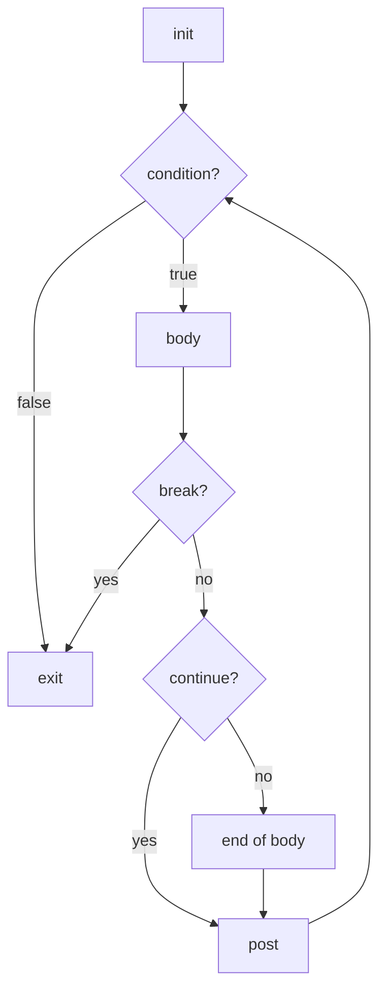
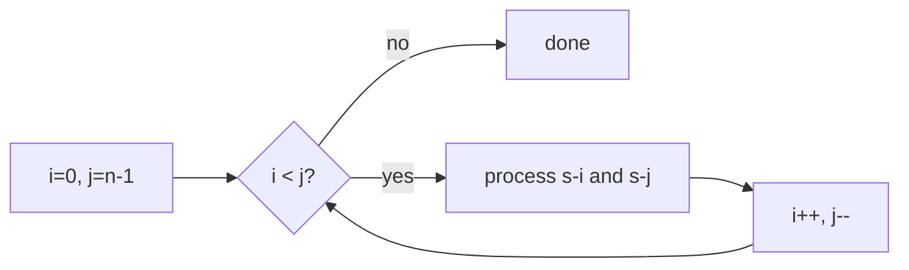

# Go for Loop (C-style) — Middle Level

## 1. Introduction

At the middle level, the C-style `for` loop goes beyond simple counting. You use it for algorithms, data structure operations, concurrent patterns, memory-efficient processing, and complex multi-variable iterations. Understanding the exact semantics of `continue`, `break`, labeled statements, and the interaction with goroutines is essential.

---

## 2. Prerequisites
- Solid understanding of Go slices, maps, and arrays
- Familiarity with goroutines and sync.WaitGroup
- Understanding of closures and variable capture
- Basic knowledge of Go's memory model

---

## 3. Glossary

| Term | Definition |
|------|-----------|
| Labeled break/continue | `break label` or `continue label` — targets a specific outer loop |
| Loop invariant | A condition that remains true throughout all loop iterations |
| Off-by-one error | Bug caused by using `<=` instead of `<` or vice versa |
| Loop unrolling | Compiler optimization that reduces loop overhead by expanding iterations |
| SIMD | Single Instruction Multiple Data — CPU instruction for parallel data operations |
| Variable capture | Closure capturing a loop variable by reference (common bug source) |
| Sentinel value | A special value that signals end of loop (e.g., -1 as "not found") |
| Stride | The step size between loop iterations |

---

## 4. Core Concepts

### 4.1 The Post Statement Runs Before Condition Re-check
Critical semantics: when `continue` is called, the post statement runs before the condition is re-evaluated.

```go
for i := 0; i < 5; i++ {
    if i == 2 { continue }
    fmt.Println(i)
    // For i=2: body skipped, but i++ runs → i becomes 3 → condition 3<5 checked
}
// Output: 0 1 3 4
```

### 4.2 Labeled Break and Continue
For nested loops, labels allow targeting specific outer loops:

```go
outer:
    for i := 0; i < 3; i++ {
        for j := 0; j < 3; j++ {
            if i+j >= 3 {
                continue outer  // go to next i (not next j)
            }
            fmt.Printf("(%d,%d) ", i, j)
        }
    }
// Output: (0,0) (0,1) (0,2) (1,0) (1,1) (2,0)
```

### 4.3 Multiple Assignments in Post Statement
Go allows multi-assignment in the post statement using the tuple-assignment form:

```go
// Swap-style iteration
for i, j := 0, len(s)-1; i < j; i, j = i+1, j-1 {
    s[i], s[j] = s[j], s[i]  // reverse a slice
}
```

### 4.4 Loop Variable in Goroutines (Classic Go Bug)
Go 1.21 fixed loop variable capture in `for range`, but C-style `for` still captures by reference:

```go
// BUG (all Go versions for C-style for):
for i := 0; i < 5; i++ {
    go func() { fmt.Println(i) }()  // all goroutines may print 5
}

// Fix: pass as parameter
for i := 0; i < 5; i++ {
    go func(i int) { fmt.Println(i) }(i)
}
```

---

## 5. Real-World Analogies

**Binary search**: A for loop with two pointers (`lo`, `hi`) converging — like two people searching a sorted shelf from both ends.

**Two-pointer technique**: Many string/array algorithms use `i, j` starting from opposite ends or at different speeds — directly maps to `for i, j := 0, n-1; i < j; i, j = i+1, j-1`.

---

## 6. Mental Models

**Model 1 — Two Pointer**
```
s = [1, 2, 3, 4, 5]
     ↑           ↑
     i=0         j=4
     
After i,j=i+1,j-1:
     i=1         j=3
          ↑   ↑
```

**Model 2 — Sliding Window**
```
s = [a b c d e f]
     [----]         window size 3
       [----]        shift right
         [----]       ...
```

---

## 7. Pros & Cons

### Pros
- Full control over init, condition, and post — versatile for algorithms
- Efficient index-based access
- Multi-variable post assignments enable elegant two-pointer patterns
- Labeled break/continue handle nested loop control cleanly

### Cons
- More verbose than `for range` for simple sequential iteration
- Easy to introduce off-by-one bugs
- Variable capture in goroutines is a common bug source
- Long for loops with complex conditions are hard to read

---

## 8. Use Cases

1. Binary search
2. Two-pointer algorithms (palindrome check, two-sum)
3. Sliding window
4. Sorting algorithms (bubble, insertion, selection)
5. Matrix processing
6. Multi-variable iteration (spiral traversal)
7. Retry with exponential backoff
8. Worker pools with indexed tasks

---

## 9. Code Examples

### Example 1 — Binary Search
```go
func binarySearch(sorted []int, target int) int {
    lo, hi := 0, len(sorted)-1
    for lo <= hi {
        mid := lo + (hi-lo)/2  // avoids integer overflow
        switch {
        case sorted[mid] == target:
            return mid
        case sorted[mid] < target:
            lo = mid + 1
        default:
            hi = mid - 1
        }
    }
    return -1
}
```

### Example 2 — Two-Pointer Palindrome Check
```go
func isPalindrome(s string) bool {
    for i, j := 0, len(s)-1; i < j; i, j = i+1, j-1 {
        if s[i] != s[j] {
            return false
        }
    }
    return true
}
```

### Example 3 — Sliding Window Maximum
```go
// Maximum sum subarray of size k
func maxSumSubarray(nums []int, k int) int {
    if len(nums) < k {
        return 0
    }
    windowSum := 0
    for i := 0; i < k; i++ {
        windowSum += nums[i]
    }
    maxSum := windowSum
    for i := k; i < len(nums); i++ {
        windowSum += nums[i] - nums[i-k]
        if windowSum > maxSum {
            maxSum = windowSum
        }
    }
    return maxSum
}
```

### Example 4 — Bubble Sort
```go
func bubbleSort(arr []int) {
    n := len(arr)
    for i := 0; i < n-1; i++ {
        for j := 0; j < n-1-i; j++ {
            if arr[j] > arr[j+1] {
                arr[j], arr[j+1] = arr[j+1], arr[j]
            }
        }
    }
}
```

### Example 5 — Labeled Continue for Nested Search
```go
func findPairs(nums []int, target int) [][]int {
    var pairs [][]int
outer:
    for i := 0; i < len(nums); i++ {
        for j := i + 1; j < len(nums); j++ {
            if nums[i]+nums[j] == target {
                pairs = append(pairs, []int{nums[i], nums[j]})
                continue outer  // move to next i
            }
        }
    }
    return pairs
}
```

### Example 6 — Retry with Exponential Backoff
```go
import (
    "math"
    "time"
)

func withExponentialBackoff(maxAttempts int, fn func() error) error {
    var err error
    for attempt := 0; attempt < maxAttempts; attempt++ {
        err = fn()
        if err == nil {
            return nil
        }
        if attempt < maxAttempts-1 {
            wait := time.Duration(math.Pow(2, float64(attempt))) * 100 * time.Millisecond
            time.Sleep(wait)
        }
    }
    return fmt.Errorf("all %d attempts failed, last error: %w", maxAttempts, err)
}
```

### Example 7 — Concurrent Worker Loop
```go
func processParallel(items []Item, workers int) {
    results := make(chan Result, len(items))
    var wg sync.WaitGroup

    batchSize := (len(items) + workers - 1) / workers
    for w := 0; w < workers; w++ {
        start := w * batchSize
        end := start + batchSize
        if end > len(items) {
            end = len(items)
        }
        wg.Add(1)
        go func(batch []Item) {
            defer wg.Done()
            for i := 0; i < len(batch); i++ {
                results <- process(batch[i])
            }
        }(items[start:end])
    }

    go func() {
        wg.Wait()
        close(results)
    }()

    for r := range results {
        handleResult(r)
    }
}
```

---

## 10. Coding Patterns

### Pattern 1 — Floyd's Cycle Detection
```go
func hasCycle(head *ListNode) bool {
    slow, fast := head, head
    for fast != nil && fast.Next != nil {
        slow = slow.Next
        fast = fast.Next.Next
        if slow == fast {
            return true
        }
    }
    return false
}
```

### Pattern 2 — In-Place Array Filtering
```go
// Remove elements matching predicate in-place
func filter(arr []int, keep func(int) bool) []int {
    j := 0
    for i := 0; i < len(arr); i++ {
        if keep(arr[i]) {
            arr[j] = arr[i]
            j++
        }
    }
    return arr[:j]
}
```

### Pattern 3 — Dutch National Flag (3-way partition)
```go
func sortColors(nums []int) {
    lo, mid, hi := 0, 0, len(nums)-1
    for mid <= hi {
        switch nums[mid] {
        case 0:
            nums[lo], nums[mid] = nums[mid], nums[lo]
            lo++
            mid++
        case 1:
            mid++
        case 2:
            nums[mid], nums[hi] = nums[hi], nums[mid]
            hi--
        }
    }
}
```

---

## 11. Clean Code Guidelines

1. **Named loop bounds**: Use constants or named variables.
2. **Keep loop bodies short**: Extract complex bodies to functions.
3. **Single responsibility per loop**: One loop should do one thing.
4. **Avoid multiple `continue`/`break`**: Hard to reason about. Restructure logic.
5. **Document non-obvious loop invariants**: Comment why the loop is correct.

```go
// Good: clear intent, named variables
const maxRetries = 3
for attempt := 0; attempt < maxRetries; attempt++ {
    if err := doWork(); err == nil {
        break
    }
    log.Printf("attempt %d failed, retrying...", attempt+1)
}

// Bad: magic numbers, unclear intent
for i := 0; i < 3; i++ {
    if doWork() == nil { break }
}
```

---

## 12. Product Use / Feature Example

**Rate limiter with burst:**
```go
type RateLimiter struct {
    tokens    int
    maxTokens int
    refillRate int // tokens per second
}

func (r *RateLimiter) ProcessBatch(requests []Request) []Response {
    responses := make([]Response, 0, len(requests))
    for i := 0; i < len(requests); {
        if r.tokens > 0 {
            responses = append(responses, process(requests[i]))
            r.tokens--
            i++
        } else {
            // Wait for token refill
            time.Sleep(time.Second / time.Duration(r.refillRate))
            r.tokens = min(r.tokens+1, r.maxTokens)
        }
    }
    return responses
}
```

---

## 13. Error Handling

```go
func processWithRecovery(items []int) (results []int, errs []error) {
    for i := 0; i < len(items); i++ {
        result, err := processItem(items[i])
        if err != nil {
            errs = append(errs, fmt.Errorf("item[%d]=%d: %w", i, items[i], err))
            continue  // continue despite error
        }
        results = append(results, result)
    }
    return
}
```

---

## 14. Security Considerations

1. **Input-length based loops**: Always validate that user-supplied lengths are reasonable.
2. **Integer overflow in loop bounds**: Use `int` on 64-bit systems, but check for negative lengths.
3. **Goroutine creation in loops**: Limit the number of goroutines spawned.

```go
// Dangerous: unbounded goroutine creation
for i := 0; i < len(userRequests); i++ {
    go handleRequest(userRequests[i])  // could create millions of goroutines
}

// Safe: use a semaphore / worker pool
sem := make(chan struct{}, 100)  // max 100 concurrent goroutines
for i := 0; i < len(userRequests); i++ {
    sem <- struct{}{}
    go func(r Request) {
        defer func() { <-sem }()
        handleRequest(r)
    }(userRequests[i])
}
```

---

## 15. Performance Tips

1. **Cache slice length**: `for i, n := 0, len(s); i < n; i++`
2. **Avoid bounds check elimination failures**: Access `s[i]` predictably.
3. **Prefer iterating forward**: Better CPU prefetch and cache behavior.
4. **Avoid allocations in loop body**: Pre-allocate slices/maps outside.
5. **Consider SIMD-friendly patterns**: Operate on fixed-size chunks for compiler vectorization.

```go
// Cache length — helpful for non-trivial slices
func sum(s []int64) int64 {
    var total int64
    for i, n := 0, len(s); i < n; i++ {
        total += s[i]
    }
    return total
}
```

---

## 16. Metrics & Analytics

```go
type LoopMetrics struct {
    Iterations   int64
    Breaks       int64
    Continues    int64
    Duration     time.Duration
}

func processWithMetrics(items []int) ([]int, LoopMetrics) {
    var m LoopMetrics
    start := time.Now()
    results := make([]int, 0, len(items))
    for i := 0; i < len(items); i++ {
        m.Iterations++
        if items[i] < 0 {
            m.Continues++
            continue
        }
        if items[i] > 1000 {
            m.Breaks++
            break
        }
        results = append(results, items[i]*2)
    }
    m.Duration = time.Since(start)
    return results, m
}
```

---

## 17. Best Practices

1. Use C-style for when you need index arithmetic.
2. Use `for range` when you just need values sequentially.
3. Cache `len()` for loops that access the slice/array.
4. Use labeled break/continue for nested loops — never `goto`.
5. Always pass loop variables explicitly to goroutines.
6. Pre-allocate result slices before the loop: `result := make([]T, 0, len(input))`.

---

## 18. Edge Cases & Pitfalls

### Pitfall 1 — Modifying the slice while iterating
```go
s := []int{1, 2, 3, 4, 5}
for i := 0; i < len(s); i++ {
    if s[i]%2 == 0 {
        s = append(s[:i], s[i+1:]...) // BUG: skip next element after removal
        // i-- needed to not skip the shifted element
    }
}
```

### Pitfall 2 — Unsigned integer underflow in condition
```go
var n uint = 5
for i := n - 1; i >= 0; i-- {  // BUG: when i=0, i-- wraps to max uint!
    fmt.Println(i)
}
// Fix: use int, or reverse the loop logic
```

### Pitfall 3 — Label applies to the entire for statement
```go
// WRONG mental model: break label exits the labeled block
// CORRECT: break label exits the labeled FOR statement

loop:
    for i := 0; i < 3; i++ {
        for j := 0; j < 3; j++ {
            break loop  // exits the OUTER for loop (i loop)
        }
    }
```

---

## 19. Common Mistakes

| Mistake | Fix |
|---------|-----|
| `i <= len(s)` | Use `i < len(s)` |
| Goroutine captures `i` | Pass `i` as function argument |
| Unsigned underflow in countdown | Use `int` for loop variables |
| Modifying slice length in loop | Cache length or iterate in reverse when removing |
| break in switch inside for | Use labeled break to exit for |
| `continue` goes to body start | `continue` goes to post statement |

---

## 20. Common Misconceptions

**Misconception**: "`continue` re-evaluates from the body start"
**Truth**: `continue` goes to the post statement first, then the condition.

**Misconception**: "Labels are like `goto` targets"
**Truth**: Labels are attached to `for`/`switch`/`select` statements. `break label` exits the labeled statement. `continue label` goes to the next iteration of the labeled for.

---

## 21. Tricky Points

1. In `for i, j := 0, n; i < j; i, j = i+1, j-1`, the post statement is a parallel assignment — both `i` and `j` use the values before the assignment.
2. `for` with no post statement is valid: `for i := 0; i < n; { i++ }`.
3. The blank identifier in for: `for _ = 0; _ < n; _ = _+1` — not idiomatic but valid.
4. `for range s` without variables is valid (just iterates): `for range s { count++ }`.

---

## 22. Test

```go
func TestBinarySearch(t *testing.T) {
    tests := []struct {
        arr    []int
        target int
        want   int
    }{
        {[]int{1, 3, 5, 7, 9}, 5, 2},
        {[]int{1, 3, 5, 7, 9}, 1, 0},
        {[]int{1, 3, 5, 7, 9}, 9, 4},
        {[]int{1, 3, 5, 7, 9}, 4, -1},
        {[]int{}, 1, -1},
    }
    for _, tt := range tests {
        got := binarySearch(tt.arr, tt.target)
        if got != tt.want {
            t.Errorf("binarySearch(%v, %d) = %d; want %d", tt.arr, tt.target, got, tt.want)
        }
    }
}
```

---

## 23. Tricky Questions

**Q1**: What is the output?
```go
for i := 0; i < 3; i++ {
    defer fmt.Println(i)
}
```
**A**: `2 1 0` — defers are pushed onto a stack (LIFO). At the time of `defer`, `i` has the current value (not a pointer), so 0, 1, 2 are captured. Deferred calls run in reverse: 2, 1, 0.

**Q2**: What happens?
```go
s := []int{1, 2, 3}
for i := 0; i < len(s); i++ {
    s = append(s, i*10)
    if i > 10 { break }
}
```
**A**: This loop terminates because `len(s)` is re-evaluated each iteration. As we append, `len(s)` grows. The loop runs until `i > 10` triggers `break` at i=11.

---

## 24. Cheat Sheet

```
// Two-pointer
for i, j := 0, n-1; i < j; i, j = i+1, j-1 { }

// Step by k
for i := 0; i < n; i += k { }

// Binary search
lo, hi := 0, n-1
for lo <= hi { mid := lo+(hi-lo)/2; ... }

// Labeled break
outer:
for i := ...; {
    for j := ...; {
        break outer    // exits outer for
        continue outer // next i
    }
}

// Goroutine-safe
for i := 0; i < n; i++ {
    go func(i int) { use(i) }(i)
}
```

---

## 25. Self-Assessment Checklist

- [ ] I understand that `continue` goes to the post statement
- [ ] I can implement binary search correctly
- [ ] I know how to use labeled break/continue
- [ ] I understand the goroutine variable capture bug and fix
- [ ] I can write a two-pointer loop
- [ ] I know when to use C-style for vs for range
- [ ] I can implement in-place array filtering
- [ ] I understand unsigned integer underflow in loops

---

## 26. Summary

At the middle level, the C-style for loop is a versatile algorithmic tool. Key patterns: two-pointer, binary search, sliding window, Dutch national flag, in-place filtering. Key semantics: `continue` goes to the post statement; labeled break/continue target specific outer loops; goroutine variable capture requires passing `i` as a function argument. Performance: cache `len()`, avoid allocations in loop bodies, use parallel assignment in post for multi-variable loops.

---

## 27. What You Can Build

- Sorting algorithm library
- String processing utilities
- Binary search tree operations
- Matrix multiplication
- Rate limiter
- Concurrent batch processor
- Retry middleware

---

## 28. Further Reading

- [Go Specification — For statements](https://go.dev/ref/spec#For_statements)
- [Go Blog — Go 1.22: loop variable fix](https://go.dev/blog/loopvar-preview)
- [Effective Go — For](https://go.dev/doc/effective_go#for)
- [The Go Memory Model](https://go.dev/ref/mem)

---

## 29. Related Topics

- `for range` loop
- Goroutines and variable capture
- Labeled statements
- Sorting algorithms
- Two-pointer and sliding window techniques

---

## 30. Diagrams & Visual Aids





---

## 31. Evolution & Historical Context

The C-style `for` loop traces back to BCPL (1967) and C (1972). Go inherited it but with Go-specific semantics: no `while` or `do-while` keywords, all three components optional, and multiple assignment support in init/post. Go 1.22 (2024) changed `for range` variable semantics to prevent goroutine capture bugs — though C-style `for` still requires manual fixes.

---

## 32. Alternative Approaches

### For Loop vs For Range
```go
s := []int{1, 2, 3, 4, 5}

// C-style: verbose but gives full control
for i := 0; i < len(s); i++ {
    fmt.Println(s[i])
}

// Range: cleaner for sequential iteration
for i, v := range s {
    fmt.Println(i, v)
}

// Use C-style when:
// - You need to skip elements
// - You're doing two-pointer operations
// - Step size != 1
// - You need to modify the index mid-loop
```

---

## 33. Anti-Patterns

1. **God loop**: One loop doing too many things — split into multiple passes.
2. **Loop with all logic in condition**: `for doWork() != nil { }` — hard to debug.
3. **Nested 4+ level loops**: Extract inner loops to functions.
4. **Re-allocating in loop body**: `result = append(result, make([]T, n)...)` — pre-allocate.

---

## 34. Debugging Guide

1. **Infinite loop**: Add a counter with a max and panic/break to diagnose.
2. **Wrong output**: Add `fmt.Printf("i=%d val=%v\n", i, s[i])` in the body.
3. **Panic on index**: Check bounds: `if i >= len(s) { panic(...) }`.
4. **Goroutine leak**: Use `go-leak` or check `runtime.NumGoroutine()`.

---

## 35. Comparison with Other Languages

| Feature | Go | C | Java | Python |
|---------|-----|---|------|--------|
| Syntax | `for i:=0; i<n; i++` | `for(int i=0;i<n;i++)` | Same as C | No C-style for |
| Multiple vars | `i,j=i+1,j-1` | `i++,j--` | Same as C | `zip(range,range)` |
| Labeled break | Yes | No | Yes | No |
| While-style | `for cond {}` | `while(cond){}` | `while(cond){}` | `while cond:` |
| Infinite | `for {}` | `for(;;){}` | `while(true){}` | `while True:` |
| Range | `for range` | No | `for(T v:arr)` | `for v in arr:` |
