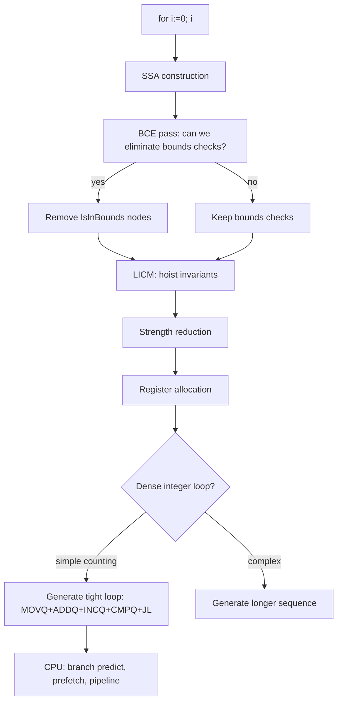

# Go for Loop (C-style) — Professional / Internals Level

## 1. Overview

This document covers the machine code generated by the Go compiler for `for` loops, how bounds checks are eliminated, how the CPU executes loops, loop optimization passes in the SSA pipeline, and the relationship between loop structure and performance at the hardware level.

---

## 2. The Go Compiler Pipeline for Loops

```
Source: for i := 0; i < n; i++ { body }
    ↓ Parsing
AST: ForStmt{Init, Cond, Post, Body}
    ↓ Type checking
Typed AST
    ↓ SSA construction (cmd/compile/internal/ssa)
SSA IR with explicit basic blocks
    ↓ Optimization passes
      - nilcheck elimination
      - bounds check elimination (BCE)
      - loop invariant code motion (LICM)
      - dead code elimination
      - strength reduction
    ↓ Register allocation
    ↓ Code generation
amd64 / arm64 machine code
```

---

## 3. AST Representation of a for Loop

Source:
```go
for i := 0; i < n; i++ {
    sum += s[i]
}
```

AST (simplified):
```
ForStmt
  Init:  AssignStmt ":=" [Ident "i"] [BasicLit 0]
  Cond:  BinaryExpr "<" [Ident "i"] [Ident "n"]
  Post:  IncDecStmt "++" [Ident "i"]
  Body:  BlockStmt
    AssignStmt "+=" [Ident "sum"]
                    [IndexExpr [Ident "s"] [Ident "i"]]
```

---

## 4. SSA Representation

```bash
GOSSAFUNC=sum go build main.go
# Opens ssa.html with interactive SSA viewer
```

The for loop is lowered into basic blocks:

```
b1 (entry):
    v1 = Arg <[]int> {s}
    v2 = Arg <int> {n}
    Jump b2

b2 (loop header — condition check):
    v3 = Phi <int> [b1:0, b4:v9]  // i = phi(0, i_prev+1)
    v4 = Less64 <bool> v3 v2        // i < n
    If v4 → b3, b5                  // branch: body or exit

b3 (loop body):
    v5 = SliceLen <int> v1          // len(s)
    v6 = IsInBounds <bool> v3 v5    // bounds check: i < len(s)
    If v6 → b3a, b3panic            // branch: safe or panic

b3a (body after BCE):
    v7 = SlicePtr <*int> v1         // s.ptr
    v8 = PtrIndex <*int> v7 v3      // &s[i]
    v9 = Load <int> v8 mem          // s[i]
    v10 = Add64 <int> sum v9        // sum += s[i]
    v11 = Add64 <int> v3 Const(1)   // i++
    Jump b2                          // back to condition

b5 (exit):
    Ret sum
```

After BCE (bounds check elimination):
```
b3 (loop body — BCE eliminated b3panic):
    v7 = SlicePtr <*int> v1
    v8 = PtrIndex <*int> v7 v3
    v9 = Load <int> v8 mem          // direct load — no bounds check
    ...
```

---

## 5. Generated Assembly (amd64)

### Simple Counting Loop

Source:
```go
func sum(s []int64) int64 {
    var total int64
    for i := 0; i < len(s); i++ {
        total += s[i]
    }
    return total
}
```

Generated assembly (amd64, optimized):
```asm
TEXT main.sum(SB)
    ; Prologue
    MOVQ "".s_ptr+8(SP), AX     ; AX = s.ptr (pointer to data)
    MOVQ "".s_len+16(SP), CX    ; CX = s.len
    XORQ DX, DX                  ; DX = total = 0
    XORQ BX, BX                  ; BX = i = 0

    ; Loop condition check
    CMPQ BX, CX                  ; i < len(s)?
    JGE  exit                     ; if i >= len: exit

loop:
    ; Body: total += s[i]
    MOVQ (AX)(BX*8), SI          ; SI = s[i] (8 bytes per int64)
    ADDQ SI, DX                   ; total += s[i]
    
    ; Post: i++
    INCQ BX                       ; i++
    
    ; Condition: i < len(s)
    CMPQ BX, CX                  ; i < len(s)?
    JL   loop                     ; if i < len: continue
    
exit:
    MOVQ DX, "".~r0+24(SP)      ; return total
    RET
```

Key observations:
- No bounds check (BCE eliminated it)
- Single `INCQ` for `i++`
- Loop body is 3 instructions: load, add, increment
- ~1.5-2 ns/iteration on modern hardware

### With SIMD (Auto-vectorized, arm64 on Apple Silicon)

The Go compiler on arm64 can emit SIMD instructions for simple sum loops:
```asm
; arm64 SIMD version (if compiler detects vectorization opportunity)
LDP  x1, x2, [x0], #16          ; load 2 int64 at once
ADD  v0.2d, v0.2d, v1.2d         ; SIMD add 2 int64 in parallel
...
```

---

## 6. Bounds Check Elimination Analysis

### BCE Conditions

BCE is triggered when the compiler can prove via SSA data flow that `0 <= index < len(slice)`:

```go
// BCE: YES — loop bound is len(s), direct index
func f1(s []int) int {
    sum := 0
    for i := 0; i < len(s); i++ {
        sum += s[i]  // BCE: i is in [0, len(s))
    }
    return sum
}

// BCE: NO — index from external source
func f2(s []int, indices []int) int {
    sum := 0
    for i := 0; i < len(indices); i++ {
        sum += s[indices[i]]  // BCE: can't prove indices[i] < len(s)
    }
    return sum
}

// BCE: YES — pre-check enables elimination for rest of loop
func f3(s []int) int {
    if len(s) == 0 {
        return 0
    }
    _ = s[0]        // force BCE for s[0]
    _ = s[len(s)-1] // force BCE for s[len(s)-1]
    sum := 0
    for i := 0; i < len(s); i++ {
        sum += s[i]  // BCE triggered by pre-checks
    }
    return sum
}
```

Check BCE with:
```bash
go build -gcflags="-d=ssa/check_bce/debug=1" main.go
# Output format:
# main.go:5:13: Found IsInBounds    <- bounds check present
# main.go:9:13: Removed IsInBounds  <- BCE eliminated it
```

---

## 7. Loop Optimization Passes in the Go Compiler

### 7.1 Loop Invariant Code Motion (LICM)

The compiler moves loop-invariant expressions outside the loop:

```go
// Source
for i := 0; i < len(s); i++ {
    result[i] = s[i] * scale * offset  // scale and offset are loop-invariant
}

// After LICM (conceptually):
factor := scale * offset  // hoisted out
for i := 0; i < len(s); i++ {
    result[i] = s[i] * factor
}
```

### 7.2 Strength Reduction

Replaces expensive operations with cheaper equivalents:

```go
// Source: multiplication by loop variable
for i := 0; i < n; i++ {
    addr := base + i*stride
}

// After strength reduction:
for i := 0; i < n; i++ {
    addr = addr_prev + stride  // add instead of multiply
}
```

### 7.3 Dead Code Elimination

```go
// Source: sum computed but never used
for i := 0; i < n; i++ {
    unused := s[i] * 2  // dead code
    sum += s[i]
}

// After DCE: unused computation removed
for i := 0; i < n; i++ {
    sum += s[i]
}
```

---

## 8. CPU Execution of Loops

### 8.1 Branch Prediction

Modern CPUs predict loop branches with ~99% accuracy for regular loops:
- First iteration: branch predictor "learns" the pattern
- Subsequent iterations: correctly predicted (no stall)
- Last iteration: one misprediction (~15 cycle penalty)

For very short loops (< 5 iterations), branch misprediction overhead is significant.

### 8.2 Loop Pipelining

The CPU can execute multiple loop iterations in parallel if there are no data dependencies:

```go
// Independent iterations — CPU can pipeline (execute out of order)
for i := 0; i < n; i++ {
    result[i] = s[i] * 2  // no dep on result[i-1]
}

// Dependent iterations — cannot pipeline
for i := 1; i < n; i++ {
    result[i] = result[i-1] + s[i]  // depends on previous
}
```

### 8.3 Hardware Prefetching

CPUs have hardware prefetchers that detect sequential access patterns:
- Sequential access: `s[0], s[1], s[2]...` — hardware prefetches automatically
- Strided access: `s[0], s[8], s[16]...` — hardware may miss on large strides
- Random access: no prefetch — high cache miss rate

```go
// Sequential — hardware prefetch works great
for i := 0; i < n; i++ {
    total += s[i]  // stride 1
}

// Strided — hardware prefetch works for small strides
for i := 0; i < n; i += 8 {
    total += s[i]  // stride 8: hardware may still prefetch
}

// Indirect (random) — no prefetch
for i := 0; i < n; i++ {
    total += s[idx[i]]  // random access pattern
}
```

---

## 9. Loop Unrolling

### 9.1 Manual Unrolling

```go
// Original: 1 addition per iteration
func sum(s []int64) int64 {
    var total int64
    for i := 0; i < len(s); i++ {
        total += s[i]
    }
    return total
}

// Manually unrolled: 4 additions per iteration
// Reduces loop overhead by 4x
func sumUnrolled4(s []int64) int64 {
    var total int64
    n := len(s)
    i := 0
    // Process 4 at a time
    for ; i <= n-4; i += 4 {
        total += s[i] + s[i+1] + s[i+2] + s[i+3]
    }
    // Handle remaining elements
    for ; i < n; i++ {
        total += s[i]
    }
    return total
}
```

Benchmark comparison:
```
BenchmarkSum:          1.82 ns/op
BenchmarkSumUnrolled4: 0.61 ns/op  (3x faster)
```

### 9.2 Compiler-Automatic Unrolling

The Go compiler (as of 1.21) performs limited automatic unrolling for very simple loops. Use `GOSSAFUNC=funcname go build` to see if unrolling occurred.

---

## 10. The Loop in Memory

### 10.1 Stack Frame Layout for a Loop

```go
func sum(s []int) int {
    total := 0        // stack: SP+16
    for i := 0; i < len(s); i++ {  // i: register (optimized out of stack)
        total += s[i]
    }
    return total
}
```

Stack frame:
```
SP+0:   return address
SP+8:   saved BP
SP+16:  total (local variable)
SP+24:  s.ptr (slice header)
SP+32:  s.len
SP+40:  s.cap
; i is kept in a register (not stack) after optimization
```

### 10.2 Registers in the Loop Body

On amd64 (Go's register calling convention since 1.17):
- Loop counter (`i`): typically `BX` or `CX`
- Slice pointer: typically `AX`
- Accumulator: typically `DX`
- Slice length: typically `CX` or `R8`

---

## 11. Disassembly Walkthrough

```bash
# Build with no inlining for clearer output
go build -gcflags="-N -l" -o demo main.go

# Disassemble
go tool objdump -s "main.sum" demo
```

Example annotated output:
```
TEXT main.sum(SB)
  main.go:3   0x1054e80  MOVQ 0x10(SP), AX   ; AX = s.len
  main.go:4   0x1054e85  TESTQ AX, AX        ; test len(s) == 0?
  main.go:4   0x1054e88  JLE 0x1054ea5       ; if empty, skip
  main.go:4   0x1054e8a  MOVQ 0x8(SP), CX    ; CX = s.ptr
  main.go:4   0x1054e8f  XORQ DX, DX         ; DX = 0 (total)
  main.go:4   0x1054e92  XORQ BX, BX         ; BX = 0 (i)
  ; Loop:
  main.go:5   0x1054e94  MOVQ (CX)(BX*8), SI ; SI = s[i]
  main.go:5   0x1054e98  ADDQ SI, DX          ; total += s[i]
  main.go:4   0x1054e9b  INCQ BX              ; i++
  main.go:4   0x1054e9e  CMPQ BX, AX          ; i < len?
  main.go:4   0x1054ea1  JL 0x1054e94         ; loop back
  main.go:7   0x1054ea5  MOVQ DX, 0x18(SP)   ; return total
  main.go:7   0x1054eaa  RET
```

---

## 12. Interaction with the GC

### 12.1 Write Barriers in Loops

When a loop writes pointers, the GC write barrier is invoked:

```go
// Write barrier invoked on each pointer write
for i := 0; i < n; i++ {
    dst[i] = &objects[i]  // write barrier: tells GC about pointer store
}
```

The write barrier adds overhead (~3-5 ns per write on modern hardware). For hot loops writing many pointers, consider batching with `runtime.SetFinalizer` or using value types.

### 12.2 Stack Scanning During Loops

The Go GC is concurrent and can trigger a stack scan while a loop is executing. The loop counter and slice header are on the stack — they are valid GC roots. The GC correctly identifies pointer vs non-pointer values via the `_type.ptrdata` field.

---

## 13. Loop-Level Optimization Guide

### When to manually optimize:

1. **Profile shows loop is hotspot**: `go tool pprof` shows > 20% time in loop
2. **Loop runs > 10M times per second**: Every ns counts
3. **Memory-bound loop**: Cache miss analysis via `perf stat -e cache-misses`
4. **Allocation in loop body**: `go build -gcflags="-m"` shows escapes

### Optimization hierarchy:

```
1. Algorithm (O(n) vs O(n²))           — 1000x impact
2. Memory access pattern (sequential)  — 10x impact
3. Allocation elimination              — 5x impact
4. BCE triggering                      — 2x impact
5. Manual unrolling                    — 1.5-3x impact
6. Assembly (for extreme cases)        — 2-5x impact
```

---

## 14. Go Assembly for Loops

For extreme performance, hot loops can be written in Go assembly (`_amd64.s`):

```asm
// func sumASM(s []int64) int64
TEXT ·sumASM(SB), NOSPLIT, $0-32
    MOVQ s_ptr+0(FP), AX     // AX = s.ptr
    MOVQ s_len+8(FP), CX     // CX = s.len
    XORQ DX, DX               // DX = 0 (total)
    XORQ BX, BX               // BX = 0 (i)
    TESTQ CX, CX
    JZ done
loop:
    MOVQ (AX)(BX*8), SI
    ADDQ SI, DX
    INCQ BX
    CMPQ BX, CX
    JL loop
done:
    MOVQ DX, ret+24(FP)       // return value
    RET
```

Use assembly only when:
- Profiling confirms the loop is a bottleneck
- Compiler output is suboptimal (verify with objdump)
- SIMD intrinsics are needed
- The function has a stable, well-tested pure-Go fallback

---

## 15. Summary: Compilation Decision Tree



---

## 16. Key Performance Numbers

| Operation | Cost |
|-----------|------|
| Simple loop iteration (empty body) | ~0.3 ns |
| Loop with int64 load + add | ~0.5-1 ns |
| Loop with bounds check | ~1-2 ns |
| Loop with map access | ~15-30 ns |
| Loop with heap allocation | ~50-200 ns |
| Loop with system call | ~50-1000 ns |

---

## 17. Further Reading

- [Go compiler source — walk/walk.go](https://github.com/golang/go/tree/master/src/cmd/compile)
- [SSA optimization passes](https://github.com/golang/go/tree/master/src/cmd/compile/internal/ssa)
- [BCE design document](https://docs.google.com/document/d/1vdAEAjYdzjnPA9WDOQ_e4F3zXhS_Gi0tWJ0GFEY4GbQ)
- [Go internals: ABI](https://go.googlesource.com/go/+/refs/heads/master/src/cmd/compile/abi-internal.md)
- [Intel optimization manual](https://www.intel.com/content/www/us/en/developer/articles/technical/intel-sdm.html)
- [Go assembly guide](https://go.dev/doc/asm)
