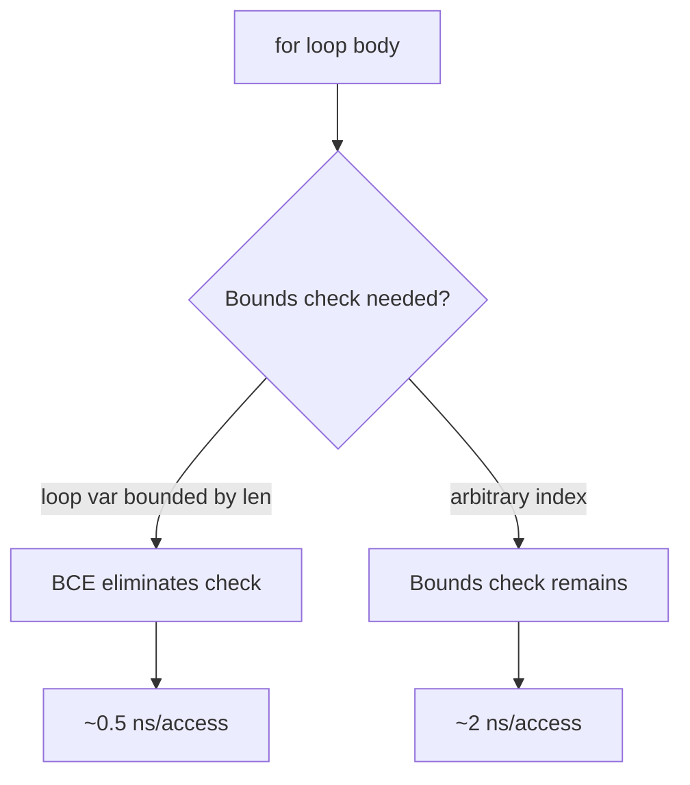
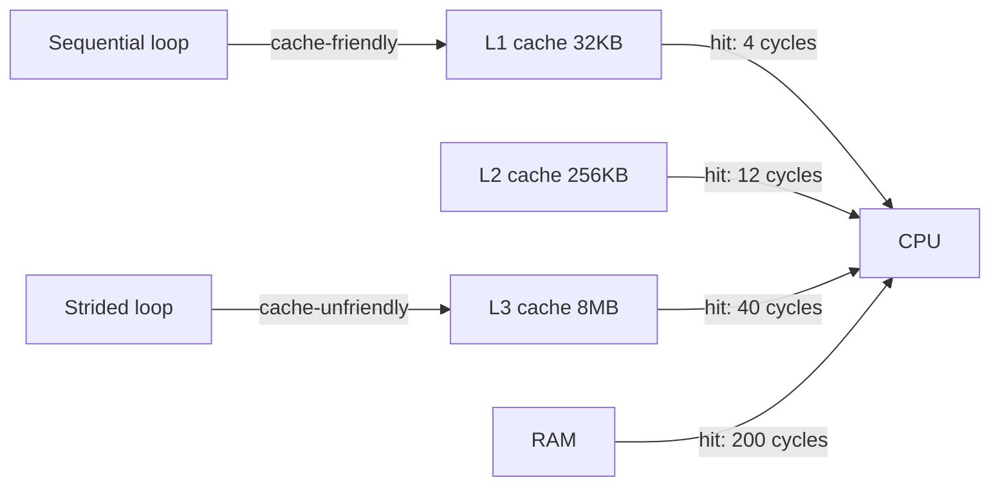

# Go for Loop (C-style) — Senior Level

## 1. Overview

Senior-level mastery of the `for` loop means understanding how it compiles, where it creates allocations, how the CPU executes it, and how to design systems that use loops safely in concurrent contexts. You understand loop escape analysis, bounds check elimination, SIMD vectorization opportunities, and the production incidents that arise from misuse.

---

## 2. Advanced Semantics

### 2.1 Loop Variable Semantics in Go 1.22+
Go 1.22 changed `for range` to create a new variable per iteration. C-style `for` was NOT changed — it still shares one variable across all iterations.

```go
// Go 1.22+ — for range: new var per iteration (safe for goroutines)
for i, v := range slice {
    go func() { fmt.Println(v) }()  // safe: v is per-iteration
}

// Go 1.22+ — C-style for: still shared variable (same as before)
for i := 0; i < n; i++ {
    go func() { fmt.Println(i) }()  // still UNSAFE: all print n
}

// Fix for C-style:
for i := 0; i < n; i++ {
    i := i  // shadow with new variable (pre-1.22 idiom)
    go func() { fmt.Println(i) }()
}
```

### 2.2 Bounds Check Elimination (BCE)
The Go compiler eliminates redundant bounds checks when it can prove the index is safe:

```go
// BCE: compiler can prove i < len(s) at access time
func sum(s []int64) int64 {
    var total int64
    for i := 0; i < len(s); i++ {
        total += s[i]  // bounds check eliminated
    }
    return total
}

// BCE fails: compiler cannot prove idx is safe
func sumUnsafe(s []int64, indices []int) int64 {
    var total int64
    for i := 0; i < len(indices); i++ {
        total += s[indices[i]]  // bounds check NOT eliminated
    }
    return total
}
```

Check with: `go build -gcflags="-d=ssa/check_bce/debug=1" ./...`

### 2.3 Loop Unrolling
The Go compiler performs limited loop unrolling for simple counting loops. LLVM-based backends (WebAssembly, etc.) are more aggressive. For critical loops, manual unrolling can help:

```go
// Unrolled sum — processes 4 elements per iteration
func sumUnrolled(s []int64) int64 {
    var total int64
    n := len(s)
    i := 0
    for ; i <= n-4; i += 4 {
        total += s[i] + s[i+1] + s[i+2] + s[i+3]
    }
    for ; i < n; i++ {
        total += s[i]  // handle remainder
    }
    return total
}
```

---

## 3. Postmortems & System Failures

### Incident 1 — Goroutine Leak from Infinite for Loop

**System**: Message processing service
**Cause**: A `for` loop with a channel read had no exit condition:
```go
// BUG: goroutine never exits if ch is never closed
go func() {
    for {
        msg := <-ch  // blocks forever if ch empty and never closed
        process(msg)
    }
}()
```
After a config change closed the channel source but not the channel itself, 50,000 goroutines accumulated, consuming ~100MB of stack memory.

**Fix**: Always handle channel close:
```go
go func() {
    for {
        msg, ok := <-ch
        if !ok {
            return  // channel closed — exit goroutine
        }
        process(msg)
    }
}()
```
**Lesson**: Every infinite `for {}` loop must have a clearly reachable exit condition.

### Incident 2 — Integer Overflow in Loop Bound

**System**: Financial calculation service
**Cause**: Loop processing daily transactions used `int32` for the item count. With > 2.1 billion transactions (edge case), the bound overflowed to negative, and the loop ran zero times — silently producing wrong totals.

```go
var count int32 = largeValue  // overflow: wraps to negative
for i := int32(0); i < count; i++ {
    // Never executes when count is negative!
}
```

**Fix**: Use `int` (platform-native, 64-bit on modern systems) for loop bounds.
**Lesson**: Always use `int` for loop counters unless there's a specific reason for `int32`/`int64`.

### Incident 3 — O(n²) Loop in Request Handler

**System**: E-commerce search service
**Cause**: A nested for loop comparing every item in a cart against every item in a discount list. With large carts and many discounts, this became O(n²):

```go
// O(n*m) — acceptable at scale?
for i := 0; i < len(cart); i++ {
    for j := 0; j < len(discounts); j++ {
        if cart[i].SKU == discounts[j].SKU {
            cart[i].Price *= discounts[j].Multiplier
        }
    }
}
// With 1000 items × 500 discounts = 500,000 comparisons per request
// At 10,000 req/s = 5 billion comparisons per second
```

**Fix**: Pre-build a `map[string]float64` discount lookup — O(n+m) total.
**Lesson**: Profile nested loops. O(n²) is usually acceptable only for small N (< 1000).

---

## 4. Performance Optimization

### 4.1 Benchmarking Loop Variants

```go
package bench

import "testing"

var globalSum int64

func BenchmarkSumForward(b *testing.B) {
    s := make([]int64, 1000)
    b.ResetTimer()
    for n := 0; n < b.N; n++ {
        var sum int64
        for i := 0; i < len(s); i++ {
            sum += s[i]
        }
        globalSum = sum
    }
}

func BenchmarkSumRange(b *testing.B) {
    s := make([]int64, 1000)
    b.ResetTimer()
    for n := 0; n < b.N; n++ {
        var sum int64
        for _, v := range s {
            sum += v
        }
        globalSum = sum
    }
}

// Typical: virtually identical — compiler generates same code
```

### 4.2 SIMD-Friendly Loops
The Go compiler can auto-vectorize simple loops:

```go
// Vectorizable: simple arithmetic, no data dependencies
func addSlices(dst, src []float32) {
    for i := 0; i < len(dst) && i < len(src); i++ {
        dst[i] += src[i]
    }
}
// Compiler may emit SIMD instructions (SSE2/AVX2)

// Not vectorizable: conditional access
func conditionalAdd(dst, src []float32, mask []bool) {
    for i := 0; i < len(dst); i++ {
        if mask[i] {
            dst[i] += src[i]  // branch prevents vectorization
        }
    }
}
```

### 4.3 Cache-Friendly Access Patterns

```go
// Cache-friendly: row-major access (Go stores arrays row-major)
func rowMajorSum(matrix [][]float64, rows, cols int) float64 {
    var sum float64
    for i := 0; i < rows; i++ {
        for j := 0; j < cols; j++ {
            sum += matrix[i][j]  // sequential memory access
        }
    }
    return sum
}

// Cache-unfriendly: column-major access
func colMajorSum(matrix [][]float64, rows, cols int) float64 {
    var sum float64
    for j := 0; j < cols; j++ {
        for i := 0; i < rows; i++ {
            sum += matrix[i][j]  // strided access — cache misses!
        }
    }
    return sum
}

// For a 1000x1000 matrix, rowMajorSum is ~5x faster
```

### 4.4 Eliminating Allocations in Loops

```go
// Bad: allocates in loop body
func processItems(items []Item) []Result {
    var results []Result
    for i := 0; i < len(items); i++ {
        result := Result{  // allocation each iteration
            ID:    items[i].ID,
            Value: compute(items[i]),
        }
        results = append(results, result)
    }
    return results
}

// Good: pre-allocate, append is amortized
func processItemsFast(items []Item) []Result {
    results := make([]Result, 0, len(items))  // pre-allocate
    for i := 0; i < len(items); i++ {
        results = append(results, Result{
            ID:    items[i].ID,
            Value: compute(items[i]),
        })
    }
    return results
}
```

---

## 5. Compiler Analysis

```bash
# View assembly for a loop
go tool compile -S loop.go | grep -A 20 "func sum"

# Check bounds check elimination
go build -gcflags="-d=ssa/check_bce/debug=1" ./...

# Check escape analysis
go build -gcflags="-m -m" ./...

# SSA viewer
GOSSAFUNC=sum go build loop.go
```

Example BCE output:
```
./loop.go:5:13: Found IsInBounds  # bounds check present
./loop.go:8:13: Removed IsInBounds # BCE eliminated it
```

---

## 6. Production Patterns

### 6.1 Concurrent Index-Based Work Distribution

```go
func parallelMap(input []int, transform func(int) int, numWorkers int) []int {
    output := make([]int, len(input))
    var wg sync.WaitGroup
    chunkSize := (len(input) + numWorkers - 1) / numWorkers

    for w := 0; w < numWorkers; w++ {
        lo := w * chunkSize
        hi := lo + chunkSize
        if hi > len(input) {
            hi = len(input)
        }
        if lo >= hi {
            break
        }
        wg.Add(1)
        go func(lo, hi int) {
            defer wg.Done()
            for i := lo; i < hi; i++ {
                output[i] = transform(input[i])
            }
        }(lo, hi)  // pass bounds explicitly
    }
    wg.Wait()
    return output
}
```

### 6.2 Adaptive Loop with Context Cancellation

```go
func processWithContext(ctx context.Context, items []Item) error {
    checkInterval := 100  // check context every N iterations
    for i := 0; i < len(items); i++ {
        if i%checkInterval == 0 {
            select {
            case <-ctx.Done():
                return fmt.Errorf("cancelled at item %d: %w", i, ctx.Err())
            default:
            }
        }
        if err := processItem(items[i]); err != nil {
            return fmt.Errorf("item[%d]: %w", i, err)
        }
    }
    return nil
}
```

### 6.3 Pipeline Processing

```go
func pipeline(input [][]byte, stages []func([]byte) []byte) [][]byte {
    result := make([][]byte, len(input))
    copy(result, input)
    for s := 0; s < len(stages); s++ {
        for i := 0; i < len(result); i++ {
            result[i] = stages[s](result[i])
        }
    }
    return result
}
```

---

## 7. Profiling for Loops

### 7.1 CPU Profile Analysis

```go
import (
    "os"
    "runtime/pprof"
)

f, _ := os.Create("cpu.prof")
pprof.StartCPUProfile(f)
// Run loop-heavy workload
pprof.StopCPUProfile()
```

```bash
go tool pprof cpu.prof
(pprof) list FunctionName
# Shows per-line samples in the loop
```

### 7.2 What to Look for
- **High samples in loop condition**: May indicate expensive condition evaluation
- **High samples in loop body**: Normal — the work is there
- **Repeated samples at `append`**: Pre-allocate
- **Samples at `runtime.growslice`**: Pre-allocate with `make([]T, 0, cap)`

---

## 8. Testing Strategies

### 8.1 Loop Invariant Testing

```go
func TestLoopInvariant_TwoPointerReverse(t *testing.T) {
    testCases := []struct {
        input []int
        want  []int
    }{
        {[]int{1, 2, 3, 4, 5}, []int{5, 4, 3, 2, 1}},
        {[]int{1}, []int{1}},
        {[]int{}, []int{}},
        {[]int{1, 2}, []int{2, 1}},
    }

    for _, tc := range testCases {
        input := make([]int, len(tc.input))
        copy(input, tc.input)
        reverse(input)
        for i := range input {
            if input[i] != tc.want[i] {
                t.Errorf("reverse(%v)[%d] = %d; want %d",
                    tc.input, i, input[i], tc.want[i])
            }
        }
    }
}
```

### 8.2 Fuzz Testing for Loop Bounds

```go
func FuzzBinarySearch(f *testing.F) {
    f.Add([]byte{1, 2, 3, 4, 5}, 3)
    f.Fuzz(func(t *testing.T, data []byte, target byte) {
        nums := make([]int, len(data))
        for i, b := range data {
            nums[i] = int(b)
        }
        sort.Ints(nums)
        idx := binarySearch(nums, int(target))
        if idx >= 0 {
            if nums[idx] != int(target) {
                t.Errorf("binarySearch found wrong value")
            }
        }
    })
}
```

---

## 9. Concurrency Patterns

### 9.1 Fan-Out with Rate Limiting

```go
func fanOutWithLimit(items []Item, maxConcurrent int, fn func(Item) error) []error {
    errs := make([]error, len(items))
    sem := make(chan struct{}, maxConcurrent)
    var wg sync.WaitGroup

    for i := 0; i < len(items); i++ {
        wg.Add(1)
        sem <- struct{}{}
        go func(idx int, item Item) {
            defer func() {
                <-sem
                wg.Done()
            }()
            errs[idx] = fn(item)
        }(i, items[i])  // capture index and item by value
    }

    wg.Wait()
    return errs
}
```

### 9.2 Barrier Synchronization

```go
func processInPhases(data [][]int, phases []func([]int)) {
    var wg sync.WaitGroup
    for _, phase := range phases {
        for i := 0; i < len(data); i++ {
            wg.Add(1)
            go func(chunk []int) {
                defer wg.Done()
                phase(chunk)
            }(data[i])
        }
        wg.Wait()  // barrier: all chunks complete phase before next phase
    }
}
```

---

## 10. Loop-Based Algorithms: Senior Level

### 10.1 Boyer-Moore Majority Vote
```go
func majorityElement(nums []int) int {
    candidate, count := nums[0], 1
    for i := 1; i < len(nums); i++ {
        if count == 0 {
            candidate = nums[i]
            count = 1
        } else if nums[i] == candidate {
            count++
        } else {
            count--
        }
    }
    return candidate
}
```

### 10.2 Kadane's Algorithm (Maximum Subarray)
```go
func maxSubarraySum(nums []int) int {
    maxSum := nums[0]
    currentSum := nums[0]
    for i := 1; i < len(nums); i++ {
        if currentSum < 0 {
            currentSum = nums[i]
        } else {
            currentSum += nums[i]
        }
        if currentSum > maxSum {
            maxSum = currentSum
        }
    }
    return maxSum
}
```

---

## 11. Code Quality

### 11.1 Loop Complexity Metrics

```go
// Cyclomatic complexity increases with each branch in the loop
// Target: < 10 per function, < 4 per loop body

// High complexity (avoid):
for i := 0; i < n; i++ {
    if cond1 {
        if cond2 {
            if cond3 {
                // 4 levels deep
            }
        }
    }
}

// Low complexity (prefer): extract conditions
for i := 0; i < n; i++ {
    if !shouldProcess(items[i]) {
        continue
    }
    processItem(items[i])
}
```

---

## 12. Memory Patterns

### 12.1 Stack vs Heap in Loops

```go
// Stack-allocated: small, fixed-size local variables
for i := 0; i < n; i++ {
    var buf [64]byte  // stack allocation — fast
    fillBuf(&buf)
}

// Heap-allocated: pointer returned to outside scope
for i := 0; i < n; i++ {
    buf := make([]byte, 64)  // heap allocation — slower
    results = append(results, buf)
}
```

---

## 13. Self-Assessment Checklist

- [ ] I understand BCE and can write loops that trigger it
- [ ] I know how loop variable capture differs in C-style vs range (Go 1.22+)
- [ ] I can profile a loop with pprof and identify hotspots
- [ ] I understand cache-friendly vs cache-unfriendly access patterns
- [ ] I can implement thread-safe concurrent loop processing
- [ ] I understand loop unrolling and SIMD opportunities
- [ ] I know the production incident patterns: goroutine leak, O(n²), integer overflow
- [ ] I can write fuzz tests for loop bounds

---

## 14. Summary

Senior-level for loop mastery means: understanding BCE and how to write loops that trigger it; knowing Go 1.22's loop variable change and its implications for C-style for; being aware of cache hierarchy effects on loop performance; designing concurrent loop patterns that avoid data races; and knowing the production incident patterns (goroutine leaks, integer overflow, O(n²) complexity).

---

## 15. Further Reading

- [Go 1.22 Release Notes — Loop Variable](https://go.dev/doc/go1.22#language)
- [Go compiler BCE](https://go.dev/blog/using-ssa-in-go)
- [Performance Tuning in Go](https://go.dev/doc/diagnostics)
- [Go Memory Model](https://go.dev/ref/mem)
- [SIMD in Go via assembly](https://pkg.go.dev/golang.org/x/sys/cpu)

---

## 16. Diagrams





---

## 17. Production Checklist

- [ ] Every infinite loop has a reachable exit condition
- [ ] Loop bounds use `int`, not `int32` or `uint`
- [ ] Goroutines in loops receive variables by value, not closure
- [ ] Nested loops are profiled for O(n²) risk
- [ ] Context cancellation is checked periodically in long loops
- [ ] Pre-allocation used: `make([]T, 0, expectedLen)`
- [ ] Loop variables do not escape to heap unnecessarily
- [ ] Tests cover boundary conditions: 0 elements, 1 element, max size

---

## 18. Key Interview Questions (Senior)

**Q**: How does the Go compiler decide whether to eliminate a bounds check in a for loop?
**A**: BCE is triggered when the compiler can prove via data flow analysis that the index is always within [0, len). The simplest case: `for i := 0; i < len(s); i++ { _ = s[i] }` — the compiler knows `i` is always in bounds.

**Q**: What changed in Go 1.22 for loop variables, and does it affect C-style for?
**A**: Go 1.22 made each `for range` iteration create a new variable (so goroutine capture is safe). C-style `for i := 0; i < n; i++` was NOT changed — `i` is still shared across iterations.

**Q**: What is loop unrolling and does Go do it?
**A**: Loop unrolling reduces loop overhead by executing multiple iterations worth of work per actual iteration. Go's compiler does limited unrolling. Manual unrolling is sometimes used in performance-critical code, but rarely needed — profile first.

**Q**: How do you safely process a large slice with many goroutines from a for loop?
**A**: Use `go func(idx int, val T) { ... }(i, slice[i])` to pass values by argument, not by closure capture. Use a semaphore or worker pool to bound goroutine count.
