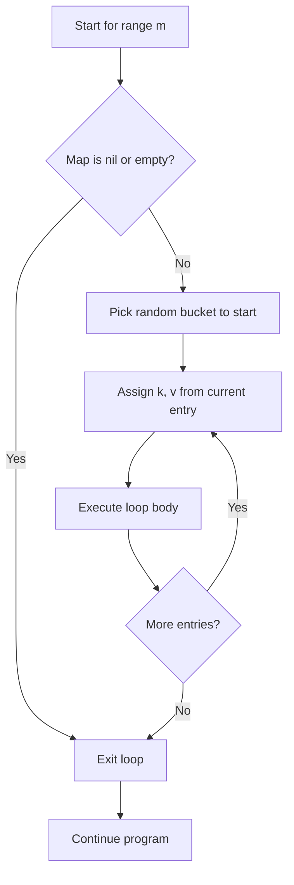

# Iterating Maps — Junior Level

## 1. What is a Map in Go?

A map is a collection of key-value pairs. You use `for range` to iterate over all entries in a map.

```go
package main

import "fmt"

func main() {
    ages := map[string]int{
        "Alice": 30,
        "Bob":   25,
        "Carol": 35,
    }

    for name, age := range ages {
        fmt.Printf("%s is %d years old\n", name, age)
    }
}
```

---

## 2. Basic Syntax for Map Iteration

```go
for key, value := range myMap {
    // key = the map key
    // value = a copy of the map value
}
```

Both `key` and `value` variables are created fresh each iteration.

---

## 3. Iterating Keys Only

If you only need the keys, omit the second variable:

```go
package main

import "fmt"

func main() {
    scores := map[string]int{"Alice": 95, "Bob": 87, "Carol": 92}
    for name := range scores {
        fmt.Println(name)
    }
}
```

---

## 4. Iterating Values Only

Use `_` to ignore the key:

```go
package main

import "fmt"

func main() {
    temps := map[string]float64{
        "Monday": 22.5,
        "Tuesday": 19.0,
        "Wednesday": 25.3,
    }
    for _, temp := range temps {
        fmt.Printf("%.1f°C\n", temp)
    }
}
```

---

## 5. Map Iteration Order is Random!

Every time you run the program, map iteration order is different. This is intentional in Go:

```go
package main

import "fmt"

func main() {
    m := map[string]int{"a": 1, "b": 2, "c": 3}

    fmt.Println("Run 1:")
    for k, v := range m {
        fmt.Printf("  %s: %d\n", k, v)
    }

    fmt.Println("Run 2:")
    for k, v := range m {
        fmt.Printf("  %s: %d\n", k, v)
    }
    // Both runs may print in different order!
}
```

**Never rely on map iteration order.**

---

## 6. Why is Map Order Random?

Go deliberately randomizes map iteration to:
1. Prevent programmers from accidentally depending on a specific order
2. Prevent certain security attacks (hash flooding)

If you need a specific order, sort the keys first (see Section 12).

---

## 7. Iterating an Empty Map

Ranging over an empty map is safe — the loop simply never runs:

```go
package main

import "fmt"

func main() {
    m := map[string]int{} // empty map
    for k, v := range m {
        fmt.Println(k, v) // never prints
    }
    fmt.Println("Loop finished") // always prints
}
```

---

## 8. Iterating a nil Map

Ranging over a nil map is also safe:

```go
package main

import "fmt"

func main() {
    var m map[string]int // nil map
    for k, v := range m {
        fmt.Println(k, v) // never runs
    }
    fmt.Println("Safe!") // always prints
}
```

---

## 9. Counting with Map Iteration

A common pattern: use a map to count, then range over it to find results:

```go
package main

import "fmt"

func main() {
    fruits := []string{"apple", "banana", "apple", "cherry", "banana", "apple"}

    // Build frequency map
    count := map[string]int{}
    for _, fruit := range fruits {
        count[fruit]++
    }

    // Iterate the map
    for fruit, n := range count {
        fmt.Printf("%s appears %d times\n", fruit, n)
    }
}
```

---

## 10. Checking if a Key Exists

Use the two-value form to check if a key exists in a map:

```go
package main

import "fmt"

func main() {
    capitals := map[string]string{
        "France": "Paris",
        "Germany": "Berlin",
        "Japan": "Tokyo",
    }

    if city, ok := capitals["France"]; ok {
        fmt.Println("Capital of France:", city)
    }

    if _, ok := capitals["Australia"]; !ok {
        fmt.Println("Australia not in map")
    }
}
```

---

## 11. Summing Values in a Map

```go
package main

import "fmt"

func main() {
    sales := map[string]float64{
        "January":  12500.50,
        "February": 9800.75,
        "March":    15200.00,
    }

    total := 0.0
    for _, amount := range sales {
        total += amount
    }
    fmt.Printf("Total sales: $%.2f\n", total)
}
```

---

## 12. Sorted Map Iteration

To iterate in sorted key order, collect keys into a slice, sort, then iterate:

```go
package main

import (
    "fmt"
    "sort"
)

func main() {
    m := map[string]int{
        "zebra": 5,
        "apple": 3,
        "mango": 7,
    }

    // Step 1: collect keys
    keys := make([]string, 0, len(m))
    for k := range m {
        keys = append(keys, k)
    }

    // Step 2: sort keys
    sort.Strings(keys)

    // Step 3: iterate in sorted order
    for _, k := range keys {
        fmt.Printf("%s: %d\n", k, m[k])
    }
}
// Output (always):
// apple: 3
// mango: 7
// zebra: 5
```

---

## 13. Deleting from a Map During Iteration

You can safely delete map entries while iterating:

```go
package main

import "fmt"

func main() {
    scores := map[string]int{
        "Alice": 92,
        "Bob":   45,
        "Carol": 78,
        "Dave":  30,
    }

    // Remove students with score below 50
    for name, score := range scores {
        if score < 50 {
            delete(scores, name)
        }
    }

    fmt.Println(scores) // map[Alice:92 Carol:78]
}
```

This is safe in Go. The deleted entries won't be returned in subsequent iterations.

---

## 14. Map of Slices — Grouping Data

```go
package main

import "fmt"

func main() {
    students := []struct {
        Name  string
        Grade string
    }{
        {"Alice", "A"},
        {"Bob", "B"},
        {"Carol", "A"},
        {"Dave", "C"},
        {"Eve", "B"},
    }

    // Group by grade
    groups := map[string][]string{}
    for _, s := range students {
        groups[s.Grade] = append(groups[s.Grade], s.Name)
    }

    for grade, names := range groups {
        fmt.Printf("Grade %s: %v\n", grade, names)
    }
}
```

---

## 15. Map of Maps — Nested Iteration

```go
package main

import "fmt"

func main() {
    data := map[string]map[string]int{
        "math":    {"Alice": 95, "Bob": 82},
        "english": {"Alice": 88, "Bob": 91},
    }

    for subject, scores := range data {
        fmt.Printf("Subject: %s\n", subject)
        for student, score := range scores {
            fmt.Printf("  %s: %d\n", student, score)
        }
    }
}
```

---

## 16. Map Iteration with String Keys vs Integer Keys

```go
package main

import "fmt"

func main() {
    // String keys
    byName := map[string]int{"Alice": 1, "Bob": 2}
    for k, v := range byName {
        fmt.Printf("string key: %q -> %d\n", k, v)
    }

    // Integer keys
    byID := map[int]string{1: "Alice", 2: "Bob", 3: "Carol"}
    for id, name := range byID {
        fmt.Printf("int key: %d -> %s\n", id, name)
    }
}
```

---

## 17. Finding the Key with Maximum Value

```go
package main

import "fmt"

func main() {
    scores := map[string]int{
        "Alice": 95,
        "Bob":   82,
        "Carol": 98,
        "Dave":  87,
    }

    topName := ""
    topScore := -1

    for name, score := range scores {
        if score > topScore {
            topScore = score
            topName = name
        }
    }

    fmt.Printf("Top scorer: %s with %d\n", topName, topScore)
}
```

---

## 18. Inverting a Map (Swap Keys and Values)

```go
package main

import "fmt"

func main() {
    capitals := map[string]string{
        "France":  "Paris",
        "Germany": "Berlin",
        "Japan":   "Tokyo",
    }

    // Invert: city -> country
    citiesMap := map[string]string{}
    for country, city := range capitals {
        citiesMap[city] = country
    }

    fmt.Println(citiesMap)
    // map[Berlin:Germany Paris:France Tokyo:Japan]
}
```

**Note:** Only works correctly if values are unique!

---

## 19. Counting Elements That Meet a Condition

```go
package main

import "fmt"

func main() {
    inventory := map[string]int{
        "apples":  0,
        "bananas": 5,
        "cherries": 0,
        "dates":   12,
        "elderberries": 3,
    }

    outOfStock := 0
    for _, qty := range inventory {
        if qty == 0 {
            outOfStock++
        }
    }
    fmt.Printf("%d items out of stock\n", outOfStock) // 2
}
```

---

## 20. Comparing Two Maps

```go
package main

import "fmt"

func mapsEqual(a, b map[string]int) bool {
    if len(a) != len(b) {
        return false
    }
    for k, v := range a {
        if bv, ok := b[k]; !ok || bv != v {
            return false
        }
    }
    return true
}

func main() {
    m1 := map[string]int{"a": 1, "b": 2}
    m2 := map[string]int{"a": 1, "b": 2}
    m3 := map[string]int{"a": 1, "b": 3}

    fmt.Println(mapsEqual(m1, m2)) // true
    fmt.Println(mapsEqual(m1, m3)) // false
}
```

---

## 21. Building a Set Using a Map

Go has no built-in set type. Use `map[T]struct{}` or `map[T]bool`:

```go
package main

import "fmt"

func main() {
    words := []string{"go", "python", "go", "java", "go", "python"}

    // Build set (unique values)
    seen := map[string]bool{}
    for _, w := range words {
        seen[w] = true
    }

    // Iterate unique words
    for w := range seen {
        fmt.Println(w)
    }
    // go, python, java (any order)
}
```

---

## 22. Merging Two Maps

```go
package main

import "fmt"

func mergeMaps(a, b map[string]int) map[string]int {
    result := map[string]int{}
    for k, v := range a {
        result[k] = v
    }
    for k, v := range b {
        result[k] = v // b values overwrite a values for duplicate keys
    }
    return result
}

func main() {
    m1 := map[string]int{"a": 1, "b": 2}
    m2 := map[string]int{"b": 20, "c": 3}
    merged := mergeMaps(m1, m2)
    fmt.Println(merged) // map[a:1 b:20 c:3]
}
```

---

## 23. Copying a Map

```go
package main

import "fmt"

func copyMap(src map[string]int) map[string]int {
    dst := make(map[string]int, len(src))
    for k, v := range src {
        dst[k] = v
    }
    return dst
}

func main() {
    original := map[string]int{"x": 10, "y": 20}
    clone := copyMap(original)
    clone["x"] = 999
    fmt.Println(original["x"]) // 10 — unchanged
    fmt.Println(clone["x"])    // 999
}
```

---

## 24. Filtering a Map

```go
package main

import "fmt"

func filterMap(m map[string]int, threshold int) map[string]int {
    result := map[string]int{}
    for k, v := range m {
        if v >= threshold {
            result[k] = v
        }
    }
    return result
}

func main() {
    scores := map[string]int{
        "Alice": 92, "Bob": 45, "Carol": 78, "Dave": 30,
    }
    passing := filterMap(scores, 60)
    fmt.Println(passing) // map[Alice:92 Carol:78]
}
```

---

## 25. Map of Structs — Reading vs Modifying

```go
package main

import "fmt"

type Product struct {
    Name  string
    Price float64
}

func main() {
    products := map[string]Product{
        "apple":  {"Apple", 0.99},
        "banana": {"Banana", 0.59},
    }

    // Reading: OK
    for id, p := range products {
        fmt.Printf("%s: $%.2f\n", id, p.Price)
    }

    // Modifying: must reassign the whole struct
    for id, p := range products {
        p.Price *= 1.1        // apply 10% markup
        products[id] = p      // reassign to map
    }

    fmt.Println(products["apple"].Price) // 1.089
}
```

---

## 26. Practical Example: Voting System

```go
package main

import (
    "fmt"
    "sort"
)

func main() {
    votes := []string{
        "Alice", "Bob", "Alice", "Carol", "Alice", "Bob",
        "Carol", "Alice", "Bob", "Bob",
    }

    tally := map[string]int{}
    for _, v := range votes {
        tally[v]++
    }

    // Sort candidates alphabetically for display
    candidates := make([]string, 0, len(tally))
    for c := range tally { candidates = append(candidates, c) }
    sort.Strings(candidates)

    fmt.Println("Election Results:")
    for _, c := range candidates {
        fmt.Printf("  %s: %d votes\n", c, tally[c])
    }
}
```

---

## 27. Mermaid Flowchart: Map Iteration



---

## 28. Practical Example: Phone Directory

```go
package main

import (
    "fmt"
    "sort"
    "strings"
)

func main() {
    directory := map[string]string{
        "Alice":   "+1-555-0101",
        "Bob":     "+1-555-0202",
        "Carol":   "+44-20-7946",
        "Dave":    "+1-555-0303",
    }

    // Find all US numbers (start with +1)
    fmt.Println("US contacts:")
    names := make([]string, 0)
    for name, phone := range directory {
        if strings.HasPrefix(phone, "+1") {
            names = append(names, name)
        }
    }
    sort.Strings(names)
    for _, name := range names {
        fmt.Printf("  %s: %s\n", name, directory[name])
    }
}
```

---

## 29. Practical Example: Inventory Management

```go
package main

import "fmt"

func main() {
    inventory := map[string]int{
        "apples":  50,
        "bananas": 30,
        "oranges": 0,
        "grapes":  15,
        "kiwis":   0,
    }

    fmt.Println("Available items:")
    for item, qty := range inventory {
        if qty > 0 {
            fmt.Printf("  %s: %d units\n", item, qty)
        }
    }

    fmt.Println("\nOut of stock:")
    for item, qty := range inventory {
        if qty == 0 {
            fmt.Printf("  %s\n", item)
        }
    }
}
```

---

## 30. Summary: Junior Map Iteration Basics

| Operation | Code |
|---|---|
| Iterate key+value | `for k, v := range m { }` |
| Keys only | `for k := range m { }` |
| Values only | `for _, v := range m { }` |
| Delete during range | `delete(m, k)` — safe! |
| Sorted iteration | Collect keys → sort → range slice |
| nil map range | 0 iterations, safe |

**Key Rules for Juniors:**
1. Map order is ALWAYS random — never assume otherwise
2. Use `sort` package to get deterministic order
3. Deleting keys during range is safe
4. Adding keys during range is unpredictable — avoid it
5. Value `v` is a copy — to modify, reassign `m[k] = newValue`
6. Use `_` to ignore key or value
