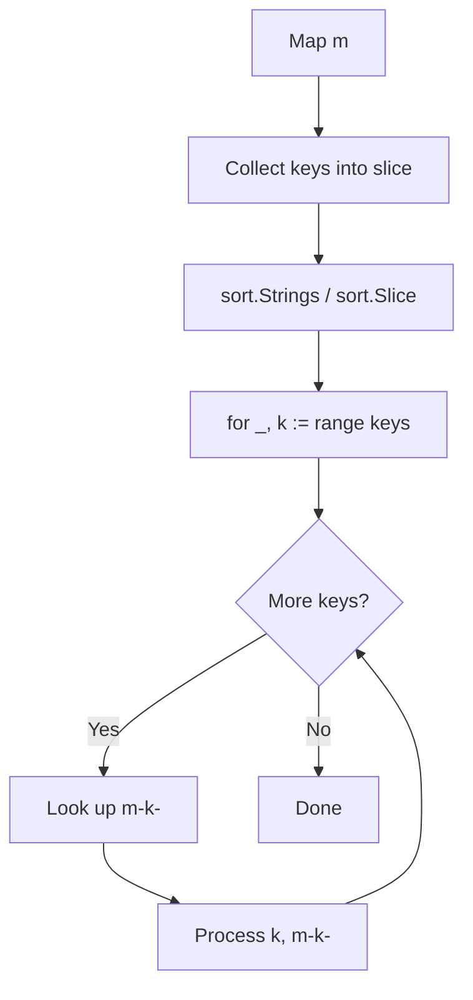
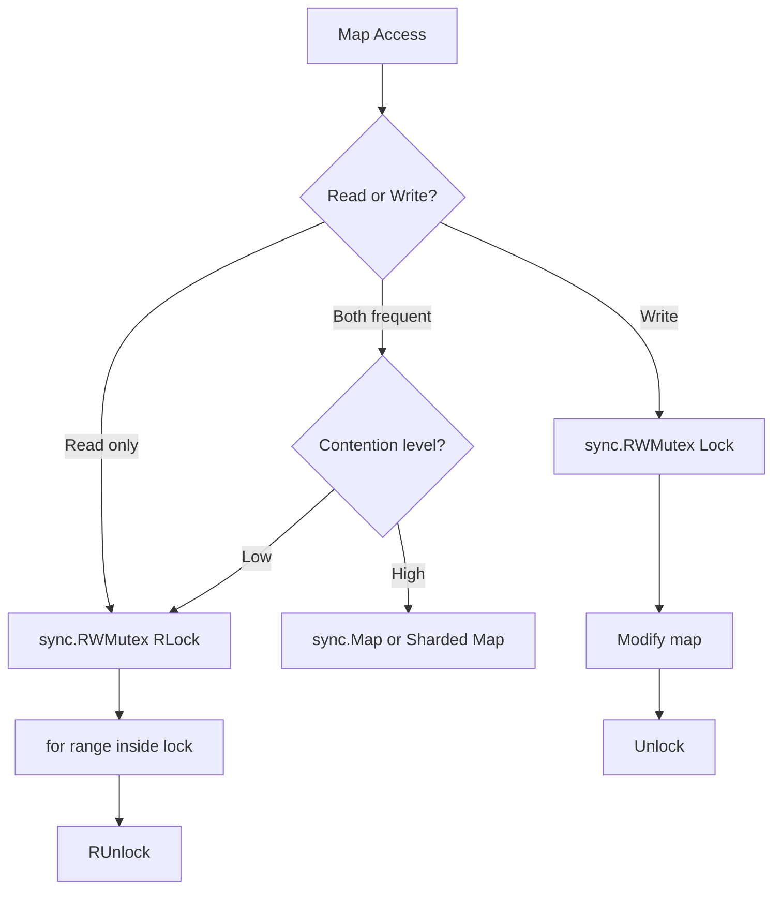

# Iterating Maps — Middle Level

## 1. How Go Randomizes Map Iteration

Go's map is implemented as a hash table. When `for range` starts on a map, the runtime calls `mapiterinit()`, which seeds the starting bucket using `fastrand()` — a lightweight PRNG. This means:

```go
m := map[string]int{"a": 1, "b": 2, "c": 3}
for k := range m {
    fmt.Println(k) // different order every execution
}
```

This randomization was introduced in Go 1.0 deliberately to prevent code from accidentally depending on a specific order.

---

## 2. Evolution of Map Iteration in Go

| Go Version | Change |
|---|---|
| Go 1.0 | `for range` on maps; order intentionally randomized |
| Go 1.12 | `fmt` package prints maps in sorted key order (for display only) |
| Go 1.18 | `golang.org/x/exp/maps` package: `Keys()`, `Values()` helpers |
| Go 1.21 | `maps` package in stdlib: `Keys()`, `Values()`, `Clone()`, `Equal()` |
| Go 1.23 | `maps.All()`, `maps.Keys()`, `maps.Values()` return `iter.Seq` |

---

## 3. Alternative Approaches to Map Iteration

### sorted-keys approach (most common)
```go
import "sort"
keys := make([]string, 0, len(m))
for k := range m { keys = append(keys, k) }
sort.Strings(keys)
for _, k := range keys { fmt.Println(k, m[k]) }
```

### `maps.Keys` (Go 1.21+)
```go
import (
    "maps"
    "slices"
    "sort"
)
keys := slices.Collect(maps.Keys(m))
sort.Strings(keys)
for _, k := range keys { fmt.Println(k, m[k]) }
```

### Ordered map (third-party)
```go
// github.com/elliotchance/orderedmap
om := orderedmap.NewOrderedMap[string, int]()
om.Set("a", 1)
om.Set("b", 2)
for pair := om.Front(); pair != nil; pair = pair.Next() {
    fmt.Println(pair.Key, pair.Value)
}
```

### Slice of key-value pairs (when order matters and map is built once)
```go
type KV struct{ K string; V int }
pairs := make([]KV, 0, len(m))
for k, v := range m { pairs = append(pairs, KV{k, v}) }
sort.Slice(pairs, func(i, j int) bool { return pairs[i].K < pairs[j].K })
for _, p := range pairs { fmt.Println(p.K, p.V) }
```

---

## 4. Anti-Patterns

### Anti-Pattern 1: Assuming map order is stable between runs
```go
// WRONG
for k, v := range config {
    if k == "host" { connectTo(v) } // depends on host being "found"
}
// map["host"] may not be first — always access by key directly
config["host"] // CORRECT
```

### Anti-Pattern 2: Modifying struct values via the value copy
```go
type User struct { Name string; Score int }
users := map[string]User{
    "alice": {"Alice", 100},
}

// WRONG: v is a copy
for k, v := range users {
    v.Score += 10 // does not modify users[k]
    _ = k
}

// CORRECT
for k := range users {
    u := users[k]
    u.Score += 10
    users[k] = u
}
// Or use map of pointers: map[string]*User
```

### Anti-Pattern 3: Adding keys during iteration unpredictably
```go
// UNPREDICTABLE
m := map[string]int{"a": 1}
for k, v := range m {
    m[k+"x"] = v + 1 // may or may not iterate new keys
}
```

### Anti-Pattern 4: Concurrent map access without synchronization
```go
// DATA RACE — fatal panic possible
go func() {
    for k, v := range sharedMap { _, _ = k, v }
}()
go func() {
    sharedMap["key"] = 42 // concurrent write
}()
```

### Anti-Pattern 5: Using map for ordered lookup (should use sorted slice)
```go
// WRONG: map lookup in order-dependent loop
for i := 0; i < 10; i++ {
    key := fmt.Sprintf("step%d", i)
    if action, ok := steps[key]; ok {
        action() // assumes steps are in order — maps don't guarantee this
    }
}
// CORRECT: use []Action slice for ordered steps
```

---

## 5. Debugging Guide for Map Iteration

### Debug: Why does my test fail non-deterministically?
```go
// Symptom: test sometimes passes, sometimes fails
// Root cause: map iteration produces different output each run
func serialize(m map[string]int) string {
    result := ""
    for k, v := range m {
        result += fmt.Sprintf("%s=%d,", k, v) // non-deterministic!
    }
    return result
}
// Fix: sort keys before serializing
```

### Debug: Concurrent map panic
```go
// Fatal: concurrent map read and map write
// Tool: go run -race to detect
// Fix: sync.RWMutex or sync.Map
```

### Debug: Struct values not updating
```go
// Add a print to confirm value is a copy:
for k, v := range m {
    fmt.Printf("before: m[%s]=%v, v=%v (same?%v)\n", k, m[k], v, m[k] == v)
    v.Field = 99
    fmt.Printf("after:  m[%s]=%v (unchanged!)\n", k, m[k])
}
```

### Using `-race` flag
```bash
go run -race main.go
# Prints goroutine stacks when data race detected
```

---

## 6. Language Comparison: Map Iteration

### Python
```python
d = {"a": 1, "b": 2, "c": 3}
# Preserved insertion order (Python 3.7+)
for k, v in d.items():
    print(k, v)
# Keys only
for k in d: print(k)
# Values only
for v in d.values(): print(v)
```

### JavaScript
```javascript
const obj = {a: 1, b: 2, c: 3}
// String keys in insertion order (integers sorted numerically first)
for (const [k, v] of Object.entries(obj)) console.log(k, v)
// Map preserves insertion order always
const map = new Map([["a",1],["b",2]])
for (const [k, v] of map) console.log(k, v)
```

### Rust
```rust
use std::collections::HashMap;
let m: HashMap<&str, i32> = HashMap::from([("a", 1), ("b", 2)]);
for (k, v) in &m { // iteration order random
    println!("{}: {}", k, v);
}
// BTreeMap preserves sorted order
use std::collections::BTreeMap;
let bm: BTreeMap<&str, i32> = BTreeMap::from([("a", 1), ("b", 2)]);
for (k, v) in &bm { println!("{}: {}", k, v); } // sorted
```

### Java
```java
Map<String, Integer> map = new HashMap<>(); // random order
Map<String, Integer> linked = new LinkedHashMap<>(); // insertion order
Map<String, Integer> tree = new TreeMap<>(); // sorted order

for (Map.Entry<String, Integer> e : map.entrySet()) {
    System.out.println(e.getKey() + ": " + e.getValue());
}
```

**Key difference:** Python 3.7+, JavaScript Map, and Java LinkedHashMap preserve insertion order. Go maps are always randomly ordered. Use sorted keys when order matters.

---

## 7. Concurrent Map Patterns

### sync.RWMutex — most common
```go
type SafeMap struct {
    mu sync.RWMutex
    m  map[string]int
}

func (sm *SafeMap) Range(fn func(k string, v int)) {
    sm.mu.RLock()
    defer sm.mu.RUnlock()
    for k, v := range sm.m {
        fn(k, v)
    }
}

func (sm *SafeMap) Set(k string, v int) {
    sm.mu.Lock()
    defer sm.mu.Unlock()
    sm.m[k] = v
}
```

### sync.Map — for read-heavy concurrent access
```go
var m sync.Map

// Iterate
m.Range(func(k, v interface{}) bool {
    fmt.Println(k.(string), v.(int))
    return true // false = stop iteration
})
```

### Sharded map — for high-throughput
```go
type ShardedMap struct {
    shards [256]struct {
        sync.RWMutex
        m map[string]int
    }
}

func (sm *ShardedMap) shard(key string) *struct {
    sync.RWMutex
    m map[string]int
} {
    hash := fnv.New32()
    hash.Write([]byte(key))
    return &sm.shards[hash.Sum32()%256]
}

// RangeAll iterates all shards
func (sm *ShardedMap) RangeAll(fn func(string, int)) {
    for i := range sm.shards {
        shard := &sm.shards[i]
        shard.RLock()
        for k, v := range shard.m {
            fn(k, v)
        }
        shard.RUnlock()
    }
}
```

---

## 8. Performance: Map vs Slice for Iteration

```go
package main

import "testing"

var m = map[int]int{}
var s = make([]int, 1000)

func init() {
    for i := 0; i < 1000; i++ {
        m[i] = i
        s[i] = i
    }
}

func BenchmarkMapRange(b *testing.B) {
    for n := 0; n < b.N; n++ {
        sum := 0
        for _, v := range m {
            sum += v
        }
        _ = sum
    }
}

func BenchmarkSliceRange(b *testing.B) {
    for n := 0; n < b.N; n++ {
        sum := 0
        for _, v := range s {
            sum += v
        }
        _ = sum
    }
}
// Map range is ~5-10x slower than slice range due to hash table structure
```

---

## 9. Pattern: Functional Map Transformations

```go
package main

import "fmt"

// Map values via range
func mapValues(m map[string]int, fn func(int) int) map[string]int {
    result := make(map[string]int, len(m))
    for k, v := range m {
        result[k] = fn(v)
    }
    return result
}

// Filter map entries
func filterMap(m map[string]int, pred func(string, int) bool) map[string]int {
    result := make(map[string]int)
    for k, v := range m {
        if pred(k, v) {
            result[k] = v
        }
    }
    return result
}

func main() {
    scores := map[string]int{"Alice": 80, "Bob": 60, "Carol": 90}

    doubled := mapValues(scores, func(v int) int { return v * 2 })
    fmt.Println(doubled)

    passing := filterMap(scores, func(k string, v int) bool { return v >= 70 })
    fmt.Println(passing)
}
```

---

## 10. Mermaid: Map Iteration with Sort



---

## 11. Using `maps` Package (Go 1.21+)

```go
package main

import (
    "fmt"
    "maps"
)

func main() {
    m := map[string]int{"a": 1, "b": 2, "c": 3}

    // Clone a map (shallow copy)
    clone := maps.Clone(m)
    clone["d"] = 4
    fmt.Println(len(m), len(clone)) // 3, 4

    // Check equality
    m2 := map[string]int{"a": 1, "b": 2, "c": 3}
    fmt.Println(maps.Equal(m, m2)) // true

    // Delete with condition (Go 1.21+)
    maps.DeleteFunc(m, func(k string, v int) bool {
        return v < 2 // delete entries where value < 2
    })
    fmt.Println(m) // map[b:2 c:3]
}
```

---

## 12. Pattern: Frequency Analysis

```go
package main

import (
    "fmt"
    "sort"
    "strings"
)

type FreqEntry struct {
    Word  string
    Count int
}

func topN(text string, n int) []FreqEntry {
    words := strings.Fields(strings.ToLower(text))
    freq := map[string]int{}
    for _, w := range words {
        freq[w]++
    }

    entries := make([]FreqEntry, 0, len(freq))
    for w, c := range freq {
        entries = append(entries, FreqEntry{w, c})
    }
    sort.Slice(entries, func(i, j int) bool {
        if entries[i].Count != entries[j].Count {
            return entries[i].Count > entries[j].Count
        }
        return entries[i].Word < entries[j].Word
    })

    if n > len(entries) { n = len(entries) }
    return entries[:n]
}

func main() {
    text := "the quick brown fox jumps over the lazy dog the fox"
    for _, e := range topN(text, 3) {
        fmt.Printf("%s: %d\n", e.Word, e.Count)
    }
}
```

---

## 13. Map with Complex Key Types

```go
package main

import "fmt"

type Point struct{ X, Y int }

func main() {
    // Struct as map key (all fields must be comparable)
    distances := map[Point]float64{
        {0, 0}: 0.0,
        {1, 0}: 1.0,
        {0, 1}: 1.0,
        {1, 1}: 1.414,
    }

    for pt, dist := range distances {
        fmt.Printf("(%d,%d) -> %.3f\n", pt.X, pt.Y, dist)
    }
}
```

---

## 14. Aggregation with Map Iteration

```go
package main

import "fmt"

type Sale struct {
    Region string
    Amount float64
}

func aggregateByRegion(sales []Sale) map[string]float64 {
    result := map[string]float64{}
    for _, s := range sales {
        result[s.Region] += s.Amount
    }
    return result
}

func main() {
    sales := []Sale{
        {"North", 1000},
        {"South", 2000},
        {"North", 1500},
        {"East", 800},
        {"South", 1200},
    }

    totals := aggregateByRegion(sales)
    for region, total := range totals {
        fmt.Printf("%s: $%.0f\n", region, total)
    }
}
```

---

## 15. Range with Closures and Maps

```go
package main

import "fmt"

func buildHandlers(routes map[string]func()) map[string]func() {
    result := map[string]func(){}
    for path, handler := range routes {
        path := path     // capture per-iteration (pre-Go 1.22)
        handler := handler
        result[path] = func() {
            fmt.Printf("Handling %s\n", path)
            handler()
        }
    }
    return result
}

func main() {
    routes := map[string]func(){
        "/home":  func() { fmt.Println("Home page") },
        "/about": func() { fmt.Println("About page") },
    }
    handlers := buildHandlers(routes)
    handlers["/home"]()
    handlers["/about"]()
}
```

---

## 16. Map Snapshot for Safe Concurrent Iteration

```go
package main

import (
    "fmt"
    "sync"
)

type LiveMap struct {
    mu sync.RWMutex
    m  map[string]int
}

// Snapshot returns a copy — safe to iterate without holding the lock
func (lm *LiveMap) Snapshot() map[string]int {
    lm.mu.RLock()
    defer lm.mu.RUnlock()
    snap := make(map[string]int, len(lm.m))
    for k, v := range lm.m {
        snap[k] = v
    }
    return snap
}

func main() {
    lm := &LiveMap{m: map[string]int{"a": 1, "b": 2}}
    snap := lm.Snapshot()
    for k, v := range snap { // iterate snapshot, no lock needed
        fmt.Println(k, v)
    }
}
```

---

## 17. Pattern: Memoization with Map

```go
package main

import "fmt"

var memo = map[int]int{}

func fib(n int) int {
    if n <= 1 { return n }
    if v, ok := memo[n]; ok {
        return v
    }
    result := fib(n-1) + fib(n-2)
    memo[n] = result
    return result
}

func printMemo() {
    for n, v := range memo {
        fmt.Printf("fib(%d) = %d\n", n, v)
    }
}

func main() {
    fmt.Println(fib(10))
    printMemo()
}
```

---

## 18. Pattern: Multi-Index Map

```go
package main

import "fmt"

type Employee struct {
    ID   int
    Name string
    Dept string
}

type EmployeeDB struct {
    byID   map[int]*Employee
    byName map[string]*Employee
    byDept map[string][]*Employee
}

func NewDB() *EmployeeDB {
    return &EmployeeDB{
        byID:   map[int]*Employee{},
        byName: map[string]*Employee{},
        byDept: map[string][]*Employee{},
    }
}

func (db *EmployeeDB) Add(e *Employee) {
    db.byID[e.ID] = e
    db.byName[e.Name] = e
    db.byDept[e.Dept] = append(db.byDept[e.Dept], e)
}

func (db *EmployeeDB) PrintByDept() {
    for dept, emps := range db.byDept {
        fmt.Printf("Dept: %s\n", dept)
        for _, e := range emps {
            fmt.Printf("  [%d] %s\n", e.ID, e.Name)
        }
    }
}

func main() {
    db := NewDB()
    db.Add(&Employee{1, "Alice", "Engineering"})
    db.Add(&Employee{2, "Bob", "Marketing"})
    db.Add(&Employee{3, "Carol", "Engineering"})
    db.PrintByDept()
}
```

---

## 19. Using `maps.DeleteFunc` (Go 1.21+)

```go
package main

import (
    "fmt"
    "maps"
)

func main() {
    inventory := map[string]int{
        "apples": 5, "oranges": 0, "bananas": 3, "grapes": 0,
    }

    // Remove out-of-stock items
    maps.DeleteFunc(inventory, func(k string, v int) bool {
        return v == 0
    })

    fmt.Println(inventory) // map[apples:5 bananas:3]
}
```

---

## 20. Pattern: Event Routing with Map

```go
package main

import "fmt"

type EventHandler func(data interface{})

type EventBus struct {
    handlers map[string][]EventHandler
}

func NewEventBus() *EventBus {
    return &EventBus{handlers: map[string][]EventHandler{}}
}

func (eb *EventBus) Subscribe(event string, h EventHandler) {
    eb.handlers[event] = append(eb.handlers[event], h)
}

func (eb *EventBus) Emit(event string, data interface{}) {
    for _, h := range eb.handlers[event] {
        h(data)
    }
}

func main() {
    bus := NewEventBus()
    bus.Subscribe("login", func(d interface{}) {
        fmt.Printf("User logged in: %v\n", d)
    })
    bus.Subscribe("login", func(d interface{}) {
        fmt.Printf("Audit: login event for %v\n", d)
    })
    bus.Emit("login", "alice@example.com")
}
```

---

## 21. Mermaid: Concurrent Map Access Patterns



---

## 22. Map with Default Values via Helper

```go
package main

import "fmt"

func getOrDefault(m map[string]int, key string, defaultVal int) int {
    if v, ok := m[key]; ok {
        return v
    }
    return defaultVal
}

func main() {
    config := map[string]int{"timeout": 30, "retries": 3}
    timeout := getOrDefault(config, "timeout", 60)
    maxConns := getOrDefault(config, "max_connections", 100)
    fmt.Println(timeout, maxConns) // 30, 100
}
```

---

## 23. Pattern: Histogram Bucketing

```go
package main

import "fmt"

func histogram(values []int, buckets []int) map[string]int {
    hist := map[string]int{}
    for _, v := range values {
        for i, b := range buckets {
            if v < b {
                label := fmt.Sprintf("<%d", b)
                hist[label]++
                break
            }
            if i == len(buckets)-1 {
                hist[fmt.Sprintf(">=%d", b)]++
            }
        }
    }
    return hist
}

func main() {
    data := []int{5, 15, 25, 35, 45, 55, 65}
    hist := histogram(data, []int{20, 40, 60})
    for bucket, count := range hist {
        fmt.Printf("%s: %d\n", bucket, count)
    }
}
```

---

## 24. Thread-Safe Iteration with Read Lock

```go
package main

import (
    "fmt"
    "sync"
)

type Config struct {
    mu     sync.RWMutex
    values map[string]string
}

func (c *Config) GetAll() map[string]string {
    c.mu.RLock()
    defer c.mu.RUnlock()
    // Safe: no writes during this range
    result := make(map[string]string, len(c.values))
    for k, v := range c.values {
        result[k] = v
    }
    return result
}

func main() {
    cfg := &Config{values: map[string]string{"host": "localhost", "port": "8080"}}
    all := cfg.GetAll()
    for k, v := range all {
        fmt.Printf("%s = %s\n", k, v)
    }
}
```

---

## 25. Summary: Middle-Level Map Iteration Insights

| Pattern | When to Use |
|---|---|
| Raw `for range` | Single goroutine, order doesn't matter |
| Sort keys then range | Need deterministic output |
| `maps.Clone` | Thread-safe snapshot |
| `sync.RWMutex` + range | Multi-goroutine read-heavy |
| `sync.Map.Range` | High concurrency, dynamic access patterns |
| Collect + sort | Testing, logging, UI display |
| `maps.DeleteFunc` | Conditional cleanup (Go 1.21+) |
| `maps.Equal` | Comparison without manual loop |
