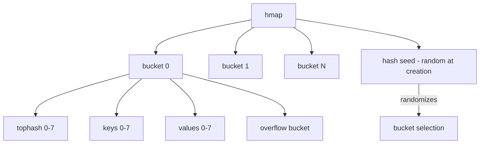

# Iterating Maps — Senior Level

## 1. Runtime Internals: hmap and hiter

Go's map is implemented in `runtime/map.go`. The core structures:

```go
// runtime/map.go (simplified)
type hmap struct {
    count     int        // number of elements
    flags     uint8
    B         uint8      // log_2 of bucket count
    noverflow uint16
    hash0     uint32     // hash seed (randomized at map creation!)
    buckets   unsafe.Pointer
    oldbuckets unsafe.Pointer // non-nil during grow
    nevacuate uintptr
    extra     *mapextra
}

type bmap struct {
    tophash [bucketCnt]uint8 // top 8 bits of hash for each slot
    // followed by keys, then values (laid out for alignment)
}
```

The hash seed `hash0` is set randomly when the map is created. This means the same key maps to a different bucket in different map instances, preventing pre-computation attacks.

---

## 2. mapiterinit and mapiternext

```go
// mapiterinit initializes map iteration
func mapiterinit(t *maptype, h *hmap, it *hiter) {
    if h == nil || h.count == 0 {
        return
    }
    // Randomize starting position
    r := uintptr(fastrand())
    if h.B > 31-bucketCntBits {
        r += uintptr(fastrand()) << 31
    }
    it.startBucket = r & bucketMask(h.B)
    it.offset = uint8(r >> h.B & (bucketCnt - 1))
    it.bucket = it.startBucket

    mapiternext(it) // advance to first element
}
```

The iteration visits every bucket from `startBucket` to `startBucket-1` (wrapping around), ensuring every element is seen exactly once even with the random start.

---

## 3. Map Growth During Iteration

When a map grows (doubles its bucket count), Go uses incremental evacuation. During iteration, the iterator must handle both old and new buckets:

```go
// mapiternext handles evacuation check
if h.growing() {
    oldbucket := it.bucket & it.h.oldbucketmask()
    b = (*bmap)(add(h.oldbuckets, oldbucket*uintptr(t.bucketsize)))
    if !evacuated(b) {
        // Still using old bucket — iterate it
    } else {
        // Evacuated — use new bucket
        b = (*bmap)(add(h.buckets, it.bucket*uintptr(t.bucketsize)))
    }
}
```

This is why adding keys during range can see new keys or not — depending on whether the added key lands in a bucket already visited.

---

## 4. Postmortem 1: Map Ordering Bug in Distributed System

**Scenario:** A microservice serialized configuration as a string by ranging over a map, then used the string as a cache key.

```go
func configKey(cfg map[string]string) string {
    key := ""
    for k, v := range cfg { // RANDOM ORDER
        key += k + "=" + v + ";"
    }
    return key
}
// Same config produced different cache keys on different calls
// Cache miss rate: 100% — the cache was useless
```

**Impact:** Cache never hit, every request re-fetched from database. 50x load increase on DB.

**Fix:**
```go
import "sort"
func configKey(cfg map[string]string) string {
    keys := make([]string, 0, len(cfg))
    for k := range cfg { keys = append(keys, k) }
    sort.Strings(keys)
    var sb strings.Builder
    for _, k := range keys {
        sb.WriteString(k + "=" + cfg[k] + ";")
    }
    return sb.String()
}
```

**Lesson:** Never use map range to produce deterministic output.

---

## 5. Postmortem 2: sync.Map Misuse

**Scenario:** A team replaced `map[string]interface{}` with `sync.Map` for "safety" without understanding trade-offs.

```go
// Before (fast reads, requires external lock)
var mu sync.RWMutex
var cache = map[string][]byte{}

// After (incorrect "optimization")
var cache sync.Map
cache.Range(func(k, v interface{}) bool {
    // ... processing
    cache.Store(k, process(v)) // storing DURING Range — undefined behavior
    return true
})
```

**Problems:**
1. `sync.Map.Range` does not guarantee snapshot consistency — new stores during range may or may not be seen
2. `sync.Map` is slower than `map + RWMutex` for non-concurrent workloads
3. Type assertions on every access add overhead

**Lesson:** `sync.Map` is optimized for specific patterns: write-once-read-many, or disjoint goroutine sets. For general use, `map + RWMutex` is clearer and often faster.

---

## 6. Postmortem 3: Goroutine Leak from Channel in Map

```go
// Pattern: map of channels for routing
type Router struct {
    routes map[string]chan Request
}

func (r *Router) Range() {
    for path, ch := range r.routes {
        go func(p string, c chan Request) {
            for req := range c { // blocks until channel closed
                handle(p, req)
            }
        }(path, ch)
    }
}
// Bug: channels were never closed — goroutines leaked forever
```

**Fix:** Use `context.Context` for cancellation:
```go
func (r *Router) Range(ctx context.Context) {
    for path, ch := range r.routes {
        go func(p string, c chan Request) {
            for {
                select {
                case req, ok := <-c:
                    if !ok { return }
                    handle(p, req)
                case <-ctx.Done():
                    return
                }
            }
        }(path, ch)
    }
}
```

---

## 7. Performance: Cache-Line Behavior of Map Iteration

Map iteration is memory-unfriendly compared to slice iteration:

- **Slice:** Elements are contiguous in memory → excellent cache locality
- **Map:** Buckets are scattered → frequent L1/L2 cache misses

```go
// Benchmark shows map iteration is ~5-10x slower than slice
// for same data size (cache effects, not just overhead)

// For performance-critical code with frequent full-scan:
// Store data in a slice, use map only for lookup
type Store struct {
    keys   []string
    values []int
    index  map[string]int // key -> position in keys/values
}
```

---

## 8. Memory Layout of Map Buckets

Each bucket holds 8 key-value pairs:

```
bmap layout:
[ tophash[0..7] ]  // 8 bytes
[ key[0..7]     ]  // 8 * sizeof(key)
[ value[0..7]   ]  // 8 * sizeof(value)
[ overflow ptr  ]  // pointer to overflow bucket
```

The `tophash` is the top 8 bits of the hash. During iteration, the iterator checks tophash to skip empty slots efficiently.

---

## 9. Escape Analysis for hiter

```bash
go build -gcflags="-m" main.go
```

For small maps, the `hiter` struct is stack-allocated (no heap escape). For maps that escape to closures or interface values, `hiter` moves to the heap:

```go
// hiter stays on stack
for k, v := range m { _, _ = k, v }

// hiter may escape
fn := func() {
    for k, v := range m { _, _ = k, v }
}
fn()
```

---

## 10. High-Performance Concurrent Map Patterns

### Pattern: COW (Copy-On-Write) map

```go
package main

import (
    "sync/atomic"
    "unsafe"
)

type COWMap struct {
    ptr unsafe.Pointer // points to map[string]int
}

func (c *COWMap) Load() map[string]int {
    return *(*map[string]int)(atomic.LoadPointer(&c.ptr))
}

func (c *COWMap) Store(newMap map[string]int) {
    atomic.StorePointer(&c.ptr, unsafe.Pointer(&newMap))
}

// Readers iterate without lock
// Writer creates full copy, stores atomically
func (c *COWMap) Set(key string, val int) {
    old := c.Load()
    newMap := make(map[string]int, len(old)+1)
    for k, v := range old { // copy
        newMap[k] = v
    }
    newMap[key] = val
    c.Store(newMap)
}
```

COW is ideal when reads heavily outnumber writes and consistency isn't critical.

---

## 11. Parallel Map Aggregation

```go
package main

import (
    "sync"
)

// Parallel word count using sharded maps
func parallelCount(words []string) map[string]int {
    n := 4 // shards
    shards := make([]map[string]int, n)
    for i := range shards { shards[i] = map[string]int{} }
    var wg sync.WaitGroup

    chunkSize := (len(words) + n - 1) / n
    for i := 0; i < n; i++ {
        start := i * chunkSize
        end := start + chunkSize
        if end > len(words) { end = len(words) }
        wg.Add(1)
        go func(shard map[string]int, chunk []string) {
            defer wg.Done()
            for _, w := range chunk { shard[w]++ }
        }(shards[i], words[start:end])
    }
    wg.Wait()

    // Merge shards (single goroutine)
    result := map[string]int{}
    for _, shard := range shards {
        for k, v := range shard {
            result[k] += v
        }
    }
    return result
}
```

---

## 12. Detecting Map Data Races with Race Detector

```go
// This code has a data race — detectable with -race
var m = map[string]int{}

func readMap() {
    for k, v := range m { _, _ = k, v }
}

func writeMap() {
    m["key"] = 42
}

// go run -race main.go
// Output: WARNING: DATA RACE
//         Read at 0x... by goroutine 6
//         Write at 0x... by goroutine 7
```

The race detector instruments every memory access. It adds ~5-10x overhead but catches all concurrent map bugs.

---

## 13. Benchmarking Different Concurrent Map Patterns

```go
package main

import (
    "sync"
    "testing"
)

var testMap = func() map[int]int {
    m := make(map[int]int, 1000)
    for i := 0; i < 1000; i++ { m[i] = i }
    return m
}()

func BenchmarkMutexRange(b *testing.B) {
    var mu sync.RWMutex
    b.RunParallel(func(pb *testing.PB) {
        for pb.Next() {
            mu.RLock()
            sum := 0
            for _, v := range testMap { sum += v }
            mu.RUnlock()
            _ = sum
        }
    })
}

func BenchmarkSyncMapRange(b *testing.B) {
    var m sync.Map
    for k, v := range testMap { m.Store(k, v) }
    b.RunParallel(func(pb *testing.PB) {
        for pb.Next() {
            sum := 0
            m.Range(func(_, v interface{}) bool {
                sum += v.(int)
                return true
            })
            _ = sum
        }
    })
}
// Results: RWMutex is typically faster for read-heavy iteration
```

---

## 14. Map Size and Memory Overhead

```go
// Each map has overhead beyond its key-value pairs:
// - hmap struct: ~56 bytes
// - buckets: at least 1 bucket = ~128 bytes for small maps
// - Each bucket holds 8 entries with 8 tophash bytes + keys + values

// Estimating memory for map[string]int with 1000 entries:
// - n_buckets = nextPow2(1000/6.5) ≈ 256 buckets
// - Each bucket: 8 + 16*8 + 8*8 = 8 + 128 + 64 = 200 bytes
//   (tophash + string headers + int values)
// - Total: 256 * 200 ≈ 50KB + string data

// Compare: []struct{key string; val int} × 1000
// - 1000 * 24 bytes = 24KB + string data
// Slice is ~2x more memory-efficient and cache-friendly
```

---

## 15. Pattern: Lazy Map Initialization

```go
package main

import "fmt"

type Registry struct {
    handlers map[string]func()
}

// Lazy init prevents nil map write panic
func (r *Registry) Register(path string, fn func()) {
    if r.handlers == nil {
        r.handlers = make(map[string]func())
    }
    r.handlers[path] = fn
}

func (r *Registry) Range(fn func(string, func())) {
    for path, h := range r.handlers { // safe: nil map = 0 iterations
        fn(path, h)
    }
}

func main() {
    var reg Registry
    reg.Register("/ping", func() { fmt.Println("pong") })
    reg.Range(func(path string, h func()) {
        fmt.Printf("Route: %s\n", path)
        h()
    })
}
```

---

## 16. Mermaid: Map Internal Structure



---

## 17. Advanced: Maps with Generics (Go 1.18+)

```go
package main

import (
    "fmt"
    "sort"
)

// Generic sorted iteration
func SortedRange[K interface{ ~string | ~int }, V any](
    m map[K]V,
    less func(a, b K) bool,
    fn func(K, V),
) {
    keys := make([]K, 0, len(m))
    for k := range m { keys = append(keys, k) }
    sort.Slice(keys, func(i, j int) bool { return less(keys[i], keys[j]) })
    for _, k := range keys { fn(k, m[k]) }
}

func main() {
    m := map[string]int{"c": 3, "a": 1, "b": 2}
    SortedRange(m, func(a, b string) bool { return a < b },
        func(k string, v int) {
            fmt.Println(k, v)
        })
}
```

---

## 18. Pattern: Read-Through Cache with Map

```go
package main

import (
    "fmt"
    "sync"
)

type Cache[K comparable, V any] struct {
    mu     sync.RWMutex
    data   map[K]V
    loader func(K) (V, error)
}

func NewCache[K comparable, V any](loader func(K) (V, error)) *Cache[K, V] {
    return &Cache[K, V]{data: make(map[K]V), loader: loader}
}

func (c *Cache[K, V]) Get(key K) (V, error) {
    c.mu.RLock()
    if v, ok := c.data[key]; ok {
        c.mu.RUnlock()
        return v, nil
    }
    c.mu.RUnlock()

    v, err := c.loader(key)
    if err != nil { var zero V; return zero, err }

    c.mu.Lock()
    c.data[key] = v
    c.mu.Unlock()
    return v, nil
}

func (c *Cache[K, V]) All() map[K]V {
    c.mu.RLock()
    defer c.mu.RUnlock()
    snap := make(map[K]V, len(c.data))
    for k, v := range c.data { snap[k] = v }
    return snap
}

func main() {
    cache := NewCache(func(k string) (int, error) {
        return len(k), nil // simulate expensive load
    })
    cache.Get("hello")
    cache.Get("world")
    for k, v := range cache.All() {
        fmt.Printf("%s -> %d\n", k, v)
    }
}
```

---

## 19. Compile-Time Map Operations

```go
// Maps cannot be constants in Go
// But you can use init() for pre-built maps:
var primes map[int]bool

func init() {
    primes = map[int]bool{}
    for _, p := range []int{2, 3, 5, 7, 11, 13, 17, 19, 23, 29} {
        primes[p] = true
    }
}

// For very small maps known at compile time, consider switch instead:
func isPrime(n int) bool {
    switch n {
    case 2, 3, 5, 7, 11, 13, 17, 19, 23, 29:
        return true
    }
    return false
}
// switch is O(1) for the compiler, no map overhead
```

---

## 20. Summary: Senior Map Iteration Insights

| Topic | Key Point |
|---|---|
| `mapiterinit` | Random start bucket using `fastrand()` |
| `hmap.hash0` | Per-map random seed — same key, different bucket in different maps |
| Growth during range | Iterator handles evacuation; new keys unpredictably visited |
| Cache behavior | Maps are ~5-10x slower to iterate than slices (cache misses) |
| Race detector | `-race` flag catches all concurrent map misuse |
| COW pattern | Read-heavy workloads: atomic swap entire map |
| Sharded map | Write-heavy: reduce lock contention |
| Generics (1.18+) | Type-safe sorted iteration helpers |

---

## 21. Code Review Checklist for Map Iteration

- [ ] Is output from map iteration assumed to be deterministic? (sort if needed)
- [ ] Is the map accessed concurrently without a mutex or sync.Map?
- [ ] Are struct values being modified via the range value copy?
- [ ] Are new keys added during range (unpredictable)?
- [ ] Is `defer` used correctly (not inside range without function wrapper)?
- [ ] For hot paths: is a slice alternative possible for better cache performance?
- [ ] Is `sync.Map` used where `map + RWMutex` would be simpler and faster?
- [ ] Is the map nil-checked before write operations?
