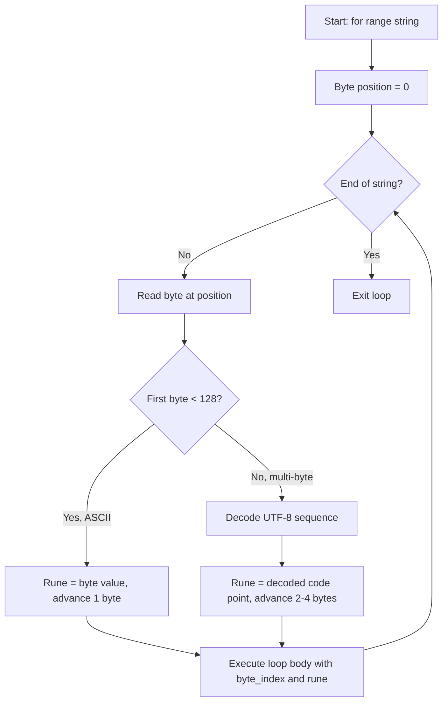

# Iterating Strings — Junior Level

## 1. Strings in Go: Bytes vs Runes

Before iterating strings, understand the two ways to think about them:

- **Bytes:** A string is stored as a sequence of bytes (UTF-8 encoded)
- **Runes:** A string represents Unicode characters; some characters need multiple bytes

```go
package main

import "fmt"

func main() {
    s := "Hello"
    fmt.Println(len(s))          // 5 bytes = 5 characters (ASCII)

    s2 := "世界"
    fmt.Println(len(s2))         // 6 bytes (3 bytes per Chinese char)
    fmt.Println(len([]rune(s2))) // 2 characters (runes)
}
```

---

## 2. for range on a String — Gives Runes

When you use `for range` on a string, Go automatically decodes UTF-8 and gives you Unicode characters (runes):

```go
package main

import "fmt"

func main() {
    for i, r := range "Hello" {
        fmt.Printf("index=%d, char=%c, value=%d\n", i, r, r)
    }
}
// Output:
// index=0, char=H, value=72
// index=1, char=e, value=101
// index=2, char=l, value=108
// index=3, char=l, value=108
// index=4, char=o, value=111
```

---

## 3. What is a Rune?

A `rune` is Go's name for a Unicode code point. It is an alias for `int32`. Every character you see — letters, digits, emoji, Chinese characters — has a unique rune value.

```go
package main

import "fmt"

func main() {
    var r rune = '世'
    fmt.Println(r)        // 19990 (Unicode code point)
    fmt.Printf("%c\n", r) // 世
    fmt.Printf("U+%04X\n", r) // U+4E16
}
```

---

## 4. Byte Index vs Character Index

The `i` in `for i, r := range s` is the **byte position**, not the character position:

```go
package main

import "fmt"

func main() {
    s := "Hi世界"
    for i, r := range s {
        fmt.Printf("byte[%d] = %c\n", i, r)
    }
}
// Output:
// byte[0] = H
// byte[1] = i
// byte[2] = 世   <- starts at byte 2, takes 3 bytes
// byte[5] = 界   <- starts at byte 5, takes 3 bytes
```

Notice: after 'i' (byte 1), the next index is 2 (for 世), then 5 (for 界). There are no indices 3, 4!

---

## 5. Iterating Only Characters (No Index)

Use `_` to ignore the byte index:

```go
package main

import "fmt"

func main() {
    greeting := "Hello, 世界!"
    for _, r := range greeting {
        fmt.Printf("%c ", r)
    }
    fmt.Println()
}
// Output: H e l l o ,   世 界 !
```

---

## 6. Iterating Only Byte Positions (No Character)

Use `for i := range s` to get only the starting byte index of each character:

```go
package main

import "fmt"

func main() {
    s := "Go!"
    for i := range s {
        fmt.Printf("byte position: %d\n", i)
    }
}
// Output:
// byte position: 0
// byte position: 1
// byte position: 2
```

---

## 7. Byte-by-Byte Iteration (Classic for Loop)

If you want individual bytes (not Unicode characters), use `s[i]`:

```go
package main

import "fmt"

func main() {
    s := "ABC"
    for i := 0; i < len(s); i++ {
        fmt.Printf("byte[%d] = %d (%c)\n", i, s[i], s[i])
    }
}
// Output:
// byte[0] = 65 (A)
// byte[1] = 66 (B)
// byte[2] = 67 (C)
```

`s[i]` returns a `byte` (uint8), not a `rune`.

---

## 8. Counting Characters vs Counting Bytes

```go
package main

import "fmt"

func main() {
    english := "Hello"
    chinese := "你好"
    emoji := "😀😁"

    fmt.Println("English:")
    fmt.Println("  bytes:", len(english))          // 5
    fmt.Println("  chars:", len([]rune(english)))  // 5

    fmt.Println("Chinese:")
    fmt.Println("  bytes:", len(chinese))          // 6
    fmt.Println("  chars:", len([]rune(chinese)))  // 2

    fmt.Println("Emoji:")
    fmt.Println("  bytes:", len(emoji))            // 8 (4 bytes each)
    fmt.Println("  chars:", len([]rune(emoji)))    // 2
}
```

---

## 9. Counting Words Using for range

```go
package main

import "fmt"

func countWords(s string) int {
    count := 0
    inWord := false
    for _, r := range s {
        if r == ' ' || r == '\t' || r == '\n' {
            inWord = false
        } else if !inWord {
            count++
            inWord = true
        }
    }
    return count
}

func main() {
    fmt.Println(countWords("Hello World"))     // 2
    fmt.Println(countWords("  Go  is  fun  ")) // 3
}
```

---

## 10. Finding a Character in a String

```go
package main

import "fmt"

func findChar(s string, target rune) int {
    for i, r := range s {
        if r == target {
            return i // byte position
        }
    }
    return -1
}

func main() {
    s := "Hello, World!"
    pos := findChar(s, 'W')
    fmt.Println("'W' at byte position:", pos) // 7
}
```

---

## 11. Checking if a String is Uppercase

```go
package main

import (
    "fmt"
    "unicode"
)

func isAllUpper(s string) bool {
    for _, r := range s {
        if unicode.IsLetter(r) && !unicode.IsUpper(r) {
            return false
        }
    }
    return true
}

func main() {
    fmt.Println(isAllUpper("HELLO"))  // true
    fmt.Println(isAllUpper("Hello"))  // false
    fmt.Println(isAllUpper("GO 2024")) // true (digits don't count)
}
```

---

## 12. Collecting Characters That Match a Condition

```go
package main

import (
    "fmt"
    "unicode"
)

func lettersOnly(s string) string {
    var result []rune
    for _, r := range s {
        if unicode.IsLetter(r) {
            result = append(result, r)
        }
    }
    return string(result)
}

func main() {
    fmt.Println(lettersOnly("Hello, World! 123")) // HelloWorld
    fmt.Println(lettersOnly("Go 1.22 is 🔥 hot")) // Goishot
}
```

---

## 13. Reversing a String (Correct Way)

You must use `[]rune` to correctly reverse a string with Unicode characters:

```go
package main

import "fmt"

func reverseString(s string) string {
    runes := []rune(s)
    for i, j := 0, len(runes)-1; i < j; i, j = i+1, j-1 {
        runes[i], runes[j] = runes[j], runes[i]
    }
    return string(runes)
}

func main() {
    fmt.Println(reverseString("Hello"))    // olleH
    fmt.Println(reverseString("世界"))     // 界世
    fmt.Println(reverseString("Go😀!"))    // !😀oG
}
```

---

## 14. Why You Cannot Reverse with Bytes

```go
package main

import "fmt"

func reverseBytes(s string) string {
    b := []byte(s)
    for i, j := 0, len(b)-1; i < j; i, j = i+1, j-1 {
        b[i], b[j] = b[j], b[i]
    }
    return string(b)
}

func main() {
    fmt.Println(reverseBytes("Hello"))    // olleH — works for ASCII
    fmt.Println(reverseBytes("世界"))     // garbled! — bytes shuffled, not characters
}
```

---

## 15. Mermaid: String Iteration Flow



---

## 16. Checking if All Characters are Digits

```go
package main

import (
    "fmt"
    "unicode"
)

func isDigitsOnly(s string) bool {
    if len(s) == 0 { return false }
    for _, r := range s {
        if !unicode.IsDigit(r) {
            return false
        }
    }
    return true
}

func main() {
    fmt.Println(isDigitsOnly("12345"))  // true
    fmt.Println(isDigitsOnly("123a5"))  // false
    fmt.Println(isDigitsOnly("٣"))      // true (Arabic digit 3 is also a digit)
}
```

---

## 17. Converting Rune to Lowercase During Iteration

```go
package main

import (
    "fmt"
    "strings"
    "unicode"
)

func toLowerManual(s string) string {
    runes := make([]rune, 0, len(s))
    for _, r := range s {
        runes = append(runes, unicode.ToLower(r))
    }
    return string(runes)
}

func main() {
    fmt.Println(toLowerManual("Hello World"))  // hello world
    fmt.Println(strings.ToLower("HÉLLO"))      // héllo (standard library)
}
```

---

## 18. Counting Vowels

```go
package main

import (
    "fmt"
    "strings"
)

func countVowels(s string) int {
    vowels := "aeiouAEIOU"
    count := 0
    for _, r := range s {
        if strings.ContainsRune(vowels, r) {
            count++
        }
    }
    return count
}

func main() {
    fmt.Println(countVowels("Hello World")) // 3
    fmt.Println(countVowels("Go language")) // 4
}
```

---

## 19. Splitting a String into Runes

```go
package main

import "fmt"

func main() {
    s := "Hello, 世界!"

    // Convert to rune slice
    runes := []rune(s)
    fmt.Println("Characters:", len(runes)) // 10

    // Access by character index
    fmt.Println("7th char:", string(runes[7]))  // 世
    fmt.Println("8th char:", string(runes[8]))  // 界

    // Range over rune slice
    for i, r := range runes {
        fmt.Printf("char[%d] = %c\n", i, r)
    }
}
```

---

## 20. Checking for a Specific Prefix

```go
package main

import "fmt"

func startsWithRune(s string, target rune) bool {
    for _, r := range s {
        return r == target // first rune
    }
    return false // empty string
}

func main() {
    fmt.Println(startsWithRune("Hello", 'H'))  // true
    fmt.Println(startsWithRune("世界", '世'))  // true
    fmt.Println(startsWithRune("", 'x'))        // false
}
```

---

## 21. Building a Frequency Table of Characters

```go
package main

import "fmt"

func charFrequency(s string) map[rune]int {
    freq := make(map[rune]int)
    for _, r := range s {
        freq[r]++
    }
    return freq
}

func main() {
    freq := charFrequency("banana")
    for char, count := range freq {
        fmt.Printf("%c: %d\n", char, count)
    }
    // a: 3
    // b: 1
    // n: 2
}
```

---

## 22. Truncating to N Characters (Safe Unicode)

```go
package main

import "fmt"

func truncate(s string, n int) string {
    count := 0
    for i, _ := range s {
        if count == n {
            return s[:i] // return bytes up to this rune's start
        }
        count++
    }
    return s // string has fewer than n chars
}

func main() {
    fmt.Println(truncate("Hello, 世界!", 8))  // "Hello, 世"
    fmt.Println(truncate("Go", 10))           // "Go"
}
```

---

## 23. Palindrome Check

```go
package main

import "fmt"

func isPalindrome(s string) bool {
    runes := []rune(s)
    for i, j := 0, len(runes)-1; i < j; i, j = i+1, j-1 {
        if runes[i] != runes[j] {
            return false
        }
    }
    return true
}

func main() {
    fmt.Println(isPalindrome("racecar"))    // true
    fmt.Println(isPalindrome("hello"))      // false
    fmt.Println(isPalindrome("上海自来水来自海上")) // true
}
```

---

## 24. Removing Duplicate Characters

```go
package main

import "fmt"

func removeDuplicates(s string) string {
    seen := make(map[rune]bool)
    var result []rune
    for _, r := range s {
        if !seen[r] {
            seen[r] = true
            result = append(result, r)
        }
    }
    return string(result)
}

func main() {
    fmt.Println(removeDuplicates("hello world"))  // helo wrd
    fmt.Println(removeDuplicates("programming"))  // progamin
}
```

---

## 25. Practical Example: Validate Email Format

```go
package main

import "fmt"

func hasAtSign(email string) bool {
    count := 0
    for _, r := range email {
        if r == '@' {
            count++
        }
    }
    return count == 1 // exactly one @ sign
}

func main() {
    emails := []string{"user@example.com", "bad@at@sign.com", "noatsign.com"}
    for _, email := range emails {
        fmt.Printf("%s: valid_at=%v\n", email, hasAtSign(email))
    }
}
```

---

## 26. Counting Lines in a String

```go
package main

import "fmt"

func countLines(s string) int {
    lines := 1
    for _, r := range s {
        if r == '\n' {
            lines++
        }
    }
    if len(s) == 0 { return 0 }
    return lines
}

func main() {
    text := "Line 1\nLine 2\nLine 3"
    fmt.Println(countLines(text)) // 3
    fmt.Println(countLines(""))   // 0
}
```

---

## 27. Masking Sensitive Data

```go
package main

import "fmt"

func maskMiddle(s string) string {
    runes := []rune(s)
    n := len(runes)
    if n <= 4 { return s }
    for i := 2; i < n-2; i++ {
        runes[i] = '*'
    }
    return string(runes)
}

func main() {
    fmt.Println(maskMiddle("password123")) // pa*******23
    fmt.Println(maskMiddle("1234567890"))  // 12******90
    fmt.Println(maskMiddle("AB"))          // AB (too short)
}
```

---

## 28. String Contains Digit Check

```go
package main

import (
    "fmt"
    "unicode"
)

func containsDigit(s string) bool {
    for _, r := range s {
        if unicode.IsDigit(r) {
            return true
        }
    }
    return false
}

func main() {
    fmt.Println(containsDigit("Hello123"))  // true
    fmt.Println(containsDigit("NoNumbers")) // false
}
```

---

## 29. Common String Iteration Patterns

```go
package main

import (
    "fmt"
    "unicode"
)

func main() {
    s := "Hello, World! 123"

    // Pattern 1: Count specific characters
    spaces := 0
    for _, r := range s { if r == ' ' { spaces++ } }
    fmt.Println("Spaces:", spaces) // 2

    // Pattern 2: First/last character
    runes := []rune(s)
    fmt.Println("First:", string(runes[0]))        // H
    fmt.Println("Last:", string(runes[len(runes)-1])) // 3

    // Pattern 3: Validate all chars
    allPrintable := true
    for _, r := range s {
        if !unicode.IsPrint(r) { allPrintable = false; break }
    }
    fmt.Println("All printable:", allPrintable) // true
}
```

---

## 30. Summary Table

| Operation | Code | Returns |
|---|---|---|
| Iterate runes | `for i, r := range s` | byte index, rune |
| Iterate bytes | `for i := 0; i < len(s); i++` | s[i] is byte |
| Character count | `len([]rune(s))` | int |
| Byte count | `len(s)` | int |
| Nth character | `[]rune(s)[n]` | rune |
| Nth byte | `s[n]` | byte |

**Key Rules for Juniors:**
1. `for range` on string gives runes (Unicode characters), not bytes
2. The index `i` is a byte position, not a character number
3. `len(s)` = bytes, `len([]rune(s))` = characters
4. Always use `[]rune` when you need character-by-character access
5. `s[i]` gives a byte, not a character
6. ASCII strings: bytes == characters. Multi-byte: bytes > characters
