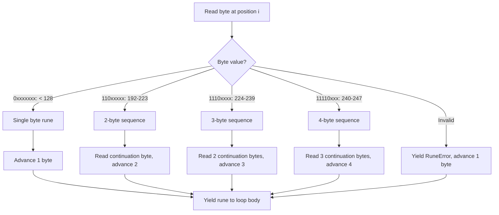

# Iterating Strings — Middle Level

## 1. UTF-8 Encoding in Depth

UTF-8 is a variable-width encoding where each character takes 1-4 bytes:

| Character Range | Bytes | Byte Pattern |
|---|---|---|
| U+0000 to U+007F (ASCII) | 1 | `0xxxxxxx` |
| U+0080 to U+07FF | 2 | `110xxxxx 10xxxxxx` |
| U+0800 to U+FFFF | 3 | `1110xxxx 10xxxxxx 10xxxxxx` |
| U+10000 to U+10FFFF | 4 | `11110xxx 10xxxxxx 10xxxxxx 10xxxxxx` |

```go
package main

import "fmt"

func main() {
    chars := []rune{'A', 'é', '世', '😀'}
    for _, r := range chars {
        s := string(r)
        fmt.Printf("U+%04X %c = %d bytes: % X\n", r, r, len(s), []byte(s))
    }
}
// U+0041 A = 1 bytes: 41
// U+00E9 é = 2 bytes: C3 A9
// U+4E16 世 = 3 bytes: E4 B8 96
// U+1F600 😀 = 4 bytes: F0 9F 98 80
```

---

## 2. Evolution of String Handling in Go

| Go Version | Change |
|---|---|
| Go 1.0 | Strings as UTF-8 byte sequences; `for range` yields (int, rune) |
| Go 1.0 | `unicode/utf8` package for manual UTF-8 operations |
| Go 1.5 | Source code required to be UTF-8 |
| Go 1.10 | `strings.Builder` for efficient concatenation |
| Go 1.20 | `strings.Clone()` to explicitly copy a string |
| Go 1.21 | `utf8.AppendRune()`, `utf8.AppendRuneIntoSlice()` |
| Go 1.23 | `strings.Lines()` returns `iter.Seq[string]` |

---

## 3. Alternative Approaches to String Iteration

### for range (Unicode-aware, idiomatic)
```go
for i, r := range s { use(i, r) }
```

### Classic for loop (byte-by-byte)
```go
for i := 0; i < len(s); i++ { use(i, s[i]) }
```

### []rune conversion (random character access)
```go
runes := []rune(s)
for i, r := range runes { use(i, r) } // i is CHAR index here
```

### utf8.DecodeRuneInString (manual UTF-8 decode)
```go
import "unicode/utf8"
for i := 0; i < len(s); {
    r, size := utf8.DecodeRuneInString(s[i:])
    use(i, r)
    i += size
}
```

### strings.NewReader (for streaming)
```go
import "strings"
r := strings.NewReader(s)
// r implements io.Reader, io.RuneReader, etc.
for {
    ch, _, err := r.ReadRune()
    if err != nil { break }
    use(ch)
}
```

---

## 4. Anti-Patterns

### Anti-Pattern 1: Using byte index as character index
```go
s := "Hello, 世界"
for i, _ := range s {
    fmt.Println(i) // NOT 0,1,2,3,... but 0,1,2,3,4,5,6,9
    // '世' starts at byte 7, '界' at byte 10... wait let's check
}
// H(0) e(1) l(2) l(3) o(4) ,(5) (6) 世(7) 界(10)
// Treating i as character index is WRONG
```

### Anti-Pattern 2: Slicing mid-rune
```go
s := "Hello, 世界"
// WRONG: slicing at byte 8 (inside '世' which is bytes 7,8,9)
truncated := s[:8] // invalid UTF-8!
fmt.Println(truncated) // may print garbage or replacement character
```

### Anti-Pattern 3: `s[i]` when character access is intended
```go
s := "Hello, 世界"
fmt.Println(s[7]) // 228 (first byte of '世'), not '世'!
fmt.Println(string(s[7])) // "ä" — incorrect character!
```

### Anti-Pattern 4: Byte-level length for display truncation
```go
// WRONG: truncates in middle of multi-byte char
func display(s string, maxLen int) string {
    if len(s) <= maxLen { return s }
    return s[:maxLen] // may cut inside a rune!
}

// CORRECT:
func display(s string, maxLen int) string {
    runes := []rune(s)
    if len(runes) <= maxLen { return s }
    return string(runes[:maxLen])
}
```

### Anti-Pattern 5: Repeated string concatenation in loop
```go
// O(n²) — DO NOT DO THIS
result := ""
for _, r := range bigString {
    result += string(r) // allocates new string each time!
}

// CORRECT: strings.Builder
var sb strings.Builder
for _, r := range bigString {
    sb.WriteRune(r)
}
result := sb.String()
```

---

## 5. Debugging Guide

### Debug: Unexpected character output
```go
s := "Héllo"
// If printing shows "Héllo" — terminal is not UTF-8, not a Go bug
// Check: fmt.Printf("%q\n", s) — shows escape sequences
fmt.Printf("%q\n", s) // "H\u00e9llo"
```

### Debug: len() returns unexpected value
```go
s := "café"
fmt.Println(len(s))          // 5, not 4! (é is 2 bytes)
fmt.Println(len([]rune(s)))  // 4 — correct character count
```

### Debug: for range byte index jumps
```go
s := "A世B"
for i, r := range s {
    fmt.Printf("i=%d r=%c\n", i, r)
}
// i=0 r=A
// i=1 r=世  (NOT i=2!)
// i=4 r=B   (NOT i=2! 世 takes 3 bytes: 1,2,3)
```

### Debug: Invalid UTF-8 in string
```go
import "unicode/utf8"
s := "valid\xffbytes"
if !utf8.ValidString(s) {
    fmt.Println("String contains invalid UTF-8")
}
// Range over invalid UTF-8 yields utf8.RuneError (U+FFFD) — no panic
```

---

## 6. Language Comparison

### Python
```python
s = "Hello, 世界"
# Python 3: strings are Unicode by default
for i, ch in enumerate(s):  # i is character index
    print(i, ch)
# len(s) = 9 (character count)
# s[7] = '世' (correct character access)
```

### JavaScript
```javascript
const s = "Hello, 世界"
// JavaScript strings are UTF-16
for (const ch of s) { console.log(ch) }  // Unicode-aware (for...of)
for (let i = 0; i < s.length; i++) { }   // UTF-16 code units (may split surrogates)
// [...s].length = 9 (character count)
// s.length = 9 (for BMP chars; emoji may differ)
```

### Rust
```rust
let s = "Hello, 世界";
// Rust strings are UTF-8
for (i, c) in s.char_indices() { // i = byte index, c = char
    println!("{}: {}", i, c);
}
for c in s.chars() { }    // characters only
for b in s.bytes() { }    // bytes only
// s.len() = 13 bytes; s.chars().count() = 9 chars
```

### Java
```java
String s = "Hello, 世界";
// Java strings are UTF-16
for (int i = 0; i < s.length(); i++) {
    char c = s.charAt(i); // UTF-16 code unit
}
// codePoints() for Unicode-aware iteration
s.codePoints().forEach(cp -> System.out.println((char) cp));
```

**Key difference:** Go's `for range` on strings is uniquely automatic UTF-8 decoding with byte indices. Python and Rust are the most similar; Java and JavaScript use UTF-16.

---

## 7. strings.Builder Pattern

```go
package main

import (
    "fmt"
    "strings"
    "unicode"
)

func camelToSnake(s string) string {
    var sb strings.Builder
    for i, r := range s {
        if unicode.IsUpper(r) && i > 0 {
            sb.WriteByte('_')
        }
        sb.WriteRune(unicode.ToLower(r))
    }
    return sb.String()
}

func main() {
    fmt.Println(camelToSnake("helloWorld"))    // hello_world
    fmt.Println(camelToSnake("myHTTPClient"))  // my_h_t_t_p_client
    fmt.Println(camelToSnake("userId"))        // user_id
}
```

---

## 8. Using unicode Package

```go
package main

import (
    "fmt"
    "unicode"
)

func analyzeString(s string) {
    letters, digits, spaces, others := 0, 0, 0, 0
    for _, r := range s {
        switch {
        case unicode.IsLetter(r): letters++
        case unicode.IsDigit(r):  digits++
        case unicode.IsSpace(r):  spaces++
        default:                  others++
        }
    }
    fmt.Printf("letters=%d digits=%d spaces=%d others=%d\n",
        letters, digits, spaces, others)
}

func main() {
    analyzeString("Hello, World! 123")
    // letters=10 digits=3 spaces=2 others=2
}
```

---

## 9. String Comparison During Iteration

```go
package main

import (
    "fmt"
    "unicode"
)

// Check if two strings are equal ignoring case and non-letter chars
func fuzzyEqual(a, b string) bool {
    ra := filterLetters(a)
    rb := filterLetters(b)
    if len(ra) != len(rb) { return false }
    for i, r := range ra {
        if unicode.ToLower(r) != unicode.ToLower(rb[i]) {
            return false
        }
    }
    return true
}

func filterLetters(s string) []rune {
    var r []rune
    for _, ch := range s {
        if unicode.IsLetter(ch) { r = append(r, ch) }
    }
    return r
}

func main() {
    fmt.Println(fuzzyEqual("Hello, World!", "helloworld")) // true
    fmt.Println(fuzzyEqual("Go", "Java"))                  // false
}
```

---

## 10. Handling Invalid UTF-8

```go
package main

import (
    "fmt"
    "unicode/utf8"
)

func sanitizeUTF8(s string) string {
    if utf8.ValidString(s) {
        return s // fast path: no work needed
    }
    // Slow path: fix invalid sequences
    var result []rune
    for _, r := range s {
        if r == utf8.RuneError {
            result = append(result, '?') // replace invalid with ?
        } else {
            result = append(result, r)
        }
    }
    return string(result)
}

func main() {
    valid := "Hello, 世界"
    invalid := "Hello\xff\xfeWorld"
    fmt.Println(sanitizeUTF8(valid))   // Hello, 世界
    fmt.Println(sanitizeUTF8(invalid)) // Hello??World
}
```

---

## 11. Performance: String vs []rune Iteration

```go
package main

import "testing"

var s = "Hello, 世界! " + string(make([]rune, 10000))

// Benchmark 1: range over string (UTF-8 decode inline)
func BenchmarkStringRange(b *testing.B) {
    for n := 0; n < b.N; n++ {
        count := 0
        for range s { count++ }
    }
}

// Benchmark 2: range over []rune (pre-converted)
func BenchmarkRuneRange(b *testing.B) {
    runes := []rune(s) // pre-convert once
    for n := 0; n < b.N; n++ {
        count := 0
        for range runes { count++ }
    }
}
// Results: []rune range is faster (no decode) but uses more memory
// String range: no allocation, pays UTF-8 decode cost per rune
// []rune: 4x memory (int32 per char), faster iteration
```

---

## 12. Splitting into Lines with for range

```go
package main

import "fmt"

func splitLines(s string) []string {
    var lines []string
    start := 0
    for i, r := range s {
        if r == '\n' {
            lines = append(lines, s[start:i])
            start = i + 1
        }
    }
    if start < len(s) {
        lines = append(lines, s[start:])
    }
    return lines
}

func main() {
    text := "line1\nline2\nline3"
    for i, line := range splitLines(text) {
        fmt.Printf("%d: %s\n", i, line)
    }
}
```

---

## 13. String Tokenization

```go
package main

import (
    "fmt"
    "unicode"
)

type Token struct {
    Type  string
    Value string
}

func tokenize(s string) []Token {
    var tokens []Token
    i := 0
    runes := []rune(s)
    for i < len(runes) {
        r := runes[i]
        switch {
        case unicode.IsSpace(r):
            i++
        case unicode.IsDigit(r):
            j := i
            for j < len(runes) && unicode.IsDigit(runes[j]) { j++ }
            tokens = append(tokens, Token{"NUMBER", string(runes[i:j])})
            i = j
        case unicode.IsLetter(r):
            j := i
            for j < len(runes) && unicode.IsLetter(runes[j]) { j++ }
            tokens = append(tokens, Token{"WORD", string(runes[i:j])})
            i = j
        default:
            tokens = append(tokens, Token{"SYMBOL", string(r)})
            i++
        }
    }
    return tokens
}

func main() {
    for _, tok := range tokenize("hello 42 + world") {
        fmt.Printf("[%s: %q]\n", tok.Type, tok.Value)
    }
}
```

---

## 14. Rune Histogram with Sorting

```go
package main

import (
    "fmt"
    "sort"
)

func topRunes(s string, n int) {
    freq := map[rune]int{}
    for _, r := range s { freq[r]++ }

    type rf struct{ r rune; f int }
    pairs := make([]rf, 0, len(freq))
    for r, f := range freq { pairs = append(pairs, rf{r, f}) }
    sort.Slice(pairs, func(i, j int) bool {
        if pairs[i].f != pairs[j].f { return pairs[i].f > pairs[j].f }
        return pairs[i].r < pairs[j].r
    })

    for i, p := range pairs {
        if i >= n { break }
        fmt.Printf("%c: %d\n", p.r, p.f)
    }
}

func main() {
    topRunes("banana split", 4)
    // a: 3
    //  : 1
    // b: 1
    // i: 1
}
```

---

## 15. Practical Example: Password Strength Checker

```go
package main

import (
    "fmt"
    "unicode"
)

type Strength struct {
    HasUpper  bool
    HasLower  bool
    HasDigit  bool
    HasSymbol bool
    Length    int
}

func checkPassword(s string) Strength {
    var st Strength
    for _, r := range s {
        st.Length++
        switch {
        case unicode.IsUpper(r): st.HasUpper = true
        case unicode.IsLower(r): st.HasLower = true
        case unicode.IsDigit(r): st.HasDigit = true
        default:                 st.HasSymbol = true
        }
    }
    return st
}

func main() {
    passwords := []string{"password", "P@ssw0rd", "Tr0ub4dor&3"}
    for _, p := range passwords {
        s := checkPassword(p)
        score := 0
        if s.HasUpper { score++ }
        if s.HasLower { score++ }
        if s.HasDigit { score++ }
        if s.HasSymbol { score++ }
        if s.Length >= 12 { score++ }
        fmt.Printf("%-15s score=%d/5\n", p, score)
    }
}
```

---

## 16. Mermaid: UTF-8 Multi-byte Decoding



---

## 17. Unicode Normalization Considerations

```go
package main

import (
    "fmt"
    "unicode/utf8"
    // "golang.org/x/text/unicode/norm" — for normalization
)

func main() {
    // "é" can be represented as:
    // - U+00E9 (precomposed, 1 rune, 2 bytes)
    // - U+0065 U+0301 (decomposed: 'e' + combining accent, 2 runes, 3 bytes)

    precomposed := "\u00e9"
    decomposed := "\u0065\u0301"

    fmt.Println(precomposed == decomposed) // false! Different bytes
    fmt.Println(utf8.RuneCountInString(precomposed)) // 1 rune
    fmt.Println(utf8.RuneCountInString(decomposed))  // 2 runes

    // Visual comparison is the same but string comparison is not!
    // Use golang.org/x/text/unicode/norm for canonical comparison
}
```

---

## 18. Working with Substrings Safely

```go
package main

import (
    "fmt"
    "unicode/utf8"
)

// SafeSubstring returns the substring from start to end (rune indices)
func SafeSubstring(s string, start, end int) string {
    r := []rune(s)
    if start < 0 { start = 0 }
    if end > len(r) { end = len(r) }
    if start >= end { return "" }
    return string(r[start:end])
}

// ByteSubstring is faster but requires knowing safe byte positions
func ByteSubstringFromRune(s string, runeStart, runeEnd int) string {
    byteStart := 0
    byteEnd := len(s)
    runeIdx := 0
    for i := range s {
        if runeIdx == runeStart { byteStart = i }
        if runeIdx == runeEnd { byteEnd = i; break }
        runeIdx++
    }
    return s[byteStart:byteEnd]
}

func main() {
    s := "Hello, 世界!"
    fmt.Println(SafeSubstring(s, 7, 9)) // 世界
    fmt.Println(utf8.RuneCountInString(SafeSubstring(s, 7, 9))) // 2
}
```

---

## 19. String Interning Pattern

```go
package main

import "fmt"

// String interning avoids duplicate allocations for repeated strings
type Interner struct {
    m map[string]string
}

func NewInterner() *Interner { return &Interner{m: map[string]string{}} }

func (in *Interner) Intern(s string) string {
    if existing, ok := in.m[s]; ok {
        return existing // return canonical reference
    }
    in.m[s] = s
    return s
}

// When building many strings from iteration:
func (in *Interner) FromRunes(runes []rune) string {
    s := string(runes)
    return in.Intern(s)
}

func main() {
    intern := NewInterner()
    words := []string{}
    text := "the cat sat on the mat the cat"
    word := []rune{}
    for _, r := range text {
        if r == ' ' {
            if len(word) > 0 {
                words = append(words, intern.FromRunes(word))
                word = word[:0]
            }
        } else {
            word = append(word, r)
        }
    }
    fmt.Println(words) // interned strings share memory for duplicates
}
```

---

## 20. Pattern: Streaming Rune Processor

```go
package main

import "fmt"

type RuneProcessor func(rune) rune

func applyAll(s string, processors ...RuneProcessor) string {
    var result []rune
    for _, r := range s {
        for _, proc := range processors {
            r = proc(r)
        }
        result = append(result, r)
    }
    return string(result)
}

func main() {
    import_unicode := func(r rune) rune {
        if r >= 'a' && r <= 'z' { return r - 32 }
        return r
    }
    removeVowels := func(r rune) rune {
        switch r {
        case 'a', 'e', 'i', 'o', 'u', 'A', 'E', 'I', 'O', 'U':
            return 0
        }
        return r
    }

    result := applyAll("Hello World",
        import_unicode,
        func(r rune) rune { if r == 0 { return -1 }; return r },
    )
    fmt.Println(result)
}
```

---

## 21. String Diff — Character Level

```go
package main

import "fmt"

type EditOp struct {
    Type string // "keep", "delete", "insert"
    Char rune
}

func simpleDiff(a, b string) {
    ra, rb := []rune(a), []rune(b)
    // Simple LCS-based diff (educational, not production-grade)
    for i, ca := range ra {
        if i < len(rb) {
            if ca == rb[i] {
                fmt.Printf("  %c\n", ca)
            } else {
                fmt.Printf("- %c\n", ca)
                fmt.Printf("+ %c\n", rb[i])
            }
        } else {
            fmt.Printf("- %c\n", ca)
        }
    }
    for i := len(ra); i < len(rb); i++ {
        fmt.Printf("+ %c\n", rb[i])
    }
}

func main() {
    simpleDiff("Hello", "Hillo")
}
```

---

## 22. Summary: Middle-Level String Iteration Insights

| Topic | Key Insight |
|---|---|
| UTF-8 byte index | `i` in range jumps by 1-4 bytes per rune |
| RuneError | Invalid UTF-8 yields U+FFFD, no panic |
| `s[i]` | Returns byte (uint8), not character |
| `[]rune(s)` | O(n) allocation, enables character-indexed access |
| strings.Builder | O(n) total, avoids O(n²) of string concatenation |
| normalization | Visually same strings may not be `==` equal |
| unicode package | `IsLetter`, `IsDigit`, `ToLower` etc. for rune analysis |
| Performance | String range = no alloc + UTF-8 decode cost |
