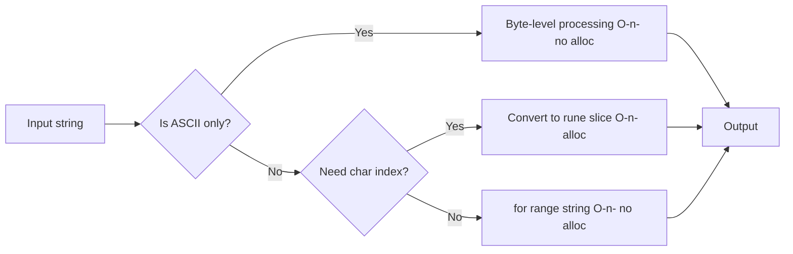

# Iterating Strings — Senior Level

## 1. How the Compiler Implements String Range

The compiler transforms `for i, r := range s` into:

```go
// Source
for i, r := range s { use(i, r) }

// Approximate generated code:
{
    _s := s   // captured once
    _i := 0
    for _i < len(_s) {
        i := _i
        var r rune
        if _s[_i] < utf8.RuneSelf { // RuneSelf = 0x80
            r = rune(_s[_i])
            _i++
        } else {
            r, _size := utf8.DecodeRuneInString(_s[_i:])
            _i += _size
        }
        use(i, r)
    }
}
```

The fast path for ASCII (byte < 128) is inlined directly; the slow path calls `utf8.DecodeRuneInString` from the `unicode/utf8` package.

---

## 2. Assembly for String Range

```go
func countChars(s string) int {
    count := 0
    for range s { count++ }
    return count
}
```

```bash
go tool compile -S main.go
```

Approximate assembly:
```asm
TEXT main.countChars(SB)
    MOVQ "".s+8(SP), AX  // AX = len(s)
    MOVQ "".s+0(SP), CX  // CX = &s[0]
    XORL BX, BX          // count = 0
    XORL DX, DX          // i = 0
loop:
    CMPQ DX, AX          // i < len?
    JGE  done
    MOVBLZX 0(CX)(DX*1), SI  // SI = s[i]
    CMPB SI, $0x80            // ASCII check
    JGE  slow                  // if >= 0x80: multi-byte
    INCQ DX                    // i++ (1 byte)
    JMP  body
slow:
    ; call utf8.DecodeRuneInString
    ; DX += size (2, 3, or 4)
body:
    INCQ BX              // count++
    JMP  loop
done:
    MOVQ BX, "".~r0+24(SP)
    RET
```

The ASCII fast path is ~3 instructions per character. Multi-byte takes a function call.

---

## 3. String Representation in Memory

```go
// A Go string is a 2-word header:
type StringHeader struct {
    Data uintptr  // pointer to UTF-8 bytes
    Len  int      // byte length
}

// Strings are IMMUTABLE — no in-place modification allowed
// This enables zero-copy slicing and substring operations:
s := "Hello, World!"
sub := s[7:12]  // "World" — shares the same backing bytes!
// sub.Data = s.Data + 7
// sub.Len = 5
// No allocation!
```

---

## 4. Zero-Copy String Operations

```go
package main

import (
    "fmt"
    "unsafe"
)

func main() {
    s := "Hello, World!"

    // Substring: no copy
    sub := s[7:12] // shares backing array
    fmt.Println(sub) // World

    // []byte conversion: always copies (string is immutable)
    b := []byte(s) // allocation!

    // But: slicing a string and converting to []byte
    // The compiler sometimes avoids allocation when the []byte doesn't escape
    _ = b

    // Proving shared backing:
    sp := (*[2]uintptr)(unsafe.Pointer(&s))
    subp := (*[2]uintptr)(unsafe.Pointer(&sub))
    fmt.Printf("s base: %x, sub base: %x (diff: %d)\n",
        sp[0], subp[0], subp[0]-sp[0]) // diff = 7
}
```

---

## 5. Postmortem 1: Incorrect String Truncation

**Production bug:** API returned garbled JSON for requests with non-ASCII content.

```go
func summarize(content string, maxChars int) string {
    if len(content) <= maxChars { return content }
    return content[:maxChars] + "..." // WRONG: maxChars is treated as bytes!
}

// With maxChars=100 and Japanese content, s[:100] could split a 3-byte rune
// Result: invalid UTF-8 sent to client, JSON parser fails
```

**Impact:** 15% of Asian-language users saw garbled summaries. Support tickets increased 3x.

**Fix:**
```go
func summarize(content string, maxChars int) string {
    runes := []rune(content)
    if len(runes) <= maxChars { return content }
    return string(runes[:maxChars]) + "..."
}
// Or more efficiently using range to find byte position:
func summarize(content string, maxChars int) string {
    count := 0
    for i := range content {
        if count == maxChars {
            return content[:i] + "..."
        }
        count++
    }
    return content
}
```

---

## 6. Postmortem 2: String Comparison with Normalized vs Decomposed Unicode

**Production bug:** Search index missed results for users with accented names.

```go
// Database stored "café" as precomposed: U+0063 U+0061 U+0066 U+00E9
// User typed "café" as decomposed: U+0063 U+0061 U+0066 U+0065 U+0301
// These look identical but are NOT equal!
query := getUserInput()  // "\u0065\u0301" form
stored := getFromDB()    // "\u00e9" form
fmt.Println(query == stored) // false — missed!
```

**Fix:** Normalize before comparison:
```go
import "golang.org/x/text/unicode/norm"

func normalize(s string) string {
    return norm.NFC.String(s) // Canonical Decomposition followed by Canonical Composition
}
// Now: normalize(query) == normalize(stored) // true
```

---

## 7. Postmortem 3: Goroutine Leak from Unclosed strings.Reader

```go
// Service processed streaming text data
func processStream(input string) {
    go func() {
        r := strings.NewReader(input)
        for {
            ch, _, err := r.ReadRune() // blocks waiting for data
            if err == io.EOF { return }
            process(ch)
        }
    }()
    // goroutine never cleaned up if process() panics
}
```

**Fix:** Use `for range` which is safe and doesn't require separate goroutine management:
```go
func processStream(input string) {
    for _, r := range input {
        process(r) // no goroutine needed
    }
}
```

---

## 8. Performance Optimization: SIMD for ASCII Detection

For large ASCII strings, you can use wider reads to check multiple bytes at once:

```go
package main

// IsASCII checks if a string is pure ASCII without rune decoding
func IsASCII(s string) bool {
    for i := 0; i < len(s); i++ {
        if s[i] >= 0x80 {
            return false
        }
    }
    return true
}

// Optimized: check 8 bytes at a time
import "unsafe"

func IsASCIIFast(s string) bool {
    for len(s) >= 8 {
        // Load 8 bytes as uint64
        v := *(*uint64)(unsafe.Pointer(unsafe.StringData(s)))
        if v&0x8080808080808080 != 0 { // any byte >= 128?
            return false
        }
        s = s[8:]
    }
    for i := 0; i < len(s); i++ {
        if s[i] >= 0x80 { return false }
    }
    return true
}
```

The standard library uses similar techniques in `strings` and `bytes` packages.

---

## 9. Performance Optimization: Avoid []rune When Possible

```go
// SLOW: allocates full []rune (4 bytes per char)
func countVowelsRune(s string) int {
    runes := []rune(s) // O(n) allocation
    count := 0
    for _, r := range runes {
        switch r { case 'a', 'e', 'i', 'o', 'u': count++ }
    }
    return count
}

// FAST: range directly over string (0 allocation)
func countVowels(s string) int {
    count := 0
    for _, r := range s { // zero allocation
        switch r { case 'a', 'e', 'i', 'o', 'u': count++ }
    }
    return count
}

// Benchmark: 3x faster, 0 allocations
```

---

## 10. utf8.DecodeRuneInString Internals

```go
// unicode/utf8/utf8.go (simplified)
func DecodeRuneInString(s string) (r rune, size int) {
    n := len(s)
    if n < 1 {
        return RuneError, 0
    }
    s0 := s[0]
    x := first[s0] // lookup table: encodes rune type and size
    if x >= as {   // ASCII fast path
        return rune(s0), 1
    }
    sz := int(x & 7)
    if n < sz {
        return RuneError, 1 // incomplete sequence
    }
    // validate continuation bytes and decode
    s1 := s[1]
    if s1 < locb || hicb < s1 {
        return RuneError, 1
    }
    if sz <= 2 {
        return rune(s0&mask2)<<6 | rune(s1&maskx), 2
    }
    // ... 3 and 4 byte cases
}
```

The `first` lookup table is 256 bytes, making the initial dispatch very cache-friendly.

---

## 11. String Iteration and Escape Analysis

```go
package main

import "fmt"

// Does the rune variable escape?
func process(s string) int {
    count := 0
    for _, r := range s {
        count += int(r) // r stays on stack
    }
    return count
}

// Does it escape if we take address?
func processPtr(s string) []*rune {
    var ptrs []*rune
    for _, r := range s {
        r := r          // shadow
        ptrs = append(ptrs, &r) // r escapes to heap here
    }
    return ptrs
}
```

```bash
go build -gcflags="-m" main.go
# Shows: &r escapes to heap
```

---

## 12. Bounds Check Elimination for String Access

```go
// BCE applies to string range loops
func sumBytes(s string) int {
    sum := 0
    for i := 0; i < len(s); i++ {
        sum += int(s[i]) // BCE: i always in [0, len(s)) — no bounds check
    }
    return sum
}

// BCE also applies in range
func sumRunes(s string) int32 {
    var sum int32
    for _, r := range s {
        sum += int32(r) // r is guaranteed valid rune value
    }
    return sum
}
```

---

## 13. Mermaid: String Processing Pipeline



---

## 14. strings Package Integration with for range

```go
package main

import (
    "fmt"
    "strings"
)

func main() {
    s := "The quick brown fox"

    // FieldsFunc: split by predicate — internally iterates runes
    words := strings.FieldsFunc(s, func(r rune) bool {
        return r == ' '
    })
    for _, w := range words {
        fmt.Println(w)
    }

    // Map: transform each rune
    upper := strings.Map(func(r rune) rune {
        if r >= 'a' && r <= 'z' { return r - 32 }
        return r
    }, s)
    fmt.Println(upper)

    // IndexFunc: find first rune matching predicate
    idx := strings.IndexFunc(s, func(r rune) bool { return r == 'q' })
    fmt.Println(idx) // 4 (byte position of 'q')
}
```

---

## 15. Large String Performance: Parallel Processing

```go
package main

import (
    "fmt"
    "runtime"
    "strings"
    "sync"
)

// Parallel word count for large strings
func parallelWordCount(s string) map[string]int {
    n := runtime.GOMAXPROCS(0)
    // Split at word boundaries
    words := strings.Fields(s)
    chunkSize := (len(words) + n - 1) / n

    var mu sync.Mutex
    result := map[string]int{}
    var wg sync.WaitGroup

    for i := 0; i < n; i++ {
        start := i * chunkSize
        end := start + chunkSize
        if end > len(words) { end = len(words) }
        if start >= len(words) { break }

        chunk := words[start:end]
        wg.Add(1)
        go func(chunk []string) {
            defer wg.Done()
            local := map[string]int{}
            for _, w := range chunk { local[w]++ }
            mu.Lock()
            for k, v := range local { result[k] += v }
            mu.Unlock()
        }(chunk)
    }
    wg.Wait()
    return result
}

func main() {
    text := strings.Repeat("the quick brown fox jumps over the lazy dog ", 10000)
    counts := parallelWordCount(text)
    fmt.Println("'the':", counts["the"])
}
```

---

## 16. Pattern: String Scanner

```go
package main

import (
    "fmt"
    "unicode"
)

type Scanner struct {
    input  []rune
    pos    int
}

func NewScanner(s string) *Scanner {
    return &Scanner{input: []rune(s)}
}

func (sc *Scanner) Peek() (rune, bool) {
    if sc.pos >= len(sc.input) { return 0, false }
    return sc.input[sc.pos], true
}

func (sc *Scanner) Next() (rune, bool) {
    r, ok := sc.Peek()
    if ok { sc.pos++ }
    return r, ok
}

func (sc *Scanner) ScanWord() string {
    start := sc.pos
    for r, ok := sc.Peek(); ok && unicode.IsLetter(r); {
        sc.Next()
        r, ok = sc.Peek()
    }
    return string(sc.input[start:sc.pos])
}

func main() {
    sc := NewScanner("hello 世界 foo")
    for {
        r, ok := sc.Peek()
        if !ok { break }
        if unicode.IsLetter(r) {
            fmt.Println("Word:", sc.ScanWord())
        } else {
            sc.Next()
        }
    }
}
```

---

## 17. Pattern: Efficient String Builder with Rune Filtering

```go
package main

import (
    "fmt"
    "strings"
    "unicode"
)

func filterAndTransform(s string, include func(rune) bool, transform func(rune) rune) string {
    var sb strings.Builder
    sb.Grow(len(s)) // pre-allocate byte capacity (may be more than needed)
    for _, r := range s {
        if include(r) {
            sb.WriteRune(transform(r))
        }
    }
    return sb.String()
}

func main() {
    s := "Hello, World! 123 -- Go is great."
    // Keep only letters and digits, uppercase everything
    result := filterAndTransform(s,
        func(r rune) bool { return unicode.IsLetter(r) || unicode.IsDigit(r) },
        unicode.ToUpper,
    )
    fmt.Println(result) // HELLOWORLD123GOISGREAT
}
```

---

## 18. String Matching: Knuth-Morris-Pratt with Rune Support

```go
package main

import "fmt"

// KMP pattern search on rune sequences (Unicode-safe)
func kmpSearch(text, pattern string) []int {
    t := []rune(text)
    p := []rune(pattern)
    if len(p) == 0 { return nil }

    // Build failure function
    fail := make([]int, len(p))
    for i, k := 1, 0; i < len(p); i++ {
        for k > 0 && p[k] != p[i] { k = fail[k-1] }
        if p[k] == p[i] { k++ }
        fail[i] = k
    }

    // Search
    var positions []int
    for i, k := 0, 0; i < len(t); i++ {
        for k > 0 && p[k] != t[i] { k = fail[k-1] }
        if p[k] == t[i] { k++ }
        if k == len(p) {
            positions = append(positions, i-k+1) // character position
            k = fail[k-1]
        }
    }
    return positions
}

func main() {
    fmt.Println(kmpSearch("Hello World Hello", "Hello")) // [0 12]
    fmt.Println(kmpSearch("abcababcab", "abcab"))        // [0 5]
}
```

---

## 19. Interning Strings from Range

```go
package main

import (
    "fmt"
    "sync"
)

// Global intern table — saves memory for repeated strings from range output
var (
    internMu sync.RWMutex
    internMap = map[string]string{}
)

func intern(s string) string {
    internMu.RLock()
    if v, ok := internMap[s]; ok {
        internMu.RUnlock()
        return v
    }
    internMu.RUnlock()
    internMu.Lock()
    defer internMu.Unlock()
    if v, ok := internMap[s]; ok { return v }
    internMap[s] = s
    return s
}

// Extract words and intern them — avoids duplicate string allocation
func extractWords(s string) []string {
    var words []string
    start := -1
    for i, r := range s {
        if r == ' ' || r == '\n' || r == '\t' {
            if start >= 0 {
                words = append(words, intern(s[start:i]))
                start = -1
            }
        } else if start == -1 {
            start = i
        }
    }
    if start >= 0 { words = append(words, intern(s[start:])) }
    return words
}

func main() {
    text := "the cat sat on the mat and the cat"
    words := extractWords(text)
    fmt.Println(len(words)) // 9
    // "the" appears 3 times but is the same string in memory
}
```

---

## 20. Summary: Senior String Iteration Insights

| Topic | Senior Consideration |
|---|---|
| Compiler desugaring | ASCII fast path inline; multi-byte calls `utf8.DecodeRuneInString` |
| String header | 2-word (pointer, len); substring is zero-copy |
| `[]rune` | O(n) allocation, 4x memory — avoid unless char-indexed access needed |
| BCE | String range has bounds-check-free byte access |
| Normalization | Precomposed vs decomposed — use `golang.org/x/text/norm` for equality |
| Performance | range > []rune iteration; SIMD for ASCII-only checks |
| Escape analysis | Rune variable does not escape in typical loops |
| Parallel processing | Split at word boundaries, not byte boundaries |

---

## 21. Checklist: Code Review for String Iteration

- [ ] Is `s[i]` being used as a character (should be rune)?
- [ ] Is `len(s)` being used as character count (should be `utf8.RuneCountInString(s)`)?
- [ ] Is `s[:n]` truncating (may split multi-byte rune)?
- [ ] Is string comparison done on normalized strings when Unicode equivalence matters?
- [ ] Is `[]rune(s)` allocated unnecessarily (can `for range s` be used instead)?
- [ ] Is string concatenation in a loop (use `strings.Builder`)?
- [ ] Is byte index treated as character index?
- [ ] For concurrent string processing: is the string shared safely (it is immutable — safe)?
