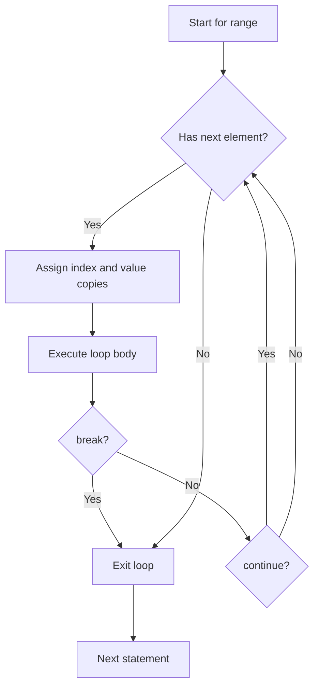

# for range — Middle Level

## 1. How `for range` Works Internally

At compile time, Go desugars `for range` into a regular for loop. The range expression is evaluated once before the loop begins. This means:

```go
s := []int{1, 2, 3}
for i, v := range s {
    // s is evaluated once here — appending to s mid-loop does NOT change iteration count
    s = append(s, 99)
    fmt.Println(i, v)
}
// Prints only 3 iterations (original length)
```

The compiler captures `len(s)` at the start. Any modifications to `s` inside the loop do not affect how many times the loop runs.

---

## 2. Evolution of for range in Go

| Go Version | What Changed |
|---|---|
| Go 1.0 | Basic `for range` over slice, array, map, string, channel |
| Go 1.4 | `for range` without variables: `for range ch {}` |
| Go 1.22 | Range over integers: `for i := range 5 {}` |
| Go 1.22 | Loop variable per-iteration semantics (closure bug fixed) |
| Go 1.23 | Range over functions (iterator functions) |

---

## 3. Alternative Approaches to Iteration

### Classic for loop
```go
for i := 0; i < len(s); i++ {
    fmt.Println(s[i])
}
```
Use when: you need to step by more than 1, iterate in reverse, or need precise index control.

### Recursive iteration
```go
func printAll(s []int, i int) {
    if i >= len(s) { return }
    fmt.Println(s[i])
    printAll(s, i+1)
}
```
Rarely used in Go; causes stack growth, no practical benefit over loops.

### `slices.All` / `slices.Values` (Go 1.23+)
```go
import "slices"
for i, v := range slices.All(mySlice) {
    fmt.Println(i, v)
}
```

### Function iterators (Go 1.23+)
```go
func Iterate(s []int) func(func(int, int) bool) {
    return func(yield func(int, int) bool) {
        for i, v := range s {
            if !yield(i, v) { return }
        }
    }
}
```

---

## 4. Anti-Patterns

### Anti-Pattern 1: Modifying the value variable thinking it affects the slice

```go
// WRONG
s := []int{1, 2, 3}
for _, v := range s {
    v *= 2 // v is a copy — s is unchanged
}

// CORRECT
for i := range s {
    s[i] *= 2
}
```

### Anti-Pattern 2: Relying on map iteration order

```go
// WRONG — output varies every run
m := map[string]int{"a": 1, "b": 2, "c": 3}
for k, v := range m {
    fmt.Println(k, v) // different order each run
}

// CORRECT when order matters
keys := make([]string, 0, len(m))
for k := range m { keys = append(keys, k) }
sort.Strings(keys)
for _, k := range keys {
    fmt.Println(k, m[k])
}
```

### Anti-Pattern 3: Closure capture bug (pre-Go 1.22)

```go
// WRONG in pre-1.22
for _, v := range items {
    go func() { process(v) }() // all goroutines see same v
}

// CORRECT
for _, v := range items {
    v := v // shadow variable
    go func() { process(v) }()
}
// Or pass v as argument
for _, v := range items {
    go func(val Item) { process(val) }(v)
}
```

### Anti-Pattern 4: Taking address of range variable (pre-Go 1.22)

```go
// WRONG — all pointers point to same variable
ptrs := make([]*int, 3)
for i, v := range []int{1, 2, 3} {
    ptrs[i] = &v // all point to same v!
}

// CORRECT
for i, v := range []int{1, 2, 3} {
    v := v
    ptrs[i] = &v
}
```

### Anti-Pattern 5: Mutating slice while ranging (changing length)

```go
// UNPREDICTABLE — don't do this
s := []int{1, 2, 3}
for i, v := range s {
    if v == 2 {
        s = append(s[:i], s[i+1:]...) // mutating slice during range
    }
}
```

---

## 5. Debugging Guide

### Bug: Loop runs 0 times
```go
var s []int // nil slice
for _, v := range s { // 0 iterations — is s actually populated?
    fmt.Println(v)
}
// Debug: fmt.Println("len:", len(s))
```

### Bug: Wrong values printed (closure)
```go
// Add logging to see captured value
for i, v := range items {
    fmt.Printf("capturing i=%d v=%v\n", i, v) // check here
    go func() { fmt.Println(v) }()
}
```

### Bug: Map values seem stale
```go
// Remember: v is a copy. For structs you need the key
type S struct{ X int }
m := map[string]S{"a": {1}}
for k, v := range m {
    v.X = 99 // doesn't change m["a"]
    _ = k
}
// Fix:
for k := range m {
    s := m[k]
    s.X = 99
    m[k] = s
}
```

### Bug: String index off by expected amount
```go
// For multi-byte characters, byte index != char index
s := "Hello, 世界"
for i, r := range s {
    fmt.Printf("byte %d = rune %c\n", i, r)
    // i jumps by 3 for Chinese characters
}
```

### Using `go vet` and race detector
```bash
go vet ./...
go run -race main.go
```

---

## 6. Language Comparison

### Python
```python
# Python — enumerate gives index and value
for i, v in enumerate([1, 2, 3]):
    print(i, v)

# Dict iteration
for k, v in d.items():
    print(k, v)
```

### JavaScript
```javascript
// for...of (value only)
for (const v of [1, 2, 3]) console.log(v)

// entries() for index+value
for (const [i, v] of [1, 2, 3].entries()) console.log(i, v)

// Object.entries for maps
for (const [k, v] of Object.entries(obj)) console.log(k, v)
```

### Rust
```rust
// Rust — iter() gives references
for (i, v) in vec.iter().enumerate() {
    println!("{} {}", i, v);
}
// iter_mut() for mutable references
for v in vec.iter_mut() {
    *v *= 2;
}
```

### Java
```java
// Enhanced for-each (value only)
for (int v : list) System.out.println(v);
// No built-in index access — use ListIterator or classic for
```

**Go's key differences:**
- Map ordering is deliberately randomized (security)
- Value is always a copy (unlike Rust's references)
- String range is Unicode-aware by default
- Channel range is unique to Go's concurrency model

---

## 7. Understanding Range Expression Evaluation

The range expression is evaluated once:

```go
package main

import "fmt"

func getSlice() []int {
    fmt.Println("getSlice called")
    return []int{1, 2, 3}
}

func main() {
    for _, v := range getSlice() { // called ONCE
        fmt.Println(v)
    }
}
// "getSlice called" prints only once
```

This is efficient — no repeated function calls.

---

## 8. Performance Characteristics

```go
// Slice range: O(n), very cache-friendly
for _, v := range bigSlice { _ = v }

// Map range: O(n), but with hash table overhead
for k, v := range bigMap { _, _ = k, v }

// String range: O(n) bytes, but rune decoding adds cost for multi-byte
for _, r := range bigString { _ = r }

// Channel range: blocks per receive — depends on sender
for v := range ch { _ = v }
```

For hot paths with large maps, consider sorted slice of key-value pairs instead.

---

## 9. Range with Function Returns

```go
package main

import (
    "fmt"
    "strings"
)

func main() {
    // Range directly over function return value
    for _, word := range strings.Split("hello world foo", " ") {
        fmt.Println(word)
    }
}
```

---

## 10. Ranging Over `[]byte`

```go
package main

import "fmt"

func main() {
    b := []byte{72, 101, 108, 108, 111}
    for i, by := range b {
        fmt.Printf("b[%d] = %d ('%c')\n", i, by, by)
    }
}
```

Ranging over `[]byte` gives `(int, byte)` pairs. Different from string range!

---

## 11. Ranging Over Interfaces

```go
package main

import "fmt"

type Animal interface {
    Sound() string
}

type Dog struct{}
func (d Dog) Sound() string { return "Woof" }

type Cat struct{}
func (c Cat) Sound() string { return "Meow" }

func main() {
    animals := []Animal{Dog{}, Cat{}, Dog{}}
    for _, a := range animals {
        fmt.Println(a.Sound())
    }
}
```

---

## 12. Combining for range with goroutines (Correctly)

```go
package main

import (
    "fmt"
    "sync"
)

func main() {
    var wg sync.WaitGroup
    items := []int{1, 2, 3, 4, 5}

    for _, item := range items {
        item := item // critical: capture per-iteration copy
        wg.Add(1)
        go func() {
            defer wg.Done()
            fmt.Println(item)
        }()
    }
    wg.Wait()
}
```

---

## 13. Deleting Map Keys During Range

This is safe in Go:

```go
package main

import "fmt"

func main() {
    m := map[string]int{"a": 1, "b": 0, "c": 3, "d": 0}
    for k, v := range m {
        if v == 0 {
            delete(m, k) // safe during range!
        }
    }
    fmt.Println(m) // {"a": 1, "c": 3}
}
```

---

## 14. Adding to Map During Range

Adding new keys during range iteration is unpredictable:

```go
m := map[int]int{1: 1, 2: 2}
for k, v := range m {
    m[k*10] = v * 10 // new keys MAY or MAY NOT be visited
}
```

The Go spec says newly added keys may or may not be encountered in the iteration. Never rely on this behavior.

---

## 15. Channel Direction and Range

```go
package main

import "fmt"

func producer(ch chan<- int) {
    for i := 0; i < 5; i++ {
        ch <- i
    }
    close(ch)
}

func main() {
    ch := make(chan int, 5)
    go producer(ch)
    for v := range ch { // range on receive-only side
        fmt.Println(v)
    }
}
```

---

## 16. Multiple Return Values Pattern with Range

```go
package main

import "fmt"

type Result struct {
    Value int
    Error error
}

func main() {
    results := []Result{
        {1, nil},
        {0, fmt.Errorf("failed")},
        {3, nil},
    }
    for _, r := range results {
        if r.Error != nil {
            fmt.Println("Error:", r.Error)
            continue
        }
        fmt.Println("Value:", r.Value)
    }
}
```

---

## 17. Short-Circuit Patterns with for range

```go
package main

import "fmt"

func findFirst(s []int, pred func(int) bool) (int, bool) {
    for _, v := range s {
        if pred(v) {
            return v, true // early return acts as break
        }
    }
    return 0, false
}

func main() {
    nums := []int{1, 5, 3, 8, 2}
    if v, ok := findFirst(nums, func(n int) bool { return n > 6 }); ok {
        fmt.Println("Found:", v) // 8
    }
}
```

---

## 18. Range and `defer` — Common Mistake

```go
package main

import (
    "fmt"
    "os"
)

func main() {
    files := []string{"a.txt", "b.txt", "c.txt"}
    for _, name := range files {
        f, err := os.Open(name)
        if err != nil {
            continue
        }
        defer f.Close() // WRONG: defers execute at end of main(), not each iteration
        fmt.Println("processing", name)
    }
}

// CORRECT: wrap in a function
func processFile(name string) {
    f, err := os.Open(name)
    if err != nil { return }
    defer f.Close() // correct: closes when processFile returns
    // process...
}
```

---

## 19. Benchmarking for range vs Classic for

```go
package main

import "testing"

var s = make([]int, 1000000)

func BenchmarkRange(b *testing.B) {
    for n := 0; n < b.N; n++ {
        sum := 0
        for _, v := range s {
            sum += v
        }
    }
}

func BenchmarkClassic(b *testing.B) {
    for n := 0; n < b.N; n++ {
        sum := 0
        for i := 0; i < len(s); i++ {
            sum += s[i]
        }
    }
}
// Results are typically nearly identical — Go compiler optimizes both well
```

---

## 20. Range with Maps of Slices

```go
package main

import "fmt"

func main() {
    groups := map[string][]int{
        "odds":  {1, 3, 5, 7},
        "evens": {2, 4, 6, 8},
    }
    for group, nums := range groups {
        sum := 0
        for _, n := range nums {
            sum += n
        }
        fmt.Printf("%s sum: %d\n", group, sum)
    }
}
```

---

## 21. Structured Logging with for range

```go
package main

import (
    "fmt"
    "log"
)

func main() {
    events := []struct {
        Level   string
        Message string
    }{
        {"INFO", "Server started"},
        {"WARN", "High memory"},
        {"ERROR", "DB timeout"},
    }
    for i, e := range events {
        log.Printf("[%d] %s: %s", i, e.Level, e.Message)
        fmt.Printf("[%d] %s: %s\n", i, e.Level, e.Message)
    }
}
```

---

## 22. Mermaid Flowchart: for range Control Flow



---

## 23. Using `maps.Keys` and `maps.Values` (Go 1.21+)

```go
package main

import (
    "fmt"
    "maps"
)

func main() {
    m := map[string]int{"a": 1, "b": 2, "c": 3}

    // Iterate keys only
    for k := range maps.Keys(m) {
        fmt.Println(k)
    }

    // Iterate values only
    for v := range maps.Values(m) {
        fmt.Println(v)
    }
}
```

---

## 24. Using `slices.Backward` (Go 1.23+)

```go
package main

import (
    "fmt"
    "slices"
)

func main() {
    s := []int{1, 2, 3, 4, 5}
    for i, v := range slices.Backward(s) {
        fmt.Println(i, v) // 4 5, 3 4, 2 3, 1 2, 0 1
    }
}
```

---

## 25. Zero Values After Range

The index and value variables from `for range` retain their last assigned values after the loop:

```go
package main

import "fmt"

func main() {
    s := []int{10, 20, 30}
    var lastIdx int
    var lastVal int
    for lastIdx, lastVal = range s {
    }
    fmt.Println(lastIdx, lastVal) // 2 30
}
```

---

## 26. Range and Panic Recovery

```go
package main

import "fmt"

func safeProcess(items []interface{}) {
    for i, item := range items {
        func() {
            defer func() {
                if r := recover(); r != nil {
                    fmt.Printf("panic at index %d: %v\n", i, r)
                }
            }()
            // potentially panicking operation
            fmt.Println(item.(int)) // type assertion may panic
        }()
    }
}

func main() {
    safeProcess([]interface{}{1, "bad", 3})
}
```

---

## 27. Chaining Transformations with for range

```go
package main

import "fmt"

func filter(s []int, f func(int) bool) []int {
    result := make([]int, 0)
    for _, v := range s {
        if f(v) {
            result = append(result, v)
        }
    }
    return result
}

func mapInts(s []int, f func(int) int) []int {
    result := make([]int, len(s))
    for i, v := range s {
        result[i] = f(v)
    }
    return result
}

func main() {
    nums := []int{1, 2, 3, 4, 5, 6, 7, 8, 9, 10}
    result := mapInts(filter(nums, func(n int) bool { return n%2 == 0 }),
        func(n int) int { return n * n })
    fmt.Println(result) // [4 16 36 64 100]
}
```

---

## 28. Error Collection Pattern

```go
package main

import "fmt"

func validate(items []int) []error {
    var errs []error
    for i, v := range items {
        if v < 0 {
            errs = append(errs, fmt.Errorf("item[%d]=%d is negative", i, v))
        }
    }
    return errs
}

func main() {
    items := []int{1, -2, 3, -4, 5}
    for _, err := range validate(items) {
        fmt.Println("Validation error:", err)
    }
}
```

---

## 29. Range Over Custom Type (Underlying Slice)

```go
package main

import "fmt"

type IntList []int

func main() {
    list := IntList{10, 20, 30}
    for i, v := range list { // works because underlying type is []int
        fmt.Println(i, v)
    }
}
```

---

## 30. Summary: Middle-Level Insights

| Topic | Key Insight |
|---|---|
| Range expression | Evaluated exactly once |
| Value semantics | Always a copy — mutation requires index |
| Closure capture | Use per-iteration variable or pass as arg |
| Map safety | Delete during range is safe; add is unpredictable |
| Defer in loops | Wrap in function to ensure timely cleanup |
| Performance | Range and classic for are equivalent after optimization |
| Go 1.22 | Loop variables now per-iteration (closure bug fixed) |
| Go 1.23 | Range over functions (iterators) enabled |
| Alternatives | `slices.All`, `maps.Keys`, function iterators |
