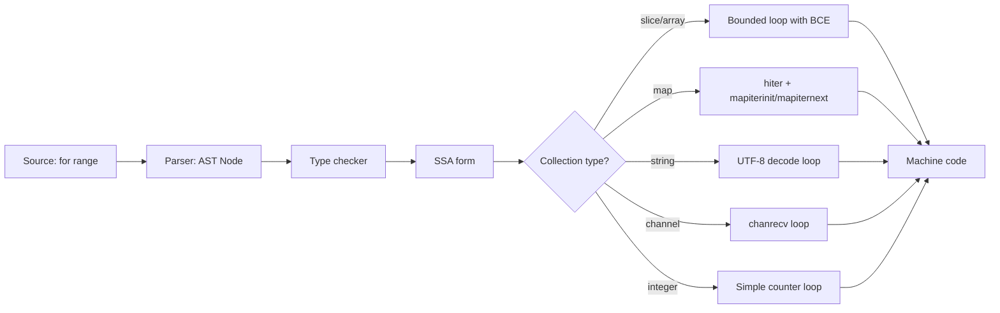

# for range — Senior Level

## 1. Compiler Desugaring of for range

The Go compiler transforms `for range` into a lower-level construct. Here is what actually happens:

```go
// Source
for i, v := range s {
    use(i, v)
}

// Compiler desugars to approximately:
{
    _s := s          // range expression evaluated once
    _len := len(_s)
    for _i := 0; _i < _len; _i++ {
        i := _i
        v := _s[_i]  // copy made here
        use(i, v)
    }
}
```

For maps, the runtime uses a `hiter` struct to maintain iteration state. For strings, the compiler inserts UTF-8 decoding. For channels, it calls `chanrecv` in a loop.

---

## 2. Runtime Representation of Range State

### Slice Range
The compiler emits a bounds-checked loop. The length is captured once into a register. Modern CPUs' branch predictors handle this efficiently.

### Map Range — hiter
```go
// runtime/map.go (simplified)
type hiter struct {
    key         unsafe.Pointer
    elem        unsafe.Pointer
    t           *maptype
    h           *hmap
    buckets     unsafe.Pointer
    bptr        *bmap
    overflow    *[]*bmap
    // ... more fields
}
// mapiterinit() initializes, mapiternext() advances
```

The randomization comes from `hiter.startBucket` being seeded with `fastrand()` at start of iteration.

### Channel Range
```go
// Desugars to:
for {
    v, ok := <-ch
    if !ok { break }
    use(v)
}
```

---

## 3. Memory Layout and Cache Effects

```go
// Struct of Arrays vs Array of Structs
type Point struct { X, Y float64 }

// Array of Structs (AoS) — common but less cache-friendly for partial access
points := []Point{{1, 2}, {3, 4}, {5, 6}}
sumX := 0.0
for _, p := range points { sumX += p.X } // loads 16 bytes to use 8

// Struct of Arrays (SoA) — better cache for X-only access
xs := []float64{1, 3, 5}
ys := []float64{2, 4, 6}
sumX = 0
for _, x := range xs { sumX += x } // loads 8 bytes, uses 8 — 100% efficient
```

For hot loops processing large data sets, SoA layout improves CPU cache utilization significantly.

---

## 4. Escape Analysis and for range

```go
package main

import "fmt"

func sumSlice(s []int) int {
    sum := 0
    for _, v := range s {
        sum += v
    }
    return sum
}
```

The `v` variable in range does not escape to heap in this case — the compiler proves it's short-lived. However:

```go
func collectPtrs(s []int) []*int {
    var ptrs []*int
    for i := range s {
        v := s[i]
        ptrs = append(ptrs, &v) // v escapes to heap here
    }
    return ptrs
}
```

Use `go build -gcflags="-m"` to see escape analysis output.

---

## 5. Bounds Check Elimination (BCE)

The Go compiler eliminates bounds checks in range loops automatically:

```go
// The compiler KNOWS i is in [0, len(s)) during range
// So s[i] has no bounds check — it's elided
for i := range s {
    s[i]++  // No bounds check at runtime!
}

// But this requires bounds check:
for i := range s {
    s[i+1]++ // i+1 might be out of bounds — check kept
}
```

This is a key reason why range-based loops can be faster than manually indexed loops with non-standard access patterns.

---

## 6. SIMD and Auto-Vectorization

For numeric slices, the Go compiler (and the underlying LLVM/gc backend) can auto-vectorize range loops:

```go
func addSlices(a, b, c []float64) {
    for i := range a {
        c[i] = a[i] + b[i]
    }
}
```

The compiler may emit SSE/AVX instructions to process multiple elements in parallel. Verify with:

```bash
go build -gcflags="-S" main.go 2>&1 | grep -i "XMM\|YMM\|VMOV"
```

---

## 7. Postmortem 1: The Goroutine Closure Bug

**Production incident (pre-Go 1.22):**

```go
// A service spawned goroutines to process tasks
for _, task := range tasks {
    go func() {
        process(task) // ALL goroutines processed the LAST task
    }()
}
```

**Root cause:** The `task` variable was shared across all iterations. By the time goroutines ran, the loop had finished and `task` held the last value.

**Impact:** In one case, this caused all database records to be updated with data from the last item, overwriting earlier updates. The bug was silent — no errors, wrong data.

**Fix:**
```go
for _, task := range tasks {
    task := task // per-iteration copy
    go func() {
        process(task)
    }()
}
// Or in Go 1.22+: just use the code as-is (fixed by language)
```

**Detection:** `-race` flag would not catch this — it's not a data race, it's a logic error.

---

## 8. Postmortem 2: Map Concurrent Read/Write Panic

**Production incident:**

```go
var cache = map[string][]byte{}

// Goroutine 1
for k, v := range cache {
    processValue(k, v)
}

// Goroutine 2 (concurrent)
cache["newKey"] = compute()
```

**Result:** `concurrent map iteration and map write` — fatal panic, server crash.

**Root cause:** Go's map is not safe for concurrent use. A write during range causes the runtime to panic (intentionally).

**Fix:**
```go
var mu sync.RWMutex
var cache = map[string][]byte{}

// Goroutine 1
mu.RLock()
for k, v := range cache {
    processValue(k, v)
}
mu.RUnlock()

// Goroutine 2
mu.Lock()
cache["newKey"] = compute()
mu.Unlock()
```

Or use `sync.Map` for high-contention scenarios.

---

## 9. Postmortem 3: String Slicing Mid-Rune

**Bug report:** JSON response truncated for users with non-ASCII names.

```go
func truncate(s string, n int) string {
    if len(s) <= n {
        return s
    }
    return s[:n] // WRONG for multi-byte strings!
}
// truncate("Héllo", 2) returns "H\xc3" — invalid UTF-8!
```

**Fix:**
```go
func truncate(s string, n int) string {
    runes := []rune(s)
    if len(runes) <= n {
        return s
    }
    return string(runes[:n])
}
// Or use utf8.RuneCountInString and decode properly
```

---

## 10. Performance Optimization: Pre-allocate During Range

```go
// SLOW: append grows backing array multiple times
func collectEvens(s []int) []int {
    var result []int
    for _, v := range s {
        if v%2 == 0 {
            result = append(result, v) // many reallocations
        }
    }
    return result
}

// FAST: pre-allocate capacity
func collectEvens(s []int) []int {
    result := make([]int, 0, len(s)/2+1) // estimated capacity
    for _, v := range s {
        if v%2 == 0 {
            result = append(result, v) // fewer or no reallocations
        }
    }
    return result[:len(result):len(result)] // trim excess capacity
}
```

---

## 11. Performance Optimization: Avoiding Interface Overhead in Range

```go
type Processor interface {
    Process(int) int
}

// Slow: virtual dispatch on every iteration
func processAll(items []int, p Processor) []int {
    result := make([]int, len(items))
    for i, v := range items {
        result[i] = p.Process(v) // interface dispatch each call
    }
    return result
}

// Fast: use concrete type or function
func processAll(items []int, fn func(int) int) []int {
    result := make([]int, len(items))
    for i, v := range items {
        result[i] = fn(v) // direct call
    }
    return result
}
```

---

## 12. Iterating Backward

Go has no built-in reverse iteration for slices in pre-1.23:

```go
// Manual reverse
s := []int{1, 2, 3, 4, 5}
for i := len(s) - 1; i >= 0; i-- {
    fmt.Println(s[i])
}

// Go 1.23+: slices.Backward
import "slices"
for i, v := range slices.Backward(s) {
    fmt.Println(i, v)
}
```

---

## 13. Parallel Range Processing Pattern

```go
package main

import (
    "fmt"
    "runtime"
    "sync"
)

func parallelRange(s []int, fn func(int, int)) {
    n := runtime.GOMAXPROCS(0)
    size := (len(s) + n - 1) / n
    var wg sync.WaitGroup
    for i := 0; i < n; i++ {
        start := i * size
        end := start + size
        if end > len(s) {
            end = len(s)
        }
        if start >= len(s) {
            break
        }
        wg.Add(1)
        go func(chunk []int, offset int) {
            defer wg.Done()
            for j, v := range chunk {
                fn(offset+j, v)
            }
        }(s[start:end], start)
    }
    wg.Wait()
}

func main() {
    var mu sync.Mutex
    total := 0
    data := make([]int, 1000)
    for i := range data { data[i] = i + 1 }
    parallelRange(data, func(i, v int) {
        mu.Lock()
        total += v
        mu.Unlock()
    })
    fmt.Println("Total:", total)
}
```

---

## 14. Function Iterators (Go 1.23+)

```go
package main

import (
    "fmt"
    "iter"
)

// Custom iterator using iter.Seq
func Evens(s []int) iter.Seq2[int, int] {
    return func(yield func(int, int) bool) {
        for i, v := range s {
            if v%2 == 0 {
                if !yield(i, v) {
                    return
                }
            }
        }
    }
}

func main() {
    nums := []int{1, 2, 3, 4, 5, 6}
    for i, v := range Evens(nums) {
        fmt.Println(i, v)
    }
}
```

This enables lazy, composable iteration without allocating intermediate slices.

---

## 15. Unsafe Iteration for Maximum Performance

In rare performance-critical cases:

```go
package main

import (
    "fmt"
    "unsafe"
)

// Direct memory iteration — bypasses bounds checks
// USE ONLY WHEN PROFILING PROVES NECESSARY
func sumUnsafe(s []int) int {
    if len(s) == 0 { return 0 }
    sum := 0
    ptr := unsafe.Pointer(&s[0])
    size := unsafe.Sizeof(s[0])
    for i := 0; i < len(s); i++ {
        sum += *(*int)(ptr)
        ptr = unsafe.Add(ptr, size)
    }
    return sum
}

func main() {
    s := []int{1, 2, 3, 4, 5}
    fmt.Println(sumUnsafe(s)) // 15
}
```

**Warning:** This is dangerous, non-portable, and usually not needed. The compiler already optimizes range loops well.

---

## 16. Detecting Allocation in Range Loops

```go
// Check if value copy allocates
type BigStruct struct {
    Data [1024]byte
}

var bigSlice = make([]BigStruct, 100)

func BenchmarkRangeCopy(b *testing.B) {
    b.ReportAllocs()
    for n := 0; n < b.N; n++ {
        for _, v := range bigSlice {
            _ = v.Data[0] // copy of 1024 bytes!
        }
    }
}

func BenchmarkRangeIndex(b *testing.B) {
    b.ReportAllocs()
    for n := 0; n < b.N; n++ {
        for i := range bigSlice {
            _ = bigSlice[i].Data[0] // no copy
        }
    }
}
```

For large structs, using index access avoids copying.

---

## 17. Range and the Scheduler

Long-running range loops without yielding can starve the Go scheduler:

```go
// In pre-Go 1.14, this could block other goroutines:
func heavyLoop(s []int) {
    for _, v := range s {
        // CPU-intensive work, no function calls, no preemption point
        doHeavyMath(v)
    }
}
```

Go 1.14 introduced asynchronous preemption, so goroutines can be preempted at any point (including range loops) via signals. Before 1.14, only function call boundaries were preemption points.

---

## 18. String Range and UTF-8 Validation

```go
package main

import (
    "fmt"
    "unicode/utf8"
)

func main() {
    // Invalid UTF-8 in a string
    bad := "Hello\xff\xfeWorld"

    for i, r := range bad {
        if r == utf8.RuneError {
            fmt.Printf("Invalid UTF-8 at byte %d\n", i)
        }
    }

    // Proper validation
    if !utf8.ValidString(bad) {
        fmt.Println("String contains invalid UTF-8")
    }
}
```

Range over invalid UTF-8 yields `utf8.RuneError` (U+FFFD) for invalid sequences — it does not panic.

---

## 19. For Range and Profiling

```go
package main

import (
    "os"
    "runtime/pprof"
    "testing"
)

func BenchmarkRangeProfile(b *testing.B) {
    f, _ := os.Create("cpu.prof")
    pprof.StartCPUProfile(f)
    defer pprof.StopCPUProfile()

    data := make([]int, 10_000_000)
    b.ResetTimer()
    for n := 0; n < b.N; n++ {
        sum := 0
        for _, v := range data {
            sum += v
        }
        _ = sum
    }
}
```

```bash
go test -bench=BenchmarkRangeProfile -cpuprofile=cpu.prof
go tool pprof cpu.prof
```

---

## 20. Mermaid: Range Compilation Pipeline



---

## 21. Range Over Function (iter.Seq) Pattern

```go
package main

import "fmt"

// Pre-1.23 manual iterator pattern
type Iterator[T any] func() (T, bool)

func SliceIter[T any](s []T) Iterator[T] {
    i := 0
    return func() (T, bool) {
        if i >= len(s) {
            var zero T
            return zero, false
        }
        v := s[i]
        i++
        return v, true
    }
}

func main() {
    it := SliceIter([]int{10, 20, 30})
    for v, ok := it(); ok; v, ok = it() {
        fmt.Println(v)
    }
}
```

---

## 22. Large Slice Optimizations

```go
// Optimization 1: Chunk processing to reduce GC pressure
func processLarge(data [][]byte) {
    const chunkSize = 1000
    for i := 0; i < len(data); i += chunkSize {
        end := i + chunkSize
        if end > len(data) { end = len(data) }
        for _, item := range data[i:end] {
            process(item)
        }
        // Optional: runtime.GC() between chunks if needed
    }
}

// Optimization 2: Avoid repeated length calls
// (compiler usually does this, but explicit can help readability)
n := len(data)
for i := 0; i < n; i++ {
    process(data[i])
}
```

---

## 23. Range with sync.Map

```go
package main

import (
    "fmt"
    "sync"
)

func main() {
    var m sync.Map
    m.Store("a", 1)
    m.Store("b", 2)
    m.Store("c", 3)

    // sync.Map uses Range method, not for range
    m.Range(func(k, v interface{}) bool {
        fmt.Printf("%v: %v\n", k, v)
        return true // return false to stop
    })
}
```

---

## 24. Advanced: Range and Compiler Hints

```go
// go:noescape hints to prevent heap escape
//go:nosplit  // prevent stack growth check (rare)

// Compiler directives affecting range performance
//go:build !race  // build tag: exclude race-detector build

// In benchmarks: use b.RunParallel for concurrent range testing
func BenchmarkParallelRange(b *testing.B) {
    s := make([]int, 1000)
    b.RunParallel(func(pb *testing.PB) {
        for pb.Next() {
            sum := 0
            for _, v := range s {
                sum += v
            }
            _ = sum
        }
    })
}
```

---

## 25. Tracing Range-Heavy Code

```go
import "runtime/trace"

func tracedRange(s []int) {
    trace.WithRegion(context.Background(), "rangeLoop", func() {
        for _, v := range s {
            process(v)
        }
    })
}
```

```bash
go test -trace=trace.out ./...
go tool trace trace.out
```

---

## 26. Summary: Senior Insights

| Topic | Senior Consideration |
|---|---|
| Compiler desugaring | Range expression captured once; know what the generated code looks like |
| BCE | Range loops get bounds checks eliminated; non-range access patterns may not |
| Escape analysis | Large struct copies in range may escape; use index access |
| Scheduler | Go 1.14+ has async preemption; long compute loops no longer starve goroutines |
| UTF-8 | Invalid bytes yield RuneError, not panic |
| Postmortems | Closure capture bug, concurrent map panic, mid-rune slicing all real production issues |
| Profiling | Use pprof + trace to identify range-loop hotspots |
| Go 1.23 iterators | Enable lazy, composable, allocation-free iteration |

---

## 27. Checklist for Code Review of for range Usage

- [ ] Is the value being modified (thinking it modifies the original)?
- [ ] Are goroutines capturing loop variables by reference?
- [ ] Is map iteration order assumed to be stable?
- [ ] Is defer used inside a range loop (should be wrapped in function)?
- [ ] Are large structs being unnecessarily copied on each iteration?
- [ ] Is the range expression a function call (called once — is that intended)?
- [ ] For concurrent code: is the underlying collection protected by a mutex?
- [ ] For string range: is byte index confused with character index?
