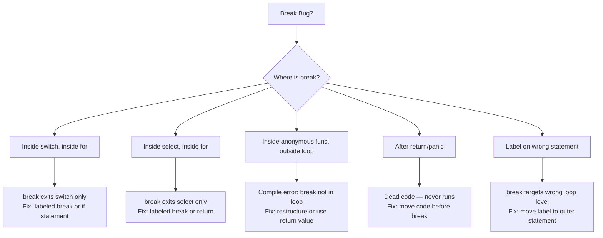

# Break Statement in Go — Find the Bug

## Overview

10+ debugging exercises to find and fix bugs related to Go's `break` statement. Bugs are marked by difficulty: 🟢 Easy, 🟡 Medium, 🔴 Hard. Each bug includes a `<details>` hint and full solution.

---

## Bug 1 — The Classic: Break in Switch Doesn't Exit For Loop

**Difficulty:** 🟢 Easy

**Description:** The developer wants to stop processing when `i == 3`. But something is wrong.

```go
package main

import "fmt"

func main() {
    for i := 0; i < 5; i++ {
        switch i {
        case 3:
            fmt.Println("Found 3, stopping")
            break // supposed to stop the loop
        }
        fmt.Println("Processing:", i)
    }
    fmt.Println("Done")
}
```

**Expected output:**
```
Processing: 0
Processing: 1
Processing: 2
Found 3, stopping
Done
```

**Actual output:**
```
Processing: 0
Processing: 1
Processing: 2
Found 3, stopping
Processing: 3
Processing: 4
Done
```

<details>
<summary>Hint</summary>
`break` inside a `switch` statement only exits the `switch`, not the surrounding `for` loop. To exit the `for` loop from inside a `switch`, you need to use a labeled `break` targeting the `for` loop.
</details>

<details>
<summary>Solution</summary>

```go
package main

import "fmt"

func main() {
outer:
    for i := 0; i < 5; i++ {
        switch i {
        case 3:
            fmt.Println("Found 3, stopping")
            break outer // exits the for loop
        }
        fmt.Println("Processing:", i)
    }
    fmt.Println("Done")
}
```

**Why:** `break` in Go exits the **innermost** `for`, `switch`, or `select`. Since the break is inside the `switch`, it exits the `switch`. The `for` loop continues normally. The label `outer:` on the `for` allows `break outer` to exit the for loop directly.

**Alternative fix:** Use an `if` instead of `switch`:
```go
for i := 0; i < 5; i++ {
    if i == 3 {
        fmt.Println("Found 3, stopping")
        break // now exits the for loop directly
    }
    fmt.Println("Processing:", i)
}
```
</details>

---

## Bug 2 — Goroutine Leak: Break in Select

**Difficulty:** 🟡 Medium

**Description:** This service consumer is supposed to shut down cleanly when `done` is closed. But it doesn't.

```go
package main

import (
    "fmt"
    "time"
)

func startConsumer(messages <-chan string, done <-chan struct{}) {
    go func() {
        for {
            select {
            case msg := <-messages:
                fmt.Println("Received:", msg)
            case <-done:
                fmt.Println("Consumer shutting down")
                break // BUG: goroutine should exit here
            }
        }
    }()
}

func main() {
    messages := make(chan string, 3)
    done := make(chan struct{})

    messages <- "hello"
    messages <- "world"

    startConsumer(messages, done)
    time.Sleep(50 * time.Millisecond)
    close(done)
    time.Sleep(100 * time.Millisecond)
    fmt.Println("Main exiting, goroutine count:", countGoroutines())
}

func countGoroutines() int {
    // imagine this returns runtime.NumGoroutine()
    return 0
}
```

**Bug:** The goroutine never actually exits. It prints "Consumer shutting down" but keeps looping forever, causing a goroutine leak.

<details>
<summary>Hint</summary>
`break` inside a `select` only exits the `select` statement. The `for` loop surrounding the `select` keeps running. After the `done` channel is closed, the goroutine will keep hitting the `case <-done:` case on every iteration (closed channels are always readable), printing the message infinitely.
</details>

<details>
<summary>Solution</summary>

**Fix 1: Use `return` (simplest)**
```go
func startConsumer(messages <-chan string, done <-chan struct{}) {
    go func() {
        for {
            select {
            case msg := <-messages:
                fmt.Println("Received:", msg)
            case <-done:
                fmt.Println("Consumer shutting down")
                return // goroutine function exits
            }
        }
    }()
}
```

**Fix 2: Use labeled break**
```go
func startConsumer(messages <-chan string, done <-chan struct{}) {
    go func() {
    loop:
        for {
            select {
            case msg := <-messages:
                fmt.Println("Received:", msg)
            case <-done:
                fmt.Println("Consumer shutting down")
                break loop // exits the for loop
            }
        }
        // post-loop cleanup code can go here if needed
    }()
}
```

**Note:** Also, once `messages` channel is drained and no new messages come, the goroutine would block on the select. The `done` channel handles clean shutdown.
</details>

---

## Bug 3 — Inner Break Doesn't Exit Outer Loop

**Difficulty:** 🟢 Easy

**Description:** This code should find the first cell in a matrix equal to -1 and stop searching immediately. But it keeps scanning.

```go
package main

import "fmt"

func main() {
    matrix := [][]int{
        {1, 2, 3},
        {4, -1, 6},
        {7, 8, 9},
    }

    found := false
    foundRow, foundCol := -1, -1

    for i, row := range matrix {
        for j, val := range row {
            if val == -1 {
                found = true
                foundRow, foundCol = i, j
                break // BUG: only exits inner loop!
            }
        }
    }

    if found {
        fmt.Printf("Found -1 at (%d, %d)\n", foundRow, foundCol)
    }
}
```

**Symptom:** Code works but continues scanning rows after finding -1. Not a correctness bug in output, but a performance/logic bug. Prove it by adding print statements.

<details>
<summary>Hint</summary>
`break` exits the innermost loop — the inner `for j` loop. But the outer `for i` loop continues to the next row. You need to either use a labeled break or restructure with a function return.
</details>

<details>
<summary>Solution</summary>

**Fix 1: Labeled break**
```go
package main

import "fmt"

func main() {
    matrix := [][]int{
        {1, 2, 3},
        {4, -1, 6},
        {7, 8, 9},
    }

    foundRow, foundCol := -1, -1

search:
    for i, row := range matrix {
        for j, val := range row {
            if val == -1 {
                foundRow, foundCol = i, j
                break search // exits BOTH loops
            }
        }
    }

    if foundRow >= 0 {
        fmt.Printf("Found -1 at (%d, %d)\n", foundRow, foundCol)
    }
}
```

**Fix 2: Extract to function (cleaner)**
```go
func findNegOne(matrix [][]int) (int, int, bool) {
    for i, row := range matrix {
        for j, val := range row {
            if val == -1 {
                return i, j, true // exits the function = exits all loops
            }
        }
    }
    return -1, -1, false
}
```
</details>

---

## Bug 4 — Dead Code After Break (Unreachable Cleanup)

**Difficulty:** 🟢 Easy

**Description:** The developer wants to log a warning AND break. But the log never prints.

```go
package main

import "fmt"

func processItems(items []string) {
    for i, item := range items {
        if item == "" {
            break
            fmt.Printf("Warning: empty item at index %d\n", i) // BUG: dead code
        }
        fmt.Println("Processing:", item)
    }
}

func main() {
    items := []string{"a", "b", "", "d"}
    processItems(items)
}
```

**Expected output:**
```
Processing: a
Processing: b
Warning: empty item at index 2
```

**Actual output:**
```
Processing: a
Processing: b
```

<details>
<summary>Hint</summary>
The `fmt.Printf` line is AFTER `break`. Once `break` executes, control jumps out of the loop immediately. Any code after `break` in the same block is unreachable (dead code).
</details>

<details>
<summary>Solution</summary>

```go
package main

import "fmt"

func processItems(items []string) {
    for i, item := range items {
        if item == "" {
            fmt.Printf("Warning: empty item at index %d\n", i) // moved BEFORE break
            break
        }
        fmt.Println("Processing:", item)
    }
}

func main() {
    items := []string{"a", "b", "", "d"}
    processItems(items)
}
```

**Rule:** Code after `break`, `return`, `panic`, or `goto` in the same block is unreachable. Always place any logic you want to run BEFORE the `break`.
</details>

---

## Bug 5 — Break Outside Loop (Compile Error Misunderstanding)

**Difficulty:** 🟢 Easy

**Description:** This code doesn't compile. Why?

```go
package main

import "fmt"

func process(items []string) {
    handler := func(item string) {
        if item == "stop" {
            break // BUG: compile error
        }
        fmt.Println(item)
    }

    for _, item := range items {
        handler(item)
    }
}

func main() {
    process([]string{"a", "stop", "b"})
}
```

**Error:** `break is not in a loop, switch, or select`

<details>
<summary>Hint</summary>
`break` only works inside a `for`, `switch`, or `select` **within the same function**. The anonymous function `handler` is its own function scope. The `for` loop is in the outer `process` function, not inside `handler`. You cannot `break` across function boundaries.
</details>

<details>
<summary>Solution</summary>

**Fix 1: Move the loop inside the anonymous function**
```go
package main

import "fmt"

func process(items []string) {
    func() {
        for _, item := range items {
            if item == "stop" {
                break // now in the same function as the for loop
            }
            fmt.Println(item)
        }
    }()
}
```

**Fix 2: Use a return value signal (closure approach)**
```go
package main

import "fmt"

func process(items []string) {
    for _, item := range items {
        if shouldStop := handle(item); shouldStop {
            break
        }
    }
}

func handle(item string) bool {
    if item == "stop" {
        return true // signal to break
    }
    fmt.Println(item)
    return false
}
```

**Fix 3: Use a channel or closure variable**
```go
package main

import "fmt"

func process(items []string) {
    stop := false
    handler := func(item string) {
        if item == "stop" {
            stop = true // set flag in closure
            return
        }
        fmt.Println(item)
    }

    for _, item := range items {
        handler(item)
        if stop { break }
    }
}
```
</details>

---

## Bug 6 — Missing Break Allows Infinite Channel Receive After Close

**Difficulty:** 🟡 Medium

**Description:** After the channel is closed, the loop should exit. But it seems to run forever printing zero values.

```go
package main

import "fmt"

func main() {
    ch := make(chan int, 3)
    ch <- 1
    ch <- 2
    ch <- 3
    close(ch)

    for {
        v := <-ch
        if v == 0 {
            // BUG: should break here but doesn't
            fmt.Println("Channel exhausted")
        }
        fmt.Println("Got:", v)
    }
}
```

**Actual behavior:** After printing 1, 2, 3, it prints "Channel exhausted" and "Got: 0" infinitely.

<details>
<summary>Hint</summary>
Receiving from a closed, empty channel returns the zero value immediately without blocking. `v == 0` IS reached, but the code just prints "Channel exhausted" and continues the loop. The `break` is missing! Also, checking for zero value is unreliable — what if valid values can be 0? Use the two-value receive form `v, ok := <-ch`.
</details>

<details>
<summary>Solution</summary>

**Fix 1: Use two-value receive with break**
```go
package main

import "fmt"

func main() {
    ch := make(chan int, 3)
    ch <- 1
    ch <- 2
    ch <- 3
    close(ch)

    for {
        v, ok := <-ch
        if !ok {
            fmt.Println("Channel exhausted")
            break // channel closed and empty
        }
        fmt.Println("Got:", v)
    }
}
```

**Fix 2: Use `for range` (idiomatic)**
```go
package main

import "fmt"

func main() {
    ch := make(chan int, 3)
    ch <- 1
    ch <- 2
    ch <- 3
    close(ch)

    for v := range ch { // automatically stops when channel is closed
        fmt.Println("Got:", v)
    }
    fmt.Println("Channel exhausted")
}
```

**Output:**
```
Got: 1
Got: 2
Got: 3
Channel exhausted
```
</details>

---

## Bug 7 — Break in Nested Switch (Wrong Level)

**Difficulty:** 🟡 Medium

**Description:** The developer has two nested switches and wants the inner break to exit the outer switch. But it doesn't work as expected.

```go
package main

import "fmt"

func process(category, action string) {
    switch category {
    case "user":
        switch action {
        case "delete":
            fmt.Println("Deleting user")
            break // developer expects this to exit outer switch too
        case "create":
            fmt.Println("Creating user")
        }
        // this should NOT run if action == "delete"
        fmt.Println("User operation logged") // BUG: runs even for delete
    case "admin":
        fmt.Println("Admin action")
    }
}

func main() {
    process("user", "delete")
    fmt.Println("---")
    process("user", "create")
}
```

**Expected output:**
```
Deleting user
---
Creating user
User operation logged
```

**Actual output:**
```
Deleting user
User operation logged
---
Creating user
User operation logged
```

<details>
<summary>Hint</summary>
`break` in the inner switch exits the inner switch only. The outer switch case body continues executing. To exit the outer switch, use a labeled break targeting the outer switch.
</details>

<details>
<summary>Solution</summary>

```go
package main

import "fmt"

func process(category, action string) {
outerSwitch:
    switch category {
    case "user":
        switch action {
        case "delete":
            fmt.Println("Deleting user")
            break outerSwitch // exits the outer switch
        case "create":
            fmt.Println("Creating user")
        }
        fmt.Println("User operation logged") // only runs for non-delete actions
    case "admin":
        fmt.Println("Admin action")
    }
}
```

**Alternative: restructure with return**
```go
func process(category, action string) {
    if category == "user" {
        if action == "delete" {
            fmt.Println("Deleting user")
            return // cleanest approach
        }
        fmt.Println("Creating user")
        fmt.Println("User operation logged")
    } else if category == "admin" {
        fmt.Println("Admin action")
    }
}
```
</details>

---

## Bug 8 — Break Doesn't Fire Due to Incorrect Condition

**Difficulty:** 🟡 Medium

**Description:** The loop should stop when it finds a negative number. But it runs through everything.

```go
package main

import "fmt"

func processUntilNegative(data []int) {
    for i := 0; i < len(data); i++ {
        fmt.Println("Processing:", data[i])
        if i > 0 && data[i] < 0 {
            fmt.Println("Found negative, stopping")
            break
        }
    }
}

func main() {
    data := []int{-5, 1, 2, 3}
    processUntilNegative(data)
}
```

**Expected output:**
```
Found negative, stopping
```

**Actual output:**
```
Processing: -5
Processing: 1
Processing: 2
Processing: 3
```

<details>
<summary>Hint</summary>
The condition `i > 0 && data[i] < 0` skips index 0 entirely (`i > 0` is false when i=0). So when `data[0] == -5` (the negative number), the break condition is false because `i == 0`. The loop continues and no other negative number exists.
</details>

<details>
<summary>Solution</summary>

```go
package main

import "fmt"

func processUntilNegative(data []int) {
    for i := 0; i < len(data); i++ {
        if data[i] < 0 { // removed the i > 0 guard
            fmt.Println("Found negative, stopping")
            break
        }
        fmt.Println("Processing:", data[i]) // only process non-negative
    }
}

func main() {
    data := []int{-5, 1, 2, 3}
    processUntilNegative(data)
}
```

**Output:**
```
Found negative, stopping
```

**Lesson:** Check break conditions carefully. The `i > 0` guard was accidentally preventing the break from firing at index 0. Also note: the `fmt.Println("Processing:", ...)` was moved AFTER the check — we don't want to process negative numbers.
</details>

---

## Bug 9 — Break Label on Wrong Statement

**Difficulty:** 🔴 Hard

**Description:** This code is supposed to exit the outer loop when a sum exceeds 10. But the label is misapplied.

```go
package main

import "fmt"

func main() {
    data := [][]int{
        {1, 2, 3},
        {4, 5, 6},
        {7, 8, 9},
    }

    sum := 0
    for _, row := range data {
    inner:  // BUG: label on inner loop, not outer
        for _, v := range row {
            sum += v
            if sum > 10 {
                break inner // developer thinks this exits outer loop
                            // but inner: labels the inner for loop!
            }
        }
        fmt.Println("Sum after row:", sum)
    }
    fmt.Println("Final sum:", sum)
}
```

**Expected output:**
```
Sum after row: 6
Final sum: 15  (stopped at 4+5+6=15, after sum > 10)
```

Wait, the REAL expected behavior: stop ALL processing (both loops) when sum > 10.

**Expected output:**
```
Final sum: 15  (1+2+3+4+5=15 > 10, stopped mid-second-row)
```

**Actual output:** Continues processing all rows because `break inner` only exits the inner loop.

<details>
<summary>Hint</summary>
The label `inner:` is placed on the inner `for _, v := range row` loop. So `break inner` exits the inner loop — same as a plain `break`. To exit the outer loop, the label must be placed on the outer `for _, row := range data` loop.
</details>

<details>
<summary>Solution</summary>

```go
package main

import "fmt"

func main() {
    data := [][]int{
        {1, 2, 3},
        {4, 5, 6},
        {7, 8, 9},
    }

    sum := 0
outer: // label on OUTER loop
    for _, row := range data {
        for _, v := range row {
            sum += v
            if sum > 10 {
                break outer // exits the outer for loop
            }
        }
        fmt.Println("Sum after row:", sum)
    }
    fmt.Println("Final sum:", sum)
}
```

**Output:**
```
Sum after row: 6
Final sum: 15
```

(Row 1 completes with sum=6, then row 2: 4 → 10, 5 → 15 > 10, `break outer` fires)

**Rule:** Place the label on the statement you want to EXIT when break fires, not on the inner statement.
</details>

---

## Bug 10 — Break in Goroutine Causes Missed Cleanup

**Difficulty:** 🔴 Hard

**Description:** This worker processes jobs and is supposed to notify the WaitGroup when done. But sometimes `wg.Done()` is never called.

```go
package main

import (
    "fmt"
    "sync"
)

func worker(jobs <-chan int, done <-chan struct{}, wg *sync.WaitGroup) {
    for {
        select {
        case j, ok := <-jobs:
            if !ok {
                return // channel closed
            }
            fmt.Println("Job:", j)
        case <-done:
            fmt.Println("Worker stopping")
            return // BUG: wg.Done() never called!
        }
    }
    wg.Done() // BUG: unreachable code — return above exits before this
}

func main() {
    jobs := make(chan int, 5)
    done := make(chan struct{})
    var wg sync.WaitGroup

    wg.Add(1)
    go worker(jobs, done, &wg)

    jobs <- 1
    jobs <- 2
    close(done)
    wg.Wait() // DEADLOCK: blocks forever because wg.Done() never called
    fmt.Println("All workers done")
}
```

<details>
<summary>Hint</summary>
`wg.Done()` is placed after the `for` loop, but the loop only exits via `return` statements (which exit the function, not just the loop). The code after the `for` is unreachable. Use `defer wg.Done()` at the start of the function.
</details>

<details>
<summary>Solution</summary>

```go
package main

import (
    "fmt"
    "sync"
)

func worker(jobs <-chan int, done <-chan struct{}, wg *sync.WaitGroup) {
    defer wg.Done() // FIXED: always called when function exits, regardless of exit path

    for {
        select {
        case j, ok := <-jobs:
            if !ok {
                return
            }
            fmt.Println("Job:", j)
        case <-done:
            fmt.Println("Worker stopping")
            return
        }
    }
}

func main() {
    jobs := make(chan int, 5)
    done := make(chan struct{})
    var wg sync.WaitGroup

    wg.Add(1)
    go worker(jobs, done, &wg)

    jobs <- 1
    jobs <- 2
    close(done)
    wg.Wait()
    fmt.Println("All workers done")
}
```

**Key insight:** `defer wg.Done()` fires on ANY exit from the function — `return`, `break` (if at function level), or `panic`. Always use `defer` for cleanup that must run regardless of exit path. Placing cleanup code after a loop that exits via `return` means that code is unreachable.
</details>

---

## Bug 11 — Infinite Loop Due to Missing Break in Select

**Difficulty:** 🔴 Hard

**Description:** This event processor should drain remaining events then exit. But it spins infinitely after the event channel is empty.

```go
package main

import (
    "fmt"
    "time"
)

func drainAndExit(events <-chan string, timeout <-chan time.Time) {
    for {
        select {
        case e := <-events:
            fmt.Println("Event:", e)
        case <-timeout:
            fmt.Println("Timeout, flushing remaining...")
            // BUG: wants to drain remaining buffered events then exit
            for e := range events { // BUG: blocks forever if more events are never sent
                fmt.Println("Flushing:", e)
            }
            return
        }
    }
}

func main() {
    events := make(chan string, 5)
    for i := 1; i <= 5; i++ {
        events <- fmt.Sprintf("event-%d", i)
    }
    // NOT closing events — simulating a live channel that just happens to be empty

    timer := time.After(100 * time.Millisecond)
    drainAndExit(events, timer)
}
```

<details>
<summary>Hint</summary>
`for e := range events` blocks waiting for new events or for the channel to be closed. Since `events` is never closed, this drains the buffered events but then blocks forever. Use a non-blocking select (with `default`) to drain remaining buffered events without blocking.
</details>

<details>
<summary>Solution</summary>

```go
package main

import (
    "fmt"
    "time"
)

func drainAndExit(events <-chan string, timeout <-chan time.Time) {
    for {
        select {
        case e := <-events:
            fmt.Println("Event:", e)
        case <-timeout:
            fmt.Println("Timeout, flushing remaining...")
            // Non-blocking drain: read all buffered events without blocking
            for {
                select {
                case e := <-events:
                    fmt.Println("Flushing:", e)
                default:
                    fmt.Println("Flush complete")
                    return // no more buffered events
                }
            }
        }
    }
}
```

**Output:**
```
Event: event-1
Event: event-2
... (or none, depending on timing)
Timeout, flushing remaining...
Flushing: event-3
Flushing: event-4
Flushing: event-5
Flush complete
```

**Key pattern:** Use `select { case v := <-ch: ...; default: break }` for non-blocking channel drain.
</details>

---

## Bug 12 — Break in Fallthrough Chain

**Difficulty:** 🟡 Medium

**Description:** The developer is confused about `fallthrough` and `break`. They expect the following to print only "B" for input 2.

```go
package main

import "fmt"

func printGrade(score int) {
    switch {
    case score >= 90:
        fmt.Println("A")
        fallthrough
    case score >= 80:
        fmt.Println("B")
        break // developer thinks this stops the fallthrough chain
        fallthrough
    case score >= 70:
        fmt.Println("C")
    }
}

func main() {
    printGrade(95) // expects: A, B
    fmt.Println("---")
    printGrade(85) // expects: B only
}
```

<details>
<summary>Hint</summary>
`fallthrough` in Go moves execution to the next case body. `break` AFTER `fallthrough` is dead code — once `fallthrough` executes, you're in the next case. But importantly: `break` BEFORE the second `fallthrough` exits the switch immediately — the second `fallthrough` is unreachable.
</details>

<details>
<summary>Solution</summary>

The code actually compiles and runs, but the dead code (second `fallthrough`) gives a compile warning/error with some linters.

**Actual output:**
```
A
B
---
B
```

For `score=95`: case `score>=90` matches → prints "A" → falls through to `score>=80` case → prints "B" → `break` exits the switch (second `fallthrough` is dead code).

For `score=85`: case `score>=90` is false, case `score>=80` matches → prints "B" → `break` exits.

**This code actually works for the desired behavior**, but the second `fallthrough` is dead code and confusing. Clean version:

```go
func printGrade(score int) {
    switch {
    case score >= 90:
        fmt.Println("A")
        fallthrough
    case score >= 80:
        fmt.Println("B")
        // no break needed — Go switch doesn't fall through by default
        // break here would be equivalent (exits switch same as natural end of case)
    case score >= 70:
        fmt.Println("C")
    }
}
```

**Key insight:** `break` at end of a switch case is redundant unless you need to exit EARLY from within the case body.
</details>

---

## Summary: Break Bug Patterns



| Bug Pattern | Symptom | Fix |
|-------------|---------|-----|
| `break` in `switch` inside `for` | For loop continues | Use labeled `break` or `if` |
| `break` in `select` inside `for` | Goroutine never exits | Use labeled `break` or `return` |
| `break` in closure/anon func | Compile error | Restructure or use return signal |
| Code after `break` | Dead code, never runs | Move code before `break` |
| Label on wrong loop | Wrong loop level exited | Place label on the loop you want to exit |
| Missing `break` after channel close check | Infinite loop on closed channel | Use `v, ok := <-ch; if !ok { break }` |
| `wg.Done()` after loop with `return` | Deadlock / WaitGroup stuck | Use `defer wg.Done()` |
