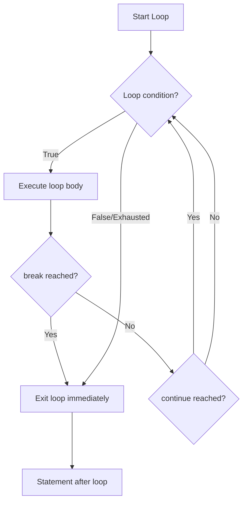

# break Statement — Junior Level

## 1. What is `break`?

`break` is a control flow statement that immediately exits the innermost `for` loop, `switch` statement, or `select` block.

```go
package main

import "fmt"

func main() {
    for i := 0; i < 10; i++ {
        if i == 5 {
            break // exit loop when i reaches 5
        }
        fmt.Println(i)
    }
    fmt.Println("Loop ended")
}
// Output: 0, 1, 2, 3, 4, Loop ended
```

---

## 2. Basic Syntax

```go
break
```

When executed, `break` jumps to the statement immediately after the loop or switch.

---

## 3. break in a for Loop

```go
package main

import "fmt"

func main() {
    numbers := []int{3, 7, 2, 9, 4, 1}
    target := 9
    found := false

    for _, n := range numbers {
        if n == target {
            found = true
            break // no need to continue searching
        }
    }

    if found {
        fmt.Println("Found", target)
    } else {
        fmt.Println("Not found")
    }
}
```

---

## 4. break in a for range Loop

```go
package main

import "fmt"

func main() {
    words := []string{"apple", "banana", "cherry", "stop", "date", "fig"}

    for i, word := range words {
        if word == "stop" {
            fmt.Printf("Stopped at index %d\n", i)
            break
        }
        fmt.Println(word)
    }
}
// apple
// banana
// cherry
// Stopped at index 3
```

---

## 5. break Exits the Innermost Loop

When you have nested loops, `break` only exits the innermost (closest enclosing) loop:

```go
package main

import "fmt"

func main() {
    for i := 0; i < 3; i++ {
        for j := 0; j < 3; j++ {
            if j == 1 {
                break // exits ONLY the inner for-j loop
            }
            fmt.Printf("(%d,%d) ", i, j)
        }
    }
    fmt.Println()
}
// Output: (0,0) (1,0) (2,0)
// j loop breaks at j=1, i loop continues
```

---

## 6. break in switch (Important!)

`break` in a `switch` case exits the switch, NOT an outer for loop:

```go
package main

import "fmt"

func main() {
    for i := 0; i < 5; i++ {
        switch i {
        case 3:
            break // exits switch, NOT the for loop!
        }
        fmt.Println(i) // prints ALL values: 0, 1, 2, 3, 4
    }
}
```

This is a very common source of confusion for beginners.

---

## 7. Using a Flag Variable Instead of break in switch

To exit a loop from inside a switch, you can use a boolean flag:

```go
package main

import "fmt"

func main() {
    done := false
    for i := 0; i < 10; i++ {
        switch {
        case i == 3:
            done = true
        }
        if done {
            break // exits the for loop
        }
        fmt.Println(i)
    }
}
// 0, 1, 2
```

---

## 8. Labeled break — Exit Outer Loop

Use a label to break out of an outer loop:

```go
package main

import "fmt"

func main() {
OuterLoop:
    for i := 0; i < 3; i++ {
        for j := 0; j < 3; j++ {
            if i == 1 && j == 1 {
                break OuterLoop // exits the outer for loop
            }
            fmt.Printf("(%d,%d) ", i, j)
        }
    }
    fmt.Println()
}
// Output: (0,0) (0,1) (0,2) (1,0)
```

---

## 9. How to Write a Label

Labels in Go:
- Are placed on the line directly before the statement they label
- Are followed by a colon `:`
- By convention, are written in ALLCAPS or PascalCase

```go
MyLabel:
for i := range s {
    if condition {
        break MyLabel
    }
}
```

---

## 10. break in while-style Loop

Go's `for` without conditions acts like a while-true loop. `break` is essential to exit:

```go
package main

import (
    "bufio"
    "fmt"
    "os"
    "strings"
)

func main() {
    scanner := bufio.NewScanner(os.Stdin)
    for {
        fmt.Print("Enter command (quit to exit): ")
        if !scanner.Scan() {
            break // exit on EOF
        }
        text := scanner.Text()
        if strings.TrimSpace(text) == "quit" {
            break // user requested exit
        }
        fmt.Println("You said:", text)
    }
    fmt.Println("Goodbye!")
}
```

---

## 11. Early Search Termination Pattern

A common pattern: search for something, break when found:

```go
package main

import "fmt"

func findIndex(s []string, target string) int {
    for i, v := range s {
        if v == target {
            return i // return also exits the loop
        }
    }
    return -1
}

func main() {
    cities := []string{"Paris", "London", "Tokyo", "Berlin"}
    idx := findIndex(cities, "Tokyo")
    fmt.Println("Tokyo at index:", idx) // 2
}
```

---

## 12. break vs return

| | `break` | `return` |
|---|---|---|
| Exits | Current loop/switch/select | Current function |
| Code after | Continues after loop | Nothing (function ends) |
| Return value | No | Can return a value |

```go
// Using break: continues after the loop
func findFirst(s []int, v int) int {
    idx := -1
    for i, x := range s {
        if x == v {
            idx = i
            break // exits loop, idx is set
        }
    }
    return idx
}

// Using return: exits function directly (cleaner)
func findFirst2(s []int, v int) int {
    for i, x := range s {
        if x == v {
            return i // cleaner!
        }
    }
    return -1
}
```

---

## 13. break in an Infinite Loop

Infinite loops often rely on `break` for termination:

```go
package main

import (
    "fmt"
    "math/rand"
)

func main() {
    count := 0
    for {
        count++
        n := rand.Intn(10)
        if n == 7 {
            fmt.Printf("Found 7 after %d attempts\n", count)
            break
        }
    }
}
```

---

## 14. Mermaid: break Control Flow



---

## 15. break in for range Over Channel

`break` exits the `for range` channel loop:

```go
package main

import "fmt"

func main() {
    ch := make(chan int, 5)
    for i := 1; i <= 5; i++ {
        ch <- i
    }
    close(ch)

    for v := range ch {
        if v == 3 {
            break // stop receiving after 3
        }
        fmt.Println(v)
    }
}
// Output: 1, 2
```

---

## 16. break vs continue

| Statement | Effect |
|---|---|
| `break` | Exits the loop entirely |
| `continue` | Skips to the next iteration |

```go
package main

import "fmt"

func main() {
    for i := 0; i < 5; i++ {
        if i == 2 {
            continue // skip 2, keep going
        }
        if i == 4 {
            break    // stop at 4
        }
        fmt.Println(i)
    }
}
// Output: 0, 1, 3
```

---

## 17. Practical Example: Validate Input

```go
package main

import "fmt"

func isValidOption(options []string, input string) bool {
    for _, opt := range options {
        if opt == input {
            return true
        }
    }
    return false
}

func main() {
    options := []string{"yes", "no", "maybe"}
    inputs := []string{"yes", "sure", "no", "unknown"}

    for _, input := range inputs {
        if isValidOption(options, input) {
            fmt.Printf("'%s' is valid\n", input)
        } else {
            fmt.Printf("'%s' is invalid\n", input)
        }
    }
}
```

---

## 18. break in select

`break` in `select` exits the select statement (not an outer for loop):

```go
package main

import (
    "fmt"
    "time"
)

func main() {
    tick := time.NewTicker(100 * time.Millisecond)
    defer tick.Stop()
    timeout := time.After(350 * time.Millisecond)

Done:
    for {
        select {
        case t := <-tick.C:
            fmt.Println("Tick at", t.Format("15:04:05.000"))
        case <-timeout:
            fmt.Println("Timed out!")
            break Done // labeled break to exit the for loop
        }
    }
    fmt.Println("Done")
}
```

---

## 19. When NOT to Use break

Avoid `break` when:
- A function `return` is cleaner (inside functions)
- Nested loops make `break` confusing (use labeled break or extract to function)

```go
// Less clear:
found := false
for _, v := range list {
    if condition(v) { found = true; break }
}
if found { doSomething() }

// Cleaner:
func findAndDo(list []int) {
    for _, v := range list {
        if condition(v) {
            doSomething()
            return // simpler
        }
    }
}
```

---

## 20. Common Beginner Mistake: break in switch inside for

```go
package main

import "fmt"

func main() {
    for i := 0; i < 5; i++ {
        switch i {
        case 3:
            fmt.Println("Found 3, breaking...")
            break // ONLY exits switch!
        }
        fmt.Println(i) // still prints 3!
    }
}
// Output: 0, 1, 2, Found 3 breaking..., 3, 4
```

---

## 21. Correct Way: Labeled break to Exit for from switch

```go
package main

import "fmt"

func main() {
Loop:
    for i := 0; i < 5; i++ {
        switch i {
        case 3:
            fmt.Println("Found 3, breaking out of loop!")
            break Loop // exits the FOR loop
        }
        fmt.Println(i)
    }
    fmt.Println("After loop")
}
// Output: 0, 1, 2, Found 3 breaking out of loop!, After loop
```

---

## 22. Practical: First Non-Zero Element

```go
package main

import "fmt"

func firstNonZero(s []int) (int, bool) {
    for _, v := range s {
        if v != 0 {
            return v, true
        }
    }
    return 0, false
}

func main() {
    fmt.Println(firstNonZero([]int{0, 0, 0, 5, 3})) // 5, true
    fmt.Println(firstNonZero([]int{0, 0, 0}))        // 0, false
}
```

---

## 23. Using break to Handle Errors

```go
package main

import (
    "fmt"
    "strconv"
)

func parseAll(strs []string) ([]int, error) {
    var result []int
    var firstErr error

    for _, s := range strs {
        n, err := strconv.Atoi(s)
        if err != nil {
            firstErr = err
            break // stop on first error
        }
        result = append(result, n)
    }
    return result, firstErr
}

func main() {
    nums, err := parseAll([]string{"1", "2", "bad", "4"})
    fmt.Println(nums, err) // [1 2], strconv error
}
```

---

## 24. Safety Guard: Max Iterations

```go
package main

import "fmt"

func main() {
    n := 27
    const maxIterations = 10000

    steps := 0
    for i := 0; i < maxIterations; i++ {
        if n == 1 {
            fmt.Printf("Reached 1 in %d steps\n", steps)
            break
        }
        if n%2 == 0 {
            n /= 2
        } else {
            n = 3*n + 1
        }
        steps++
    }
}
```

---

## 25. Nested Loop: Find in Matrix

```go
package main

import "fmt"

func findInMatrix(matrix [][]int, target int) (row, col int, found bool) {
    for r, rowSlice := range matrix {
        for c, val := range rowSlice {
            if val == target {
                return r, c, true
            }
        }
    }
    return -1, -1, false
}

func main() {
    m := [][]int{
        {1, 2, 3},
        {4, 5, 6},
        {7, 8, 9},
    }
    r, c, found := findInMatrix(m, 5)
    if found {
        fmt.Printf("Found at row=%d col=%d\n", r, c) // row=1 col=1
    }
}
```

---

## 26. break After Successful Operation

```go
package main

import (
    "fmt"
    "math/rand"
)

func tryUntilSuccess(maxTries int) {
    for i := 0; i < maxTries; i++ {
        success := rand.Intn(5) == 0 // 20% chance
        fmt.Printf("Try %d: ", i+1)
        if success {
            fmt.Println("SUCCESS!")
            break
        }
        fmt.Println("failed")
    }
}

func main() {
    tryUntilSuccess(10)
}
```

---

## 27. break in a Goroutine Loop

```go
package main

import (
    "fmt"
    "time"
)

func monitor(done <-chan struct{}) {
    ticker := time.NewTicker(100 * time.Millisecond)
    defer ticker.Stop()
    for {
        select {
        case <-done:
            fmt.Println("Monitor stopped")
            return // return exits the goroutine function
        case <-ticker.C:
            fmt.Println("Monitoring...")
        }
    }
}

func main() {
    done := make(chan struct{})
    go monitor(done)
    time.Sleep(350 * time.Millisecond)
    close(done)
    time.Sleep(50 * time.Millisecond)
}
```

---

## 28. Practical: Stop-Word Filtering

```go
package main

import (
    "fmt"
    "strings"
)

func containsStopWord(text string, stopWords []string) bool {
    lower := strings.ToLower(text)
    for _, word := range strings.Fields(lower) {
        for _, stop := range stopWords {
            if word == stop {
                return true // early exit
            }
        }
    }
    return false
}

func main() {
    stopWords := []string{"spam", "hack", "malware"}
    messages := []string{
        "Hello, how are you?",
        "Click here for spam offers",
        "Buy now discount!",
    }
    for _, msg := range messages {
        if containsStopWord(msg, stopWords) {
            fmt.Println("BLOCKED:", msg)
        } else {
            fmt.Println("OK:", msg)
        }
    }
}
```

---

## 29. Best Practices for break

```go
// DO: Use break for early termination in range
for _, item := range items {
    if item.IsReady() {
        process(item)
        break
    }
}

// DO: Use labeled break for nested loops when function extraction is impractical
Outer:
    for _, row := range matrix {
        for _, cell := range row {
            if cell == target {
                break Outer
            }
        }
    }

// PREFER: Use return when inside a helper function
func findTarget(items []Item) *Item {
    for i := range items {
        if items[i].IsReady() {
            return &items[i]
        }
    }
    return nil
}
```

---

## 30. Summary Table

| Situation | Statement to Use |
|---|---|
| Exit current for loop | `break` |
| Exit outer loop from inner | `break Label` |
| Exit loop from inside switch | `break Label` |
| Skip to next iteration | `continue` |
| Exit function | `return` |
| Exit select case | `break` (exits select, not outer for) |

**Key Rules:**
1. `break` exits the **innermost** loop/switch/select
2. `break` in `switch` does NOT exit an outer `for` loop
3. Use labeled `break` to exit outer loops from switch/select
4. `return` is often cleaner than `break + return` inside functions
5. Go switch cases don't fall through by default — no need for `break` in every case
6. Prefer extracting inner logic to a function over complex labeled break chains
