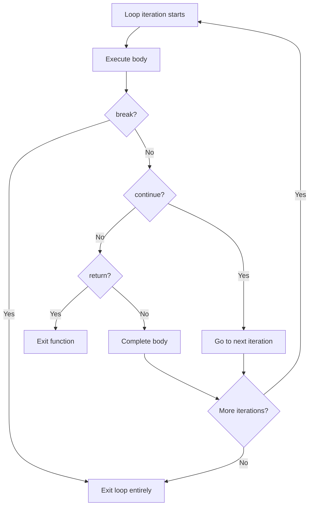
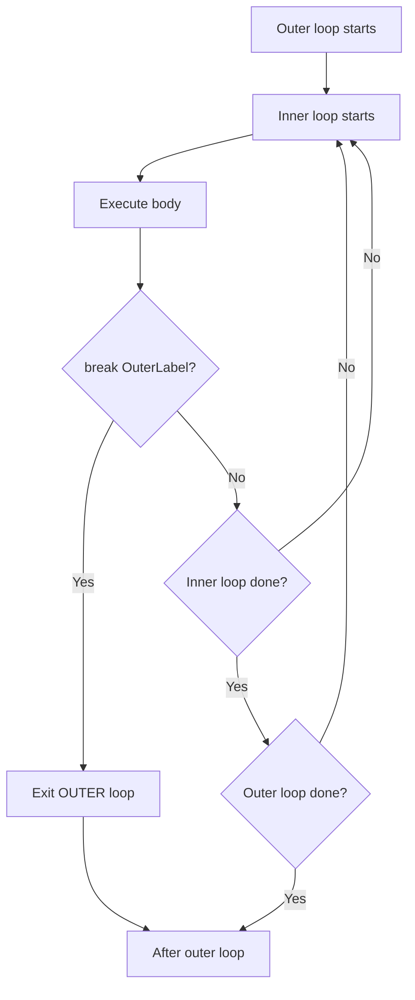

# break Statement — Middle Level

## 1. How break Works Internally

The `break` statement is compiled to an unconditional jump (`JMP`) instruction in the generated assembly. The compiler resolves the target address (the instruction after the loop/switch/select) at compile time.

```go
// Source
for i := 0; i < 10; i++ {
    if i == 5 { break }
    fmt.Println(i)
}

// Approximate assembly:
//   loop_start:
//     CMPQ i, 10
//     JGE  loop_end
//     CMPQ i, 5
//     JE   loop_end    <- break compiles to JMP to loop_end
//     CALL fmt.Println
//     INC  i
//     JMP  loop_start
//   loop_end:
```

---

## 2. Evolution of break in Go

| Go Version | Change |
|---|---|
| Go 1.0 | `break` works in `for`, `switch`, `select`; labeled break supported |
| Go 1.0 | No `fallthrough` by default in switch (unlike C) — `break` at end of switch case is implicit |
| Go 1.22 | Loop variable semantics changed; `break` behavior unchanged |
| Go 1.23 | Iterator functions with `yield`; breaking via returning `false` from yield |

---

## 3. Alternative Approaches to break

### Using return (preferred for functions)
```go
// Instead of:
func hasNegative(s []int) bool {
    found := false
    for _, v := range s {
        if v < 0 { found = true; break }
    }
    return found
}

// Use:
func hasNegative(s []int) bool {
    for _, v := range s {
        if v < 0 { return true }
    }
    return false
}
```

### Using `goto` (rarely used, avoid)
```go
// goto is legal in Go but discouraged
for i := 0; i < 10; i++ {
    if i == 5 { goto done }
    fmt.Println(i)
}
done:
```

### Extracting inner loop to a function
```go
// Instead of labeled break:
Outer:
    for _, row := range matrix {
        for _, cell := range row {
            if cell == 0 { break Outer }
        }
    }

// Extract and use return:
func hasZero(matrix [][]int) bool {
    for _, row := range matrix {
        for _, cell := range row {
            if cell == 0 { return true }
        }
    }
    return false
}
```

### Boolean flag variable
```go
// Instead of labeled break (when extraction is not possible):
done := false
for i := 0; i < n && !done; i++ {
    for j := 0; j < m && !done; j++ {
        if matrix[i][j] == 0 { done = true }
    }
}
```

---

## 4. Anti-Patterns

### Anti-Pattern 1: break in switch expecting to exit for loop
```go
// WRONG
for i := 0; i < 10; i++ {
    switch i {
    case 5:
        break // exits switch, i still increments and loop continues!
    }
    fmt.Println(i) // prints ALL 10 values
}

// CORRECT
Loop:
for i := 0; i < 10; i++ {
    switch i {
    case 5:
        break Loop // exits the for loop
    }
    fmt.Println(i)
}
```

### Anti-Pattern 2: Unreachable code after break
```go
for _, v := range s {
    if v == 0 {
        break
        fmt.Println("never reached") // dead code — compiler warning
    }
}
```

### Anti-Pattern 3: break instead of return in a function
```go
// Unnecessarily complex
func findFirst(s []int, pred func(int) bool) int {
    result := -1
    for i, v := range s {
        if pred(v) {
            result = i
            break
        }
    }
    return result
}

// Simpler with return
func findFirst(s []int, pred func(int) bool) int {
    for i, v := range s {
        if pred(v) { return i }
    }
    return -1
}
```

### Anti-Pattern 4: Deeply nested labeled break (unreadable)
```go
// Hard to follow — extract to functions instead
Outer:
    for _, a := range as {
    Middle:
        for _, b := range bs {
            for _, c := range cs {
                if condition(a, b, c) {
                    break Middle // which level? confusing
                }
            }
        }
    }
```

### Anti-Pattern 5: Using goto instead of labeled break
```go
// Avoid goto — labeled break is more readable
for i := 0; i < 10; i++ {
    for j := 0; j < 10; j++ {
        if i == j { goto end } // unstructured jump
    }
}
end:
```

---

## 5. Debugging Guide

### Debug: Loop doesn't stop when expected
```go
// Add print to verify break is reached
for i := 0; i < 10; i++ {
    if i == 5 {
        fmt.Println("break reached at", i) // verify
        break
    }
    fmt.Println("iteration", i)
}
```

### Debug: break in switch doesn't exit loop
```go
// Symptom: loop continues after case 5
for i := 0; i < 10; i++ {
    switch i {
    case 5: break // exits switch only!
    }
    fmt.Println(i) // still executes
}
// Fix: use labeled break or boolean flag
```

### Debug: Labeled break targets wrong statement
```go
// Labels must be on the correct statement
Outer:
for i := 0; i < 3; i++ {      // break Outer -> exits THIS for loop
    for j := 0; j < 3; j++ {
        if condition { break Outer }
    }
}
// Not:
for i := 0; i < 3; i++ {
    Inner:
    for j := 0; j < 3; j++ {  // break Inner -> exits THIS for loop
        if condition { break Inner }
    }
}
```

### Using go vet
```bash
go vet ./...
# Reports: "label X defined and not used"
# If label is defined but break never references it
```

---

## 6. Language Comparison

### Python
```python
# break works in for and while loops
for i in range(10):
    if i == 5: break
    print(i)

# for...else: else runs if loop wasn't broken
for i in range(10):
    if i == 5: break
else:
    print("No break") # not printed

# Python has no labeled break — use exception or function return
```

### JavaScript
```javascript
// Labeled break exists in JavaScript
outer:
for (let i = 0; i < 3; i++) {
    for (let j = 0; j < 3; j++) {
        if (i === 1 && j === 1) break outer;
    }
}

// Break in switch exits switch (same as Go)
for (let i = 0; i < 5; i++) {
    switch (i) {
    case 3: break; // exits switch only
    }
}
```

### Rust
```rust
// Rust: loop labels with 'label syntax
'outer: for i in 0..3 {
    for j in 0..3 {
        if i == 1 && j == 1 { break 'outer; }
    }
}

// Rust loop can return a value:
let x = loop {
    if condition { break 42; } // break with value
};
```

### Java
```java
// Java: labeled break
outer:
for (int i = 0; i < 3; i++) {
    for (int j = 0; j < 3; j++) {
        if (i == 1 && j == 1) break outer;
    }
}
// Switch requires explicit break (unlike Go)
switch (x) {
case 1: doA(); break;  // without break: falls through to case 2!
case 2: doB(); break;
}
```

**Key Go difference:** Go switch does NOT fall through by default (unlike Java/C). Each case implicitly breaks. Use `fallthrough` keyword for explicit fall-through.

---

## 7. break in Goroutine Event Loops

```go
package main

import (
    "context"
    "fmt"
    "time"
)

func worker(ctx context.Context, jobs <-chan int) {
    for {
        select {
        case <-ctx.Done():
            fmt.Println("Worker stopped:", ctx.Err())
            return // preferred over break + return
        case job, ok := <-jobs:
            if !ok {
                fmt.Println("Jobs channel closed")
                return
            }
            fmt.Println("Processing job:", job)
        }
    }
}

func main() {
    ctx, cancel := context.WithTimeout(context.Background(), 500*time.Millisecond)
    defer cancel()

    jobs := make(chan int, 10)
    for i := 1; i <= 5; i++ { jobs <- i }
    close(jobs)

    worker(ctx, jobs)
}
```

---

## 8. break in Generator Pattern

```go
package main

import "fmt"

// Generator using a channel — break stops receiving
func generate(max int) <-chan int {
    ch := make(chan int)
    go func() {
        for i := 0; i < max; i++ {
            ch <- i
        }
        close(ch)
    }()
    return ch
}

func main() {
    gen := generate(100)
    for v := range gen {
        if v >= 10 {
            break // stop consuming after first 10
        }
        fmt.Println(v)
    }
    // Note: generator goroutine may be blocked trying to send!
    // For production: use context cancellation or a done channel
}
```

---

## 9. Mermaid: break vs continue vs return



---

## 10. break in select with timeout

```go
package main

import (
    "fmt"
    "time"
)

func processWithTimeout(jobs <-chan string, timeout time.Duration) {
    deadline := time.After(timeout)
Loop:
    for {
        select {
        case job, ok := <-jobs:
            if !ok {
                fmt.Println("All jobs done")
                break Loop
            }
            fmt.Println("Processing:", job)
        case <-deadline:
            fmt.Println("Timeout reached")
            break Loop // labeled break exits the for loop
        }
    }
    fmt.Println("Done")
}

func main() {
    jobs := make(chan string, 3)
    jobs <- "job1"
    jobs <- "job2"
    jobs <- "job3"
    close(jobs)
    processWithTimeout(jobs, 1*time.Second)
}
```

---

## 11. break with WaitGroup Pattern

```go
package main

import (
    "fmt"
    "sync"
)

func processUntilError(items []int) error {
    var wg sync.WaitGroup
    errCh := make(chan error, len(items))

    for _, item := range items {
        item := item
        wg.Add(1)
        go func() {
            defer wg.Done()
            if item < 0 {
                errCh <- fmt.Errorf("negative item: %d", item)
                return
            }
            fmt.Println("Processed:", item)
        }()
    }

    wg.Wait()
    close(errCh)

    for err := range errCh {
        if err != nil {
            return err // first error
        }
    }
    return nil
}

func main() {
    err := processUntilError([]int{1, 2, -3, 4})
    fmt.Println("Error:", err)
}
```

---

## 12. break as Circuit Breaker Pattern

```go
package main

import (
    "fmt"
    "time"
)

type CircuitBreaker struct {
    failures  int
    threshold int
    resetAt   time.Time
}

func (cb *CircuitBreaker) Call(fn func() error) error {
    if cb.failures >= cb.threshold && time.Now().Before(cb.resetAt) {
        return fmt.Errorf("circuit open: too many failures")
    }

    err := fn()
    if err != nil {
        cb.failures++
        cb.resetAt = time.Now().Add(30 * time.Second)
    } else {
        cb.failures = 0
    }
    return err
}

func processWithCircuitBreaker(items []string) {
    cb := &CircuitBreaker{threshold: 3}
    for _, item := range items {
        err := cb.Call(func() error {
            return callExternalAPI(item)
        })
        if err != nil {
            fmt.Println("Error:", err)
            if cb.failures >= cb.threshold {
                fmt.Println("Circuit open — stopping")
                break // break here to stop processing more items
            }
        }
    }
}

func callExternalAPI(item string) error { return nil }

func main() {
    processWithCircuitBreaker([]string{"a", "b", "c", "d"})
}
```

---

## 13. Performance Considerations

```go
// break has zero runtime overhead beyond the JMP instruction
// The compiler may optimize the jump away entirely if:
// 1. The condition is always true (dead code elimination)
// 2. The loop runs 0 times (condition never true)

// Example where compiler optimizes break away:
const alwaysBreak = true
for i := 0; i < 10; i++ {
    if alwaysBreak { break } // compiler may emit just 0 iterations
}

// Branch prediction: if break is rarely taken (e.g., found at end of large slice),
// the CPU branch predictor assumes "not breaking" and speculates ahead
// For frequent early breaks (element found in first few positions),
// prediction misses are negligible since we break early anyway
```

---

## 14. break in Testing Loop

```go
package main

import (
    "fmt"
    "testing"
)

func TestFindFirst(t *testing.T) {
    cases := []struct {
        input  []int
        target int
        want   int
    }{
        {[]int{1, 2, 3}, 2, 1},
        {[]int{5, 6, 7}, 9, -1},
    }

    for _, tc := range cases {
        got := findFirst(tc.input, tc.target)
        if got != tc.want {
            t.Errorf("findFirst(%v, %d) = %d, want %d", tc.input, tc.target, got, tc.want)
        }
    }
}

func findFirst(s []int, target int) int {
    for i, v := range s {
        if v == target { return i }
    }
    return -1
}

func main() {
    fmt.Println(findFirst([]int{1, 2, 3}, 2)) // 1
}
```

---

## 15. break with Error Accumulation

```go
package main

import "fmt"

type ValidationError struct {
    Field   string
    Message string
}

func validateAll(fields map[string]string) []ValidationError {
    var errors []ValidationError
    for field, value := range fields {
        if value == "" {
            errors = append(errors, ValidationError{field, "cannot be empty"})
        }
        if len(value) > 100 {
            errors = append(errors, ValidationError{field, "too long"})
        }
    }
    // No break here — collect ALL errors
    return errors
}

func validateFirstError(fields map[string]string) *ValidationError {
    for field, value := range fields {
        if value == "" {
            return &ValidationError{field, "cannot be empty"}
        }
    }
    return nil
}

func main() {
    fields := map[string]string{"name": "", "email": "user@example.com"}
    fmt.Println(validateAll(fields))
    fmt.Println(validateFirstError(fields))
}
```

---

## 16. break in Iterator Functions (Go 1.23+)

```go
package main

import (
    "fmt"
    "iter"
)

func IntsUpTo(n int) iter.Seq[int] {
    return func(yield func(int) bool) {
        for i := 0; i < n; i++ {
            if !yield(i) {
                return // "break" in the consumer translates to yield returning false
            }
        }
    }
}

func main() {
    for v := range IntsUpTo(100) {
        if v >= 5 {
            break // this causes yield to return false in the iterator
        }
        fmt.Println(v) // 0 1 2 3 4
    }
}
```

---

## 17. Mermaid: Labeled break Flow



---

## 18. Retry Pattern with break

```go
package main

import (
    "fmt"
    "time"
)

func withRetry(maxRetries int, fn func() error) error {
    var lastErr error
    for i := 0; i < maxRetries; i++ {
        if i > 0 {
            time.Sleep(time.Duration(i*100) * time.Millisecond)
        }
        err := fn()
        if err == nil {
            break // success — exit retry loop
        }
        lastErr = err
        fmt.Printf("Attempt %d failed: %v\n", i+1, err)
    }
    return lastErr
}

func main() {
    attempts := 0
    err := withRetry(5, func() error {
        attempts++
        if attempts < 3 {
            return fmt.Errorf("not ready")
        }
        fmt.Println("Success on attempt", attempts)
        return nil
    })
    fmt.Println("Final error:", err)
}
```

---

## 19. break in Data Pipeline

```go
package main

import "fmt"

type Record struct {
    ID    int
    Valid bool
    Value float64
}

func processPipeline(records []Record) ([]float64, error) {
    var results []float64
    for _, r := range records {
        if !r.Valid {
            return results, fmt.Errorf("invalid record ID=%d", r.ID)
        }
        results = append(results, r.Value*2)
    }
    return results, nil
}

func main() {
    records := []Record{
        {1, true, 10.0},
        {2, true, 20.0},
        {3, false, 0.0}, // invalid
        {4, true, 40.0},
    }
    res, err := processPipeline(records)
    fmt.Println(res, err)
    // [20 40] invalid record ID=3
}
```

---

## 20. Summary: Middle-Level break Insights

| Topic | Key Insight |
|---|---|
| Compilation | JMP instruction to post-loop address |
| switch fallthrough | Go switch does NOT fall through; break is implicit per case |
| break in switch inside for | `break` exits switch only — use labeled break or return |
| Iterator (1.23+) | `break` causes `yield` to return `false` |
| Alternatives | `return`, function extraction, flag variable, `goto` (rare) |
| Python `for...else` | Go has no equivalent; use a flag variable |
| Rust `break value` | Go break does not return a value |
| Anti-pattern | Nested labeled breaks — prefer function extraction |
