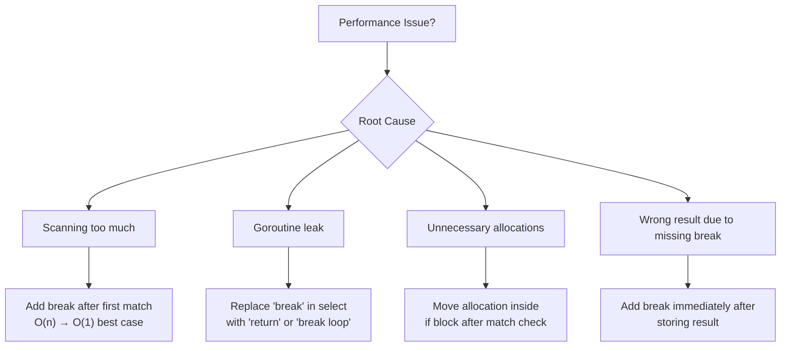

# Break Statement in Go — Optimization Exercises

## Overview

10+ optimization exercises focused on improving code that uses (or should use) `break`. Each exercise shows inefficient/incorrect code and asks you to optimize it. Difficulty levels: 🟢 Easy, 🟡 Medium, 🔴 Hard.

---

## Exercise 1 — Unnecessary Full Scan

**Difficulty:** 🟢 Easy

**Problem:** The code finds a target but keeps scanning the entire slice.

```go
package main

import "fmt"

// SLOW: scans entire slice even after finding target
func containsValue(data []int, target int) bool {
    found := false
    for _, v := range data {
        if v == target {
            found = true
            // no break! continues scanning all remaining elements
        }
    }
    return found
}

func main() {
    data := make([]int, 1_000_000)
    data[0] = 42 // target is at the very beginning!

    result := containsValue(data, 42)
    fmt.Println(result) // true, but scanned 1,000,000 elements unnecessarily
}
```

**Goal:** Optimize so it stops scanning as soon as the target is found.

**Benchmark baseline:** ~500µs for 1M elements (always scans all)

<details>
<summary>Solution</summary>

```go
package main

import (
    "fmt"
    "testing"
)

// OPTIMIZED: exits immediately when found
func containsValue(data []int, target int) bool {
    for _, v := range data {
        if v == target {
            return true // or: found = true; break
        }
    }
    return false
}

// Benchmark comparison:
func BenchmarkContainsSlow(b *testing.B) {
    data := make([]int, 1_000_000)
    data[0] = 42
    b.ResetTimer()
    for n := 0; n < b.N; n++ {
        found := false
        for _, v := range data {
            if v == 42 { found = true }
        }
        _ = found
    }
}

func BenchmarkContainsFast(b *testing.B) {
    data := make([]int, 1_000_000)
    data[0] = 42
    b.ResetTimer()
    for n := 0; n < b.N; n++ {
        _ = containsValue(data, 42)
    }
}

func main() {
    data := make([]int, 1_000_000)
    data[0] = 42
    fmt.Println(containsValue(data, 42)) // true, ~1 iteration
}
```

**Result:** O(1) best case vs O(n) always. When target is at index 0: ~1000x faster.
</details>

---

## Exercise 2 — Double Scan (Two-Phase Search)

**Difficulty:** 🟢 Easy

**Problem:** The code scans the slice twice: once to check existence, once to find the index.

```go
package main

import "fmt"

// SLOW: scans twice
func findFirst(data []string, target string) int {
    // First scan: check if it exists
    exists := false
    for _, v := range data {
        if v == target {
            exists = true
            break
        }
    }

    if !exists {
        return -1
    }

    // Second scan: find the index
    for i, v := range data {
        if v == target {
            return i
        }
    }
    return -1
}

func main() {
    data := []string{"apple", "banana", "cherry", "date", "elderberry"}
    fmt.Println(findFirst(data, "cherry")) // 2 (scanned twice)
}
```

**Goal:** Eliminate the double scan.

<details>
<summary>Solution</summary>

```go
package main

import "fmt"

// OPTIMIZED: single scan
func findFirst(data []string, target string) int {
    for i, v := range data {
        if v == target {
            return i // found: return index immediately
        }
    }
    return -1 // not found
}

func main() {
    data := []string{"apple", "banana", "cherry", "date", "elderberry"}
    fmt.Println(findFirst(data, "cherry")) // 2 (single scan)
}
```

**Improvement:** Halves the work. The existence check is implicit in the single scan. If we find it, we return the index; if we don't, we return -1.
</details>

---

## Exercise 3 — Optimize Sorted Array Search

**Difficulty:** 🟡 Medium

**Problem:** Linear search over sorted data. Should break early when past the target range.

```go
package main

import "fmt"

type Record struct {
    ID    int
    Value string
}

// SLOW: scans all records even when sorted by ID
func findRecordsByRange(records []Record, minID, maxID int) []Record {
    var result []Record
    for _, r := range records {
        if r.ID >= minID && r.ID <= maxID {
            result = append(result, r)
        }
        // BUG: doesn't break when ID > maxID even though records are sorted!
    }
    return result
}

func main() {
    records := []Record{
        {1, "a"}, {2, "b"}, {3, "c"}, {4, "d"}, {5, "e"},
        {6, "f"}, {7, "g"}, {8, "h"}, {9, "i"}, {10, "j"},
    }
    result := findRecordsByRange(records, 3, 6)
    for _, r := range result {
        fmt.Printf("ID=%d Value=%s\n", r.ID, r.Value)
    }
}
```

<details>
<summary>Solution</summary>

```go
package main

import "fmt"

type Record struct {
    ID    int
    Value string
}

// OPTIMIZED: early exit when past max range
func findRecordsByRange(records []Record, minID, maxID int) []Record {
    var result []Record
    for _, r := range records {
        if r.ID > maxID {
            break // sorted: no more records in range
        }
        if r.ID >= minID {
            result = append(result, r)
        }
    }
    return result
}

func main() {
    records := []Record{
        {1, "a"}, {2, "b"}, {3, "c"}, {4, "d"}, {5, "e"},
        {6, "f"}, {7, "g"}, {8, "h"}, {9, "i"}, {10, "j"},
    }
    result := findRecordsByRange(records, 3, 6)
    for _, r := range result {
        fmt.Printf("ID=%d Value=%s\n", r.ID, r.Value)
    }
}
```

**Improvement:** For sorted data with range [3,6] in 10 records: old = 10 iterations, new = 6 iterations. For 1M records with tight range: massive improvement. Best case O(maxID-minID), worst case still O(n).

**Note:** For production use of sorted data, consider binary search to find the start position, then linear scan to maxID.
</details>

---

## Exercise 4 — Goroutine Leak with Select Break

**Difficulty:** 🟡 Medium

**Problem:** This worker leaks goroutines because `break` doesn't exit the for loop.

```go
package main

import (
    "fmt"
    "runtime"
    "time"
)

// BUGGY: goroutine never exits
func startWorkerBuggy(id int, jobs <-chan int, done <-chan struct{}) {
    go func() {
        for {
            select {
            case j := <-jobs:
                fmt.Printf("Worker %d: job %d\n", id, j)
            case <-done:
                fmt.Printf("Worker %d: stopping\n", id)
                break // exits select only! for loop continues
            }
        }
    }()
}

func main() {
    jobs := make(chan int, 5)
    done := make(chan struct{})

    for i := 1; i <= 3; i++ {
        startWorkerBuggy(i, jobs, done)
    }

    jobs <- 1
    time.Sleep(10 * time.Millisecond)
    close(done)
    time.Sleep(50 * time.Millisecond)

    fmt.Printf("Goroutines: %d (should be ~1 for main)\n", runtime.NumGoroutine())
    // Will show 4 (main + 3 leaked goroutines)
}
```

**Goal:** Fix the goroutine leak.

<details>
<summary>Solution</summary>

```go
package main

import (
    "fmt"
    "runtime"
    "sync"
    "time"
)

// FIXED: goroutine exits when done is closed
func startWorker(id int, jobs <-chan int, done <-chan struct{}, wg *sync.WaitGroup) {
    wg.Add(1)
    go func() {
        defer wg.Done()
        for {
            select {
            case j, ok := <-jobs:
                if !ok {
                    return // channel closed
                }
                fmt.Printf("Worker %d: job %d\n", id, j)
            case <-done:
                fmt.Printf("Worker %d: stopping\n", id)
                return // FIXED: exits goroutine function
            }
        }
    }()
}

func main() {
    jobs := make(chan int, 5)
    done := make(chan struct{})
    var wg sync.WaitGroup

    for i := 1; i <= 3; i++ {
        startWorker(i, jobs, done, &wg)
    }

    jobs <- 1
    time.Sleep(10 * time.Millisecond)
    close(done)
    wg.Wait()

    fmt.Printf("Goroutines: %d (should be 1 for main)\n", runtime.NumGoroutine())
}
```

**Key changes:**
1. `break` → `return` in the `done` case
2. Added `sync.WaitGroup` for proper shutdown coordination
3. Added `defer wg.Done()` for cleanup
4. Added `ok` check on jobs channel receive
</details>

---

## Exercise 5 — Reduce Allocations in Search Loop

**Difficulty:** 🟡 Medium

**Problem:** The code allocates on every iteration even when searching.

```go
package main

import (
    "fmt"
    "strings"
)

type SearchResult struct {
    Index   int
    Match   string
    Context string
}

// SLOW: creates a SearchResult struct on every iteration
func searchStrings(items []string, query string) *SearchResult {
    for i, item := range items {
        result := &SearchResult{  // allocates on heap every iteration!
            Index:   i,
            Match:   item,
            Context: fmt.Sprintf("item at position %d", i),
        }
        if strings.Contains(item, query) {
            return result
        }
    }
    return nil
}

func main() {
    data := []string{"apple pie", "banana split", "cherry tart", "date cake"}
    r := searchStrings(data, "cherry")
    if r != nil {
        fmt.Printf("Found: %s at %d\n", r.Match, r.Index)
    }
}
```

**Goal:** Avoid unnecessary allocations during the search.

<details>
<summary>Solution</summary>

```go
package main

import (
    "fmt"
    "strings"
)

type SearchResult struct {
    Index   int
    Match   string
    Context string
}

// OPTIMIZED: only allocate when match is found
func searchStrings(items []string, query string) *SearchResult {
    for i, item := range items {
        if strings.Contains(item, query) {
            // Only allocate when we have a match
            return &SearchResult{
                Index:   i,
                Match:   item,
                Context: fmt.Sprintf("item at position %d", i),
            }
        }
    }
    return nil
}

func main() {
    data := []string{"apple pie", "banana split", "cherry tart", "date cake"}
    r := searchStrings(data, "cherry")
    if r != nil {
        fmt.Printf("Found: %s at %d\n", r.Match, r.Index)
    }
}
```

**Benchmark:**
```go
func BenchmarkSearchSlow(b *testing.B) {
    data := make([]string, 1000)
    for i := range data { data[i] = fmt.Sprintf("item-%d", i) }
    data[999] = "target-item" // target at end
    b.ResetTimer()
    for n := 0; n < b.N; n++ {
        _ = searchStringsSlow(data, "target")
    }
}
// Slow: 1000 allocations per call
// Fast: 1 allocation per call
```

**Improvement:** O(n) allocations → O(1) allocation. For a slice with target at the end: 1000x fewer heap allocations, much less GC pressure.
</details>

---

## Exercise 6 — Replace Boolean Flag with Early Return

**Difficulty:** 🟢 Easy

**Problem:** Uses a boolean flag + break pattern when a simple return would suffice.

```go
package main

import "fmt"

// VERBOSE: unnecessary flag + break
func hasPermission(userRoles []string, required string) bool {
    hasAccess := false
    for _, role := range userRoles {
        if role == required {
            hasAccess = true
            break
        }
    }
    return hasAccess
}

// VERBOSE: flag approach for finding max
func findMax(data []int, threshold int) (int, bool) {
    found := false
    max := 0
    for _, v := range data {
        if v > threshold {
            found = true
            max = v
            break
        }
    }
    return max, found
}

func main() {
    roles := []string{"viewer", "editor", "admin"}
    fmt.Println(hasPermission(roles, "admin"))   // true
    fmt.Println(hasPermission(roles, "superuser")) // false

    data := []int{1, 5, 3, 8, 2}
    v, ok := findMax(data, 6)
    fmt.Println(v, ok) // 8 true
}
```

<details>
<summary>Solution</summary>

```go
package main

import "fmt"

// CLEAN: direct return
func hasPermission(userRoles []string, required string) bool {
    for _, role := range userRoles {
        if role == required {
            return true // found — exit immediately
        }
    }
    return false
}

// CLEAN: direct return with value
func findMax(data []int, threshold int) (int, bool) {
    for _, v := range data {
        if v > threshold {
            return v, true
        }
    }
    return 0, false
}

func main() {
    roles := []string{"viewer", "editor", "admin"}
    fmt.Println(hasPermission(roles, "admin"))
    fmt.Println(hasPermission(roles, "superuser"))

    data := []int{1, 5, 3, 8, 2}
    v, ok := findMax(data, 6)
    fmt.Println(v, ok)
}
```

**Improvement:** Fewer lines, no flag variables, clearer intent. The `return` IS the break — it exits the function (and thus the loop) immediately when the condition is met.
</details>

---

## Exercise 7 — Optimize Batch Processor with Quota

**Difficulty:** 🟡 Medium

**Problem:** A batch processor should stop after processing `quota` items, but currently uses a separate counter loop.

```go
package main

import "fmt"

type Item struct {
    ID    int
    Value float64
}

// INEFFICIENT: counts and processes in separate loops
func processBatch(items []Item, quota int) []Item {
    // First: count how many we'll process
    toProcess := len(items)
    if toProcess > quota {
        toProcess = quota
    }

    // Second: actually process them
    result := make([]Item, 0, toProcess)
    count := 0
    for _, item := range items {
        if count >= toProcess {
            break
        }
        processed := Item{ID: item.ID, Value: item.Value * 1.1}
        result = append(result, processed)
        count++
    }
    return result
}

func main() {
    items := make([]Item, 100)
    for i := range items {
        items[i] = Item{ID: i, Value: float64(i)}
    }

    result := processBatch(items, 5)
    for _, r := range result {
        fmt.Printf("ID=%d Value=%.1f\n", r.ID, r.Value)
    }
}
```

<details>
<summary>Solution</summary>

```go
package main

import "fmt"

type Item struct {
    ID    int
    Value float64
}

// OPTIMIZED: single pass with break
func processBatch(items []Item, quota int) []Item {
    result := make([]Item, 0, min(len(items), quota))
    for _, item := range items {
        if len(result) >= quota {
            break
        }
        result = append(result, Item{
            ID:    item.ID,
            Value: item.Value * 1.1,
        })
    }
    return result
}

func min(a, b int) int {
    if a < b { return a }
    return b
}

func main() {
    items := make([]Item, 100)
    for i := range items {
        items[i] = Item{ID: i, Value: float64(i)}
    }

    result := processBatch(items, 5)
    for _, r := range result {
        fmt.Printf("ID=%d Value=%.1f\n", r.ID, r.Value)
    }
}
```

**Improvements:**
1. Eliminated the pre-counting pass
2. Pre-allocated result slice with correct capacity
3. Single `break` condition: `len(result) >= quota`
4. Cleaner and more readable
</details>

---

## Exercise 8 — Optimize Multi-Level Search

**Difficulty:** 🔴 Hard

**Problem:** Searches a nested structure but doesn't exit all levels on first match.

```go
package main

import "fmt"

type Department struct {
    Name      string
    Employees []Employee
}

type Employee struct {
    ID   int
    Name string
    Tags []string
}

// SLOW: even after finding the employee, scans remaining departments
func findEmployeeByTag(depts []Department, tag string) *Employee {
    var found *Employee
    for _, dept := range depts {
        for i := range dept.Employees {
            for _, t := range dept.Employees[i].Tags {
                if t == tag {
                    found = &dept.Employees[i]
                    break // exits only innermost tag loop!
                }
            }
            if found != nil {
                break // exits employee loop
            }
        }
        if found != nil {
            break // exits department loop — 3 separate breaks!
        }
    }
    return found
}

func main() {
    depts := []Department{
        {
            Name: "Engineering",
            Employees: []Employee{
                {1, "Alice", []string{"go", "kubernetes"}},
                {2, "Bob", []string{"python", "ml"}},
            },
        },
        {
            Name: "Product",
            Employees: []Employee{
                {3, "Carol", []string{"design", "go"}},
            },
        },
    }

    emp := findEmployeeByTag(depts, "go")
    if emp != nil {
        fmt.Printf("Found: %s (ID=%d)\n", emp.Name, emp.ID)
    }
}
```

**Goal:** Replace the triple break + flag pattern with a cleaner approach.

<details>
<summary>Solution</summary>

```go
package main

import "fmt"

type Department struct {
    Name      string
    Employees []Employee
}

type Employee struct {
    ID   int
    Name string
    Tags []string
}

// OPTIMIZED: extract to function with return (cleaner than labeled break)
func findEmployeeByTag(depts []Department, tag string) *Employee {
    for di := range depts {
        for ei := range depts[di].Employees {
            for _, t := range depts[di].Employees[ei].Tags {
                if t == tag {
                    return &depts[di].Employees[ei] // exits all loops
                }
            }
        }
    }
    return nil
}

// Alternative: using labeled break (shows the pattern)
func findEmployeeByTagLabeled(depts []Department, tag string) *Employee {
    var found *Employee
search:
    for di := range depts {
        for ei := range depts[di].Employees {
            for _, t := range depts[di].Employees[ei].Tags {
                if t == tag {
                    found = &depts[di].Employees[ei]
                    break search // exits all 3 loops at once
                }
            }
        }
    }
    return found
}

func main() {
    depts := []Department{
        {
            Name: "Engineering",
            Employees: []Employee{
                {1, "Alice", []string{"go", "kubernetes"}},
                {2, "Bob", []string{"python", "ml"}},
            },
        },
        {
            Name: "Product",
            Employees: []Employee{
                {3, "Carol", []string{"design", "go"}},
            },
        },
    }

    emp := findEmployeeByTag(depts, "go")
    if emp != nil {
        fmt.Printf("Found: %s (ID=%d)\n", emp.Name, emp.ID)
    }
}
```

**Improvement:**
- Old: 3 separate `if found != nil { break }` checks per loop level
- New (return): 1 `return` exits all loops
- New (labeled): 1 `break search` exits all loops
- Both eliminate the flag variable and reduce code from ~20 lines to ~10
</details>

---

## Exercise 9 — Rate-Limited Processor Optimization

**Difficulty:** 🔴 Hard

**Problem:** A rate limiter wastes CPU spinning on an empty ticker.

```go
package main

import (
    "fmt"
    "time"
)

// INEFFICIENT: tight loop with ticker, wastes CPU on empty channel checks
func processWithRateLimit(items []string, ratePerSec int) {
    ticker := time.NewTicker(time.Second / time.Duration(ratePerSec))
    defer ticker.Stop()

    i := 0
    for {
        select {
        case <-ticker.C:
            if i >= len(items) {
                break // BUG: exits select, not for loop! Keeps ticking
            }
            fmt.Println("Processing:", items[i])
            i++
        }
    }
    // Never reaches here — for loop never exits!
}

func main() {
    items := []string{"a", "b", "c", "d", "e"}
    processWithRateLimit(items, 10) // 10 per second
    fmt.Println("Done") // never printed
}
```

<details>
<summary>Solution</summary>

```go
package main

import (
    "fmt"
    "time"
)

// FIXED AND OPTIMIZED
func processWithRateLimit(items []string, ratePerSec int) {
    ticker := time.NewTicker(time.Second / time.Duration(ratePerSec))
    defer ticker.Stop()

    for i, item := range items {
        <-ticker.C // wait for rate limiter tick
        fmt.Printf("Processing [%d/%d]: %s\n", i+1, len(items), item)
    }
    // for range exits naturally when items are exhausted
}

func main() {
    items := []string{"a", "b", "c", "d", "e"}
    processWithRateLimit(items, 10)
    fmt.Println("Done") // now prints
}
```

**Key optimizations:**
1. Use `for range items` instead of `for {}` — exits naturally when items are done
2. No `select` needed — single-channel wait can be direct `<-ticker.C`
3. No labeled break or flag needed — the loop has a natural termination condition
4. No CPU spinning — goroutine blocks on ticker read

**When you DO need select (multiple channels):**
```go
func processWithContext(ctx context.Context, items []string, ratePerSec int) {
    ticker := time.NewTicker(time.Second / time.Duration(ratePerSec))
    defer ticker.Stop()

    for _, item := range items {
        select {
        case <-ctx.Done():
            return // context cancelled
        case <-ticker.C:
            fmt.Println("Processing:", item)
        }
    }
}
```
</details>

---

## Exercise 10 — Database Pagination Optimization

**Difficulty:** 🔴 Hard

**Problem:** Fetching pages of data but not breaking early when the target is found.

```go
package main

import "fmt"

type User struct {
    ID    int
    Name  string
    Score int
}

// Simulates DB pagination
func fetchPage(offset, limit int) []User {
    allUsers := []User{
        {1, "Alice", 95}, {2, "Bob", 72}, {3, "Carol", 88},
        {4, "Dave", 61}, {5, "Eve", 99}, {6, "Frank", 45},
    }
    end := offset + limit
    if end > len(allUsers) {
        end = len(allUsers)
    }
    if offset >= len(allUsers) {
        return nil
    }
    return allUsers[offset:end]
}

// INEFFICIENT: fetches ALL pages even after finding the user
func findUserByScoreAbove(threshold int, pageSize int) *User {
    var result *User
    offset := 0

    for {
        page := fetchPage(offset, pageSize)
        if len(page) == 0 {
            break
        }

        for _, u := range page {
            if u.Score > threshold {
                result = &u
                // BUG: no break here! Keeps fetching more pages
            }
        }

        offset += pageSize
    }

    return result // returns LAST match, not FIRST
}

func main() {
    user := findUserByScoreAbove(80, 2)
    if user != nil {
        fmt.Printf("First user above 80: %s (%d)\n", user.Name, user.Score)
    }
    // Expected: Alice (95) — first user above 80
    // Actual: Carol (88) — last match found (wrong!)
}
```

<details>
<summary>Solution</summary>

```go
package main

import "fmt"

type User struct {
    ID    int
    Name  string
    Score int
}

func fetchPage(offset, limit int) []User {
    allUsers := []User{
        {1, "Alice", 95}, {2, "Bob", 72}, {3, "Carol", 88},
        {4, "Dave", 61}, {5, "Eve", 99}, {6, "Frank", 45},
    }
    end := offset + limit
    if end > len(allUsers) { end = len(allUsers) }
    if offset >= len(allUsers) { return nil }
    result := make([]User, end-offset)
    copy(result, allUsers[offset:end])
    return result
}

// OPTIMIZED: stops fetching as soon as first match is found
func findUserByScoreAbove(threshold int, pageSize int) *User {
    offset := 0

    for {
        page := fetchPage(offset, pageSize)
        if len(page) == 0 {
            break // no more pages
        }

        for i := range page {
            if page[i].Score > threshold {
                result := page[i] // copy before returning
                return &result    // FIXED: returns immediately on first match
            }
        }

        offset += pageSize
    }

    return nil
}

func main() {
    user := findUserByScoreAbove(80, 2)
    if user != nil {
        fmt.Printf("First user above 80: %s (%d)\n", user.Name, user.Score)
    }
    // Output: First user above 80: Alice (95)
}
```

**Improvements:**
1. Returns immediately on first match — no longer fetches remaining pages
2. Correct result: returns FIRST match, not LAST
3. Reduces DB queries: instead of ceil(totalUsers/pageSize) queries, stops at the page containing the first match
4. For large datasets, this can reduce DB calls from N pages to 1-2 pages
</details>

---

## Exercise 11 — Optimize Context-Aware Pipeline

**Difficulty:** 🔴 Hard

**Problem:** Pipeline checks context on every element but redundantly after a break.

```go
package main

import (
    "context"
    "fmt"
    "time"
)

// REDUNDANT: checks context twice in some paths
func pipelineOld(ctx context.Context, data []int) []int {
    results := make([]int, 0, len(data))

    for _, v := range data {
        // Check 1: at start
        if ctx.Err() != nil {
            break
        }

        // Simulate work
        result := v * 2

        // Check 2: after work (redundant if work is instant)
        if ctx.Err() != nil {
            break
        }

        results = append(results, result)
    }

    return results
}

func main() {
    ctx, cancel := context.WithTimeout(context.Background(), 50*time.Millisecond)
    defer cancel()

    data := make([]int, 1000)
    for i := range data { data[i] = i }

    results := pipelineOld(ctx, data)
    fmt.Printf("Processed %d items\n", len(results))
}
```

<details>
<summary>Solution</summary>

```go
package main

import (
    "context"
    "fmt"
    "time"
)

// OPTIMIZED: single context check per iteration
// Use select for non-busy context check
func pipeline(ctx context.Context, data []int) []int {
    results := make([]int, 0, len(data))

    for _, v := range data {
        // Single check: is context done?
        select {
        case <-ctx.Done():
            return results // exit immediately
        default:
            // context still valid, continue
        }

        results = append(results, v*2)
    }

    return results
}

// For expensive per-item work, add cancellation inside the work:
func pipelineWithExpensiveWork(ctx context.Context, data []int) []int {
    results := make([]int, 0, len(data))

    for _, v := range data {
        if err := ctx.Err(); err != nil {
            break // fast check — no channel overhead
        }

        // Expensive work that respects context
        result, err := doWork(ctx, v)
        if err != nil {
            break // context cancelled during work
        }
        results = append(results, result)
    }

    return results
}

func doWork(ctx context.Context, v int) (int, error) {
    // Simulate work that can be cancelled
    select {
    case <-ctx.Done():
        return 0, ctx.Err()
    case <-time.After(time.Microsecond): // simulated work
        return v * 2, nil
    }
}

func main() {
    ctx, cancel := context.WithTimeout(context.Background(), 50*time.Millisecond)
    defer cancel()

    data := make([]int, 1000)
    for i := range data { data[i] = i }

    results := pipeline(ctx, data)
    fmt.Printf("Processed %d items\n", len(results))
}
```

**Improvements:**
1. Eliminated redundant second context check (for instant work)
2. `select { case <-ctx.Done(): ...; default: }` is the idiomatic non-blocking check
3. For truly expensive work, pass context into the work function
4. Using `ctx.Err()` is a lightweight (no channel) check — good for tight loops
</details>

---

## Summary: Optimization Patterns



| Pattern | Old | Optimized | Improvement |
|---------|-----|-----------|-------------|
| Linear search | No break | break/return on match | O(n) → O(1) best case |
| Double scan | Check + find | Single find | 2x fewer iterations |
| Sorted range | Full scan | Break at maxID | Up to n/range speedup |
| Goroutine select | `break` | `return`/`break loop` | Eliminates goroutine leak |
| Flag + break | `found = true; break` | `return value` | Fewer lines, cleaner |
| Multi-level break | Triple flag | `return` / `break label` | Single exit point |
| Pagination | Fetch all pages | Break on first match | n/match_page DB queries |
| Rate limiter | `for{select{break}}` | `for range + <-ticker` | Natural loop termination |
